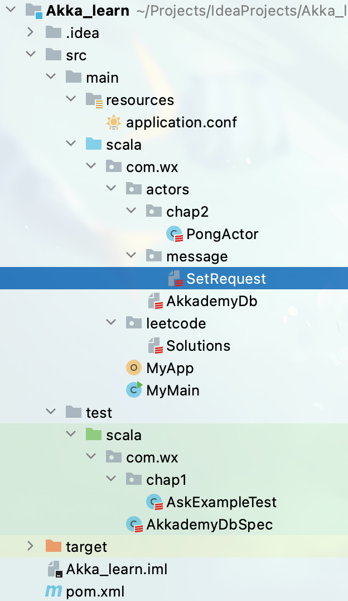
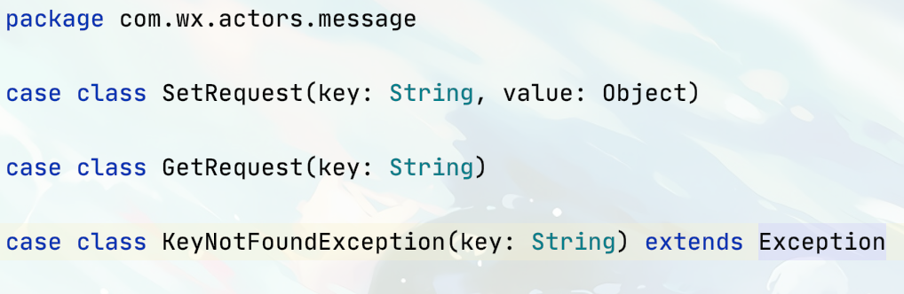
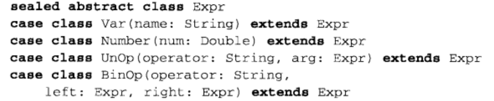
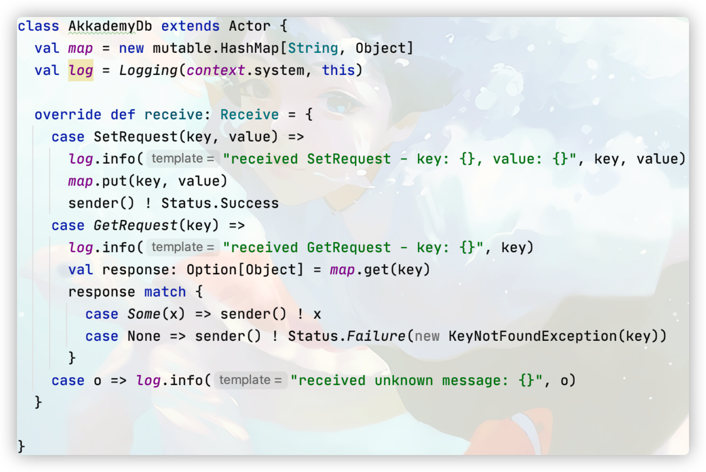
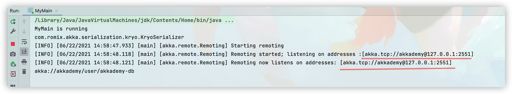
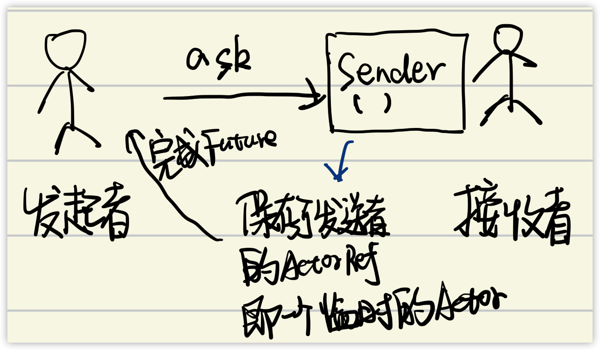
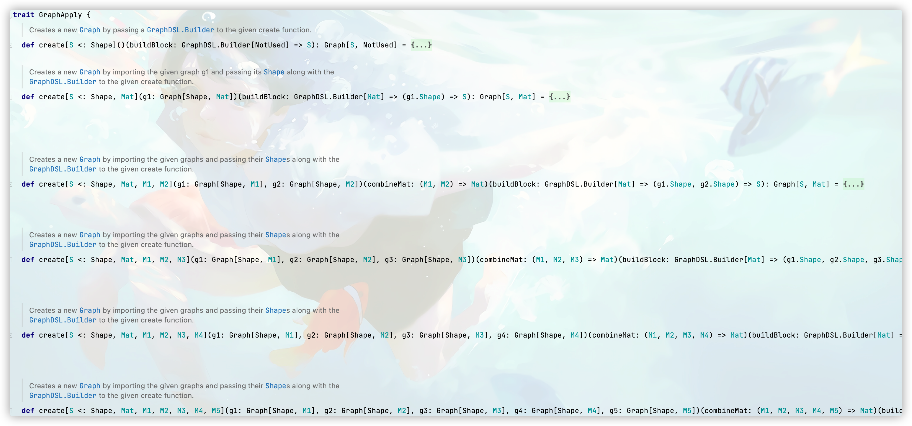

# 基本结构

## 目录结构



***

## Message



```scala
case class SetRequest(key: String, value: Object)
```

**样本类**：可以让$Scala$编译器自动为这个类添加一些语法上的便利

1. 添加与类名一致的工厂模式，**之前建对象需要new，现在可以直接使用SetRequest(x,x)来创建对象；**
2. 构造方法中的参数都是**val**，都是不可变的；
3. 编译器自动为case类添加了**tostring、hashcode、equals方法** *scala中==始终等同于equal*

***



**封闭类：**一旦写好了模式匹配，那么就确定了所有可能的情况，但是对于一个类的匹配则可能由于子类的继承导致几乎不可能提前确定所有情况，那么封闭类就出现了。

**就是让样本类继承被封闭的（`sealed`）的超类，那么这些样本类只可能被定义在这个超类的文件中，所以当你做模式匹配时就可以只考虑已经存在的子类**

***

## `Action`



一个类想要成为$Actor$需要混入$Actor \quad Trait$，那么就要实现`recevie()`方法，这个方法需要返回一个偏函数$PartialFunction$，用来定义接受到相对应消息后的处理。其中虽然recevie返回值是$Receive$，但它不过是一种偏函数的别名罢了。


**偏函数**：我们说所谓的偏函数本质上是**由多个`case`语句组成的针对每一种可能的参数分别进行处理的一种“结构较为特殊”的函数**，那特殊在什么地方呢？对，就是`case`语句，前面我们提到，**`case`语句声明的变量就是偏函数的参数，既然`case`语句只能声明一个变量，那么偏函数受限于此，也只能有一个参数！**说到底，**类型`PartialFunction`无非是为由一组`case`语句描述的函数字面量提供一个类型描述而已，`case`语句只接受一个参数，则偏函数的类型声明自然就只有一个参数。**

## 创建`Actor`

```scala
val sys = ActorSystem()
val actor:ActorRef = sys.actorOf(Props(classOf[XXXActor]))
```

创建`Actor`就是在`ActorSystem`中创建新的`Actor`并返回指向该`Acotr`的引用。`actorOf`会生成一个新的`Actor`，并返回指向该`Acotr`的引用。

### `Props`

```scala
Props(classOf[XXXAcotr], arg1, arg2, arg3...)
```

传入一个`Props`实例，以及一些参数用于构造`XXXActor`。

example：

```scala
val props = Props(classOf[Publisher], clientTopic, myTopic)
class Publisher(clientTopic: String, myTopic: String) extends Actor {}
```


## 测试方法


## `Promise、Future`

`Akka`的`ask`即`?`返回的是一个`Future`，类似`Java`中的`Future`。

# `Akka Remote`

需要引入：

```xml
<dependency>
      <groupId>com.typesafe.akka</groupId>
      <artifactId>akka-remote_${scala.binary.version}</artifactId>
      <version>${akka.version}</version>
    </dependency>
```

配置文件：

* Server端：

  ```yaml
  akka {
    actor {
    		# 开启远程服务（将这个actor暴露）
        provider = remote
        serializers {
          # config available serializers
          java = "akka.serialization.JavaSerializer"
          kryo = "com.romix.akka.serialization.kryo.KryoSerializer"
        }
        # Kryo settings 用于序列化
        kryo  {
          type = "graph"
          idstrategy = "explicit" #it must use explicit
          serializer-pool-size = 16
          buffer-size = 4096
          use-manifests = false
          implicit-registration-logging = true
          kryo-trace = false
          classes = [
            "com.wx.actors.message.SetRequest",
            "com.wx.actors.message.GetRequest"
          ]
        }
        serialization-bindings {
          "com.wx.actors.message.SetRequest"=kryo
          "com.wx.actors.message.GetRequest"=kryo
        }
      }
    remote {
      netty.tcp {
        hostname = "127.0.0.1"
        port = 2551
      }
    }
  
   }
  ```

  ```scala
  package com.wx.db
  
  import akka.actor.{Actor, ActorLogging, Status}
  import akka.event.Logging
  import com.wx.actors.message.{GetRequest, KeyNotFoundException, SetRequest}
  
  import scala.collection.mutable
  
  
  /**
   * @project : Akka_second
   * @author : weix
   * @file : AkkademyDb
   * @ide : IntelliJ IDEA
   * @time : 2021-06-15 15:32:27
   * */
  class AkkademyDb extends Actor with ActorLogging{
  
    val map = new mutable.HashMap[String, Object]
  
    override def receive: Receive = {
      case SetRequest(key, value) =>
        log.info("receive SetRequest -key {}, value {}", key, value)
        map.put(key, value)
        sender() ! Status.Success
      case GetRequest(key) =>
        log.info("received GetRequest -key:{}", key)
        val response: Option[Object] = map.get(key)
        response match {
          case Some(value) => sender() ! value
          case None => sender() ! Status.Failure(new KeyNotFoundException(key))
        }
      case o => log.info("received unknow message: {}", o);
    }
  }
  
  ```

  程序入口：

  ```scala
  object MyMain extends App{
    println("MyMain is running")
    // parseFile才会解析配置文件，load却不会
    val config = ConfigFactory.parseFile(new File("conf/serve.conf"))
    println(config.getConfig("akka.actor").getString("serializers.kryo"))
    val system = ActorSystem("akkademy", config)
    val ref = system.actorOf(Props[AkkademyDb], name = "akkademy-db")
    println(ref.path)
  }
  ```

  启动：

  

  可以看到开启了远程服务`akka.tcp//akkademy@127.0.0.1:2551`

* Client:

  ```yaml
  akka {
  
    actor.provider = remote
    
    # 配置端口，0为由系统分配
    remote.netty.tcp.port= 2556
    remote.netty.tcp.hostname=127.0.0.1
    serializers.java = "akka.serialization.JavaSerializer"
    serialization.kryo = "com.romix.akka.serialization.kryo.KryoSerializer"
    kryo  {
            type = "graph"
            idstrategy = "explicit" #it must use explicit
            serializer-pool-size = 16
            buffer-size = 4096
            use-manifests = false
            implicit-registration-logging = true
            kryo-trace = false
            classes = [
             "com.wx.actors.message.SetRequest",
             "com.wx.actors.message.GetRequest"
            ]
          }
    serialization-bindings {
            "com.wx.actors.message.SetRequest"=kryo
            "com.wx.actors.message.GetRequest"=kryo
          }
  }
  ```

  ```scala
  class SClient(remoteAddress: String) {
    private implicit val timeout = Timeout(2 seconds)
    val config = ConfigFactory.parseFile(new File("conf/serve.conf"))
    private implicit val system = ActorSystem("LocalSystem", config=config)
    private val remoteDb = 
    // 通过actor路径寻找服务
    system.actorSelection(s"akka.tcp://akkademy@$remoteAddress/user/akkademy-db")
  
    def set(key: String, value: Object) = {
      remoteDb ? SetRequest(key, value)
    }
  
    def get(key: String) = {
      remoteDb ? GetRequest(key)
    }
  }
  ```

  程序入口：

  ```scala
  package com.wx.db
  
  import com.wx.db.client.SClient
  import org.scalatest.{FunSpecLike, Matchers}
  
  import scala.concurrent.duration.DurationInt
  import scala.concurrent.Await
  import scala.language.postfixOps
  
  /**
   * @project : Akka_second
   * @author : weix
   * @file : SClientIntergrationSpec
   * @ide : IntelliJ IDEA
   * @time : 2021-06-15 16:57:35
   * */
  class SClientIntegrationSpec extends FunSpecLike with Matchers {
    val client = new SClient("127.0.0.1:2552")
    describe("akkademyDbClient") {
      it("should set a value") {
        client.set("123", new Integer(123))
        val future = client.get(key = "123")
        val res = Await.result(future, 10 seconds)
        res should equal(123)
      }
    }
  }
  
  ```

  

# 消息传递

`Actor`有4种消息传递机制。

* `Ask`：向`Actor`发送一条消息，返回一个`Future`。当`Actor`返回响应时，会完成`Future`。不会向消息发送者的邮箱返回任何消息。
* `Tell`：向`Acotr`发送一条消息。所有发送至`sender()`的所有响应都会返回给发送消息的`Actor`。
* `Forward`：将接收到的消息在转发给另一个`Actor`。所有发送至`sender()`的响应都会返回给原始消息的发送者。（没用过）
* `Pipe`：用于将`Future`的结果返回给`sender()`或另一个`Acotr`。如果正在使用`Ask`或者是处理一个`Future`，那么使用`Pipe`可以正确的返回`Future`的结果。

`Actor`需要消息不可变，引用不可变，所以一般都是使用`case class`来描述消息。

## `Ask`

在调用`ask`向`Acotr`发起请求时，`Akka`实际上会在`Actor`系统中创建一个临时的`Actor`。接收请求的`Actor`在返回响应时使用的`sender()`引用就是这个临时的`Actor`。当一个`Actor`接收到`ask`请求发来的消息并返回响应时，这个临时的`Actor`会使用返回的响应来完成`Future`。



```scala
val sum: Future[Int] = ???
// Scala的DSL
implicit val timeout = Timeout(5 seconds)
// 超时参数隐式传入
val r: Int = Await.result(sum, 3 seconds)
println(r)
```

### 性能开销

`Ask`模式看似简单，不过它是有隐藏的额外的性能开销。

首先，`ask`会导致`Akka`在`/temp`路径下新建一个临时`Acotr`。这个临时`Acotr`会等待从接收`ask`消息的`Acotr`返回的响应。

其次，`Future`也有额外的性能开销。`Ask`会创建`Future`，这由临时`Acotr`负责完成。

如果不需要：

* 状态与并发。
* 分布式。

那么最好不要使用`Acotr`。


## 超时错误的栈追踪信息无用

当发现超时错误时，抛出的错误信息基本无用，因为超时可能并不是发生问题的原因，可能只是一种表现。

当代码中发生错误时，一定要返回失败消息。如果一个`Acotr`抛出了异常，那么它是不会返回消息的。在`Acotr`中，代码的编写者负责实现所有消息处理逻辑：如果某个`Acotr`需要进行响应，`Akka`是不会隐式地做任何响应的。

## `Tell`

`fire-and-forget`:这是发送消息的推荐方式，不会阻塞地等待消息。它拥有最好的并发性和可扩展性。

无需指定发送者。

从一个`Actor`系统内部发送消息需要指定发送者，`scala`中有隐式参数。

```scala
// java
actor.tell(msg, self())
// scala
actor ! msg
```

不过在实际中，使用`tell`也可以指定其他的`sender`。所以可以通过一些具有创造性的响应地址用法将状态存储在`Actor`中。

在设计时，要获得更优秀的方案，就需要改变对于对象和`Actor`及其交互方式的看法。

如果在`Actor`中存储一些状态，并创建一些临时`Actor`来处理某些任务会使得设计便得简单。**这与函数式编程恰恰相反。**

## `Pipe`

```scala
val senderRef = sender()
future.map(x => senderRef ! x)
// or
futur.map(x => sender() ! x)
```

以上两种方式是不一样的，因为匿名函数中的`sender()`与外面的`sender()`并不一样。


# `Actor`的生命周期

`Actor`按照树形的层级结构来实现监督。 pass

## 生命周期

* `prestart()`：在构造函数之后调用。
* `postStop()`：在重启之前调用。
* `preRestart(reason, message)`：默认情况下会调用`postStop()`。
* `postRestart()`：默认情况下会调用`preStart()`。

> `preReStart()`和`postRestart()`只在重启的时候才会被调用。它们默认调用了`preStart()`和`postStop()`，但是调用它们的时候就不再调用`preStart()`和`postStop()`。

`Actor`启动：

1. `Constructor`。
2. `postRestart`。
3. `preStart`。
4. `receive`。
5. `Actor`被`kill`。
6. `preRestart`。
7. `postStop`。

## 生命周期监控和`DeathWatch`

监督机制描述了如何对子`Actor`的状态进行响应。而`Actor`也可以对其他任何`Actor`进行监督。通过调用`context.watch(actorRef)`注册后，`Actor`就能监控另一个`Actor`的终止，而调用`context.unwatch(actorRef)`就可以取消监控注册。

如果被监控的`Actor`停止了，负责监控的`Actor`就会收到一条`Terminated(ActorRef)`消息。

当`Actor`重启时，会调用`preRestart()`，然后原来的`Actor`就是停止。这时原来`Actor`内的所有状态就消失了。接着会新建一个`Actor`实例，运行新建的`Actor`的构造函数，然后调用`postRestart()`，`Actor`就完成启动并运行了。

如果`Actor`已经在运行，那么就能够安全地重现启动；但是如果无法完成初始化，就必须编写额外的代码实现监督策略，来处理`Actor`无法在启动时完成的操作（如连接数据库）。

很多时候，并不希望`Actor`在初始化的过程中发生错误，**而是会给`Actor`发送一条初始化消息，然后再`Actor`运行的过程中处理状态的变化。**

```scala
override def preStart = self ! activeMsg
```

这样依赖，`Actor`就只在运行中才可能会出现错误，而且能够成功重启。所以就可以不断尝试连接数据库直到连上为止。

## 状态变化

有几种机制可以改变`Actor`的行为：

* 基于`Actor`状态的条件语句。
* 热交换`Hotswap`：`become()`和`unbecome()`。
* 有限自动机`FSM`。

### 在状态之间暂存消息`stash`

`Actor`经常会处在一个无法处理某些消息的状态。*如果数据库客户端离线了，那么在重新上线之前，他都无法处理任何消息。可以选择不断重新建立客户端连接，直到连接成功为止。*

在这种情况下，在成功连接之前，客户端会丢弃收到的所有消息。另一种做法是吧客户端无法处理的消息先放在一旁，等到客户端回复连接状态之后再做处理。

```scala
if(cantHandlerMessage) {
  stash()
} else {
  handleMessage(message)
}

// unstash把消息从暂存队列中取出来
unstash()
```

> 虽然`stash()`和`unstash()`在希望快速改变状态的时候易于使用，但是`stash`消息的状态一定要和某个时间限制进行绑定，否则就有可能填满邮箱。

example：

```scala
var online = false
override def recive = {
  case x: GetRequest =>
  	if(online)
  		processMessage(x)
  	else
  		stash()
  case Connected =>
  	online = true
  	unstash()
  case DisConnected =>
  	online = false
}
```


### 热交换`Hotswap`：`become()`/`unbecome()`

* `become()`：这个方法将`receive`块中定义的行为修改一个新的`PartialFunction`。
* `unbecome()`：这个方法将`Actor`行为修改回默认行为。

example：

```scala
override def recive = {
  case x: GetRequest =>
  	stash()
  case Connected =>
  	become(online)
  	unstach()
}
def online: Receive = {
   case x: GetRequest =>
  	processMessage(x)
  case DisConnected =>
  	unbecome()
}
```

### `stash`泄露

当持续`stash`时，`Actor`会不断`stash`消息，最终导致内存耗尽或者邮箱开始丢弃消息，所以使用`stash`最好设置一个限制。

### 有限自动机`FSM`

pass


# `Akka Stream`

## 基础组件

### `Source`

数据源。数据的发布方，产生者，他的形状是只有一个输出端口。`Source`可以来自单值、集合或者某种`Publisher`。

### `Sink`

数据终端。数据流最终的去向，数据的使用方。消耗数据流中的元素。

### `Flow`

数据处理节点。对通过输入端口输入数据流的元素进行转变处理，一个进口，一个出口。


## 组件参数

```scala
Source[+Out, +Mat]       //Out代表元素类型，Mat为运算结果类型，即物化值
Flow[-In, +Out, +Mat]    //In,Out为数据流元素类型，Mat是运算结果类型
Sink[-In, +Mat]          //In是数据元素类型，Mat是运算结果类型
```

`Keep`对象提供的是对`Mat`的选择。

选择保留左边组件或者右边组件的物化值。

example：

```scala
val s1: Source[Int,NotUsed] = Source(1 to 10)
val sink: Sink[Any,Future[Done]] = Sink.foreach(println)
val rg1: RunnableGraph[NotUsed] = s1.to(sink)// to 选择保留s1的物化值，即NotUsed
val rg2: RunnableGraph[Future[Done]]  = s1.toMat(sink)(Keep.right)// 保留右边Sink的物化值，即Future[Done]
val res1: NotUsed = rg1.run()
```

> 其中`viaMat`用来连接`Flow`，`toMat`用来连接`Sink`，使用`Keep.right/Keep.left`来选择保留右边或者左边的物化值。
>
> `via`与`to`分别是`viaMat()(Keep.left)`与`toMat()(Keep.right)`的简写。

## 创建图

图有很多形状，`SourceShape`、`FlowShape`、`SinkShape`，这些都忽略了他们的物化值（可以通过`builder.materializedValue()`获得），还可以自定形状。

```scala
val graph: Graph[ClosedShape.type, NotUsed] = GraphDSL.create() { implicit builder: GraphDSL.Builder[NotUsed] =>
  import GraphDSL.Implicits._
  val in = Source(1 to 10)
  val out = Sink.ignore

  val bcast = builder.add(Broadcast[Int](2))
  val merge = builder.add(Merge[Int](2))

  val f1, f2, f3, f4 = Flow[Int].map(_ + 10)

  in ~> f1 ~> bcast ~> f2 ~> merge ~> f3 ~> out
  bcast ~> f4 ~> merge
  ClosedShape
}
// 从ClosedShape的图构建可运行的图
val g = RunnableGraph.fromGraph(graph)
```

 `GraphDSL` `akka`建图的领域语言，`create()`有多个重载的版本



可以通过参数传入

```scala
val topHeadSink = Sink.head[Int]
val bottomHeadSink = Sink.head[Int]
val sharedDoubler = Flow[Int].map(_ * 2)

RunnableGraph.fromGraph(GraphDSL.create(topHeadSink, bottomHeadSink)((_, _)) { implicit builder =>
  (topHS, bottomHS) =>
  import GraphDSL.Implicits._
  val broadcast = builder.add(Broadcast[Int](2))
  Source.single(1) ~> broadcast.in

  broadcast ~> sharedDoubler ~> topHS.in
  broadcast ~> sharedDoubler ~> bottomHS.in
  ClosedShape
})
```

也可以创建`FlowShape`与`SourceShape`、`SinkShape`。

```scala
/**
 * imported into the graph using [[builder.add(...)]], an operation that will make a copy of the blueprint that is passed to it and return the inlets and
 * outlets of the resulting copy so that they can be wired up
 *
 * importing using [[builder.add(...)]] ignores the materialized value of the imported graph while importing via the factory method allows its inclusion
 */
/**
	通过builder add将图加入一个空的构建器中，以便之后进行连接。
**/
// 说明是一个Flow,切说明了进来的数据的类型。
val kindAdder: FlowShape[MachineMsg, MachineMsgWithKind] = builder.add(Flow[MachineMsg].map(
        v => MachineMsgWithKind(v, v.getClass.toString.split(" ")(1))
      ))
```

