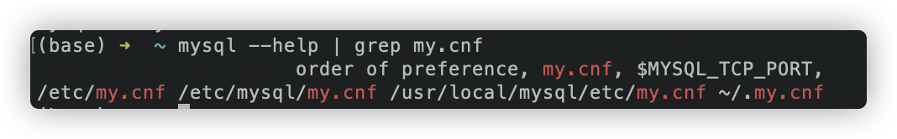
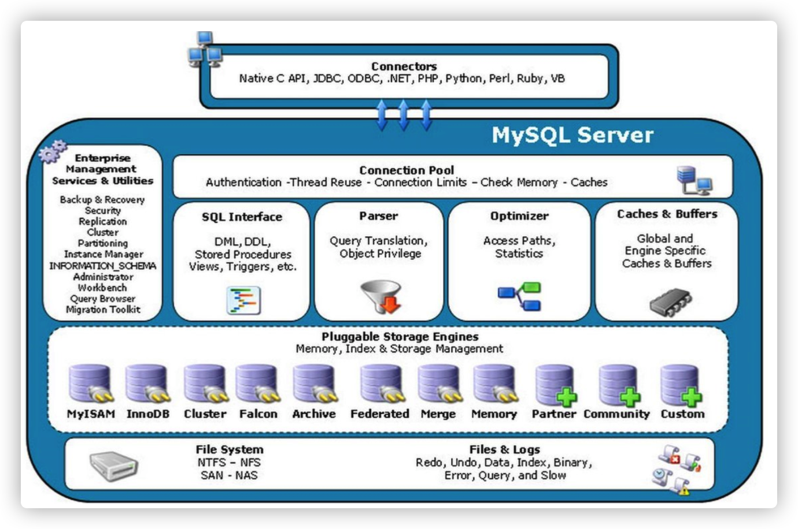
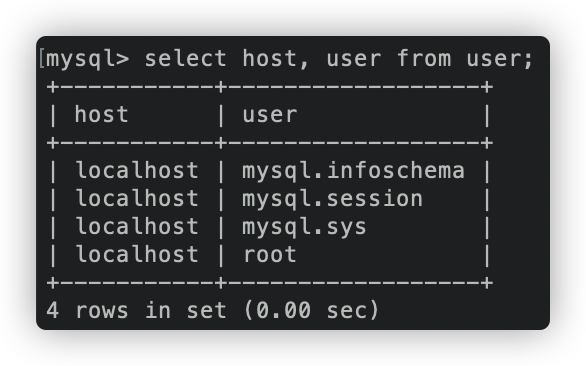
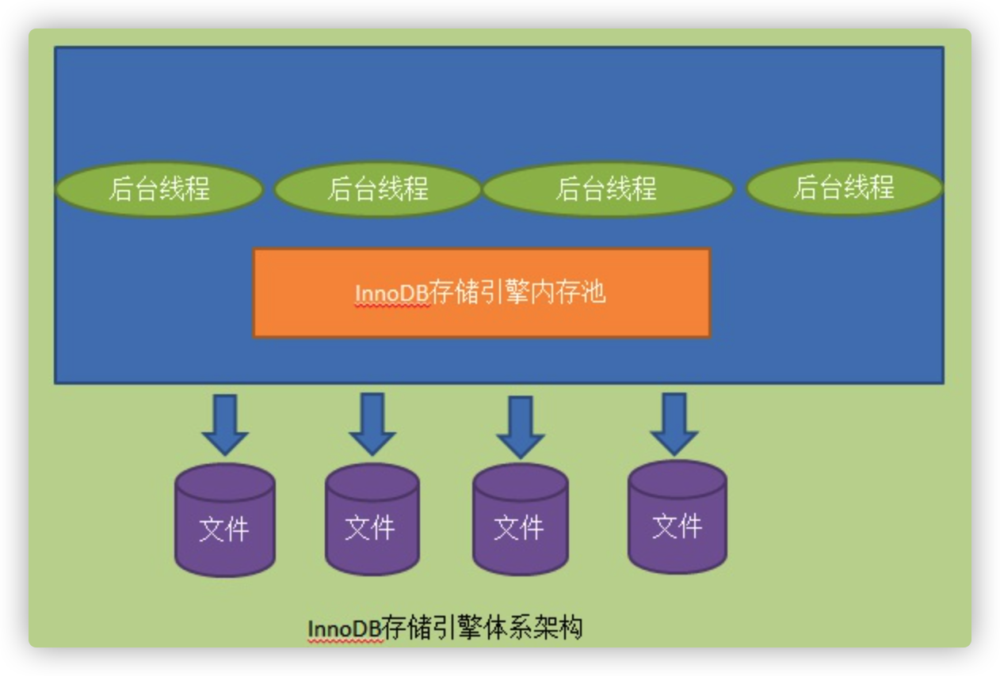
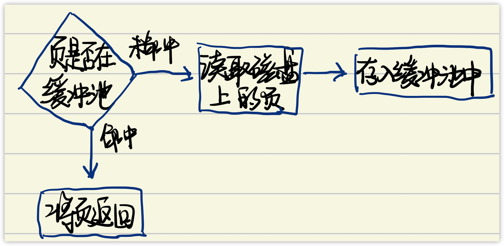
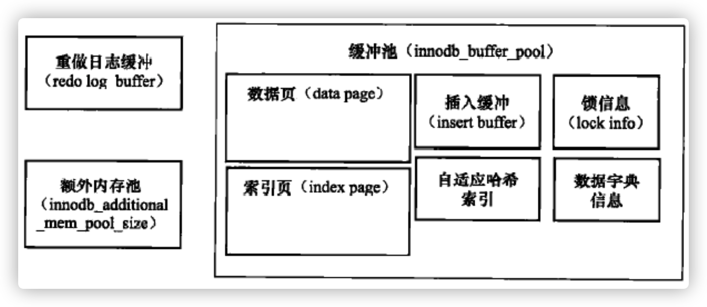

# `MySQL`体系结构和存储引擎

## 数据库与实例

* **数据库：**物理操作系统文件或其他文件类型的集合。数据库的文件可能不是操作系统上的文件，而是存放于内存之中的文件。

  > ​	数据库是文件的集合，是依照某种数据模型组织起来并存放于二级存储器中的数据集合

* **实例：**`MySQL`数据库由后台线程以及一个共享内存区组成。

  > ​	数据库实例是程序，是位于用户和操作系统之间的一层数据管理软件，用户对数据库中的数据做任何的操作，包括数据定义、数据查询、数据维护、数据库运行控制等等都是在数据库实例下进行的，应用程序只有通过数据库实例才能和数据库打交道。

这两个词有时可以互换使用，不过两者的概念完全不同。**在`MySQL`数据库中，实例与数据库的关系通常是一一对应的，即一个实力对应一个数据库，一个数据库对应一个实例。但是在集群情况下可能存在一个数据库被多个数据库实例使用的情况。**

`Linux`下启动`MySQL`实例：

```shell
mysqld_safe&
```

`MySQL`启动时，会去读取配置文件，根据配置文件的参数来启动数据库实例。

```sh
mysql --help | grep my.cnf
```



`MySQL`会按如上顺序读取配置文件，在存在重复参数的情况下，`MySQL`会以读取到的最后一个配置文件为准。

## `MySQL`体系结构

**数据库**是文件的集合，是依照某种数据模型组织起来并存放于二级存储器中的数据集合。

**数据库实例**是程序，是位于用户与操作系统之间的一层数据管理软件，用户对数据库的任何操作，包括数据库的定义、数据查询、数据维护、数据库运行控制等都是在数据库实例下进行的，应用程序只有通过数据库实例才能和数据库打交道。

`MySQL`体系结构图：



从上到下：

* 连接池组件
* 管理服务和工具组件
* `SQL`接口组件
* 查询分析器组件
* 优化器组件
* 缓存`Cache`组件
* 插件式存储引擎
* 物理文件

`MySQL`插件式存储引擎架构提供了一系列标准的管理和服务支持，这些标准与存储引擎本身无关，可能是每个数据本身都是必需的，**而存储引擎是底层物理结构的实现，每个存储引擎开发者可以按照自己的意愿来进行开发。**

**存储引擎是基于表的，而不是数据库。**

每个存储引擎都有自己的特点，可以根据具体的应用建立不同的存储引擎表。

用户可以根据`MySQL`预定义的恶存储引擎接口便携自己的存储引擎。

### `InnoDB`存储引擎

* 支持事物
* 设计目标面向`OLTP`在线事务处理的应用
* **行锁设计、支持外键**，并支持类似`Oracle`的非锁定读，即**默认操作不会产生锁**。

`InnoDB`存储引擎采用**聚集`clustered`**的方式，所以每张表都是按照主键的顺序进行存放。如果没有显式地在表定义时指定主键，`InnoDB`存储引擎会为每一行生成一个6字节的ROWID，并以此为主键。

### `MyISAM`存储引擎

* 不支持事务
* 面向`OLAP`联机分析处理数据库应用
* 表锁设计，支持全文索引
* 它的缓冲池只支持`Cache`索引文件

在数据仓库中，如果没有`ETL`*抽取(extract)、转换( transform )、加载( load )*操作，只是简单的报表查询，则不大需要事务的支持。

表由`MYD`和`MYI`组成：

* `MYD`用来存储数据文件
* `MYI`用来存放索引文件。

使用`MyISAM`存储引擎，`MySQL`数据库只缓存其索引文件，数据文件的缓冲交由操作系统本身来完成，这雨其他使用`LRU`算法缓存数据的大部分数据库大不相同。

### `NDB`存储引擎

pass

### `Memory`存储引擎

pass


## 连接`MySQL`

连接`MySQL`是一个连接进程和`MySQL`数据库实例进行通信。本质上是进程间的通信。

### `TCP/IP`

```shell
mysql -h host -u user -p pwd
```

`MySQL`数据库首先会检查一张权限表(`user`在`mysql`数据库下)，用来判断发起请求的客户端`IP`是否允许连接到`MySQL`实例。



可以看到`root`用户拥有在`localhost`下的访问权限。

### `UNIX`套接字

### 命名管道和共享内存


# `InnoDB`存储引擎

## 概述

是第一个完整支持`ACID`事务的`MySQL`存储引擎，行锁设计、支持`MVCC`、支持外键、提供一致性非锁定读，同时被设计用来最有效利用以及使用内存和`CPU`。

两个版本：

* 静态编译的`InnoDB`版本，视为老版本的`InnoDB`。
* 动态加载的`InnoDB`版本，为`InnoDB Plugin`。

## `InnoDB`体系结构

`InnoDB`引擎由多个内存块，可以认为这些内存快组成了一个大的内存池。



后台线程的主要作用是负责刷新内存池中的数据，保证缓冲池中的内存缓存的是最近的数据。此外将已修改的数据文件刷新到磁盘文件，同时保证在数据库发生异常情况下`InnoDB`能恢复到正常运行状态。

### 后台线程

#### `Master Thread`

一个非常核心的后台线程，**主要负责将缓冲池中的树一步刷新到磁盘，保证数据一致性。**

#### `IO Thread`

`InnoDB`引擎中大量使用了`AIO`来处理写`IO`请求，这样可以极大提高数据库性能。而`IO Thread`的工作主要是负责这些`IO`请求的回调处理。

并且，读线程的`ID`总是小于写线程。

#### `Purge Thread`

事务被提交后，它所使用的`undolog`可能不再需要，所以需要`Purge Thread`来回收已经使用并分配的`undo`页。

* `InnoDB1.1`之前，`purge`操作仅在`InnoDB`引擎的`Master Thread`中完成。
* `InnoDB1.1`之后，`purge`操作可以独立到单独的线程中进行。

从`InnoDB1.2`开始，`InnoDB`支持多个`purge Thread`，这样做的目的是进一步加快`undo`页的回收。同时由于`Purge Thread`需要离散地读取`undo`页，这样也进一步利用磁盘的随机读取性能。

#### `Page Cleaner Thread`

在`InnoDB1.2`中引入。作用是将之前版本中脏页的刷新操作都放入单独线程中来完成。其目的是为了减轻原`Master Thread`的工作及对于用户查询线程的阻塞，进一步提高`InnoDB`存储引擎的性能。

## 内存

### 缓冲池

一块内存区域，通过内存的速度来弥补磁盘速度较慢对数据库性能的影响。

* **读取页**

  

* **页的修改**

  ​	首先修改在缓冲池中的页，然后再以一定的频率刷新到磁盘上。当然页从缓冲池刷新会磁盘的操作并不是每次发生更新时触发，而是通过一种`CheckPoint`的机制刷新回磁盘。

## 内存数据



缓冲池中缓存的数据页类型有：索引页、数据页、`undo`页、插入缓存、自适应哈希索引、`InnoDB`存储的锁信息、数据字典信息等。而索引页和数据页只是缓冲池中一部分。

`InnoDB1.0`开始，允许有多个缓冲实例。每个页根据哈希值平均分配到不同缓冲池实例中。减少数据库内部的资源竞争，增加数据库的并发处理能力。

#### 内存管理

##### `LRU`

与传统的`LRU`略有不同，`InnoDB`的存储引擎中，`LRU`中加入`midpoint`位置。新读取到的页，虽然是最新访问的页，但并不是直接放入`LRU`列表的首部，而是放入到`LRU`列表的`midpoint`位置(称为`midpoint insertion strategy`)。在默认配置的情况下，该位置在`LRU`列表长度的5/8处。


其中，`midpoint`之后的列表称为`old`列表，之前的列表称为`new`列表，即`new`中的是热点数据。

> ​	不采用朴素`LRU`的原因：
>
> 因为，若直接将读取到的页放入`LRU`的首部，那么某些`SQL`操作可能会使缓冲池中的页被刷新，从而影响缓冲池的效率。如：扫描，这些操作会访问表中的许多数据但是，这些数据仅在本次操作中被需要，并不是热点数据，若是因此将其他数据移除，则会降低命中率。

`InnoDB`通过`innodb_old_blocks_time`来表示读取到`midpoint`位置后需要等待多久才会被加入到`LRU`列表的热端。

当页从`LRU`列表的`old`部分加入到`new`部分时，称为`page made young`，因`innodb_old_blocks_time`的设置而导致页没有从`old`部分移到`new`部分时，称为`page not made young`。

`InnoDB`从1.0开始支持压缩页的功能。通过`unzip_LRU`对不同压缩页大小的页进行分别管理。

通过**伙伴算法**进行内存的分配。

在`LRU`列表中的页被修改后，该页就被称为脏页`dirty page`，即缓冲池中的页和磁盘上的页的数据产生了不一致。这时数据库会通过`CHECKPOINT`机制将脏页刷新回磁盘，而`Flush`列表中的页即为脏页列表。

脏页即存在于`Flush`列表中，也存在于`LRU`列表中。`LRU`列表用来管理缓冲池中页的可用性，`Flush`列表用来管理将页刷新回磁盘，二者互不影响。

### 重做日志缓冲

`InnoDB`首先将重做日志信息先放入这个缓冲区，然后按照一定频率将其刷新到重做日志。

因为一般情况下每一秒钟会将重做日志缓冲刷新到日志文件，所以不需要设置得很大，用户只需要保证每秒产生的事务量在这个缓冲大小之内即可。

三种情况下，会将重做日志缓冲中的内容刷新到外部磁盘的重做日志中：

* `Master Thread`每秒将重做日志缓冲刷新到重做日志文件。
* 每个事务提交时会将重做日志缓冲刷新到重做日志文件。
* 当重做日志缓冲池剩余空间小于1/2时，重做日志缓冲刷新到重做日志文件。

### 额外的内存池

在对一些数据结构本身的内存进行分配时，需要从额外的内存池中进行申请，当该区域的内存不够时，会从缓冲池中进行申请。每个缓冲池中的帧缓冲，还有对应的缓冲控制对象，这些对象记录了一些诸如`LRU`、锁、等待等信息，而这个对象的内存需要从额外内存池中申请。所以在申请了很大的`InnoDB`缓冲池时，也要考虑相应的增加这个值。

### `CheckPoint`技术

当`Update`、`Delete`改变了页中的记录，那么此时的页是脏的。数据库需要将新版本的页从缓冲池刷新到磁盘。

倘若每次一个页发生变化，就进行刷新，那么开销是非常大的。同时，**如果在从缓冲池将页的新版本刷新到磁盘上发生宕机，那么数据就不能恢复。**为了避免数据丢失的问题，当前事务数据库普遍采用**Write Ahead Log**策略。即当事务提交时，**先写重做日志，再修改页。**当由于宕机而导致数据丢失时，**通过重做日志来完成数据的恢复。**

如果重做日志可以无限增大，同时缓冲池也足够大，能够缓冲数据库的所有数据，那么是不需要将缓冲池中页的新版本刷新回磁盘。*因为当发生宕机时，完全可以通过重做日志来恢复整个数据库系统中的数据到宕机发生的时刻。*

两个前提条件：

* 缓冲池可以缓存数据库中的所有数据。
* 重做日志可以无限增大。

纵使上述条件都满足了：宕机后数据库的恢复时间也会很长。**当数据库运行了几个月甚至几年时，这时发生宕机，重新应用重做日志的时间会非常久，此时恢复的代价也会非常大。**

`CheckPoint`目的是解决：

* 缩短数据库的恢复时间。
* 缓冲池不够用时，将脏页刷新到磁盘。
* 重做日志不可用时，刷新脏页。

当数据库发生宕机时，数据库不需要重做所有日志，因为`CheckPoint`之前的页都已经刷新回磁盘。**所以，数据库只需要对`CheckPoint`后的重做日志进行恢复。**这样就缩短了恢复时间。

`InnoDB`有两种`CheckPoint`：

* `Sharp CheckPoint`：

  发生在数据库关闭时将所有脏页刷新回磁盘，，这是默认的工作方式。

* `Fuzzy CheckPoint`

  只刷新一部分脏页，而不是刷新所有的脏页回磁盘。

但是，若在数据库运行时也使用的话，那么数据库的可用性就会受到很大的影响。**所以内部使用`Fuzzy CheckPoint`进行页的刷新。**

发生`Fuzzy CheckPoint`的几种情况：

* `Master Thread CheckPoint`

  `Master Thread`中发生的`CheckPoint`差不多以每秒或每十秒的速度从缓冲池的脏页列表中刷新一定比例的页回磁盘。这个过程时**异步**的，即此时`InnoDB`可以进行其他操作，用户查询线程不会阻塞。

* `Flush_LRU_LIST CheckPoint`

  `InnoDB`需要保证`LRU`列表中需要用有差不多100个空闲页可供使用。需要检查`LRU`列表中是否需要有足够的可用空间操作发生在用户查询线程中，显然这样会阻塞用户的查询操作。若没有100个可用空闲页，那么`InnoDB`会将`LRU`列表尾端的页移除。如果这些页中有脏页，那么需要进行`CheckPoint`，而这些页是来自`LRU`列表的。

* `Async/Sync Flush ChechPoint`

  重做日志不可用，这是需要强制将一些页刷新回磁盘，而此时脏页是从脏页列表中选取的。若将已经写入到重做日志的`LSN`记为`redo_lsn`，将已经刷新回磁盘的最新页`LSN`记为`checkpoint_lsn`。

  `ASync/Sync CheckPoint`是为了保证重做日志的循环使用的可用性。在`InnoDB1.2`之前`ASync Flush CheckPoint`会阻塞发现问题的用户查询线程；而`SYnc CheckPoint`会阻塞所有用户查询线程，并等待脏页刷新完成；`InnoDB1.2`之后这部分刷新操作放入到了单独的`Page Cleaner Thread`中，故不会阻塞用户查询线程。

* `Dirty Page too much`

  脏页数量太多，导致`InnoDB`强制执行`CheckPoint`。其目的是为了保持缓冲池中有足够可用的页。

