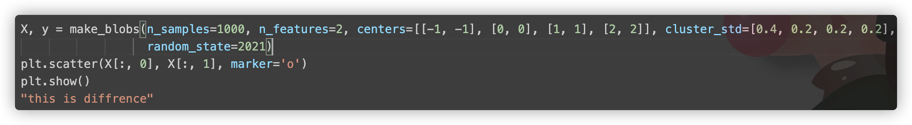
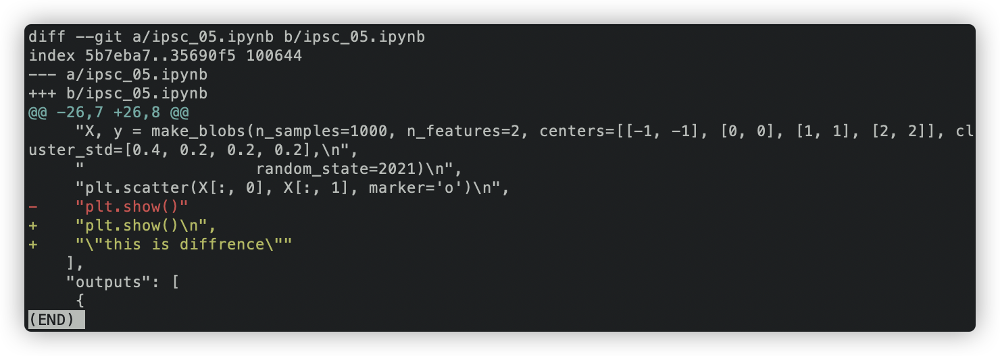
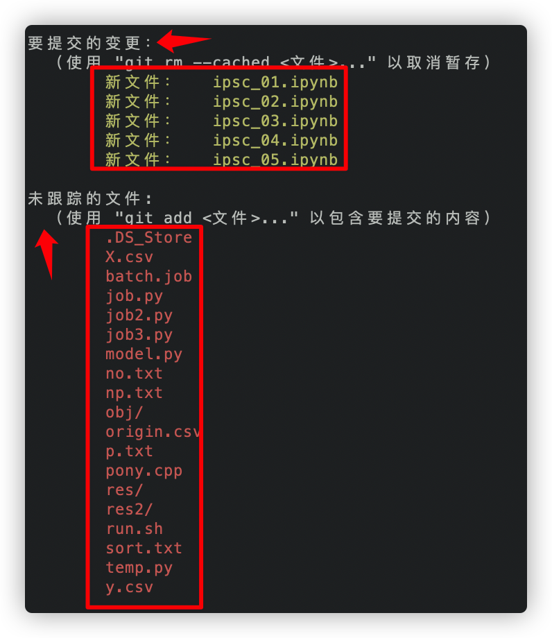
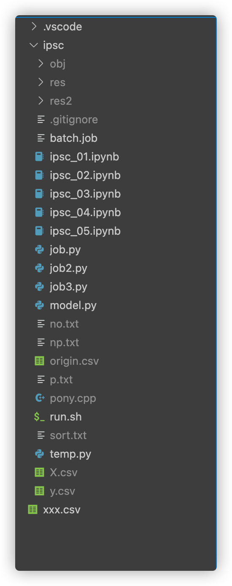
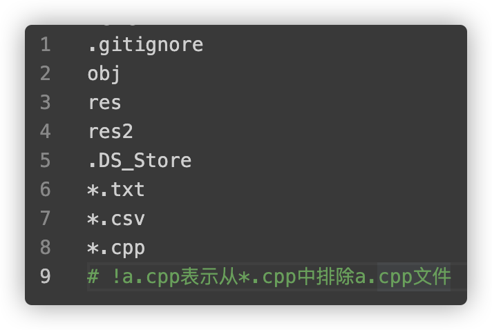
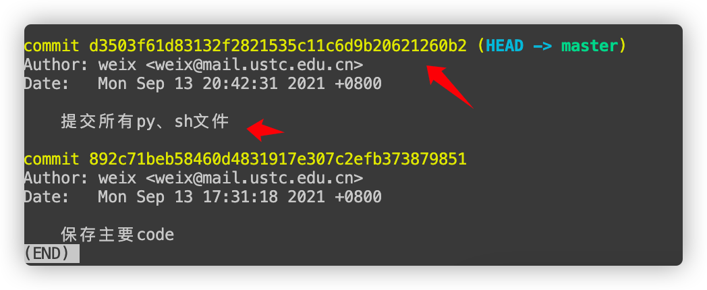
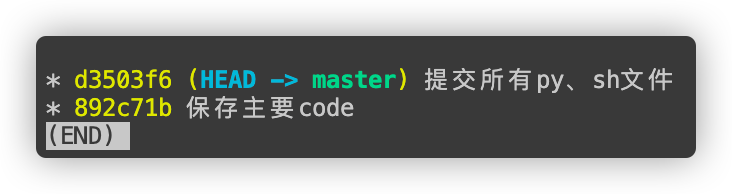
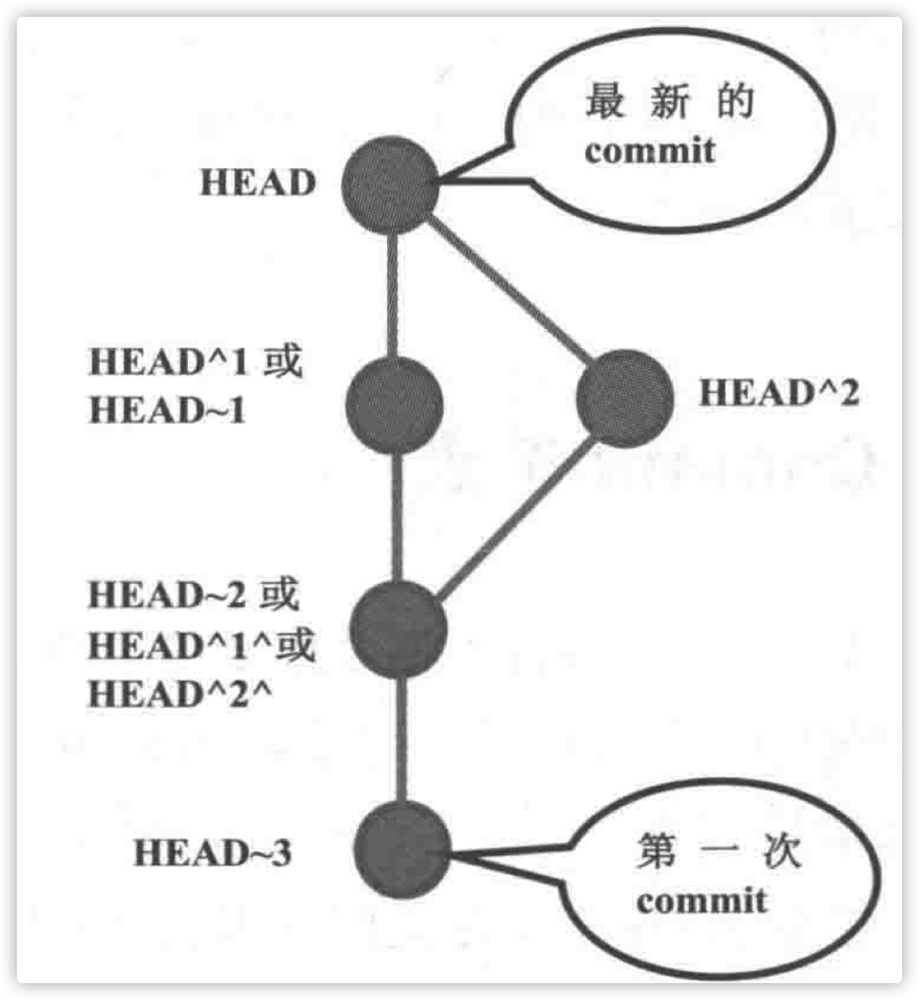

<center></center>

# 本地`GIT`

```shell
# git会在这个文件夹创建repository，里面存储被管理的文件和文件内容，包括所有曾经被加入的历史版本
git init 

# 将文件(修改)提交至cache(或者叫索引)中暂存
git add xx.py

# 将所做的修改(存储在cache中的文件)，提交至repository中存储
git commit -m '这次提交的一个说明' --author='weixun <wxun@mail.ustc.edu.cn>'
```

## `Git`配置文件

三个级别的配置文件：

* **.git文件夹中的config文件**：它的设置会覆盖其他配置文件中相同的设置项。*相当于局部变量，会覆盖全局变量的影响。* git config -l
* **home directory中的.gitconfig文件：**这个配置文件只对**此账号有效**。git config --global -l
* **git安装文件夹下etc\gitconfig文件：**公用的配置文件，对所有登录账号有效。*相当于全局变量。*git config --system -l

### 文件比对

比对当前文件与它在repository或cache中的差异。

```shell
git diff
```

文件修改的地方：



指令展示：



* Line 1：a/filename1 b/filename2，filename1表示在repository或cache中的文件；filename2表示在文件夹中的文件。
* Lin4—结尾：表示两个文件的差异。
  * @@ -26，7表示a文件中第26行开始的后面7行，“-”表示a文件；+26， 8@@同理只不过表示的b文件。
  * 红字表示的“- plt.show()”表示a变为b时删去(不存在)的部分，黄字表示a变为b时多出来的部分。


## 文件存入`Repository`

### 排除不需要备份的文件

Git中文件被分为三类：

* 被追踪的(tracked)
* 忽略的(ignored)
* 不被追踪的(untracked)

初始时，所有文件都是`untracked`。



提交至repository的文件就是`tracked`。

`ignored`即是不需要被备份的文件。需要配置`.gitignore`文件来标识出来。



文件组织结构，不需要对obj、res、res2、所有txt、csv文件备份，那么配置文件如下：



* .gitignore文件的影响范围为他所在的文件夹和所有子文件夹。
* 每一个文件夹都可以创建自己的.gitignore文件，这个文件夹也会收到它的影响。

### 控制`Commit`

#### 对git add的撤销

repository中还没有加入过任何文件，也就是执行git init之后还没执行过git commit。

```shell
git rm --cached filename
```

git rm会执行两项检查：

* git cache中有没有该文件的内容，如果有，表示该文件与cache中的不一致，为了避免遗失数据，git会显示提醒信息，然后放弃执行。
* git repository中是否一致，如果不一致同上。

git rm会连同本地文件和cache文件一起删除。加上--cached表示**从此以后不需要在repository中更新这个文件，也就是这个文件将从tracked变为untracked。**

#### 版本回退

```shell
git reset vesion_no
## example
## git reset HEAD
```

```shell
# 提交日志
git log
```



第一个箭头为**版本标识符**。第二个箭头为**提交时的备注。**

git log --graph --oneline，方便查看（特别是有分枝的情况）



`HEAD`关键字：



`HEAD`表示最新版本，即当前使用的版本。

`HEAD~1`表示第一层，`HEAD~2`表示第二层。

`HEAD^1`表示节点的一个父节点。*如此处表示`HEAD`的第一个父节点，同理`HEAD^2`表示`HEAD`的第二个父节点*。

`HEAD`可用`@`代替。

