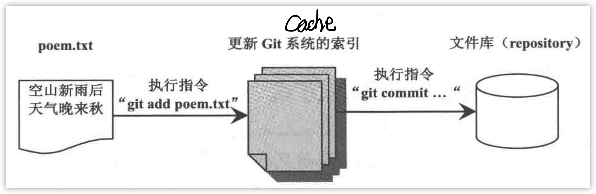

<center></center>

# 本地`GIT`

```shell
# git会在这个文件夹创建repository，里面存储被管理的文件和文件内容，包括所有曾经被加入的历史版本
git init 

# 将文件(修改)提交至cache(或者叫索引)中暂存
git add xx.py

# 将所做的修改(存储在cache中的文件)，提交至repository中存储
git commit -m '这次提交的一个说明' --author='weixun <wxun@mail.ustc.edu.cn>'
```

## `Git`配置文件

三个级别的配置文件：

* **.git文件夹中的config文件**：它的设置会覆盖其他配置文件中相同的设置项。*相当于局部变量，会覆盖全局变量的影响。* git config -l
* **home directory中的.gitconfig文件：**这个配置文件只对**此账号有效**。git config --global -l
* **git安装文件夹下etc\gitconfig文件：**公用的配置文件，对所有登录账号有效。*相当于全局变量。*git config --system -l

### 文件比对

比对当前文件与它在repository或cache中的差异。

```shell
git diff
```

文件修改的地方：


指令展示：


* Line 1：a/filename1 b/filename2，filename1表示在repository或cache中的文件；filename2表示在文件夹中的文件。
* Lin4—结尾：表示两个文件的差异。
  * @@ -26，7表示a文件中第26行开始的后面7行，“-”表示a文件；+26， 8@@同理只不过表示的b文件。
  * 红字表示的“- plt.show()”表示a变为b时删去(不存在)的部分，黄字表示a变为b时多出来的部分。


## 文件存入`Repository`

### 排除不需要备份的文件

Git中文件被分为三类：

* 被追踪的(tracked)
* 忽略的(ignored)
* 不被追踪的(untracked)

初始时，所有文件都是`untracked`。


提交至repository的文件就是`tracked`。

`ignored`即是不需要被备份的文件。需要配置`.gitignore`文件来标识出来。


文件组织结构，不需要对obj、res、res2、所有txt、csv文件备份，那么配置文件如下：


* .gitignore文件的影响范围为他所在的文件夹和所有子文件夹。
* 每一个文件夹都可以创建自己的.gitignore文件，这个文件夹也会收到它的影响。

### 控制`Commit`

#### 对git add的撤销

**repository中还没有加入过任何文件**，也就是执行git init之后还没执行过git commit。

```shell
git rm --cached filename
```

git rm会执行两项检查：

* git cache中有没有该文件的内容，如果有，表示该文件与cache中的不一致，为了避免遗失数据，git会显示提醒信息，然后放弃执行。
* git repository中是否一致，如果不一致同上。

如果通过了这两项检查，**Git会马上删除文件夹中的文件**，然后在索引中记录要从文档库中删除该文件。如果这时候执行git status将会显示delete : filename，也就是说filename这个文件马上将要被从repository中删除。（此时执行git commit后将会确实的 从repository中删除该文件。）

git rm会连同本地文件和cache文件一起删除。加上--cached表示**从此以后不需要在repository中更新这个文件，也就是这个文件将从tracked变为untracked。但不会马上从文件夹中删除这个文件。**

**respository中已经有文件**，也就是执行过git commit

```sh
git reset HEAD filename
```


#### 版本回退

```shell
git reset vesion_no
## example
## git reset HEAD
```

```shell
# 提交日志
git log
```


第一个箭头为**版本标识符**。第二个箭头为**提交时的备注。**

git log --graph --oneline，方便查看（特别是有分枝的情况）


`HEAD`关键字：


`HEAD`表示最新版本，即当前使用的版本。

`HEAD~1`表示第一层，`HEAD~2`表示第二层。

`HEAD^1`表示节点的一个父节点。*如此处表示`HEAD`的第一个父节点，同理`HEAD^2`表示`HEAD`的第二个父节点*。

`HEAD`可用`@`代替。

```sh
git show HEAD
```

将会显示当前版本和之前的diff。

## 比较文件差异、从Repository取回文件

从文档库的任何一个commit节点取出指定的文件：

```sh
git checkout commit 节点标识符(如：下图) file1 fil2...(指定需要取出的文件)
```


文件夹中的文件会被取出的文件覆盖。

当执行git checkout时，如果取出的文件和当前repository中最新commit的文件内容不同，这个取出的文件内容会自动记录在cache中，如果之后执行git commit，那么这个取出来的文件将会成为repository中的新版本。如果要避免这种情况，可以在执行git checkout之后立即执行git reset HEAD（*拉取最近一次提交到版本库的文件到暂存区*  *该操作不影响工作区*），清除cache。

如果没有指定特别的commit节点：

```sh
git checkout file1 file2 file3...
```

Git会**先找索引中有没有该文件**，如果有就取出，如果没有就从最新的commit节点开始，按时间顺序往前寻找。

查找包含某种字符串的文件

```sh
git grep "target str" commit 节点
```

### 改变文件（夹）名称

* 本地（工作区）更改文件（夹）名
* git ada -A “改变的文件（夹）”，**把所做的更改加入cache，同时在cache中记录被删除的文件**
* 执行git status会显示renamed: 之前文件名->新文件名。因为git会通过对照文件内容发现：新增的文件和被删除的文件是同一个文件，只不过名称不一样，所以会用变更名称的方式存入文档库
* git commit，将cache中的内容写入repository

以上操作可以用一条指令来完成：

```sh
git mv 之前文件名 新文件名
```

### 暂存当前文件夹的文件状态

将当前文件夹中的“文件修改状态”暂存起来，以便稍后将它们恢复。

> ​	如：当前程序修改到一半，突然收到一个临时性的工作，需要先修改其他的地方。但是当前的工作只进行到一半，不适合将之存入文档库。此时可以使用暂存功能。**先将当前文件状态记录下来，然后处理临时工作。等到临时工作处理完毕之后，再将文件夹中的文件恢复到原来的状态。**
>
> 还可以：由于疏忽，本应该在dev分支开发的内容，却在master上进行了开发，需要重新切回到dev分支上进行开发，可以用git stash将内容保存至堆栈中，切回到dev分支后，再次恢复内容即可。

git stash命令的作用就是将目前还不想提交的但是已经修改的内容进行保存至堆栈中，后续可以在某个分支上恢复出堆栈中的内容。这也就是说，**stash中的内容不仅仅可以恢复到原先开发的分支，也可以恢复到其他任意指定的分支上**。git stash作用的范围包括工作区和暂存区中的内容，也就是说没有提交的内容都会保存至堆栈中。

暂存文件夹中的文件状态：

* git stash save

  * **存储文件夹中被git追踪的文件和repository中最新文件版本的差异**存入堆栈
  * 把文件夹中被git追踪的文件还原成repository中最新的文件版本

* git stash list

  

  * WIP：work in progress，用来说明当前进行中的工作内容。信息最后显示了当前repository中最新的commit节点标识符和说明，它也是当前文件夹中文件的版本

恢复：

* 先从repository中取出执行git stash save时的对比文件版本，也就是git stash list时所显示的commit版本，可以使用git checkout commit “标识符” **.**来完成
* 执行git stash pop（*该命令将堆栈中最近保存的内容删除*）或者git stash apply（*将堆栈中的内容应用到当前目录，不同于git stash pop，该命令不会将内容从堆栈中删除，也就说该命令能够将堆栈的内容多次应用到工作目录中，适应于多个分支的情况。*）取出暂存的文件，并且合并到当前文件夹中的文件（此时暂存的文件状态会被清除）

[参考链接](https://blog.csdn.net/stone_yw/article/details/80795669)

### 清理Git Repository

repository经过一段时间的存取之后，里面的数据有些可能不会再被用到，可以手动进行GC。

pass

# 分支、冲突、合并

从原有的程序项目分出另一个程序项目进行修改，这个操作成为`branch`。

```sh
git branch "分支名称" commit “节点/标识符”
```

* git branch后没有任何参数时，会列出当前repository中正在开发的所有分支
* 从commit所选的节点分出一支一摸一样的版本，若没有commit则是从当前最新的版本分出

显示分支：

```sh
git log --graph --oneline --all --decorate
```


删除分支：

```sh
git branch -d "分支名称"
```

此时如果被删除的分支还未被合并（？），Git会报错并停止删除分支的操作，若仍要进行操作可使用`-D`

更改分支名称：

切换到需要修改名称的分支

```sh
git branch -m "新名称"
```

## 分支

### 解决`Detached HEAD`

当前repository状态：


执行：

```sh
git checkout HEAD^ // 回退到HEAD的父节点处，即第二个节点
```

此时repository的状态：


此时会提示：


会从commit选择的版本处出现一个无名分支：


解决办法：

1. 放弃无名分支的内容，也就是删除这个无名分支

   * 赋予这个无名分支一个名称
   * 切换到另一个分支
   * 再将这个无名分支删除

   ```sh
   git branch "无名分支名称"
   git checkout master
   git branch -D "无名分支"
   ```

   

2. 把这个无名分支合并到原来的分支

## 合并

将一个分支合并到另一个分支。

```sh
git merge "分支名称"
```

会把指定的分支，合并到当前git工作中的分支

合并与被合并的区别：


如果执行合并之后想要反悔，可以使用reset回到当前节点的父节点，也就是上一个节点：

```sh
git reset --hard HEAD^
```

* --hard表示文件夹中的文件也要一起恢复
* 合并之后，HEAD会有两个父节点，可以使用HEAD^1 HEAD^2来指定

### `Fast-forward merge`


一个分支（bug/123）从另一个分支（master）长出来之后，原分支（master）并没有改变而是新分支（bug/123）有了变化，此时若是需要合并两个分支则**必须在master上进行，因为相当于从bug/123上拉取的文件**，merge之后，分支会变成右图，master分支仿佛沿着bug/123进行了“快进”，这就是`Fast-forwar merge`。

这种合并不会产下commit节点（bug/123和master在同一个节点），如果希望留下合并记录则可以使用：

```sh
git merge --no-ff “分支名称”
```


这种合并会产生一个最新的commit节点，这种方式称之为`3-way merge`。

### `3-way merge`


如果bug/123与master同时在修改的话，就不能使用`fast-forward merge`，就只能使用`3-way merge`，这样的话就可能产生修改冲突（master和bug/123修改了同一块地方）。

## 冲突


* 两分支修改了不同的地方不会造成冲突
* 两分支修改了文件相同的位置，但修改的内容不一样就会造成冲突

如果合并过程中发生了冲突， 想要放弃这个合并的话，可以执行：

```sh
git merge --abort
```

这样Repository和文件夹中的文件都会恢复到未执行合并前的状态。

### 解决冲突

```sh
git checkout master
git merge draft
```

会出现冲突：


使用git status会显示冲突：


打开有冲突的文件来解决冲突：


* Git会用连续7个`<`来标识发生冲突的位置

* 修正冲突的内容，然后删除冲突标识即可

  这个时候还不能直接合并，只能先保存修改：

  

  ```sh
  git add .
  git commit -m ""
  ```

## `Rebase`更新分支的起始点

有时为了维持主分支和分支的一致性，必须定时将主分支的修改合并到当前正在开发中的分支。


一段时间后分支可能还需要继续merge主分支，最后主分支和分支将会互相交织成一个网状形态，此时虽然没错但是会让commit节点演进图变得比较复杂。

可以使用`rebase`指令来代替`merge`。


* 刚开始draft从x处分支
* 当draft需要合并master时，不再使用merge，使用rebase的话，draft会将两者合并，然后舍弃从x处生长出来的那部分，而是从master新节点处从新分支

```sh
git checkout draft
git rebase master
// 出现冲突，终止合并
git rebase --abort
// 不打算终止，修改冲突
git add .
git rebase --continue
// rebase反悔
git reflog HEAD “分支名称”
```

