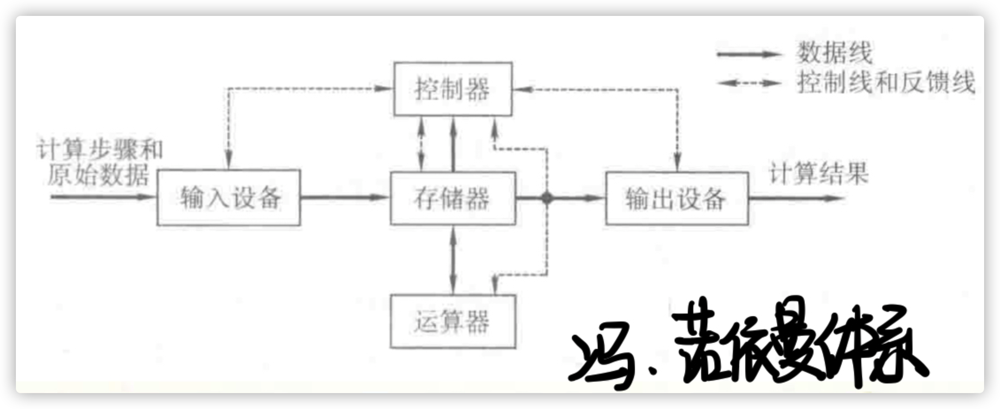
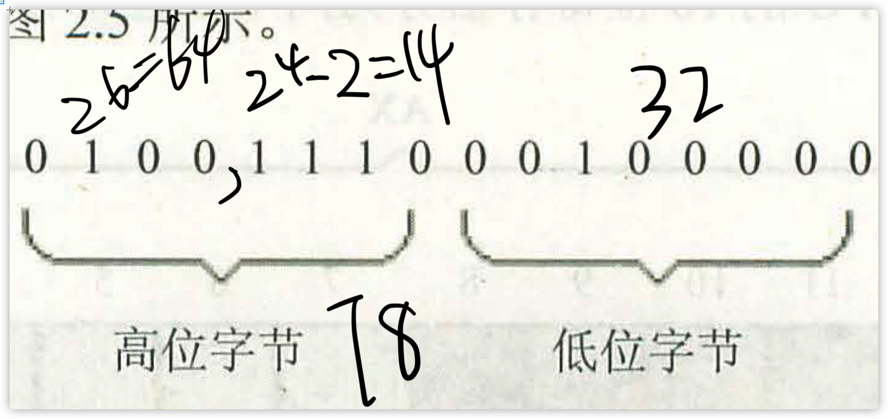
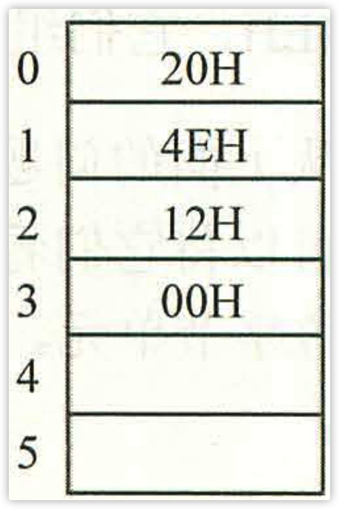

# 前置知识

CPU想要读写数据需要喝外部器件进行三类信息的交互：

* 存储单元的地址（地址信息）- 地址总线
* 器件的选择，读或写的命令（控制信息）- 控制总线
* 读或写的数据（数据信息）- 数据总线

## 内存地址空间

* 主板：有核心器件和一些主要器件，它们通过总线相连。（CPU、存储器、RMA内存条）
* 接口卡：直接控制这些设备进行工作的是插在扩展槽上的接口卡。扩展槽通过总线和CPU相连
* 存储器芯片
  * 随机存储器RAM
    * DRAM：电容放电需要刷新，慢（主存）
    * SRAM：一直充电，断电易失，快（寄存器）
  * 装有BIOS（Basic Input/Output System）的ROM
  * 接口卡上的RAM

# 寄存器

* 运算器进行信息处理
* 寄存器进行信息处理
* 控制器控制各种器件进行工作
* 总线连接各种器件，在它们之间进行数据的传送

## 通用寄存器

8086CPU的所有寄存器都是16位的，可以存放两个字节。

`AX`、`BX`、`CX`、`DX`这四个寄存器通常用来存放一般性的数据，所以称之为通用寄存器。它们可以使用两个独立的8位寄存器来实现。

所以它们可以分为`XH`、`XL`。其中X可以是ABCD中的任何一个H ：High、L：Lower，分别代表高8位和低8位。

8086CPU可以一次性处理两种尺寸的数据：

* 字节：byte，一个字节由8个bit组成，可以存在8位寄存器中
* 字：记为word，一个字由两个字节组成

2000在两个寄存器上的存储。

8086CPU是16位机的含义是：

* 运算器一次最多可以处理16位的数据
* 寄存器的最大宽度为16位
* 寄存器和运算器之间的通路位16位

## 8086的地址

8086CPU有20位地址总线，但是是16位机。所以8086CPU**在内部用两个16位地址合成的方法来形成一个20位的物理地址。**

读写流程：

地址加法器运算：**物理地址=段地址\*16+偏移地址**。而段地址\*16即左移4位。

### 段

在编程时，将若干地址连续的内存单元看作一个段，用段地址\*16定位段的起始地址，用偏移地址定位段中的内存单元。且：段地址\*16必然是16的倍数，所以一个段的起始地址也一定是16的倍数；偏移地址位16位，所以一个段的最大长度为$2^{16}bit$即64KB。

## 段寄存器

8086CPU有4个段寄存器：`CS`、`DS`、`SS`、`ES`。

### `CS`和`IP`

* `CS`：`Code Segment`代码存放区域，存放代码段区域的入口地址\<段基址\>
* `IP`：指令指针寄存器

8080CPU，在任意时刻都会将CS:IP指向的内容当作指令执行。即下一条指令的地址=CS<<4+IP。

8086CPU工作流程简要描述为：

* 从CS:IP指向的内存单元读取指令，读取的指令进入指令缓冲器
* IP=IP+len(所读指令)，从而指向下一条指令
* 指向指令，转到1，重复整个流程

可以这么说：如果内存中的一段信息曾被CPU执行过的话，那么，它所在的内存单元必然被CS:IP指向过。

### 修改`CS`、`IP`

可以通过修改CS、IP中的内容来控制CPU执行目标程序。

`mov`可以修改大部分的寄存器但是不能修改CS、IP。

`jmp`：jmp 段地址:偏移地址，用给出的段地址和偏移地址来同时修改CS和IP。如：jmp 2AE3:3执行完这条指令后：CS=2AE3H、IP=0003H，CPU将从2AE33H处读取指令。

若仅仅想修改IP的内容可以：jmp 地址/寄存器。

# 内存访问（寄存器）

存储一个字：高8位存储高位字节、低8位存储低位字节。

example：

对于2000（4E20H）

* 

