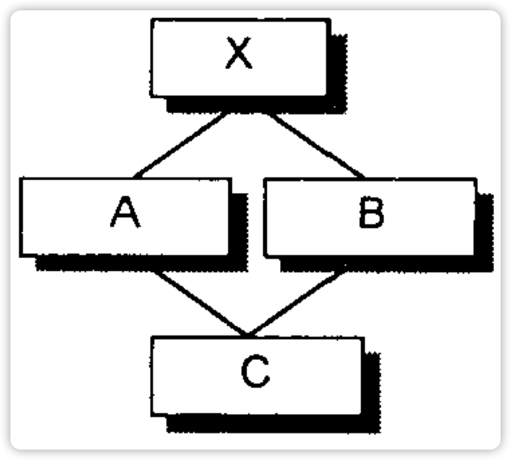
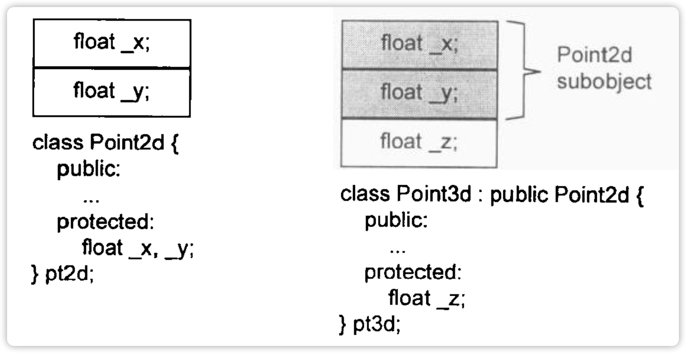

# 对象

C语言本身没有支持“数据和函数”之间的关联性，这种程序方法是程序性的。

结构（struct/class）变为C++后增加的成本：

* member functions在class内的声明，但不会出现在object中，**每一个non-inline member function**只会诞生一个函数实体。
* 拥有多个inline function则会在每一个是用处产生一个函数实体。（在使用类内联函数时，会在调用处展开）

以上特性并未带来任何空间或执行期的成本。

**C++的布局以及存取时间上主要是virtual引起的：**

* virtual function
* virtual base class：多继承

## 对象模式

两种class data members：

* static
* nonstatic

三种class function members：

* static
* nonstatic
* virtual

### 简单对象模型


每个slot代表一个指向data member或是function member的指针。这样避免了member有不同的类型，导致需要不同的存储空间的问题。

但这个模型并未应用（why）。

### 表格驱动对象模型


将data与function抽离出来，data member table存有实际的数据，而function member table则存有指向实际function的指针。

但这个模型也未被使用，而是成为了virtual function的一部分。

### C++对象模型


* non-static data member放在每个对象内
* static data member则放在类对象之外
* static/non-static function member则放在所有类对象之外
* virtual function
  * 每一个类拥有一个存有该类所有虚函数指针的表格（virtual table=vtbl）
  * 每个类对象有一个指针（virtual pointer=vptr），指向所属类的vtbl。vptr的设置与重置由构造函数、析构函数与拷贝运算符完成。每个类的type_info object（支持RTTI flag），又在vtbl中指出，通常放在第一个slot处。

优点：时间和空间上的高效（存取次数）

缺点：一旦non- statc data member发送改变则需要重新编译（而上面的双表格模型则提供了一层间接性不需要重新编译）

### 加上继承后的模型

早期的iostream的实现：


在虚拟继承下，base class（即此处的ios）被派生多次也永远只有一个实体（subobject）。

简单对象模型中，每一个基类都被派生类的一个slot指出。（存在间接性存取，类对象不会因为基类大小的改变而改变。）

或者说抽象出一层base table（包含一个类的所有基类，类似于虚表）：


这两种方法都会随着继承深度的增加导致间接的次数增加。

C++最初的继承模型不使用任何间接性：基类的数据成员被直接放在派生类中，这样提高了访问效率，但是导致：基类的任何改变都将导致派生类重新编译。

引入虚基类后，会在类对象中为每一个有关联的虚基类加上一个指针。

### 对象模型对程序的影响

不同的对象模型将导致“现有程序必须修改”，以及“必须加入新的代码”。

example：

```cc
X foobar() {
    X xx;
    X *px = new X;
    xx.foo();
    px->foo();
    delete px;
    return xx;
}

// 扩展后
void foobar(X &r) {
    // 构造r
    r.X::X();
    px = _new(sizeof(X));
    if(px != 0) {
        px->X::X();
    }
    // 不需使用virtual机制
    foo(&r);
    // 使用virtual机制，从虚表中找到实际用到的函数
    (*px->vtbl[2])(px);
    // 扩展delete px
    if(px != 0) {
        // 实际调用析构函数
        (*px->vtbl[1])(px);
        _delete(px);
    }
    return;
}
```


* vtbl[0]：X的type_info object
* vtbl[1]：X::~X()
* vtbl[2]：X::foo()

## 关键字的差异

struct只是方便C-->C++。

C++中，**凡是处于同一个access section的数据，必定保证以其声明次序出现在内存布局中。**然而**被放在不同access section中的数据排列次序就没有这个规定。**同理，**基类与派生类的数据成员也没有强制的先后顺序。**

C struct在C++中的唯一用途是：需要传递一个class对象的全部或部分到某个C函数中时，struct声明可以讲数据封装，并保证拥有与C兼容的空间布局。

## 对象的差异

三种程序设计模型：

* 过程模型
* ADT：struct+funtion
* OOP：类+方法

C++支持多态的方法：

* 将派生类指针转换为基类指针

  ```cc
  Base *bp = new Derived();
  ```

* 虚函数机制

* `dynamic_cast`与`typeid`

  ```cc
  Derived *dp = dynamic_cast<Derived*>(bp);
  ```

多态时经由一个共同的接口来影响封装，这个接口以virtual funtion机制触发，在执行期根据object的真正类型解析出到底那个函数实体被调用。

一个类对象需要的内存大小：

* 非静态数据成员的总和
* 由于对齐而padding的空间
* 为了支持virtual而产生的负担

指针和引用的大小都是固定不变的，引用通常是以一个指针来实现的。

## 指针的类型

从内存的角度来说一个ClassA\*a与ClassB\*b没有什么不同，它们之间的差异只存在其寻址出来的object类型不同（表示法、内容（即地址类型）都是一样的）。“指针类型”会告诉编译器如何解释某个特定地址中内存内容及其大小。


一个ZooAnimal类型的指针，会将其代表的1000地址开始解释为一个ZooAnimal的对象布局。

而如果将其变为一个void\*，编译器将不知道1000地址开始会涵盖一个怎样的空间。**所以这就是一个类型void\*只能喊有一个地址，而不能通过它操作所指的object的缘故。**

所以，cast只是一种编译器指令，大部分情况下并不改变一个指针所指的真正地址，只影响“被指出的内存大小及其内容”的解释方式。

### 加上多态


派生类会加上基类的那一部分：


```cc
Bear b;
ZooAnimal *pz = &b;
Bear *pb = &b;
```

pz与pb都指向b的第一个byte（即地址1000）：

* pb涵盖整个b（1000～1023）
* pz只涵盖b中的ZooAnimal部分（1000～1015）

pz不能直接操作b中属于Bear的部分，必须通过virtual机制：

```cc
pz->cell_block;//不行
((Bear*)pz) -> cell_block;
// or
Bear *b2 = dynamic_cast<Bear*>(pz); //成本较高，属于运行期行为
```

类型信息的封装并不是维护在指针中，而是维护在link中。（此link存在于“object的vptr和vptr所指的virtual table”。）

```cc
Bear b;
ZooAnimal za = b; // 会引起切割
za.rotate(); // 调用的是ZooAnimal::rotate（）
```

* rotate为什么调用的是ZooAnimal而不是Bear的实体：

  非指针/引用不会发生多态，指针/引用支持多态的原因：

  它们并不会引发内存中“与类型有关的内存委托操作”，会受到改变的只是它们所指的内存的“大小内容和解释方式而已”

* 将b拷贝给za时，为什么za的vptr没有指向（被拷贝）Bear的virtual table：

  每个vptr对应自己虚函数的那部分，基类部分改变不影响派生类部分，基类指针接管基类部分，派生类接管派生类部分

# 构造函数

## 默认构造函数

在需要的时候才会被构造出来：

* 程序需要
* 编译器需要

```cc
class Foo {public: inv val; Foo *next};
void foo_bar() {
  Foo bar;
  // ...
}
```

上述代码不会产生默认构造函数。如果程序需要默认构造函数，那么就需要自己合成。

即使有需要为Foo合成默认构造函数，这个默认构造函数也不会将Foo的数据成员初始化为0。

### 带有默认构造函数的成员类对象

一个类没有任何构造函数，而它有一个成员是一个对象，这个成员有默认构造函数，那么这个类的隐含的默认构造函数就是“non-trivial”（有效的），编译器就会为该类生成一个默认构造函数。（不过这个合成操作只会在需要使用构造函数时才会被调用。）

```cc
class A {
 public:
  A(){}
};
// 因为A有构造函数，而B没有但却有一个成员是A，所以编译器会为B生成一个默认构造函数
// 但是该构造函数不会初始化i
class B {
 public:
  int i;
  A a;
};
// B中被合成默认构造函数类似于
inline B::B() {
  // 伪代码
  foo.Foo::Foo();
}
```

被合成的默认构造函数只满足编译器的需要，而不是程序的需要。所以，B中i不会被初始化。

```cc
class B {
 public:
  	int i;
  	A a
    B():i(0) {}
};
```

此时由于B已经存在了一个默认构造函数，那么编译器为了初始化a，不会再为B生成默认构造函数，而是扩展它：

```cc
// 扩展B的默认构造函数 伪码
B::B():i(0) {
  foo.Foo::Foo();
}
```

如果存在多个成员对象，C++则会以成员对象在类中的声明次序来依次调用各个构造函数。

### 带有默认构造函数的基类

一个没有任何构造函数的类派生自一个有默认构造函数的基类，那么这个派生类的默认构造函数是nontrivial。会合成一个默认构造函数，在其中调用上一层基类的默认构造函数。

如果提供了多个构造函数，但是没有默认构造函数的话，编译器会扩张每一个现有的构造函数，将一些需要调用的操作加入其中（调用基类或是成员对象的构造函数）。编译器不会再合成新的默认构造函数。

### 带有一个虚函数的类

* 类声明/继承一个虚函数
* 类派生自一个继承串，其中有一个或多个虚基类

这些也是需要合成默认构造函数的。


Bell、Whistle都派生自Widget（其中含有一个虚函数）。那么会在编译期间发生扩张操作：

* 产生一个虚函数表（vtbl）
* 在每一个类对象中加入一个vptr指向vtbl

widget.flip()引发的操作将会被虚函数表重定向：

```cc
(*widget.vptr[1])(&widget);
```

同时编译器会为它们合成一个默认构造函数用以初始化每个vptr。

### 带有一个虚基类的类



```cc
struct X {int i;};
struct A : virtual X {int j;};
struct B : virtual X {int k;};
struct C : A, B {int l;};
// 无法在编译期解析出pa->X::i，因为pa的真正类型会变化
void foo(const A *pa) {pa->i = 1024;};
```

cfront的做法是：在派生类对象的安插virtual base classes来完成：


```cc
// foo改写伪码
// 这样不论是pa的类型A还是C都会根据vbcx指到X
void foo(const A *pa) {pa->_vbcX->i = 1024;};
```

_vbcX表示指向虚基类X的指针。

所以编译器会为没有任何构造函数的类生成默认构造函数来初始化对虚基类的操作。


所以，不在这四种情况内的而又没有声明任何构造函数的类，它们拥有的是implicit trivial的默认构造函数，实际上是不会被合成出来的。

## 拷贝构造函数

三种情况下会将一个object作为另一个object的初值：

* 赋值

  ```cc
  X xx = x;
  ```

* 传参

  ```cc
  void foo(X);
  foo(x);
  ```

* 返回值

  ```cc
  X foo2();
  ```

当一个类对象以另一个同类实体**作为初值**时，会调用拷贝构造函数（而不是赋值运算符），这会产生一个临时对象（以函数返回值作为初值时）。

```cc
C1 c_f() {
  return C1(1);
}
// C1(1) 构造
// temp = C1(1) 拷贝构造
// 离开c_f C1(1)析构
// c = temp 拷贝构造
// 析构temp
// mian结束析构c
void t17() {
  C1 c = c_f();
}
// C1(1) 构造
// temp = C1(1) 拷贝构造
// 离开c_f C1(1)析构
// c持有 temp 的引用
// mian结束析构temp
void t18() {
  const C1& c = c_f();
}
C1 getC1_2(int i) {
  return {i};
}
// 效果等同于 t18 flag
```

### 默认深拷贝初始化

如果类没有提供显式的拷贝构造函数，编译器会以深拷贝的方式完成拷贝，即**不会拷贝其中的成员类对象，而是以递归的方式调用其（成员类对象）。**

```cc
struct A {
  int a,b;
};
struct B{
  int i;
  A a;
};
```

B先会拷贝i，然后调用A的拷贝构造函数来拷贝a。

“如果一个类为定义拷贝构造函数，编译器就会为它产生一个。”这是不对的，实际上是：**默认构造函数与拷贝构造函数只在必要时（类需要递归拷贝，即在需要深拷贝时）才由编译器产生。**

```cc
A a;
void f() {
  A b= a;
}
// 1. 不会合成拷贝构造（浅拷贝）
class A {
  public:
  	int a,b,c;
};
// 2. 需要合成拷贝构造（深拷贝）
class A {
  public:
  	int a,b,c;
  	B cb;
};
// 此时A需要合成一个拷贝构造函数，不仅拷贝A自身的a,b,c还会调用B的拷贝构造函数去拷贝B的成员
class B {
  int a,b,c;
  B(const B&);
};
```

### 不展现浅拷贝

* 基类/成员对象中显式定义了拷贝构造函数

  编译器必须将基类/成员对象的构造函数的调用操作安插到自己的合成的拷贝构造函数中

* 类声明了一个/多个虚函数

* 类派生的链中存在虚基类

#### 重新设定虚表指针

编译期间的两个扩张操作：

* 增加一个虚函数表（vtbl），保存每个虚函数的地址
* 为类对象产生一个指向vtbl的虚函数表指针（vptr）


所以必须正确设定vptr，**当编译器导入一个vptr到类中时，该类就不会再展现浅拷贝。**相应的，会合成一个拷贝构造函数，将vptr正确的初始化。

example：


```cc
Bear yogi;
Bear winnie = yogi;
ZooAnimal franny = yogi;
```

将`yogi`的vptr拷贝给`winner`是安全的，但将之拷贝给`franny`是非法的。


需要将`franny`的vptr指向ZooAnimal：


也就是说，**合成出来的ZooAnimal拷贝构造函数，会明确设定对象的vptr指向ZooAnimal的虚表。**

#### 处理虚基类

除了上述的第三条，还有**如果一个类对象以另一个对象作为初值，而后者有一个虚基类子对象**，那么也会使浅拷贝失效。


编译器承诺：会让**派生类中的虚基类的对象（即Raccoon中的ZooAnimal部分）的位置准备好。**编译器会产生代码，**放在Raccoon每个构造函数的头部，来调用ZooAnimal的默认构造函数、将vptr初始化，并定位出Raccoon的ZooAnimal部分。**

* 当一个类对象以另一个同类的类对象作为初值时，浅拷贝不会失效（如Raccoon之间的拷贝）。

* 当一个类对象以其派生类的对象作为初值时，浅拷贝会失效（如franny=yogi）。

```cc
Raccon a;
// 简单的浅拷贝足矣
Raccon little_critter = a;

// 编译器需要明确地将little_critter的vptr初始化
RedPanda little_red;
little_critter = c;
```


也有例外：

```cc
// 浅拷贝可能够用，也可能不够用
Raccon *ptr;
Raccon little_critter = *ptr;
```

因为编译器无法知道，ptr是否指向一个真正Raccon对象，或是一个派生类对象。

## 程序转换语意

```cc
X foo() {
  X xx;
  return xx;
};
```
如下假设：
* 每次foo被调用，就会返回xx的值
* 如果foo定义了拷贝构造函数，当foo被调用时，保证该拷贝构造函数也会被调用
* 上述两点都不正确

### 明确的初始化操作

```cc
X x0;
void f() {
  X x1(x0);
  X x2 = x0;
  X x3 = X(x0);
}
```
* 重写每个定义，其中初始化操作会被剔除（C++中的定义严格来说指的是“占用内存”的行为）
* 类的拷贝构造掉用操作会被安插进去
转换后：
```cc
void f1() {
  X x1, x2, x3; // 定义被重写，初始化操作被剔除
  // 编译器安排的X的拷贝构造操作
  x1.X::X(x0); // 即 X::X(const X&xx);
  x2.X::X(x0);
  x3.X::X(x0);
}
```

### 参数初始化

把一个类对象作为参数传递给一个函数（或作为函数的返回值），相当于：
```cc
X xx;
void f(X x0);
f(xx);
```
会将实参拷贝给形参（即将xx拷贝给x）。
会要求局部对象（x0）以深拷贝的方式将实参（xx）作为初值。
一种策略是**导入暂时性的对象，并调用拷贝构造函数将它初始化，然后将暂时先对象交给函数。**
```cc
// 产生的暂时性对象
X _temp;
// 编译器对拷贝构造函数的调用
_temp.X::X(xx);
// 重写函数调用，以便使用上述暂时对象
foo(_temp);
```
有一些问题：_temp先以X的拷贝构造函数正确地设置了初值，然后再浅拷贝到x0这个局部实体中。导致foo的声明也必须发生变化：
```cc
void f(X&);
```
另一种策略是**以拷贝构建的方式，把实际参数直接建构在其应该在的位置上，该位置视函数活动范围的不同记录于程序堆栈中。在函数返回前，局部对象的析构函数（有的话）会被执行。**

### 返回值的初始化`RVI(Return Value Initialization)`

讨论的是:
```cc
X foo() {
  X xx;
  return xx;
}
```
foo()的返回值是如何从局部对象xx中拷贝出来的。
其由编译器转换的伪码如下：
```cc
void foo(X &_result) { // 加上一个额外参数
  X xx;
  // 编译器产生的默认构造函数调用操作
  xx.X::X();
  // 编译器产生的拷贝构造函数调用操作
  _result.X::X(xx);
  return;
}
// 调用foo
X x = foo();
// 被转换为
X x;
foo(x);
// ====
foo().func();
// 转化为
X x;
// ","运算符
(foo(x), x).func()
```
### 使用者层面的优化

对于foo的调用，可以改下为“计算用”的函数，提高效率：
```cc
X foo(int a) {
  // 没有了中间变量x
  return X(int a);
}
// 转换后
void foo(X& _result, int a) {
  _result.X::X(a); // 相较于之前，少了一次初始化的操作（xx.X::X();）
  return;
}
```

### 编译器层面的优化

在foo中，所有的return指令都返回有相同名字的值（named value，具名数值），那么编译器可以进行优化，**以result参数取代named return value（具名返回值）**：
```cc
// 把foo中的xx以_result替代
void foo(X &_result) {
  _result.X::X();
  // 直接使用_result,省略了一次xx到_result的拷贝操作（或xx的初始化操作）
  return;
}
```
节省了：
1)  在堆栈中预留xx的内存；
2)  调用X的默认构造函数，构造xx
3)  调用X的拷贝构造函数，构造_result
    变为了调用其构造函数
4)  调用xx的析构函数
5)  堆栈中回收xx的内存
> **需要显式的拷贝构造函数才会触发NRV的原因：**截取其中的话就是“早期的 cfront需要一个开关来决定是否应该对代码实行NRV优化，这就是是否有客户（程序员）显式提供的拷贝构造函数：如 果客户没有显示提供拷贝构造函数，那么cfront认为客户对默认的逐位拷贝语义很满意，由于逐位拷贝本身就是很高效的，没必要再对其实施NRV优化；但 如果客户显式提供了拷贝构造函数，这说明客户由于某些原因(例如需要深拷贝等)摆脱了高效的逐位拷贝语义，其拷贝动作开销将增大，所以将应对其实施NRV 优化，其结果就是去掉并不必要的拷贝函数调用。”
>

## 成员初始化列表

构造函数发生作用在于：
* 成员初始化列表
* 构造函数体中
但实际上除了某些情况下（四种情况），其实二者都是一样的：
* 初始化一个引用成员
* 初始化一个const成员（必须初始化）
* 调用用一个基类的构造函数，而它拥有一组参数
* 调用用一个成员对象的构造函数，而它拥有一组参数
```cc
class A {
  public:
    int a,b;
    String s;
    A() {
      // 构造函数体只是完成赋值操作，而初始化早已完成
      a = 1;
      b = 1;
      // 会在初始化（函数的最开始，早于程序员的代码）时创建于（初始化）一个临时的String对象（保存“hello”）
      // 再使用赋值运算符，将这个临时对象给s赋值，然后再摧毁掉这个临时对象
      s = "hello"
    }
};
// 伪码
A() {
  s.String::String(); // 初始化s
  // 产生临时对象
  String temp =  String("hello");
  // 深拷贝temp
  s.String::operator=(temp);
  // 摧毁temp
  temp.String::~String();
  a = 1;
  b = 1;
}
```
此时成员初始化列表就会发生作用：
```cc
A():a(1),b(1),s("hello") {}
// 伪码
A() {
  // 直接就初始化s了，不会产生临时对象
  s.String::String("hello");
  a = 1;
  b = 1;
}
// 实际上a,b是一个行为良好的成员
A():s("hello") {
  a = 1;
  b = 1;
}
// 与A():a(1),b(1),s("hello") {}效果一样
```
实际上，编译器会一一操作initialization list，以其在类中（public、protect、private中的相对顺序）声明的顺序在构造函数体中插入初始化操作，并**先于构造函数体中用户定义的代码**。
```cc
class C4 {
 public:
  int a, b, c;
  C4(int x) {
    // a b c啥也不会变，还是未定义的状态
    cout << a << " " << b << " " << c << endl;
    a = b = c = x;
  }
  //  warning: field 'b' is uninitialized when used here [-Wuninitialized]
  C4(int x, int y) : b(x+1), a(b), c(y) {
    // a(x), b(y), c(x)先于用户定义的代码
    cout << a << " " << b << " " << c << endl;
  }
};
```
还可以在成员初始化列表中调用类方法：
```cc
X::X(int x):a(func(x)) {}
```
也是正确的（但是func中不能依赖先于a初始化的成员变量），**这是因为此时与对象相关的this指针已经构建完成**：
```cc
// 伪码
X::X(/*this指针*/int x {
  i = this->func(x);
  a = i;
}
```


# 数据

```cc
class X {};
class Y : public virtual X {};
class Z : public virtual X {};
class S : public Y, public Z {};
int main() {
  int* p;
  cout << "point size: " << sizeof(p) << endl;
  cout << sizeof(X) << endl;
  cout << sizeof(Y) << endl;
  cout << sizeof(Z) << endl;
  cout << sizeof(S) << endl;
}
// 输出
point size: 8
1
8
8
16
```
一个空的对象（如X）的大小并不是为0，**它有一个隐晦的1byte，是被编译器插入的一个char，使得这个class的两个对象在内存中有独一无二的地址。**
> C++标准中规定，“no object shall have the same address in memory as any other variable” ，就是任何不同的对象不能拥有相同的内存地址。如果是空对象就不会占内存，不占内存就地址一样了。避免指针运算为0。[参考链接](https://blog.csdn.net/weixin_42323413/article/details/84295375)
>
Y和Z大小受三个因素影响：
* 语言本身负担。
  当语言支持虚基类时，在派生类中就会存在一个指针：或指向虚基类子对象（自身从基类继承下来的哪部分）；或是一个相关表格（存放的是虚基类子对象的地址或偏移量）
* 编译器对特殊情况的优化处理。
  X中的1byte的影响也存在于Y和Z中。
  或者另一种策略：空虚基类对象直接成为派生类的一部份
  *mac上输出为什么没体现出虚指针or对齐？ flag*
* 对齐。
  X为1byte，Y、Z为了对齐
  exmaple（书上例子）：


一个虚基类子对象只会在派生类中存在一份实例，**不管它在class继承体系中出现了多少次。**A的大小取决于：
* 共同实体的大小（即X）为1
* Z/Y的大小减去已经被计算的X的大小 8+8-2=14
* A自己的大小  0
* 对齐。14 + 1 + 1 = 16
> 各种编译器的实现还有优化不同，书上仅供参考，关键是那1byte。
>
C++保持对C struct的兼容。
* 它把数据以及继承来的非静态数据成员直接存放至每一个类对象中
* static数据成员则放在一个global数据段(segment)中，不会影响个别类对象的大小
* static数据成员永远存在且只存在一份实体（即使该类还没有对象实体，但是template的static稍有不同）

## 数据成员的布局

```cc
class A {
  public:
    int a,b,c;
    float d,e,f;
};
```
C++标准中，同一个access section（即public、protect、private）中的成员排列符合：较晚出现的成员在类对象中有着较高的地址。


至于编译器合成的内部使用的数据成员（用于支持对象模型，如vptr）则通常被放在所有明确声明的成员的最后/前端。而多个access section之间可以自由排列。（section不会增加内存负担，在一个section声明八个成员与在八个section在分别声明一个成员的大小是一样的。）

## 数据成员的存取

### 静态成员

静态成员视为一个全局变量（只在class的生命范围内可见）。对一个静态成员取地址，会得到一个**指向数据类型的指针**，而不是**指向类数据成员的指针**。
对于不同类中的相同名字的静态对象，编译器会对它们取一个不同的名字（可以倒推回去）。

### 非静态成员

非静态成员存在每个类对象中，无法直接存取，只能通过`implict class object`：
```cc
int A::f(int a) {
  return i+a;
}
// 伪码
int A::f(A* const this, int a) {
  return this->i + a;
}
```
编译器会根据对象的地址（this指针）加上数据成员的偏移量进行存取：
```cc
origin.y = 0;
// 伪码
&origin + (&A::y - 1);
```
指向数据成员的指针，其偏移量总是被加上1（所以需要-1），这样使得编译系统可以区分“第一个指向数据成员的指针，用来指出类的第一个成员” 和 “一个指向数据成员的指针，没有指出任何成员”这种区别类似数据首元素的地址和数组的地址。flag
每一个非静态成员对象（以及基类子对象）的偏移量在编译期可知。
虚拟继承将为经由基类子对象存取的数据成员加上一层间接性：
```cc
A *p;
p->x = 0;
```
x若是一个结构体、类对象、单一继承、多重继承它们存取情况都一样。**若是一个虚基类的成员，存取速度就会慢一点。**
因为：p是一个指针，那么在编译期无法确定它真正指向的类型，只能延迟到延迟期才能确定，所以需要引入一层间接导引。但是若是A a的话，a的类型在编译期就明确确定了其类型，也就确定了x的偏移量。
所以，以下代码是有存取差距的：
```cc
A *p, a;
p->x;
a.x;
```

### 继承与数据成员

一个派生类 = 自己的成员 + 它派生的基类的成员。
自己的成员与继承的成员的顺次没有强制规定。

#### 只要继承不要多态

一般而言**非虚继承并不会增加空间或存取上的额外负担。**



单一继承且没有虚函数时的内存布局如上。

由于C++保证“出现在派生类中的基类子对象”的完整性以及对齐操作，将会导致类的大小变化：
[参考链接1](https://zhuanlan.zhihu.com/p/30007037)
[参考链接2](https://www.cnblogs.com/zrtqsk/p/4371773.html)
>
为什么需要内存对齐？
1.  平台原因（移植原因）：不是所有的硬件平台都能访问任意地址上的任意数据的；某些硬件平台只能在某些地址处取某些特定类型的数据，否则抛出硬件异常。
2.  性能原因：数据结构（尤其是栈）应该尽可能地在自然边界上对齐。原因在于，为了访问未对齐的内存，处理器需要作两次内存访问；而对齐的内存访问仅需要一次访问。
>
flag


***
*书上版本*


否则采用紧凑结构的话：


#### 加上多态

```cc
class Point2D {
  public:
    float _x, _y;
    // ...
    // 2D不存在Z轴，由子类实现，而x、y部分子类、派生类逻辑一致不需要作为虚函数
    virtual float z() {return 0.0;}
    virtual void z() {}
};
class Point3D : public Point2D {
    public:
      float z;
      Point3D(int a, int b, int z):Point2D(a, b), z(z) {}
      float z() {return z;}
      void z() {this->z = z;}
};
```
额外存取负担：
* 导入一个与2D相关的虚表
* 在每个类对象中导入一个vptr，提供执行期的链接，使得每个对象能找到对应的虚表
* 加强构造函数，使它能够为vptr设定初值
* 加强析构函数，使它能够抹消vptr
* 同时3D中不仅有2D的vptr还有自己的vptr flag
vptr既可以放对象首部，也可以放尾部。

#### 多继承


在单继承中，基类与派生类的对象都是从相同地址开始，这样做的好处是：当将一个派生类对象指定给基类的指针/引用时，该操作不需要编译器去修改地址。
而如果将vptr放在对象起始处（基类有虚函数，而派生类没有），那么为了维持多态（把派生类转换为基类），就需要编译器介入来调整地址（派生类没有vptr指向vptr指向，所以转换为基类时，要将指针指向对象的首地址）。
对于一个多重派生对象，将其地址指定给最左端（第一个）基类的指针时，情况和单继承时一样，因为二者都指向相同的起始地址。


```cc
Vertex3D v3d;
Vertex *pv;
Point2D *p2d；
Point3D *p3d；
pv = &v3d;
// 伪码...1
pv = (Vertex*)(((char*)&v3d) + sizeof(Point3d)); // 越过Point3D到vertex
// 不需要做转换，只需要简单地拷贝地址即可
p2d = &v3d;
p3d = &v3d;
Vertex3D *pv3d; // 不再是对象，而是一个指针
Vertex *pv;
// 此时不能简单的如1，因为此时pv3d有可能为空
pv = pv3d;
// 伪码（由于引用不会为空，所以不需要考虑这个）
pv = pv3d ? (Vertex*)(((char*)&v3d) + sizeof(Point3d)) : 0;
```
对于继承的顺序：有些编译器是按次序来的，有些通过顺序调换可以减少一些vptr的产生。

#### 虚继承

虚继承是为了解决多继承重复的问题（如下图，其实只需要一份ios）。


iostram需要将istream与ostream各自维护的os子对象折叠成一个由iostream维护的子对象，并且还可以保存基类对象和派生类的指针，以及多态操作。
如果一个类内涵一个或多个虚基类，那么它将被分为两部分：
* 一个不变局部
  不管后续如何变化，总是拥有固定的偏移量
* 一个共享局部
  保存虚基类子对象，其位置会因为每次的派生操作而变化，所以只能被间接存取


先安排好派生类的不变部分，然后建立共享部分。
存取共享部分：编译器会在每个派生类对象中插入指针，每个指针指向一个虚基类。
```cc
Vertex3D *pv3d;
Point2d *p2d = pv3d;
// 伪码
Point2d *p2d = pv3d ? pv3d->_vb2Point2d : 0;
```
缺点：
* 随着虚基类的增加，每个派生类要保存的指向虚基类的指针数量会增加（抽象一张虚基类表？）
  这张表中保存着
  * 虚基类的地址
  * 在虚函数表中放置虚基类的偏移量（而不是地址）

    

    偏移量：如果是正数，则索引到虚函数；如果是负数则索引到虚基类
    ```cc
    Point2d *p2d = pv3d;
    // 伪码
    Point2d *p2d = pv3d ? pv3d + pv3d->_vptr_Point3d[-1] : 0;
    ```
    这样V3D访问P2的数据成员时，就可以被优化为一个直接存取操作，就好像一个经由对象调用的虚函数调用操作。
* 随着继承深度的增加。会导致简接的次数增加
  以空间换时间。将间接的虚基类指针直接存到派生类中(如V3D中就保存了P3和V指向P2的虚基类指针，不然V3D得先找到P3然后才能通过P3中的虚基类指针来访问P2)。

## 对象成员的效率

虚继承的间接性抑制了对运算的结果（或中间变量）使用缓存的能力，但是并不会严重影响非优化程序的执行效率。

## 指向数据成员的指针

```cc
class Point3D {
  public:
    virtual ~Point3D();
  protected:
    static Point3D origin;
    float x,y,z; 
};
```
P3的布局为：x,y,z以及一个vptr，而origin是static的放在类对象外。vptr可放在对象的任意位置，而实际上不是在首部就是在尾部。
取P3数据成员的地址：
```cc
// 得到z在Point3D中的偏移量
&Point3D::z;
```
example：
```cc
struct Base {
  int a, b;
  string c;
  Base(int a, int b, string s) : a(a), b(b), c(s) {}
  virtual void showA() { cout << "base " << a << endl; }
};
struct Derived : Base {
  Derived(int a, int b) : Base(a, b, "null.") {}
  void showA(int c) { cout << "son " << a + c << endl; }
};
int main() {
  Base *p = new Base(1, 2, "hello");
  cout << sizeof(p) << endl;
  // 先是一个vptr在首部，大小为8 2^8 = 64
  // 然后是a的地址 8
  // 再是b的地址 8+4
  // 再是c的偏移量 8+4+4 = 16
  // 但是没那个+1(g++的处理不同于cfront)
  printf("a %ld\n", &Base::a); // 8 0 (有vptr,无vptr)
  printf("b %ld\n", &Base::b); // 12 4
  printf("c %ld\n", &Base::c); // 16 8
  // 可以获得p->a的地址
  long addr = reinterpret_cast<long>(p) + 12;
  int *pa = reinterpret_cast<int *>(addr);
  // 使用偏移量
  int Base::*x = &Base::b, Base::*b = 0;
  cout << (x == b) << endl;
  // 使用偏移量
  cout << p->*x << endl;
}
```
区分一个“没有指向任何数据成员的指针”和一个“指向第一个数据成员”的指针（恰如指向数组和指向数组第一个元素）：
```cc
// 一个Base::数据成员类型的指针
int Base::*a = &Base::a，Base::*b = 0;
cout << (a == b) << endl; // false 0
```
为了区分a、b，其实对象每个数据成员的偏移量都比实际的偏移量大一，也就是说0不代表任何偏移（仅限于cfront）。
对一个对象：
* 取(`&`)一个非静态成员的地址会得到它的偏移量
* 取(`&`)一个静态成员的地址会得到它在内存中的地址
效率：当优化开启时，被继承的数据成员实际上是直接存放在类对象中的，所以继承的引入并不会影响代码的效率（也就是问题二的解决方案）。

# 函数

C++支持三种类型的成员函数：`static`,`none-static`,`virtual`。

## 成员函数的调用方式

**虚函数是一种低效的函数指针。**

### 非静态成员函数

C++设计准则：非静态成员函数至少得和一般的（类外的）函数效率一样。
实际上成员函数会被转换为非成员函数：
1.  改写函数签名（signature = 函数名称 + 参数数目 + 参数类型，所以返回值不能作为重载的一句），安插一个额外参数（就是`this`指针）到成员函数中
  ```cc
  // 非const函数
  void A::f(A* const this);
  // const函数
  void A::f(const A * const this);
  ```
2.  将对非静态成员函数的存取操作通过`this`指针来实现
3.  将成员函数重写为外部函数，并对函数名改写，使其成为独一无二的名字
  ```cc
  // 改名
  // register是显式的告诉编译器尽可能将该变量放到寄存器中
  void f_12AFv(register A* const this);
  // before
  obj.f();
  ptr->f();
  // after
  f_12AFv(&obj);
  f_12AFv(ptr);
  ```

### 静态成员函数

```cc
// 调用静态成员函数
((A*)0)->f2();
```
并不是所有成员函数都需要由类对象来调用，实际上，**只有当一个或多个非静态数据成员在成员函数中被使用时**，才需要类对象的参与（因为此时完全不需要this指针的参与）。
在没有静态成员函数时：
* 一个静态成员对象被声明为non-public
* 访问它就得依赖成员函数
* 虽然访问静态成员数据不需要类对象的参与，但是此时由于是间接访问，而成员函数是需要成员对象参与的
* 但有时，类对象还未生成，所以才会用空指针参与，才会出现上面的代码，所以才会有静态成员函数
静态成员函数：
* 不能直接存取非静态成员函数
* 不能声明为const、static、virtual
* 不需要类对象的参与，虽然形式上是这样的
与类成员数据类型的指针一样，对一个静态成员函数取地址，得到的是一个内存地址，而不是一个类成员函数类型的指针。

### 虚函数

虚函数的调用转换：
```cc
ptr->f();
(*ptr->vptr[1])(ptr)
```
虚函数实现模型：
* 一个虚函数表
* 每个类对象中的一个虚表指针
RTTI可以在运行期查询一个多态指针/引用的实际类型（就可以知道基类指针/引用所指内存地址的类型）。
为了能在运行期正确的调用f需要：
* ptr所指对象的真实类型（是派生类1or派生类2，RTTI完成），这是找到正确的f的必要条件
  一个字符串/数字，来表示class的类型
* f()在内存中的地址
  一个指针，指向一个存有函数地址的表格
**虚函数表的构建**：C++中虚函数可以在编译期可知（每个类中虚函数的声明定义都是可以在编译期得到的），且这些地址在运行期是不会再变的。
**虚函数地址的确定**：
* vptr指向虚函数表
* 每个类中的（继承的、重写的、新增的）虚函数都会存于该类的虚函数表中（有且只有一个），且这些虚函数都有一个与其在类中声明/定义顺序映射的索引
  如：f1()对应slot1、f2()对应slot2、f3()对应slot3
  非虚函数是不会被记录的
以上工作都在编译期完成，运行期要做的只是确定指针的类型以及根据这个类型通过其在虚函数表中索引值调用实际的函数。


其中一个类虚函数来自三个方面：
* 继承基类的
  原封不动的将函数地址拷贝到自己（一种类型一个）的虚函数表相对应的slot（索引对应的单位）中
* 重写基类的
  将之前slot出拷贝的基类的函数地址（或许并为拷贝，而是直接写入的）覆盖
* 新增的
  扩大虚函数表，加入新增虚函数的地址
这样虚函数在编译器就能知道：
* 虽然不知啊ptr的真实类型，**但是可以知道通过ptr的vptr可以找到该对象的虚函数表**
* 虽然不知道那个f()会被调用，**但是知道f()在虚函数表中的位置**
```cc
ptr->f();
// 转换后的伪码
(*ptr->vptr[1])(ptr);
```

### 多继承下的虚函数

虚继承下的单一继承与普通的单继承还是不同的。


复杂，**不要再虚基类中声明非静态的数据成员**。

## 指向成员函数的指针

非静态成员函数都绑定于某个类对象的地址上，都需要对象的地址才能够调用该函数。

```cc
// 成员函数指针的声明
double (Point::*pmf) ();
// 定义
double (Point::*coord)() = &Point::x;
// 赋值
pmf = &Point::x;
// 调用需要对象的参与
(obj.*pmf)();
(ptr->*pmf)();
// 伪码
(pmf)(&obj);
(pmf)(ptr);
```
使用一个成员函数，如果不是虚函数、多继承、虚基类的话，其效率与普通方法调用一样。

### 指向虚成员函数的指针

```cc
float (Point::*pmf)() = &Point::z;
Point *ptr = new Point3d();
ptr->z(); // 虚函数，调用的是Point3d的z()
(ptr->*pmf)(); // 依然调用的是Point3d的z()
```
也就是说，虚拟机制仍然能够在指向成员函数的指针下运行。
实现：对一个非静态虚成员函数取地址，得到的是其在内存中的地址，**然而一个虚函数，其地址在编译器是未知的，所以能够知道仅仅是虚函数在其虚表中的索引值**，所以对一个虚成员函数取地址，得到的只是一个索引值。
example:
```cc
class Point {
  public:
    virtual ~Point();
    float x();
    float y();
    virtaul float z();
};
&Point::~Point; // 得到的是索引值如：1
&Point::x(); // 得到的是内存地址
&Point::z(); // 得到的是索引值如：2
// 当前指针的一个相对偏移位置
(*ptr->ptr[(int)pmt])(ptr);
```

### 多继承下指向成员函数的指针

使用正负值来确定使用的是索引还是地址：
```cc
(ptr->*pmf)();
// 伪码
(pmf<0) ? 
(*pmf.addr)(ptr) : // 地址
(*ptr->vptr[pmf.index])(ptr); // 索引
```

## 内联函数

每个表达式种类都有一个权值，内联函数的复杂度取决于其权值之和。
1.  分析函数是否能内联
  如果不可内联就会变为一个static函数
2.  真正的内联操作会在调用的那一点展开
  同时在调用点处判断该函数是否可内联

### 形式参数

* 在内联发生的时候，每一个形式参数都会被对应的实际参数取代。
* 而那些会在函数中修改的参数，则会有一个临时变量代替。
* 实际参数是一个常量表达式的话，会在替换之前先求值
* 如果不是一个常量表达式的话，也不是带副作用的话，就直接替换之

```cc
inline int min(int i, int j) {return i<j  i : j;}
int minval;
int val1=1024, val2=2048;
// 替换
// minval = val1 < val2 ? val1 : val2; 
minval = min(val1, val2);
// 求值
// 直接将表达式的值求出来 minval = 1024
minval = min(1024, 2048);
// 替换
// 为了避免重复求值，引入临时变量
// int t1=foo(), t2=bar()+1;
// minval = t1 < t2 ? t1 : t2;
minval = min(foo(), bar()+1);

### 局部参数

在内联函数中定义局部变量:
```cc
inline int min(int i, int j) {
  int minval = i<j ? i : j;
  return minval;
}
{
  int local_var;
  int minval;
  minval = min(val1, val2);
  // 扩展
  // 将内联函数的局部变量做mangling处理
  int _min_minval; // min中的minval变为了_min_minval
  minval = (_min_minval = val1<val2 ? val1 : val2, _min_minval);
}
```
内联函数中每一个局部变量都必须放在函数调用的一个封闭段中，且拥有一个独一无二的名称。
内联函数中加上局部变量，再加上有副作用的参数，就可能产生大量临时性的对象。
```cc
minval = min(val1, val2) + min(foo(), foo()+1);
// 扩展
int _min_minval_001;
int _min_minval_002;
```


# 构造、解构、拷贝

```cc
class Abstract_base {
  public:
    virtual ~Abstract_base();
    virtual void interface() const = 0;
    virtual const char* mumble() const {return _mumble;}
  protect:
    char *mumble;
};
```
Abstract_base有一个纯虚函数，所以它不能拥有实体，但是它仍需要一个明确的构造函数用来初始化他的成员变量。如果没有这个构造函数，那么其派生类将无法初始化_mumble。

## 纯虚函数

可以定义并调用一个纯虚函数，不过**只能被静态地调用好，不能经过虚拟机制调用。**
```cc
// 在Abstract_base外定义纯虚函数
void Abstract_base::interface() const {// do something}
void Derived::interface() cosnt {
  // 静态调用
  Abstract_base::interface();
}
```
析构函数不能是纯虚函数：
C++保证一个继承体系中的每一个类对象的析构函数都会被调用，所以编译器不能抑制这个调用操作。

## 虚拟的规范

把所有的成员函数都声明为虚函数，然后再依靠编译器去优化把非必要的虚函数去除这不是一个好的设计。
虚函数将函数声明为const，但是它并不能知道其派生类中是否需要改变成员对象，所以简单点就是：不在虚函数上使用const。
修正Abstract_base：
```cc
class Abstract_base {
  public:
    virtual ~Abstract_base();
    virtual void interface() = 0;
    // 它只需要返回一个成员变量，其派生类大概率不会重写
    const char* mumble() const {return _mumble;}
  protect:
    char *mumble;
    Abstract_base(char *ch=0);
};
```

## 无继承下的对象构造

```cc
// 其初始化操作延迟到程序激活（startup）时才开始
Point global; // 全局对象，与main同生命周期
Point foobar() {
  Point local; // 局部变量，出了作用域就没了，分配在栈上
  // 没有写()，所以并没有调用默认构造函数，也就是没被初始化只是分配了内存而已
  // Point *head = _new(sizeof(Point));
  Point *head = new Point; // 分配在自由存储区上，生命直到delete摧毁
  *head = local;
  // do ...
  delete head;
  return lcoal;
}
```
global中那些trivial构造函数，要不是没定义，要么就是没调用。在C中，global被视为一个临时性的定义（因为未被初始化），它可以在程序中发生多次，**那些实例会被链接器折叠起来，只留下一个单独的实体**，存于data segment的BSS（Block Started by Symbol）中。
C++中不支持“临时性定义”，它把所有的全局对象当作初始化过的数据来处理（因为构造函数会隐式的发生）。

### 抽象数据类型

有public、protected、privete访问域，但是没有虚函数。
不论private、public、protected或者是成员函数的声明，都不会占用额外的对象空间。
初始化列表比逐一的赋值效率高，因为当函数放进程序堆栈中时，初始化列表中的常量就已经被放进内存中了。
初始化列表的缺点：
* 只有类成员都是public时才生效
*  只能指定常量
* 有些编译器可能会失败

### 加上继承


虚函数引入将膨胀代码：
* 构造函数将被扩展以便将vptr初始化
  位于调用基类构造函数之后，自定义代码之前
* 为了使vptr正确被构造、拷贝，将会引入合成的拷贝构造与合成的赋值运算符
  在有NRV的情况下，将不需要拷贝构造，因为不会有中间变量的产生，而是直接将结果放入了入参中（_result）。

## 继承下的对象构造

定义了一个对象后会调用它的构造函数，而其构造函数会有一些扩张操作：
```cc
T obj;
```
1. 虚基类的构造函数将被调用
  从左到右，从深到浅

  

2.  所有上一层的基类构造函数必须会被调用，与其声明顺序为顺序

  

3.  如果类对象存在vptr，就需要赋予正确的值（指向对应的虚函数表）
4.  如果一个类成员数据未出现在初始化列表，就需要调用其默认构造函数
5.  将成员初始化列表放入构造函数之中，并以**成员的声明顺序声明**。
