# 变量和基本类型

## 算数类型

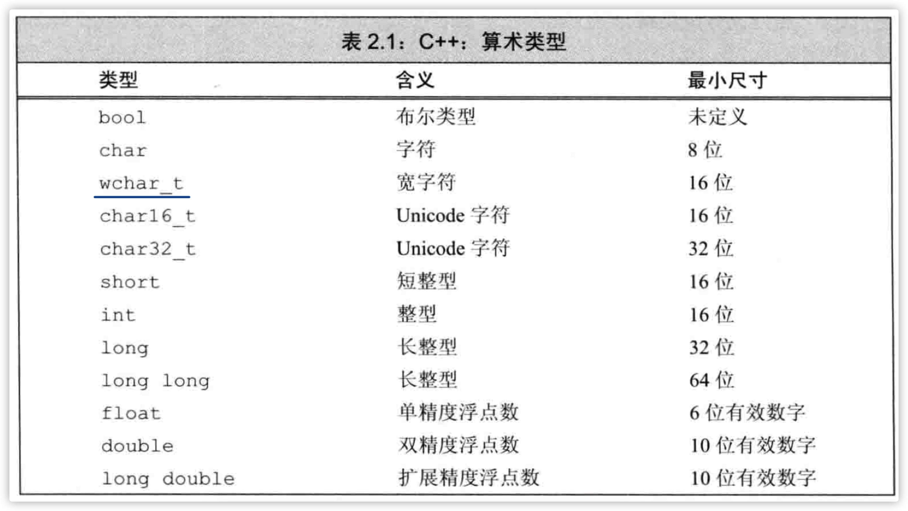


### 无符号类型

```c++
unsigned u=10;
int i=-42;
cout<<u+i<<endl;
// 输出 4294967264
```

相加之前先把整数-42转换为无符号数。然后计算出int这么长（如此处的32位）的无符号数。

### 字面值

`nullptr`、`true`、`false`、`"hello world"`都输入字面值。

## 变量

在C++中初始化和赋值是两个完全不同的操作。初始化不是赋值，**初始化**的含义是创建变量时赋予其一个初始值，而**赋值**的含义将当前对象的当前值擦除，而以一个新值来代替。

### 列表初始化

```cpp
int a = 0;
int a = {0};
int a{0};
int a(0);
```

C++11中引入`{}`来初始化变量，这种形式称之为`列表初始化`，其他类型，包括自定义类型也可使用这种初始化方式。

Note：使用列表初始化且初始值存在丢失信息的风险时，编译器会报错。

```cpp
double d = 3.1415;
int a{d}, b={d}; // 错误：存在信息丢失的风险
int c(d), e=d; //正确：转换成功，但确实丢失了信息
```

### 默认初始化

如果定义变量时没有置顶初值，则变量被默认初始化。

* 函数体之外的变量被初始化为0；
* 定义在函数体内部的变量不被初始化。

### 变量声明和定义

C++支持分离式编译。

如果将程序分为多个文件，则需要在文件之间共享代码。

* 声明：使得名字为程序所知。一个文件如果想使用别处定义的名字则必须包含对那个名字的声明。
* 定义：负责创建与名字关联的实体。*规定了变量的类型和名字，且为其申请了空间，还可能为其进行了初始化。*

```cpp
int j=10; // 声明并定义了j
extern int j; // 声明j，并没有定义j
// extern语句如果包含初始值就不再是声明，而变成了定义
extern double pi = 3.1415926;
```

Note：变量能且仅能定义一次，但可被声明多次。

### 嵌套的作用域

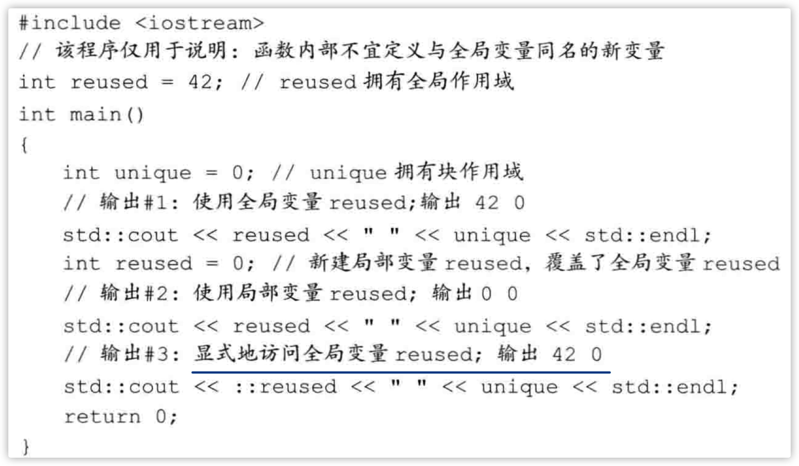

***

## 复合类型

基于其他类型定义的类型。

### 引用

引用分为**左值引用**与**右值引用**。

相当于为对象起了一个别名。？等价于指针常量（int * const a;）。

定义引用时，由于引用在赋值后不能再改变，所以必须在定义时就给它完成赋值。

引用并非对象，它只是为一个已经存在的对象起的另一个名字。

**所有引用的类型都要和与之绑定的对象严格匹配。引用只能绑定在对象上，而不能与字面值或者某个表达式的计算结果绑定在一起（const int &a = 10除外？）**

```cpp
int &r = 10; // 错误：引用类型的初始值必须是一个对象
double dval = 3.14; 
int &r2 = dval; // 错误：int类型引用的初始值必须是一个int型对象
```

### 指针

指针可以实现对其他对象的间接访问。

* 指针本身是一个对象允许对指针的赋值和拷贝。
* 无需在定义时赋值。

```cpp
int *p; // 指向int型对象的指针
```

#### 获取对象的地址

通过`&`取地址符获得对象的地址。

同引用一样，指针赋值的类型必须与指针指向的类型一致。

#### 利用指针访问对象

如果指针指向了一个对象，则允许使用**解引用符\***来访问该对象。

*？这里的解引用与后文的decltype没关系*

*在 C 语言中，将被指针所指的类型称为「被引用类型」（referenced type），指针的作用就是「提供引用」，所以对应的\*ptr 才被称作「解引用」。这些术语里的引用与 C++ 中的引用，虽然是同一个词，但不是同一个概念。*

```cpp
int val = 42;
int *p = &val;
cout<<*p<<endl;
```

#### 空指针

空指针不指向任何对象。

几个生成空指针的方法：

```cpp
int *p1 = nullptr;
int *p2 = 0;
// 需要导入#include<cstdlib>
int *p3 = NULL; // 等价于int *p3 = 0;
/**
*	不能
*	int *p；
*	p = 0;
*	也不能
*	int a=0;
*	int *p = a;
**/
```

指针和引用都能提供对其对象的简介访问，然而在具体实现细节上二者有很大不同，**最重要的一点是引用本身并非一个对象。一旦定义了引用，就无法令其再绑定到另一个对象，之后每次使用这个引用都是访问最初绑定的那个对象。**

* 指针是一个对象，可在生命周期内赋不同的值。
* 无需在定义是赋值。

#### `void *`指针

是一种特殊的指针，**可以存放任意对象的地址。**而并不知道void *指针中的数据类型。

以void *的视角来看，内存空间也就仅仅只是内存空间，没办法访问内存中的对象。

#### 指向指针的指针

* `*`表示指针
* `**`表示指向指针的指针
* `***`表示指向指针的指针的指针

```cpp
int ival = 1024;
int *pi = &ival;
int **ppi = &pi;
```

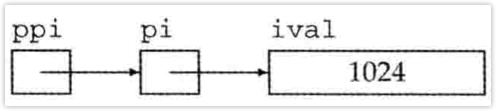

#### 指向指针的引用

引用本身不是一个对象，**所以不能定义指向引用的指针。**但是指针是对象，**所以存在对指针的引用。**

```cpp
int i=42;
int *p;
int *&r = p;//r是一个对指针p的引用
/**
从右往左看
&r->引用
* &r ->引用的恶是一个指针
int *->指针的类型
int * &r ->一个int类型指针的引用
**/
r = &i;
*r = 0;
```

## `const`限定符

const修饰的对象，一旦创建后就不能再更改。所以const对象必须初始化。

```cpp
const int size=512;
```

编译器会找到所有用到size的地方，用512代替。

如果程序包含多个文件，则每个用了const对象的文件都必须得访问到它的初始值才行。为了做到这一点，就必须在每一个用到变量的文件中都有对它的定义。

当多个文件中出现同名的const变量时，其实**等同于在不同的文件中分别定义了独立的变量。**

解决办法是，对于const变量不管是声明还是定义都添加`extern`关键字，这样只需要定义一次即可。

```cpp
// x.cpp定义并初始化一个常量，该常量能被其他文件访问
extern const int size = 512;
// x.h 与x.cpp中定义的size是同一个
extern const int size;
```

x.cpp定义并初始化了size。因为这条语句包含了初始值，所以它是一次定义。**因为size是一个常量，必须使用extern加以限定使其能被其他文件使用。**

x.h头文件中也由extenr做了限定，其作用是指明size并非本文件所独有，其定义将在别处出现。

### `const`的引用

```cpp
const int ci = 1024;
const int &r = ci;
int cj = 1024;
const int &r2 = cj;
r2 = 10; // 错误：不能使用常用引用修改对象
cj = 10; // 正确：cj是一个非常量
const int &r3 = 1024;
int &r4 = ci; // 错误：试图让一个非常量引用指向一个常量对象
```

对常量的引用不能用作修改他所绑定的对象。

它不关心ci、cj是否真的是常量，只是把它们看作是常量，不会去修改它们。

*严格来说，不存在常量引用。因为引用不是一个对象，所以我们没办法让引用本身恒定不变。而且c++中并不允许随意改变引用所绑定的对象，所以从这层意义上来说所有引用又是常量。**引用对象是常量还是非常量可以决定其所能参与的操作，却无论如何都不会影响到引用和对象所绑定关系本身。***

**所谓指向常量的指针或者引用，不过是指针或引用”自以为是“的常量，它们觉得自己指向了常量，所以不自觉地不去改变所指对象的值。把它指向的对象当作常量。**

### 初始化和对const的引用

引用的类型必须与其所引用对象的类型一致。

例外：

* 在初始化常量引用时允许用任意表达式作为初值，只要该表达式的结果能够转换成引用类型即可。

```cpp
double val = 3.14;
const int &ri = val;
```

上述操作是正确的。为了确保ri绑定一个整数，编译器做了如下操作：

```cpp
const int temp = val; //double强制转换成int
const int &ri = temp; // 让ri绑定这个临时量
```

*如果ri不是常量，就允许对ri赋值，这样就会改变ri所引用对象的值。此时，绑定的不是val而是临时量temp。既然让ri引用val，就肯定想通过ri改变val的值，否则不会给ri赋值。所以**c++就将这种行为归为非法行为。***

### 指针和`const`

#### 指针常量

类似常量引用，也是不能更改所指的对象。

```cpp
int num = 0;
const int *p = &num;
```

指针常量仅仅要求不能通过该指针改变对象的值，而没有规定那个对象的值不能通过其他途径改变。

#### const指针

常量指针(const pointer)必须初始化，而一旦初始化完成，则它的值（也就是存放在指针中的那个地址）就不能再改变了。

```cpp
int num = 0;
int *const p = &num; // p将一直指向num
```

仍然是从右往左读：

* const p：常量
* \* const p：指针类型的常量
* int * const p：指向int类型的指针类型的常量（int指针类型的常量）

#### 顶层`const`

指针本身是一个对象，它又可以指向另一个对象。所以，指针本身是不是常量以及指针所指的是不是一个常量就是两个相互独立的问题。

* 顶层const(top-level const)：表示指针本身是一个常量。
* 底层const(low-level const)：表示指针指的是一个常量。

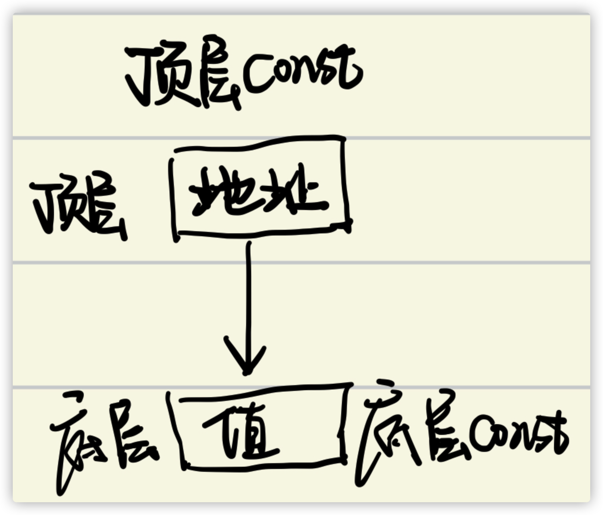

```cpp
int i = 0;
int *const p1 = &i; // 顶层const，不能改变p1的值
const int ci = 42; // 顶层const，不能改变p2的值
const int *p2 = &ci;  // 底层const，能改变p2的值
const int *const p3 = p2; // 第一个const是底层，第二个const是顶层
const int &r = ci;
```

常量是顶层const还是底层const区别明显，顶层const不受影响，底层const有影响。

```cpp
int *p = p3; // 错误：p3包含底层const，而p没有
p2 = p3; // 正确：p2，p3都是顶层const
p2 = &i; // 正确：int*能转换为const int*
int &i = ci; // 错误：普通的int&不能绑定到int常量上
const int &r2 = i; // 正确：const int&可以绑定到一个普通int上
```

* 拷贝p3时可以不在乎它是一个顶层const，但是必须清楚它指向的对象得是一个常量。
* p3的值可以赋给p2，是因为这两个指针都是底层const。*尽管p3也是一个常量指针，但仅就这次赋值而言不会有什么影响。*

#### `constexpr`和常量表达式

**常量表达式**：指值不会改变并且在**编译**过程中就能得到计算结果的表达式。

一个对象（表达式）是不是常量表达式由它的数据类型和初始值共同决定：

```cpp
const int a = 10; // 是
const int b = a + 1; // 是
int c = 10; // 不是
const int d = get_num(); // 不是
```

* 尽管c的初始值是个字面量，但由于它的数据类型只是一个普通的int而非const int，所以它不是常量表达式。
* 尽管d本身是一个常量，但它的具体值得到运行时才能获得到，所以也不是常量表达式。

**`constexpr`变量**

c++11运行将变量声明为`constexpr`类型，以便由编译器来验证变量的值是否是一个常量表达式。

```cpp
constexpr int mf = 20; // 20是常量表达式
constexpr int limit = mf + 1; // mf + 1是常量表达式
constexpr int sz = size(); // 只有当size()是一个constexpr函数时才是一条正确的声明语句
constexpr int size();
```

* const：并未区分出编译器常量还是运行时常量；
* constexpr：限定在编译器常量。

有利于编译器优化，提升效率。

*在一个复杂系统中，很难（几乎不能）分辨一个初始值到底是不是常量表达式。*

#### 字面值类型

字面值类型：

* 算数类型
* 引用
* 指针

非字面值类型：

* IO库
* string类
* 自定义类型...

尽管指针、引用都能定义成constexpr，但它们的初始值却受到严格限制。一个constexpr指针的初始值必须是nullptr或者0。

相反，定义于函数体之外的对象其地址固定不变，能用来初始化constexpr指针。？

#### 指针和`constexpr`

限定符constexpr只对指针有效，与指针所指的对象无关。（类型java的final）

```cpp
const int *p = nullptr; // 一个指向整形常量的指针
constexpr int *q = nullptr; // 一个指向整形的常量指针
```

constexpr将之定义为了一个顶层const。

### 处理类型

#### 类型别名

##### `typedef`

定义一个“变量”，这个变量名就代表了这个对象的类型。

```cpp
typedef int a; // a就是int类型
typedef int array[10]; // array就是一个有十个int类型的数组类型
array as; // as就是一个int as[10];
typedef double *p; // 等同于using p = double *;
p p1,p2;// 等同于 double *p1, *p2;
```

**指针、常量和类型别名**

```cpp
typedef char *pstring;
const pstring cstr=0; // 指向char常量的指针
const pstring *ps; // ps是一个指针，指向了一个指向char常量的指针
```

##### `using`

##### `auto`

C++11引入auto类型说明符，用它可以让编译器去分析表达式所属的类型。

auto根据初始值来推算变量的类型，所以auto定义的变量必须有初始值。

因为一条声明语句只能有一个基本数据类型，所以该语句中所有变量的**初始数据类型**都必须一样。

```cpp
auto i=0, *p=&i;//正确：i是整数，p时整形指针
auto sz=0, pi=3.14; // 错误：sz和pi的类型不一致
```

**复合类型、常量和`auto`**

编译器推断出来的auto类型有时候和初始值的类型并不完全一样，编译器会适当地改变结果类型使其更符合初始化规则。

```cpp
int i=0, &r=i;
auto a=r;
```

a使用r进行初始化，真正参与初始化的是引用对象的值。此时编译器以引用对象的类型作为auto的类型（即int类型）。

```cpp
const int ci=i, &cr=i;
auto b = ci; // b是一个整数（ci的顶层const被忽略了）
auto c = cr; // c是一个整数（cr是ci的别名，ci本身是一个顶层的const）
auto d = &i; // d是一个整形指针（整数的地址就是指向整数的指针）
auto e = &ci; // e是一个指向整数常量的指针（对常量对象取地址是一种底层const）
```

auto，一般会忽略掉顶层的const，保留底层的const。

如果希望保留顶层const的话：

```cpp
const auto f = ci; // ci仍被推算成int，f采用const修饰
```

常量引用可以绑定字面量：

```cpp
const auto &i = 10;
```

*const并不是数据的类型，只是一种修饰，所以在使用auto推断时不会跟着变量走。*

##### `decltype`

希望从表达式的类型推断出要定义的变量的类型，但不是用该表达式的值初始化变量，只是希望获得它的类型。

```cpp
decltype(func()) sum = 10; // sum的类型就是函数func的返回类型，解析func的返回值作为sum的类型
```

但是编译器并不会调用func()，**而是使用当调用发生时f的返回值作为sum的类型**。

```cpp
const int ci=0, &cj=ci;
decltype(ci) x = 0; // x的类型为const int
decltype(cj) y = x; // y的类型为const int&，y绑定到变量x
decltype(cj) z; // 错误：z是一个引用，需要初始化
```

decltype处理const的方式异于auto，它是会保存该变量的类型的（包括顶层const和引用在内）

**`decltype`和引用**

如果decltype使用的表达式不是一个变量，则decltype返回表达式结果对应的类型。

```cpp
// decltype的结果可以是引用类型
int i=42, *p=&i, &r=i;
decltype(r+0) b; // 正确：r+0的结果是int，所以b是一个（为初始化的）int
decltype(*p) c; // 错误：c是int&，必须初始化？
```

* r是一个引用，所以decltype(r)的话会得到一个引用类型，但是把r作为表达式的一部分（即r+0），表达式的结果为一个int整数，所以decltype会得到int类型。
* 如果表达式的内容是解引用操作（\*），则decltype将得到引用类型。解引用指针可以得到指针所指的对象，而且还能给这个对象赋值，所以，decltype(\*p)得到就是int *，而非int。

**decltype与auto一个重要的区别**：

对于decltype来说，如果变量名加上一对括号，则得到的类型与不加括号时会有不同。

* 如果decltype使用的是一个不加括号的变量，则得到的结果就是该变量的类型。
* 如果给变量加上一层或多层括号，那编译器就会把它当作一个表达式。变量是一种可以作为赋值语句左值的特殊表达式，所以这样decltype就会得到引用类型。？

```cpp
// decltype的表达式如果是加上了括号的变量，结果必然是引用
decltype((i)) d; //错误：d是一个引用
decltype(i) e; // 正确：e是一个为初始化的int
```

*decltype((v))的结果永远都是引用，而decltype(v)的结果，当且仅当v本身是一个引用时才会是一个引用。*

## 预处理器

头文件通常包含那些只能被定义一次的实体店，如类、const和constexpr变量。

头文件一旦改变，相关源文件必须重新编译以获取更新过的声明。

确保头文件经过多次包含仍能安全工作的技术是**预处理器**，从c语言继承而来。

预处理器是在编译之前执行的一段程序，可以部分的改变所写的程序，当预处理器看到`#include<>`时，就会用指定的头文件的内容来代替`#include<>`。

**头文件保护符**

预处理变量有两种状态：1、已定义。2、未定义。

* `#define`：把一个名字设定为预处理变量。
* `#ifdef`：当且仅当变量已定义时为ture。
* `#ifndf`：当且仅当变量未定义时为true。
* `#endif`：上面两个if的结束符号。

如：

```cpp
#ifndef xx
#define xx
#include <string>
struct Data {
  std::string a;
  unsigned b = 0;//类默认初始化变量
  double c = 0.0;
};
#endif
```

**预处理器无视c++中关于作用域的规则。**


# 字符串、向量、数组

## 命名空间的`using`声明

库函数基本上都属于命名空间std。

可以使用`using`来声明用到的空间。

```cpp
using namespace std;
// 那么就可以直接使用cin了
// 也可以独立使用using声明
using std::cout;
using std::endl;
```

**头文件不应包含using声明**

因为：头文件的内容会拷贝到所有引用它的文件中去，如果头文件里有某个using声明，那么每个使用了该头文件的文件就都会有这个声明。

对于某些文件来说，由于包含了某些名字，反而可能产生始料未及的错误。

## 标准库类型`string`

**string::size_type类型**

如果在表达式中混用了无符号类型，将会先转换成无符号数计算。

**当把string对象和字符字面值混在一条语句中使用时，必须确保每个‘+’号两侧的运算对象至少有一个是string**

```cpp
string s1 = "hello";
string s2 = s1 + "world"; // 正确：把一个string对象与一个字面量相加
string s3 = s1 + "," + "world"; // 正确：s1 + ","得到一个string对象， (s1 + ",")+字面量合法
string s4 = "hello" + "," + s2; // 错误："hello" + ","，不能把字面量直接相加
```

## 标准库类型`vector`

vector是一个容器，可以装其他的对象。

*初始化时指定vector的效率低于运行时加入元素来扩大容量，这与java恰恰相反。？*

两个vector对象相等，当且仅当**1、它们所含元素个数相同；2、对应位置的元素值也相同。**

### 使用数组初始化vector

不允许使用vector初始化数组，但是可以使用数组来初始化vector，**只需要指明拷贝区域的首元素地址和尾后地址即可。**

```cpp
int arr[] = {0, 1, 2, 3, 4};
vector<int> vec(begin(arr), end(arr)); //vec有6个元素，是arr的副本
```

也可以是使用数组的一部分来进行拷贝：

```cpp
vector<int> vec2(arr+1, arr+4);// 即arr[1],arr[2],arr[3]
```

### `vector`的增长

vector将元素连续存储，每个元素紧挨着前一个元素存储。*如果每次插入元素时，没有新的连续空间，则会触发重新分配空间，导致很多的复制、移动操作。*为了避免这种代价，标准库采用了可以减少容器空间重新分配的策略：**当不得不获取新的内存空间时，vector和string的实现通常会分配比新的空间需求更大的内存空间**。

#### 容量

* `capacity`：在不扩张内存空间的情况下，**可以容纳的元素数量**
  * size时实际装了多少元素，capacity是总共**能**装多少元素
* `reserve`：通知容器应该准备多少个元素（预分配的空间）
  * 只有当需要的内存空间超多当前容量时，reserve调用才会改变vector的容量。
  * 如果需求大小-小于等于当前容量，reserve什么也不做。**当需求大小小于当前容量时，容器不会回退内存空间。**
* `shrink_to_fit`：要求vector将超出当前大小的多余内存退还给系统

### 迭代器

所有标准库容器都可以使用迭代器，但是其中只有少数几种才同时支持下表运算。

string对象不属于容器，但是string支持很多与容器类型类似的操作。

迭代器通过获得容器对应位置上的指针来进行遍历。

* `begin()`：获得第一个元素的指针。
* `end()`：获得最后一个元素的下一个位置的指针（即为尾后指针）。

*特殊情况下，如果容器为空，则begin()与end()返回的是同一个位置的迭代器。*

通过解引用获得迭代器所指的元素：

```cpp
string s{"hello world"};
for(auto it = s.begin(); it != s.end(); ++it) {
   cout<<*it<<endl;
}
```

*end()返回的迭代器并不实际只是某个元素，所以不能对其进行递增或者解引用操作。*

*使用迭代器迭代（it!=end 而不是 <=）的原因是：这种编程风格在标准库提供的所有容器上都有效。*

#### 迭代器的类型

使用：

* `iterator`
* `const_iterator`

```cpp
vector<int>::iterator it; // it能读写vector<int>的元素

vevtor<int>::const_iterator it2; // it2只能读，不能写元素
```

#### `begin()`与`end()`

* 如果对象是常量，那么它们返回**const_iterator**
* 如果对象不是常量，那么它们返回**iterator**

如果想获得非常量对象的const_iterator：

```cpp
auto it = v.cbegin();
```

#### 结合解引用和成员访问操作

```cpp
// '.'运算优先级高于'*
(*it).empty();
*it.empty();
```

c++定义了`->`。它把解引用和成员访问两个操作结合在一起。即：

```cpp
it->item;
(*it)->item; // 等同于上一个操作
```

**但凡是用了迭代器的循环体，那么就不要改变容器中的元素数量。**

#### 迭代器运算

迭代器之间是可以比较大小的，它们比的是两个迭代器之间的距离。

```cpp
// string s{"hello world"};
auto x = s.begin() - s.end();
cout<< x <<endl;
// 输出-11
```

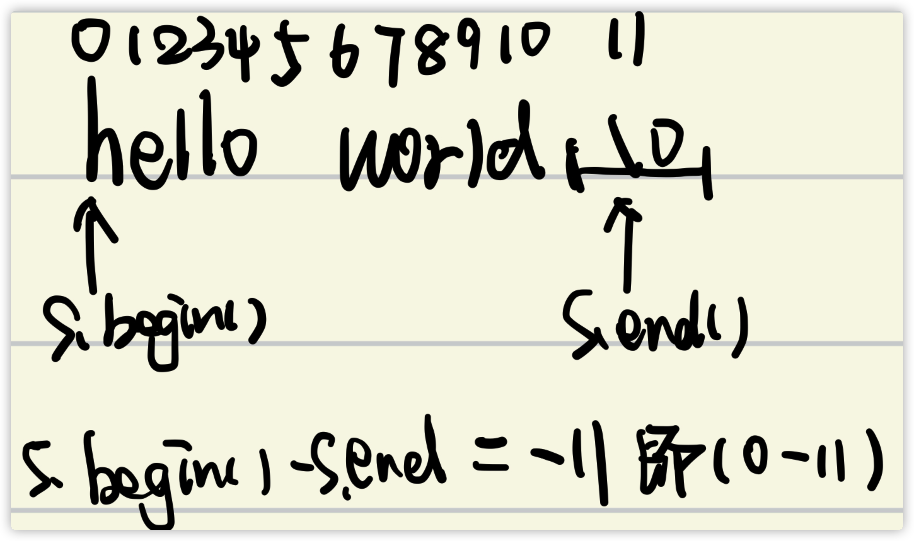

x是`difference_type`是一个带符号的整形数，因为距离可正可负。

## 数组

### 定义与初始化

int \*p=new int[5]; // 用常量初始化数组大小

*这种用法是 C 语言的 VLA（Variable Length Array）。VLA 最早是 gcc 实现的扩展，后被 C99 采纳。gcc 里，如果开了 -Wall 编译这段代码，会有明确的提示：*

*warning: ISO C++ forbids variable length array 'a' [-Wvla]标准 C++ 是禁止这种用法的。允许 VLA 的出现是一种扩展。*

**不能将数组内容拷贝给其他数组作为其初始值，也不能用数组为其他数组赋值**

```cpp
int a[] = {0, 1, 2};
int a2[] = a; // 错误：不允许使用一个数组初始化另一个数组
a2 = a; // 错误：不能把一个数组直接赋值给另一个数组
```

**理解复杂的数组声明：**

* 从右往左
* 有括号则先理解括号

```cpp
int *ptrs[10]; // ptrs[10]:数组， int *:整形指针。=> 存了10个整形指针的数组
int &refs[10]; // 错误：引用不是对象，不存在引用数组
int (*p)[10]; // *p：指针，int [10]:存有10个整形元素的数组。=> p指向了一个存有10个整形元素的数组
```

### 指针和数组

```cpp
string nums[] = {"one", "two", "three"};
string *p = &nums[0]; // p指向第一个元素
```

在很多用到数组名字的地方，编译器都会自动将其替换为一个指向数组首元素的指针。

**使用数组类型的对象其实是使用一个指向该数组首元素的指针。**

```cpp
int ia[] = {1,2,3,4};
auto ia2(ia); // ia2是一个整形指针，指向ia的第一个元素
// 实际做的如下的转换
auto ia2(&ia[0]);
ia2 = 42; // 错误：ia2是一个指针，不能使用int来赋值
```

**但是使用`decltype`不会发生上述转换**

```cpp
decltype(ia) ia3 = {1,2,3,4}; //ia3是一个包含10个整形元素的数组
```

#### 指针遍历数组

```cpp
int arr[] = {0,1,2,3};
int *p = arr; // 指向第一个元素
++p; // p+1不是加数字1，而是加一个int长度，也就是(p+1)是arr[1]的地址
```

为了获得尾后指针，可以使用数组实际长度的下个元素作为尾后指针：

```cpp
// arr长为4
int *tail = arr[4];
// 所以可以使用指针来遍历数组
for(int *b=arr; b!=tail; ++b) {
  // do something
}
```

为了准确的得到头、尾后指针，c++提供了两个标准库函数：

* begin
* end

```cpp
int ia[] = {0,1,2,3};
int *beg = begin(ia);
int *last = end(ia);
```

**尾后指针不能执行解引用和递增操作。**

### 数组指针运算

两指针相减的结果类型是`ptrdiff_t`的标准库类型，且因为差值可正可负，所以是一种有符号类型。

```cpp
auto b = end(arr) - begin(arr);
// 结果为两者之间的距离，arr长为4，那么结果为4-0=4
```

如果两个指针指向不相关的对象，则不能比较它们：

```cpp
int a=1, b=10;
int *p=&a, *q=&b;
if(p<q) // p和q无关，所以比较毫无意义
```

#### 解引用与指针运算

```cpp
int a[]={0, 1, 2, 3};
int b=*(a+2);// 等价于：a[2]
int c= *a + 2; // 等价于：a[0]+2
```

#### 下标和指针

只要指针指向的是数组中的元素，那么就都可以执行下标运算：

```cpp
int a[] = {0, 1, 2, 3, 4};
int *p = &a[2]; // p指向索引为2的元素
int j = p[1]; // p[1]等价于*(p+1)，就是a[3]，相当于a[2+1]
int k = p[-1]; // p[-1]等价于*(p-1)，就是a[1]，相当于a[2-1]
```

### 多维数组

**c++中不存在多维数组，只有存有数组的数组（数组里装的也是数组）。**

```cpp
int ia[3][4]; // 大小为3的数组，每个元素是含有4个整数的数组
// 大小为10的数组，每个元素都是大小为20的数组
// 这些数组的元素师含有30个整数的数组
int arr[10][20][30] = {0}; // 将所有元素初始化为0
```

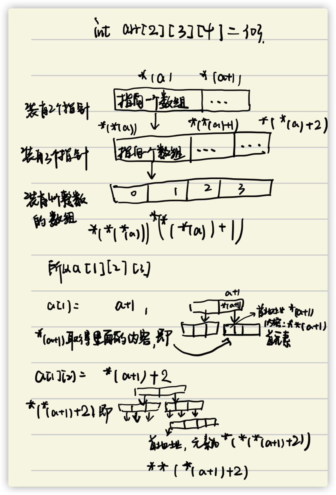

## 字符串

### `C`风格的字符串

C中的字符串以**空字符**结束（'\0'）。

C++中也支持C风格的字符串，但主要使用string。

stirng可以用普通的关系运算符个相等性运算符：

```cpp
string s1 = "a string example";
string s2 = "a different string";
if (s1 < s2) // 结果是false，即s2<s1，默认逐个比较字符的字典序
```

如果把这些运算符用到C风格字符串上，那么实际上比较的是**指针**而非字符串本身。

```cpp
char a[] = "hello";
char b[] = "helloo";
if(a < b) // 错误：视图比较两个无关的地址
```

### 混用string对象和C风格字符串

```cpp
string s("hello world");
```

任何出现字符串字面值的地方都可以用以空字符串结束的字符数组来代替。

反过来则是不成立的：如果某处需要一个C风格字符串，无法直接用string对象来代替它。

```cpp
char *ch = s.c_str()
```

stirng专门提供了一个名为c_str成员函数来将string转换为char[]。

# 表达式

表达式有一个或多个**运算对象**构成，对表达式求值将得到一个结果。

左值、右值！！！（暂时还未搞懂，接着看）

简单的归纳：当一个对象被当作右值时，用的是对象的值（内容）；当对象被当作左值的时候，用的是对象的身份（在对象中的位置。*在这个位置存东西*）

在需要右值的地方可以用左值来替代，但是不能把右值（只有值，没有空间）当作左值使用。当一个左值被当作右值使用时，实际上使用的是它的内容。

如果表达式的求值结果是左值，`decltype`作用于该表达式（不是变量）将得到一个引用。？？？

> ​	如int * p，因为解引用得到的是左值，所以decltype(*p)将得到一个引用类型即int &。另一方面，因为取地址符生成右值，所以decltype(&p)得到的类型是int **，即指针的指针。

## 求值顺序

优先级规定了运算对象的组合方式，但是没有说明运算对象按照什么顺序求值。

对于那些没有指定执行顺序的运算符来说，如果表达式指向并修改了同一个对象，将会引发错误并产生**未定义的行为。**

example：

```cpp
int i=0;
cout<<i<<" "<<++i<<endl; //未定义的
```

"<<"并没有规定何时以及如何对对象求值，所以上面语句是未定义的。

因为程序是未定义的，所以无法推断它的行为。

* 编译器可能先计算++i的值，再求i的值，此时输出结果为1 1
* 也可能先计算i的值，再计算++i，此时输出结果为0 1

> clion上是可以的？？？

所以此表达式的行为不可预知，因此不论编译器生成什么样的程序都是错误的。

所以：

* 最好用括号来强制让表达式的组合关系符合程序逻辑的要求。

* 如果改变了某个运算对象的值，在表达式的其他地方不要再使用这个运算对象。？

  > ​	例外：*++iter，此处++改变iter的值，iter（已经改变）的值又是解引用运算符的运算对象，此时求值的顺序不会成为问题，因为**++必须先求值，然后才会轮到解引用的运算。**

## 赋值

赋值运算满足右结合律。

```cpp
int ival, jval;
ival = jval = 0; // 正确：都被赋值为0
```

**赋值运算优先级较低**

```cpp
int i = get();
while(i != x) {
  i = get();
}

/ ***** /
while((i=get()) != x) {
  // do something
}
```

**递增、递减运算符**

* ++i：前置版本，避免了不必要的工作，把值加1后直接返回改变了的运算对象。
* -- i：后置版本，需要把原始值存储下来以便于返回这个未修改的内容。

**在一条语句中混用解引用和递增运算符**

```cpp
auto p = v.begin();
while(p != v.end() && *beg >= 0) {
  cout<< *p++ << endl;
}
```

\*p++等价于(\*(p++)，先计算括号内，然后解引用返回的p的副本，即未递增之前的值)：

1. *p
2. p = p+1

不恰当的混用可能造成未定义的行为：

```cpp
// 未定义的行为
*p = *p++;
// 编译器有多种执行方式
// 1. 先求左侧的值
*p = *p;
// 2. 先求右侧的值
*(p + 1) = *p;
```

## 成员访问运算符

* 点运算符  `.`
* 箭头运算符 `->`

都可以用于访问成员。

```cpp
// 以下两种方式都是等价的
p -> mem;
(*p).mem;
```

因为解引用运算符的优先级低于点运算符，所以的通过括号先执行解引用。

箭头运算符就直接结合了括号和点运算符。

## 条件表达式

**条件表达式的优先级非常低**

```cpp
cout<< ((a < 60) ? "a" : "b") << endl; // 输出a或者b
cout<< (a < 60) ? "a" : "b" << endl; // 输出0或者1
cout<< a < 60 ? "a" : "b" << endl; // 错误：试图比较cout与60
// 第二条等价于
cout<< (a < 60); // 0 or 1
cout ? "a" : "b"; // 根据cout的值是true或者false产生对应的字面值
// 第三条等价于
cout << a; // <优先级低于<<，所以先输出a
cout < 60 ? "a" : "b"; // 然后比较cout与60
```

## 移位运算符

移位运算符满足做结合律。

```cpp
cout<<"Hello"<<"World"<<endl;
// 等价于
((cout<<"Hello")<<"World")<<endl;
```

**移位运算符的优先级**

[关系、赋值、条件] < 移位  < 算术

## `sizeof`运算符

作用：

* `sizeof`返回一条表达式或者一个类型名字所占的字节数。
* `sizeof`满足右结合律，所的值是一个size_t类型的常量表达式。

使用方法：

* sizeof(type)

  ```cpp
  sizeof(int)
  ```

* sizeof expr

  ```cpp
  sizeof (10+10)
  ```

Example:

```cpp
ClassA data, *p;
sizeof(ClassA); // 存储ClassA类型的对象所占的空间大小
sizeof data; // data的类型的大小，即sizeof(ClassA)
sizeof p; // 指针所占的空间大小（地址总线的宽度）
sizeof *p; // p所指类型的空间大小，即sizeof(ClassA)
sizeof data.arttA; // ClassA成员arttA对应类型的大小
sizeof ClassA::arttA; // 同上，不过是另一种方法
```

`sizeof`运算符无须提供一个具体的对象，因为要想知道类成员的大小无需真的获取该成员。

## 类型转换

如果两种类型可以**相互转换**，那么它们就是关联的。

### 隐式类型转换

#### 算术转换

把一种算数类型转换成另一种算数类型。

* 整型提升：把小整数类型转换成较大的整数类型。bool->int, int->double...
* 无符号类型的运算对象：usigned int <-> int（存在隐患）

#### 其他类型的隐式类型转换

**数组转换成指针**

```cpp
int ia[10]; 
int *ip = ia; // ia转换为指向数组首元素的指针
```

**指针的转换**

* 0、nullptr可以转换成任意指针类型；
* 指向任意非常量的指针能转换成void*；
* 指向任意对象的指针能转换成const void*;
* 在有继承关系的类型还有另外一种指针转换的方式（flag）。

**转换成布尔类型**

存在一种**从算数类型或指针类型向布尔类型自动转换的机制。**如果指针或算数类型的值为0，转换结果为false，否则转换结果为true。

```cpp
char *cp = get_stirng();
if(cp){/**/}
```

**转换为常量**

允许将指向非常量类型的指针转换成指向相应常量类型的指针，对于引用也是这样。

*也就是说，如果T是一种类型，那么可以将指向T的指针或引用分别转换成指向const T的指针或者引用。*

```cpp
int i=0;
const int &j = i; // 非常量转换为const int的引用
const int *p = &i; // 非常量的地址转换成const的地址
int &r = j, *q = p; // 错误：不允许const转换成非常量
```

即：相反的操作不存在，因为它试图删除掉底层const。

**类类型定义的转换**

类类型能定义由编译器自动执行的转换，不过**编译器每次只能执行一种类类型的转换。**

如：只有一个参数的构造函数能接受字面量创建对象。

```cpp
string s, t = "hello"; // 字符串字面值转换成string类型
while(cin >> s) // while的条件不符把cin转换成了布尔值
```

### 显示转换

有时候希望显式地将对象强制转换成另外一种类型。

```cpp
int i, j;
double k = i/j;
```

如上，将int**强制类型转换**为了double。

*向上转型没啥问题，向下转型可能会出现数据丢失。（如double比int长，double->int不安全）*

**命名的强制类型转换**

`cast-name<type>(expression)`

cast-name有`static_cast`、`dynamic_cast`、`const_cast`和`reinterpret_cast`。

* **`static_cast`**：任何具有明确定义的类型转换，只要不包含底层const，都可以使用。

  ```cpp
  double k = static_cast<double>(j)/i;
  ```

  此时相当于告诉编译器：不在乎潜在的精度损失。

  ```cpp
  void *p = &d;
  // 将void*转换回初始的指针类型
  double *k = static_cast<double*>(p);
  ```

* **`const_cast`**：只能改变**运算对象**的底层const。

  ```cpp
  const char *pc;
  char *p = const_cast<char*>(pc); // 但是通过p写值是未定义的行为
  ```

  相当于“去掉const性质”。一旦去掉某个对象的const性质，编译器就不再阻止对该对象的修改了。

  * 如果对象本身不是一个常量，使用const_cast获得**写权限是合法的行为**。
  * 如果对象本身是一个常量，使用const_cast执行写操作就是**产生未定义的后果**。

  只有const_cast可以改变表达式的常量属性。

* **`reinterpret_cast`**：为运算对象的位模式**提供较低层次上的重新解释**。

  ```cpp
  int *ip;
  char *pc = reinterpret_cast<char*>(ip);
  ```

  看上去ip被转换成了char *，但实际上只是因为char与int都是可以变为一个数的（在较低层次上）。

  ```cpp
  string str(pc);// 将会报错
  ```

  其实pc所指的对象依然是一个int。

  使用`reinterpret_cast`是非常危险的，其中一个关键问题是类型改变了，但编译器没有给出任何警告或者错误提示。

#### 旧式的强制类型转换

* `type (expr)`：函数形式的强制类型转换
* `(type) expr`：C语言风格的强制类型转换

旧式的强制类型转换，分别具有和上述三种强制类型转换的相似行为。

```cpp
int *p;
char *pc = (char *)p;
```

如果替换后不合法，则旧式强制类型转换执行与`reinterpret_cast`类似的功能。

# 语句

**范围for语句**

```cpp
vector<int> v{1,2,3,4};
// 范围变量必须是引用类型才能对元素执行写操作
for(auto &i : v) {/**/}
```

## `try`与异常

* **`throw`**：表示它遇到了无法处理的问题。throw引发(raise)异常。
* **`try`**：异常处理部分使用try。以try开始，并以多个catch子句结束。

```cpp
if(condition)
  throw runtime_error("A error");
try {
  / ** /
} catch(exception A) {
  
} catch(exception B) {
  
}
```

# 函数

**形参**

```cpp
void f1() {/**/} // 隐式地定义空形参列表
void f2() {/**/} // 显式地定义空形参列表
```

**返回类型**

函数的返回类型不能是数组、函数类型，但可以是指向数组或者函数类型的指针。

## 局部对象

形参和函数体内部定义的变量统称为局部变量。

**自动对象**

只存在于块执行期间的对象称为**自动对象**。

当块的执行结束后，块中创建的自动对象的值就变成未定义的了。

**局部静态对象**

某些时候，有必要令局部变量的生命周期贯穿函数调用及之后的时间。**局部静态对象**在执行露肩第一次经过对象定义语句时初始化，**并且直到程序终止才被销毁**，在此期间即使对象所在的函数结束执行也不会对它有影响。

```cpp
size_t count_calls() {
  static  size_t ctr = 0;
  return ++ctr;
}
int main() {
  for(size_t i=0; i != 10; ++i) {
    cout<< count_calls() <<endl;
  }
}
```

每次调用不会覆盖ctr的值，ctr会不断累加。

如果局部静态变量没有显示的初始值，它将执行**值初始化**，内置类型的局部变量初始化为0。

## 函数声明

函数的名字必须在使用之前声明。

<返回类型、函数名、形参列表（类型）>

* 传值
* 传指针
* 传引用：c++中常用引用类型形参代替指针类型形参
  * 避免拷贝
  * 使用形参返回额外类型（传出参数）

### `const`形参和实参

顶层`const`作用于对象本身。

```cpp
const int ci = 42; // 不能改变ci，const是顶层的
int i = ci; // 正确：当拷贝ci时，忽略了它的顶层const
int * const p = &i; // p是顶层const
*p = 0; // 正确：通过p改变对象的内容是允许的
```

和其他初始化过程一样，**当用实参初始化形参时会忽略掉顶层const**。形参的顶层const被忽略。**当形参有顶层const时，传给它常量对象或者非常量对象都是可以的。**

```cpp
void f1(const int a) {/**/}
f1(10); // 正确
```

因为顶层的const被忽略了，所以函数形参列表不能以const作为区别。

```cpp
void f1(const int a) {/**/}
void f1(int a) {/**/}
```

这两个函数是同一个，并没有发生函数重载。

### 数组形参

数组作用在函数上有些不同。

* 不允许拷贝数组。
* 使用数组名时，会将其转换成指针。

所以无法以值传递的方式使用数组形参。所以传递一个数组时，实际上传递的是指向数组首元素的指针。

```cpp
void print(const int *); // 一个int或者数组的首元素
void print(const int[]); // 可以看出，函数的意图是作用于一个数组
void print(const int[10]); // 维度表示期望数组含有多少元素，实际上不一定
```

多维数组形参：

```cpp
int (*p)[10];
// 等价
// 编译器会忽略掉第一个维度
void (int p[][10]);
// p 声明看起来是一个二维数组，实际上形参是指向含有10个整数的数组的指针 flag
```

### 可变形参

有时无法提前预知应该像函数传递几个实参。

#### `initializer_list`形参

**如果函数的实参变量未知但是全部实参的类型都是相同的**，可以使用`initializer_list`类型的形参。

有点类似于vector，但不同于vector的是**`initializer_list`中的元素永远都是常量值，无法改变其中元素的值。**

```cpp
void f1(int a, initializer_list<string> ls) {
  for(int i=0; i<a; ++i) {
    for(string str: ls) {
      cout<< str << endl;
    }
  }
}
f1(10, {"hello", "world", "!!!"});
```

### 返回值

* 无返回值
* 有返回值

**在（需要返回值的函数）含有return语句的循环后面也应该有一条return语句，如果没有的话该程序就是错误的**，很多编译器无法发现此类错误。

#### 不要返回局部对象的引用或指针

flag

函数是在栈上运行的，在函数结束后这段栈空间将会被回收，如果返回的值是栈上的值，那么这个值将无效。

所以返回局部变量的引用的话，该引用指向的是之前函数占用的那段栈空间，所以在函数结束后将会指向一段无效的空间。

若是返回一个对象或者一个变量的话，会调用拷贝构造函数，实际上是这个对象（变量）的拷贝。

```cpp
ObjA f1() {return obj;}
ObjA a = f1();
// 那么此时a是obj的一个拷贝（但是在clion中返回的是同一个对象 flag）
```

**返回局部对象的引用是错误的；同样，返回局部对象的指针也是错误的。一旦函数完成，局部对象被释放，指针将指向一个不存在的对象。**

#### 引用返回左值

函数的返回类型决定函数调用是否是左值。调用一个返回引用的函数得到左值，其他返回类型得到右值。

能为返回非常量引用的函数的结果赋值。

```cpp
char &get_val(string &str, string::size_type ix) {
  return str[ix];
}
string str = "hello";
get_val(s, 0) = 'A';
// 此时str为“Aello”
```

#### 列表初始化返回值

函数可以返回花括号包围的值的列表。

```cpp
vector<string> f1() {
  return {"Hello", "World", "!!!"};
}
```

#### 返回数组指针

因为数组不能被拷贝。所以函数不能返回数组，但是函数可以返回数组的指针或引用。

```cpp
typedef int arrT[10]; // 类型别名，代表一个装有10个整数的数组
using arrT = int[10]; // 与上面等价
atrrT* func(); // 等价于：int (*arrT)[10]，一个指向装有10个整数的数组的指针
```

**返回指针的函数的定义**

```cpp
int (*func(int i))[10];
```

从内往外看：

* `func(int i)`：一个函数，接受一个int类型的参数
* 令`x=func(int i)`，那么`*func(int i) = *x`，函数的返回值是一个指针
* `int (*x)[10]`，这个指针指向一个装有10个整数的数组。

**使用尾置返回类型**

可以使用尾置返回类型简化func的定义。

```cpp
// 使用auto来代替原本的返回值，让auto根据尾置类型去推断
// func接受一个int类型的实参，返回一个指针，该指针指向含有10个整数的数组
auto func(int i) -> int(*)[10];
```

**使用decltype**

如果知道函数返回的指针将指向哪个数组，就可以使用`decltype`来声明返回类型。

```cpp
int odd[] = {1,3,5,7,9};
int even[] = {0,2,4,6,8};
// decltype(odd)只会获得数组类型（并不负责将数据类型转换成对应的指针），再加上*则获得 int[n] * （一个指向数组的指针）
decltype(odd) *arrPtr(int i) {
  return (i%2) ? &odd : &even;
}
```

#### 函数重载

函数名字相同，但是形参列表不同，称之为**重载函数**。*返回类型不能作为重载的依据*

**main函数不能重载。**

以下形参是一样的：

```cpp
void f1(const int);
void f1(const int a);
// const不参与重载
void f1(int);

typedef int I;
void f1(I);
```

* 一个拥有顶层const的形参无法和另一个没有顶层const的形参区分开来。
* 如果形参是某种类型的指针或者引用，则通过区分其指向的是常量对象还是非常量对象可以实现函数重载，此时const是底层的。

#### `const_cast`和重载

可以改变const的返回值。

```cpp
const string &f1(const string &s1, const string &s2) {
  return s1.size() < s2.size() ? s1 : s2;
}

string &f1(string &s1, string &s2) {
  // 将实参强制转换成对const的引用（不转也能调用）
  const string &s = f1(const_cast<const string&> s1, const_cast<const string&> s2);
  return const_cast<string &>(s);
}
```

#### 重载和作用域

重载对作用域的一般性质并没有什么改变：如果在内层作用域中声明名字，它将隐藏外层作用域中声明的同名实体。在不同作用域中无法重载函数名。

```cpp
string read();
void print(const string &);
void print(double); // 重载print函数
void fooBar(int val) {
  bool read = false; // 新的作用域：隐藏了外层的read
  string s = read(); // 错误：read是一个bool值，而非函数
  void print(int); // 新的作用域：隐藏了之前的print
  print("Hello "); // 错误：void print(const string &)被隐藏掉了
  print(ival); // 正确：当前print(int)可见
  print(3.14); // 正确：调用print(int)；print(double)被隐藏掉了
}
```

在fooBar中声明的print(int)隐藏了之前两个print函数，所以只有一个print函数可用：即print(int)。

> 当在fooBar中调用print时：
>
> * 编译器首先寻找对该函数名的声明，找到的是接受int值的那个局部声明。
> * 一旦在当前作用域中找到了所需的名字，编译器就会忽略掉外层作用域中的同名实体。
> * 剩下的工作就是检查函数调用是否有效了。

**C++中，名字查找发生在类型检查之前。**

调用过程：

* 第一个调用传入一个字符串字面值，但是当前作用域内print函数唯一的声明要求是一个int类型。字符串字面量无法转换成int类型，所以这个调用是错误的。
* 在外层作用域中的print(const string&)函数虽然与本次调用匹配，但是它已经被屏蔽掉了。
* 当为print传入一个double时，重复上述过程。编译器在当前作用域内发现print(int)函数，double类型的实参转换成int类型，所以调用是合法的。

### 特殊用途语言特性

* 默认实参
* 内联函数
* constexpr函数

#### 默认实参

某些函数有这样一种形参，**在函数的很多次调用中它们都被赋予一个相同的值，**此时这种形参可以称为默认实参。调用默认实参的函数时，可以包括该实参，也可以省略该实参。

```cpp
void f1(int a, int b=1, int c=3, int d=0);
```

**默认实参声明**

在给定的作用域中一个形参只能被赋予一次默认实参。即：函数的后续声明只能为之前那些没有默认值的形参添加默认实参，**而且该形参右侧的所有形参都必须有默认值。**

```cpp
void f1(int, char, int a=1, int b=2);
// 不能修改一个已经存在的默认值
void f1(int, char, int a=3, int b=2);
// 但可以为之前不是默认实参的形参添加默认值
void f1(int, char='*', int a=1, int b=2);
```

*通常在函数声明中指定默认实参，并将该声明放在合适的头文件中。*

**默认实参初始值**

**局部变量不能作为默认实参。**只要表达式的类型能转换成形参所需的类型，该表达式就能作为默认实参。

```cpp
int a=10;;
int f1();
void f2(int, int=a, int=f1());
```

#### 内联函数

常用的计算操作（如：表达式）适合定义成一些小函数，但是调用函数一般比求等价的表达式的值要慢。

**内联函数可以避免函数调用的开销。**通常就是将让它在每个调用点上”内联地“展开。

```cpp
// 在函数的返回类型前加上关键字inline，就可以将它声明成内联函数
inline const int add(int a, int b) {return a+b;}
cout<< add(10, 6) <<endl;
// 等价于
// 使用inline后将会在调用点展开
cout << (10 + 6) <<endl;
```

**内联只是向编译器发出一个请求，编译器可以选择忽略这个请求。**

一般来说，内联机制用于**优化小规模、流程直接、频繁调用的函数。**很多编译器都不支持**内联递归函数。**

#### `constexpr`函数

指能用于常量表达式的函数。

* 函数的返回类型及所有形参都得是字面值类型
* 函数体中必须有且只有一条return语句（多了的话，返回值就不是确定的一个了）

```cpp
constexpr int f1() {return 42;}
constexpr int x = f1();
```

* 编译器把对constexpr函数的调用替换成其结果值。

* 为了能在编译过程中随时展开，constexpr函数被隐式地指定为内联函数。

* constexpr函数体内也可以包含其他语句，只要这些语句在运行时不执行任何操作就行。

* **允许constexpr函数的返回值并非一个常量。**

  ```cpp
  // 如果传入f1的参数时常量表达式，那么f1就是一个常量表达式
  constexpr int f1(int a) {return a * 10;}
  ```

#### 内联函数和`constexpr`函数

和其他函数不一样，**内联函数和`constexpr`函数可以在程序中多次定义。**因为，编译器想要展开函数仅有函数声明是不够的，还需要函数的定义。**不过对于某个给定的内联函数或者constexpr函数来说，它的多个定义必须完全一致。**

由于**内联函数编译时需要直接插入代码，所以不能使用extern，每个编译模块必须包含其定义代码。（不是声明）**

基于上述原因，内联函数和constexpr函数通常需要定义在头文件。*就是指每个调用内联函数的源文件中都要有内联定义，所以把内联定义放在头文件。*flag

## 函数匹配

当存在函数重载时需要进行函数匹配。

### 确定候选函数和可行函数

第一步是选定本次调用对应的重载函数集，集合中的函数称为**候选函数**。

* 与被调用的函数同名
* 其声明在调用点可见

第二步是考察本次调用提供的实参，然后从候选函数中选出能被这组实参调用的函数，这些新选出的函数称为**可行函数。**

* 其形参数量与本次调用提供的实参数量相等
* 每个实参的类型与对应的形参类型相同

### 寻找最佳匹配

第三步是从可行函数中选择与本次调用最匹配的函数。

基本思想是：实参类型与形参类型越接近，它们匹配得越好。

### 含有多个形参的函数匹配

当实参的数量有两个或更多时，函数匹配就比较复杂了。

如果有且只有一个函数满足下列条件，则匹配成功：

* 该函数每个实参的匹配 都不劣于其他可行函数需要的匹配
* 至少有一个实参的匹配优于其他可行函数提供的匹配

*如果在检查了所有实参之后没有任何一个函数能匹配上，则该调用是错误的。*

### 实参类型转换

为了确定最佳匹配，编译器将实参类型到形参类型的转换划分成几个等级：

* 精确匹配
  * 实参类型和形参类型匹配
  * 实参从数组类型或者函数类型转换成对应的指针类型
  * 向实参添加顶层const或者从实参中删除顶层const
* 通过const转换实现的匹配
* 通过类型提升实现的匹配
* 通过算数类型转换或者指针转换实现的匹配
* 通过类类型转换实现的匹配

flag

#### 需要类型提升和算数类型

如：小整形一般都会提升到int或者更大的整形。

```cpp
// 只有当调用提供的是short类型的值时，才会选择short版本的函数
// 即使实参是一个很小的整数值，也会直接将它提升成int型
void f1(int);
void f1(short);
f1('a'); // char提升至int；调用f1(int);
```

所有算数类型转换的级别都一样。

如：从int到usigned int转换并不会比从int到double的转换级别高。

```cpp
// 3.14的类型double，既能转换成long也能转换成float，所以有二义性
void f1(long);
void f1(float);
f1(3.14); // 错误：二义性调用
```

#### 函数匹配和`const`实参

如果重载函数的区别在于它们的

* 引用类型的形参是否引用了const
* 指针类型的形参是否指向const

则当调用发生时编译器通过实参是否是常量来决定选择哪个函数。

```cpp
// 与指针不同，这样是可以参与重载的
void f1(int &);
void f1(const int &);
int a;
const int b;
f1(a); // void f1(int &)
f1(b); // void f1(const int &)
```

## 函数指针

* 函数指针指向的是函数而非对象。
* 函数指针指向某种特定的类型。
* 函数的类型由它返回类型的形参类型共同决定，与函数名无关。

```cpp
bool f1(const string &, const string &); 
```

那么上述函数类型为：`bool(const string &, const string &)`

函数指针声明:：

```cpp
// pf指向一个函数，该函数的参数是两个const string的引用，返回值类型为bool
bool (*pf)(const string &, const string &); // 未初始化
```

* pf前有一个\*（\*pf），所以pf是一个指针
* 右侧时形参列表，表示pf指向的是函数
* 左侧时bool，所以该函数的返回类型时bool

pf是一个指向函数类型的指针，该函数的参数是两个const string的引用，返回值类型为bool。

```cpp
// pf指向一个函数，该函数的参数是两个const string的引用，返回值类型为bool*
bool *pf(const string &, const string &); // 未初始化
```

如果pf不加括号的话，那么指向的这个函数类型的返回就是bool\*，而不是bool

### 使用函数指针

当把函数名作为一个值使用时，该函数自动地转换成指针。

```cpp
pf = f1; // pf指向名为f1的函数
// 等价于
pf = &f1;
```

还能直接使用指向函数的指针调用该函数，无须提前解引用指针

```cpp
bool b1 = pf("Hello", "World"); // ?
bool b2 = (*pf)("Hello", "World"); // 等价
bool b3 = f1("Hello", "World"); // 同样等价
```

**指向不同函数类型的指针之间不存在转换规则，**函数指针同普通指针一样，可以为它赋一个`nullptr`或者0。

### 重载函数指针

使用重载函数时，上下文必须清晰地界定到底应该选用哪个函数。

```cpp
void f1(int *);
void f1(unsigned int);

void (*pf1)(unsigned int) = f1; // pf1指向void f1(unsigned int)
```

编译器通过指针类型决定选用哪个韩素，**指针类型必须于重载函数中的某一个精准匹配**

```cpp
void (*pf2)(int) = f1; // 错误：没有任何一个f1与该形参列表匹配
double (*pf3)(int *) = f1; // 错误：pf3返回double，f1中返回类型不匹配
```

### 函数指针形参

**虽然不能定义函数类型的形参，但是形参可以是指向函数的指针。**此时，形参看起来是函数类型，实际上却是当成指针使用。

```cpp
// pf看上去是一个函数类型，定义了一个函数，但是它会自动转换成指向函数的指针
void f1(bool pf(int, int&));
// 等价的声明：显示地将形参定义成指向函数的指针
void f1(bool (*pf)(int, int&));

// 直接传入函数名即可
f1(pf);
```

**函数指针的别名**

```cpp
bool f1(int, int&);
// 函数类型
typedef bool func1(int, int &);
typedef decltype(f1) func2; // 等价

// 函数指针
typedef bool (*pf)(int, int &);
typedef decltype(f1)* pf2; // 等价
```

> 感觉typedef是：
> 定义一个完整类型（包括类型和变量名），然后再在前头加上typedef，那么之歌变量名就是整个类型别名
>
> 如上：去掉typedef都是一个完整的定义，加上后func1、func2、pf、pf2都变成了它们的别名。

`decltype`返回函数类型，此时不会将函数类型自动转换成指针类型。因为`decltype`的结果是函数类型，所以只有在结果前面加上\*才能得到指针。

```cpp
// 它们是等价的
void func(pf);
void func(pf2);
```

编译器自动将pf和pf2表示的函数类型转换成指针。

#### 返回指向函数的指针

**虽然不能返回一个函数，但是能返回指向函数类型的指针。**然而必须把返回类型写成指针类型，**编译器不会自动将函数返回类型当成对应的指针类型处理。**

```cpp
using F = int(int *, int); // 函数类型，不是指针
using PF = int(*)(int *, int); // （函数指针）指针类型
```

**和函数的形参不同，返回类型不会自动地转换成指针。**必须显式地将返回类型指定为指针：

```cpp
PF f1(int); // 正确：PF是指向函数的指针，f1返回指向函数的指针
F f1(int); // 错误: F是函数类型，f1不能返回一个函数（就如同数组，不能返回数组，只能返回数组指针）
F* f1(int); // 正确：显式地指定返回类型是指向函数的指针
```

***

或者直接声明：

```cpp
int (*f1(int))(int *, int);
```

有括号，从内往外看

* `f1(int)`：一个接受一个int形参的函数
* `*f1(int)`：这个函数返回一个指针
* `(*f1(int))(int *, int)`：这个指针指向一个函数，是一个函数类型指针
* `int (*f1(int))(int *, int)`：这个指针指向的函数是：接受两个形参，返回一个int类型的函数，

所以，f1是一个函数，它接受一个int类型，返回一个函数指针（这个函数长这样`int (int* int)`）。

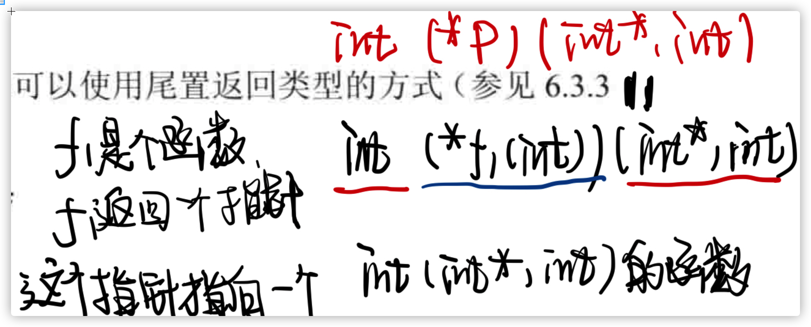

example:

抽丝剥茧

```cpp
 /**
  * *b[10]：一个装有10个指针的数组
  * (*b[10])():一个装有10个函数指针的数组
  * (*b[10])(void (*)())：一个装有10个函数指针的数组，这些函数的参数是void (*)()，也是一个返回void的无参函数
  * void (*b[10])(void (*)())：一个装有10个函数指针的数组，这些函数的参数是void (*)()，
     也是一个返回void的无参函数，这些函数的返回值是void
  */
void (*b[10])(void (*)());
```

***

或者使用**尾置返回类型**：

```cpp
auto f1(int) -> int(*)(int*, int);
```

#### 将`auto`和`decltype`用于函数指针类型

如果明确知道返回的函数是哪一个（曾经定义好的），就能使用`decltype`简化书写函数指针返回类型的过程。

```cpp
void f1(int, int*);
void f2(int, string);
// 如果明确知道返回的是f1类型函数，那么可以直接使用decltype
decltype(f1) *f3();
```


# 类

成员函数的声明必须在类的内部，它的定义既可以在类的内部也可以在类的外部。

**定义在类的内部的函数是隐式的inline函数。**

尽管所有成员都必须在类的内部声明，但是成员函数体可以定义在类内也可以定义在类外。

## `this`

当调用成员函数时，实际上是在替某个对象调用他。

* 成员函数通过一个名为`this`的额外的隐式参数来访问调用它的那个对象。
* 当调用一个成员函数时，用请求该函数的对象地址初始化`this`。

```cpp
obj.func1();
// 等价于如下伪代码
ClassA::func1(&obj); // 类似python中的self参数
```

编译器负责吧obj的地址隐式的传递进成员函数中。

在成员函数内部，可以直接调用该函数所属对象的成员，而无须通过成员访问运算符来做到这一点，因为`this`所指的正是这个对象。任何对类成员的直接访问都被看作是`this`的隐式引用。**当func1使用ClassA的成员时，它隐式地使用this指向成员，类似于this->arttA。**

## `const`成员函数

```cpp
class ClassA{
  public:
  	int arttA;
  	int func1() const{return arrtA};
};
```

func1参数列表后紧跟了一个const关键字，**这里，const的作用是修改隐式this指针的类型。**

默认情况下，this的类型是指向类类型**非常量版本**的**常量**指针，即`ClassA * const this`。

在某些类成员函数中，并不需要改变对象的成员属性的值，那么最好的办法就是让`this`去指向一个常量，即`const ClassA * const this`。但是`this`是隐式存在的，c++的做法是：**允许把const关键字放在成员函数的参数列表之后，此时，紧跟在参数列表后的const表示this是一个指向常量的指针。这样使用const成员函数称为`常量成员函数`。**

类似于下面的表示：

```cpp
int func1(const ClassA * const this);
```

此时func1只能读值，而不能修改对象的值。

**常量对象，以及常量对象的引用或指针只能调用常量成员函数。** *const函数只能调用const函数*

## 类作用域和成员函数

类的成员函数的定义嵌套在类的作用域之内。

类成员函数可以使用定义在它之后的成员变量。

* 首先编译成员的声明
* 然后才轮到成员函数体

所以成员函数可以随意使用类中其他成员而无序在意这些成员出现的次序。

## 在类外定义成员函数

在类外部定义成员函数时，成员函数的定义必须与它的声明匹配。

如果成员被声明成常量成员函数，那么它的定义也必须在参数列表后明确指定const属性。同时得带上它所属的类名。

```cpp
int Class::func1 const() {return arttA;}
```

一但编译器看到这个函数名，就能理解剩余代码是位于类的作用域中。

### 返回`this`对象的函数

返回对象本身，即一个this指针。

```cpp
ClassA &func2() {
  trturn *this;
}
```

## 构造函数

用来初始化对象的数据成员。

类可以包含多个构造函数，但是不同构造函数之间必须在参数数量或者参数类型上有所区别。

构造函数不能被声明成const。

### 合成默认构造函数

当没有定义构造函数时，编译器会提供一个默认构造函数，它不需要任何实参。

默认构造函数的初始化类的顺序：

* 如果存在类内的初始值，用它来初始化成员。

  ```cpp
  class ClassB{
    public:
    // 类内初始值
    	int a=10;
    	vector<int> v{0,1,3};
  }
  ```

  **当提供一个类内初始值时，必须以`=`或者`{}`表示**

* 默认初始化成员。（如：int类型的被初始化为0）

### 某些类不能依赖于默认构造函数

一旦定义了一些其他的构造函数，那么除非自定义一个默认构造函数（无任何实参），否则类讲没有默认构造函数。*依据：如果一个类在某种情况下需要控制对象的初始化，那么该类很可能在所有情况下都需要控制。如：某一个类不希望它的成员被默认初始化，必须赋值，那么它是不需要默认构造函数的，此时就不能合成默认构造函数。*

**只有当类没有声明任何构造函数时，编译器才会自动生成默认构造函数。**

而且合成的默认构造函数可能执行错误的操作。*如果定义在块中的内置类型或者复合类型的对象被默认初始化，则它们的值将是未定义的。*

有的时候编译器不能为某些类合成默认构造函数。*类中某种成员变量不存在默认的构造函数。*

#### `=default`

c++中，如果需要构造起的默认行为，那么可以在默认构造函数的参数列表后面写上`=default`。

```cpp
ClassA()=default;
```

定义这个构造函数的目的仅仅是因为即需要其他形式的构造函数，也需要默认的构造函数。希望这个函数完全等同之前的合成默认构造函数。

### 构造函数初始值列表

```cpp
class ClassA{
  public:
  	int a,b,c;
		string str;
  	
  // 构造函数初始化列表
  	ClassA(int a, int b, int k, string s): a(a), b(b), c(k), str(s){}
  
  	ClassA(int a,): a(a), b(1), c(2), str("Hello World"){}
}
```

* 构造函数不应该轻易覆盖类内的初始值，除非新赋的值与原值不同。
* 如果不能使用类内初始值，则所有构造函数都应该显式地初始化每个内置类型的成员。

初始值列表与构造函数体中初始化是有区别的：**如果没有在构造函数的初始值列表中显示地初始化成员函数，则该成员将在函数构造体之前执行默认初始化**

如果是在构造函数体中初始化的话：**会首先默认初始化一次，然后在执行构造函数体中的内容（赋值）。**

### 构造函数的的初始值

如果成员是const或者是引用的话，必须将其初始化。

```cpp
class ClassA{
  public:
  	ClassA(int ii);
  private:
  	int i;
  	const int ci;
  	int &ri;
}
ClassA::ClassA(int ii) {
  i = ii;
  ci = ii; // 错误：不能给const赋值
  ri = i; // 错误：ri没被初始化
}
```

初始化const或者引用类型的数据成员的唯一机会就是通过构造函数初始值。

**如果成员是const、引用或者属于某种未提供默认构造函数的类类型，必须通过构造函数初始值列表为这些成员提供初值。**

### 成员初始化顺序

* 构造函数初始值列表只能说明用于初始化成员的值，而不限定初始化的具体执行顺序。
* 成员的初始化循序与它们在类定义的出现顺序一致，**构造函数初始值列表中初始值的前后位置关系不会影响实际的初始化顺序。**
* 如果一个成员是用另一个成员来初始化，那么这两个成员的初始化顺序就要被考虑到。

### 默认实参和构造函数

构造函数也接受默认参数，**如果一个构造函数为所有参数都提供了默认实参，则它实际上也定义了默认构造函数。**

### 委托构造函数

一个委托构造函数使用它所属类的其他构造函数执行它自己的初始化过程，或者说它把它自己的一些（或全部）指责委托给其他构造函数。

```cpp
class ClassA{
  public:
  	int a;
  	float b;
  	string c;
  	ClassA(int a, float b, string c): a(a), b(b), c(c){}
  	ClassA(int a, float b): ClassA(a, b, "hello world") {}
  	ClassA(): ClassA(2, 5, "hello world") {}
}
```

如果构造函数A委托构造函数B：

先执行B的函数体，执行完成后再执行构造函数A的函数体。

### 类类型的隐式转换

如果构造函数只接受一个实参，则它实际上定义了转换为此类类型的隐式转换机制。

```cpp
class ClassA{
  public:
  	int a;
  	float b;
  	string c;
  	ClassA(int a): a(a) {}
  	ClassA(float b): b(b) {}
  	ClassA(string c): c(c) {}
  	void func(ClassA a);
}

ClassA a;
// 正确：由于隐式转换的存在
int b = 123;
a.func(b);
```

在需要使用到ClassA的地方都可以使用a,b,c即int、float、string来代替，因为ClassA分别存在只使用单个实参的构造函数。

#### 只允许一步类类型转换

编译器只允许a->c不允许a->b->c。

```cpp
// 错误：需要两步转换
/**
*	1.将“hello world”变为string
*	2.将这个（临时的）string变为ClassA
**/
a.func("hello world");
```

#### 抑制构造函数的隐式转换

可以通过将构造函数声明为`explicit`加以阻止。

```cpp
class ClassA{
  public:
  	explicit ClassA(int a);
}
```

* `explicit`只对一个实参的构造函数有效，需要多个实参的构造函数不能执行隐式转换

* 只能在**类内**声明构造函数时使用`explicit`，在类外定义时不要重复

* `explicit`构造函数只能用于直接初始化

  ```cpp
  ClassA a(10); // 正确：直接初始化
  ClassA a = 10; // 错误：不能将explicit构造函数用于拷贝形式的初始化过程
  ```

### 聚合类

聚合类可以使得用户直接访问其成员。

* 所有成员都是public
* 没有定义任何构造函数
* 没有类内初始值
* 没有基类，也没有`virtual`函数

example：

```cpp
struct StructA{
	int val;
  string s;
}
```

可以使用花括号来括起成员初始值列表。

```cpp
// 等价于：a.a = 123; a.b = "Hello World"
ClassA a = {123, "Hello World"};
```

### 字面值常量类

同算数类型、引用和指针外，某些类也是字面值类型。

**数据成员都是字面值类型的聚合类是字面值常量类。**

如果不是聚合类，但是满足以下标准，那么也是一个聚合类：

* 数据成员都必须是字面值类型

* 类至少含有一个`constexpr`构造函数

* 如果一个数据成员含有类内初始值，则内置类型成员的初始值必须是一条常量表达式

  或者如果成员属于某种类类型，则初始值必须使用成员自己的`constexpr`构造函数

* 类必须使用析构函数的默认定义

#### `constexpr`构造函数

构造函数不能是const的，**字面值常量类的构造函数可以是constexpr函数**，可以声明成`=default`或者`=delete`。

否则，`constexpr`构造函数就必须即满足构造函数的要求，也要满足`constexpr`的要求。

### 类的静态成员

通过`static	`使得其与类关联在一起。

#### 定义

既可以在类的内部定义也可以在类的外部定义静态**成员函数**，但是不能重复（`static`只能出现在类内部）。

```cpp
class ClassA {
  public:
  	int a;
  	static int f1();
}
int ClassA::f1() {
  return 10;
}
```

不能在类的内部初始化**静态成员**，相反的，必须在类的外部定义和初始化每个静态成员。静态数据成员只能定义一次。

#### 静态成员的类内初始化

类的静态成员不应该在类的内部初始化。**但是可以为静态成员提供const整数类型的类内初始值，不过要求静态成员必须是字面值常量类型的`constexpr`**

```cpp
class ClassA {
  public:
  	// 如果静态成员的应用场景仅限于编译器可以替换它的值，则一个初始化的const或者constexpr staic不需要分别定义
  	static constexpr int a = 10; // 类内初始化
}
// 外部再定义一次
const int ClassA::a;
```

如果类的内部为静态成员指定了一个初始值，**则成员的定义不能再指定一个初始值。**

即使一个常量静态数据成员在内部被初始化了，通常情况下也应该在类的外部定义一下该成员。

#### 静态成员与普通成员适用场景

静态成员独立于任何对象，所以在某些非静态数据成员可能非法的场合，静态成员却可以正常使用。如：静态成员可以是**不完全类型**

```cpp
class ClassA {
  public:
  	static ClassA a; // 正确：静态成员可以是不完全类型
  	ClassA *b;	// 正确：指针（or引用）可以是不完全类型
  	ClassA c; // 错误：数据成员必须是完全类型
}
```

另一个区别是：**可以使用静态成员作为默认参数**

```cpp
class ClassA {
  public:
  	void func1(int a=a);
  private:
  	static const int a;
}
```

非静态成员不能作为默认实参， 因为它的值本身属于对象的一部分，**这么做的结果是无法真正提供一个对象以便从中获取成员的值。**

### 在类的外部定义构造函数

```cpp
ClassA::ClassA(int a, int b, int c, string s): a(a), b(b), c(c){
  str = s;
}
```

## 拷贝

## 赋值

## 析构

## 访问与控制

使用访问说明符加强类的封装性：

* public
* private

#### `class`与`struct`

它们都是定义一个类，**唯一区别**只是默认访问权限不一样：

* class：private
* struct：public

### 友元函数

类可以允许其他类或者函数访问它的非公有成员，方法是使用`friend`关键字，即**友元函数。**

```cpp
class ClassA{
  
  friend int func1();
  
  friend int func1(int a) {
    return a + sum();
  }
  
  private:
  	int a, b, c;
  	
  	int sum() {
      return a + b + c;
    }
}

int func1(int a);
int func1();

int func1() {
  return sum();
}
```

**友元声明**只能出现在类定义的内部，但是在类内出现的具体位置不限。友元不是类的成员也不受它所在区域访问控制级别的约束。

**友元关系不存在传递性。**

#### 友元的声明

友元声明**仅仅指定了访问的权限**，而非通常意义上函数的声明。如果希望调用某个友元函数，那么就必须在友元声明之外再专门对函数进行一次声明。

为了使友元对类的用户可见，通常吧友元的声明与类本身放置在同一头文件中。

> class里的`friend void func();` 不算声明，需要在类外作声明。

```cpp
class ClassA{
  friend void f(){/**友元函数可以定义在类的内部**/}
  X() { f(); } // 错误：f还没被声明
  void g();
  void h();
}

void X::g() {f();} // 错误：f还没被声明
void f(); // 函数声明
void X::h() {f();} // 正确：f的声明以及在作用域中了
```


#### 成员函数作友元

可以使其他类的成员函数作友元。

```cpp
class ClassA{
  friend void ClassB::bFunc();
}
```

在bFunc使用使用ClassA之前需要先声明。

#### 函数重载与友元

如果一个类想把一组重载函数声明成它的友元，它需要对这组函数中的每一个分别声明。

## 类成员

用来定义类型的成员必须先定义后使用，这一点与普通成员有所区别。

### 类成员函数

**定义在类内部的成员函数都是自动inline的。**

* 隐式内联

  ```cpp
  class ClassA() {
    public:
    // 隐式内联
    	void func1(){}
  }
  ```

  

* 类内显式声明类外定义

  ```cpp
  class ClassA() {
    public:
    // 显式内联
    	inline void func1(){}
  }
  ```

  

* “追加”内联，类内不再声明，类外声明

  ```cpp
  class ClassA() {
    public:
    	void func1();
  }
  inline void ClassA::func1() {/**dosomething**/}
  ```

  

* 非内联，类内、外都不声明

  ```cpp
  class ClassA() {
    public:
    	void func1();
  }
  void ClassA::func1() {/**dosomething**/}
  ```

最好只在类外部定义的地方说明inline。

### 可变数据成员

有时希望能修改类的某个数据成员，即使是在一个const成员函数内。可以在变量的声明中加入**`mutable`**关键字做到这一点。

一个**可变数据成员（`mutable data member`）永远不会是const，即使它是const对象的成员**。

```cpp
class ClassA{
  public:
  	void some_member() const;
  private:
  	// 即使在一个const对象内也能被修改
  	mutable size_t access_ptr;
  
  // 尽管some_member是一个const成员函数，它依然能够改变access_ptr
  void some_member() const {
    ++access_ptr;
  }
}
```

### 基于`const`的重载

根据对象是否是const的，来决定它调用的重载版本。

```cpp
class ClassA {
public:
    ClassA & func1() {
        return *this;
    }
    // 必须加上ClassA前面的const， 后一个const决定了返回的this是一个常量
    const ClassA & func1() const{
        return *this;
    }
};

ClassA a;
a.func1(); // ClassA & func1();
const ClassA b;
b.func1(); // const ClassA & func1() const;
```

## 类的声明

可以仅声明类而暂时不定义它。

```cpp
class ClassA; // ClassA类的声明 
```

这种声明被称为**前向声明**，它向程序中引入名字ClassA，并且指明ClassA是一种类类型。对于类型ClassA来说，在它**声明之后定义之前**是一个**不完全类型**。*也就是说知道他是一个类型，但是不清楚它到底包含哪些成员。*

但是，类允许包含指向它自身类型的引用或指针。

## 类的作用域

### 定义在类外部的成员

```cpp
int ClassA::f1() {
  return this->a;
}
```

* 在处理参数列表之前已经明确了当前正位于ClassA类的作用域中。
* 函数的返回类型出现在函数名之前。**首先处理返回类型，之后才进入ClassA的作用域。**

### 名字查找

名字查找过程：

* 在名字所在的块中寻找其他声明语句，**只考虑在名字使用之前出现的声明。**
* 没找到则继续查找外层作用域。
* 如果最终没有找到匹配的声明，则程序报错。

类内部成员函数名字查找：

* 编译成员函数声明
* 类全部可见后才编译函数体

成员函数体直到整个类可见后才会被处理。

两阶段式处理，只适合于成员中使用的名字。

#### 类成员函数声明的名字查找

如果某个成员的声明使用了类中尚未出现的名字，则编译器将会在定义该类的作用域中继续查找。

```cpp
typedef doubel DB;
string a;
class ClassA{
  public:
  	DB f1() {return a;}
  private:
  	typedef string DB; // 错误：不能重新定义DB
  	DB a;
}
```

* 当编译器看到f1的声明时，它将在ClassA类的范围内寻找对DB的声明
* 编译器只考虑ClassA中使用DB前出现的声明
* 由于没有找到匹配的成员，所以编译器会接着到ClassA的外层作用域中查找（即在外层找到`typedef double DB;`）
* f1将在整个类可见后才被处理，所以该函数的return语句返回成员变量a，而不是外面的a。

虽然成员变量的名字可以覆盖外面作用域的名字，但是类型别名却不能在类中重新定义。

*尽管重新定义类型名字是一种错误的行为，但是编译器仍将顺利通过这样的代码。*

#### 成员定义中普通块作用域的名字查找

* 首先在成员函数中查找
* 再到类内继续查找
* 最后到定义函数的作用域中查找

当外层作用域中的名字被覆盖时，仍能使用它的名字：

```cpp
int a;
void ClassA::f1(int a) {
  return a * ::a; // ::a为外层作用域中的值
} 
int main() {
  
}
```

#### 全局作用域中的声明

```cpp
class ClassA{
  void func1();
}
// 正确：ca的声明位于func1的定义之前，所以可以正常使用
void ca();
void ClassA::func1() {ca();}

// 错误
void ClassA::func1() {ca();}
void ca();
```


# `I/O类`

* `iostream`：读写流
* `fstream`：读写命名文件
* `sstream`：读写内存模型

流之间存在继承关系。

I/O对象不能被拷贝与赋值，所以不能将形参或者返回值 设置为流类型。

## 流的状态

流会根据工作状态返回条件状态。

一但一个流发生错误，其后续的IO操作都会失败。只有当一个流处于无错状态时，才能从它读取数据，向它写入数据。

```cpp
while(cin >> world) // ok：读取成功
```

\>\>表达式返回流的状态。如果输入操作成功，流保持有效状态，则条件为真。

### 查询流的状态

将流作为条件使用，只能知道流是否有效，而无法知道具体发生了什么。

IO库定义了一个与机器无关的`iostate`类型，它提供了表达流状态的完整功能。

* badbit：系统级错误，如不可恢复的读写错误
* failbit：可恢复错误
* goodbit：流未发生错误
* eofbit：到达文件结束位置（此时failbit也会被置）

条件表达式中，只有goodbit为真，其他bit都为假。

### 管理流状态

流对象的rdstate成员返回一个iostate值，对应流的当前状态。

clear可以重置条件位：

* 不接受参数版本：复位所有错误标志位
* 带参数版本：接受一个iostate，将状态变为这个接受的状态

### 管理输出缓冲

每个输出流都管理一个缓冲区，用来保存程序读写的数据。

文本串可能立即打印出来，也有可能被操作系统保存在缓冲区，随后再打印。

有了缓冲机制，操作系统就可以将程序的多个输出操作组合成单一的系统级写操作。由于写操作的耗时，这样可以带来很大的性能提升。

导致缓冲刷新：

* 缓冲区满了
* 显式刷新缓冲区（如：endl）
* 每个输出操作后，可以用操作符unitbuf设置流的内部状态，来清空缓冲区
* 一个流被关联到另一个流

### 刷新输出缓冲区

* endl：换行并刷新缓冲区
* flush：刷新缓冲区，但不输出额外的自字符
* ends：向缓冲区插入一个空字符，然后刷新缓冲区

**unitbuf**

使用unitbuf操作符，可以在接下来的每次写操作之后都进行一次flush操作；

而nounitbuf操作符则重置流，使其恢复使用正常的系统管理的缓冲区刷新机制。

> ​	如果程序异常终止，输出缓冲区是不会被刷新的。当一个程序崩溃后，它所输出的数据很可能停留在输出缓冲区中等待打印。

### 关联输入和输出流

当一个输入流被关联到一个输出流时，任何试图从输入流读取数据的操作都会先刷新关联的输出流。

也就是说：一切输出操作都会在输入操作之前完成。

## 文件输入输出

三种类型来支持文件IO：

* `fstream`：从给定文件**读取**数据
* `ostream`：向一个给定文件**写入**数据
* `fstream`：可以**读写**给定文件

### 使用文件流对象

每个文件流类都定义了一个`open`的成员函数，它完成了一些系统相关的操作，来定位给定的文件。

```cpp
// 在构造时如果提供一个文件名，则open会被自动调用
ifstream in(file); // 构造一个ifstream并打开给定文件
ofstream out; // 输出文件流并关联到任何文件
```

### `open`与`close`

如果定义一个空文件对象，可以随后调用open来将它与文件关联起来。

```cpp
ifstream in(file); // 构筑一个ifstream并打开给定文件
ofstream out; // 输出文件流并关联到任何文件
out.open("new.out"); // 打开指定文件
```

调用open失败，failbit会被置位，而且对一个已打开的文件流调用open也会失败。

```cpp
// 检查open是否成功
if(out)
```

如果open成功，则open会设置流的状态，使得good()为true。

当一个fstream对象被销毁时，close会自动被调用。

### 文件模式

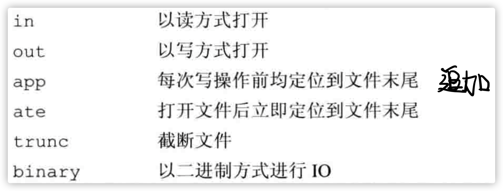

截断指的是**覆盖之前所写。**

* out只适用于ofstream、fstream
* in只适用于ifstream、fstream
* 只有out被设定时才可以设定trunc
* ate、binary模式适用于任何文件类型

## `string`流

* `istringstream`：从string读取数据
* `ostringstream`：向string写入数据
* `stringstream`：既可以从string读数据，也可以向string写数据

pass

# 顺序容器

顺序容器类型：

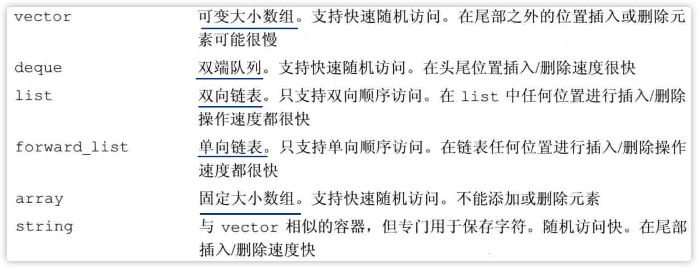

## 迭代器

迭代器有着公共的接口：**如果一个迭代器提供某种操作，那么所有提供相同操作的迭代器对这个操作的实现方式都是相通的。**（但有部分容器不支持某些操作，这与它的底层数据结构有关）

**迭代器的范围**

由一对迭代器表示。

begin、end构成迭代器范围的要求：

* 指向同一个容器中的元素，或者是容器最后一个元素之后的位置
* 可以反复递增begin来到达end

### 容器类型成员

pass

### 	`begin`与`end`

begin与end有多个版本：

* rbegin/rend：反向迭代器
* begin/end：正常迭代器
* cbegin/cend：常量迭代器
* crbegin/crend：反向常量迭代器

但是常量对象的begin/end是自动返回常量迭代器的。

## 定义与初始化

### 使用容器拷贝

一个容器通过另一个容器拷贝完成初始化有两种方法：

* 直接拷贝整个容器（array除外）
* 拷贝一个由迭代器表示的范围

为创建一个容器为另一个容器的拷贝，两个容器的类型及其元素类型必须匹配。**当传递迭代器参数来拷贝一个范围时，就不要求容器类型是**，而且新容器和原始容器中的类型也可以不同，**只要能将拷贝的元素转换为要初始化的容器即可。**

```cpp
list<string> ls = {"Hello", "World"};
vector<const char*> v = {"a", "bc", "def"};
list<string> ls2(ls);
vector<string> v2(ls); // 错误：容器类型不匹配
vector<string> v3(ls.begin(), ls.end()); // 正确
list<string> ls3(v.begin(), v.end()); // 正确：可以将const char*转换为string
```

### 列表初始化

```cpp
list<string> ls = {"Hello", "World"};
vector<const char*> v = {"a", "bc", "def"};
```

容器将包含与初始值一样多的元素。

### 与顺序容器大小相关的构造函数

上面两种初始化方法与**关联容器**中的是一样的，顺序容器还提供另一个构造函数，接受一个容器大小和个一元素初始值。

```cpp
vector<int> v1(10, -1);
vector<int> v2(10);
```

只有顺序容器的构造函数才接受大小参数，关联容器并不支持。

### `array`

array类似于内置数组，它的大小也是类型的一部分。除了指定元素类型外，还要指定容器大小。

```cpp
array<int, 10> a;
```

如果对array进行列表初始化，初始值的数目必须等于或小于array的大小。

虽然不能对内置数组类型进行拷贝或对象赋值操作，**但是array却是可以的。**

## 操作

### `assign`

赋值运算符需要左右两边的运算对象具有相同的类型。

assgin需要传入一个迭代器范围，只需要两个容器中的元素能够相互转换即可。

```cpp
list<string> ls;
vector<const char*> v;
v = ls; // 错误：容器类型不匹配
v.assign(ls.cbegin(), ls.cend()); // 正确：将string转换为char*
```

### 赋值和`swap`

交换两个容器中的元素。

```cpp
vector<int> v1(10);
vector<int> v2(20);
swap(v1, v2);
```

swap会很快，因为元素本身并未交换，swap只是交换了两个容器的内部数据结构，即地址。

除了指定string，指向容器的迭代器、引用、指针在swap操作后都不会失效。它们仍指向swap操作之前所指的那些元素。但是在swap之后，这些元素都是属于不同的容器了。

与其他容器不同，array的swap会真正交换它们的元素（即一个一个的复制）。

### 容器大小

* size：返回容器中元素的数目
* empty：当容器为空时为true
* max_size：返回一个大于或等于该类型容器所能容纳的最大元素的值

### 关系符运算

每个容器都是支持`==`、`!=`的，除无序关联容器外的所有容器都支持关系运算符`>`、`>=`、`<`、`<=`。

比较规则：

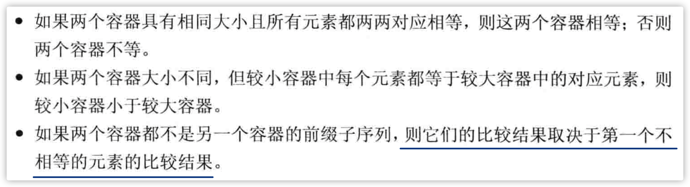

example：

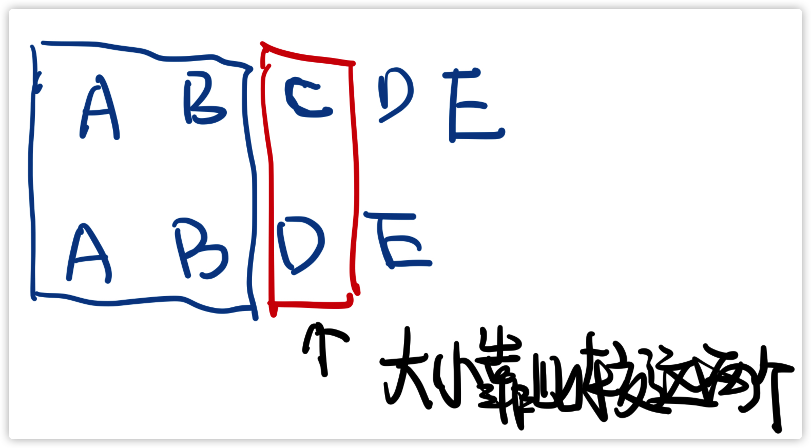

### 顺序容器的操作

#### `push_back`

将一个元素追加到尾部。

```cpp
Obj obj;
vector<Obj> v;
// 会使用obj的拷贝构造函数，即装入vector的是obj的拷贝版本，而不是对象本身
v.push_back(obj);
```

`push_front`类似，但是往前追加。

#### `insert`

* 将元素插入到迭代器的指定位置**之前的位置**。

  ```cpp
  // 将“hello”添加值iter之前的位置
  v.insert(iter, "hello");
  ```

* 插入范围元素

  将指定数量的元素添加到指定位置之前，这些元素都按给定值初始化。

  ```cpp
  // 将10个“hello”插入至iter之前
  v.insert(iter, 10, "hello");
  // 将iter1至iter2之间的元素插入到v的iter之前的位置，但是iter1、iter2不能是指向v的迭代器
  v.insert(iter, iter1, iter2);
  ```

#### `emplace`

c++11引入了`emplace_front`、`emplace`、`emplace_back`。这些操作对标`push_front`、`insert`、`push_back`。但是它们不是拷贝元素，而是**构造元素**，所以需要将元素的构建参数传入其中。`emplace*`会将这些参数传入元素的构造函数中。

#### 访问元素

有`front`、`back`成员函数。

* front：返回第一个元素的引用
* back：返回最后一个元素的引用

#### 删除元素

* `pop_front`：删除首元素
* `pop_back`：删除尾元素

这两个方法返回的是void，如果需要获得删除的元素的话，需要事先保存好这些元素。

* 从容器内部删除一个元素

  `erase`从容器中指定的位置删除元素。

  ```cpp
  // 删除迭代器iter指定的位置
  v.erase(iter);
  ```

* 删除多个元素

  erase接受一对迭代器，删除一个范围内的元素。

  ```cpp
  v.erase(iter1, iter2);
  // 删除容器中的所有元素
  v.clear();
  v.erase(v.begin(), v.end()); // 效果等同于上
  ```

#### 改变容器大小

可以使用resize来增大或缩小元素。

```cpp
vector<int> v(10, 10);
v.resize(15); // 将5个0添加到v的后面
v.resize(25, -1); // 将10个-1添加到v的后面
v.resize(5); // 从v的尾部删除20个元素
```

#### 容器操作可能使迭代器失效

向容器添加元素后：

* vector与string
  * 存储空间被重新分配：迭代器、指针、引用都会失效
  * 存储空间未被重新分配：指向**插入位置之前**的迭代器、指针、引用仍然有效，指向**插入位置之后**的元素和迭代器、指针、引用会失效。
* deque
  * 插入到除首尾位置之外的位置：都会导致迭代器、指针、引用失效。
  * 插入到首尾位置：**迭代器会失效**，但是指向存在的元素的**指针、引用不会失效**。
* list与forward_list：迭代器、指针、引用仍会有效

删除元素：

* list与forwad_list：指向容器的迭代器、指针、引用仍然有效
* deque
  * 删除首尾之外的任何元素：迭代器、指针、引用都会失效
  * 删除尾元素：尾后迭代器会失效，但是其他迭代器、引用、指针不受影响
  * 删除首元素：不会受到影响
* vector与string：指向被删除元素之前的迭代器、引用和指针仍然有效，**但是删除元素时尾后迭代器总是失效**

## 容器适配器

接受一种已有的容器类型，使其行为看上去像一种不同的类型。

适配器的构造函数：

* 默认构造函数：创建一个空对象
* 接受一个容器的构造函数：将会拷贝其中的元素

exmaple：**如stack和queue是基于deque实现的**，**priority_queue实在vector之上实现的。**

```cpp
// 在vector上实现的栈
stack<string, vector<string>> str_sk; 
// 初始化时保存v的拷贝
stack<string, vector<string>> str_sk2(v);
```


# 泛型算法

这些算法中的大多数独立于任何特定的容器。这些算法是的通用的（generic即泛型）。

大多数算法提供了一种方法，允许我们使用自定义的操作来代替默认的运算符。

**算法可能改变容器中保存的元素的值，也可能在容器内部移动元素，但永远不会直接添加或删除元素。**

## 只读算法

只会读取其输入范围内的元素。

find、count

* `accumulate`：计算和

  ```cpp
  // 一对迭代器以及一个初始值
  accumulate(v.begin(), v.end(), 0);
  ```

* `equal`：操作两个序列的算法，用于确定两个序列是否保存相同的值，将第一个序列中的每个元素与第二个序列中的对应元素进行比较。

  ```cpp
  equal(v1.cbegin(), v1.end(), v2.cbegin());
  ```

## 写容器算法

将新值赋予序列中的元素。

* `fill`：填充元素

  ```cpp
  // 把v全部填充为-1
  fill(v.begin(), v.end(), -1);
  ```

* `back_insert`：**插入迭代器**，一个与赋值号右侧相等的元素被**添加**到容器中。

### 拷贝算法

将一对迭代器表示的范围的元素拷贝至一个起始位置。

```cpp
int a1[] = {0,1,2,3,4,5};
int a2[sizeof(a2)/sizeof(*a1)];
// ret指向拷贝到a2的尾元素之后的位置
auto ret = copy(begin(a1), end(a1), a2); // 把a1的内容拷贝给a2
```

### 重排容器元素的算法

sort、unique。

## 定制操作

有时候默认的比较操作不能完成任务。

### 向算法传递函数

