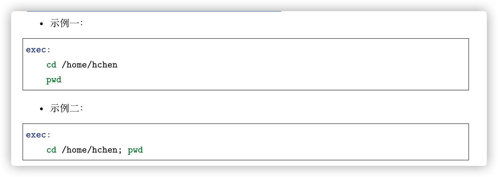

# 1. 规则

编写makefile基本规则：

* 工程没有被编译过，则所有文件都要被编译且链接
* 编译过，则某几个文件被修改，则重新编译文件，并链接
* 如果头文件改变，则只需要编译引用了这几个头文件的c文件


or写在一行


* target：目标文件。*如：a.cpp编译完成a.out，那么a.out就是目标文件*。
* prerequisites：target的依赖项，说明了目标文件由那些文件构成。
* command：当prerequisites变化时，需要执行的命令。

也就是说：**当prerequisites中的文件集合存在比tartget还要新的文件是，就会执行command定义的命令**，这就是makefile的核心规则。


* command要以一个Tab开头
* clean没有依赖文件，所以永远不会自动执行，需要手动执行，所以类似于一条命令

## 1.1 make的工作

默认情况下输入make就可以开始编译了：

* make会在当前目录小寻找"makefile"或者"Makefile"的文件
* 找到后，会寻找makefile文件中的第一个target（上文中就是edit）的文件，并把它作为最终的目标文件
* 如果edit不存在，或者它的依赖项比它要新，则会递归去生成所依赖的文件

如果找到后，但是冒号后面的依赖项不存在，那么make将会停止工作。

## 1.2 makefile中的变量

使用变量（类似宏定义，只是字符串的替换）。


## 1.3 make的自动推导

make可以自动推导文件以及文件依赖关系后面的命令，只要make看到.o文件就会自动的将.c文件加入到依赖关系中，如看到a.o就会将a.c加入到a.o的依赖项中。

那么makefile又可以继续简化：


也可以将它们都写在一行当中：


## 1.4 写出清空目标文件的规则


最好手动给出所有生成文件的清除规则。

第二种clean中rm前面的“-”意味着也许某些文件会出现问题，但不需要理会，继续完成后面的事情。

## 1.5 makefile文件名

默认情况下，make会在当前目录下寻找：

* GNUmakegile
* makefile
* Makefile

也可以使用命令来指定makefile

```shell
make -f/--file Make.Linux/or others
```

## 1.6 引用其他的Makefile

```makefile
include <filename>
# example
include foo.make a.mk b.mk c.mk f.mk
```

make开始时，会**寻找include所指出的其他makefile，并把内容安置到当前位置。

所以，make工作主要分为两步：

1. 读入依赖
   * 读入所有的makefile
   * 读入被include的其他makefile
   * 初始化文件中的变量
   * 推导隐晦规则，并分析所有规则
   * 为所有的目标文件创建以来关系链
2. 生成目标文件
   * 根据依赖关系来决定哪些目标要重新生成
   * 执行生成命令生成目标文件

# 2. 书写规则

**依赖关系**和**生成目标**的方法是很重要的，因为makefile中只应该有一个最终目标，其他目标都是被这个目标连带出来的。

## 2.1 使用通配符

make支持三种通配符：

* *

  

  需要注意的是：

  ```makefile
  # 并不会产生通配符的效果，只是简单的字符串的替换
  obj = *.c
  # 需要使用${}
  obj = $(*.c)
  ```

  

* ?

  

  是一个**自动化变量**类似于shell的外部输入的变量。

* ~（用于指出当前用户的根目录）

## 2.2 伪目标

clean是一个伪目标，它并不是一个文件，只是一个标签，**所以make无法生成他的依赖关系和决定它是否要执行。**且**伪目标的命名不能和文件名重名。**

为了避免和文件重名，可以使用一个特殊的标记“**PHONY**”来显式地指明一个目标是伪目标，向make说明不管是否有这个文件，这个目标就是一个伪目标。


也可以为伪目标指定所依赖的文件。同样，伪目标也可以作为默认目标，只需要放在第一行即可：


## 2.3 多目标

pass

## 2.4 静态模式

可以更加容易地定义多目标的规则，可以让规则变得更加有弹性和灵活：


* targets：是目标文件的一个集合
* target- pattern：指明了targets的模式，也就是目标集模式
* prereq-patterns：是目标的依赖模式，是对target- pattern的再一次定义

example：


* targets: $(objects)
* target- pattern: %.o
* prereq-patterns: %.c

%.o会去适配objects中的规则，然后扩展到%.c 中，上述例子扩展后：


## 2.5 自动生成依赖性

C/C++编译器都支持一个"-M"来自动寻找源文件中包含的头文件，并生成一个依赖关系。


GNU建议把编译器为每个源文件自动生成的依赖关系放到一个文件中，为每一个x.c文件生成一个x.d文件，x.d文件中就存放着对应的.c文件的依赖关系：


# 3.书写命令

## 3.1 显示命令

当使用@字符在命令行前，那么这个命令将不被make显示出来：

```makefile
@echo hello world
# 输出：hello world
echo hello world
# 输出： echo hello world
```

## 3.2 命令执行

如果要让上一条命令的结果应用在下一条命令，可以使用分号分隔这两条命令。

example：

希望pwd在cd后执行：



case1：输出当前目录

case2：输出/home/hchen

## 3.3 命令出错

如果一条规则中的某个命令出错了，那么make就会终止执行当前规则，浙江可能终止所有规则的执行。

## 3.4 嵌套执行make

可以把不同模块或是不同功能的源文件放在不同的目录中，可以在每个目录中都书写一个该目录的makefile，然后在某一个makefile（总控makefile）中执行其他的makefile。


进入子目录中执行子makefile。

pass

## 3.5 自定义命令

将一系列动作当做一个命令，以`define`开始，以`endf`结束：


run-yacc就是这些命令的名字。


run-yacc中的命令会被依次执行。

# 4. 变量

## 4.1 使用变量

使用$加()或者{}来表示变量。


展开后：


## 4.2 变量中的变量

可以使用其他变量来定义变量，**不一定非要是已定义好的值，也可以是后面定义的值**。


输出：Huh?

这样虽然可以延迟定义的时间，但可能出现递归定义：


使用 `:=`赋值可以避免上述情况，这样前面的变量就不能使用后面的变量了。

## 4.3 变量的高级用法

### 4.3.1 变量值的替换

```makefile
$(var:aa=b)
```

把变量var中所有以aa结尾的字符串中的aa部分替换为b。

Example：

```makefile
foo := $(a.o b.o c.o)
bar := $(foo:.o=.c) # 替换后bar为a.c b.c c.c

# 等价于使用静态模式
foo := $(a.o b.o c.o)
bar := $(foo:%.o=%.c)
```

### 4.3.2 把变量再当成变量

```makefile
x = y
y = z
# x展开 $(y)
# y展开 z所以a的值为z
a := $($(x))
```

## 4.4 追加变量值

可以使用`+=`来给变量追加值。


## 4.5 `override`

如果makefile中的一个变量是通过命令行参数给出的，那么在文件中对该变量的赋值将会被忽略。

此时，可以通过`override`来完成赋值。

# 5. 条件判断

