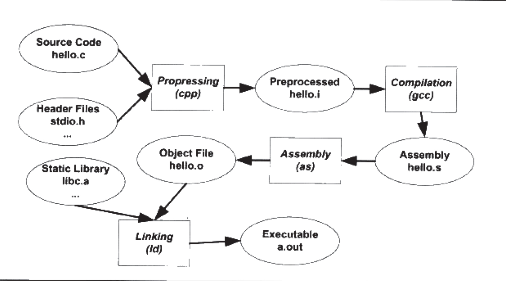
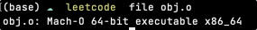
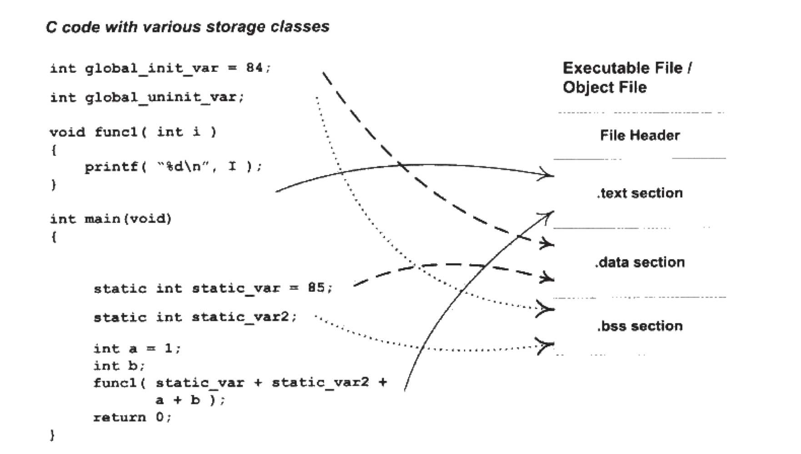
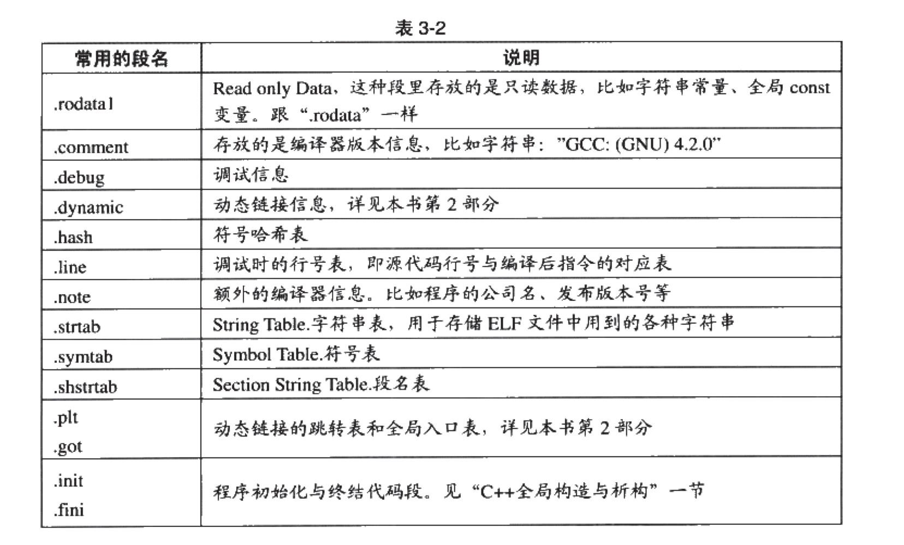
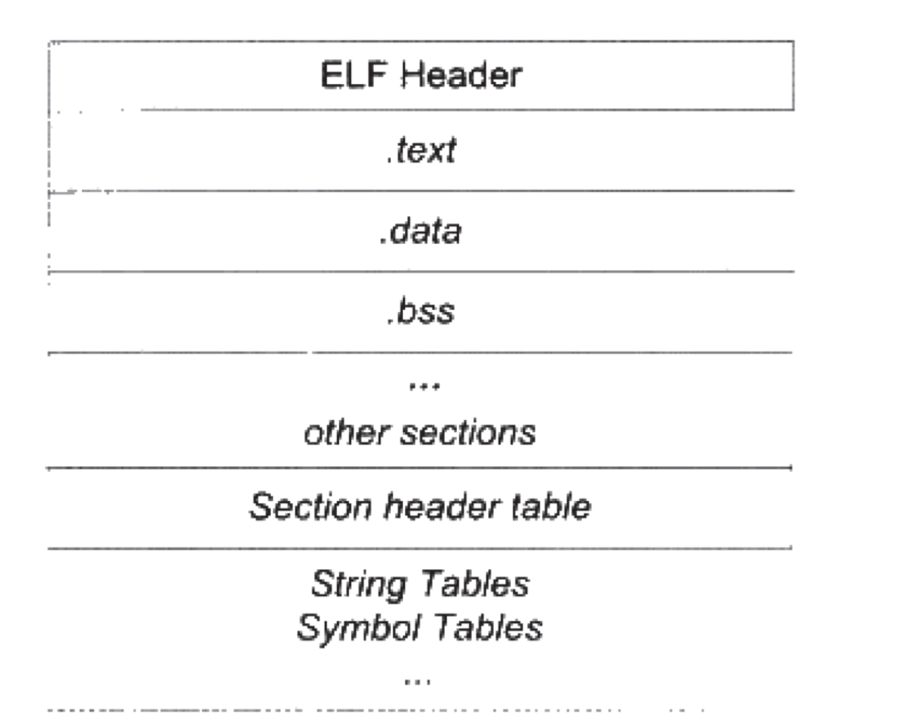
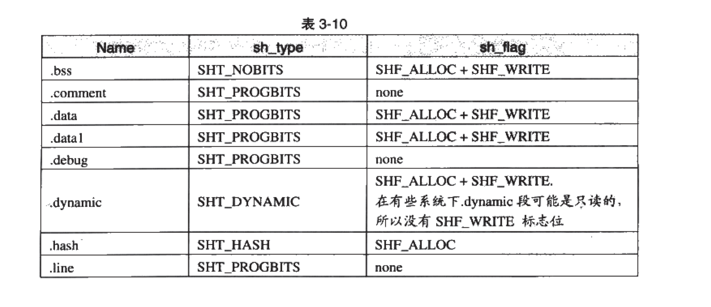
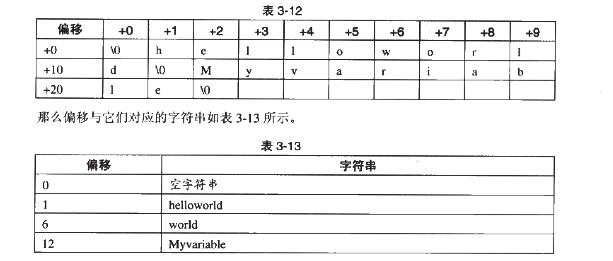
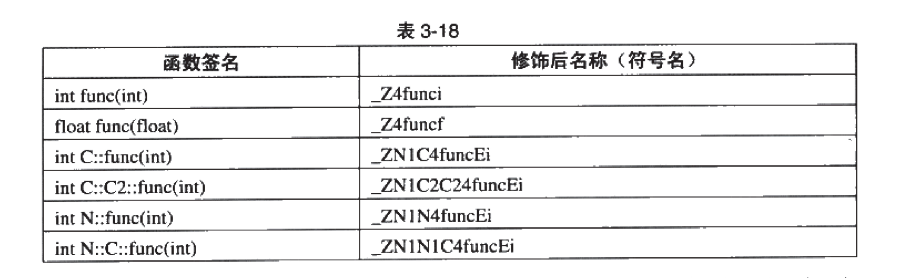
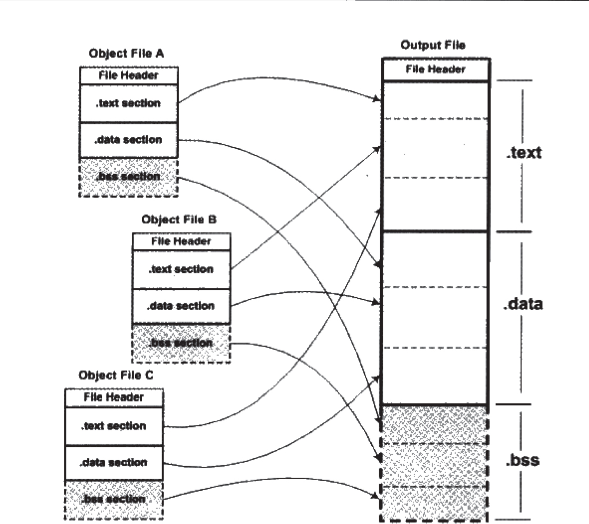

# 编译和链接

```sh
gcc hello.c
./a.out
```

预处理、编译、汇编、链接



## 预处理

```sh
gcc -E hello.c -o hello.i
// or
cpp hello.c > hello.i
```

预处理过程主要处理那些源代码中以`#`开始的预编译指令

* 删除所有的`#define`，并展开所有宏定义
* 处理预编译指令，`#if`、`#ifdef`、`#elif`、`#else`、`#endif`
* 处理`#include`，将包含的文件插入到该预编译指令位置，这个过程时递归的
* 删除注释
* 添加行号
* 保留所有`#pragma`供编译器使用

经过编译后的的`.i`文件不包含任何宏定义。

## 编译

```sh
gcc -S hello.i -o hello.s
// or 一步到位
gcc -S hello.c -o hello.s
```

得到汇编代码。

cc1plus、cc1obj、f771、jc1分别对应C++、ObjectiveC、Fortran、Java。

## 汇编

```sh
as hello.s -o hello.o
// or
gcc -c hello.s -o hello.o
// or
gcc -c hello.c -o hello.o
```

将汇编代码转变为机器代码，每一个汇编语句几乎对应一条机器指令。

## 链接

链接的过程主要包括了：

* 地址和空间分配
* 符号决议
* 重定位

# 目标文件的格式

Linux下称为ELF（Executable Linkeable Formate）文件，包括：

* 可重定位文件。 `.o`
* 可执行文件。`.exe`
* 共享目标文件。`.so`
* 核心转储文件。`core dump`

可以使用`file`命令来查看文件类型：



常分为代码段和数据段：



* 文件头
  * 描述了整个文件的文件属性、是否可执行、静态or动态链接以及入口地址、目标硬件、目标操作系统
  * 段表：一个描述文件中各个段的数组
* `.text`段
  * 编译后执行语句都编译成机器代码
* `.data`段
  * 初始化的**全局变量**和**静态变量**
* `.bss`段
  * **未初始化**的全局变量和静态变量
  * 只是预留位置而已，不占用存储空间。
  * flag

指令和数据分开存储的好处：

* 程序被装载后数据和指令分别映射到两个虚存区域，分开存储，它们的可读写权限可以分别设置
* 有利于局部性原理
* 当存在该程序的多个副本时，内存只需要保存一份该程序的指令部分

Example:

```c
int printf(const char *format, ...);
int global_init_var = 84;
int global_uninit_var;

void func1(int i) { printf("%d\n", i); }

int main() {
    static int static_var = 85;
    static int static_var2;

    int a = 1;
    int b;
    func1(static_var + static_var2 + a + b);
    return a;
}
```

```sh
// 只编译不链接
gcc -c simple_section.c

// 查看elf文件格式 -h 表示打印各个段的基本信息
objdump -h simple_section.o


simple_section.o：     文件格式 elf64-x86-64

节：
Idx Name          Size      VMA               LMA               File off  Algn
  0 .text         00000051  0000000000000000  0000000000000000  00000040  2**0
                  CONTENTS, ALLOC, LOAD, RELOC, READONLY, CODE
  1 .data         00000008  0000000000000000  0000000000000000  00000094  2**2
                  CONTENTS, ALLOC, LOAD, DATA
  2 .bss          00000004  0000000000000000  0000000000000000  0000009c  2**2
                  ALLOC
  3 .rodata       00000004  0000000000000000  0000000000000000  0000009c  2**0
                  CONTENTS, ALLOC, LOAD, READONLY, DATA
  4 .comment      0000002b  0000000000000000  0000000000000000  000000a0  2**0
                  CONTENTS, READONLY
  5 .note.GNU-stack 00000000  0000000000000000  0000000000000000  000000cb  2**0
                  CONTENTS, READONLY
  6 .eh_frame     00000050  0000000000000000  0000000000000000  000000d0  2**3
  
// size 查看elf代码段、数据段、BSS段的大小
size simple_section.o
   text    data     bss     dec     hex filename
    165       8       4     177      b1 simple_section.o
```

* CONTENTS 表示该段在文件中存在，上面表示大小。其中.bss不存在CONTENTS，.note.GNU-stack存在但是长度为0。

### 代码段

```sh
// -s 以16进制打印 -d 将包含指令的段反汇编
objdump -s -d simple_section.o

simple_section.o：     文件格式 elf64-x86-64

Contents of section .text:
 0000 554889e5 4883ec10 897dfc8b 45fc89c6  UH..H....}..E...
 0010 bf000000 00b80000 0000e800 000000c9  ................
 0020 c3554889 e54883ec 10c745fc 01000000  .UH..H....E.....
 0030 8b150000 00008b05 00000000 8d040203  ................
 0040 45fc0345 f889c7e8 00000000 8b45fcc9  E..E.........E..
 0050 c3                                   .               
Contents of section .data:
 0000 54000000 55000000                    T...U...        
Contents of section .rodata:
 0000 68656c6c 6f202564 0a00               hello %d..      
Contents of section .comment:
 0000 00474343 3a202855 62756e74 752f4c69  .GCC: (Ubuntu/Li
 0010 6e61726f 20342e34 2e372d38 7562756e  naro 4.4.7-8ubun
 0020 74753129 20342e34 2e3700             tu1) 4.4.7.     
Contents of section .eh_frame:
 0000 14000000 00000000 017a5200 01781001  .........zR..x..
 0010 1b0c0708 90010000 18000000 1c000000  ................
 0020 00000000 21000000 00410e10 4386020d  ....!....A..C...
 0030 06000000 18000000 38000000 00000000  ........8.......
 0040 30000000 00410e10 4386020d 06000000  0....A..C.......

Disassembly of section .text:

0000000000000000 <func1>:
   0:   55                      push   %rbp
   1:   48 89 e5                mov    %rsp,%rbp
   4:   48 83 ec 10             sub    $0x10,%rsp
   8:   89 7d fc                mov    %edi,-0x4(%rbp)
   b:   8b 45 fc                mov    -0x4(%rbp),%eax
   e:   89 c6                   mov    %eax,%esi
  10:   bf 00 00 00 00          mov    $0x0,%edi
  15:   b8 00 00 00 00          mov    $0x0,%eax
  1a:   e8 00 00 00 00          callq  1f <func1+0x1f>
  1f:   c9                      leaveq 
  20:   c3                      retq   

0000000000000021 <main>:
  21:   55                      push   %rbp
  22:   48 89 e5                mov    %rsp,%rbp
  25:   48 83 ec 10             sub    $0x10,%rsp
  29:   c7 45 fc 01 00 00 00    movl   $0x1,-0x4(%rbp)
  30:   8b 15 00 00 00 00       mov    0x0(%rip),%edx        # 36 <main+0x15>
  36:   8b 05 00 00 00 00       mov    0x0(%rip),%eax        # 3c <main+0x1b>
  3c:   8d 04 02                lea    (%rdx,%rax,1),%eax
  3f:   03 45 fc                add    -0x4(%rbp),%eax
  42:   03 45 f8                add    -0x8(%rbp),%eax
  45:   89 c7                   mov    %eax,%edi
  47:   e8 00 00 00 00          callq  4c <main+0x2b>
  4c:   8b 45 fc                mov    -0x4(%rbp),%eax
  4f:   c9                      leaveq 
  50:   c3                      retq   
```

### 数据段和只读数据段

* .data：已经初始化了的全局静态变量和局部静态变量
* .rodata：只读数据，如const修饰的、printf formate字符串，有时字符串常量也放在.data中

```sh
// 查看每一个段的值
objdump -x -s -d simple_section.o
// 54000000 = 0x00 0x00 0x00 0x54 = 84
// 55000000 = 0x00 0x00 0x00 0x55 = 85
Contents of section .data:
 0000 54000000 55000000                    T...U...   
```

### bss

存放未初始化的全局变量（global_uninit_var）和局部的静态变量（static_var2）。

*static int i = 0; 也被视作未初始化的变量*

有些编译器会将全局未初始化变量放在bss，有些则不会，只是预留一个未定义的全局变量符号。

### 其他段



甚至可以用objcopy工具自定义elf的段。

GCC提供了扩展机制，可以指定变量所处的段。

```cpp
__arrtibute__((section("FOO"))) int global = 42;
__arrtibute__((section("BAR"))) void foo() {}
```

## ELF结构



文件头、段表、其他段。

### 文件头

```sh
readelf -h simple_section.o
ELF 头：
  Magic：   7f 45 4c 46 02 01 01 00 00 00 00 00 00 00 00 00 
  类别:                              ELF64
  数据:                              2 补码，小端序 (little endian)
  版本:                              1 (current)
  OS/ABI:                            UNIX - System V
  ABI 版本:                          0
  类型:                              REL (可重定位文件)
  系统架构:                          Advanced Micro Devices X86-64
  版本:                              0x1
  入口点地址：               0x0
  程序头起点：          0 (bytes into file)
  Start of section headers:          1056 (bytes into file)
  标志：             0x0
  本头的大小：       64 (字节)
  程序头大小：       0 (字节)
  Number of program headers:         0
  节头大小：         64 (字节)
  节头数量：         13
  字符串表索引节头： 12
```

ELF文件头结构和常数都被定义在/usr/include/elf.h文件中。

具体结构：略

### 段表

它描述了ELF各个段的信息。如：段名、段长、在文件中的偏移、读写权限、以及段的其他属性。

```sh
// 只列出ELF中的关键段
objdump -h
// 全部段
readelf -S simple_section.o
There are 13 section headers, starting at offset 0x420:

节头：
  [号] 名称              类型             地址              偏移量
       大小              全体大小          旗标   链接   信息   对齐
  [ 0]                   NULL             0000000000000000  00000000
       0000000000000000  0000000000000000           0     0     0
  [ 1] .text             PROGBITS         0000000000000000  00000040
       0000000000000051  0000000000000000  AX       0     0     1
  [ 2] .rela.text        RELA             0000000000000000  00000310
       0000000000000078  0000000000000018   I      10     1     8
  [ 3] .data             PROGBITS         0000000000000000  00000094
       0000000000000008  0000000000000000  WA       0     0     4
  [ 4] .bss              NOBITS           0000000000000000  0000009c
       0000000000000004  0000000000000000  WA       0     0     4
  [ 5] .rodata           PROGBITS         0000000000000000  0000009c
       000000000000000a  0000000000000000   A       0     0     1
  [ 6] .comment          PROGBITS         0000000000000000  000000a6
       000000000000002b  0000000000000001  MS       0     0     1
  [ 7] .note.GNU-stack   PROGBITS         0000000000000000  000000d1
       0000000000000000  0000000000000000           0     0     1
  [ 8] .eh_frame         PROGBITS         0000000000000000  000000d8
       0000000000000050  0000000000000000   A       0     0     8
  [ 9] .rela.eh_frame    RELA             0000000000000000  00000388
       0000000000000030  0000000000000018   I      10     8     8
  [10] .symtab           SYMTAB           0000000000000000  00000128
       0000000000000180  0000000000000018          11    11     8
  [11] .strtab           STRTAB           0000000000000000  000002a8
       0000000000000067  0000000000000000           0     0     1
  [12] .shstrtab         STRTAB           0000000000000000  000003b8
       0000000000000061  0000000000000000           0     0     1
Key to Flags:
  W (write), A (alloc), X (execute), M (merge), S (strings), I (info),
  L (link order), O (extra OS processing required), G (group), T (TLS),
  C (compressed), x (unknown), o (OS specific), E (exclude),
  l (large), p (processor specific)
```

都是用`Elf32_Shdr`来描述一个段的，称为**段描述符**，ELF的第一个元素是无效的段描述符，类型为NULL。

段的名字只在链接和编译过程有意义，但不能表示段的类型。决定段类型的是`sh_type`和`sh_flags`。

example：



### 重定位表

链接器在处理目标文件时，需要对目标文件中的某些部分进行从定位，即那些对绝对地址的引用的位置，这些信息都记录在重定位表中。

### 字符串表



这样在ELF文件中对字符串的引用只需要给出一个数字下标即可，不用考虑字符串的长度。

* 字符串表：保存普通的字符串，如符号名字
* 段表字符串表：保留段表中用到的字符串，如段名

只有分析ELF文件头，就可以得倒段表和段表字符串表的位置，从而解析整个ELF文件。


## 链接的接口-符号

每一个目标文件都会有一个相应的符号表，这个表里记录了目标文件中所用到的所有符号。每个定义的符号都有一个对应的**符号值**，对于变量和函数来说，这就是它们的地址。

* 定义在本目标文件的全局符号，可以被其他目标文件引用。
* 在本目标文件中引用的全局符号，却没有定义在本目标文件中。
* 段名，由编译器产生，如.data、.text。
* 局部符号，这类符号只能在编译单元内部可见。如static变量。局部符号对于链接过程没有作用，链接器往往也忽略它们。
* 行号

Example:

```sh
// 查看符号表
nm simple_section.o

0000000000000000 T func1
0000000000000000 D global_init_var
0000000000000004 C global_uninit_var
0000000000000021 T main
                 U printf
0000000000000004 d static_var.1596
0000000000000000 b static_var2.1597
```

### 符号表结构

```sh
readelf -s simple_section.o


Symbol table '.symtab' contains 16 entries:
   Num:    Value          Size Type    Bind   Vis      Ndx Name
     0: 0000000000000000     0 NOTYPE  LOCAL  DEFAULT  UND 
     1: 0000000000000000     0 FILE    LOCAL  DEFAULT  ABS simple_section.c
     2: 0000000000000000     0 SECTION LOCAL  DEFAULT    1 
     3: 0000000000000000     0 SECTION LOCAL  DEFAULT    3 
     4: 0000000000000000     0 SECTION LOCAL  DEFAULT    4 
     5: 0000000000000000     0 SECTION LOCAL  DEFAULT    5 
     6: 0000000000000004     4 OBJECT  LOCAL  DEFAULT    3 static_var.1596
     7: 0000000000000000     4 OBJECT  LOCAL  DEFAULT    4 static_var2.1597
     8: 0000000000000000     0 SECTION LOCAL  DEFAULT    7 
     9: 0000000000000000     0 SECTION LOCAL  DEFAULT    8 
    10: 0000000000000000     0 SECTION LOCAL  DEFAULT    6 
    11: 0000000000000000     4 OBJECT  GLOBAL DEFAULT    3 global_init_var
    12: 0000000000000004     4 OBJECT  GLOBAL DEFAULT  COM global_uninit_var
    13: 0000000000000000    33 FUNC    GLOBAL DEFAULT    1 func1
    14: 0000000000000000     0 NOTYPE  GLOBAL DEFAULT  UND printf
    15: 0000000000000021    48 FUNC    GLOBAL DEFAULT    1 mai
```

* Value：符号值。函数或变量，那么符号值就是这个函数或变量的地址

* Size：符号大小

* Type：符号类型

* Bind：绑定信息

* Ndx：该符号所属的段的下标

  ```sh
  readelf -a simple_section.o
  节头：
    [号] 名称              类型             地址              偏移量
         大小              全体大小          旗标   链接   信息   对齐
    [ 0]                   NULL             0000000000000000  00000000
         0000000000000000  0000000000000000           0     0     0
    [ 1] .text             PROGBITS         0000000000000000  00000040
         0000000000000051  0000000000000000  AX       0     0     1
    [ 2] .rela.text        RELA             0000000000000000  00000310
         0000000000000078  0000000000000018   I      10     1     8
    [ 3] .data             PROGBITS         0000000000000000  00000094
         0000000000000008  0000000000000000  WA       0     0     4
    [ 4] .bss              NOBITS           0000000000000000  0000009c
         0000000000000004  0000000000000000  WA       0     0     4
    [ 5] .rodata           PROGBITS         0000000000000000  0000009c
         000000000000000a  0000000000000000   A       0     0     1
    [ 6] .comment          PROGBITS         0000000000000000  000000a6
         000000000000002b  0000000000000001  MS       0     0     1
    [ 7] .note.GNU-stack   PROGBITS         0000000000000000  000000d1
         0000000000000000  0000000000000000           0     0     1
    [ 8] .eh_frame         PROGBITS         0000000000000000  000000d8
         0000000000000050  0000000000000000   A       0     0     8
    [ 9] .rela.eh_frame    RELA             0000000000000000  00000388
         0000000000000030  0000000000000018   I      10     8     8
    [10] .symtab           SYMTAB           0000000000000000  00000128
         0000000000000180  0000000000000018          11    11     8
    [11] .strtab           STRTAB           0000000000000000  000002a8
         0000000000000067  0000000000000000           0     0     1
    [12] .shstrtab         STRTAB           0000000000000000  000003b8
         0000000000000061  0000000000000000           0     0     1
  ```

  

* Name：符号名称。包含了该符号名在字符串表中的下表

### 特殊符号

ld定义了很多特殊符号，这些符号并没有在程序中定义，但是可以直接声明并且引用它，这些符号在ld脚本中被定义。ld会在将程序最终链接成可执行文件时将其解析成正确的值。

* __executable_start：程序起始地址，不是入口地址
* __etext：代码段结束地址
* _edata：数据段结束地址
* _end：程序结束地址

以上地址都是被装载时的虚拟地址，在程序中可以直接使用。

Example：

```c
#include <stdio.h>

extern char __executable_start[];
extern char etext[], _etext[], __etext[];
extern char edata[], _edata[];
extern char end[], _end[];

int main() {
    printf("Executeable start: %X\n", __executable_start);
    printf("Text end: %X, %X, %X\n", etext, _etext, __etext);
    printf("Data End: %X, %X\n", edata, _edata);
    printf("Executeable end: %X, %X\n", end, _end);
    return 0;
}
```

输出：

```sh
Executeable start: 400000
Text end: 400626, 400626, 400626
Data End: 601030, 601030
Executeable end: 601040, 601040
```

### 符号修饰和函数签名

命名重整



不同编译器的重整规则不一样


### extern ''C"

C++用来声明或定义一个C符号的功能。

Example：

```cc
extern "C" {
  int func(int);
  int var;
}
```

编译器会将在其中的代码当作C代码处理，所以C++的命名重整功能就不会起作用。

如：

```c
 void *memset(void*, int, size_t);
```

它在C语言库中被定义，如果C++中需要使用而不加extern "C"的话就会被命名重整，但是被C调用时不支持extern "C"，为了避免为了兼容而定义两套头文件的情况：

```c
#ifdef __cplusplus
extern "C" {
#endif
 void *memset(void*, int, size_t); 
#ifdef __cplusplus
}
#endif
```

### 弱符号和强符号

在C++中

* 默认函数和初始化了的全局变量为强符号
* 未初始化的全局变量为弱符号

也可以使用`__attribute__((weak))`来定义任何一个强符号为弱符号。

* 不允许强符号被多次定义
* 如果一个符号在某个文件中是强符号，在其他文件中是弱符号，则被定义为强符号
* 如果一个符号在所有目标文件中都是弱符号，那么选择其中占用空间最大的一个

### 弱引用和强引用

* 强引用：对外部文件的符号引用被最终链接成可执行文件时，必须找到符号的定义，找不到则会报符号未定义错误
* 弱引用：找不到也不会报错（和COMMON块有关），可以通过`__attribute__((weakref))`来定义

弱符号和弱引用对库来说是有用的，库中定义的弱符号可以被用户定义的强符号所覆盖，从而使得程序使用自定义版本的库函数。

### 调试信息

gcc -g可以加上调试信息。此时通过readelf可以看到多出来很多debug段。可以通过strip命令去掉调试信息。

# 静态链接

## 空间与地址分配

链接器会将相同性质的段合并在一起，如.text合并到.text，.data、.bss同理。



.bss段在目标文件中不占用文件空间（不会记录它的值是多少，因为都是未初始化的状态），但在装载是占用地址空间（虚拟地址空间）。

链接过程分为两步：

* 空间与地址分配：链接器获得所有输入目标文件的段长度，将它们合并，并将长度和位置记录到全局符号表中
* 符号解析和重定位：读取输入文件中的段数据、重定位信息，进行符号解析和重定位、调整代码中的地址。

```c
// a.c 
extern int shared;
int main() {
    int a = 100;
    swap(&a, &shared);
}

// b.c
int shared = 1;
void swap(int *a, int *b) { *a ^= *b ^= *a ^= *b; }
```

```sh
// 链接
ld a.o b.o -e main -o ab
```

* -e选择main作为程序入口，ld的默认程序入口为_start

链接前后的地址分配情况：

```sh
objdump -h a.o

a.o：     文件格式 elf64-x86-64

节：
Idx Name          Size      VMA               LMA               File off  Algn
  0 .text         00000027  0000000000000000  0000000000000000  00000040  2**0
                  CONTENTS, ALLOC, LOAD, RELOC, READONLY, CODE
  1 .data         00000000  0000000000000000  0000000000000000  00000067  2**0
                  CONTENTS, ALLOC, LOAD, DATA
  2 .bss          00000000  0000000000000000  0000000000000000  00000067  2**0
                  ALLOC
  3 .comment      0000002b  0000000000000000  0000000000000000  00000067  2**0
                  CONTENTS, READONLY
  4 .note.GNU-stack 00000000  0000000000000000  0000000000000000  00000092  2**0
                  CONTENTS, READONLY
  5 .eh_frame     00000038  0000000000000000  0000000000000000  00000098  2**3
                  CONTENTS, ALLOC, LOAD, RELOC, READONLY, DATA

objdump -h b.o

b.o：     文件格式 elf64-x86-64

节：
Idx Name          Size      VMA               LMA               File off  Algn
  0 .text         0000004c  0000000000000000  0000000000000000  00000040  2**0
                  CONTENTS, ALLOC, LOAD, READONLY, CODE
  1 .data         00000004  0000000000000000  0000000000000000  0000008c  2**2
                  CONTENTS, ALLOC, LOAD, DATA
  2 .bss          00000000  0000000000000000  0000000000000000  00000090  2**0
                  ALLOC
  3 .comment      0000002b  0000000000000000  0000000000000000  00000090  2**0
                  CONTENTS, READONLY
  4 .note.GNU-stack 00000000  0000000000000000  0000000000000000  000000bb  2**0
                  CONTENTS, READONLY
  5 .eh_frame     00000038  0000000000000000  0000000000000000  000000c0  2**3
                  CONTENTS, ALLOC, LOAD, RELOC, READONLY, DATA

objdump -h ab

ab：     文件格式 elf64-x86-64

节：
Idx Name          Size      VMA               LMA               File off  Algn
  0 .text         00000073  00000000004000e8  00000000004000e8  000000e8  2**0
                  CONTENTS, ALLOC, LOAD, READONLY, CODE
  1 .eh_frame     00000054  0000000000400160  0000000000400160  00000160  2**3
                  CONTENTS, ALLOC, LOAD, READONLY, DATA
  2 .data         00000004  0000000000601000  0000000000601000  00001000  2**2
                  CONTENTS, ALLOC, LOAD, DATA
  3 .comment      0000002a  0000000000000000  0000000000000000  00001004  2**0
                  CONTENTS, READONLY
```


