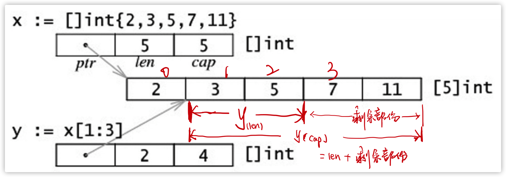
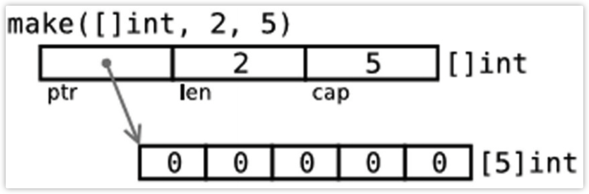
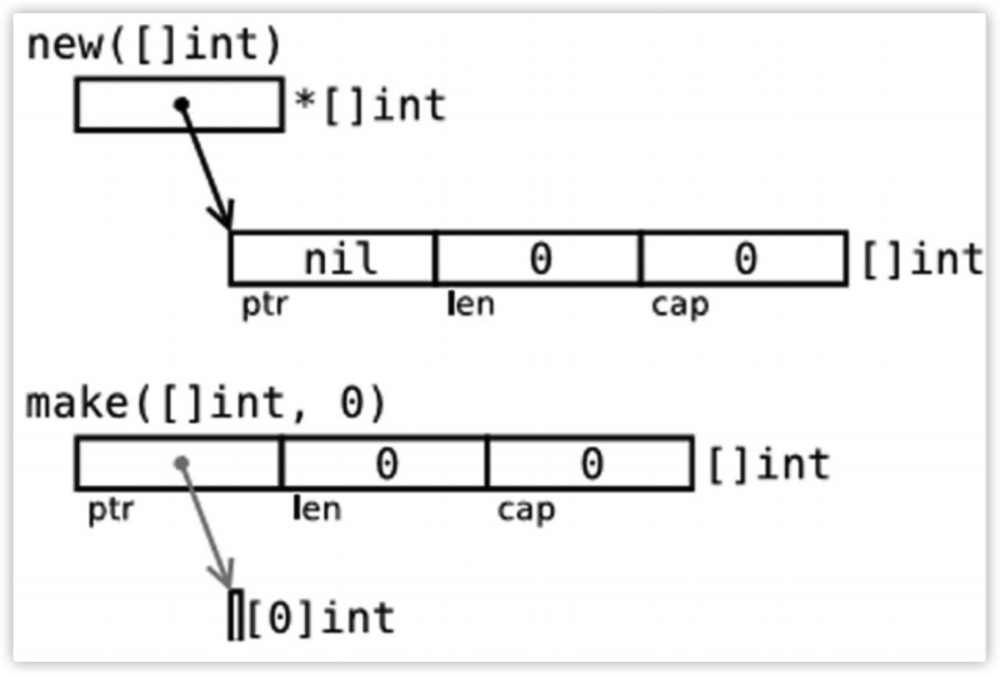
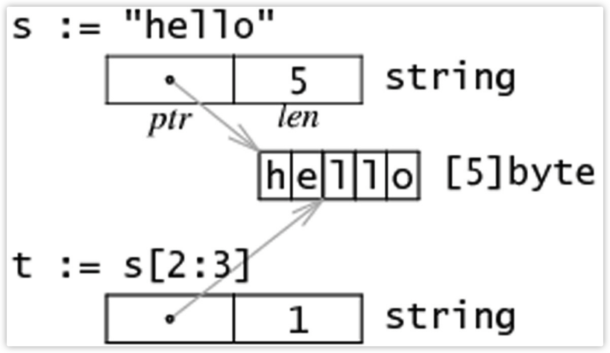
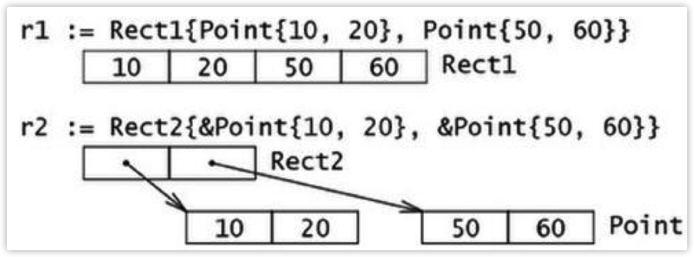

# 基本结构和基本数据类型

## 包

每个Go文件都属于且仅属于一个包。一个包可以由许多.go为扩展名的源文件组成，所以**文件名和包名一般来说都是不相同的。**

* 当标识符（变量、常量、类型、函数名、结构字段等等）以一个大写字母开头，则可以被外部包代码使用（public）
* 当标识符（变量、常量、类型、函数名、结构字段等等）以一个小写字母开头，则不可以被外部包代码使用（private）

如果导入了一个包却没有使用它，则会报错，Go的格言：“没有不必要的代码”。？？？

`{`必须与声明放在同一行。

```go
func f1(a int) {
  /** do something **/
} // 正确

func f1(a int) {} // 正确
  
func f1(a int) 
{
  
} // 错误
```

## 类型

Go中的空值为Nil，等同于java中的null。

类型转换：

类型B的值 = 类型B(类型A的值)

```go
a = typeB(valA);
```

Go中不允许不同类型之间的混用，但是对于常量的类型限制非常少，所以常量之间是可以混用的

```go
var a int
var b int32
a = 15
b = a + a // 错误：不允许混用
b = b + 5 // 5
```

### 函数定义

```go
func FunctionName (a typeA, b,c typeB) (t1 typeT1, t2, t3 typeT3) {
  /** do something **/
}
```

一个函数可以由多个返回值，返回类型之间需要逗号分隔，当参数列表长度大于1时，需要使用`()`来将它们扩起来。

### 自定义类型

```go
// 自定义类型INT，基本类型是int
type INT int
var a INT = 5
```

*类似c++中的typedef。*

也可以使用**因式分解**的定义方式：

```go
type (
	IZ int
  FZ float64
  STR string
)
```

每个值必须在经过编译后属于某一个类型（编译器必须能够推断出所有值的类型），因为Go是一种静态类型的语言。

### 别名

```go
type INT=int
var a INT = 5
```

## `Go`程序的一般结构

* 完成对包的import之后，开始对常量、变量和类型的定义或声明
* 如果存在**init**函数的话，则对该函数进行定义。（每个函数该函数的包都会首先执行这个函数）
* 如果当前包时main包，则定义main函数
* 然后定义其余的函数
  * 首先是类型方法
  * 按照main函数中先后调用顺序来定义相关函数，如果有很多函数，则可以按照字母顺序来今昔排序

执行顺序：

* 导入被main包包含的所有包
  * 如果被包含的包又包含了其他包，那么DFS的导入包（每种包只会被导入一次）
* 然后执行init函数如果有的话，再是main函数

## 常量

```go
const identifier [type] = value
const Pi = 3.1415926
```

可以省略type，编译器可以根据变量的值来推断其类型。

* 显示类型定义

  ```go
  const b string = "abc"
  ```

* 隐式类型定义

  ```go
  const b = "abc"
  ```

未定义类型的常量会在必要时刻根据上下文来获取相关类型。

```go
var n int
f(n + 5)// 无类型的数字常量“5”，它的类型在此处由n的推导变为了int
```

所有用于计算的值必须在编译器见就能被获取到。

```go
const c1 = geNum() // 错误
```

在编译期间自定义的函数均属于未知，所以无法用于常量的复制，但是内置函数可以使用，如：len()。

### 枚举类型

常量也可以用作枚举。

```go
const (
	A = 0
  B = 1
  C = 2
)
// 或者使用iota
const (
	A = iota
  B
  C
)
// 此时A、B、C分别是0、1、2
```

iota也可以用在表达式中如：`ioat + 10`，每遇到一次const关键字，ioat就重置为0。

## 变量

声明变量：

```go
var identifier type
```

也可以使用因式分解的形式：

```go
var (
	a int
  b bool
  str string
)
```

这种方式一般用于声明全局变量。

且在Go也存在作用域覆盖的情况，即局部变量会覆盖全局变量的值。

若是直接给变量赋值，那么可以省略掉类型，Go编译器可以在编译时期完成推断过程。

```go
var a = 15 // 此时a被推断为int
// 若是需要特定的int，那么还是需要显式的指出类型
var b int64 = 10
```

上面这种写法主要用于声明全局变量，若是函数体内的局部变量，则可以使用`:=`：

```go
a := 16
b := "Hello World"
```

## `init`函数

它不能够被人为调用，**而是在每个包完成初始化后自动执行，并且执行优先级比main函数要高。**

每个源文件都可以包含一个或多个init函数。初始化总是以单线程执行，并且按照包的依赖关系顺序执行。

`init`函数也经常被用在当一个程序开始之前调用后台执行的`goroutine`。

## 字符串

* 解释字符串：转义字符能在其中生效，用双引号括起来。

* 非解释字符串：转义字符能在其中会失效，用单引号括起来。

  ```go
  str := `Hello World\n` // \n会被输出出来
  ```

和c/c++不同，Go中的字符串是根据长度限定，而非特殊字符`\0`。

Go的字符串也是可以通过`[]`来获取其中的字符，但是不能对其取地址`&str[i]`。

## 指针

Go提供了控制数据结构的**指针**，**但是不能进行指针运算**，即对指针加减。

```go
var a *int
b := 10
a = &b
a++ // 错误：不能对指针进行运算
```


# 控制结构

* if-else

  ```go
  if condition {
    
  } // 不需要()
  ```

* switch

  每个case后面不需要break，如果需要这种效果的话，可以使用`fallthrough`

  ```go
  switch var1 {
    case val1:
     	// ...
    case val2:
    	// ...
    case val3, val4, val5:
    	// ...
    	fallthrough
    default:
    	// ...
  }
  ```

* for

  * for 初始化语句; 条件语句 ; 修饰语句 {}

    ```go
    for i:=0; i<5; ++i {
      // ...
    }
    ```

  * 无头部的条件判断语句。 for 条件语句 {}

    ```go
    for i>=0 {
      // ...
    }
    ```

  * for-range

    for index, val := range list {}

    ```go
    str := "Hello World"
    for i, ch := str {
      // ...
    }
    ```

* break、continue：没啥特殊的

* goto？go8！

# 函数

Go里面有三种类型的函数：

* 普通带名字的函数
* 匿名函数或者lambda函数
* 方法

函数定义时，形参一般都是有名字，不过也可以定义没有形参名字的函数，只有相应的形参类型。

```go
func f(int, int)
```

这些函数被称为`niladic`函数？

## 值传递与引用传递

Go默认采用**按值传递**参数。但是像切片`slice`、字典`map`、接口`interface`、通道`channel`这样的引用类型都是默认引用传递的。

### 命名的返回值

返回值分为：

* 非命名返回值
* 命名返回值

```go
func f1(i int)(int int) { // 非命名返回值
  return i, i+2;
}

func f2(i int)(x1 x2 int) { // 命名返回值
  x1 = i;
  x2 = i + 2;
  return
}
// 对于不需要使用的返回值可以使用空白符替代
_, b = f1(10);
```

## 传递参数

### 变长参数

最后一个参数是`...type`时就可以处理一个变长的参数。

```go
func f1(a,b, arg...int) {
  for i,x := arg {
    // ...
  }
}
```

其他解决方法：

* 使用结构体

  ```go
  type MyStruct struct {
    par1 int,
    par2 string,
    par3 float32
  }
  
  F1(MyStruct {})
  F1(MyStruct {1, "hello", 3.14})
  ```

* 使用空接口

  如果一个变长参数的类型没有被指定，则可以使用默认的空接口`interface{}`。

  ```go
  func f1(vals ...interface{}) {
    for _ ,val := range vals {
      switch v := val.(type) {
        case int: // ...
        case string: // ...
        case float32:	// ...
        // ...
      }
    }
  }
  ```


## `defer`和追踪

`defer`允许推迟到函数返回之前（或任意位置执行`return`语句之后，因为`return`语句同样可以包含一些操作，而不是单纯地返回某个值）一刻才执行某个语句或函数。

**类似于Java的`finally`。**

```go
func f1() {
  fmt.Println("T2 before")
	defer fmt.Println("defer")
	fmt.Println("T2 after")
}
// 结果：
/**
T2 before
T2 after
defer
**/
```

当有多个defer行为被注册时，它们会以逆序执行（类似栈）。

## 函数作为参数

```go
func add(a, b int) int {
	return a + b
}

func useFunc(a, b int, f func(int, int) int) {
	fmt.Println(f(a, b+10))
}

func T3(a, b int) {
	useFunc(a, b, add);
}
```

## 闭包

匿名函数：`func(x, y int) int {return x+y}`

```go
fp := func(x, y int) int {
  return x+y
}
fp(1, 2);
```

可以将函数作为返回值

```go
func f1(a int) (func(b int) int)
func f1(a int) (func(b int) int) {
  return func(b int) int {
    a + b
  }
}
```


# 数组

类似于python的切片

数据的长度属于它的类型。如`[10]int`与`[5]int`并不是一种类型。

声明格式为：

```go
var arr1 [10]int
```

Go的数组是一种**值类型**（并不是c++中的指针），所以可以通过`new()`来创建

```go
var arr2 = new [5]int
```

其中arr1的类型是`[10]int`，而arr2的类型是`*[10]int`。

## 多维数组

Go中的多维数组是一个矩阵（唯一例外的是切片的数组）。

**将数组传递给函数**

类似C++，为避免值传递的拷贝：

* 传递数组的指针

  ```go
  func f1(a *[3]int) int {
    sum := 0
    for _,v := range a {
      sum += v
    }
    return sum
  }
  var arr = [3]int{1,2,3}
  var arr = [...]int{1,2,3}
  var arr = [3]int{1:1, 2:2} // index:value
  f1(&arr)
  ```

* 传递数组的切片

## 切片

切片是对数组一个连续片段的引用，所以切片是一个**引用类型**。

几个属性：

* `len()`：切片元素实际占用的元素长度
* `cap()`：切片的全部长度=`len()`+剩余部分长度

```go
a[start:end] // 左闭右开的区间
```



### `make()`创建切片

当相关数组还未定义时，可以使用`make()`来创建一个切片，同时创建好相关的数组。

```go
var slice1 []type = make([]type, len) // len是上述的len()的值
// 或者简写
slice1 := make([]type, len)
s := make([]int, 10) // 此时cap(s) == len(s) == 10
```

`make()`接受两个参数：1. 元素类型 2.切片的元素个数

```go
slice2 := make([]type, len, cap)
```

其中`make([]int, 2, 5)`如下：



#### `make()`与`new()`的区别

都是在堆上分配内存，**但是它们的行为不同，适用于不同的类型**

* `new(T)`为每个新类型T分配一片内存，初始化为0，**并且返回类型为\*T的内存地址**：这种方法，**返回一个指向类型为T，值为0的地址的指针**，适用于值类型如数组和结构体；相当于`&T{}`
* `make(T)`返回一个类型为T的初始值，只适用于3中内建的引用类型：**切片、map、channel**。

一个返回一个指针，一个返回一个结构，同上图（有一个指针指向一个数组）。

**`new`分配内存，`make`初始化**:



### `bytes`包

存放byte，其中有一个`Buffer`，**类似Java的StringBuilder**。

pass

### 切片重组`reslice`

通常，切片创建时比相关数组小：

```go
slice1 := make([]type, start_len, capacity)
```

这么做的好处是当切片达到容量（len）上限后可以扩容。**改变切片长度的过程称之为切片重组`reslicing`**:

```go
slice1 = slice1[0, new_len] // new是新的末尾索引(len)
slice1 = slice1[1, len(slice1)+1] // 将长度扩大1
```

切片可以反复如此操作，直至占据整个相关数组。

example：

```go
ar := [10]int{0,1,2,3,4,5,6,7,8,9}
a := ar[5:7] // 即{5,6}
// 将a重新分片
a = a[0: 4] // 即{5,6,7,8}，这个[0:4]是相对{5,6,7,8,9}的，0是从5开始的
```

### 切片的复制与追加

如果想要增加切片的容量（cap），**必须创建一个新的更大的切片，并把原分片的内容都拷贝过来。**

Example:

```go
func f1() {
  // 1
  s_from := []int{1,2,3}
  s_to := make([]int, 10)
  n := copy(s_to, s_from)
  
  // 2
  s2 := []int{1,2,3}
  s2 = append(s2, 4,5,6)
}
```

`append`将0个或多个具有相同类型的元素追加到切片后面并且返回新的切片；

## `for-range`

适用于数组和切片。

```go
for ix, val := range arr {
  // ...
}
```

* ix：数组下标
* val：arr[ix]处值的一个拷贝，不能用来修改arr在该处的值

如果只需要下标，那么可以省略val：

```go
for ix := range arr {
  // ...
}
```

### 字符串、数组和切片

字符串也可以做切片操作：

```go
string s = "hello"
t = s[2:3]
```



***

GO语言中的字符串是不可变的，不能直接`str[idx]='H'`这样修改，**必须先将字符串转换成字节数组，然后再通过修改数组中的元素值来达到修改字符串的目的**，最后再将字节数组转换为字符串。

# `Map`

## 声明、初始化和`make`

map是引用类型：

```go
var mp1 map[keyType]valueType
var mp2 map[string]int // [keyType]与valueType之间允许空格，但是gofmt移除了空格
```

* key是任意可以用`==`或者`!=`操作符比较的类型

* 可以使用下标操作来使用map

* len(map)可以获得map中的pair数量

  map的容量可以动态的伸缩 ，所以不存在固定长度或者最大限制。

  ```go
  mp := make(map[string]float32, 100)// 指定map的初始化容量为100
  ```

* 不要使用`new`，而是要用`make`来构造`map`

  如果使用`new()`分配了一个引用对象，将会获得一个空引用的指针，相当于声明了一个为初始化的变量并且取了它的地址。

## 操作

* **检测key值是否存在**

  ```go
  a, b := map[key] // 如果key存在b==true，a==map[key];否则b==false，a==valueType的空值
  ```

* **删除元素**

  ```go
  delete(mp, key) // 如果key不存在，该操作不会产生错误
  ```

* **遍历**

  ```go
  for key, value := range mp1 {
    // ...
  }
  // 如果只是获得key
  for key := range mp {
    // ...
  }
  ```

# `struct`和`method`

GO中没有类的概念。

## 定义

```go
type structName struct {
  a type1
  b type2
  ...
}
```

如果字段在代码中从来都不会被用到，那么可以命名它为`_`。

## 初始化

`struct`的字段可以是任何类型，包括`struct`本身，也可以是函数或者接口。

```go
var t *T = new(T)
t2 := new(T)
```

**无论是指针还是对象，都可以使用`.`来访问其字段**

```go
var t *T
var t2 T
t.filed1
t2.filed2
// 也可以显式的解引用
(*t).filed1
```

还可以使用更简短的方式

```go
//这时混合字面量语法，底层仍调用new
ms := &struct1{a, b, c} // 需要注意参数顺序需与结构体定义中的一致
// 也可以不一致，但需要显式指出
ms := &struct{B:b, C:c, A:a}
```

GO中，结构体和它所包含的数据在内存中是以连续块的形式存在的，即使结构体中嵌套有其他的结构体。如：java中一个对象和它里面包含的对象可能会在不同的内存空间。



GO中的类型转换遵循严格的规则。当结构体定义了一个别名时，此结构体类型和它的别名都有相同的底层类型，但需要注意非法赋值或转换引起的编错误

```go
type number struct {
  f float32
}
type nr number
a := number{5.0}
b := nr{5.0}
var i float32 = b // 错误
var i2 float32 = float32(b) // 错误
var i3 number = b // 错误
var i4 = number(b)
```

## 使用工厂模式创建实例

GO中没有构造函数，但可以使用工厂模式。

```go
type File struct { // 若是File小写，那么它就是私有的，就只能使用工厂模式
  fd int
  name string
}

func NewFile(fd int, name string) *File {
  if fd<0 {
    return nil
  }
  return &File{id, name}
}
f := NewFile(fd, name) // 若是File小写，实例化File的唯一方法
```

还可以使用`Sizeof`来获取结构体类型T的一个实例所占的内存：

```go
size := unsafe.Sizeof(T{})
```

如果`make()`一个结构体变量，会引发一个编译错误，但是`new()`一个map并试图使用数据填充它，将会引发运行时错误，因为`new`将返回一个指向`nil`的指针。

**使用包中的结构体**

```go
package p1
type Struct1 struct {
  // ...
}

package main
func main() {
  s1 := new(p1.Struct1)
}
```

## 带标签的结构体

结构体中除了名字和类型外，还有一个**可选的标签`Tag`**：它是一个附属于字段的字符串，可以是文档或其他的重要标记。标签的内容不可以在一般的编程中使用，只有包`reflect`能获取它。

```go
type TagType struct {
  v1 int "An int var" // 可以作为注解似的功能
  v2 string "An string var"
  v3 bool "bool"
}
```

## 匿名字段和内嵌结构体

结构体可以包含一个或多个匿名（或内嵌）字段，**即使这些字段没有显式的名字，只有字段的类型是必须的，此时类型就是字段的名字。** *匿名字段本身可以是一个结构体类型*

类似于OOP中的继承。GO语言中的继承是通过内嵌或组合来实现的。

```go
type inners struct {
	in1 int
  in2 int
}

type outers struct {
  b int
  c float32
  int // 匿名字段
  inners
}

func f1() {
  outer := new(outers)
  // 访问
  outer.b = 6
  outer.c = 3.14
  outer.int = 12
  outer.in1 = 24
  outer.in2 = 48
  // 初始化
  outer2 := outerS{6, 3.14, 12, 24, 48}
}
```

所以，在一个结构体中对于每一种数据类型智能有一个匿名字段。

### 内嵌结构体

```go
type A struct {
  ax, ay int
}
type B struct {
  A
  bx, by float32
}
func f1() {
  b := B{A{1,2}, 1.0, 2.0}
  // 访问
  b.ax = 10 // 等价于b.A.ax
  b.ay = 20
  b.bx = 10.0
  b.by = 20.0
}
```

### 命名覆盖

当两个字段拥有相同名字时（可能是继承而来）：

* 外层名字会覆盖内层名字（但两者内存空间都保留），提供了一种重载字段或方法的方式
* 如果相同的名字在**同一级别出现了两次**，如果这个名字已经被程序使用，将会引发一个错误（不使用不会错）。没有办法来解决这种二义性，只能由程序员自己修正。

```go
type A struct {a int}
type B struct {a, b, int}
type C struct {A; B}

func f1() {
  c := C{A{1}, B{2, 3}}
	//fmt.Println(c.a) // 无法解决二义性
	fmt.Println(c.b, c.A.a, c.B.a)
}
```

### 结构体的方法

类似于类的方法，但是是写在外面的。

GO的方法是作用在接收者(`Receiver`)上的函数，接收者是某种类型的变量，所以方法是一种特殊的函数。

```go
type A struct {
	v1 int
  v2 int
  v3 float32
}

func (a *A)GetSum() int {
  return a.v1 + a.v2 + a.v3
}

func (this *A)GetProduct() int {
  return a.v1 * a.v2 * a.v3
}
```

接收者可以是任何类型，不仅仅是结构体类型：

* 任何类型都可以有方法（内置类型也行），甚至是函数类型。
* 接受者不能是接口类型，因为接口是一个抽象定义。
* 接收者不能是一个指针类型，但是它可以是任何其他允许类型的指针。(即括号里面可以是一个指针)

一个类型加上它的方法等价于面向对象中的类。一个区别是：在GO中，类型的代码和绑定在它上面的方法的**代码可以不放置在一起**，但是：**它们必须是同一个包的**

> ​	所以解释了为什么不能定义int、float这些类型的方法。

类型T（或*T）上的所有方法的集合称为它们的**方法集合**。

因为方法是函数（[函数不允许重载](https://www.zhihu.com/question/40661108)），所以，不允许方法重载，即对于一个类型只能有一个给定名称的方法。但是：具有同样名字的方法可以在2个或多个不同接收者类型上存在：

```go
func (* R1) Add() {/**/}
func (* R2) Add() {/**/}
```

别名不能有它原始类型上已经定义过的方法。

一般格式是：

```go
func (rec reciever_type) methodName(param_list) (return_list) {/**method body**/}
```

如果一个reciever需要一个指针，那么GO会自动进行解引用。

reciever就像OOP中的`this`或者`self`，但是GO中没有这两个关键字。

#### 指针或值作为接收者

基于性能的原因，recv最常见的是一个指向receiver_type的指针（没有对象的拷贝）。
