# XML的读取于转换

`DefaultListableBeanFactor`是整个`Bean`加载的核心，是`Spring`注册及加载`Bean`的默认实现，而`XmlBeanFactory`使用自定的`XML`读取器`XmlBeanDefinitionReader`实现了个性化的`BeanDefinitionRead`读取。


## XmlBeanDefinitionReader

* 使用`ResourceLoader`将资源文件路径转换为对应的`Resource`文件。
* 通过`DocumentLoader`将`Resource`文件转换为`Document`文件。
* 使用`DefaultBeanDefinitionDocumentReader`类对`Document`解析，使用`BeanDefinitionParserDelegate`对`Element`进行解析。

***

```java
BeanFactory bf = new XmlBeanFactory(new ClassPathResource("/path/xx.xml"));
```

先使用`ClassPathResource`的构造函数来构造`Resource	`资源文件的实例对象，然后可以使用`Reource`封装好的服务了。再使用`Resouce`来初始化`XmlBeanFactory`。

其中`Resource`对象继承自`InputStreamSource`，`InputStreamSource`可以将`Resource`对象转换为`InputStream`。

```java
public interface Resource extends InputStreamSource {
  // ...
}
public interface InputStreamSource {
  InputStream getInputStream() throws IOException;
}
```


## 加载Bean

**时序图：**

**`XmlBeanFactory`构造函数：**

```java
public XmlBeanFactory(Resource resource) throws BeansException {
		this(resource, null);
	}
public XmlBeanFactory(Resource resource, BeanFactory parentBeanFactory) throws BeansException {
		super(parentBeanFactory);
		this.reader.loadBeanDefinitions(resource); // 实际调用
	}
```

**`XmlBeanDefinitionReader.loadBeanDefinitions()`：**

功能：

* 封装资源文件。使用`EncoderResource`处理`Resource`编码问题。
* 获取输入流。从`Resource`中获取对应的`InputStream`并构造`InputSource`。
* 调用实际的加载方法`doLoadBeanDefinitions`。

```java
@Override
	public int loadBeanDefinitions(Resource resource) throws BeanDefinitionStoreException {
		return loadBeanDefinitions(new EncodedResource(resource)); //编码
	}

public int loadBeanDefinitions(EncodedResource encodedResource) throws BeanDefinitionStoreException {
  	// 通过属性来记录已经加载的资源
		Set<EncodedResource> currentResources = this.resourcesCurrentlyBeingLoaded.get();
		if (currentResources == null) {
			currentResources = new HashSet<>(4);
			this.resourcesCurrentlyBeingLoaded.set(currentResources);
		}
		if (!currentResources.add(encodedResource)) {
			throw new BeanDefinitionStoreException();
		}
    // 从encoderResource封装好的Resource中获得inputStream
		InputStream inputStream = encodedResource.getResource().getInputStream();
		InputSource inputSource = new InputSource(inputStream);
		if (encodedResource.getEncoding() != null) {
			inputSource.setEncoding(encodedResource.getEncoding());
		}
  	// 真正核心逻辑部分
		return doLoadBeanDefinitions(inputSource, encodedResource.getResource());
  	// finally中调用，已删去
		currentResources.remove(encodedResource);
		if (currentResources.isEmpty()) {
			this.resourcesCurrentlyBeingLoaded.remove();
		}
	}
```


**`EncoderResource.getReader()`：**

```java
public Reader getReader() throws IOException {
   if (this.charset != null) {
      return new InputStreamReader(this.resource.getInputStream(), this.charset);
   }
   else if (this.encoding != null) {
      return new InputStreamReader(this.resource.getInputStream(), this.encoding);
   }
   else {
      return new InputStreamReader(this.resource.getInputStream());
   }
}
```


**`XmlBeanDefinitionReader.doLoadBeanDefinitions()`：**

功能：

* 获取`XML`文件的验证模式。
* 加载`XML`文件，并得到对应的`Document`。
* 根据返回的`Document`注册`Bean`信息。

```java
protected int doLoadBeanDefinitions(InputSource inputSource, Resource resource)
      throws BeanDefinitionStoreException {
      Document doc = doLoadDocument(inputSource, resource);// 获得Document
      return registerBeanDefinitions(doc, resource); // 注册Bean
}
```

其中：**`XmlBeanDefinitionReader.doLoaderDocument()`：**

```java
protected Document doLoadDocument(InputSource inputSource, Resource resource) throws Exception {
   return this.documentLoader.loadDocument(inputSource, getEntityResolver(), this.errorHandler,
         getValidationModeForResource(resource), isNamespaceAware()); // 验证
}
```

### 获取`XML`文件的验证模式

**检查`XML`文件是否正确，是否符合约束（规则）**

`XML`文件的正确性由`DTD`和`XSD`来保证。

* **DTD(Document Type Definition)：**是一种XML约束模式语言，是XML文件的验证机制,属于XML文件组成的一部分。

  DTD 是一种保证XML文档格式正确的有效方法，可以通过比较XML文档和DTD文件来看文档是否符合规范，元素和标签使用是否正确。

* **XSD(XML Schemas Definition) ：**XML Schema描述了XML文档的结构。 可以用一个指定的XML Schema来验证某个XML文档，以检查该XML文档是否符合其要求。

  > ​	`DTD `可以用来定义`XML` 的文档结构。
  >
  > ​	`XSD `也可以用来定义 `XML` 的文档结构。
  >
  > ​	但是 `DTD` 的功能比较少，没有 `XSD`多。


### 获取`Document`

`XmlBeanFactoryReader`将`Document`加载的任务委托给`DocumentLoader`来执行。而`DocumentLoader`只是一个接口，实际是由`DefaultDocumentLoader`来实现。

**`DefaultDocumentLoader.loadDocument()`：**

```java
@Override
	public Document loadDocument(InputSource inputSource, EntityResolver entityResolver,
			ErrorHandler errorHandler, int validationMode, boolean namespaceAware) throws Exception {
		DocumentBuilderFactory factory = createDocumentBuilderFactory(validationMode, namespaceAware);
		if (logger.isDebugEnabled()) {
			logger.debug("Using JAXP provider [" + factory.getClass().getName() + "]");
		}
    /**
    	entityResolver作用：DTD，XSD文件一般都在网上，通过URL来下载，entityResolver可以提供一种寻找方法（如，在本地文件中寻找），避免了使用网络来寻找对应的声明。
    **/
		DocumentBuilder builder = createDocumentBuilder(factory, entityResolver, errorHandler);
		return builder.parse(inputSource);
	}
```

与普通的`SAX`解析`XML`文件一样：

* 创建`DocumentBuilderFactory`。
* 通过`DocumentBuilderFactory`创建`DocumentBuilder`，进而解析`inputSource`返回的`Document`对象。


### 解析及注册`BeanDefinitions`

**`XmlBeanDefinitionReader.registerBeanDefinitions()`：**

```java
public int registerBeanDefinitions(Document doc, Resource resource) throws BeanDefinitionStoreException {
   // 使用DefaultBeanDefinitionDocumentReader实例化BeanDefinitionDocumentReader
   BeanDefinitionDocumentReader documentReader = createBeanDefinitionDocumentReader();
   /**
   	在实例化BeanDefinitionDocumentReader时，会将BeanDefinitionRegistry传入，默认使用继承自
   	DefultBeanDefinitionDocumentReader的子类
   **/
   // 记录统计当前BeanDefinition的加载个数
   int countBefore = getRegistry().getBeanDefinitionCount();
   // 记载及注册bean
   documentReader.registerBeanDefinitions(doc, createReaderContext(resource));
   // 返回本次加载的BeanDefinition个数
   return getRegistry().getBeanDefinitionCount() - countBefore;
}
```


**`DefaultBeanDefinitionDocumentReader.registerBeanDefinition()`：**

重要目的之一就是提取root，以便于在此奖root作为参数继续`BeanDefinition`的注册

```java
@Override
public void registerBeanDefinitions(Document doc, XmlReaderContext readerContext) {
   this.readerContext = readerContext;
   logger.debug("Loading bean definitions");
   Element root = doc.getDocumentElement(); // 提取root
   // 核心逻辑
   doRegisterBeanDefinitions(root);
}
```


**`DefaultBeanDefinitionDocumentReader.registrBeanDefinition()`：**

```java
protected void doRegisterBeanDefinitions(Element root) {
  // 专门处理解析
   BeanDefinitionParserDelegate parent = this.delegate;
   this.delegate = createDelegate(getReaderContext(), root, parent);

   if (this.delegate.isDefaultNamespace(root)) {
     // 处理Profile属性
      String profileSpec = root.getAttribute(PROFILE_ATTRIBUTE);
      if (StringUtils.hasText(profileSpec)) {
         String[] specifiedProfiles = StringUtils.tokenizeToStringArray(
               profileSpec, BeanDefinitionParserDelegate.MULTI_VALUE_ATTRIBUTE_DELIMITERS);
         if (!getReaderContext().getEnvironment().acceptsProfiles(specifiedProfiles)) {
       					// log
            return;
         }
      }
   }

  // 使用模版模式
  // 空实现，解析前处理，留给子类实现
   preProcessXml(root);
   parseBeanDefinitions(root, this.delegate); // 实际解析的方法
  // 空实现，解析后处理，留给子类实现
   postProcessXml(root);

   this.delegate = parent;
}
```

> ​	`profile`属性用于生产环境`production`与开发环境`dev`的切换。


**`DefaultBeanDefinitionDocumentReader.parseBeanDefinitions()`：**

解析并注册**`BeanDefinition`**

```java
protected void parseBeanDefinitions(Element root, BeanDefinitionParserDelegate delegate) {
  // 对root下的每一个bean进行处理
   if (delegate.isDefaultNamespace(root)) {
      NodeList nl = root.getChildNodes();
      for (int i = 0; i < nl.getLength(); i++) {
         Node node = nl.item(i);
         if (node instanceof Element) {
            Element ele = (Element) node;
            if (delegate.isDefaultNamespace(ele)) {
              // 处理Xml中默认的标签
               parseDefaultElement(ele, delegate);
            }
            else {
              // 处理用户自定义的标签
               delegate.parseCustomElement(ele);
            }
         }
      }
   }
   else {
      delegate.parseCustomElement(root);
   }
}
```


# 默认标签的解析

分别对四种不同的标签(`import`、`alias`、`bean`、`beans`)做了不同的处理。

**`DefaultBeanDefinitionDocumentReader.parseCustomElement()`：**

```java
private void parseDefaultElement(Element ele, BeanDefinitionParserDelegate delegate) {
  // 处理import标签
   if (delegate.nodeNameEquals(ele, IMPORT_ELEMENT)) {
      importBeanDefinitionResource(ele);
   }
  // 处理alias标签
   else if (delegate.nodeNameEquals(ele, ALIAS_ELEMENT)) {
      processAliasRegistration(ele);
   }
  // 处理bean标签
   else if (delegate.nodeNameEquals(ele, BEAN_ELEMENT)) {
      processBeanDefinition(ele, delegate);
   }
  // 处理beans标签
   else if (delegate.nodeNameEquals(ele, NESTED_BEANS_ELEMENT)) {
      // recurse
      doRegisterBeanDefinitions(ele);
   }
}
```


## `bean`标签的解析及注册

​	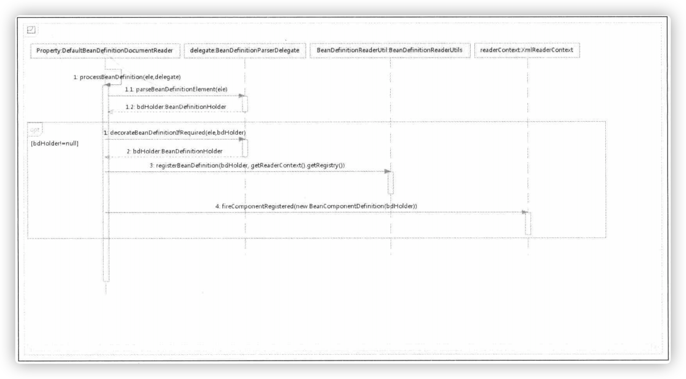

1. 首先委托`BeanDefinitionDelegate`的`parseBeanDefinitionElement()`方法进行元素解析，返回`BeanDefinitionHolder`定义的`bdHolder`，此时`bdHolder`已经**包含配置文件中的各种属性**，如`class`、`name`、`id`、`alias`等属性。
2. 当返回的`bdHolder`不为`null`时，若默认标签下的字节点再有自定义属性，还需要再次对自定义标签进行解析。
3. 解析完成后，需要对解析后的`bdHolder`进行注册，同样注册操作委托给了`BeanDefinitionReaderUtils`的`registerBeanDefinition()`方法。
4. 最后，发出响应事件，通知相关的监听器，这个`bean`已经加载完成。

```java
protected void processBeanDefinition(Element ele, BeanDefinitionParserDelegate delegate) {
  // 1
		BeanDefinitionHolder bdHolder = delegate.parseBeanDefinitionElement(ele);
		if (bdHolder != null) {
      // 需要的话，对beanDefinition进行修饰
			bdHolder = delegate.decorateBeanDefinitionIfRequired(ele, bdHolder);
			try {
				// Register the final decorated instance.
				BeanDefinitionReaderUtils.registerBeanDefinition(bdHolder, getReaderContext().getRegistry());
			}
			catch (BeanDefinitionStoreException ex) {
				getReaderContext().error("Failed to register bean definition with name '" +
						bdHolder.getBeanName() + "'", ele, ex);
			}
			// Send registration event.
      // 通知监听器解析及完成
			getReaderContext().fireComponentRegistered(new BeanComponentDefinition(bdHolder));
		}
	}
```


### 解析`BeanDefinition`

```java
BeanDefinitionHolder bdHolder = delegate.parseBeanDefinitionElement(ele);
```

1. 提取元素中的`id`以及`name`属性。
2. 进一步解析其他所有属性并统一封装至`GenericBeanDefinition`的实例中。
3. 如果监测到`bean`没有指定`beanName`，那么使用默认规则为此`bean`生成`beanName`。
4. 将获取到的信息封装到`BeanDefinitionHolder`的实例中。


**`BeanDefinitionParserDelegate.parseBeanDefinitionElement()`：**

```java
@Nullable
public BeanDefinitionHolder parseBeanDefinitionElement(Element ele) {
   return parseBeanDefinitionElement(ele, null);
}

@Nullable
public BeanDefinitionHolder parseBeanDefinitionElement(Element ele, @Nullable BeanDefinition containingBean) {
  // 解析id属性
   String id = ele.getAttribute(ID_ATTRIBUTE);
  // 解析name属性
   String nameAttr = ele.getAttribute(NAME_ATTRIBUTE);
	// 分割name属性
   List<String> aliases = new ArrayList<>();
   if (StringUtils.hasLength(nameAttr)) {
      String[] nameArr = StringUtils.tokenizeToStringArray(nameAttr, MULTI_VALUE_ATTRIBUTE_DELIMITERS);
      aliases.addAll(Arrays.asList(nameArr));
   }

   String beanName = id;
   if (!StringUtils.hasText(beanName) && !aliases.isEmpty()) {
      beanName = aliases.remove(0);
      // log
   }

   if (containingBean == null) {
      checkNameUniqueness(beanName, aliases, ele);
   }
	// 解析其他属性，并将所有属性封装至GenericBeanDefinition
   AbstractBeanDefinition beanDefinition = parseBeanDefinitionElement(ele, beanName, containingBean);
   if (beanDefinition != null) {
      if (!StringUtils.hasText(beanName)) {
         try {
            if (containingBean != null) {
              // 如果不存在beanName，那么根据Spring中提供的命名规则为当前bean生成对应的beanName
               beanName = BeanDefinitionReaderUtils.generateBeanName(
                     beanDefinition, this.readerContext.getRegistry(), true);
            }
            else {
               beanName = this.readerContext.generateBeanName(beanDefinition);
               String beanClassName = beanDefinition.getBeanClassName();
               if (beanClassName != null &&
                     beanName.startsWith(beanClassName) && beanName.length() > beanClassName.length() &&
                     !this.readerContext.getRegistry().isBeanNameInUse(beanClassName)) {
                  aliases.add(beanClassName);
               }
            }
            // log
         }
         catch (Exception ex) {
            error(ex.getMessage(), ele);
            return null;
         }
      }
      String[] aliasesArray = StringUtils.toStringArray(aliases);
     // 将获取到的信息封装到BeanDefinitionHolder的实例中。
      return new BeanDefinitionHolder(beanDefinition, beanName, aliasesArray);
   }

   return null;
}
```


**`BeanDefinitionParserDelegate.parseBeanDefinitionElement()`：**

```java
@Nullable
public AbstractBeanDefinition parseBeanDefinitionElement(
      Element ele, String beanName, @Nullable BeanDefinition containingBean) {

   this.parseState.push(new BeanEntry(beanName));

   String className = null;
  // 解析class属性
   if (ele.hasAttribute(CLASS_ATTRIBUTE)) {
      className = ele.getAttribute(CLASS_ATTRIBUTE).trim();
   }
   String parent = null;
  // 解析parent属性
   if (ele.hasAttribute(PARENT_ATTRIBUTE)) {
      parent = ele.getAttribute(PARENT_ATTRIBUTE);
   }

   try {
     // 创建用于承载属性的AbstractBeanDefinition类型的GenericBeanDefinition
      AbstractBeanDefinition bd = createBeanDefinition(className, parent);
		 // 硬编码解析默认bean的各种属性
      parseBeanDefinitionAttributes(ele, beanName, containingBean, bd);
     // 提取description
      bd.setDescription(DomUtils.getChildElementValueByTagName(ele, DESCRIPTION_ELEMENT));

     // 解析元数据
      parseMetaElements(ele, bd);
     // 解析look-method属性
      parseLookupOverrideSubElements(ele, bd.getMethodOverrides());
     // 解析replace- method属性
      parseReplacedMethodSubElements(ele, bd.getMethodOverrides());

     // 解析构造函数参数
      parseConstructorArgElements(ele, bd);
     // 解析property子元素
      parsePropertyElements(ele, bd);
     // 解析qualifier子元素
      parseQualifierElements(ele, bd);

      bd.setResource(this.readerContext.getResource());
      bd.setSource(extractSource(ele));

      return bd;
   }
   catch (Exception ex) {
      error("Bean class [" + className + "] not found", ele, ex);
   } // and so on
   return null;
}
```


#### 创建用于承载属性的`BeanDefinition`

`BeanDefinition`是一个接口，在`Spring`中存在三种实现`RootBeanDefinition`、`Definition`和`GenericBeanDefinition`。三种实现均继承了`AbstractBeanDefinition`。

`Spring`通过`BeanDefinition`将配置文件中`<bean>`配置信息转换为容器的内部表示，并将这些`BeanDefinition`注册到`BeanDefinitionRegistry`中。`Spring`的`BeanDefinitionRegistry`就像`Spring`配置信息的内存数据库，主要是`Map`的形式保存，后续操作直接从`BeanDefinitionRegistry`中读取配置信息。

**`BeanDefinitionParserDelegate.creatBeanDefinition()`：**

protected AbstractBeanDefinition createBeanDefinition(@Nullable String className, @Nullable String parentName)
      throws ClassNotFoundException {

   return BeanDefinitionReaderUtils.createBeanDefinition(
         parentName, className, this.readerContext.getBeanClassLoader());
}

**`BeanDefinitionReaderUtils.creatBeanDefinition()`：**

```java
public static AbstractBeanDefinition createBeanDefinition(
      @Nullable String parentName, @Nullable String className, @Nullable ClassLoader classLoader) throws ClassNotFoundException {

   GenericBeanDefinition bd = new GenericBeanDefinition();
  // parentName可能为空
   bd.setParentName(parentName);
   if (className != null) {
      if (classLoader != null) {
        // 如果classLoader不为空，则使用传入的classLoader同一虚拟机加载类对象，否则只是记录className
         bd.setBeanClass(ClassUtils.forName(className, classLoader));
      }
      else {
         bd.setBeanClassName(className);
      }
   }
   return bd;
}
```

#### 解析各种属性

当创建`bean`信息的承载实例后，便可以进行`bean`信息的各种属性解析了。

**`BeanDefinitionParserDelegate.parseBeanDefinitionAttributes()`：**

```java
public AbstractBeanDefinition parseBeanDefinitionAttributes(Element ele, String beanName,
      @Nullable BeanDefinition containingBean, AbstractBeanDefinition bd) {

  // singleton 变为scope
   if (ele.hasAttribute(SINGLETON_ATTRIBUTE)) {
      error("Old 1.x 'singleton' attribute in use - upgrade to 'scope' declaration", ele);
   }
  // 解析scope属性
   else if (ele.hasAttribute(SCOPE_ATTRIBUTE)) {
      bd.setScope(ele.getAttribute(SCOPE_ATTRIBUTE));
   }
   else if (containingBean != null) {
      // Take default from containing bean in case of an inner bean definition.
     // 在嵌入beanDefinition情况下且没有单独指定scope属性则使用父类默认的属性
      bd.setScope(containingBean.getScope());
   }

  // 解析abstract属性
   if (ele.hasAttribute(ABSTRACT_ATTRIBUTE)) {
      bd.setAbstract(TRUE_VALUE.equals(ele.getAttribute(ABSTRACT_ATTRIBUTE)));
   }

  // 解析lazy-init属性
   String lazyInit = ele.getAttribute(LAZY_INIT_ATTRIBUTE);
   if (isDefaultValue(lazyInit)) {
      lazyInit = this.defaults.getLazyInit();
   }
  // 若没有设置或设置成其他自负都会被设置为false
   bd.setLazyInit(TRUE_VALUE.equals(lazyInit));

  // 解析dependency-check属性
   String autowire = ele.getAttribute(AUTOWIRE_ATTRIBUTE);
   bd.setAutowireMode(getAutowireMode(autowire));

  // 解析depends-on属性
   if (ele.hasAttribute(DEPENDS_ON_ATTRIBUTE)) {
      String dependsOn = ele.getAttribute(DEPENDS_ON_ATTRIBUTE);
      bd.setDependsOn(StringUtils.tokenizeToStringArray(dependsOn, MULTI_VALUE_ATTRIBUTE_DELIMITERS));
   }

  // 解析autowise-condidate属性
   String autowireCandidate = ele.getAttribute(AUTOWIRE_CANDIDATE_ATTRIBUTE);
   if (isDefaultValue(autowireCandidate)) {
      String candidatePattern = this.defaults.getAutowireCandidates();
      if (candidatePattern != null) {
         String[] patterns = StringUtils.commaDelimitedListToStringArray(candidatePattern);
         bd.setAutowireCandidate(PatternMatchUtils.simpleMatch(patterns, beanName));
      }
   }
   else {
      bd.setAutowireCandidate(TRUE_VALUE.equals(autowireCandidate));
   }

  // 解析primery属性
   if (ele.hasAttribute(PRIMARY_ATTRIBUTE)) {
      bd.setPrimary(TRUE_VALUE.equals(ele.getAttribute(PRIMARY_ATTRIBUTE)));
   }

  // 解析init-method属性
   if (ele.hasAttribute(INIT_METHOD_ATTRIBUTE)) {
      String initMethodName = ele.getAttribute(INIT_METHOD_ATTRIBUTE);
      bd.setInitMethodName(initMethodName);
   }
   else if (this.defaults.getInitMethod() != null) {
      bd.setInitMethodName(this.defaults.getInitMethod());
      bd.setEnforceInitMethod(false);
   }

  // 解析destory-method属性
   if (ele.hasAttribute(DESTROY_METHOD_ATTRIBUTE)) {
      String destroyMethodName = ele.getAttribute(DESTROY_METHOD_ATTRIBUTE);
      bd.setDestroyMethodName(destroyMethodName);
   }
   else if (this.defaults.getDestroyMethod() != null) {
      bd.setDestroyMethodName(this.defaults.getDestroyMethod());
      bd.setEnforceDestroyMethod(false);
   }

  // 解析factory-method属性
   if (ele.hasAttribute(FACTORY_METHOD_ATTRIBUTE)) {
      bd.setFactoryMethodName(ele.getAttribute(FACTORY_METHOD_ATTRIBUTE));
   }
  // 解析factory-bean属性
   if (ele.hasAttribute(FACTORY_BEAN_ATTRIBUTE)) {
      bd.setFactoryBeanName(ele.getAttribute(FACTORY_BEAN_ATTRIBUTE));
   }

   return bd;
}
```


#### 解析子元素`meta`

```xml
<bean id="myTestBean" class="bean.MyTestBean">
  <meta key="testStr" value="aa"/>
</bean>
```

**`BeanDefinitionParserDelegate.parseMetaElements()`：**

```java
public void parseMetaElements(Element ele, BeanMetadataAttributeAccessor attributeAccessor) {
  // 获取当前节点的所有子元素
   NodeList nl = ele.getChildNodes();
   for (int i = 0; i < nl.getLength(); i++) {
      Node node = nl.item(i);
     // 提取meta
      if (isCandidateElement(node) && nodeNameEquals(node, META_ELEMENT)) {
         Element metaElement = (Element) node;
         String key = metaElement.getAttribute(KEY_ATTRIBUTE);
         String value = metaElement.getAttribute(VALUE_ATTRIBUTE);
        // 使用key、value构造BeanMetadataAtrribute
         BeanMetadataAttribute attribute = new BeanMetadataAttribute(key, value);
         attribute.setSource(extractSource(metaElement));
        // 记录信息
         attributeAccessor.addMetadataAttribute(attribute);
      }
   }
}
```


#### 解析子元素`lookup-method`

`lookup-method`称为获取器注入。获取器注入是一种特殊的方法注入，它是把一个方法声明为返回某种类型的`bean`，但实际要返回的`bean`是在配置文件里面配置的。

使用示例：

1. 创建一个父类：

   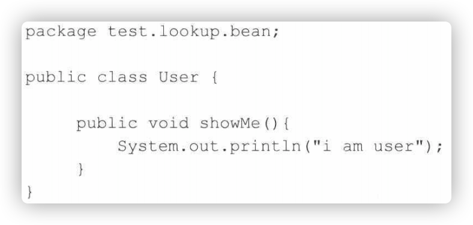

2. 创建其子类并覆盖`showMe()`方法：

   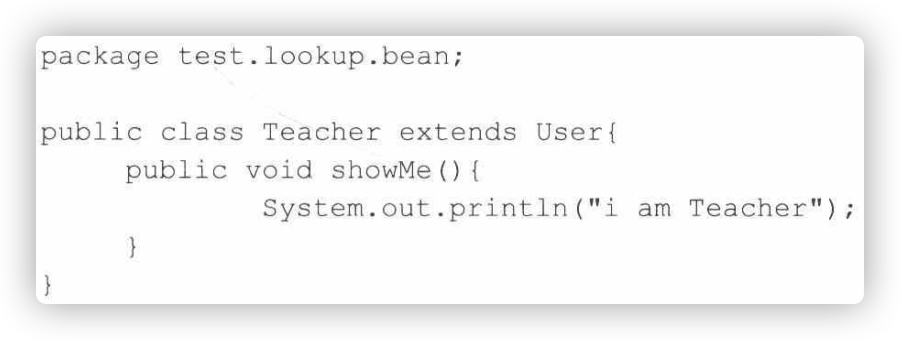

3. 创建调用方法：

   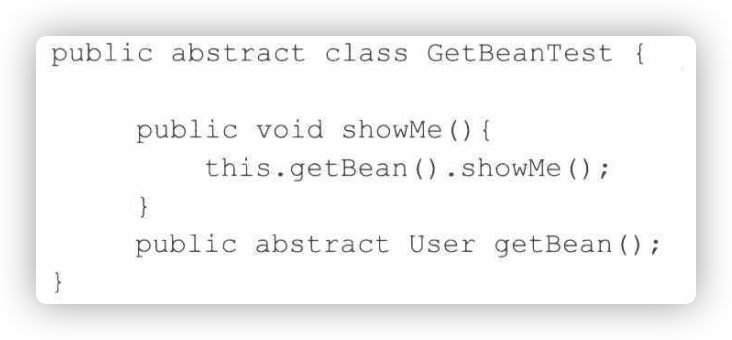

4. 测试方法：

   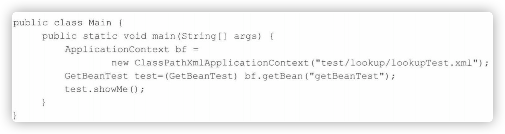

虽然抽象方法还没有被实现，但是这个提取起可以通过配置文件来实现。

配置文件：

```xml
<bean id="getBeanTest" class="test.lookup.app.GetBeanTest">
	<lookup-method name="getBean" bean="teacher"/>
</bean>
```

动态地将`teacher`所代表的`bean`作为返回值。

若是`teacher`已不再满足业务需求，那么可以轻松的进行修改。

增加`student`：


同时修改配置文件为：

```xml
<bean id="getBeanTest" class="test.lookup.app.GetBeanTest">
	<lookup-method name="getBean" bean="student"/>
</bean>
```

**`BeanDefinitionParserDelegate.parseLookupOverrideSubElements()`：**

```java
public void parseLookupOverrideSubElements(Element beanEle, MethodOverrides overrides) {
   NodeList nl = beanEle.getChildNodes();
   for (int i = 0; i < nl.getLength(); i++) {
      Node node = nl.item(i);
     // 仅当在Spring默认bean的子元素下且为lookup-method时有效
      if (isCandidateElement(node) && nodeNameEquals(node, LOOKUP_METHOD_ELEMENT)) {
         Element ele = (Element) node;
        // 获取要修饰的方法
         String methodName = ele.getAttribute(NAME_ATTRIBUTE);
        // 获取配置返回的bean
         String beanRef = ele.getAttribute(BEAN_ELEMENT);
         LookupOverride override = new LookupOverride(methodName, beanRef);
         override.setSource(extractSource(ele));
         overrides.addOverride(override);
      }
   }
}
```

与`meta`的解析极其相似。


#### 解析子元素`replaced-method`

可以在运行时用心得方法替换现有的方法。与`look-up`不同的是，`replaced-method`**不但可以动态地替换返回实体`bean`，而且还能动态地更改原有方法的逻辑。**

1. 在`changeMe`中完成某个业务逻辑。

   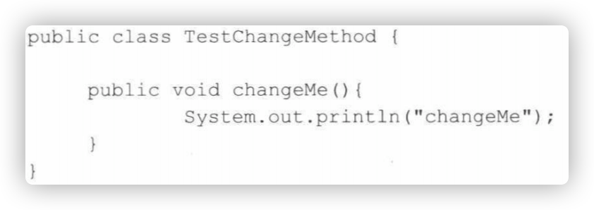

2. 需要改变原有的业务逻辑。

   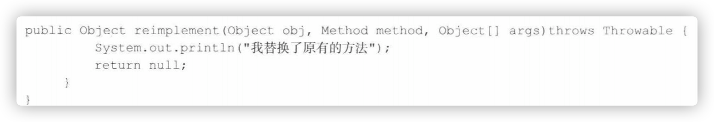

3. 使用`XML`使替换后的类生效。

   ```XML
   <bean id="testChangeMethod" class="test.replacementhod.TestChangeMethod">
   	<replace-method name="changeMe" replacer="replaceer"/>
   </bean>
   <bead id="replacer" class="tes.replcaementhod.TestMethodReplacer"/>
   ```

4. 测试。

   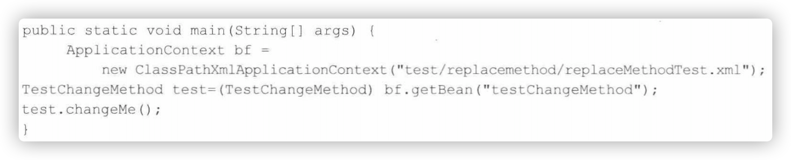

**`BeanDefinitionParserDelegate.parseReplacedMethodSubElements()`：**

```java
public void parseReplacedMethodSubElements(Element beanEle, MethodOverrides overrides) {
   NodeList nl = beanEle.getChildNodes();
   for (int i = 0; i < nl.getLength(); i++) {
      Node node = nl.item(i);
      if (isCandidateElement(node) && nodeNameEquals(node, REPLACED_METHOD_ELEMENT)) {
         Element replacedMethodEle = (Element) node;
        // 提取要替换的旧的方法
         String name = replacedMethodEle.getAttribute(NAME_ATTRIBUTE);
        // 提取对应的新的方法
         String callback = replacedMethodEle.getAttribute(REPLACER_ATTRIBUTE);
         ReplaceOverride replaceOverride = new ReplaceOverride(name, callback);
         // Look for arg-type match elements.
         List<Element> argTypeEles = DomUtils.getChildElementsByTagName(replacedMethodEle, ARG_TYPE_ELEMENT);
         for (Element argTypeEle : argTypeEles) {
           // 记录参数
            String match = argTypeEle.getAttribute(ARG_TYPE_MATCH_ATTRIBUTE);
            match = (StringUtils.hasText(match) ? match : DomUtils.getTextValue(argTypeEle));
            if (StringUtils.hasText(match)) {
               replaceOverride.addTypeIdentifier(match);
            }
         }
         replaceOverride.setSource(extractSource(replacedMethodEle));
         overrides.addOverride(replaceOverride);
      }
   }
}
```


#### 解析子元素`constructor-arg`

```xml
<bead id="helloBean" class="com.HelloBean" >
	<constructor-arg index="0">
  	<value>v1</value>
  </constructor-arg>
  <constructor-arg index="1">
  	<value>v2</value>
  </constructor-arg>
</bead>
```

这段`XML`可以让`Spring`自动寻找`HelloBean`对应的构造函数，并在初始化时将设置的参数传进去。

**`BeanDefinitionParserDelegate.parseConstructorArgElements()`：**

```java
public void parseConstructorArgElements(Element beanEle, BeanDefinition bd) {
   NodeList nl = beanEle.getChildNodes();
   for (int i = 0; i < nl.getLength(); i++) {
      Node node = nl.item(i);
      if (isCandidateElement(node) && nodeNameEquals(node, CONSTRUCTOR_ARG_ELEMENT)) {
        // 解析construct-arg
         parseConstructorArgElement((Element) node, bd);
      }
   }
}
```

遍历所有子元素，也就是提取所有`construct-arg`，然后进行解析。

**`BeanDefinitionParserDelegate.parseConstructorArgElement()`：**

* 如果配置中指定了`index`属性，那么：
  1. 解析`constructor-arg`的子元素。
  2. 使用`ConstructorArgumentValues.valueHolder`来封装解析出来的元素。
  3. 将`type`、`name`、`index`属性一并封装在`ConstructorArgumentValues.valueHolder`类型中，并添加至当前`BeanDefinition`的`constructorArgumentValues`的`indexedArgumentValues`属性中。
* 如果没有指定`index`属性，那么：
  1. 解析`constructor-arg`的子元素。
  2. 使用`ConstructorArgumentValues.ValueHolder`类型来封装解析出来的元素。
  3. 将`type`、`name`、`index`属性一并封装在`ConstructorArgumentValues.valueHolder`类型中，并添加至当前`BeanDefinition`的`constructorArgumentValues`的`genericArgumentValues`属性中。

可以看出，只是存储的地方不一样而已。

```java
public void parseConstructorArgElement(Element ele, BeanDefinition bd) {
  // 提取index属性
   String indexAttr = ele.getAttribute(INDEX_ATTRIBUTE);
  // 提取type属性
   String typeAttr = ele.getAttribute(TYPE_ATTRIBUTE);
  // 提取name属性
   String nameAttr = ele.getAttribute(NAME_ATTRIBUTE);
   if (StringUtils.hasLength(indexAttr)) {
      try {
         int index = Integer.parseInt(indexAttr);
         if (index < 0) {
            error("'index' cannot be lower than 0", ele);
         }
         else {
            try {
               this.parseState.push(new ConstructorArgumentEntry(index));
              // 解析ele对应的属性元素
               Object value = parsePropertyValue(ele, bd, null);
               ConstructorArgumentValues.ValueHolder valueHolder = new ConstructorArgumentValues.ValueHolder(value);
               if (StringUtils.hasLength(typeAttr)) {
                  valueHolder.setType(typeAttr);
               }
               if (StringUtils.hasLength(nameAttr)) {
                  valueHolder.setName(nameAttr);
               }
               valueHolder.setSource(extractSource(ele));
              // 不允许重复指定相同的参数
               if (bd.getConstructorArgumentValues().hasIndexedArgumentValue(index)) {
                  error("Ambiguous constructor-arg entries for index " + index, ele);
               }
               else {
                  bd.getConstructorArgumentValues().addIndexedArgumentValue(index, valueHolder);
               }
            }
            finally {
               this.parseState.pop();
            }
         }
      }
      catch (NumberFormatException ex) {
         error("Attribute 'index' of tag 'constructor-arg' must be an integer", ele);
      }
   }
   else {
     // 没有index属性则忽略掉属性，自动寻找
      try {
         this.parseState.push(new ConstructorArgumentEntry());
         Object value = parsePropertyValue(ele, bd, null);
         ConstructorArgumentValues.ValueHolder valueHolder = new ConstructorArgumentValues.ValueHolder(value);
         if (StringUtils.hasLength(typeAttr)) {
            valueHolder.setType(typeAttr);
         }
         if (StringUtils.hasLength(nameAttr)) {
            valueHolder.setName(nameAttr);
         }
         valueHolder.setSource(extractSource(ele));
         bd.getConstructorArgumentValues().addGenericArgumentValue(valueHolder);
      }
      finally {
         this.parseState.pop();
      }
   }
}
```


**`BeanDefinitionParserDelegate.parsePropertyValue()`：**

1. 略过`description`或者`meta`。

2. 提取`constructor-arg`上的`ref`和`value`属性，以便根据规则验证正确性，其规则为在`construct-arg`上不存在以下情况：

   1. 同时既有`ref`属性又有`value`属性。
   2. 存在`ref`属性或者`value`属性且又有子元素。

3. `ref`属性的处理。

   ```xml
   <constructor-arg ref="a"></constructor-arg>
   ```

4. `value`属性的处理。

   ```xml
   <construct-arg value="a"></construct-arg>
   ```

5. 子元素的处理。

   ```xml
   <construct-arg>
   	<map>
     	<entry key="key" value="value"/>
     </map>
   </construct-arg>
   ```

   

```java
@Nullable
public Object parsePropertyValue(Element ele, BeanDefinition bd, @Nullable String propertyName) {
   String elementName = (propertyName != null ?
         "<property> element for property '" + propertyName + "'" :
         "<constructor-arg> element");

   // Should only have one child element: ref, value, list, etc.
  // 一种属性只能对应一种类型：ref、value、list等。
   NodeList nl = ele.getChildNodes();
   Element subElement = null;
   for (int i = 0; i < nl.getLength(); i++) {
      Node node = nl.item(i);
     // 对应description或者meta不处理
      if (node instanceof Element && !nodeNameEquals(node, DESCRIPTION_ELEMENT) &&
            !nodeNameEquals(node, META_ELEMENT)) {
         // Child element is what we're looking for.
         if (subElement != null) {
            error(elementName + " must not contain more than one sub-element", ele);
         }
         else {
            subElement = (Element) node;
         }
      }
   }

  // 解析constructor-arg上的ref属性
   boolean hasRefAttribute = ele.hasAttribute(REF_ATTRIBUTE);
  // 解析constructor-arg上的value属性
   boolean hasValueAttribute = ele.hasAttribute(VALUE_ATTRIBUTE);
   if ((hasRefAttribute && hasValueAttribute) ||
         ((hasRefAttribute || hasValueAttribute) && subElement != null)) {
     /**
     	在constructor-arg上不存在以下情况：
					1. 同时既有ref属性又有value属性。
					2. 存在ref属性或者value属性且又有子元素。
     **/
      error(elementName +
            " is only allowed to contain either 'ref' attribute OR 'value' attribute OR sub-element", ele);
   }

   if (hasRefAttribute) {
     // ref属性的处理，使用RuntimeBeanReference封装对应的ref名称
      String refName = ele.getAttribute(REF_ATTRIBUTE);
      if (!StringUtils.hasText(refName)) {
         error(elementName + " contains empty 'ref' attribute", ele);
      }
      RuntimeBeanReference ref = new RuntimeBeanReference(refName);
      ref.setSource(extractSource(ele));
      return ref;
   }
   else if (hasValueAttribute) {
     // value属性的处理，使用Typed StringValue封装
      TypedStringValue valueHolder = new TypedStringValue(ele.getAttribute(VALUE_ATTRIBUTE));
      valueHolder.setSource(extractSource(ele));
      return valueHolder;
   }
   else if (subElement != null) {
     // 解析子元素
      return parsePropertySubElement(subElement, bd);
   }
   else {
      // Neither child element nor "ref" or "value" attribute found.
     // 即没有ref，也没有value
      error(elementName + " must specify a ref or value", ele);
      return null;
   }
}
```


对情况5中嵌入子元素`map`的处理：

**`BeanDefinitionParserDelegate.parsePropertySubElement()`：**

```java
@Nullable
public Object parsePropertySubElement(Element ele, @Nullable BeanDefinition bd) {
   return parsePropertySubElement(ele, bd, null);
}

@Nullable
	public Object parsePropertySubElement(Element ele, @Nullable BeanDefinition bd, @Nullable String defaultValueType) {
		if (!isDefaultNamespace(ele)) {
			return parseNestedCustomElement(ele, bd);
		}
		else if (nodeNameEquals(ele, BEAN_ELEMENT)) {
			BeanDefinitionHolder nestedBd = parseBeanDefinitionElement(ele, bd);
			if (nestedBd != null) {
				nestedBd = decorateBeanDefinitionIfRequired(ele, nestedBd, bd);
			}
			return nestedBd;
		}
		else if (nodeNameEquals(ele, REF_ELEMENT)) {
			// A generic reference to any name of any bean.
			String refName = ele.getAttribute(BEAN_REF_ATTRIBUTE);
			boolean toParent = false;
			if (!StringUtils.hasLength(refName)) {
				// A reference to the id of another bean in a parent context.
				refName = ele.getAttribute(PARENT_REF_ATTRIBUTE);
				toParent = true;
				if (!StringUtils.hasLength(refName)) {
					error("'bean' or 'parent' is required for <ref> element", ele);
					return null;
				}
			}
			if (!StringUtils.hasText(refName)) {
				error("<ref> element contains empty target attribute", ele);
				return null;
			}
			RuntimeBeanReference ref = new RuntimeBeanReference(refName, toParent);
			ref.setSource(extractSource(ele));
			return ref;
		}
		else if (nodeNameEquals(ele, IDREF_ELEMENT)) {
			return parseIdRefElement(ele);
		}
		else if (nodeNameEquals(ele, VALUE_ELEMENT)) {
			return parseValueElement(ele, defaultValueType);
		}
		else if (nodeNameEquals(ele, NULL_ELEMENT)) {
			// It's a distinguished null value. Let's wrap it in a TypedStringValue
			// object in order to preserve the source location.
			TypedStringValue nullHolder = new TypedStringValue(null);
			nullHolder.setSource(extractSource(ele));
			return nullHolder;
		}
		else if (nodeNameEquals(ele, ARRAY_ELEMENT)) {
			return parseArrayElement(ele, bd);
		}
		else if (nodeNameEquals(ele, LIST_ELEMENT)) {
			return parseListElement(ele, bd);
		}
		else if (nodeNameEquals(ele, SET_ELEMENT)) {
			return parseSetElement(ele, bd);
		}
		else if (nodeNameEquals(ele, MAP_ELEMENT)) {
			return parseMapElement(ele, bd);
		}
		else if (nodeNameEquals(ele, PROPS_ELEMENT)) {
			return parsePropsElement(ele);
		}
		else {
			error("Unknown property sub-element: [" + ele.getNodeName() + "]", ele);
			return null;
		}
	}
```


#### 解析子元素`property`

```xml
<bean id="test" class="xx.xxClass">
	<property name="p">
  	<list>
    	<value>aa</value>
      <value>bb</value>
    </list>
  </property>
</bean>
```


**`BeanDefinitionParserDelegate.parsePropertyElements()`：**

提取所有`property`的子元素，然后调用`parsePropertyElement`处理

```java
public void parsePropertyElements(Element beanEle, BeanDefinition bd) {
   NodeList nl = beanEle.getChildNodes();
   for (int i = 0; i < nl.getLength(); i++) {
      Node node = nl.item(i);
      if (isCandidateElement(node) && nodeNameEquals(node, PROPERTY_ELEMENT)) {
         parsePropertyElement((Element) node, bd);
      }
   }
}
```

**`BeanDefinitionParserDelegate.parsePropertyElement()`：**

```java
public void parsePropertyElement(Element ele, BeanDefinition bd) {
		String propertyName = ele.getAttribute(NAME_ATTRIBUTE);
		if (!StringUtils.hasLength(propertyName)) {
			error("Tag 'property' must have a 'name' attribute", ele);
			return;
		}
		this.parseState.push(new PropertyEntry(propertyName));
		try {
			if (bd.getPropertyValues().contains(propertyName)) {
				error("Multiple 'property' definitions for property '" + propertyName + "'", ele);
				return;
			}
			Object val = parsePropertyValue(ele, bd, propertyName);
			PropertyValue pv = new PropertyValue(propertyName, val);
			parseMetaElements(ele, pv);
			pv.setSource(extractSource(ele));
			bd.getPropertyValues().addPropertyValue(pv);
		}
		finally {
			this.parseState.pop();
		}
	}
```

使用`PropertyValue`进行封装，并记录`BeanDefinition`中的 `propertyValues`属性中。


#### 解析子元素`qualifier`

`Spring`中匹配的候选`Bean`数目必须有且仅有一个。当找不到一个匹配的`Bean`时，`Spring`容器将抛出`BeanCreationException`异常，并指出必须拥有一个匹配的`Bean`。

`Spring `允许我们通过`qualifier`指定注入的`Bean`的名称，这样就消除了歧义。

```xml
<bean id="myBean" class="bean.MyBean">
	<qualifier type="org.Springframework.beans.factory.annotion.Qualifier" value="af"/>
</bean>
```


至此，已经 完成了对`XML`文档到`GenericBeanDefinition`的转换，也就是说，`XML`中的所有配置都可以在`GenericBeanDefinition`的实例类中找到对应的配置。

然而`GenericBeaanDefinition`只是子类实现，大部分的通用属性都保存在`AbstracBeanDefinition`中。


### `AbstractBeanDefinition`属性

````java
public abstract class AbstractBeanDefinition extends BeanMetadataAttributeAccessor
		implements BeanDefinition, Cloneable {
	
  // 省略静态变量以及final常量
  
	@Nullable
  // bean的作用范围，对应bean属性scope
	private String scope = SCOPE_DEFAULT;

  // 是否抽象，对应bean属性的abstract
	private boolean abstractFlag = false;

  // 是否延迟加载，对应bean的属性lazy-init
	private boolean lazyInit = false;

  // 自动注入模式，对应bean属性的autowire
	private int autowireMode = AUTOWIRE_NO;

  // 依赖检查，sprng 3.0后弃用
	private int dependencyCheck = DEPENDENCY_CHECK_NONE;

	@Nullable
  // 用来表示一个bean的实例化依靠里一个bean先实例化，对应bean属性的deep-on
	private String[] dependsOn;

  /**
  	autowire-candidate属性设置为false，这样容器在查找自动装配对象时，将不考虑该bean，即他不会被考虑			作为其他bean自动装配的候选者，但是该bean本身还是可以使用自动装配来注入其他bean
  **/
	private boolean autowireCandidate = true;

  // 当自动装配出现多个bean候选者时，将作为首选者，对应bean属性的primary
	private boolean primary = false;

  // 用于记录Qualifier，对应子元素qualifire
	private final Map<String, AutowireCandidateQualifier> qualifiers = new LinkedHashMap<>();

	@Nullable
	private Supplier<?> instanceSupplier;

  // 运行访问非公开的构造起和方法，用程序设置
	private boolean nonPublicAccessAllowed = true;

  /**
  	是否以一种宽松的模式解析构造函数，默认为true
  	如果为false，则在如下情况：
  	interface ITest{}
  	class ITestImpl implements ITest {};
  	class Main{
  		Main(ITest i) {}
  		Main(ITestImpl i) {}
  	}
  	
  	抛出异常，因为Spring无法准确定位哪个构造函数。
  	使用函数设置。
  **/
	private boolean lenientConstructorResolution = true;

	@Nullable
  /**
  	对应bean属性factory-bean，用法：
  	<bean id="instanceFactoryBean" class="xx.InstanceFactoryBean" />
<bean id="currentTime" factory-bean="instanceFactoryBean" factory-method="createTime" />
  **/
	private String factoryBeanName;

	@Nullable
	private String factoryMethodName;

	@Nullable
  // 记录构造函数注入属性，对应bean属性constrctor-arg
	private ConstructorArgumentValues constructorArgumentValues;

	@Nullable
  // 普通属性集合
	private MutablePropertyValues propertyValues;

  // 方法重写的持有者，记录lookup-method、raplaced-method元素
	private MethodOverrides methodOverrides = new MethodOverrides();

	@Nullable
  // 初始化方法，对应bean属性init-method
	private String initMethodName;

	@Nullable
  // 销毁方法，对应bean属性destory-method
	private String destroyMethodName;

  // 是否执行init-method，用程序设置
	private boolean enforceInitMethod = true;

  // 是否执行destory-method，用程序设置
	private boolean enforceDestroyMethod = true;

  // 是否是用户定义的而不是应用程序本身定义的，创建AOP时为true，用程序设置
	private boolean synthetic = false;

  /**
  	定义这个bean的应用：
  	APPLICATION：用户
  	INFRASTRUCTURE：完全内部使用，与用户无关
  	SUPPORT：某些复杂配置的一部分
  	使用程序设置
  **/
	private int role = BeanDefinition.ROLE_APPLICATION;

	@Nullable
  // bean的描述信息
	private String description;

	@Nullable
  // bean定义的资源
	private Resource resource;
  
  // 省略setter/getter
}
````


### 解析默认标签中的自定义标签元素

```java
// 如果需要的话就对beanDefinition进行修饰
bdHolder = delegate.decorateBeanDefinitionIfRequired(ele, bdHolder);
```

上述代码的功能：

```XML
<bean id="test" class="test.MyClass">
	<mybean: user username="aa"/>
</bean>
```

当`Spring`中的`bean`使用的是默认标签配置，但是其中的子元素确实用了自定义的配置时，这句代码就会起作用了。

`bean`的解析分为两种类型，一种时默认类型的解析，另一种便是自定义类型的解析。但是此处的默认标签中却出现了自定义的类型，但实际上**这里不是`bean`，而是自定义的属性。**

**`BeanDefinitionParserDelegate.decorateBeanDefinitionIfRequired()`：**

```java
public BeanDefinitionHolder decorateBeanDefinitionIfRequired(Element ele, BeanDefinitionHolder originalDef) {
		return decorateBeanDefinitionIfRequired(ele, originalDef, null);
	}
```

第三个参数其实是父类的`bean`，以备当子类没有设置`scope`时默认使用父类的`scope`属性，又由于这里分析的事顶层配置，所以传递`null`。

**`BeanDefinitionParserDelegate.decorateBeanDefinitionIfRequired`:**

```java
public BeanDefinitionHolder decorateBeanDefinitionIfRequired(
			Element ele, BeanDefinitionHolder originalDef, @Nullable BeanDefinition containingBd) {

		BeanDefinitionHolder finalDefinition = originalDef;

		// Decorate based on custom attributes first.
		NamedNodeMap attributes = ele.getAttributes();
  // 遍历所有属性，看看是否有适用于修饰的属性
		for (int i = 0; i < attributes.getLength(); i++) {
			Node node = attributes.item(i);
			finalDefinition = decorateIfRequired(node, finalDefinition, containingBd);
		}

		// Decorate based on custom nested elements.
		NodeList children = ele.getChildNodes();
  // 遍历所有的子节点，看看是否有适用于修饰的子元素
		for (int i = 0; i < children.getLength(); i++) {
			Node node = children.item(i);
			if (node.getNodeType() == Node.ELEMENT_NODE) {
				finalDefinition = decorateIfRequired(node, finalDefinition, containingBd);
			}
		}
		return finalDefinition;
	}
```


**`BeanDefinitionParserDelegate.decorateIfRequired()`:**

```java
public BeanDefinitionHolder decorateIfRequired(
      Node node, BeanDefinitionHolder originalDef, @Nullable BeanDefinition containingBd) {

  // 获取自定义标签的命名空间
   String namespaceUri = getNamespaceURI(node);
  // 对于非默认标签进行修饰
   if (namespaceUri != null && !isDefaultNamespace(namespaceUri)) {
     // 根据命名空间找到对应的处理器
      NamespaceHandler handler = this.readerContext.getNamespaceHandlerResolver().resolve(namespaceUri);
      if (handler != null) {
        // 进行修饰
         BeanDefinitionHolder decorated =
               handler.decorate(node, originalDef, new ParserContext(this.readerContext, this, containingBd));
         if (decorated != null) {
            return decorated;
         }
      }
      else if (namespaceUri.startsWith("http://www.springframework.org/")) {
         error("Unable to locate Spring NamespaceHandler for XML schema namespace [" + namespaceUri + "]", node);
      }
      else {
         // A custom namespace, not to be handled by Spring - maybe "xml:...".
         if (logger.isDebugEnabled()) {
            logger.debug("No Spring NamespaceHandler found for XML schema namespace [" + namespaceUri + "]");
         }
      }
   }
   return originalDef;
}
```

首先获取属性或者元素的命名空，以此来判断该元素或者属性是否适用于自定义标签的解析条件，找出自定义类型所对应的`NamespaceHandler`并进行进一步解析。


​	所以`decorateBeanDefinitionIfRequired`方法的作用：只对自定义的标签或者说对`bean`的自定义属性感兴趣（第7行`!isDefaultNamespace(namespaceUri)`直接略过默认标签）。在方法中实现了寻找自定义标签，并根据自定义标签寻找命名空间处理器，并进行进一步的解析。


### 注册解析的`BeanDefinition`

到目前为止，对于配置文件，已经完成解析，完成装饰，对于`beanDefinition`已经可以满足要求了，但是还没有被注册。

```java
BeanDefinitionReaderUtils.registerBeanDefinition(bdHolder,getReaderContext().getRegistry());
```

**`BeanDefinitionReaderUtils.registerBeanDefinition()`:**

解析的`beanDefinition`都会被注册到`BeanDefinitionRegistry`类型的实例中：

1. 通过`beanName`的注册。
2. 通过别名的注册。

```java
public static void registerBeanDefinition(
      BeanDefinitionHolder definitionHolder, BeanDefinitionRegistry registry)
      throws BeanDefinitionStoreException {

   // Register bean definition under primary name.
  // 使用beanName坐唯一标识
   String beanName = definitionHolder.getBeanName();
   registry.registerBeanDefinition(beanName, definitionHolder.getBeanDefinition());

   // Register aliases for bean name, if any.
  // 注册所有别名
   String[] aliases = definitionHolder.getAliases();
   if (aliases != null) {
      for (String alias : aliases) {
         registry.registerAlias(beanName, alias);
      }
   }
}
```

* 通过`beanName`注册`BeanDefinition`

  1. 对`AbstractBeanDefinition`的校验。在解析`XML`文件的时候是对`XML`格式校验，而此时的校验是对于`AbstractBeanDefinition`的`methodOverrides`属性的。
  2. 对`beanName`已经注册的情况的处理。如果设置了不允许`bean`的覆盖，则需要抛出异常，否则直接覆盖。
  3. 加入`map`缓存*`key`为`beanName`*。
  4. 清除解析之前留下的对应`beanName`的缓存。

  **`DefaultListableBeanFactory.registryBeanDefinition()`:**

  ```java
  @Override
  public void registerBeanDefinition(String beanName, BeanDefinition beanDefinition)
        throws BeanDefinitionStoreException {
  
     Assert.hasText(beanName, "Bean name must not be empty");
     Assert.notNull(beanDefinition, "BeanDefinition must not be null");
  
     if (beanDefinition instanceof AbstractBeanDefinition) {
        try {
          // 校验methodOverride是否与工厂方法并存或者methodOverride对应方法根本不存在
           ((AbstractBeanDefinition) beanDefinition).validate();
        }
        catch (BeanDefinitionValidationException ex) {
           throw new BeanDefinitionStoreException(beanDefinition.getResourceDescription(), beanName,
                 "Validation of bean definition failed", ex);
        }
     }
  
     BeanDefinition existingDefinition = this.beanDefinitionMap.get(beanName);
     if (existingDefinition != null) {
        if (!isAllowBeanDefinitionOverriding()) {
           throw new BeanDefinitionStoreException(beanDefinition.getResourceDescription(), beanName,
                 "Cannot register bean definition [" + beanDefinition + "] for bean '" + beanName +
                 "': There is already [" + existingDefinition + "] bound.");
        }
        else if (existingDefinition.getRole() < beanDefinition.getRole()) {
           // e.g. was ROLE_APPLICATION, now overriding with ROLE_SUPPORT or ROLE_INFRASTRUCTURE
           if (logger.isWarnEnabled()) {
              logger.warn("Overriding user-defined bean definition for bean '" + beanName +
                    "' with a framework-generated bean definition: replacing [" +
                    existingDefinition + "] with [" + beanDefinition + "]");
           }
        }
        else if (!beanDefinition.equals(existingDefinition)) {
           if (logger.isInfoEnabled()) {
              logger.info("Overriding bean definition for bean '" + beanName +
                    "' with a different definition: replacing [" + existingDefinition +
                    "] with [" + beanDefinition + "]");
           }
        }
        else {
           if (logger.isDebugEnabled()) {
              logger.debug("Overriding bean definition for bean '" + beanName +
                    "' with an equivalent definition: replacing [" + existingDefinition +
                    "] with [" + beanDefinition + "]");
           }
        }
        this.beanDefinitionMap.put(beanName, beanDefinition);
     }
     else {
        if (hasBeanCreationStarted()) {
           // Cannot modify startup-time collection elements anymore (for stable iteration)
           synchronized (this.beanDefinitionMap) {
              this.beanDefinitionMap.put(beanName, beanDefinition);
              List<String> updatedDefinitions = new ArrayList<>(this.beanDefinitionNames.size() + 1);
              updatedDefinitions.addAll(this.beanDefinitionNames);
              updatedDefinitions.add(beanName);
              this.beanDefinitionNames = updatedDefinitions;
              if (this.manualSingletonNames.contains(beanName)) {
                 Set<String> updatedSingletons = new LinkedHashSet<>(this.manualSingletonNames);
                 updatedSingletons.remove(beanName);
                 this.manualSingletonNames = updatedSingletons;
              }
           }
        }
        else {
           // Still in startup registration phase
          // 注册beanDefinition
           this.beanDefinitionMap.put(beanName, beanDefinition);
          // 记录beanDefinition
           this.beanDefinitionNames.add(beanName);
           this.manualSingletonNames.remove(beanName);
        }
        this.frozenBeanDefinitionNames = null;
     }
  
     if (existingDefinition != null || containsSingleton(beanName)) {
       // 重置所有beanName对应的缓存
        resetBeanDefinition(beanName);
     }
     else if (isConfigurationFrozen()) {
        clearByTypeCache();
     }
  ```

* 通过别名注册`BeanDefinition`

  1. `alias`与`beanName`相同情况处理。若`alias`与`beanName`并名称则不需要处理并删除掉原有的`alias`。
  2. `alias`覆盖处理。若`aliasName`已经被使用并已经指向了另一`beanName`则需要用户的设置进行处理。
  3. `alias`循环检查。当`A->B->C`存在时，若再次出现`C->A`的时候则会抛出异常。
  4. 注册`alias`。

  **`SimpleAliasRegistry.registryAlias()`:**

  ```java
  @Override
  public void registerAlias(String name, String alias) {
     Assert.hasText(name, "'name' must not be empty");
     Assert.hasText(alias, "'alias' must not be empty");
     synchronized (this.aliasMap) {
       // 如果beanName与alias同名
        if (alias.equals(name)) {
           this.aliasMap.remove(alias);
           if (logger.isDebugEnabled()) {
              logger.debug("Alias definition '" + alias + "' ignored since it points to same name");
           }
        }
        else {
           String registeredName = this.aliasMap.get(alias);
           if (registeredName != null) {
              if (registeredName.equals(name)) {
                 // An existing alias - no need to re-register
                 return;
              }
             // 如果alias不允许被覆盖
              if (!allowAliasOverriding()) {
                 throw new IllegalStateException("Cannot define alias '" + alias + "' for name '" +
                       name + "': It is already registered for name '" + registeredName + "'.");
              }
              if (logger.isInfoEnabled()) {
                 logger.info("Overriding alias '" + alias + "' definition for registered name '" +
                       registeredName + "' with new target name '" + name + "'");
              }
           }
          // 循环检查
           checkForAliasCircle(name, alias);
           this.aliasMap.put(alias, name);
           if (logger.isDebugEnabled()) {
              logger.debug("Alias definition '" + alias + "' registered for name '" + name + "'");
           }
        }
     }
  }
  ```

别名处理：

**`SimpleAliasRegsitry.checkForAliasCircle()`:**

```java
protected void checkForAliasCircle(String name, String alias) {
   if (hasAlias(alias, name)) {
      throw new IllegalStateException("Cannot register alias '" + alias +
            "' for name '" + name + "': Circular reference - '" +
            name + "' is a direct or indirect alias for '" + alias + "' already");
   }
}
```

**`SimpleAliasRegsitry.hasAlias()`:**

```java
public boolean hasAlias(String name, String alias) {
   for (Map.Entry<String, String> entry : this.aliasMap.entrySet()) {
      String registeredName = entry.getValue();
      if (registeredName.equals(name)) {
         String registeredAlias = entry.getKey();
         if (registeredAlias.equals(alias) || hasAlias(registeredAlias, alias)) {
            return true;
         }
      }
   }
   return false;
}
```


### 通知监听器解析及注册完成

```java
getReaderContext().fireComponentRegistered(new BeanComponentDefinition(bdHolder));
```

这里的实现只为扩展，当程序开发人员需要对注册`BeanDefinition`实践进行监听时可以通过注册监听器的方式并将处理逻辑写入监听器。


## `alias`标签的解析

在对`bean`进行定义时，除了使用`id`属性来指定名称之外，为了提供多个名称，可以使用`alias`标签来指定。而所有的这些名称都指向同一个`bean`。

```xml
<bean id="testBean" class="com.test"/>
<bean id="testBean" name="testBean, testBean2" class="com.test"/>

<!--other style-->
<bean id="testBean" class="com.test"/>
<alias name="testBean" alias="testBean, testBean2"/>
```

**`DefaultBeanDefinitionDocumentReader`:**

```java
protected void processAliasRegistration(Element ele) {
  // 获取beanName
   String name = ele.getAttribute(NAME_ATTRIBUTE);
  // 获取alias
   String alias = ele.getAttribute(ALIAS_ATTRIBUTE);
   boolean valid = true;
   if (!StringUtils.hasText(name)) {
      getReaderContext().error("Name must not be empty", ele);
      valid = false;
   }
   if (!StringUtils.hasText(alias)) {
      getReaderContext().error("Alias must not be empty", ele);
      valid = false;
   }
   if (valid) {
      try {
        // 注册alias
         getReaderContext().getRegistry().registerAlias(name, alias);
      }
      catch (Exception ex) {
         getReaderContext().error("Failed to register alias '" + alias +
               "' for bean with name '" + name + "'", ele, ex);
      }
      getReaderContext().fireAliasRegistered(name, alias, extractSource(ele));
   }
}
```

与之前`bean`中`alias`解析大同小异，都是将别名与`beanName`组成一对注册至`registry`中。


## `import`标签解析

在将配置文件分模块之后，可以使用`import`标签将他们导入。

```xml
<import resource="customerContext.xml"/>
<import resource="systemContext.xml"/>
```

**`DefaultBeanDefinitionDocumentReader.importBeanDefinitionResource()`:**

1. 获取`resource`属性所表示的路径。
2. 解析路径中的系统属性，格式如`${user.dir}`。
3. 判定`location`是绝对路径还是相对路径。
4. 如果是绝对路径则递归调用`bean`的解析过程，进行另一次的解析。
5. 如果是相对路径则计算出绝对路径进行解析。
6. 通知监听器，解析完成。

```java
protected void importBeanDefinitionResource(Element ele) {
  // 获取resource属性
   String location = ele.getAttribute(RESOURCE_ATTRIBUTE);
  // 如果不存在resource属性则不做任何处理
   if (!StringUtils.hasText(location)) {
      getReaderContext().error("Resource location must not be empty", ele);
      return;
   }

   // Resolve system properties: e.g. "${user.dir}"
  // 解析系统属性，如${user.dir}
   location = getReaderContext().getEnvironment().resolveRequiredPlaceholders(location);

   Set<Resource> actualResources = new LinkedHashSet<>(4);

   // Discover whether the location is an absolute or relative URI
  // 判定location时绝对URI还是相对URI
   boolean absoluteLocation = false;
   try {
      absoluteLocation = ResourcePatternUtils.isUrl(location) || ResourceUtils.toURI(location).isAbsolute();
   }
   catch (URISyntaxException ex) {
      // cannot convert to an URI, considering the location relative
      // unless it is the well-known Spring prefix "classpath*:"
   }

   // Absolute or relative?
  // 如果是相对URI则直接根据地址加载对应的配置文件
   if (absoluteLocation) {
      try {
         int importCount = getReaderContext().getReader().loadBeanDefinitions(location, actualResources);
         if (logger.isDebugEnabled()) {
            logger.debug("Imported " + importCount + " bean definitions from URL location [" + location + "]");
         }
      }
      catch (BeanDefinitionStoreException ex) {
         getReaderContext().error(
               "Failed to import bean definitions from URL location [" + location + "]", ele, ex);
      }
   }
   else {
      // No URL -> considering resource location as relative to the current file.
     // 如果是相对地址则根据相对地址计算出绝对地址
      try {
         int importCount;
        /**
        	Resource存在多个子类实现类，如VfsResource。。
        	而每个resource的createRealative方式的实现都不一样，所以这里先使用子类的方法尝试解析
        **/
         Resource relativeResource = getReaderContext().getResource().createRelative(location);
         if (relativeResource.exists()) {
            importCount = getReaderContext().getReader().loadBeanDefinitions(relativeResource);
            actualResources.add(relativeResource);
         }
         else {
           // 如果解析不成功，则使用默认的解析器ResourcePatternResolver进行解析
            String baseLocation = getReaderContext().getResource().getURL().toString();
            importCount = getReaderContext().getReader().loadBeanDefinitions(
                  StringUtils.applyRelativePath(baseLocation, location), actualResources);
         }
         if (logger.isDebugEnabled()) {
            logger.debug("Imported " + importCount + " bean definitions from relative location [" + location + "]");
         }
      }
      catch (IOException ex) {
         getReaderContext().error("Failed to resolve current resource location", ele, ex);
      }
      catch (BeanDefinitionStoreException ex) {
         getReaderContext().error("Failed to import bean definitions from relative location [" + location + "]",
               ele, ex);
      }
   }
  // 解析后进行监听器激活处理
   Resource[] actResArray = actualResources.toArray(new Resource[0]);
   getReaderContext().fireImportProcessed(location, actResArray, extractSource(ele));
}
```


### 嵌入式`beans`标签的解析

与单独的配置文件并没有太大的差别，也是递归调用`beans`的解析过程。


# 自定义标签的解析

`Spring`中存在**默认标签**与**自定义标签**两种。

## 自定义标签的使用

在配置较为复杂或者需要更多丰富控制的时候，直接使用基于`Spring`的标准`bean`来配置，会显得非常笨拙。

`Spring`提供了可扩展`Schema`的支持，扩展`Spring`自定义标签大致需要以下几个步骤：

1. 创建一个需要扩展的组建。

   ```java
   public class User {
     private String userName;
     private String email;
     // setter and getter
   }
   ```

2. 定义一个`XSD`文件描述的组件内容。

   ```xml
   <!--some schema-->
   <element name="user">
   	<complexType>
     	<attribute name="id" type="string"/>
       <attribute name="userName" type="string"/>
       <attribute name="email" type="string"/>
     </complexType>
   </element>
   ```

   > ​	`XSD`文件中描述了一个新的`targetNamespace`，并在这个空间中定义了一个`name`为`user`的`element`，`user`有3个属性`id`、`userName`、`email`，其中`email`为`string`。这3个类主要用于验证`Spring`配置文件中自定义格式。

3. 创建一个文件，实现`BeanDefinitionParser`接口，用来解析文件中的定义和组件定义。

   ```java
   public class UserBeanDefinitionParser extends AbstractStringBeanDefinitionParser {
     // Element对应的类
     protected class getBeanClass(Element element) {
       return User.class;
     }
     
     // 从element中解析并提取对应的元素
     protected void doParse(Element element, BeanDefinitionBuilder bean) {
       String userName = element.getAttribute("userName");
       String email = element.getAttribute("email");
       /** 
       	将提取到的数据放入到BeanDefinitionBuilder中，
       	待到完成所有bean的解析后统一注册到beanFactory中
       **/
       if(StringUtils.hasText(userName)) {
         bean.addPropertyValue("userName", userName);
       }
       if(StringUtils.hasText(email)) {
         bean.addPropertyValue("email", email);
       }
     }
   }
   ```

4. 创建一个`handler`文件，扩展自`NamespaceHandlerSupport`，目的是将组件注册到`Spring`容器。

   ```java
   public class MyNamespaceHandler extends NamespaceHandlerSupport {
     public void init() {
       registryBeanDefinitionParser("user", new UserBeanDefinitionParser());
     }
   }
   ```

   遇到自定义标签`<user :aaa`这样类似于以`user`开头的元素，就会把这个元素扔给对应的解析器（`UserBeanDefinitionParser`）去解析。

5. 编写`Spring.handlers`和`Spring.schemas`文件。

   默认位置实在工程的`/META-INF/`文件夹下，也可以通过修改`Spring`的扩展或者修改源码的方式改变路径。

   * `Spring.handlers`

     `http\://www.lexueba.com/schema/user=test.customtag.MyNamespaceHandler`

   * `Spring.schemas`

     `http\://www.lexueba.com/schema/user.xsd=META-INF/Spring-test.xsd`

这样，当`Spring`遇到自定义标签后，会去`Spring.handlers`和`Spring.schemas`中去寻找对应的`handler`和`XSD`，进而又找到对应的`handler`以及解析元素的`Parser`，从而完成了整个自定义元素的解析。

所以，自定义与`Spring`中默认的标准配置不同在于`Spring`将自定义标签解析的工作委托给了用户去实现。

6. 在配置文件中引入上面配置好的命名空间以及`XSD`后，便可以直接使用自定义标签了。

   ```xml
   <bean xmlns:myname="http://www.lexueba.com/schema/user"
         xsi:"http://www.lexueba.com/schema/user http://www.lexueba.com/schema/user.xsd">
   	<myname:user id="testBean" userName="aaa" email="bbb"/>
   </bean>
   ```

7. 在程序中获得这个标签对应的`bean`。

   ```java
   ApplicationContext bf = new ClassPathXmlApplicationContext("test/customtag/test.xml");
   User user = (User)bf.getBean("testBean");
   ```

   

## 自定义标签解析

根据对应的`bean`获取对应的命名空间，更具命名空间解析对应的处理器，然后根据用户自定义的处理器进行解析。

**`BeanDefinitionParserDelegate.parseCustomElement()`:**

```java
public BeanDefinition parseCustomElement(Element ele) {
   return parseCustomElement(ele, null);
}

@Nullable
// containingBd为父类bean，对顶层元素的解析应设置为null
	public BeanDefinition parseCustomElement(Element ele, @Nullable BeanDefinition containingBd) {
    // 获取对应的命名空间
		String namespaceUri = getNamespaceURI(ele);
		if (namespaceUri == null) {
			return null;
		}
    // 根据命名空间找到对应的NamespaceHandler
		NamespaceHandler handler = this.readerContext.getNamespaceHandlerResolver().resolve(namespaceUri);
		if (handler == null) {
			error("Unable to locate Spring NamespaceHandler for XML schema namespace [" + namespaceUri + "]", ele);
			return null;
		}
    // 调用自定义的NamespaceHandler进行解析
		return handler.parse(ele, new ParserContext(this.readerContext, this, containingBd));
	}
```


### 获取标签的命名空间

标签的解析是从命名空间的提起开始的，无论是区分`Spring`中默认标签和自定义标签还是自定义标签中不同标签的处理器都是以标签所提供的命名空间为基础的，而至于如何提取对应元素的命名空间其实不需要去实现，在`org.w3c.dom.Node`中已经提供了方法：

**`BeanDefinitionParserDelegate.getNamespaceURI():`**

```java
public String getNamespaceURI(Node node) {
		return node.getNamespaceURI();
	}
```


### 提取自定义标签处理器

有了命名空间，就可以进行`NamespaceHandler`的提取了。

```java
NamespaceHandler handler = this.readerContext.getNamespaceHandlerResolver().resolve(namespaceUri);
```

这里`resolve()`其实调用的是`DefaultNamespaceHandlerResolver`的`resolve`方法。

**`DefaultNamespaceHandlerResolver.resolve()`:**

```java
public NamespaceHandler resolve(String namespaceUri) {
  // 获取所有已经配置的handler映射
   Map<String, Object> handlerMappings = getHandlerMappings();
  // 根据命名空间找到对应的信息
   Object handlerOrClassName = handlerMappings.get(namespaceUri);
   if (handlerOrClassName == null) {
      return null;
   }
   else if (handlerOrClassName instanceof NamespaceHandler) {
     // 已经做过解析的情况，直接从缓存中读取
      return (NamespaceHandler) handlerOrClassName;
   }
   else {
     // 没有做过解析，则返回的是类路径
      String className = (String) handlerOrClassName;
      try {
        // 使用反射将类路径转化为类
         Class<?> handlerClass = ClassUtils.forName(className, this.classLoader);
         if (!NamespaceHandler.class.isAssignableFrom(handlerClass)) {
            throw new FatalBeanException("Class [" + className + "] for namespace [" + namespaceUri +
                  "] does not implement the [" + NamespaceHandler.class.getName() + "] interface");
         }
        // 初始化类
         NamespaceHandler namespaceHandler = (NamespaceHandler) BeanUtils.instantiateClass(handlerClass);
        // 调用自定义的Namespace Handler的初始化方法
         namespaceHandler.init();
        // 记录在缓存
         handlerMappings.put(namespaceUri, namespaceHandler);
         return namespaceHandler;
      }
      catch (ClassNotFoundException ex) {
         throw new FatalBeanException("Could not find NamespaceHandler class [" + className +
               "] for namespace [" + namespaceUri + "]", ex);
      }
      catch (LinkageError err) {
         throw new FatalBeanException("Unresolvable class definition for NamespaceHandler class [" +
               className + "] for namespace [" + namespaceUri + "]", err);
      }
   }
}
```

使用自定义标签，那么在`Spring.handlers`文件中配置命名空间与命名空间处理器的映射关系就是必不可少的操作之一。只有这样，`Spring`才能根据映射关系找到匹配的处理器，而寻找匹配的处理器就是在上面函数中实现，当获取到`NamespaceHandler`之后就可以进行处理器初始化并解析了。

当获得自定义命名空间处理后，会马上执行`NamespaceHandler.init()`来进行自定义`BeanDedifinitionParser`的注册，在这里（`MyNamespaceHandler.init()`）可以注册多个标签解析器。

注册后，命名空间处理器就可以根据标签的不同来调用不同的解析器进行解析。所以，可以推断`getHandlerMappings`的主要功能是读取`Spring.handlers`配置文件并将配置文件缓存进`map`。

**`DefaultNamespaceHandlerResolver.getHandlerMappings()`:**

```java
private Map<String, Object> getHandlerMappings() {
   Map<String, Object> handlerMappings = this.handlerMappings;
  // 如果没有被缓存则开始进行缓存
   if (handlerMappings == null) {
      synchronized (this) {
         handlerMappings = this.handlerMappings;
         if (handlerMappings == null) {
            if (logger.isDebugEnabled()) {
               logger.debug("Loading NamespaceHandler mappings from [" + this.handlerMappingsLocation + "]");
            }
            try {
              // this.handlerMappingsLocation在构造函数中已经被初始化为：META-INF/Springs.handler
               Properties mappings =
                     PropertiesLoaderUtils.loadAllProperties(this.handlerMappingsLocation, this.classLoader);
               if (logger.isDebugEnabled()) {
                  logger.debug("Loaded NamespaceHandler mappings: " + mappings);
               }
               handlerMappings = new ConcurrentHashMap<>(mappings.size());
              // 将Properties格式文件合并到Map格式的handlerMappings
               CollectionUtils.mergePropertiesIntoMap(mappings, handlerMappings);
               this.handlerMappings = handlerMappings;
            }
            catch (IOException ex) {
               throw new IllegalStateException(
                     "Unable to load NamespaceHandler mappings from location [" + this.handlerMappingsLocation + "]", ex);
            }
         }
      }
   }
   return handlerMappings;
}
```

借助了工具类`PropertiesLoaderUtils`对属性`handlerMappingsLocation`进行了配置文件的读取，`handlerMappingsLocation`被默认初始化为`MEATA-INF/Spring.handlers`。


### 标签解析

得到了解析器以及要分析的元素后，`Spring`就可以讲解析工作委托给自定义解析器去解析了。

**`BeanDefinitionParserDelegate.parseCustomElement`:**

```java
return handler.parse(ele, new ParserContext(this.readerContext, this, containingBd));
```

此时的`handler`已经被实例化成自定义的`MyNamespaceHandler`了，而`MyNamespaceHandler`也已经完成了初始化的工作，但是这个自定义的命名空间处理器中却并没有实现`parse`方法，所以推断，这个方法是父类中的实现，查看父类`NamespaceHandlerSupport`中的`parse`方法。

**`NamespaceHandlerSupport.parse()`:**

```java
public BeanDefinition parse(Element element, ParserContext parserContext) {
  // 寻找解析器并进行解析操作
   BeanDefinitionParser parser = findParserForElement(element, parserContext);
   return (parser != null ? parser.parse(element, parserContext) : null);
}
```

解析过程中首先是寻找元素对应的解析器，进而调用解析器中的`parse`方法，那么，其实首先是获取`MyNameSpaceHandler`中的`init()`方法中注册的对应的`UserBeanDefinitionParser`实例，并进一步调用其`parse`方法进行解析。

```java
private BeanDefinitionParser findParserForElement(Element element, ParserContext parserContext) {
  // 获取元素名称，如<myname: user中的user，此时localName为user
   String localName = parserContext.getDelegate().getLocalName(element);
  // 根据user找到对应的注册的解析器，registerBeanDefinitionParser
   BeanDefinitionParser parser = this.parsers.get(localName);
   if (parser == null) {
      parserContext.getReaderContext().fatal(
            "Cannot locate BeanDefinitionParser for element [" + localName + "]", element);
   }
   return parser;
}
```

那么`NamepspaceHandlerSupport`中的`parser.parse()`为：

**`AbstractBeanDefinitionParser.parse()`:**

```java
public final BeanDefinition parse(Element element, ParserContext parserContext) {
   AbstractBeanDefinition definition = parseInternal(element, parserContext);
   if (definition != null && !parserContext.isNested()) {
      try {
         String id = resolveId(element, definition, parserContext);
         if (!StringUtils.hasText(id)) {
            parserContext.getReaderContext().error(
                  "Id is required for element '" + parserContext.getDelegate().getLocalName(element)
                        + "' when used as a top-level tag", element);
         }
         String[] aliases = null;
         if (shouldParseNameAsAliases()) {
            String name = element.getAttribute(NAME_ATTRIBUTE);
            if (StringUtils.hasLength(name)) {
               aliases = StringUtils.trimArrayElements(StringUtils.commaDelimitedListToStringArray(name));
            }
         }
        // 将AbstractBeanDefinition转换为BeanDefinitionHolder并注册
         BeanDefinitionHolder holder = new BeanDefinitionHolder(definition, id, aliases);
         registerBeanDefinition(holder, parserContext.getRegistry());
         if (shouldFireEvents()) {
           // 需要通知监听器进行注册
            BeanComponentDefinition componentDefinition = new BeanComponentDefinition(holder);
            postProcessComponentDefinition(componentDefinition);
            parserContext.registerComponent(componentDefinition);
         }
      }
      catch (BeanDefinitionStoreException ex) {
         String msg = ex.getMessage();
         parserContext.getReaderContext().error((msg != null ? msg : ex.toString()), element);
         return null;
      }
   }
   return definition;
}
```

虽然说是对自定义配置文件的解析，但是，可以看到，这个函数中大部分的代码是用来处理解析后的`AbstractBeanDefinition`转化为`BeanDefinitionHolder`并注册的功能，而真正去做解析的事情委托给了函数`parseInternal`，正是这句代码调用了自定义的解析函数。

在`parseInternal`中并不是直接调用自定义的`doParse`函数，而是进行了一系列的数据准备，包括对`beanClass`、`scope`、`lazyInit`等属性的准备。

**`AbstractSingleBeanDefinitionParser.parseInternal()`:**

```java
protected final AbstractBeanDefinition parseInternal(Element element, ParserContext parserContext) {
   BeanDefinitionBuilder builder = BeanDefinitionBuilder.genericBeanDefinition();
   String parentName = getParentName(element);
   if (parentName != null) {
      builder.getRawBeanDefinition().setParentName(parentName);
   }
  // 获取自定义标签的class，此时会调用自定义解析器如UserBeanDefinitionParser中的getBeanClass方法
   Class<?> beanClass = getBeanClass(element);
   if (beanClass != null) {
      builder.getRawBeanDefinition().setBeanClass(beanClass);
   }
   else {
     // 若子类没有重写getBeanClass方法，则尝试检查子类是否重写getBeanClassName
      String beanClassName = getBeanClassName(element);
      if (beanClassName != null) {
         builder.getRawBeanDefinition().setBeanClassName(beanClassName);
      }
   }
   builder.getRawBeanDefinition().setSource(parserContext.extractSource(element));
   BeanDefinition containingBd = parserContext.getContainingBeanDefinition();
   if (containingBd != null) {
      // Inner bean definition must receive same scope as containing bean.
     // 若存在父类则使用父类的scope属性
     builder.setScope(containingBd.getScope());
   }
   if (parserContext.isDefaultLazyInit()) {
      // Default-lazy-init applies to custom bean definitions as well.
     // 配置延迟加载
      builder.setLazyInit(true);
   }
  // 调用子类重写的doParse方法进行解析
   doParse(element, parserContext, builder);
   return builder.getBeanDefinition();
}
```

**`AbstractSingleBeanDefinitionParser.parse()`:**

```java
protected void doParse(Element element, ParserContext parserContext, BeanDefinitionBuilder builder) {
   doParse(element, builder);
}
```

回顾整个自定义标签解析处理过程，虽然在实例中定义了`UserBeanDefinitionParser`，但是在其中也只是做了与自己业务逻辑相关的部份。但是不做不代表没有，在这个处理过程中同样也是按照`Spring`中默认标签的处理方式进行，包括创建`BeanDefinition`以及进行相对应默认属性的设置，对于这些工作，都是`Spring`默默实现，只是暴露出一些接口来供用户实现个性化自定义的业务。


# `Bean`的加载

`bean`记载的功能实现远比`bean`的解析要复杂得多。在`Spring`中的调用方式为：

```java
MytestBean bean = (MyTestBean)bf.getBean("MyTestBean");
```

**`AbstractBeanFactory.getBean()`:**

```java
public Object getBean(String name) throws BeansException {
   return doGetBean(name, null, null, false);
}
```

**`AbstractBeanFactory.doGetBean()`:**

```java
protected <T> T doGetBean(
      String name, @Nullable Class<T> requiredType, @Nullable Object[] args, boolean typeCheckOnly)
      throws BeansException {

  // 提取对应的beanName
   String beanName = transformedBeanName(name);
   Object bean;

   // Eagerly check singleton cache for manually registered singletons.
  /**
  	检查缓存中或者实例工厂中是否有对应的实例
  	因为在创建单例bean的时候会存在依赖注入的情况，而在创建依赖的时候，为了避免循环依赖，
  	Spring创建bean的原则是不等bean创建完成就会将创建bean的ObjectFactory提早曝光，
  	也就是将ObjectFactory加入到缓存中，一旦下一个bean创建时候需要依赖上个bean则直接使用	
  	ObjectFactory
  **/
  // 尝试从缓存中获取或者singletonFactories中的ObjectFactory中获取
   Object sharedInstance = getSingleton(beanName);
   if (sharedInstance != null && args == null) {
      if (logger.isDebugEnabled()) {
         if (isSingletonCurrentlyInCreation(beanName)) {
            logger.debug("Returning eagerly cached instance of singleton bean '" + beanName +
                  "' that is not fully initialized yet - a consequence of a circular reference");
         }
         else {
            logger.debug("Returning cached instance of singleton bean '" + beanName + "'");
         }
      }
     /**
     	返回对应的实例，有时候存在诸如BeanFactory的情况并不是直接返回实例本身，
     	而是返回指定方法返回的实例 flag
     **/
      bean = getObjectForBeanInstance(sharedInstance, name, beanName, null);
   }

   else {
      // Fail if we're already creating this bean instance:
      // We're assumably within a circular reference.
     /**
     	只有在单例模式下才会尝试解决循环依赖，原型模式情况下，如果存在A中有B的属性，
     	B中有A中的属性，那么当A还未创建完的时候因为对于B的创建再次返回创建A，
     	造成循环依赖，也就是下面if中会是true
     **/
      if (isPrototypeCurrentlyInCreation(beanName)) {
         throw new BeanCurrentlyInCreationException(beanName);
      }

      // Check if bean definition exists in this factory.
      BeanFactory parentBeanFactory = getParentBeanFactory();
     /**
     	如果beanDefinitionMap中也就是所有已经加载的类中不包括beanName
     	则尝试从parentBeanFactory中检测
     **/
      if (parentBeanFactory != null && !containsBeanDefinition(beanName)) {
         // Not found -> check parent.
         String nameToLookup = originalBeanName(name);
         if (parentBeanFactory instanceof AbstractBeanFactory) {
            return ((AbstractBeanFactory) parentBeanFactory).doGetBean(
                  nameToLookup, requiredType, args, typeCheckOnly);
         }
        // 递归到BeanFactory中寻找
         else if (args != null) {
            // Delegation to parent with explicit args.
            return (T) parentBeanFactory.getBean(nameToLookup, args);
         }
         else {
            // No args -> delegate to standard getBean method.
            return parentBeanFactory.getBean(nameToLookup, requiredType);
         }
      }

     // 如果不是仅仅做类型检查则是创建bean，这里要进行记录
      if (!typeCheckOnly) {
         markBeanAsCreated(beanName);
      }

      try {
        // 将存储XML配置文件的GernericBeanDefinition转换为RootBeanDefinition
         RootBeanDefinition mbd = getMergedLocalBeanDefinition(beanName);
        // 若果指定BeanName是子Bean的话，会合并父类相关属性
         checkMergedBeanDefinition(mbd, beanName, args);

         // Guarantee initialization of beans that the current bean depends on.
         String[] dependsOn = mbd.getDependsOn();
        // 若存在依赖则需要递归实例化依赖的bean
         if (dependsOn != null) {
            for (String dep : dependsOn) {
               if (isDependent(beanName, dep)) {
                  throw new BeanCreationException(mbd.getResourceDescription(), beanName,
                        "Circular depends-on relationship between '" + beanName + "' and '" + dep + "'");
               }
              // 对依赖调用缓存
               registerDependentBean(dep, beanName);
               try {
                  getBean(dep);
               }
               catch (NoSuchBeanDefinitionException ex) {
                  throw new BeanCreationException(mbd.getResourceDescription(), beanName,
                        "'" + beanName + "' depends on missing bean '" + dep + "'", ex);
               }
            }
         }

         // Create bean instance.
        // 依赖的bean实例化完成后便可以实例化mbd本身了
         if (mbd.isSingleton()) {
            sharedInstance = getSingleton(beanName, () -> {
               try {
                  return createBean(beanName, mbd, args);
               }
               catch (BeansException ex) {
                  // Explicitly remove instance from singleton cache: It might have been put there
                  // eagerly by the creation process, to allow for circular reference resolution.
                  // Also remove any beans that received a temporary reference to the bean.
                  destroySingleton(beanName);
                  throw ex;
               }
            });
            bean = getObjectForBeanInstance(sharedInstance, name, beanName, mbd);
         }

         else if (mbd.isPrototype()) {
            // It's a prototype -> create a new instance.
           // 原型模式创建
           /**
           	当复制一个对象时，不需要关注创建的细节。
           	比new要更快，clone直接操作内存中的二进制。
           **/
            Object prototypeInstance = null;
            try {
               beforePrototypeCreation(beanName);
               prototypeInstance = createBean(beanName, mbd, args);
            }
            finally {
               afterPrototypeCreation(beanName);
            }
            bean = getObjectForBeanInstance(prototypeInstance, name, beanName, mbd);
         }

         else {
           // 指定的scope上实例化bean
            String scopeName = mbd.getScope();
            if (!StringUtils.hasLength(scopeName)) {
               throw new IllegalStateException("No scope name defined for bean ´" + beanName + "'");
            }
            Scope scope = this.scopes.get(scopeName);
            if (scope == null) {
               throw new IllegalStateException("No Scope registered for scope name '" + scopeName + "'");
            }
            try {
               Object scopedInstance = scope.get(beanName, () -> {
                  beforePrototypeCreation(beanName);
                  try {
                     return createBean(beanName, mbd, args);
                  }
                  finally {
                     afterPrototypeCreation(beanName);
                  }
               });
               bean = getObjectForBeanInstance(scopedInstance, name, beanName, mbd);
            }
            catch (IllegalStateException ex) {
               throw new BeanCreationException(beanName,
                     "Scope '" + scopeName + "' is not active for the current thread; consider " +
                     "defining a scoped proxy for this bean if you intend to refer to it from a singleton",
                     ex);
            }
         }
      }
      catch (BeansException ex) {
         cleanupAfterBeanCreationFailure(beanName);
         throw ex;
      }
   }

   // Check if required type matches the type of the actual bean instance.
  // 检查需要的类型是否符合bean的实际类型
   if (requiredType != null && !requiredType.isInstance(bean)) {
      try {
         T convertedBean = getTypeConverter().convertIfNecessary(bean, requiredType);
         if (convertedBean == null) {
            throw new BeanNotOfRequiredTypeException(name, requiredType, bean.getClass());
         }
         return convertedBean;
      }
      catch (TypeMismatchException ex) {
         if (logger.isDebugEnabled()) {
            logger.debug("Failed to convert bean '" + name + "' to required type '" +
                  ClassUtils.getQualifiedName(requiredType) + "'", ex);
         }
         throw new BeanNotOfRequiredTypeException(name, requiredType, bean.getClass());
      }
   }
   return (T) bean;
}
```

真TM复杂！

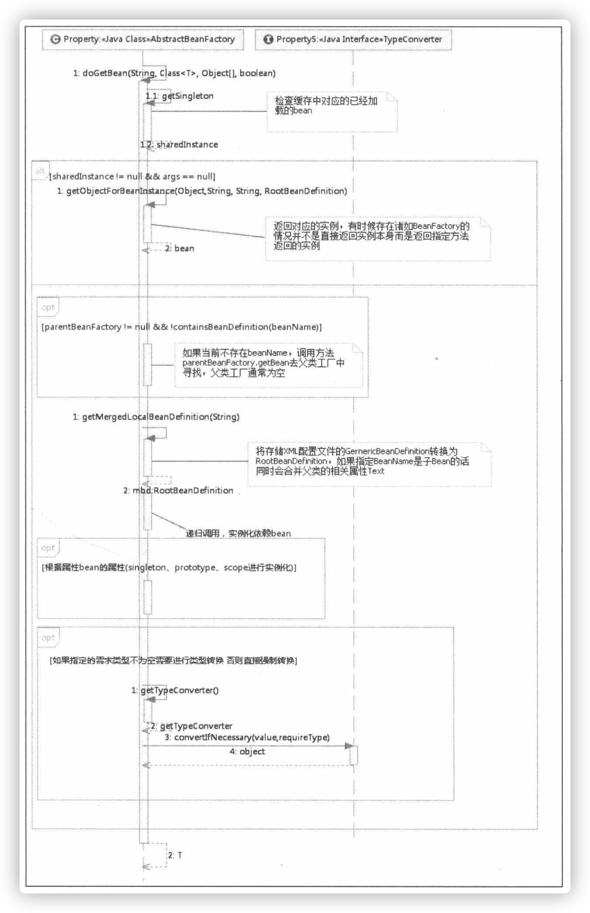

上述代码步骤：

1. **转换对应`beanName`**

   `beanName`可能是别名，也可能是`FactoryBean`，所以需要进行一系列的解析。包括：

   * 去除`FactoryBean`的修饰符。

     > ​	如name="&aa"，那么首先会去除&而使name="aa"。
     >
     > ​	"&aa"中的&表示一个`FactoryBean`。

   * 取指定`alias`所表示的最终`beanName`。

     > 如别名A指向名称为B的bean则返回B；若别名A指向别名B，别名B又指向名称C的bean则返回C。

2. **尝试从缓存中加载单例**

   ​	单例在`Spring`的同一个容器中只会被创建一次，后续再获取`bean`，就直接从单例缓存中获取了。

   > ​	这里也只是尝试加载，首先尝试从缓存中加载，如果加载不成功则再次尝试从`singletonFactories`中加载。因为在创建单例`bean`的时候会存在依赖注入的情况，而在创建依赖时为了避免循环依赖，**在`Spring`中创建`bean`的原则是不等`bean`创建完成就会将创建`bean`的`ObjectFactory`提早曝光加入到缓存中，一旦下一个`bean`创建时候需要依赖上一个`bean`则直接使用`ObjectFactory`。**

3. **`bean`的实例化**

   ​	如果从缓存中得到了`bean`的原始状态，则需要对`bean`进行实例化。特别的，缓存中记录的只是最原始的`bean`状态，并不一定是最终想要的`bean`。

   > ​	example：假如需要对工厂`bean`进行处理，那么这里得到的其实是工厂`bean`的初始状态，但是真正需要的是工厂`bean`中定义的`factory-method`方法中返回的`bean`，而`getObjectForBeanInstance`就是完成这个工作的。

4. **原型模式的依赖检查**

   ​	只有在单例模式下才会尝试解决循环依赖，原型模式情况下，如果存在A中有B的属性，B中有A中的属性，那么当A还未创建完的时候因为对于B的创建再次返回创建A，造成循环依赖，也就是`if (isPrototypeCurrentlyInCreation(beanName))`为`true`。

5. **检测`parentBeanFatory`**

   ​	从代码上看，如果缓存中没有数据的话就直接到父类工厂上去加载。条件是`if (parentBeanFactory != null && !containsBeanDefinition(beanName))`，其中`!containsBeanDefinition(beanName)`

   是在检测如果当前加载的`XML`配置文件中不包含`beanName`所对应的配置，就只能到`parentBeanFactory`去尝试下了，然后再去递归的调用`getBean`方法。

6. **将存储`XML`配置文件的`GernericBeanDefinition`转换为`RootBeanDefinition`**

   ​	因为从`XML`配置文件中读取到的`bean`信息是存储在`GernericBeanDefinition`中的，**但是所有的`bean`后续处理都是针对于`RootBeanDefinition`的，所以这里需要一个转换，转换的同时如果父类`bean`不为空的话，则会一并合并父类的属性。**

7. **寻找依赖**

   ​	因为`bean`的初始化过程中很可能会用到某些属性，而某些属性很可能是动态配置的，并且配置成依赖与其他的`bean`，那么**这个时候就有必要先加载依赖的`bean`，所以，在`Spring`的加载顺序中，在初始化某一个`bean`的时候首先会初始化这个`bean`所对应的依赖。

8. **针对不同的`scope`进行`bean`的创建**

   ​	在`Spring`中存在着许多不同的`scope`，其中默认是`singleton`，但是还是有些其他的配置，例如`prototype`、`request`之类。在这个步骤中，**`Spring`会根据不同配置进行不同的初始化策略。**

9. **类型转换**

   ​	此时，返回`bean`后基本结束了，通常对该方法的调用参数`requireType`是为空的，但是可能存在这样的情况，返回的`bean`是一个`String`，但是`requireType`却传入一个`Integer`类型，那么这时候本步骤就起作用了，**它的功能是将返回的`bean`转换为`requireType`所指定的类型。**

   > ​	此处是将`String`转`Integer`，也可以自定义转换机制。

## `FactoryBean`的使用

​	**一般情况下，`Spring`通过反射机制利用`bean`的`class`属性指定实现类来实例化`bean`。**在某些情况下，实例化`bean`的过程比较复杂，如果按照传统的方式则需要在`<bean>`中提供大量的配置信息，配置方式的灵活性是受限的，这是采用编码的方式可能会得到一个简单的方案。

​	**`Spring`为此提供了一个`org.Springframework.bean.FactoryBean`的工厂类接口，用户可以通过实现该接口定制化实例`bean`的逻辑。**

**`FactoryBean`:**

```java
public interface FactoryBean<T> {
   @Nullable
  /**
  	返回由FactoryBean创建的bean实例，如果isSingleton()返回true，
  	则该实例会放到Spring容器中单实例缓存池中
  **/
   T getObject() throws Exception;
  
   @Nullable
  // 返回FactoryBean创建的bean类型
   Class<?> getObjectType();
  
  // 判断FactoryBean创建的bean实例的作用域是singleton还是prototype
   default boolean isSingleton() {
      return true;
   }

}
```

当配置文件中`<bean>`的`class`属性配置的实现类是`FactoryBean`时，**通过`getBean()`方法返回的不是`FatoryBean`本身，而是`FactoryBean#getObject()`方法所返回的对象，相当于`FactoryBean#getObject()`代理了`getBean()`方法。**

example：

```java
public class Car {
  private int maxSpeed;
  private String brand;
  private double price;
  // getter & setter
}
```

如果使用传统方式配置的话，每一个属性对应一个`property`属性。

使用`FactoryBean`的方式实现的就会灵活一些，如，使用自定义使用分割符来切分属性：

```java
public class CarFactoryBean implements FactoryBean<Car> {
  private String carInfo;
  public Car getObject() throws Exception {
    Car car = new Car();
    String infos = carInfo.split(",");
    car.setBrand(infos[0]);
    car.setMaxSpeed(infos[1]);
    car.setPrice(infos[2]);
    return car;
  }
  public void setCarInfo(String carInfo) {
    this.carInfo = carInfo;
  } 
  // e.g
}
```

那么，就可以在配置文件中使用自定义的配置方式配置`Car Bean`了：

```xml
<bean id="car", class="com.test.factorybean.CarFactoryBean" carInfo="car1,100,200"/>
```

当调用`getBean("car")`时，`Spring`通过反射机制发现`CarFactoryBean`实现了`FactoryBean`的接口，**这时`Spring`容器就调用接口方法`CarFactoryBean#getObject()`方法返回。如果希望获取`CarFactoryBean`的实例，则可以使用`getBean("&car")`，加上一个`&`即可。**


## 缓存中获取单例`bean`

单例在`Spring`的同一个容器中只会被创建一次，后续再获取`bean`，就直接从单例缓存中获取了。

> ​	这里也只是尝试加载，首先尝试从缓存中加载，如果加载不成功则再次尝试从`singletonFactories`中加载。因为在创建单例`bean`的时候会存在依赖注入的情况，而在创建依赖时为了避免循环依赖，**在`Spring`中创建`bean`的原则是不等`bean`创建完成就会将创建`bean`的`ObjectFactory`提早曝光加入到缓存中，一旦下一个`bean`创建时候需要依赖上一个`bean`则直接使用`ObjectFactory`。**

**`DefaultSingletonBeanRegistry.getSingleton()`:**

```java
public Object getSingleton(String beanName) {
  // true设置表示运行早期依赖
   return getSingleton(beanName, true);
}
```

```java
protected Object getSingleton(String beanName, boolean allowEarlyReference) {
  // 检查缓存中时候存在实例
   Object singletonObject = this.singletonObjects.get(beanName);
   if (singletonObject == null && isSingletonCurrentlyInCreation(beanName)) {
     // 如果为空，则锁定全局变量进行处理
      synchronized (this.singletonObjects) {
        // 如果此bean正在加载则不处理
         singletonObject = this.earlySingletonObjects.get(beanName);
         if (singletonObject == null && allowEarlyReference) {
           /**
           	当某些方法需要提前初始化的时候则会调用addSingletonFactory方法
           	将对应的ObjectFactory初始化策略存储在singleTonFaactories
           **/
            ObjectFactory<?> singletonFactory = this.singletonFactories.get(beanName);
            if (singletonFactory != null) {
              // 调用预先设定的getObject方法
               singletonObject = singletonFactory.getObject();
              // 记录在缓存中，earlySingletonObjects与singletonFactories互斥
               this.earlySingletonObjects.put(beanName, singletonObject);
               this.singletonFactories.remove(beanName);
            }
         }
      }
   }
   return singletonObject;
}
```

* **`singltonFactories`：**单例对象工厂的缓存。

* **`earlySingletonObjects`：**提前曝光的单例对象的缓存。

  > ​	还不能完全实例完成的对象。一个对象A依赖对象B，B又依赖于A，但是它们都有自己的无参构造方法，那么可以先用无参构造方法实例化A，但此时A时不完整的，那么它就是提前曝光的对象。（虽然它不完整，但是可以用作B的完整的构造，然后再用B来使A完整）。

* **`singletonObjects`：**单例对象的缓存。

* **`registeredSingletons`：**用来保存当前所有已注册的`bean`。

1. ​	首先尝试从`singletonObjects`里面获取实例，如果获取不到再从`earlySingletonObjects`里面获取，如果还是获取不到，再尝试从`singleFactories`里面获取`beanName`对应的`Objectfactory`，然后调用这个`ObjectFactory`的`getObject`来创建`bean`，并放到`earlySingletonObjects`里面去，并且从`singletonFactories`里面`remove`掉这个`ObjectFactory`。
2.    而后续的所有操作都只是为了循环依赖检测时候使用，也就是`allowEarlyReference`为`true`的情况下才会使用。

### 从`bean`的实例中获取对象

​	在`getBean`方法中，`getObjectForBeanInstance`是一个高频率使用的方法，无论是从缓存中获取`bean`还是根据不同的`scope`策略加载`bean`。总之，得到`bean`实例后要做的第一件事就是**调用这个方法来检测一下正确性**，其实就是用于检测当前`bean`是否是`FactoryBean`类型的`bean`，如果是，那么需要调用该`bean`对应的`FactoryBean`实例中的`getObject()`作为返回值。

> ​	 无论是缓存中获得的`bean`还是通过不同`scope`策略加载的`bean`都只是最原始的`bean`状态，并不一定是最终想要的`bean`。
>
> example：假如需要对工厂`bean`进行处理，那么这里得到的其实是工厂`bean`的初始状态，但是真正需要的是工厂`bean`中定义的`factory-method`方法中返回的`bean`，而`getObjectForBeanInstance`就是完成这个工作的。

**`AbstractBeanFactory.getObjectForBeanInstance()`:**

1. 对`FactoryBean`正确性的验证。
2. 对非`FactoryBean`不做任何处理。
3. 对`bean`进行转换。
4. 将从`Factory`中解析的工作委托给`getObjectFromFactoryBean`。

```java
protected Object getObjectForBeanInstance(
      Object beanInstance, String name, String beanName, @Nullable RootBeanDefinition mbd) {

   // Don't let calling code try to dereference the factory if the bean isn't a factory.
   if (BeanFactoryUtils.isFactoryDereference(name)) {
      if (beanInstance instanceof NullBean) {
         return beanInstance;
      }
     // 如果指定的name使工厂相关(以&为前缀)且beanInstance不是FactoryBean类型则验证不通过
      if (!(beanInstance instanceof FactoryBean)) {
         throw new BeanIsNotAFactoryException(beanName, beanInstance.getClass());
      }
   }

   // Now we have the bean instance, which may be a normal bean or a FactoryBean.
   // If it's a FactoryBean, we use it to create a bean instance, unless the
   // caller actually wants a reference to the factory.
  /**
  	现在有了一个bean的实例，这个实例可能会是正常的bean或者FactoryBean
  	如果是FactoryBean那么使用它创建实例，但是如果用户想要直接获取工厂的实例而不是工厂
  	那么getObject方法对应的实例那么name应该加入前缀&
  **/
   if (!(beanInstance instanceof FactoryBean) || BeanFactoryUtils.isFactoryDereference(name)) {
      return beanInstance;
   }

  // 加载FactoryBean
   Object object = null;
   if (mbd == null) {
     // 尝试从缓存中加载bean
      object = getCachedObjectForFactoryBean(beanName);
   }
   if (object == null) {
      // Return bean instance from factory.
     // 到这里已经明确知道beanInstance一定是FactoryBean类型
      FactoryBean<?> factory = (FactoryBean<?>) beanInstance;
      // Caches object obtained from FactoryBean if it is a singleton.
     // 检测beanDefinitionMap也就是已经加载的类中检测是否定义beanName
      if (mbd == null && containsBeanDefinition(beanName)) {
        /**
        	将存储XML配置文件的GernericBeanDefinition转换为RootBeanDefinition，
        	如果指定BeanName是子Bean的话同时会合并父类相关属性
        **/
         mbd = getMergedLocalBeanDefinition(beanName);
      }
     // 是否是用户定义的而不是应用程序本身定义的
      boolean synthetic = (mbd != null && mbd.isSynthetic());
      object = getObjectFromFactoryBean(factory, beanName, !synthetic);
   }
   return object;
}
```

这个方法并没有什么重要的信息，大多是些辅助代码以及一些功能性的判断，而真正的核心却委托给了`getObjectFromFactoryBean`。

**`FactoryBeanRegistrySuppoort.getObjectFromFactoryBean()`:**

```java
protected Object getObjectFromFactoryBean(FactoryBean<?> factory, String beanName, boolean shouldPostProcess) {
  // 如果是单例模式
   if (factory.isSingleton() && containsSingleton(beanName)) {
      synchronized (getSingletonMutex()) {
         Object object = this.factoryBeanObjectCache.get(beanName);
         if (object == null) {
            object = doGetObjectFromFactoryBean(factory, beanName);
            // Only post-process and store if not put there already during getObject() call above
            // (e.g. because of circular reference processing triggered by custom getBean calls)
            Object alreadyThere = this.factoryBeanObjectCache.get(beanName);
            if (alreadyThere != null) {
               object = alreadyThere;
            }
            else {
               if (shouldPostProcess) {
                  if (isSingletonCurrentlyInCreation(beanName)) {
                     // Temporarily return non-post-processed object, not storing it yet..
                     return object;
                  }
                  beforeSingletonCreation(beanName);
                  try {
                     object = postProcessObjectFromFactoryBean(object, beanName);
                  }
                  catch (Throwable ex) {
                     throw new BeanCreationException(beanName,
                           "Post-processing of FactoryBean's singleton object failed", ex);
                  }
                  finally {
                     afterSingletonCreation(beanName);
                  }
               }
               if (containsSingleton(beanName)) {
                  this.factoryBeanObjectCache.put(beanName, object);
               }
            }
         }
         return object;
      }
   }
   else {
      Object object = doGetObjectFromFactoryBean(factory, beanName);
      if (shouldPostProcess) {
         try {
           // 调用ObjectFactory的后处理器
            object = postProcessObjectFromFactoryBean(object, beanName);
         }
         catch (Throwable ex) {
            throw new BeanCreationException(beanName, "Post-processing of FactoryBean's object failed", ex);
         }
      }
      return object;
   }
}
```

在这个方法中只做了一件事，就是返回的`bean`如果是单例，那就必须保证全局唯一，同时，也因为是单例的，所以不必重复创建，可以使用缓存来提高性能。

**`FactoryBeanRegistrySupport.doGetObjectFromFactoryBean()`:**

```java
private Object doGetObjectFromFactoryBean(FactoryBean<?> factory, String beanName) throws BeanCreationException {
   Object object;
   try {
     // 需要权限验证
      if (System.getSecurityManager() != null) {
         AccessControlContext acc = getAccessControlContext();
         try {
            object = AccessController.doPrivileged((PrivilegedExceptionAction<Object>) factory::getObject, acc);
         }
         catch (PrivilegedActionException pae) {
            throw pae.getException();
         }
      }
      else {
        // 直接调用getObject方法
         object = factory.getObject();
      }
   }
   catch (FactoryBeanNotInitializedException ex) {
      throw new BeanCurrentlyInCreationException(beanName, ex.toString());
   }
   catch (Throwable ex) {
      throw new BeanCreationException(beanName, "FactoryBean threw exception on object creation", ex);
   }

   // Do not accept a null value for a FactoryBean that's not fully
   // initialized yet: Many FactoryBeans just return null then.
   if (object == null) {
      if (isSingletonCurrentlyInCreation(beanName)) {
         throw new BeanCurrentlyInCreationException(
               beanName, "FactoryBean which is currently in creation returned null from getObject");
      }
      object = new NullBean();
   }
   return object;
}
```

​	上述代码做的是：如果`bean`声明为`FactoryBean`类型，则当提取`bean`时提取的并不是`FactoryBean`，而是`FactoryBean`中对应的`getObject`方法返回的`bean`，而`doGetObjectFromFactoryBean`正式实现这个功能的。

在获取到`object`后，方法并没有直接返回，而是：

**`FactoryBeanRegistrySupport.postProcessObjectFromFactoryBean()`:**

```java
protected Object postProcessObjectFromFactoryBean(Object object, String beanName) throws BeansException {
   return object;
}
```

在其子类中被重写：

**`AbstractAutowireCapableBeanFactor.postProcessObjectFromFactoryBean()`:**

```java
protected Object postProcessObjectFromFactoryBean(Object object, String beanName) {
   return applyBeanPostProcessorsAfterInitialization(object, beanName);
}
```

**`AbstractAutowireCapableBeanFactor.applyBeanPostProcessorsAfterInitialization()`:**

```java
public Object applyBeanPostProcessorsAfterInitialization(Object existingBean, String beanName)
      throws BeansException {

   Object result = existingBean;
   for (BeanPostProcessor processor : getBeanPostProcessors()) {
      Object current = processor.postProcessAfterInitialization(result, beanName);
      if (current == null) {
         return result;
      }
      result = current;
   }
   return result;
}
```

后处理器的目的是：**尽可能保证所有`bean`初始化后都会调用注册的`BeanPostProcessor`的`postProcessAfterInitialization()`方法进行处理，在实际开发过程中大可以针对此特性设计自己的业务逻辑。**


## 获取单例

​	如果缓存中不存在已经加载的单例`bean`就需要从头开始`bean`的加载过程了，而`Spring`中使用`getSingleton`的重载方法实现`bean`的加载过程。

**`DefaultSingletonBeanRegistry.getSingleton()`:**

```java
public Object getSingleton(String beanName, ObjectFactory<?> singletonFactory) {
		Assert.notNull(beanName, "Bean name must not be null");
  	// 全局变量需要同步
		synchronized (this.singletonObjects) {
      /**
  			首先检查对应的bean是否已经加载过了，因为singleton模式其实就是复用以创建的bean
  			所以这一步必须的
  		**/
			Object singletonObject = this.singletonObjects.get(beanName);
      // 如果为空才可以进行singleton的bean的初始化
			if (singletonObject == null) {
				if (this.singletonsCurrentlyInDestruction) {
					throw new BeanCreationNotAllowedException(beanName,
							"Singleton bean creation not allowed while singletons of this factory are in destruction " +
							"(Do not request a bean from a BeanFactory in a destroy method implementation!)");
				}
				if (logger.isDebugEnabled()) {
					logger.debug("Creating shared instance of singleton bean '" + beanName + "'");
				}
				beforeSingletonCreation(beanName);
				boolean newSingleton = false;
				boolean recordSuppressedExceptions = (this.suppressedExceptions == null);
				if (recordSuppressedExceptions) {
					this.suppressedExceptions = new LinkedHashSet<>();
				}
				try {
          // 初始化bean
					singletonObject = singletonFactory.getObject();
					newSingleton = true;
				}
				catch (IllegalStateException ex) {
					// Has the singleton object implicitly appeared in the meantime ->
					// if yes, proceed with it since the exception indicates that state.
					singletonObject = this.singletonObjects.get(beanName);
					if (singletonObject == null) {
						throw ex;
					}
				}
				catch (BeanCreationException ex) {
					if (recordSuppressedExceptions) {
						for (Exception suppressedException : this.suppressedExceptions) {
							ex.addRelatedCause(suppressedException);
						}
					}
					throw ex;
				}
				finally {
					if (recordSuppressedExceptions) {
						this.suppressedExceptions = null;
					}
					afterSingletonCreation(beanName);
				}
				if (newSingleton) {
          // 加入缓存
					addSingleton(beanName, singletonObject);
				}
			}
			return singletonObject;
		}
	}
```

​	上述代码使用了回调方法，使得程序可以在单例创建的前后做一些准备及处理操作，而真正的获得单例`bean`的方法并不是在此方法中实现的，实现逻辑是在`ObjectFactory`类型的实例`singletonFactory`中实现的。

这些准备和操作是：

1. 检查缓存是否已经加载过。

2. 若没有加载，则记录`beanName`的正在加载状态。

3. 加载单例前记录记载状态。

   **`DefaultSingletonBeanRegistry.beforeSingletonCreation()`:**

   ```java
   protected void beforeSingletonCreation(String beanName) {
     // this.singletonsCurrentlyInCreation.add(beanName)记录beanName在缓存中
      if (!this.inCreationCheckExclusions.contains(beanName) && !this.singletonsCurrentlyInCreation.add(beanName)) {
         throw new BeanCurrentlyInCreationException(beanName);
      }
   }
   ```

4. 通过调用参数传入的`ObjectFactory`的个体`Object`方法实例化`bean`。

5. 加载单例后的处理方法调用。

   类似step 3

   **`DefaultSingletonBeanRegistry.afterSingletonCreation()`:**

   ```java
   protected void afterSingletonCreation(String beanName) {
      if (!this.inCreationCheckExclusions.contains(beanName) && !this.singletonsCurrentlyInCreation.remove(beanName)) {
         throw new IllegalStateException("Singleton '" + beanName + "' isn't currently in creation");
      }
   }
   ```

6. 将结果记录至缓存并删除加载`bean`过程中所记录的各种辅助状态。

   **`DefaultSingletonBeanRegistry.addSingleton()`:**

   ```java
   protected void addSingleton(String beanName, Object singletonObject) {
      synchronized (this.singletonObjects) {
         this.singletonObjects.put(beanName, singletonObject);
         this.singletonFactories.remove(beanName);
         this.earlySingletonObjects.remove(beanName);
         this.registeredSingletons.add(beanName);
      }
   }
   ```

7. 返回处理结果。

   `bean`的加载逻辑其实是在传入的`ObjectFactory`类型的参数`singletonFactory`中定义的。

   **在`AbstractBeanFactory.doGetBean()`方法中：**

   ```java
   sharedInstance = getSingleton(beanName, () -> {
      try {
         return createBean(beanName, mbd, args);
      }
      catch (BeansException ex) {
         // Explicitly remove instance from singleton cache: It might have been put there
         // eagerly by the creation process, to allow for circular reference resolution.
         // Also remove any beans that received a temporary reference to the bean.
         destroySingleton(beanName);
         throw ex;
      }
   });
   ```


## 准备创建`bean`

**`AbstractAutowireCapableBeanFactory.craeteBean()`:**

```java
protected Object createBean(String beanName, RootBeanDefinition mbd, @Nullable Object[] args)
      throws BeanCreationException {

   if (logger.isDebugEnabled()) {
      logger.debug("Creating instance of bean '" + beanName + "'");
   }
   RootBeanDefinition mbdToUse = mbd;

   // Make sure bean class is actually resolved at this point, and
   // clone the bean definition in case of a dynamically resolved Class
   // which cannot be stored in the shared merged bean definition.
  // 锁定class，根据设置的class属性或者根据className来解析Class
   Class<?> resolvedClass = resolveBeanClass(mbd, beanName);
   if (resolvedClass != null && !mbd.hasBeanClass() && mbd.getBeanClassName() != null) {
      mbdToUse = new RootBeanDefinition(mbd);
      mbdToUse.setBeanClass(resolvedClass);
   }

   // Prepare method overrides.
   try {
     // 验证及准备覆盖的方法
      mbdToUse.prepareMethodOverrides();
   }
   catch (BeanDefinitionValidationException ex) {
      throw new BeanDefinitionStoreException(mbdToUse.getResourceDescription(),
            beanName, "Validation of method overrides failed", ex);
   }

   try {
      // Give BeanPostProcessors a chance to return a proxy instead of the target bean instance.
     // 给BeanPostProcessors一个机会来返回代理来替代真正的实例
      Object bean = resolveBeforeInstantiation(beanName, mbdToUse);
      if (bean != null) {
         return bean;
      }
   }
   catch (Throwable ex) {
      throw new BeanCreationException(mbdToUse.getResourceDescription(), beanName,
            "BeanPostProcessor before instantiation of bean failed", ex);
   }

   try {
      Object beanInstance = doCreateBean(beanName, mbdToUse, args);
      if (logger.isDebugEnabled()) {
         logger.debug("Finished creating instance of bean '" + beanName + "'");
      }
      return beanInstance;
   }
   catch (BeanCreationException | ImplicitlyAppearedSingletonException ex) {
      // A previously detected exception with proper bean creation context already,
      // or illegal singleton state to be communicated up to DefaultSingletonBeanRegistry.
      throw ex;
   }
   catch (Throwable ex) {
      throw new BeanCreationException(
            mbdToUse.getResourceDescription(), beanName, "Unexpected exception during bean creation", ex);
   }
}
```

具体步骤：

1. 根据设置的`class`属性或者根据`className`来解析`Class`。

2. 对`override`属性进行标记及验证。

   > ​	`Spring`的配置里，根本没有`override-method`之类的配置，但是存在`lookup-method`和`replace-method`，而这两个配置的加载其实是将配置统一存放在**`BeanDefinition`中的`methodOverrides`属性里，这个函数就是针对这两个配置的。**

3. 应用初始化前的后处理器，解析指定`bean`是否存在初始化前的短路操作。

4. 创建`bean`。

### 处理`override`属性

**`AbstractBeanDefinition.prepareMethodOverrides()`:**

```java
public void prepareMethodOverrides() throws BeanDefinitionValidationException {
   // Check that lookup methods exist and determine their overloaded status.
   if (hasMethodOverrides()) {
      getMethodOverrides().getOverrides().forEach(this::prepareMethodOverride);
   }
}
```

**`AbstractBeanDefinition.prepareMethodOverride()`:**

```java
protected void prepareMethodOverride(MethodOverride mo) throws BeanDefinitionValidationException {
  // 获取对应类中对应方法名的个数
   int count = ClassUtils.getMethodCountForName(getBeanClass(), mo.getMethodName());
   if (count == 0) {
      throw new BeanDefinitionValidationException(
            "Invalid method override: no method with name '" + mo.getMethodName() +
            "' on class [" + getBeanClassName() + "]");
   }
   else if (count == 1) {
      // Mark override as not overloaded, to avoid the overhead of arg type checking.
     // 标记MethodOverride暂未被覆盖，避免参数类型检查的开销
      mo.setOverloaded(false);
   }
}
```

在`Spring`配置中存在`lookup-method`和`replace-method`两个配置功能，而这两个配置的加载其实是将配置统一存放在`BeanDefinition`中的`methodOverrides`属性中，原理是：**在`bean`实例化的时候如果检测到存在`methodOverrides`属性，会动态地为当前`bean`生成代理并使用对应的拦截器为`bean`做增强处理。**

对于方法的匹配来讲，**如果一个类中存在若干个重载方法，那么在函数调用及增强的时候还需要根据参数类型进行匹配，来最终确认当前调用的是哪个函数。**但是，`Spring`将一部分匹配工作在这里完成了，**如果当前类中的方法只有一个，而不需要进行方法的参数匹配验证，而且还可以提前对方法存在下进行验证。**


### 实例化的前置处理

​	在调用`doCreate`方法创建`bean`的实例前，还调用了`resolveBeforeInstantiation`对`BeanDefinition`中的属性做些前置处理。

```java
Object bean = resolveBeforeInstantiation(beanName, mbdToUse);
			/**
				短路判断
				当经过前置处理后返回的结果不为空，那么会直接略过后续的bean的创建而直接返回结果 flag？
				熟知的AOP功能就是这里判断的
			**/
			if (bean != null) {
				return bean;
			}
```

**`AbstractAutowireCapableBeanFactory.resolveBeforInstantiation()`:**

```java
protected Object resolveBeforeInstantiation(String beanName, RootBeanDefinition mbd) {
   Object bean = null;
  // 如果尚未被解析
   if (!Boolean.FALSE.equals(mbd.beforeInstantiationResolved)) {
      // Make sure bean class is actually resolved at this point.
      if (!mbd.isSynthetic() && hasInstantiationAwareBeanPostProcessors()) {
         Class<?> targetType = determineTargetType(beanName, mbd);
         if (targetType != null) {
            bean = applyBeanPostProcessorsBeforeInstantiation(targetType, beanName);
            if (bean != null) {
               bean = applyBeanPostProcessorsAfterInitialization(bean, beanName);
            }
         }
      }
      mbd.beforeInstantiationResolved = (bean != null);
   }
   return bean;
}
```

`applyBeanPostProcessorsBeforeInstantiation`与`applyBeanPostProcessorsAfterInitialization`这两个方法实现比较简单，是对后处理器中所有`InstantiationAwareBeanPostProcessor`类型的后处理器进行`postProcessBeforeInstantiation`方法和`BeanPostProcessor`的`postProcessAfterInitialization`方法的调用。

#### 实例化前的后处理器应用

​	`bean`的实例化前调用，将`AbstractBeanDefinition`转换为**`BeanWrapper`**前的处理。给子类一个修改`BeanDefinition`的机会，也就是说**当程序经过这个方法后，`bean`可能以及不是我们认为的`bean`了，或许成为了一个经过处理的代理`bean`。** *可能是通过`cglib`生成，或者其他技术生成。*

**`AbstractAutowireCapableBeanFactory.applyBeanPostProcessorsBeforeInstantiation()`:**

```java
protected Object applyBeanPostProcessorsBeforeInstantiation(Class<?> beanClass, String beanName) {
   for (BeanPostProcessor bp : getBeanPostProcessors()) {
      if (bp instanceof InstantiationAwareBeanPostProcessor) {
         InstantiationAwareBeanPostProcessor ibp = (InstantiationAwareBeanPostProcessor) bp;
         Object result = ibp.postProcessBeforeInstantiation(beanClass, beanName);
         if (result != null) {
            return result;
         }
      }
   }
   return null;
}
```


#### 实例化后的后处理器

`Spring`中的规则是**在`bean`的初始化后尽可能保证将注册的后处理器的`postProcessAfterInitialization`方法应用到该`bean`中，因为如果返回的`bean`不为空，那么便不会再次经历普通`bean`的创建过程，所以只能在这里应用后处理器的`postProcessAfterInitialization`方法。**

**`AbstractAutowireCapableBeanFactory.applyBeanPostProcessorsAfterInstantiation()`:**

```java
public Object applyBeanPostProcessorsAfterInitialization(Object existingBean, String beanName)
      throws BeansException {

   Object result = existingBean;
   for (BeanPostProcessor processor : getBeanPostProcessors()) {
      Object current = processor.postProcessAfterInitialization(result, beanName);
      if (current == null) {
         return result;
      }
      result = current;
   }
   return result;
}
```


## 循环依赖

​	**循环依赖就是循环引用，就是两个或多个`bean`相互之间的持有对方。**

> ​	example：	`CircleA`引用`CircleB`，`CircleB`引用`CircleC`，`CircleC`引用`CircleA`，最终它们反映为一个环。


### `Spring`的处理方法

​	以上面的例子来说，`Spring`三种循环依赖的情况。

#### 构造器循环依赖

​	表示通过构造器注入构成的循环依赖，**此种依赖是无法解决的只能抛出`BeanCurrentlyInCreationException`异常表示循环依赖。**

`Spring`容器将每一个正在创建的`bean`标识符放在一个**当前创建`bean`池**中，`bean`标识符在创建过程中将一直保持在这个池中，因此如果在创建`bean`过程中发现自己已经在**当前创建`bean`池**中时，将抛出`BeanCurrentlyInCreationException`异常表示循环依赖。

> ​	以上面例子来说：
>
> * ​	`Spring`容器创建A，首先去**当前创建`bean`池**中查找是否当前`bean`正在创建，如果没发现，则继续准备需要的构造器参数B，并将A标识符放到**当前创建`bean`池**。
> *   `Spring`容器创建B，首先去**当前创建`bean`池**中查找是否当前`bean`正在创建，如果没发现，则继续准备需要的构造器参数C，并将B标识符放到**当前创建`bean`池**。
> *  ` Spring`容器创建C，首先去**当前创建`bean`池**中查找是否当前`bean`正在创建，如果没发现，则继续准备需要的构造器参数A，并将A标识符放到**当前创建`bean`池**。
> * 到此为止`Spring`容器要去创建A，发现该`bean`标识符在**当前创建`bean`池**中，因为表示循环依赖所以抛出`BeanCurrentlyInCreationException`。


#### `setter`循环依赖

​	表示通过`setter`注入方式构成的循环依赖。对于`setter`注入造成的依赖是通过`Spring`容器**提前暴露**刚完成构造器注入但未完成其他步骤（如`setter`注入）的`bean`来完成的，而且只能解决**单例作用域的`bean`循环依赖**。通过提前暴露一个**单例工厂**方法，从而使其他`bean`能引用到该`bean`。

```java
addSingletonFactory(beanName, new ObjectFactory) {
  public Object getObject() throws BeanException {
    return getEarlyBeanReference(beanName, mbd, bean);
  }
};
```

> * `Spring`容器创建单例A，首先根据无参构造器创建`bean`，并暴露一个`ObjectFactory`用于返回一个提前暴露一个创建中的`bean`，并将A标识符放入**当前创建`bean`池**，然后进行`setter`注入B。
> * `Spring`容器创建单例B，首先根据无参构造器创建`bean`，并暴露一个`ObjectFactory`用于返回一个提前暴露一个创建中的`bean`，并将B标识符放入**当前创建`bean`池**，然后进进行`setter`注入C。
> * `Spring`容器创建单例C，首先根据无参构造器创建`bean`，并暴露一个`ObjectFactory`用于返回一个提前暴露一个创建中的`bean`，并将C标识符放入**当前创建`bean`池**，然后进进行`setter`注入A。进行A的注入时，由于A提前暴露了`ObjectFactory`工厂，从而使用它返回提前暴露了的创建中的`bean`。
> * 最后在依赖注入进B、A，完成`setter`注入。


#### `prototype`范围的依赖处理

​	对于`prototype`作用域`bean`，`Spring`容器无法完成依赖注入，因为`Spring`容器不进行缓存`propotytpe`作用域的`bean`，因此无法提前暴露一个创建中的`bean`。

对于`singleton`作用域`bean`，可以通过`setAlloCircularReferences(false);`来禁用循环依赖引用。


## 创建`bean`

​	当经历过`resolveBeforeInstantiation`方法后，程序有两个选择：

1. 如果创建了代理或者说重写了`InstantiationAwareBeanPostProcessor`的`postProcessorBeforeInstantiation`方法，并在方法中改变了`bean`，则可以直接返回。
2. 否则需要进行常规`bean`的创建。而这常规`bean`的创建就是在`doCreateBean`中完成。

**`AbstractAutowireCapableBeanFactory.doCreateBean()`:**

```java
protected Object doCreateBean(String beanName, RootBeanDefinition mbd, @Nullable Object[] args)
      throws BeanCreationException {

   // Instantiate the bean.
   BeanWrapper instanceWrapper = null;
   if (mbd.isSingleton()) {
      instanceWrapper = this.factoryBeanInstanceCache.remove(beanName);
   }
   if (instanceWrapper == null) {
     // 根据指定bean使用对于的策略创建新的实例，如：工厂方法、构造函数自动注入、简单初始化
      instanceWrapper = createBeanInstance(beanName, mbd, args);
   }
   Object bean = instanceWrapper.getWrappedInstance();
   Class<?> beanType = instanceWrapper.getWrappedClass();
   if (beanType != NullBean.class) {
      mbd.resolvedTargetType = beanType;
   }

   // Allow post-processors to modify the merged bean definition.
   synchronized (mbd.postProcessingLock) {
      if (!mbd.postProcessed) {
         try {
           // 应用MergedBeanDefinitionPostProcessor
            applyMergedBeanDefinitionPostProcessors(mbd, beanType, beanName);
         }
         catch (Throwable ex) {
            throw new BeanCreationException(mbd.getResourceDescription(), beanName,
                  "Post-processing of merged bean definition failed", ex);
         }
         mbd.postProcessed = true;
      }
   }

   // Eagerly cache singletons to be able to resolve circular references
   // even when triggered by lifecycle interfaces like BeanFactoryAware.
  /**
  	是否需要提前曝光：单例&允许循环依赖&当前bean正在创建中，检测循环依赖（Spring只允许单例的循环依赖）
  **/
   boolean earlySingletonExposure = (mbd.isSingleton() && this.allowCircularReferences &&
         isSingletonCurrentlyInCreation(beanName));
   if (earlySingletonExposure) {
      if (logger.isDebugEnabled()) {
         logger.debug("Eagerly caching bean '" + beanName +
               "' to allow for resolving potential circular references");
      }
     // 为避免后期循环依赖，可以在bean初始化完成前将创建实例的ObjectFactory加入工厂
     /**
     	 对bean再一次依赖引用，主要应用SmartInstantiationAwareBeanPostProcessor
     	 其中AOP就是在这里见哈advice动态织入bean中，若没有则直接返回bean，不做任何处理
     **/
      addSingletonFactory(beanName, () -> getEarlyBeanReference(beanName, mbd, bean));
   }

   // Initialize the bean instance.
   Object exposedObject = bean;
   try {
     // 对bean进行填充，将各个属性知注入，其中，可能存在依赖于其他bean的属性，则会递归初始化依赖bean
      populateBean(beanName, mbd, instanceWrapper);
     // 调用初始化方法，比如：init-method
      exposedObject = initializeBean(beanName, exposedObject, mbd);
   }
   catch (Throwable ex) {
      if (ex instanceof BeanCreationException && beanName.equals(((BeanCreationException) ex).getBeanName())) {
         throw (BeanCreationException) ex;
      }
      else {
         throw new BeanCreationException(
               mbd.getResourceDescription(), beanName, "Initialization of bean failed", ex);
      }
   }

   if (earlySingletonExposure) {
      Object earlySingletonReference = getSingleton(beanName, false);
     // 只有在检测到没有循环依赖的情况下才会不为空
      if (earlySingletonReference != null) {
        // 如果exposedObject没有在初始化方法中被改变，也就是没有被增强
         if (exposedObject == bean) {
            exposedObject = earlySingletonReference;
         }
         else if (!this.allowRawInjectionDespiteWrapping && hasDependentBean(beanName)) {
            String[] dependentBeans = getDependentBeans(beanName);
            Set<String> actualDependentBeans = new LinkedHashSet<>(dependentBeans.length);
            for (String dependentBean : dependentBeans) {
              // 依赖检测
               if (!removeSingletonIfCreatedForTypeCheckOnly(dependentBean)) {
                  actualDependentBeans.add(dependentBean);
               }
            }
           /**
           	因为bean创建后其所依赖的bean一定是已经创建的，actualDependentBeans不为空，
           	则表示bean创建后其依赖的bean却没有全部创建完，也就是存在循环依赖。
           **/
            if (!actualDependentBeans.isEmpty()) {
               throw new BeanCurrentlyInCreationException(beanName,
                     "Bean with name '" + beanName + "' has been injected into other beans [" +
                     StringUtils.collectionToCommaDelimitedString(actualDependentBeans) +
                     "] in its raw version as part of a circular reference, but has eventually been " +
                     "wrapped. This means that said other beans do not use the final version of the " +
                     "bean. This is often the result of over-eager type matching - consider using " +
                     "'getBeanNamesForType' with the 'allowEagerInit' flag turned off, for example.");
            }
         }
      }
   }

   // Register bean as disposable.
   try {
     // 根据scope注册bean
      registerDisposableBeanIfNecessary(beanName, bean, mbd);
   }
   catch (BeanDefinitionValidationException ex) {
      throw new BeanCreationException(
            mbd.getResourceDescription(), beanName, "Invalid destruction signature", ex);
   }

   return exposedObject;
}
```

概要思路：

1. 如果是单例则需要首先清除缓存。

2. 实例化`bean`，将`BeanDefinition`转换为`BeanWrapper`。

   * 如果存在工厂方法则使用工厂方法进行初始化。
   * 一个类有多个构造函数，每个构造函数都有不同的参数，所以需要根据参数锁定构造函数并进行初始化。
   * 如果既不存在工厂方法也不存在有参构造函数，则使用默认的构造函数进行`bean`的实例化。

3. `MergedBeanDefinitionPostProcessor`的应用。

   `bean`合并后的处理，`Autowired`注解正是通过此方法实现的与解析。

4. 依赖处理。

5. 属性填充。将所有属性填充至`bean`中。

6. 循环依赖检查。

   > ​	在`Spring`中只能解决`Singleton`的循环依赖，而对于`prototype`的`bean`，`Spring`无能为力，只能抛出异常。

7. 注册`DisposableBean`。

   > ​	如果配置了`destory-method`，这里需要注册以便于在销毁时调用。

8. 完成创建并返回。


### 创建`bean`的实例

**`AbstractAutowiredCapableBeanFactory.createBeanInstance()`:**

```java
protected BeanWrapper createBeanInstance(String beanName, RootBeanDefinition mbd, @Nullable Object[] args) {
   // Make sure bean class is actually resolved at this point.
  // 解析class
   Class<?> beanClass = resolveBeanClass(mbd, beanName);

   if (beanClass != null && !Modifier.isPublic(beanClass.getModifiers()) && !mbd.isNonPublicAccessAllowed()) {
      throw new BeanCreationException(mbd.getResourceDescription(), beanName,
            "Bean class isn't public, and non-public access not allowed: " + beanClass.getName());
   }

   Supplier<?> instanceSupplier = mbd.getInstanceSupplier();
   if (instanceSupplier != null) {
      return obtainFromSupplier(instanceSupplier, beanName);
   }

  // 如果工厂方法不为空，贼使用工厂方法初始化策略
   if (mbd.getFactoryMethodName() != null) {
      return instantiateUsingFactoryMethod(beanName, mbd, args);
   }

   // Shortcut when re-creating the same bean...
   boolean resolved = false;
   boolean autowireNecessary = false;
   if (args == null) { 
      synchronized (mbd.constructorArgumentLock) {
        /**
     			一个类有多个构造函数，每个构造函数都有不同的参数，
     			所以调用前需要先根据参数锁定构造函数或对应的工厂方法。
     		**/
         if (mbd.resolvedConstructorOrFactoryMethod != null) {
            resolved = true;
            autowireNecessary = mbd.constructorArgumentsResolved;
         }
      }
   }
  // 如果已经解析过则使用解析好的构造函数方法，不需要再次锁定
   if (resolved) {
      if (autowireNecessary) {
        // 构造函数自动注入
         return autowireConstructor(beanName, mbd, null, null);
      }
      else {
        // 使用默认构造函数构造
         return instantiateBean(beanName, mbd);
      }
   }

   // Candidate constructors for autowiring?
  // 需要根据参数解析构造函数
   Constructor<?>[] ctors = determineConstructorsFromBeanPostProcessors(beanClass, beanName);
   if (ctors != null || mbd.getResolvedAutowireMode() == AUTOWIRE_CONSTRUCTOR ||
         mbd.hasConstructorArgumentValues() || !ObjectUtils.isEmpty(args)) {
     // 构造函数自动注入
      return autowireConstructor(beanName, mbd, ctors, args);
   }

   // No special handling: simply use no-arg constructor.
  // 使用默认构造函数构造
   return instantiateBean(beanName, mbd);
}
```

实例化逻辑：

1. 如果在`RootBeanDefinition`中存在`factoryMethodName`属性，或者说在配置文件中配置了`factory-method`，那么`Spring`会尝试使用`instantiateUsingFactoryMethod(beanName, mbd, args)`方法根据`RootBeanDefinition`中的配置生成`bean`的实例。
2. **解析构造函数并进行构造函数的实例化。**因为一个`bean`对应的类中可能会有多个构造函数，而每个构造函数的参数不同，`Spring`在根据参数及类型去判断最终会使用哪个构造函数进行实例化。但是，判断的过程是个比较消耗性能的步骤，所以采用缓存机制，**如果已经解析过则不需要重复解析而是直接从`RootBeanDefinition`中的属性`resolvedConstructorOrFactoryMethod`缓存的值去取，否则需要再次解析，并将解析结果添加至`RootBeanDefinition`中的属性`resolvedConstructorOrFactoryMethod`中。**

#### `autowireConstructor`

​	`Spring`将实例的创建分成了两种情况：

1. 通用实例化。
2. 带参数的实例化。

**`AbstractAutowiredCapableBeanFactory.autowireConstructor()`:**

```java
protected BeanWrapper autowireConstructor(
      String beanName, RootBeanDefinition mbd, @Nullable Constructor<?>[] ctors, @Nullable Object[] explicitArgs) {

   return new ConstructorResolver(this).autowireConstructor(beanName, mbd, ctors, explicitArgs);
}
```

**`ConstructorResolver.autowireConstructor()`:**

```java
public BeanWrapper autowireConstructor(String beanName, RootBeanDefinition mbd,
      @Nullable Constructor<?>[] chosenCtors, @Nullable Object[] explicitArgs) {

   BeanWrapperImpl bw = new BeanWrapperImpl();
   this.beanFactory.initBeanWrapper(bw);

   Constructor<?> constructorToUse = null;
   ArgumentsHolder argsHolderToUse = null;
   Object[] argsToUse = null;

  /**
  	explicArgs通过getBean方法传入
  	如果getBean方法调用的时候指定方法参数那么直接使用。
  **/
   if (explicitArgs != null) {
      argsToUse = explicitArgs;
   }
   else {
     // 如果在getBean方法是没有指定则尝试从配置文件中解析
      Object[] argsToResolve = null;
     // 尝试从缓存中获取
      synchronized (mbd.constructorArgumentLock) {
         constructorToUse = (Constructor<?>) mbd.resolvedConstructorOrFactoryMethod;
         if (constructorToUse != null && mbd.constructorArgumentsResolved) {
            // Found a cached constructor...
           // 从缓存中获取
            argsToUse = mbd.resolvedConstructorArguments;
            if (argsToUse == null) {
              // 配置的构造函数参数
               argsToResolve = mbd.preparedConstructorArguments;
            }
         }
      }
     // 如果缓存中存在
      if (argsToResolve != null) {
        /**
        	解析参数类型，如给定方法的构造函数A(int, int)则通过此方法后就会把配置中的("1","1")
        	转换为(1,1)
        	所以说缓存中的值可能是原始值，也可能是最终值。
        **/
         argsToUse = resolvePreparedArguments(beanName, mbd, bw, constructorToUse, argsToResolve);
      }
   }

  // 没有被缓存
   if (constructorToUse == null) {
      // Need to resolve the constructor.
      boolean autowiring = (chosenCtors != null ||
            mbd.getResolvedAutowireMode() == AutowireCapableBeanFactory.AUTOWIRE_CONSTRUCTOR);
      ConstructorArgumentValues resolvedValues = null;

      int minNrOfArgs;
      if (explicitArgs != null) {
         minNrOfArgs = explicitArgs.length;
      }
      else {
        // 提取配置文件中的配置的构造函数参数
         ConstructorArgumentValues cargs = mbd.getConstructorArgumentValues();
        // 用于承载解析后的构造函数的值
         resolvedValues = new ConstructorArgumentValues();
        // 能解析到的参数个数
         minNrOfArgs = resolveConstructorArguments(beanName, mbd, bw, cargs, resolvedValues);
      }

      // Take specified constructors, if any.
      Constructor<?>[] candidates = chosenCtors;
      if (candidates == null) {
         Class<?> beanClass = mbd.getBeanClass();
         try {
            candidates = (mbd.isNonPublicAccessAllowed() ?
                  beanClass.getDeclaredConstructors() : beanClass.getConstructors());
         }
         catch (Throwable ex) {
            throw new BeanCreationException(mbd.getResourceDescription(), beanName,
                  "Resolution of declared constructors on bean Class [" + beanClass.getName() +
                  "] from ClassLoader [" + beanClass.getClassLoader() + "] failed", ex);
         }
      }
     // 排序给定的构造函数，public构造函数优先参数数量降序排序、非public构造函数参数数量降序排序
      AutowireUtils.sortConstructors(candidates);
      int minTypeDiffWeight = Integer.MAX_VALUE;
      Set<Constructor<?>> ambiguousConstructors = null;
      LinkedList<UnsatisfiedDependencyException> causes = null;

      for (Constructor<?> candidate : candidates) {
         Class<?>[] paramTypes = candidate.getParameterTypes();

        /**
        	如果已经找到选用的构造函数或者需要的参数个数小于当前构造函数参数个数则终止，
        	因为已经排序过了。
        **/
         if (constructorToUse != null && argsToUse.length > paramTypes.length) {
            // Already found greedy constructor that can be satisfied ->
            // do not look any further, there are only less greedy constructors left.
            break;
         }
        // 参数数量不等
         if (paramTypes.length < minNrOfArgs) {
            continue;
         }

         ArgumentsHolder argsHolder;
         if (resolvedValues != null) {
           // 有参数则根据值构造对于参数类型的参数
            try {
              // 注释上获取参数名称
               String[] paramNames = ConstructorPropertiesChecker.evaluate(candidate, paramTypes.length);
               if (paramNames == null) {
                 // 获取参数名称探索器
                  ParameterNameDiscoverer pnd = this.beanFactory.getParameterNameDiscoverer();
                  if (pnd != null) {
                    // 获取指定构造函数的参数名称
                     paramNames = pnd.getParameterNames(candidate);
                  }
               }
              // 根据名称和数据类型创建参数持有者
               argsHolder = createArgumentArray(beanName, mbd, resolvedValues, bw, paramTypes, paramNames,
                     getUserDeclaredConstructor(candidate), autowiring);
            }
            catch (UnsatisfiedDependencyException ex) {
               if (logger.isTraceEnabled()) {
                  logger.trace("Ignoring constructor [" + candidate + "] of bean '" + beanName + "': " + ex);
               }
               // Swallow and try next constructor.
               if (causes == null) {
                  causes = new LinkedList<>();
               }
               causes.add(ex);
               continue;
            }
         }
         else {
            // Explicit arguments given -> arguments length must match exactly.
            if (paramTypes.length != explicitArgs.length) {
               continue;
            }
           // 构造函数没有参数的情况
            argsHolder = new ArgumentsHolder(explicitArgs);
         }

        // 探测是否有不确定性的构造函数存在，如：不同构造函数的参数为父子关系
         int typeDiffWeight = (mbd.isLenientConstructorResolution() ?
               argsHolder.getTypeDifferenceWeight(paramTypes) : argsHolder.getAssignabilityWeight(paramTypes));
         // Choose this constructor if it represents the closest match.
        // 如果它代表着当前最进的匹配则选择作为构造函数
         if (typeDiffWeight < minTypeDiffWeight) {
            constructorToUse = candidate;
            argsHolderToUse = argsHolder;
            argsToUse = argsHolder.arguments;
            minTypeDiffWeight = typeDiffWeight;
            ambiguousConstructors = null;
         }
         else if (constructorToUse != null && typeDiffWeight == minTypeDiffWeight) {
            if (ambiguousConstructors == null) {
               ambiguousConstructors = new LinkedHashSet<>();
               ambiguousConstructors.add(constructorToUse);
            }
            ambiguousConstructors.add(candidate);
         }
      }

      if (constructorToUse == null) {
         if (causes != null) {
            UnsatisfiedDependencyException ex = causes.removeLast();
            for (Exception cause : causes) {
               this.beanFactory.onSuppressedException(cause);
            }
            throw ex;
         }
         throw new BeanCreationException(mbd.getResourceDescription(), beanName,
               "Could not resolve matching constructor " +
               "(hint: specify index/type/name arguments for simple parameters to avoid type ambiguities)");
      }
      else if (ambiguousConstructors != null && !mbd.isLenientConstructorResolution()) {
         throw new BeanCreationException(mbd.getResourceDescription(), beanName,
               "Ambiguous constructor matches found in bean '" + beanName + "' " +
               "(hint: specify index/type/name arguments for simple parameters to avoid type ambiguities): " +
               ambiguousConstructors);
      }

      if (explicitArgs == null) {
        // 将解析的构造函数加入缓存
         argsHolderToUse.storeCache(mbd, constructorToUse);
      }
   }

   try {
      final InstantiationStrategy strategy = beanFactory.getInstantiationStrategy();
      Object beanInstance;

      if (System.getSecurityManager() != null) {
         final Constructor<?> ctorToUse = constructorToUse;
         final Object[] argumentsToUse = argsToUse;
         beanInstance = AccessController.doPrivileged((PrivilegedAction<Object>) () ->
               strategy.instantiate(mbd, beanName, beanFactory, ctorToUse, argumentsToUse),
               beanFactory.getAccessControlContext());
      }
      else {
         beanInstance = strategy.instantiate(mbd, beanName, this.beanFactory, constructorToUse, argsToUse);
      }

     // 将构建的实例加入BeanWrapper
      bw.setBeanInstance(beanInstance);
      return bw;
   }
   catch (Throwable ex) {
      throw new BeanCreationException(mbd.getResourceDescription(), beanName,
            "Bean instantiation via constructor failed", ex);
   }
}
```

完成的功能：

1. 构造函数参数的确定。

   * 根据`explictArgs`参数判断。

     > ​	如果传入的参数`explictArgs`不为空，那便可以直接确定参数，因为`explictArgs`参数是在调用`Bean`的时候用户指定的，在`BeanFactory`类中存在这样的方法：
     >
     > ```java
     > Object getBean(String name, Object args...) throws BeanException;
     > ```
     >
     > ​	在获取`bean`时，用户不但可以指定`bean`的名称，还可以指定`bean`所对应类的构造函数或者工厂方法的方法参数，主要用于静态工厂方法的调用，而这里需要给定完全匹配的参数的，所以，便可以判断，如果传入参数`explictArgs`不为空，则可以确定构造函数参数就是它。

   * 缓存中获取。

   * 配置文件获取。

     > ​	以上两种都无法获得相关信息的话，那么只能开始新一轮的分析了。
     >
     > ​	分析从获取配置文件中配置的构造函数信息开始，`Spring`中配置文件中的信息经过转换都会`BeanDefinition`实例承载，也就是参数`mbd`中包含，那么可以通过调用`mbd.getConsructorArgumentValues()`来获取配置的构造函数信息。有了配置中的信息便可以获取对应的参数值信息了，获取参数值的信息包括直接指定值，如：直接指定构造函数中某个值原始类型`String`类型，或者是一个对其他`bean`的引用，而这一处理委托给`resolveConstructorArguments`方法，并返回能解析到的参数的个数。

2. 构造函数的确定。

   ​	确定了构造函数的参数后，就需要确定对应的构造函数了。

   ​	匹配方法就是根据参数个数匹配，所以在匹配之前需要**先对构造函数按照`public`构造函数有限参数数量降序排序、非`public`构造函数参数数量降序排序。**这样可以提前得知之后的构造函数是否满足要求

   ​	在配置文件中，并不是唯一限制使用参数位置索引的方式去创建，**同样还支持指定参数名称进行设定参数值的情况**，如：

   ```xml
   <constructor-arg name="aa">   
   	<value>"value"</value>   
   </constructor-arg> 
   ```

   那么这种情况就需要首先确定构造函数中参数的名称。

   获取参数名称的方法：

   * 通过注解的方式直接获取。
   * 使用`Spring`中提供的工具类`ParameterNameDiscover`来获取。

3. 根据确定的构造函数转换对应的参数类型。

   根据`Spring`中提供的类型转换器或者用户提供的自定义类型转换器进行转换。*如将“1”->1。*

4. 构造函数不确定性的验证。

   ​	有时候构造函数、参数名称、参数类型、参数值都确定后**也不一定会直接锁定构造函数，不同的构造函数的参数可能为父子关系。**所以，`Spring`在最后又做了一次验证。

   如：

   ```java
   methodA(Father f);
   methodA(Son s);
   ```

5. 根据实例化策略以及得到的构造函数和构造函数参数实例化`bean`。


#### `instantiateBean`

​	不带参数的构造方法的实例化过程。

**`AbstractAutowireCapableBeanFactory.instantiateBean()`:**

```java
protected Object initializeBean(String beanName, Object bean, @Nullable RootBeanDefinition mbd) {
   if (System.getSecurityManager() != null) {
      AccessController.doPrivileged((PrivilegedAction<Object>) () -> {
         invokeAwareMethods(beanName, bean);
         return null;
      }, getAccessControlContext());
   }
   else {
      invokeAwareMethods(beanName, bean);
   }

   Object wrappedBean = bean;
   if (mbd == null || !mbd.isSynthetic()) {
      wrappedBean = applyBeanPostProcessorsBeforeInitialization(wrappedBean, beanName);
   }

   try {
      invokeInitMethods(beanName, wrappedBean, mbd);
   }
   catch (Throwable ex) {
      throw new BeanCreationException(
            (mbd != null ? mbd.getResourceDescription() : null),
            beanName, "Invocation of init method failed", ex);
   }
   if (mbd == null || !mbd.isSynthetic()) {
      wrappedBean = applyBeanPostProcessorsAfterInitialization(wrappedBean, beanName);
   }

   return wrappedBean;
}
```

直接调用实例化策略即可。


#### 实例化策略

​	当得到足以实例化的所有相关信息后，`Spring`完全可以使用最简单的反射方法来构造实例对象，但`Spring`却没有这么做。

**`InstantiationStrategy.instantiate()`:**

```java
Object instantiate(RootBeanDefinition bd, @Nullable String beanName, BeanFactory owner)
      throws BeansException;
```

其中一个实现类：

**`SimpleInstantiationStrategy.instantiate()`:**

```java
public Object instantiate(RootBeanDefinition bd, @Nullable String beanName, BeanFactory owner) {
   // Don't override the class with CGLIB if no overrides.
  /**
  	AbstractBeanDefinition.java
  	public boolean hasMethodOverrides() {
			return !this.methodOverrides.isEmpty();
		}
  	如果有需要覆盖或者动态替换的方法，则需要使用cglib进行动态代理，
  	因为可以在创建代理的同时将动态方法织入类中，但是如果没有需要动态改变的方法，则可以直接使用反射即可。
  **/
   if (!bd.hasMethodOverrides()) {
      Constructor<?> constructorToUse;
      synchronized (bd.constructorArgumentLock) {
         constructorToUse = (Constructor<?>) bd.resolvedConstructorOrFactoryMethod;
         if (constructorToUse == null) {
            final Class<?> clazz = bd.getBeanClass();
            if (clazz.isInterface()) {
               throw new BeanInstantiationException(clazz, "Specified class is an interface");
            }
            try {
               if (System.getSecurityManager() != null) {
                  constructorToUse = AccessController.doPrivileged(
                        (PrivilegedExceptionAction<Constructor<?>>) clazz::getDeclaredConstructor);
               }
               else {
                  constructorToUse = clazz.getDeclaredConstructor();
               }
               bd.resolvedConstructorOrFactoryMethod = constructorToUse;
            }
            catch (Throwable ex) {
               throw new BeanInstantiationException(clazz, "No default constructor found", ex);
            }
         }
      }
      return BeanUtils.instantiateClass(constructorToUse);
   }
   else {
      // Must generate CGLIB subclass.
      return instantiateWithMethodInjection(bd, beanName, owner);
   }
}
```

另一个实现类：

**`CglibSubclassingInstantiationStrategy.instantiate()`:**

```java
public Object instantiate(@Nullable Constructor<?> ctor, @Nullable Object... args) {
   Class<?> subclass = createEnhancedSubclass(this.beanDefinition);
   Object instance;
   if (ctor == null) {
      instance = BeanUtils.instantiateClass(subclass);
   }
   else {
      try {
         Constructor<?> enhancedSubclassConstructor = subclass.getConstructor(ctor.getParameterTypes());
         instance = enhancedSubclassConstructor.newInstance(args);
      }
      catch (Exception ex) {
         throw new BeanInstantiationException(this.beanDefinition.getBeanClass(),
               "Failed to invoke constructor for CGLIB enhanced subclass [" + subclass.getName() + "]", ex);
      }
   }
   // SPR-10785: set callbacks directly on the instance instead of in the
   // enhanced class (via the Enhancer) in order to avoid memory leaks.
   Factory factory = (Factory) instance;
   factory.setCallbacks(new Callback[] {NoOp.INSTANCE,
         new LookupOverrideMethodInterceptor(this.beanDefinition, this.owner),
         new ReplaceOverrideMethodInterceptor(this.beanDefinition, this.owner)});
   return instance;
}
```

​	`Spring`为了能更方便地使用做了大量的工作。

​	如果`beanDefinition.getMethodOverrides()`为空也就是用户没有使用`replace`或者`lookup`的配置方法，那么直接反射；反之，则必须使用动态代理的方式。


### 记录创建`bean`的`ObjectFactory`

**`AbstractAutowireCapableBeanFactory.doCreate()`一段代码:**

```java
boolean earlySingletonExposure = (mbd.isSingleton() && this.allowCircularReferences &&
      isSingletonCurrentlyInCreation(beanName));
if (earlySingletonExposure) {
   if (logger.isDebugEnabled()) {
      logger.debug("Eagerly caching bean '" + beanName +
            "' to allow for resolving potential circular references");
   }
   addSingletonFactory(beanName, () -> getEarlyBeanReference(beanName, mbd, bean));
}
```

从全局的角度思考`Spring`的依赖解决办法。

* **`earlySingletonExposure`：**提早曝光的单例。*关心影响这个这的条件。*

* **`mbd.isSingleton()`：**此`RootBeanDefinition`代表的是否是单例。

* **`this.allowCircularReferences`：**是否允许循环依赖。

  > ​	在配置文件中并没有，是在`AbstractRefreshableApplicationContext`中提供了设置函数，可以通过硬编码的方式设置或者通过自定义命名空间进行配置，如下：
  >
  > ```xml
  > ClassPathXmlApplicationContext bf = new ClassPathXmlApplicationCOntext("aspectTest.xml");
  > bf.setAllowBeanDefinitionOverrides(false);
  > ```

* **`inSingletonCurrentlyInCreation(beanName)`：`bean`是否创建中**。在`Spring`中使用`DefaultSingletonBeanRegistry`的`singletonsCurrentlyInCreation`来记载`bean`的加载状态，在`bean`开始创建前会将`beanName`记录在属性中，在`bean`创建结束后会将`beanName`从属性中移除。

所以`earlySingletonExposure`是否是单例、是否允许循环依赖、是否对应的`bean`正在创建的条件的综合。当着3个条件都满足时会执行`addSingletonFactory`操作，那么加入`SingletonFactory`的作用于调用时机如下：

以两个类A、B循环依赖的处理为例：

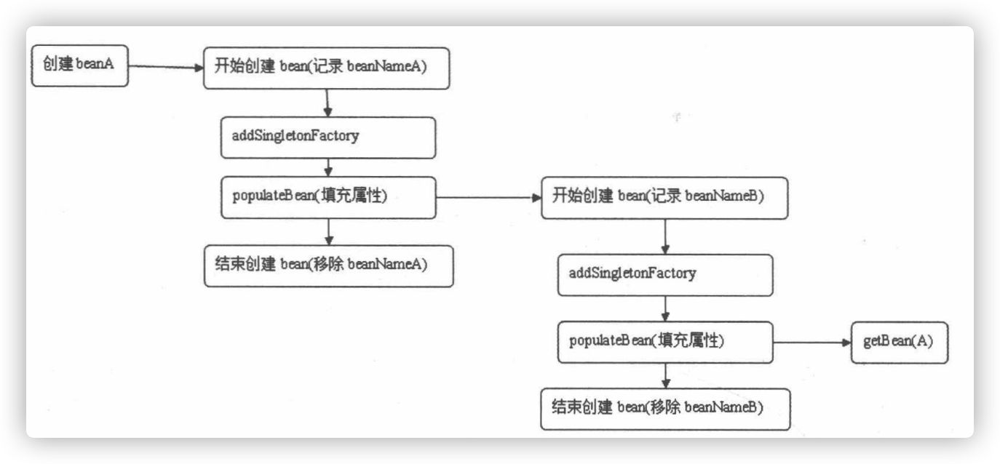

从上图可知，**在创建A的时候首先会记录A所对应的`beanName`，并将A的创建工厂加入缓存**，而在对A的属性填充时(`populateBean()`)时又会再一次的对B进行递归创建。

对于B的创建也是一样的，不同的是，在`getBean(A)`时，**这个函数并不是直接去实例化A，而是先去检测缓存中是否有已经创建好的对应的`bean`，或者是否已经创建好的`ObjectFactory`，而此时对于A的`ObjectDactory`早已创建，所以便不会再去向后执行，而是直接调用`ObjectFactory`去创建A。**

**`AbstractAutowireCapableBeanFactory.getEarlyBeanReference()`:**

```java
protected Object getEarlyBeanReference(String beanName, RootBeanDefinition mbd, Object bean) {
   Object exposedObject = bean;
   if (!mbd.isSynthetic() && hasInstantiationAwareBeanPostProcessors()) {
      for (BeanPostProcessor bp : getBeanPostProcessors()) {
         if (bp instanceof SmartInstantiationAwareBeanPostProcessor) {
            SmartInstantiationAwareBeanPostProcessor ibp = (SmartInstantiationAwareBeanPostProcessor) bp;
            exposedObject = ibp.getEarlyBeanReference(exposedObject, beanName);
         }
      }
   }
   return exposedObject;
}
```

上述代码可以说除了后处理器的调用外没有别的处理工作。

**在B中创建依赖A时通过`ObjectFactory`提供的实例化方法来中断A中的属性填充，使B中持有的A仅仅是刚刚初始化并没有填充任何属性的A，而这正初始化A的步骤还是在最开始创建A的时候进行的，但是因为A于B中A的所表示的属性地址是一样的，所以在A中创建好的属性填充自然可以通过B中的A获取，这样就解决了循环依赖的问题。**

### 属性注入

`populateBean`实现`bean`属性的填充。

**`AbstractAutowireCapableBeanFactory.populateBean()`:**

```java
protected void populateBean(String beanName, RootBeanDefinition mbd, @Nullable BeanWrapper bw) {
   if (bw == null) {
      if (mbd.hasPropertyValues()) {
         throw new BeanCreationException(
               mbd.getResourceDescription(), beanName, "Cannot apply property values to null instance");
      }
      else {
         // Skip property population phase for null instance.
        // 没有可填充的属性
         return;
      }
   }

   // Give any InstantiationAwareBeanPostProcessors the opportunity to modify the
   // state of the bean before properties are set. This can be used, for example,
   // to support styles of field injection.
  /**
  	给InstantiationAwareBeanPostProcessors最后一次机会在属性设置前来该变bean
  	如：可以用来支持属性注入的类型
  **/
   if (!mbd.isSynthetic() && hasInstantiationAwareBeanPostProcessors()) {
      for (BeanPostProcessor bp : getBeanPostProcessors()) {
         if (bp instanceof InstantiationAwareBeanPostProcessor) {
            InstantiationAwareBeanPostProcessor ibp = (InstantiationAwareBeanPostProcessor) bp;
           // 返回值为是否继续填充bean
            if (!ibp.postProcessAfterInstantiation(bw.getWrappedInstance(), beanName)) {
               return;
            }
         }
      }
   }
  
   PropertyValues pvs = (mbd.hasPropertyValues() ? mbd.getPropertyValues() : null);

   int resolvedAutowireMode = mbd.getResolvedAutowireMode();
   if (resolvedAutowireMode == AUTOWIRE_BY_NAME || resolvedAutowireMode == AUTOWIRE_BY_TYPE) {
      MutablePropertyValues newPvs = new MutablePropertyValues(pvs);
      // Add property values based on autowire by name if applicable.
     // 根据名称自动注入
      if (resolvedAutowireMode == AUTOWIRE_BY_NAME) {
         autowireByName(beanName, mbd, bw, newPvs);
      }
      // Add property values based on autowire by type if applicable.
     // 根据类型自动注入
      if (resolvedAutowireMode == AUTOWIRE_BY_TYPE) {
         autowireByType(beanName, mbd, bw, newPvs);
      }
      pvs = newPvs;
   }

  // 后处理器以及初始化
   boolean hasInstAwareBpps = hasInstantiationAwareBeanPostProcessors();
  // 需要依赖检查
   boolean needsDepCheck = (mbd.getDependencyCheck() != AbstractBeanDefinition.DEPENDENCY_CHECK_NONE);

   if (hasInstAwareBpps || needsDepCheck) {
      if (pvs == null) {
         pvs = mbd.getPropertyValues();
      }
      PropertyDescriptor[] filteredPds = filterPropertyDescriptorsForDependencyCheck(bw, mbd.allowCaching);
      if (hasInstAwareBpps) {
         for (BeanPostProcessor bp : getBeanPostProcessors()) {
            if (bp instanceof InstantiationAwareBeanPostProcessor) {
               InstantiationAwareBeanPostProcessor ibp = (InstantiationAwareBeanPostProcessor) bp;
              // 对所有需要依赖检查的属性进行后处理
               pvs = ibp.postProcessPropertyValues(pvs, filteredPds, bw.getWrappedInstance(), beanName);
               if (pvs == null) {
                  return;
               }
            }
         }
      }
      if (needsDepCheck) {
        // 依赖检查，对于deepends-on属性，3.0已经弃用
         checkDependencies(beanName, mbd, filteredPds, pvs);
      }
   }

   if (pvs != null) {
     // 将属性应用到bean中
      applyPropertyValues(beanName, mbd, bw, pvs);
   }
}
```

处理流程：

1. `InstantiationAwareBeanPostProcessor`处理器的`postProcessAfterInstantiation`函数的应用，此函数可以控制程序是否继续进行属性填充。
2. 根据注入类型(`byName/byType`)，提取依赖的`bean`，并统一存入`PropertyValues`中。
3. 应用`InstantiationAwareBeanPostProceesor`处理器的`postProcessPropertyValues`方法，对属性获取完毕填充前对属性的再次处理，典型应用是`RequiredAnnotationBeanPostProcessor`类中属性的验证。
4. 将所有`PropertyValues`中的属性填充至`BeanWrapper`中。

#### `autowireByName`

根据名称自动注入。

**`AbstractAutowireCapableBeanFactory.autowireByName()`:**

```java
protected void autowireByName(
      String beanName, AbstractBeanDefinition mbd, BeanWrapper bw, MutablePropertyValues pvs) {

  // 寻找bw中需要依赖注入的属性
   String[] propertyNames = unsatisfiedNonSimpleProperties(mbd, bw);
   for (String propertyName : propertyNames) {
      if (containsBean(propertyName)) {
        // 递归初始化相关的bean
         Object bean = getBean(propertyName);
         pvs.add(propertyName, bean);
        // 注册依赖
         registerDependentBean(propertyName, beanName);
         if (logger.isDebugEnabled()) {
            logger.debug("Added autowiring by name from bean name '" + beanName +
                  "' via property '" + propertyName + "' to bean named '" + propertyName + "'");
         }
      }
      else {
         if (logger.isTraceEnabled()) {
            logger.trace("Not autowiring property '" + propertyName + "' of bean '" + beanName +
                  "' by name: no matching bean found");
         }
      }
   }
}
```

在传入的参数`pvs`中找出已经加载的`bean`，并递归实例化，进而加入到`pvs`中。


#### `autowireByType`

根据类型注入。比根据名称注入复杂。

**`AbstractAutowireCapableBeanFactory.autowireByType()`:**

```java
protected void autowireByType(
      String beanName, AbstractBeanDefinition mbd, BeanWrapper bw, MutablePropertyValues pvs) {

   TypeConverter converter = getCustomTypeConverter();
   if (converter == null) {
      converter = bw;
   }

   Set<String> autowiredBeanNames = new LinkedHashSet<>(4);
  // 寻找bw中需要依赖注入的属性
   String[] propertyNames = unsatisfiedNonSimpleProperties(mbd, bw);
   for (String propertyName : propertyNames) {
      try {
         PropertyDescriptor pd = bw.getPropertyDescriptor(propertyName);
         // Don't try autowiring by type for type Object: never makes sense,
         // even if it technically is a unsatisfied, non-simple property.
         if (Object.class != pd.getPropertyType()) {
           // 探测指定属性的set方法
            MethodParameter methodParam = BeanUtils.getWriteMethodParameter(pd);
            // Do not allow eager init for type matching in case of a prioritized post-processor.
            boolean eager = !(bw.getWrappedInstance() instanceof PriorityOrdered);
            DependencyDescriptor desc = new AutowireByTypeDependencyDescriptor(methodParam, eager);
           /**
           	解析指定beanName的属性所匹配的值，并把解析到的属性名称存在autowiredBeanNames中，
           	当属性存在多个封装bean时：
           	@Autowired
           	private List<A> list;
           	将会找到所有匹配A类型的bean并将其注入
           **/
            Object autowiredArgument = resolveDependency(desc, beanName, autowiredBeanNames, converter);
            if (autowiredArgument != null) {
               pvs.add(propertyName, autowiredArgument);
            }
            for (String autowiredBeanName : autowiredBeanNames) {
              // 注册依赖
               registerDependentBean(autowiredBeanName, beanName);
               if (logger.isDebugEnabled()) {
                  logger.debug("Autowiring by type from bean name '" + beanName + "' via property '" +
                        propertyName + "' to bean named '" + autowiredBeanName + "'");
               }
            }
            autowiredBeanNames.clear();
         }
      }
      catch (BeansException ex) {
         throw new UnsatisfiedDependencyException(mbd.getResourceDescription(), beanName, propertyName, ex);
      }
   }
}
```

其中用于类型匹配的逻辑实现封装在:

**`AutowireCapableBeanFactory.resolveDependency()`:**

```java
Object resolveDependency(DependencyDescriptor descriptor, @Nullable String requestingBeanName,
      @Nullable Set<String> autowiredBeanNames, @Nullable TypeConverter typeConverter) throws BeansException;
```

的一个实现类中：

**`DefaultListableBeanFactory.resolveDependency()`:**

```java
public Object resolveDependency(DependencyDescriptor descriptor, @Nullable String requestingBeanName,
      @Nullable Set<String> autowiredBeanNames, @Nullable TypeConverter typeConverter) throws BeansException {

   descriptor.initParameterNameDiscovery(getParameterNameDiscoverer());
   if (Optional.class == descriptor.getDependencyType()) {
      return createOptionalDependency(descriptor, requestingBeanName);
   }
   else if (ObjectFactory.class == descriptor.getDependencyType() ||
         ObjectProvider.class == descriptor.getDependencyType()) {
     // ObjectFactory类注入的特殊处理
      return new DependencyObjectProvider(descriptor, requestingBeanName);
   }
   else if (javaxInjectProviderClass == descriptor.getDependencyType()) {
     // javaxInjectProviderClass类注入的特殊处理
      return new Jsr330ProviderFactory().createDependencyProvider(descriptor, requestingBeanName);
   }
   else {
     // 通用逻辑处理
      Object result = getAutowireCandidateResolver().getLazyResolutionProxyIfNecessary(
            descriptor, requestingBeanName);
      if (result == null) {
         result = doResolveDependency(descriptor, requestingBeanName, autowiredBeanNames, typeConverter);
      }
      return result;
   }
}
```


**`DefaultListableBeanFactory.doResolveDependency()`:**

```java
public Object doResolveDependency(DependencyDescriptor descriptor, @Nullable String beanName,
      @Nullable Set<String> autowiredBeanNames, @Nullable TypeConverter typeConverter) throws BeansException {

   InjectionPoint previousInjectionPoint = ConstructorResolver.setCurrentInjectionPoint(descriptor);
   try {
      Object shortcut = descriptor.resolveShortcut(this);
      if (shortcut != null) {
         return shortcut;
      }

      Class<?> type = descriptor.getDependencyType();
     // 支持Spring新增的@Value注解
      Object value = getAutowireCandidateResolver().getSuggestedValue(descriptor);
      if (value != null) {
         if (value instanceof String) {
            String strVal = resolveEmbeddedValue((String) value);
            BeanDefinition bd = (beanName != null && containsBean(beanName) ? getMergedBeanDefinition(beanName) : null);
            value = evaluateBeanDefinitionString(strVal, bd);
         }
         TypeConverter converter = (typeConverter != null ? typeConverter : getTypeConverter());
         return (descriptor.getField() != null ?
               converter.convertIfNecessary(value, type, descriptor.getField()) :
               converter.convertIfNecessary(value, type, descriptor.getMethodParameter()));
      }

     // 见下
      Object multipleBeans = resolveMultipleBeans(descriptor, beanName, autowiredBeanNames, typeConverter);
      if (multipleBeans != null) {
         return multipleBeans;
      }

      Map<String, Object> matchingBeans = findAutowireCandidates(beanName, type, descriptor);
      if (matchingBeans.isEmpty()) {
        // 如果autowire的require属性为true而找到的匹配项却为空则只能抛出异常
         if (isRequired(descriptor)) {
            raiseNoMatchingBeanFound(type, descriptor.getResolvableType(), descriptor);
         }
         return null;
      }

      String autowiredBeanName;
      Object instanceCandidate;

      if (matchingBeans.size() > 1) {
         autowiredBeanName = determineAutowireCandidate(matchingBeans, descriptor);
         if (autowiredBeanName == null) {
            if (isRequired(descriptor) || !indicatesMultipleBeans(type)) {
               return descriptor.resolveNotUnique(type, matchingBeans);
            }
            else {
               // In case of an optional Collection/Map, silently ignore a non-unique case:
               // possibly it was meant to be an empty collection of multiple regular beans
               // (before 4.3 in particular when we didn't even look for collection beans).
               return null;
            }
         }
         instanceCandidate = matchingBeans.get(autowiredBeanName);
      }
      else {
         // We have exactly one match.
        // 已经可以确定只有一个匹配项
         Map.Entry<String, Object> entry = matchingBeans.entrySet().iterator().next();
         autowiredBeanName = entry.getKey();
         instanceCandidate = entry.getValue();
      }

      if (autowiredBeanNames != null) {
         autowiredBeanNames.add(autowiredBeanName);
      }
      if (instanceCandidate instanceof Class) {
         instanceCandidate = descriptor.resolveCandidate(autowiredBeanName, type, this);
      }
      Object result = instanceCandidate;
      if (result instanceof NullBean) {
         if (isRequired(descriptor)) {
            raiseNoMatchingBeanFound(type, descriptor.getResolvableType(), descriptor);
         }
         result = null;
      }
      if (!ClassUtils.isAssignableValue(type, result)) {
         throw new BeanNotOfRequiredTypeException(autowiredBeanName, type, instanceCandidate.getClass());
      }
      return result;
   }
   finally {
      ConstructorResolver.setCurrentInjectionPoint(previousInjectionPoint);
   }
}
```

**`DefaultListableBeanFactory.`:**

```java
private Object resolveMultipleBeans(DependencyDescriptor descriptor, @Nullable String beanName,
			@Nullable Set<String> autowiredBeanNames, @Nullable TypeConverter typeConverter) {

		Class<?> type = descriptor.getDependencyType();
    // 如果解析器没有成功解析，那么需要考虑各种情况
  	// 属性时数组
		if (type.isArray()) {
			Class<?> componentType = type.getComponentType();
			ResolvableType resolvableType = descriptor.getResolvableType();
			Class<?> resolvedArrayType = resolvableType.resolve();
			if (resolvedArrayType != null && resolvedArrayType != type) {
				type = resolvedArrayType;
				componentType = resolvableType.getComponentType().resolve();
			}
			if (componentType == null) {
				return null;
			}
     /**
     	根据属性类型找到beanFactory中所有类型的匹配bean
     	返回值的构成为：
     	key=匹配的beanName, value=beanName对应的实例化后的bean（通过getBean(beanName)返回）
     **/
			Map<String, Object> matchingBeans = findAutowireCandidates(beanName, componentType,
					new MultiElementDescriptor(descriptor));
			if (matchingBeans.isEmpty()) {
				return null;
			}
			if (autowiredBeanNames != null) {
				autowiredBeanNames.addAll(matchingBeans.keySet());
			}
			TypeConverter converter = (typeConverter != null ? typeConverter : getTypeConverter());
			Object result = converter.convertIfNecessary(matchingBeans.values(), type);
			if (getDependencyComparator() != null && result instanceof Object[]) {
				Arrays.sort((Object[]) result, adaptDependencyComparator(matchingBeans));
			}
			return result;
		}
		else if (Collection.class.isAssignableFrom(type) && type.isInterface()) {
			Class<?> elementType = descriptor.getResolvableType().asCollection().resolveGeneric();
			if (elementType == null) {
				return null;
			}
			Map<String, Object> matchingBeans = findAutowireCandidates(beanName, elementType,
					new MultiElementDescriptor(descriptor));
			if (matchingBeans.isEmpty()) {
				return null;
			}
			if (autowiredBeanNames != null) {
				autowiredBeanNames.addAll(matchingBeans.keySet());
			}
			TypeConverter converter = (typeConverter != null ? typeConverter : getTypeConverter());
      // 通过转换器将bean的值转换为对应的type类型
			Object result = converter.convertIfNecessary(matchingBeans.values(), type);
			if (getDependencyComparator() != null && result instanceof List) {
				((List<?>) result).sort(adaptDependencyComparator(matchingBeans));
			}
			return result;
		}
  // 属性是Map类型
		else if (Map.class == type) {
			ResolvableType mapType = descriptor.getResolvableType().asMap();
			Class<?> keyType = mapType.resolveGeneric(0);
			if (String.class != keyType) {
				return null;
			}
			Class<?> valueType = mapType.resolveGeneric(1);
			if (valueType == null) {
				return null;
			}
			Map<String, Object> matchingBeans = findAutowireCandidates(beanName, valueType,
					new MultiElementDescriptor(descriptor));
			if (matchingBeans.isEmpty()) {
				return null;
			}
			if (autowiredBeanNames != null) {
				autowiredBeanNames.addAll(matchingBeans.keySet());
			}
			return matchingBeans;
		}
		else {
			return null;
		}
	}
```

寻找类型的匹配执行顺序时，首先尝试使用解析器进行解析，如果解析器没有成功解析，那么可能是使用默认的解析器没有做任何处理，或者使用了自定义的解析器，但是对于集合等类型来说并不在解析范围之内，所以再次对不同类型进行不同情况的处理，虽说对于不同类型的处理方式不一致吗但是大致的思路还是很相似的，所以函数中只对数组类型进行了详细的注释。

#### `applyPropertyValues`

至此，以及完成了对所有注入属性的获取，但是获取的属性是以`PropertyValues`形式存在的，还没有应用到已经实例化的`bean`中，这个工作是由`applyPropertyValues`完成。

**`AbstractAutowireCapableBeanFactory.applyPropertyValues()`:**

```java
protected void applyPropertyValues(String beanName, BeanDefinition mbd, BeanWrapper bw, PropertyValues pvs) {
   if (pvs.isEmpty()) {
      return;
   }

   if (System.getSecurityManager() != null && bw instanceof BeanWrapperImpl) {
      ((BeanWrapperImpl) bw).setSecurityContext(getAccessControlContext());
   }

   MutablePropertyValues mpvs = null;
   List<PropertyValue> original;

   if (pvs instanceof MutablePropertyValues) {
      mpvs = (MutablePropertyValues) pvs;
     // 如果mpvs中的值已经被转换为对应的类型那么可以直接设置到beanwarpper中
      if (mpvs.isConverted()) {
         // Shortcut: use the pre-converted values as-is.
         try {
            bw.setPropertyValues(mpvs);
            return;
         }
         catch (BeansException ex) {
            throw new BeanCreationException(
                  mbd.getResourceDescription(), beanName, "Error setting property values", ex);
         }
      }
      original = mpvs.getPropertyValueList();
   }
   else {
    	// 如果pvs并不是使用MutablePropertyValues封装的类型，那么直接使用原始的属性获取方法
      original = Arrays.asList(pvs.getPropertyValues());
   }

   TypeConverter converter = getCustomTypeConverter();
   if (converter == null) {
      converter = bw;
   }
  // 获取对应的解析器
   BeanDefinitionValueResolver valueResolver = new BeanDefinitionValueResolver(this, beanName, mbd, converter);

   // Create a deep copy, resolving any references for values.
   List<PropertyValue> deepCopy = new ArrayList<>(original.size());
   boolean resolveNecessary = false;
  // 遍历属性，讲述转换为对应累的对应属性的类型
   for (PropertyValue pv : original) {
      if (pv.isConverted()) {
         deepCopy.add(pv);
      }
      else {
         String propertyName = pv.getName();
         Object originalValue = pv.getValue();
         Object resolvedValue = valueResolver.resolveValueIfNecessary(pv, originalValue);
         Object convertedValue = resolvedValue;
         boolean convertible = bw.isWritableProperty(propertyName) &&
               !PropertyAccessorUtils.isNestedOrIndexedProperty(propertyName);
         if (convertible) {
            convertedValue = convertForProperty(resolvedValue, propertyName, bw, converter);
         }
         // Possibly store converted value in merged bean definition,
         // in order to avoid re-conversion for every created bean instance.
         if (resolvedValue == originalValue) {
            if (convertible) {
               pv.setConvertedValue(convertedValue);
            }
            deepCopy.add(pv);
         }
         else if (convertible && originalValue instanceof TypedStringValue &&
               !((TypedStringValue) originalValue).isDynamic() &&
               !(convertedValue instanceof Collection || ObjectUtils.isArray(convertedValue))) {
            pv.setConvertedValue(convertedValue);
            deepCopy.add(pv);
         }
         else {
            resolveNecessary = true;
            deepCopy.add(new PropertyValue(pv, convertedValue));
         }
      }
   }
   if (mpvs != null && !resolveNecessary) {
      mpvs.setConverted();
   }

   // Set our (possibly massaged) deep copy.
   try {
      bw.setPropertyValues(new MutablePropertyValues(deepCopy));
   }
   catch (BeansException ex) {
      throw new BeanCreationException(
            mbd.getResourceDescription(), beanName, "Error setting property values", ex);
   }
}
```


### 初始化`bean`

​	在`bean`配置时`bean`中有一个`init-method`的属性，这个属性的作用是在`bean`实例化前调用`init-method`指定的方法来根据用户业务进行相应的实例化。这时，会调用用户设定的初始化方法。

```java
protected Object initializeBean(String beanName, Object bean, @Nullable RootBeanDefinition mbd) {
		if (System.getSecurityManager() != null) {
			AccessController.doPrivileged((PrivilegedAction<Object>) () -> {
				invokeAwareMethods(beanName, bean);
				return null;
			}, getAccessControlContext());
		}
		else {
      // 对特殊的bean处理：Aware、BeanClassLoaderAware、BeanFactoryAware
			invokeAwareMethods(beanName, bean);
		}

		Object wrappedBean = bean;
		if (mbd == null || !mbd.isSynthetic()) {
      // 应用后处理器
			wrappedBean = applyBeanPostProcessorsBeforeInitialization(wrappedBean, beanName);
		}

		try {
      // 激活用户自定义的init方法
			invokeInitMethods(beanName, wrappedBean, mbd);
		}
		catch (Throwable ex) {
			throw new BeanCreationException(
					(mbd != null ? mbd.getResourceDescription() : null),
					beanName, "Invocation of init method failed", ex);
		}
		if (mbd == null || !mbd.isSynthetic()) {
      // 后处理器应用
			wrappedBean = applyBeanPostProcessorsAfterInitialization(wrappedBean, beanName);
		}

		return wrappedBean;
	}
```

​	主要目的是进行客户设定的初始化方法调用。

#### 激活`Aware`方法

​	`Spring`中提供了一些`Aware`相关接口，比如`BeanFactoryAware`、`ApplicationContextAware`...，**实现这些`Aware`接口的`bean`在被初始化之后，可以取得一些相对应的资源。**

> ​		`Aware`：意识到；即这个`bean`能意识到，感知到一些属性，如：
>
> * `BeanNameAware`：感知到`BeanName`
> * `BeanFactoryAware`：获取`BeanFactory`
> * `ApplicationContext`：获取`ApplicationContext`

example：

```java
public class Hello {
  public void say() {
    System.out.println("hello");
  }
}

public class Test implements BeanFactoryAware {
  private BeanFactory beanFactory;
  
  @Override
  public void setBeanFactory(BeanFactory beanFactory) throws BeansException {
    // 获取到Beanfactory
    this.beanFactory = beanFactory;
  }
  public void testAware() {
    // 根据BeanFactory获得Bean
    Hello hello = (Hello)beanFactory.getBean("hello");
    hello.say();
  }
}

public static void main(String[] s) {
  ApplicationContext ctx = new ClassPathXmlApplicationContext("application.xml");
  Test test = (Test)ctx.getBean("test");
  test.testAware();
}
```

​	就可以获取到`Spring`中的`BeanFactory`，然后可以根据`BeanFactory`获取所有`bean`。

#### 处理器的应用

​	`BeanPostProcessor`给用户充足的权限去更改或者扩展`Spring`，*除了`BeanPostProcessor`外还有许多其他的`PostProcessor`。当然，其他的也是这个为基础。*

​	在用户自定义初始化方法前及调用自定义初始化方法后分别会调用`BeanPostProcessor`的`postProcessBeforeInitialization`和`postProcessAfterInitialization`方法。

**`AbstractAutowireCapableBeanFactory.applyBeanPostProcessorsBeforeInitialization()`:**

```java
public Object applyBeanPostProcessorsBeforeInitialization(Object existingBean, String beanName)
      throws BeansException {

   Object result = existingBean;
   for (BeanPostProcessor processor : getBeanPostProcessors()) {
      Object current = processor.postProcessBeforeInitialization(result, beanName);
      if (current == null) {
         return result;
      }
      result = current;
   }
   return result;
}
```

**`AbstractAutowireCapableBeanFactory.applyBeanPostProcessorsAfterInitialization()`:**

```java
public Object applyBeanPostProcessorsAfterInitialization(Object existingBean, String beanName)
      throws BeansException {

   Object result = existingBean;
   for (BeanPostProcessor processor : getBeanPostProcessors()) {
      Object current = processor.postProcessAfterInitialization(result, beanName);
      if (current == null) {
         return result;
      }
      result = current;
   }
   return result;
}
```


#### 激活自定义的`init`方法

​	用户自定义的初始化方法除了使用配置`init-method`外，还有使用自定义`bean`实现的`InitializationBean`接口，并在`afterPropertiesSet`中实现自己的初始化业务逻辑。

​	`init-method`于`afterPropertiesSet`都在初始化`bean`时执行，执行顺序为`afterPropertiesSet`先执行，`init-method`后执行。

**`AbstractAutowireCapableBeanFactory.invokeInitMethods()`:**

```java
protected void invokeInitMethods(String beanName, Object bean, @Nullable RootBeanDefinition mbd)
      throws Throwable {

  // 首先检查是否是InitializaingBean，如果是的话需要调用afterPropertiesesSet方法
   boolean isInitializingBean = (bean instanceof InitializingBean);
   if (isInitializingBean && (mbd == null || !mbd.isExternallyManagedInitMethod("afterPropertiesSet"))) {
      if (logger.isDebugEnabled()) {
         logger.debug("Invoking afterPropertiesSet() on bean with name '" + beanName + "'");
      }
      if (System.getSecurityManager() != null) {
         try {
            AccessController.doPrivileged((PrivilegedExceptionAction<Object>) () -> {
               ((InitializingBean) bean).afterPropertiesSet();
               return null;
            }, getAccessControlContext());
         }
         catch (PrivilegedActionException pae) {
            throw pae.getException();
         }
      }
      else {
        // 属性初始化后的处理
         ((InitializingBean) bean).afterPropertiesSet();
      }
   }

   if (mbd != null && bean.getClass() != NullBean.class) {
      String initMethodName = mbd.getInitMethodName();
      if (StringUtils.hasLength(initMethodName) &&
            !(isInitializingBean && "afterPropertiesSet".equals(initMethodName)) &&
            !mbd.isExternallyManagedInitMethod(initMethodName)) {
        // 调用自定义初始化方法
         invokeCustomInitMethod(beanName, bean, mbd);
      }
   }
}
```


### 注册`DisposableBean`

​	`Spring`不仅提供了对于初始化方法的扩展入口，同样也提供了销毁方法的扩展入口，对于销毁方法的扩展，除了配置属性`destory-method`方法外，用户还可以注册后处理器`DestructionAwareBeanPostProcessor`来统一处理`bean`的销毁方法。

**`AbstractBeanFactory.registerDisposableBeanIfNecessary()`:**

```java
protected void registerDisposableBeanIfNecessary(String beanName, Object bean, RootBeanDefinition mbd) {
   AccessControlContext acc = (System.getSecurityManager() != null ? getAccessControlContext() : null);
   if (!mbd.isPrototype() && requiresDestruction(bean, mbd)) {
      if (mbd.isSingleton()) {
         // Register a DisposableBean implementation that performs all destruction
         // work for the given bean: DestructionAwareBeanPostProcessors,
         // DisposableBean interface, custom destroy method.
        /**
        	单例模式下注册需要销毁的bean，此方法中会处理实现DisposableBean的bean，
        	并且对所有的bean使用DestructionAwareBeanPostProcessor处理。
        **/
         registerDisposableBean(beanName,
               new DisposableBeanAdapter(bean, beanName, mbd, getBeanPostProcessors(), acc));
      }
      else {
         // A bean with a custom scope...
        // 自定义scope的处理
         Scope scope = this.scopes.get(mbd.getScope());
         if (scope == null) {
            throw new IllegalStateException("No Scope registered for scope name '" + mbd.getScope() + "'");
         }
         scope.registerDestructionCallback(beanName,
               new DisposableBeanAdapter(bean, beanName, mbd, getBeanPostProcessors(), acc));
      }
   }
}
```

# 容器的功能扩展

​	以`BeanFactory`接口以及它的默认实现类`XmlBeanFactory`，但是，`Spring`中还提供了另一个接口`ApllicatioContext`，用于扩展`BeanFactory`中现有的功能。

`ApplicationContext`和`BeanFactory`两者都是用于加载`Bean`的，但是相比之下，`ApplicationContext`提供了更多的扩展功能。

> ​	`ApplicationContext`包含`BeanFactory`的所有功能。优先使用`ApplicationContext`，除非在一些闲置场合，如：字节长度对内存有很大影响。

使用差别：

* `BeanFactory`加载`Xml`

  ```java
  BeanFactory bf = new XmlBeanFactory(new ClassPathResource("xx.xml"))
  ```

* `ApplicationContext`加载`Xml`

  ```java
  ApplicationContext bf = new ClassPathApplicationContext("xx.xml")
  ```

  **`ClassPathApplicationContext`:**

  ```java
  public ClassPathXmlApplicationContext(String configLocation) throws BeansException {
     this(new String[] {configLocation}, true, null);
  }
  
  public ClassPathXmlApplicationContext(
  			String[] configLocations, boolean refresh, @Nullable ApplicationContext parent)
  			throws BeansException {
  
  		super(parent);
  		setConfigLocations(configLocations);
  		if (refresh) {
  			refresh();
  		}
  	}
  ```

  ​	设置路径是必不可少的步骤，`ClassPathApplicationContext`中可以讲配置文件路径以数组的方式传入，`ClassPathApplicationContext`可以对数组进行解析并进行加载，解析功能在`refresh()`中实现。


  ## 设置配置路径

  ​	`ClassPathXmlApplicationContext`中支持多个配置文件以数组形式传入：

  **`ClassPathXmlApplicationContext.setConfigLocations()`:**

  ```java
  public void setConfigLocations(@Nullable String... locations) {
     if (locations != null) {
        Assert.noNullElements(locations, "Config locations must not be null");
        this.configLocations = new String[locations.length];
        for (int i = 0; i < locations.length; i++) {
           this.configLocations[i] = resolvePath(locations[i]).trim();
        }
     }
     else {
        this.configLocations = null;
     }
  }
  ```

  ​		如果数组中包含特殊符号，如`${dir}`，那么`resolvePath`中会搜索匹配的系统变量并替换。


  ## 扩展功能

  ​	设置了路径后，便可以根据路径做配置文件的解析以及各种功能的实现了。

**`ClassPathXmlApplicationContext.refresh()`:**

```java
public void refresh() throws BeansException, IllegalStateException {
   synchronized (this.startupShutdownMonitor) {
      // Prepare this context for refreshing.
      // 准备刷新的上下文环境
      prepareRefresh();

      // Tell the subclass to refresh the internal bean factory.
      // 初始化BeanFactory，并进行XML文件读取
      ConfigurableListableBeanFactory beanFactory = obtainFreshBeanFactory();

      // Prepare the bean factory for use in this context.
      // 对BeanFactory进行各种功能填充
      prepareBeanFactory(beanFactory);

      try {
         // Allows post-processing of the bean factory in context subclasses.
         // 子类覆盖方法做额外处理
         postProcessBeanFactory(beanFactory);

         // Invoke factory processors registered as beans in the context.
         // 激活各种BeanFactory处理器
         invokeBeanFactoryPostProcessors(beanFactory);

         // Register bean processors that intercept bean creation.
         // 注册拦截Bean创建的Bean处理器，只是注册，真正的调用实在getBean的时候
         registerBeanPostProcessors(beanFactory);

         // Initialize message source for this context.
        // 为上下文初始化Message源，即国际化处理
         initMessageSource();

         // Initialize event multicaster for this context.
        // 初始化应用消息广播器，并放入applicationEventMulticaster
         initApplicationEventMulticaster();

         // Initialize other special beans in specific context subclasses.
        // 留给子类来初始化其他的bean
         onRefresh();

         // Check for listener beans and register them.
        // 在所有注册的bean中查找Listener bean，注册到消息广播器中
         registerListeners();

         // Instantiate all remaining (non-lazy-init) singletons.
        // 初始化剩下的单例（非惰性）
         finishBeanFactoryInitialization(beanFactory);

         // Last step: publish corresponding event.
        /** 完成刷新过程，通知生命周期处理器lifecycleProccesor刷新过程，
        		同时发出ContextRefreshEvent通知别人
        **/
         finishRefresh();
      }

      catch (BeansException ex) {
         if (logger.isWarnEnabled()) {
            logger.warn("Exception encountered during context initialization - " +
                  "cancelling refresh attempt: " + ex);
         }

         // Destroy already created singletons to avoid dangling resources.
         destroyBeans();

         // Reset 'active' flag.
         cancelRefresh(ex);

         // Propagate exception to caller.
         throw ex;
      }

      finally {
         // Reset common introspection caches in Spring's core, since we
         // might not ever need metadata for singleton beans anymore...
         resetCommonCaches();
      }
   }
}
```

  	提供的功能：

1. 初始化前的准备工作。

   > ​	在某种情况下项目的使用需要读取某些系统变量，而这个变量的设置可能影响着系统的正确性，那么`ClassPathXmlApplicationContext`提供这个准备函数就显得非常有必要，**它可以在`Spring`启动的时候提前对必须的变量进行存在下验证。**

2. 初始化`BeanFactory`，并进行`XML`文件读取。

   > ​	 `ClassPathXmlApplicationContext`包含着`BeanFactory`所提供的一切特征，那么在这一步骤中将会复用`BeanFactory`中配置文件读取解析及其他特征，这一步之后，`ClassPathXmlApplicationContext`实际上就已经包含了`BeanFactory`所提供的的功能，**也就是可以进行`bean`的提取等基础操作了。**
   
3. 对`BeanFactory`进行各种功能填充。

   > ​	`@Qualifier`与`@Autowired`这两个注解正是在这一步骤中增加的支持。

4. 子类覆盖方法做额外的处理。

   > ​	`Spring`开放式的架构让使用它的程序员很容易根据业务需要扩展已经存在的功能，这种开放式的设计在`Spring`中随处可见，如：本例中就提供了一个空实现的函数实现`postProcessBeanFactory`来方便程序员在业务上做进一步扩展。

5. 激活各种`BeanFactory`处理器。

6. 注册拦截`bean`创建的`bean`处理器，这里只是注册，真正的调用是在`getBean`时候。

7. 为上下文初始化`Message`源，即对不同语言的消息题进行国际化处理。

8. 初始化应用消息广播器，并放入`applicationnEventMulticaster` `bean`中。

9. 留个子类来初始化其他的`bean`。

10. 在所有注册的`bean`中查找`listener bean`，注册到消息广播。

11. 初始化剩下的单实例（非惰性）。

12. 完成刷新过程，通知生命周期处理器`lifecycleProcessor`刷新过程，同时发出`ContextRefreshEvent`通知别人。

## 环境准备

**`AbstractApplicationContext.preparefresh()`:**

```java
protected void prepareRefresh() {
   // Switch to active.
   this.startupDate = System.currentTimeMillis();
   this.closed.set(false);
   this.active.set(true);

   if (logger.isInfoEnabled()) {
      logger.info("Refreshing " + this);
   }

   // Initialize any placeholder property sources in the context environment.
  // 留个子类覆盖
   initPropertySources();

   // Validate that all properties marked as required are resolvable:
   // see ConfigurablePropertyResolver#setRequiredProperties
  // 验证需要的属性文件是否都已经放入环境
   getEnvironment().validateRequiredProperties();

   // Store pre-refresh ApplicationListeners...
   if (this.earlyApplicationListeners == null) {
      this.earlyApplicationListeners = new LinkedHashSet<>(this.applicationListeners);
   }
   else {
      // Reset local application listeners to pre-refresh state.
      this.applicationListeners.clear();
      this.applicationListeners.addAll(this.earlyApplicationListeners);
   }

   // Allow for the collection of early ApplicationEvents,
   // to be published once the multicaster is available...
   this.earlyApplicationEvents = new LinkedHashSet<>();
}
```

其中`initPropertySources()`是空实现，`getEnvironment().validateRequiredProperties()`几乎是空实现，看似没什么用处，其实作用很大。

1. `initPropertySources()`正符合`Spring`的开放式设计，给用户最大扩展`Spring`的能力。用户可以根据自身的需要重写`initPropertySources()`，并在方法中进行个性化的属性处理及设置。

2. `getEnvironment().validateRequiredProperties()`则是对属性进行验证。

   example：

   需求：工程在运行过程中用到某个设置（如：`${var}`）是从系统环境变量值取得的，而如果用户没有在系统环境变量中配置这个参数，那么工程可能不会工作。这一要求可能会有各种各样的解决方法，当然可以直接修改`Spring`的源码，如修改`ClassPathXmlApplicationContext`。但是最好还是对源码进行扩展：

   ```java
   public class MyClassPathXmlApplicationContext extends ClassPathApplicationContex {
     public MyClassPathXmlApplicationContext(String ... args) {
       super(args);
     }
     protected void initPropertySources() {
       // 添加验证要求
       getEnvironment().setRequiredProperties("VAR");
     }
   }
   ```

   自定义了继承自`ClassPathXmlApplicationContext`的`MyClassPathXmlApplicationContext`，并重写了`initPropertySources()`方法，在方法中添加了个性化的需求，那么在验证的时候也就是程序走到`getEnvironment().validateRequiredProperties()`代码时，如果系统并没有检测到对应的`VAR`的环境变量，那么将抛出异常。

## 加载`BeanFactory`

**`AbstractApplicationContext.obtainFreshBeanFactory()`:**

获得`BeanFactory`，`ApplicationContext`不仅包含了`BeanFactory`的全部功能，更在其基础上添加了大量的扩展应用，那么`obtainFreshBeanFactory()`正是实现`BeanFactory`的地方，经过这个方法后，`ApplicationContext`就拥有了`BeanFactory`的全部功能。

```java
protected ConfigurableListableBeanFactory obtainFreshBeanFactory() {
  //初始化BeanFactory，并进行XML文件读取，并将得到的BeanFactory记录在当前实体的属性中
   refreshBeanFactory();
  // 返回当前实体的beanFactory属性
   ConfigurableListableBeanFactory beanFactory = getBeanFactory();
   if (logger.isDebugEnabled()) {
      logger.debug("Bean factory for " + getDisplayName() + ": " + beanFactory);
   }
   return beanFactory;
}
```

**`AbstractApplicationContext.refreshBeanFactory()`:**

核心实现委托给了它。

```java
protected final void refreshBeanFactory() throws BeansException {
   if (hasBeanFactory()) {
      destroyBeans();
      closeBeanFactory();
   }
   try {
     // 创建DefaultListableBeanFactory
      DefaultListableBeanFactory beanFactory = createBeanFactory();
     // 为了序列化指定Id，如果需要的话，让这个BeanFactory从id反序列化到BeanFactory
      beanFactory.setSerializationId(getId());
     /**
     	定制beanFactory，设置相关属性，包括是否允许覆盖同名称的不同定义的对象以及循环依赖
     	以及@Autowired和@Qualifier注解解析器QualifierAnnotationAutowireCandidateResolver
     **/
      customizeBeanFactory(beanFactory);
     // 初始化DocumentReader，并进行XML文件读取与解析
      loadBeanDefinitions(beanFactory);
      this.beanFactory = beanFactory;
   }
   catch (IOException ex) {
      throw new ApplicationContextException("I/O error parsing bean definition source for " + getDisplayName(), ex);
   }
}
```

上述步骤：

1. 创建`DefaultListableBeanFactory`。

   ```java
   // BeanFactory声明方式
   BeanFactory bf = new XmlBeanFactory("xx.xml");
   ```

   其中`XmlBeanFactory`继承自`DefaultListableBeanFactory`，并提供了`XmlBeanDefinitionReader`类型的`reader`属性，**也就是说`DefaultListableBeanFactory`是容器的基础。必须要首先实例化。**此处就是实例化`DefaultListableBeanFactory`的步骤。

2. 指定序列化`ID`。

3. 定制`BeanFactory`。

4. 加载`BeanDefinition`。

5. 使用全局变量记录`BeanFactory`类实例。

因为`DefaultListableBeanFactory`类型的变量`beanFactory`是函数内的局部变量，所以要使用全局变量记录解析结果。

### 定制`BeanFactory`

​	开始对`BeanFactory`的扩展，在基本容器的基础上，增加了是否允许覆盖是否允许扩展的设置并提供了`@Qualifier`和`@Autowired`的支持。

**`AbstractApplicationContext.customizeBeanFactory()`:**

```java
protected void customizeBeanFactory(DefaultListableBeanFactory beanFactory) {
  /**
  	如果属性allowBeanDefinitionOverriding不为空，设置给beanFactory对象相应属性
  	此属性含义：是否允许覆盖同名称的不同定义的对象
  **/
   if (this.allowBeanDefinitionOverriding != null) {
      beanFactory.setAllowBeanDefinitionOverriding(this.allowBeanDefinitionOverriding);
   }
  /**
  	如果属性allowCircularReferences不为空，设置给beanFactory对象相应属性
  	此属性含义：是否允许bean之间存在循环依赖
  **/
   if (this.allowCircularReferences != null) {
      beanFactory.setAllowCircularReferences(this.allowCircularReferences);
   }
}
```

此处，对于允许覆盖和允许依赖的设置这里只是判断了是否为空，如果要对其进行设置，则可以使用子类覆盖方法。

```java
public class MyClassPathXmlApplicationContext extends ClassPathApplicationContex {
  // ...
  @Override
  protected void customizeBeanFactory(DefaultListableBeanFactory beanFactory) {
    super.setAllowBeanDefinitionOverriding(false);
    super.setAllowCircularReferences(false);
    super.customizeBeanFactory(beanFacoty);
  }
}
```

​	对于定制`BeanFactory`，`Spring`还提供了另外一个重要的扩展，就是设置`AutowireCandidateResolve`，在`bean`加载部分中创建`bean`时，**如果采用`autowireByType`方式注入，那么会默认会使用`Spring`提供的`SimpleAutowireCandidateResolver`，而对于默认的实现并没有过多的逻辑处理。在这里，`Spring`使用了`QualifierAnnotationAutowireCandidateResolver`，设置了这个解析器后`Spring`就可以支持注解方式的注入了。**

### 加载`BeanDefinition`

​	`ClassPathXmlApplicationContext`在实现配置文件的加载功能中除了第一步已经初始化的`DefaultListableBeanFactory`外，还需要`XmlBeanDefinitionReader`来读取`XML`，那么在这个步骤中首先要做的就是初始化`XmlBeanDefinitionReader`。

**`AbstractXmlApplicationContext.loadBeanDefinitions()`:**

```java
protected void loadBeanDefinitions(DefaultListableBeanFactory beanFactory) throws BeansException, IOException {
   // Create a new XmlBeanDefinitionReader for the given BeanFactory.
  // 为指定beanFactory创建XmlBeanDefinitionReader
   XmlBeanDefinitionReader beanDefinitionReader = new XmlBeanDefinitionReader(beanFactory);

   // Configure the bean definition reader with this context's
   // resource loading environment.
  // 对beanDefinitionReader进行环境变量的设置
   beanDefinitionReader.setEnvironment(this.getEnvironment());
   beanDefinitionReader.setResourceLoader(this);
   beanDefinitionReader.setEntityResolver(new ResourceEntityResolver(this));

   // Allow a subclass to provide custom initialization of the reader,
   // then proceed with actually loading the bean definitions.
  // 对BeanDefinition进行设置，可以覆盖
   initBeanDefinitionReader(beanDefinitionReader);
   loadBeanDefinitions(beanDefinitionReader);
}
```

​	在初始化了`DefultListableBeanFactory`和`XmlBeanDefinitionReader`后就可以进行配置文件的读取了。

**`AbstractXmlApplicationContext.loadBeanDefinitions()`:**

```java
protected void loadBeanDefinitions(XmlBeanDefinitionReader reader) throws BeansException, IOException {
   Resource[] configResources = getConfigResources();
   if (configResources != null) {
      reader.loadBeanDefinitions(configResources);
   }
   String[] configLocations = getConfigLocations();
   if (configLocations != null) {
      reader.loadBeanDefinitions(configLocations);
   }
}
```

​	使用`XmlBeanDefinitionReader`的`loadBeanDefinitions`方法进行配置文件的加载注册，就是`BeanFactory`的方法。因为在`XmlBeanDefinitionReader`中已经将之前初始化的`DefaultListableBeanFatory`注册进去，所以`XmlBeanDefinitionReader`所读取的`BeanDefinitionHolder`都会注册到`DefaultListableBeanFactory`中，之后，类型`DefaultListableBeanFactory`的变量`beanFactory`已经包含了所有解析好的配置。

## 功能扩展

​	在此之前`Spring`已经完成了对配置的解析，而`ApplicationContext`在功能上的展开也由此展开。

```java
protected void prepareBeanFactory(ConfigurableListableBeanFactory beanFactory) {
   // Tell the internal bean factory to use the context's class loader etc.
  // 设置beanFactory的classLoader为当前context的classLoader
   beanFactory.setBeanClassLoader(getClassLoader());
  // 设置beanFactory的SpEL表达式语言处理器
   beanFactory.setBeanExpressionResolver(new StandardBeanExpressionResolver(beanFactory.getBeanClassLoader()));
  // 为beanFactory增加一个默认的propertyEditor，主要是对bean的属性等设置管理的一个工具
   beanFactory.addPropertyEditorRegistrar(new ResourceEditorRegistrar(this, getEnvironment()));

   // Configure the bean factory with context callbacks.
  // 添加BeanPostProcessor
   beanFactory.addBeanPostProcessor(new ApplicationContextAwareProcessor(this));
  // 设置几个忽略自动装配的接口
   beanFactory.ignoreDependencyInterface(EnvironmentAware.class);
   beanFactory.ignoreDependencyInterface(EmbeddedValueResolverAware.class);
   beanFactory.ignoreDependencyInterface(ResourceLoaderAware.class);
   beanFactory.ignoreDependencyInterface(ApplicationEventPublisherAware.class);
   beanFactory.ignoreDependencyInterface(MessageSourceAware.class);
   beanFactory.ignoreDependencyInterface(ApplicationContextAware.class);

   // BeanFactory interface not registered as resolvable type in a plain factory.
   // MessageSource registered (and found for autowiring) as a bean.
  // 设置几个自动装配的特殊规则
   beanFactory.registerResolvableDependency(BeanFactory.class, beanFactory);
   beanFactory.registerResolvableDependency(ResourceLoader.class, this);
   beanFactory.registerResolvableDependency(ApplicationEventPublisher.class, this);
   beanFactory.registerResolvableDependency(ApplicationContext.class, this);

   // Register early post-processor for detecting inner beans as ApplicationListeners.
   beanFactory.addBeanPostProcessor(new ApplicationListenerDetector(this));

   // Detect a LoadTimeWeaver and prepare for weaving, if found.
  // 增加对AspectJ的支持
   if (beanFactory.containsBean(LOAD_TIME_WEAVER_BEAN_NAME)) {
      beanFactory.addBeanPostProcessor(new LoadTimeWeaverAwareProcessor(beanFactory));
      // Set a temporary ClassLoader for type matching.
      beanFactory.setTempClassLoader(new ContextTypeMatchClassLoader(beanFactory.getBeanClassLoader()));
   }

   // Register default environment beans.
  // 添加默认的系统环境变量
   if (!beanFactory.containsLocalBean(ENVIRONMENT_BEAN_NAME)) {
      beanFactory.registerSingleton(ENVIRONMENT_BEAN_NAME, getEnvironment());
   }
   if (!beanFactory.containsLocalBean(SYSTEM_PROPERTIES_BEAN_NAME)) {
      beanFactory.registerSingleton(SYSTEM_PROPERTIES_BEAN_NAME, getEnvironment().getSystemProperties());
   }
   if (!beanFactory.containsLocalBean(SYSTEM_ENVIRONMENT_BEAN_NAME)) {
      beanFactory.registerSingleton(SYSTEM_ENVIRONMENT_BEAN_NAME, getEnvironment().getSystemEnvironment());
   }
}
```

主要是对以下几个方面的扩展：

* 对`SpEL`语言的支持。
* 对属性编辑器的支持。
* 对一些内置类，如`EnvironmentAware`、`MessageSourceAware`信息注入。
* 设置了依赖功能可以忽略的接口。
* 注册了一些固定依赖的属性。
* 增加对`AspectJ`的支持。
* 将环境变量及属性注册以及单例模式注册。

### 对`SpEL`语言的支持

​	全称`Spring Expression Language`，是一种表达式语言。

pass

### 增加属性注册编辑器

`Spring DI`注入的时候可以识别普通属性，但是对于复杂属性则无法被识别。

```java
public class UserManager {
  private Date dataValue;
  // setter & getter
}
```

对日期类型注入：

```xml
<bean id="userManager" class="com.wx.UserManager" >
	<property name="dataValue">
  	<value>2021-04-16</value>
  </property>
</bean>
```

这样的话，在创建`UserManager`的`bean`时会报错，因为无法解析`dataValue`。`Spring`有两种解决办法：

* 使用自定义的属性编辑器。

  继承`PropertyEditorSupport`，重写`serAsText`方法：

  1. 编写自定义的属性编辑器。

     ```java
     public class DataProceesorEditor extends PeopertyEditorSupport {
       private String format = "yyyy-MM-dd";
       public void setFormat(String format) {
         this.format = format;
       }
       public void setAsText(String arg) throws IllegalArgumentException {
         SimpleDateFormat sdf = new SimpleDateFormat(formant);
         try {
           Date d = sdf.parse(arg);
           this.setValue(d);
         } catch (ParseException e) {
           // ...
         }
       }
     }
     ```

  2. 将自定义属性编辑器注册到`Spring`中。

     ```xml
     <bean class="org.Sprinframework.beans.factory.conifg.CustomEditorConfigurer">
     	<property name="customEditors">
       	<map>
         	<entry key="java.util.Date">
           	<property name="format" value="yyyy-MM-dd"/>
           </entry>
         </map>
       </property>
     </bean>
     ```

     ​	在配置文件中引入类型`org.Sprinframework.beans.factory.conifg.CustomEditorConfigurer`的`bean`，并在属性`customEditors`中加入自定义的属性编辑器，其中`key`为属性编辑器中所对应的类型。通过这样的配置，当`Spring`在注入`bean`的属性时一旦遇到`java.util.Date`类型的属性会自动调用自定义的`DataPropertyEditor`解析器进行解析，并用解析结果代替配置属性进行注入。	
  
* 注册`Spring`自带的属性编辑器`CustomDateEditor`

  1. 定义属性编辑器。

     ```java
     public class DatePropertyEditorRegistar implements PropertyEditorRegistar {
       public void registerCustomEditor(PropertyEditorRegister registry) {
         registry.registerCustomEditor(Data.class, new CustomDateEditor(new SimpleDateFormat("yyyy-MM-dd"), true));
       }
     }
     ```

  2. 注册到`Spring`中。

     ```xml
     <!-- 注册Spring自带编辑器 -->
     <bean 	class="org.Springframework.beans.factory.config.CustomEditorConfigurer">
     	<property name="propertyEditorRegistrars">
       	<list>
         	<bean class="com.wx.DatePropertyEditorRegistar"></bean>
         </list>
       </property>
     </bean>
     ```

     ​	通过在配置文件中将自定义的`DatePropertyEditorRegistar`注册进`org.Springframework.beans.factory.config.CustomEditorConfigurer`的`propertyEditorRegistrars`属性中，可以达到自定义的效果。

在注册自定义属性编辑器时，使用的是`PropertyEditorRegistry`的`registerCustomEditor`方法，而这里使用的是`ConfigurableListableBeanFactory`的`addPropertyEditorRegistrar`方法。

**`ResourceEditorRegistrar.registerCustomEditors()`:**

```java
public void registerCustomEditors(PropertyEditorRegistry registry) {
   ResourceEditor baseEditor = new ResourceEditor(this.resourceLoader, this.propertyResolver);
   doRegisterEditor(registry, Resource.class, baseEditor);
   doRegisterEditor(registry, ContextResource.class, baseEditor);
   doRegisterEditor(registry, InputStream.class, new InputStreamEditor(baseEditor));
   doRegisterEditor(registry, InputSource.class, new InputSourceEditor(baseEditor));
   doRegisterEditor(registry, File.class, new FileEditor(baseEditor));
   doRegisterEditor(registry, Path.class, new PathEditor(baseEditor));
   doRegisterEditor(registry, Reader.class, new ReaderEditor(baseEditor));
   doRegisterEditor(registry, URL.class, new URLEditor(baseEditor));

   ClassLoader classLoader = this.resourceLoader.getClassLoader();
   doRegisterEditor(registry, URI.class, new URIEditor(classLoader));
   doRegisterEditor(registry, Class.class, new ClassEditor(classLoader));
   doRegisterEditor(registry, Class[].class, new ClassArrayEditor(classLoader));

   if (this.resourceLoader instanceof ResourcePatternResolver) {
      doRegisterEditor(registry, Resource[].class,
            new ResourceArrayPropertyEditor((ResourcePatternResolver) this.resourceLoader, this.propertyResolver));
   }
}
```

​	实际上就是注册了一系列常用类型的属性编辑器，如`doRegisterEditor(registry, Class.class, new ClassEditor(classLoader))`实现的功能是注册`Class`类对于的属性编辑器。那么，注册后，一旦某个实体`bean`中存在一些`Class`类型的属性值，那么`Spring`会调用`ClassEditor`将配置中定义的`String`类型转换为`Class`类型并进行赋值。

`beanFactory.addPropertyEditorRegistrar(new ResourceEditorRegistrar(...))`中只是注册了`ResourceEditorRegistrar`实例，却并没有调用`ResourceEditorRegistrar`的`registerCustomEditors`方法进行注册，**其实是在`AbstractBeanFactory`中的`registerCustomEditors`方法中被调用过。**

在`AbstractBeanFactory`中的`initBeanWrapper`方法，这是`bean`初始化时使用的方法，主要是**在将`BeanDefinition`转换为`ResourceEditorRegistrar`的`registerCustomEditors`方法进行批量的通用属性编辑器的注册。**注册后，**在属性填充的环节便可以直接让`Spring`使用这些编辑器进行属性的解析了。**

`Spring`中用于封装`bean`的是`BeanWrapper`，它又间接继承了`PropertyEditorRegistry`类型，也就是`PropertyEditorRegistry registry`，大部分情况下都是`BeanWrapper`，对于`BeanWrapper`在`Spring`中默认实现的是`BeanWrapperImpl`，而在`BeanWrapperImpl`除了实现`BeanWrapper`接口外，还继承了`ProperEditorRegistrySupport`。其中：

**`PropertyEditorRegistrySupport.createDefaultEditors()`:**

```java
private void createDefaultEditors() {
   this.defaultEditors = new HashMap<>(64);

   // Simple editors, without parameterization capabilities.
   // The JDK does not contain a default editor for any of these target types.
   this.defaultEditors.put(Charset.class, new CharsetEditor());
   this.defaultEditors.put(Class.class, new ClassEditor());
   this.defaultEditors.put(Class[].class, new ClassArrayEditor());
   this.defaultEditors.put(Currency.class, new CurrencyEditor());
   this.defaultEditors.put(File.class, new FileEditor());
   this.defaultEditors.put(InputStream.class, new InputStreamEditor());
   this.defaultEditors.put(InputSource.class, new InputSourceEditor());
   this.defaultEditors.put(Locale.class, new LocaleEditor());
   this.defaultEditors.put(Path.class, new PathEditor());
   this.defaultEditors.put(Pattern.class, new PatternEditor());
   this.defaultEditors.put(Properties.class, new PropertiesEditor());
   this.defaultEditors.put(Reader.class, new ReaderEditor());
   this.defaultEditors.put(Resource[].class, new ResourceArrayPropertyEditor());
   this.defaultEditors.put(TimeZone.class, new TimeZoneEditor());
   this.defaultEditors.put(URI.class, new URIEditor());
   this.defaultEditors.put(URL.class, new URLEditor());
   this.defaultEditors.put(UUID.class, new UUIDEditor());
   this.defaultEditors.put(ZoneId.class, new ZoneIdEditor());

   // Default instances of collection editors.
   // Can be overridden by registering custom instances of those as custom editors.
   this.defaultEditors.put(Collection.class, new CustomCollectionEditor(Collection.class));
   this.defaultEditors.put(Set.class, new CustomCollectionEditor(Set.class));
   this.defaultEditors.put(SortedSet.class, new CustomCollectionEditor(SortedSet.class));
   this.defaultEditors.put(List.class, new CustomCollectionEditor(List.class));
   this.defaultEditors.put(SortedMap.class, new CustomMapEditor(SortedMap.class));

   // Default editors for primitive arrays.
   this.defaultEditors.put(byte[].class, new ByteArrayPropertyEditor());
   this.defaultEditors.put(char[].class, new CharArrayPropertyEditor());

   // The JDK does not contain a default editor for char!
   this.defaultEditors.put(char.class, new CharacterEditor(false));
   this.defaultEditors.put(Character.class, new CharacterEditor(true));

   // Spring's CustomBooleanEditor accepts more flag values than the JDK's default editor.
   this.defaultEditors.put(boolean.class, new CustomBooleanEditor(false));
   this.defaultEditors.put(Boolean.class, new CustomBooleanEditor(true));

   // The JDK does not contain default editors for number wrapper types!
   // Override JDK primitive number editors with our own CustomNumberEditor.
   this.defaultEditors.put(byte.class, new CustomNumberEditor(Byte.class, false));
   this.defaultEditors.put(Byte.class, new CustomNumberEditor(Byte.class, true));
   this.defaultEditors.put(short.class, new CustomNumberEditor(Short.class, false));
   this.defaultEditors.put(Short.class, new CustomNumberEditor(Short.class, true));
   this.defaultEditors.put(int.class, new CustomNumberEditor(Integer.class, false));
   this.defaultEditors.put(Integer.class, new CustomNumberEditor(Integer.class, true));
   this.defaultEditors.put(long.class, new CustomNumberEditor(Long.class, false));
   this.defaultEditors.put(Long.class, new CustomNumberEditor(Long.class, true));
   this.defaultEditors.put(float.class, new CustomNumberEditor(Float.class, false));
   this.defaultEditors.put(Float.class, new CustomNumberEditor(Float.class, true));
   this.defaultEditors.put(double.class, new CustomNumberEditor(Double.class, false));
   this.defaultEditors.put(Double.class, new CustomNumberEditor(Double.class, true));
   this.defaultEditors.put(BigDecimal.class, new CustomNumberEditor(BigDecimal.class, true));
   this.defaultEditors.put(BigInteger.class, new CustomNumberEditor(BigInteger.class, true));

   // Only register config value editors if explicitly requested.
   if (this.configValueEditorsActive) {
      StringArrayPropertyEditor sae = new StringArrayPropertyEditor();
      this.defaultEditors.put(String[].class, sae);
      this.defaultEditors.put(short[].class, sae);
      this.defaultEditors.put(int[].class, sae);
      this.defaultEditors.put(long[].class, sae);
   }
}
```

​	如果定义的`bean`中的某个属性不在上面常用的配置中，就需要进行个性化属性编辑器的注册。

### 添加`ApplicationContextAwareProcessor`处理器

​	`beanFactory.addBeanPostProcessor(new ApplicationContextAwareProcessor(this));`的主要目的就是注册个`BeanPostProcessor`，而真正的逻辑在`ApplicationContextAwareProcessor`。

`ApplicationContextAwareProcessor`实现`BeanPostProcessor`接口，在`bean`实例化时，就是`Spring`激活`bean`的`init-method`的前后，会调用`BeanPostProcessor`的`postProcessBeforeInitialization`方法和`postProcessAfterInitialization`方法。同样，对于`ApplicationContextAwareProcessor`也是有这两个方法。如下：

```java
public Object postProcessAfterInitialization(Object bean, String beanName) {
   return bean;
}

public Object postProcessBeforeInitialization(final Object bean, String beanName) throws BeansException {
		AccessControlContext acc = null;

		if (System.getSecurityManager() != null &&
				(bean instanceof EnvironmentAware || bean instanceof EmbeddedValueResolverAware ||
						bean instanceof ResourceLoaderAware || bean instanceof ApplicationEventPublisherAware ||
						bean instanceof MessageSourceAware || bean instanceof ApplicationContextAware)) {
			acc = this.applicationContext.getBeanFactory().getAccessControlContext();
		}

		if (acc != null) {
			AccessController.doPrivileged((PrivilegedAction<Object>) () -> {
				invokeAwareInterfaces(bean);
				return null;
			}, acc);
		}
		else {
			invokeAwareInterfaces(bean);
		}

		return bean;
	}
```

​	`postProcessBeforeInitialization`调用了`invokeAwareInterfaces`。从`invokeAwareInterfaces`方法中，`Spring`想在实现这些`Aware`接口的`bean`在被初始化之后，可以取得一些对应的资源。

### 设置忽略依赖

​	当`Spring`将`ApplicationContextAwareProcessor`注册后，那么在`invokeAwareInterfaces`中间接调用的`Aware`类已经不是普通的`bean`了，如：`ResourceLoaderAware`、`ApplicationEventPublisherAware`，那么需要在`Spring`做`bean`的依赖注入的时候忽略它们。

### 注册依赖

​	当注册了依赖解析后，如：当注册了对`BeanFactory.class`的解析依赖后，当`bean`的属性注入时，一旦检测到`BeanFactory`类型，便会将`beanFactory`注册进去。

## `BeanFactory`的后处理

​	`BeanFactory`作为`Spring`中容器功能的基础，用于存放所有已经加载的`bean`，为了保证程序的高可扩展性，`Spring`针对`BeanFactory`做了大量的扩展。

### 激活注册的`BeanFactoryPostProcessor`

​	`Spring IoC`容器允许`BeanFactoryPostProcessor`在容器实际实例化任何其他的`bean`之前读取配置元数据，并有可能修改它。可以配置多个`BeanFactoryPostProcessor`，还可以通过设置`order`属性来控制`BeanFactoryPostProcessor`的执行顺序。

> ​	如

应用：

1. `PropertyPlaceholderConfigurer`

   

   ```xml
   <bean id="message" class="distConfig.HelloMessage">
   	<property name="mes">
     	<value>${bean.message}</value>
     </property>
   </bean>
   ```

   ​	`${bean.message}`这个变量引用是`Spring`的分散配置，可以在另外的配置文件中为`bean.message`指定值。

   ​	如：在`bean.property`中配置`bean.message=hello`。

   ​	当访问名为`message`的`bean`时，`msg`属性就会被置为字符串。

   `Spring`通过`PropertyPlaceholderConfigurer`这个类找到这样的配置文件	

   ```xml
   <bean id="msgHandler" class="org.Springframework.beans.config.propertyPlaceHolderConfigurer">
   	<property name="locations">
     	<list>
       	<value>config/bean.property</value>
       </list>
     </property>
   </bean>
   ```

   ​	在这个`bean`中指定了配置文件为`config/bean.properties`。这个`msgHandler`只不过是`Spring`管理的一个`bean`，并没有被别的`bean`或者对象引用。

   ​	`PropertyPlaceholderConfigurer`这个类间接继承了`BeanFactoryPosrProcessor`接口。当`Spring`加载任何实现这个接口的`bean`的配置时，**都会在`bean`工厂载入所有`bean`的配置之后执行`postProcessBeanFactory`方法，在`PropertyResourceConfigurer`类中实现`postProcessBeanFactory`方法，**在方法中先后调用了`mergeProperties`、`converProperties`、`processProperties`这三个方法，分别得到配置，将得到的配置转换为合适的类型，最后将配置内容告知`BeanFactory`。

   ​	正是通过实现`BeanFactoryPostProcessor`接口，**`BeanFactory`会在实例化任何`bean`之前获得配置信息，从而能够正确解析`bean`描述文件中的变量引用。**

2. 使用自定义的`BeanFactoryPostProcessor`

   pass P174

3. 激活`BeanFactoryPostProcessor`

   **`PostProcessorRegistrationDelegate.invokeBeanFactoryProcessors()`:**

   ```java
   public static void invokeBeanFactoryPostProcessors(
         ConfigurableListableBeanFactory beanFactory, List<BeanFactoryPostProcessor> beanFactoryPostProcessors) {
   
      // Invoke BeanDefinitionRegistryPostProcessors first, if any.
     // 对BeanDefinitionRegsitry类型的处理
      Set<String> processedBeans = new HashSet<>();
   
      if (beanFactory instanceof BeanDefinitionRegistry) {
         BeanDefinitionRegistry registry = (BeanDefinitionRegistry) beanFactory;
         List<BeanFactoryPostProcessor> regularPostProcessors = new ArrayList<>();
         List<BeanDefinitionRegistryPostProcessor> registryProcessors = new ArrayList<>();
   
        // 硬编码注册的后处理器
         for (BeanFactoryPostProcessor postProcessor : beanFactoryPostProcessors) {
            if (postProcessor instanceof BeanDefinitionRegistryPostProcessor) {
               BeanDefinitionRegistryPostProcessor registryProcessor =
                     (BeanDefinitionRegistryPostProcessor) postProcessor;
              /**
              	对于BeanDefinitionRegistryPostProcessor类型，在
              	BeanFactoryPostProcessor的基础上还有自定义的方法，需要先调用
              **/
               registryProcessor.postProcessBeanDefinitionRegistry(registry);
               registryProcessors.add(registryProcessor);
            }
            else {
              // 记录常规的BeanFactoryPostProcessor
               regularPostProcessors.add(postProcessor);
            }
         }
   
         // Do not initialize FactoryBeans here: We need to leave all regular beans
         // uninitialized to let the bean factory post-processors apply to them!
         // Separate between BeanDefinitionRegistryPostProcessors that implement
         // PriorityOrdered, Ordered, and the rest.
         List<BeanDefinitionRegistryPostProcessor> currentRegistryProcessors = new ArrayList<>();
   
         // First, invoke the BeanDefinitionRegistryPostProcessors that implement PriorityOrdered.
        // 对于配置中读取的BeanFactoryProcessor的处理
         String[] postProcessorNames =
               beanFactory.getBeanNamesForType(BeanDefinitionRegistryPostProcessor.class, true, false);
        // 对处理器进行分类
         for (String ppName : postProcessorNames) {
            if (beanFactory.isTypeMatch(ppName, PriorityOrdered.class)) {
               currentRegistryProcessors.add(beanFactory.getBean(ppName, BeanDefinitionRegistryPostProcessor.class));
               processedBeans.add(ppName);
            }
         }
         sortPostProcessors(currentRegistryProcessors, beanFactory);
         registryProcessors.addAll(currentRegistryProcessors);
         invokeBeanDefinitionRegistryPostProcessors(currentRegistryProcessors, registry);
         currentRegistryProcessors.clear();
   
         // Next, invoke the BeanDefinitionRegistryPostProcessors that implement Ordered.
         postProcessorNames = beanFactory.getBeanNamesForType(BeanDefinitionRegistryPostProcessor.class, true, false);
        // 对处理器进行分类
         for (String ppName : postProcessorNames) {
            if (!processedBeans.contains(ppName) && beanFactory.isTypeMatch(ppName, Ordered.class)) {
               currentRegistryProcessors.add(beanFactory.getBean(ppName, BeanDefinitionRegistryPostProcessor.class));
               processedBeans.add(ppName);
            }
         }
         sortPostProcessors(currentRegistryProcessors, beanFactory);
         registryProcessors.addAll(currentRegistryProcessors);
         invokeBeanDefinitionRegistryPostProcessors(currentRegistryProcessors, registry);
         currentRegistryProcessors.clear();
   
         // Finally, invoke all other BeanDefinitionRegistryPostProcessors until no further ones appear.
         boolean reiterate = true;
         while (reiterate) {
            reiterate = false;
            postProcessorNames = beanFactory.getBeanNamesForType(BeanDefinitionRegistryPostProcessor.class, true, false);
            for (String ppName : postProcessorNames) {
               if (!processedBeans.contains(ppName)) {
                  currentRegistryProcessors.add(beanFactory.getBean(ppName, BeanDefinitionRegistryPostProcessor.class));
                  processedBeans.add(ppName);
                  reiterate = true;
               }
            }
            sortPostProcessors(currentRegistryProcessors, beanFactory);
            registryProcessors.addAll(currentRegistryProcessors);
            invokeBeanDefinitionRegistryPostProcessors(currentRegistryProcessors, registry);
            currentRegistryProcessors.clear();
         }
   
         // Now, invoke the postProcessBeanFactory callback of all processors handled so far.
         invokeBeanFactoryPostProcessors(registryProcessors, beanFactory);
         invokeBeanFactoryPostProcessors(regularPostProcessors, beanFactory);
      }
   
      else {
         // Invoke factory processors registered with the context instance.
         invokeBeanFactoryPostProcessors(beanFactoryPostProcessors, beanFactory);
      }
   
      // Do not initialize FactoryBeans here: We need to leave all regular beans
      // uninitialized to let the bean factory post-processors apply to them!
      String[] postProcessorNames =
            beanFactory.getBeanNamesForType(BeanFactoryPostProcessor.class, true, false);
   
      // Separate between BeanFactoryPostProcessors that implement PriorityOrdered,
      // Ordered, and the rest.
      List<BeanFactoryPostProcessor> priorityOrderedPostProcessors = new ArrayList<>();
      List<String> orderedPostProcessorNames = new ArrayList<>();
      List<String> nonOrderedPostProcessorNames = new ArrayList<>();
      for (String ppName : postProcessorNames) {
         if (processedBeans.contains(ppName)) {
            // skip - already processed in first phase above
           // 以及处理过了
         }
         else if (beanFactory.isTypeMatch(ppName, PriorityOrdered.class)) {
            priorityOrderedPostProcessors.add(beanFactory.getBean(ppName, BeanFactoryPostProcessor.class));
         }
         else if (beanFactory.isTypeMatch(ppName, Ordered.class)) {
            orderedPostProcessorNames.add(ppName);
         }
         else {
            nonOrderedPostProcessorNames.add(ppName);
         }
      }
   
      // First, invoke the BeanFactoryPostProcessors that implement PriorityOrdered.
     // 按照优先级进行排序
      sortPostProcessors(priorityOrderedPostProcessors, beanFactory);
      invokeBeanFactoryPostProcessors(priorityOrderedPostProcessors, beanFactory);
   
      // Next, invoke the BeanFactoryPostProcessors that implement Ordered.
      List<BeanFactoryPostProcessor> orderedPostProcessors = new ArrayList<>();
      for (String postProcessorName : orderedPostProcessorNames) {
         orderedPostProcessors.add(beanFactory.getBean(postProcessorName, BeanFactoryPostProcessor.class));
      }
     // 按照oreder进行排序
      sortPostProcessors(orderedPostProcessors, beanFactory);
      invokeBeanFactoryPostProcessors(orderedPostProcessors, beanFactory);
   
      // Finally, invoke all other BeanFactoryPostProcessors.
     // 无序直接调用
      List<BeanFactoryPostProcessor> nonOrderedPostProcessors = new ArrayList<>();
      for (String postProcessorName : nonOrderedPostProcessorNames) {
         nonOrderedPostProcessors.add(beanFactory.getBean(postProcessorName, BeanFactoryPostProcessor.class));
      }
      invokeBeanFactoryPostProcessors(nonOrderedPostProcessors, beanFactory);
   
      // Clear cached merged bean definitions since the post-processors might have
      // modified the original metadata, e.g. replacing placeholders in values...
      beanFactory.clearMetadataCache();
   }
   ```

   ​	对于`BeanFactoryPostProcessor`的处理主要分两种：

   1. 对`BeanDefinitionRegistry`的特殊处理。
   2. 对普通`BeanFactoryPostProcessor`进行处理。

   而对于每种情况都需要考虑硬编码注入注册的后处理器，以及通过配置注入的后处理器。

   对于`BeanDefinitionRegistry`类型的处理类主要包括：

   1. 对于硬编码注册的后处理器的处理，主要是通过`AbstractApplicationContext`中添加处理器方法`addBeanFactoryPostProcessor`进行添加。

      **`AbstractApplicationContext.addBeanFactoryPostProcessor()`:**

      ```java
      public void addBeanFactoryPostProcessor(BeanFactoryPostProcessor postProcessor) {
         Assert.notNull(postProcessor, "BeanFactoryPostProcessor must not be null");
         this.beanFactoryPostProcessors.add(postProcessor);
      }
      ```

      ​	添加后的处理器会存放在`beanFactoryPostProceesors`中，而在处理`BeanFactoryPostProcessor`时，会首先检测`beanFactoryPostProcessors`是否有数据。`BeanDefinitionRegistryPostProcessor`继承自`BeanFactoryPostProcessor`，不但有`BeanFactoryProcessor`的特性，同时还有自定义的个性化方法，也需要此调用。所以这里需要从`beanFactoryPostProcessors`中挑出`BeanDefinitionRegistryPostProcessor`的后处理器，并进行其`postProcessBeanDefinitionRegistry`方法激活。

   2. 记录后处理器。

      * `registryPostProcessors`：记录通过硬编码方式注册的`BeanDefinitionRegistryPostProcessor`类型的处理器。
      * `regularPostProcessors`：记录通过硬编码方式注册的`BeanFactoryPostProcessor`类型的处理器。
      * `registryPostProcessorBeans`：记录通过配置方式注册的`BeanDefinitionRegistryPostProcessor`类型的处理器。

   3. 对以上记录的`List`中的后处理器进行统一调用`BeanFactoryPostProcessor`的`postProcessBeanFactory`方法。

   4. 对`beanFactoryPostProcessors`中非`BeanDefinitionRegistryPostProcessor`类型的后处理器进行统一的`BeanFactoryProcessor`的`postProcessBeanFactory`方法调用。

   5. 普通`beanFactory`处理。

      ​	`BeanDefinitionRegistryPostProcessor`只对`BeanDefinitionRegistry`类型的`ConfigurableListableBeanFactory`有效，所以如果判断的`beanFactory`并不是`BeanDefinitionRegistry`，那么便可以忽略`BeanDefinitionRegistryPostProcessor`，而直接处理`BeanFactoryPostProcessor`。获取方式同上。

      ​	对于硬编码方式手动添加的后处理器是不需要做任何排序的，**但是在配置文件中读取的处理器，`Spring`并不保证读取的顺序。**所以，为了保证用户的调用顺序的要求，`Spring`对于后处理的调用支持按照`PriorityOrdered`或者`Ordered`的顺序调用。

### 注册`BeanPostProcessor`

​	`BeanPostProcessor`真正的调用是在`bean`的实例化阶段进行的（这是很多功能`BeanFactory`不支持的重要原因 Flag）。`Spring`中大部分功能都是通过后处理器的方式进行扩展的，这是`Spring`框架的一个特性，但是在`BeanFactory`中其实并没有实现后处理器的注册，所以在调用的时候如果没有进行手动注册其实是不能使用的。但是，在`ApplicationContext`中却添加了自动注册功能。

exmaple：

```java
public class MyInstantiationAwareBeanPostProcessor implements InstantiationAwareBeanPostProcessor {
  public Object postProcessBeforeInitiationlization(Object bean, String beanName) throws BeansException {
    // doSomething
    System.out.println("do something");
    return null;
  }
}
```

配置文件：

```xml
<bean class="processors.MyInstatiationAwareBeanPostProcessor"/>
```

​	那么使用`BeanFactory`方式进行`Spring`的`bean`的加载时是不会有任何改变的，但是在使用`ApplicationContext`方式获取`bean`时会在获取每个`bean`时打印出`do something`，这个特性就是在`registerBeanPostProcessors`方法中完成的。

**`PostProcessorRegistrationDelegate.registerBeanPostProcessors()`:**

```java
public static void registerBeanPostProcessors(
      ConfigurableListableBeanFactory beanFactory, AbstractApplicationContext applicationContext) {

   String[] postProcessorNames = beanFactory.getBeanNamesForType(BeanPostProcessor.class, true, false);

   // Register BeanPostProcessorChecker that logs an info message when
   // a bean is created during BeanPostProcessor instantiation, i.e. when
   // a bean is not eligible for getting processed by all BeanPostProcessors.
  /**
  	BeanPostProcessorChecker是一个普通的信息打印，可能会有些情况
  	当Spring的配置中的后处理器还没被注册就已经开始了bean的初始化时
  	便会打印出BeanPostProcessorChecker中设定的信息
  **/
   int beanProcessorTargetCount = beanFactory.getBeanPostProcessorCount() + 1 + postProcessorNames.length;
   beanFactory.addBeanPostProcessor(new BeanPostProcessorChecker(beanFactory, beanProcessorTargetCount));

   // Separate between BeanPostProcessors that implement PriorityOrdered,
   // Ordered, and the rest.
  //  使用PriorityOrdered保证顺序
   List<BeanPostProcessor> priorityOrderedPostProcessors = new ArrayList<>();
  // MergedBeanDefinitionPostProcessor
   List<BeanPostProcessor> internalPostProcessors = new ArrayList<>();
  // 使用Ordered保证顺序
   List<String> orderedPostProcessorNames = new ArrayList<>();
  // 无序BeanPostProcessor
   List<String> nonOrderedPostProcessorNames = new ArrayList<>();
   for (String ppName : postProcessorNames) {
      if (beanFactory.isTypeMatch(ppName, PriorityOrdered.class)) {
         BeanPostProcessor pp = beanFactory.getBean(ppName, BeanPostProcessor.class);
         priorityOrderedPostProcessors.add(pp);
         if (pp instanceof MergedBeanDefinitionPostProcessor) {
            internalPostProcessors.add(pp);
         }
      }
      else if (beanFactory.isTypeMatch(ppName, Ordered.class)) {
         orderedPostProcessorNames.add(ppName);
      }
      else {
         nonOrderedPostProcessorNames.add(ppName);
      }
   }

   // First, register the BeanPostProcessors that implement PriorityOrdered.
  // 第一步，注册所有实现PriorityOrdered的BeanPostProcessor
   sortPostProcessors(priorityOrderedPostProcessors, beanFactory);
   registerBeanPostProcessors(beanFactory, priorityOrderedPostProcessors);

   // Next, register the BeanPostProcessors that implement Ordered.
  // 第二步，注册所有实现Ordered的BeanPostProcessor
   List<BeanPostProcessor> orderedPostProcessors = new ArrayList<>();
   for (String ppName : orderedPostProcessorNames) {
      BeanPostProcessor pp = beanFactory.getBean(ppName, BeanPostProcessor.class);
      orderedPostProcessors.add(pp);
      if (pp instanceof MergedBeanDefinitionPostProcessor) {
         internalPostProcessors.add(pp);
      }
   }
   sortPostProcessors(orderedPostProcessors, beanFactory);
   registerBeanPostProcessors(beanFactory, orderedPostProcessors);

   // Now, register all regular BeanPostProcessors.
  // 第三步，注册所有无序的BeanPostProcessor
   List<BeanPostProcessor> nonOrderedPostProcessors = new ArrayList<>();
   for (String ppName : nonOrderedPostProcessorNames) {
      BeanPostProcessor pp = beanFactory.getBean(ppName, BeanPostProcessor.class);
      nonOrderedPostProcessors.add(pp);
      if (pp instanceof MergedBeanDefinitionPostProcessor) {
         internalPostProcessors.add(pp);
      }
   }
   registerBeanPostProcessors(beanFactory, nonOrderedPostProcessors);

   // Finally, re-register all internal BeanPostProcessors.
  /**
  	最后，注册所有MergedBeanDefinitionPostProcessor类型的BeanPostProcessor，并非重复注册。
  	在beanFactory.addBeanPostProcessor中会先移除已经存在的BeanPostProcessor
  **/
   sortPostProcessors(internalPostProcessors, beanFactory);
   registerBeanPostProcessors(beanFactory, internalPostProcessors);

   // Re-register post-processor for detecting inner beans as ApplicationListeners,
   // moving it to the end of the processor chain (for picking up proxies etc).
  // 添加ApplicationListener探测器
   beanFactory.addBeanPostProcessor(new ApplicationListenerDetector(applicationContext));
}
```

​	对于`BeanPostProcessor`的处理与`BeanFacotyPostProcessor`的处理极其相似，但又有些不一样的地方。

​	对于`BeanFactoryPostProcessor`的处理区分为两种情况。

1. 通过硬编码方式的处理。
2. 通过配置文件方式的处理。

`BeanPostProcessor`的处理只考虑了配置文件而不考虑硬编码方式的原因：

​	对于`BeanFactoryPostProcessor`的处理，不但要处理注册功能，而且还要实现对后处理器的激活操作，所以需要载入配置中的定义，并进行激活；而对于`BeanPostProcessor`并不需要马上调用。

​	而且，硬编码的方式实现的功能是将后处理器提取并调用，这里并不需要调用，所以不需要考虑硬编码的方式，这里只需要将配置文件的`BeanPostProcessor`提取出来并注册进`beanFactory`即可。

对于`beanFactory`的注册，并不是直接注册就可以的。`Spring`在`BeanPostProcessor`的激活顺序的会考虑对于顺序的问题而进行排序。

其中，`internalPostProcessors`中存储的后处理器也就是`MergedBeanDefinitionPostProcessor`类型的处理器，在代码中似乎被重复调用了：

```java
for (String ppName : postProcessorNames) {
   if (beanFactory.isTypeMatch(ppName, PriorityOrdered.class)) {
      BeanPostProcessor pp = beanFactory.getBean(ppName, BeanPostProcessor.class);
      priorityOrderedPostProcessors.add(pp);
      if (pp instanceof MergedBeanDefinitionPostProcessor) {
         internalPostProcessors.add(pp);
      }
   }
   else if (beanFactory.isTypeMatch(ppName, Ordered.class)) {
      orderedPostProcessorNames.add(ppName);
   }
   else {
      nonOrderedPostProcessorNames.add(ppName);
   }
}
```

实际上不是：

**`PostProcessorRegistrationDelegate.registerBeanPostProcessors()`:**

```java
private static void registerBeanPostProcessors(
      ConfigurableListableBeanFactory beanFactory, List<BeanPostProcessor> postProcessors) {

   for (BeanPostProcessor postProcessor : postProcessors) {
      beanFactory.addBeanPostProcessor(postProcessor);
   }
}
```

**`AbstractBeanFactory.addBeanPostProcessor()`:**

```java
public void addBeanPostProcessor(BeanPostProcessor beanPostProcessor) {
   Assert.notNull(beanPostProcessor, "BeanPostProcessor must not be null");
   // Remove from old position, if any
   this.beanPostProcessors.remove(beanPostProcessor);
   // Track whether it is instantiation/destruction aware
   if (beanPostProcessor instanceof InstantiationAwareBeanPostProcessor) {
      this.hasInstantiationAwareBeanPostProcessors = true;
   }
   if (beanPostProcessor instanceof DestructionAwareBeanPostProcessor) {
      this.hasDestructionAwareBeanPostProcessors = true;
   }
   // Add to end of list
   this.beanPostProcessors.add(beanPostProcessor);
}
```

​	在`registerBeanPostProcessors`方法的实现中已经确保了`beanPostProcessor`的唯一性。

### 初始化消息资源

pass p183

## 初始化非延迟加载单例

​	完成`BeanFactory`的初始化工作，**其中包括`COnversionService`的配置、配置冻结以及非延迟加载的`bean`的初始化工作。**

​	**`AbstractApplicationContext.finishBeanFactoryInitialization()`:**

```java
protected void finishBeanFactoryInitialization(ConfigurableListableBeanFactory beanFactory) {
   // Initialize conversion service for this context.
   if (beanFactory.containsBean(CONVERSION_SERVICE_BEAN_NAME) &&
         beanFactory.isTypeMatch(CONVERSION_SERVICE_BEAN_NAME, ConversionService.class)) {
      beanFactory.setConversionService(
            beanFactory.getBean(CONVERSION_SERVICE_BEAN_NAME, ConversionService.class));
   }

   // Register a default embedded value resolver if no bean post-processor
   // (such as a PropertyPlaceholderConfigurer bean) registered any before:
   // at this point, primarily for resolution in annotation attribute values.
   if (!beanFactory.hasEmbeddedValueResolver()) {
      beanFactory.addEmbeddedValueResolver(strVal -> getEnvironment().resolvePlaceholders(strVal));
   }

   // Initialize LoadTimeWeaverAware beans early to allow for registering their transformers early.
   String[] weaverAwareNames = beanFactory.getBeanNamesForType(LoadTimeWeaverAware.class, false, false);
   for (String weaverAwareName : weaverAwareNames) {
      getBean(weaverAwareName);
   }

   // Stop using the temporary ClassLoader for type matching.
   beanFactory.setTempClassLoader(null);

   // Allow for caching all bean definition metadata, not expecting further changes.
  // 冻结所有bean定义，说明注册的bean定义将不被修改或者进一步的处理
   beanFactory.freezeConfiguration();

   // Instantiate all remaining (non-lazy-init) singletons.
  // 初始化剩下的单例（非惰性）
   beanFactory.preInstantiateSingletons();
}
```

### `ConversionService`的设置

​	类型转换器，除了自定义外，在`Spring`中还提供了另一种转换方式：使用`Coverter`。

example：

1. 定义转换器。

   ```java
   public class String2DateConverter implements Converter<String, Date> {
     @override
     public Date convert(String arg) {
       try {
         return DateUtils.parseDate(arg, new String[] {"yyyy-MM-dd HH:mm:ss"});
       } catch (ParseException e) {
         return null;
       }
     }
   }
   ```

2. 注册。

   ```xml
   <bean id="conversionService" class="org.Springframework.context.support.ConversionServiceFactoryBean">
   	<property name="converters">
     	<list>
       	<bean class="String2DateConverter"/>
       </list>
     </property>
   </bean>
   ```

3. 使用。

   ```java
   public void useConverter() {
    	DefaultonversionService c = new DefaultonversionService();
     c.addConverter(new StringToPhoneNumberConverter());
     String str = "010-12345678";
     Phone p = c.convert(str, Phone.class);
   }
   ```

### 冻结配置

​	冻结所有bean定义，说明注册的bean定义将不被修改或者进一步的处理。

**`DefaultListableBeanFactory.freezeConfiguration()`:**

```java
public void freezeConfiguration() {
   this.configurationFrozen = true;
   this.frozenBeanDefinitionNames = StringUtils.toStringArray(this.beanDefinitionNames);
}
```

### 初始化非延迟加载

​	`ApplicationContext`实现**默认行为就是在启动时将所有单例`bean`提前进行实例化。**提前进行实例化一位置作为初始化过程的一部分，**`ApplicationContext`实例会创建并配置所有的单例`bean`**。通常情况下这是一件好事，因为这样在配置中的任何错误就会立即被发现（否则只有到运行到才会被发现）。

**`DefaultListableBeanFactory.`:**

```java
public void preInstantiateSingletons() throws BeansException {
   if (logger.isDebugEnabled()) {
      logger.debug("Pre-instantiating singletons in " + this);
   }

   // Iterate over a copy to allow for init methods which in turn register new bean definitions.
   // While this may not be part of the regular factory bootstrap, it does otherwise work fine.
   List<String> beanNames = new ArrayList<>(this.beanDefinitionNames);

   // Trigger initialization of all non-lazy singleton beans...
   for (String beanName : beanNames) {
      RootBeanDefinition bd = getMergedLocalBeanDefinition(beanName);
      if (!bd.isAbstract() && bd.isSingleton() && !bd.isLazyInit()) {
         if (isFactoryBean(beanName)) {
            Object bean = getBean(FACTORY_BEAN_PREFIX + beanName);
            if (bean instanceof FactoryBean) {
               FactoryBean<?> factory = (FactoryBean<?>) bean;
               boolean isEagerInit;
               if (System.getSecurityManager() != null && factory instanceof SmartFactoryBean) {
                  isEagerInit = AccessController.doPrivileged(
                        (PrivilegedAction<Boolean>) ((SmartFactoryBean<?>) factory)::isEagerInit,
                        getAccessControlContext());
               }
               else {
                  isEagerInit = (factory instanceof SmartFactoryBean &&
                        ((SmartFactoryBean<?>) factory).isEagerInit());
               }
               if (isEagerInit) {
                  getBean(beanName);
               }
            }
         }
         else {
            getBean(beanName);
         }
      }
   }

   // Trigger post-initialization callback for all applicable beans...
   for (String beanName : beanNames) {
      Object singletonInstance = getSingleton(beanName);
      if (singletonInstance instanceof SmartInitializingSingleton) {
         SmartInitializingSingleton smartSingleton = (SmartInitializingSingleton) singletonInstance;
         if (System.getSecurityManager() != null) {
            AccessController.doPrivileged((PrivilegedAction<Object>) () -> {
               smartSingleton.afterSingletonsInstantiated();
               return null;
            }, getAccessControlContext());
         }
         else {
            smartSingleton.afterSingletonsInstantiated();
         }
      }
   }
}
```


## `finishRefresh`

​	在`Spring`中还提供了`Lifecycle`接口，**`Lifecycle`中包含`start/stop`方法，实现此接口后`Spring`会保证在启动时调用其`start`方法开始生命周期，并在`Spring`关闭时调用`stop`方法来结束生命周期，通常用来配置后台程序，在启动后一直运行。**而`ApplicationContext`的初始化最后正是保证这一功能的实现。

**`AbstractApplicationContext.finishRefersh()`:**

```java
protected void finishRefresh() {
   // Clear context-level resource caches (such as ASM metadata from scanning).
   clearResourceCaches();

   // Initialize lifecycle processor for this context.
   initLifecycleProcessor();

   // Propagate refresh to lifecycle processor first.
   getLifecycleProcessor().onRefresh();

   // Publish the final event.
   publishEvent(new ContextRefreshedEvent(this));

   // Participate in LiveBeansView MBean, if active.
   LiveBeansView.registerApplicationContext(this);
}
```

### `initLifecycleProcessor()`

​	当`ApplicationContext`启动或者停止时，它会通过`LifecycleProcessor`来与所有声明的`bean`的周期做状态更新，而在`LifecycleProcessor`的使用前先需要初始化。

```java
protected void initLifecycleProcessor() {
   ConfigurableListableBeanFactory beanFactory = getBeanFactory();
   if (beanFactory.containsLocalBean(LIFECYCLE_PROCESSOR_BEAN_NAME)) {
      this.lifecycleProcessor =
            beanFactory.getBean(LIFECYCLE_PROCESSOR_BEAN_NAME, LifecycleProcessor.class);
      if (logger.isDebugEnabled()) {
         logger.debug("Using LifecycleProcessor [" + this.lifecycleProcessor + "]");
      }
   }
   else {
      DefaultLifecycleProcessor defaultProcessor = new DefaultLifecycleProcessor();
      defaultProcessor.setBeanFactory(beanFactory);
      this.lifecycleProcessor = defaultProcessor;
      beanFactory.registerSingleton(LIFECYCLE_PROCESSOR_BEAN_NAME, this.lifecycleProcessor);
      if (logger.isDebugEnabled()) {
         logger.debug("Unable to locate LifecycleProcessor with name '" +
               LIFECYCLE_PROCESSOR_BEAN_NAME +
               "': using default [" + this.lifecycleProcessor + "]");
      }
   }
}
```

### `onRefresh()`

启动所有实现了`Lifecycle`接口的`bean`。

**`DefaultLifecycleProcessor.onRefresh()`:**

```java
public void onRefresh() {
   startBeans(true);
   this.running = true;
}
```

**`DefaultLifecycleProcessor.startBeans()`:**

```java
private void startBeans(boolean autoStartupOnly) {
   Map<String, Lifecycle> lifecycleBeans = getLifecycleBeans();
   Map<Integer, LifecycleGroup> phases = new HashMap<>();
   lifecycleBeans.forEach((beanName, bean) -> {
      if (!autoStartupOnly || (bean instanceof SmartLifecycle && ((SmartLifecycle) bean).isAutoStartup())) {
         int phase = getPhase(bean);
         LifecycleGroup group = phases.get(phase);
         if (group == null) {
            group = new LifecycleGroup(phase, this.timeoutPerShutdownPhase, lifecycleBeans, autoStartupOnly);
            phases.put(phase, group);
         }
         group.add(beanName, bean);
      }
   });
   if (!phases.isEmpty()) {
      List<Integer> keys = new ArrayList<>(phases.keySet());
      Collections.sort(keys);
      for (Integer key : keys) {
         phases.get(key).start();
      }
   }
}
```

### `publishEvent()`

​	当完成`ApplicationContext`初始化的时候，要通过`Spring`中的时间发布机制来发出`ContextRefreshEvent`事件，以保证对于的监视器可以做进一步的逻辑处理。

```java
protected void publishEvent(Object event, @Nullable ResolvableType eventType) {
   Assert.notNull(event, "Event must not be null");
   if (logger.isTraceEnabled()) {
      logger.trace("Publishing event in " + getDisplayName() + ": " + event);
   }

   // Decorate event as an ApplicationEvent if necessary
   ApplicationEvent applicationEvent;
   if (event instanceof ApplicationEvent) {
      applicationEvent = (ApplicationEvent) event;
   }
   else {
      applicationEvent = new PayloadApplicationEvent<>(this, event);
      if (eventType == null) {
         eventType = ((PayloadApplicationEvent<?>) applicationEvent).getResolvableType();
      }
   }

   // Multicast right now if possible - or lazily once the multicaster is initialized
   if (this.earlyApplicationEvents != null) {
      this.earlyApplicationEvents.add(applicationEvent);
   }
   else {
      getApplicationEventMulticaster().multicastEvent(applicationEvent, eventType);
   }

   // Publish event via parent context as well...
   if (this.parent != null) {
      if (this.parent instanceof AbstractApplicationContext) {
         ((AbstractApplicationContext) this.parent).publishEvent(event, eventType);
      }
      else {
         this.parent.publishEvent(event);
      }
   }
}
```


# `AOP`

​	使用`OOP`时，存在一些弊端：**当需要为多个不具有继承关系的对象引入同一个公共行为时，** *如日志、安全检查等*，**这样代码中就产生了大量重复代码，程序就不便于维护了。**所以就有了一个对面向对象编程的补充，即`AOP`，**`AOP`所关注的方向是横向的，不同于`OOP`的纵向。**

​	`AOP`使用示例：

1. ```java
   public class TestBean {
     private Stirng str = "testStr";
     // getter & setter
     public void test() {
       System.out.println("test");
     }
   }
   ```

2. 创建`Advisor`

   ​	在`Spring`中摒弃了最原始的繁杂的配置方式，而采用`@AspectJ`注解对`POJO`进行标注，使`AOP`的工作大大简化。

   ```java
   @AspectJ
   public class AspectJTest {
     @PointCut("execution(**.test(..))")
     public void test() {}
     
     @Before("test()")
     public void beforeTest() {
       System.out.println("beforeTest");
     }
     
     @After("test()")
     public void afterTest() {
       System.out.println("afterTest");
     }
     
     @Around("test()")
     public Object aroundTest(ProceedingJoinPoint p) {
       System.out.println("before1");
       Object  o = null;
       try {
         o = p.proceed();
       } catch (Throwable e) {
         e.printlnStackTrace();
       }
     }
   }
   ```

3. 创建配置文件。

   `XML`是`Spring`的基础。在`Spring`中开启`AOP`功能，还需要在配置文件中作出声明：

   ```xml
   <aop:aspectj-autoproxy/>
   <bean id="test" class="test.TestBean"/>
   <bean class="test.AspectJTest"/>
   ```

4. 使用。

   ```java
   public static void main(String[] args) {
     ApplicationContext ac = new ClassPathXmlApplicationContext("aspect.xml");
     TestBean t = (TestBean) ac.getBean("test");
     bean.test();
   }
   
   // 输出
   beforeTest
   before1
   test
   afterTest
   after1
   ```

   ​	`Spring`实现对所有类的`test`方法进行增强，是辅助功能可以独立于核心业务之外，方便程序扩展和解耦。

## 动态`AOP`自定义标签

​	在`Spring`中，如果使用了自定义的注解，那么一定会在程序中的某个地方注册了对应的解析器。

​	**`AopNamespaceHandler.init()`:**

```java
public void init() {
   // In 2.0 XSD as well as in 2.5+ XSDs
   registerBeanDefinitionParser("config", new ConfigBeanDefinitionParser());
   registerBeanDefinitionParser("aspectj-autoproxy", new AspectJAutoProxyBeanDefinitionParser());
   registerBeanDefinitionDecorator("scoped-proxy", new ScopedProxyBeanDefinitionDecorator());

   // Only in 2.0 XSD: moved to context namespace in 2.5+
   registerBeanDefinitionParser("spring-configured", new SpringConfiguredBeanDefinitionParser());
}
```

​	所以，在解析配置文件时，一旦遇到`aspectj-autoproxy`注解就会使用解析器`AspectJAutoProxyBeanDefinitionParser`进行解析。

### 注册`AnnotationAwareAspectJAutoProxyCreator`

​	所有解析器都是对`BeanDefinitionParser`接口的统一实现，入口都是从`parse`函数开始的。

**`AspectJAutoProxyBeanDefinitionParser.parse()`:**

```java
public BeanDefinition parse(Element element, ParserContext parserContext) {
  // 注册AnnotationAwareAspectJAutoProxyCreator
   AopNamespaceUtils.registerAspectJAnnotationAutoProxyCreatorIfNecessary(parserContext, element);
  // 对于注解中子类的处理
   extendBeanDefinition(element, parserContext);
   return null;
}
```

​	`AopNamespaceUtils.registerAspectJAnnotationAutoProxyCreatorIfNecessary()`:

```java
// 注册AnnotationAutoProxyCreator
public static void registerAspectJAnnotationAutoProxyCreatorIfNecessary(
      ParserContext parserContext, Element sourceElement) {

  /**
  	注册或升级注册AnnotationAwareAspectJAutoProxyCreator定义beanName为
  	org.Springframework.aop.config.internalAutoProxyCreator的BeanDefinition
  **/
   BeanDefinition beanDefinition = AopConfigUtils.registerAspectJAnnotationAutoProxyCreatorIfNecessary(
         parserContext.getRegistry(), parserContext.extractSource(sourceElement));
  // 对于proxy-targt-class以及expose-proxy属性的处理
   useClassProxyingIfNecessary(parserContext.getRegistry(), sourceElement);
  /**
  	注册组建并通知，便于监听器做进一步处理
  	其中beanDefinition的className为AnnotationAwareAspectJAutoProxyCreator
  **/
   registerComponentIfNecessary(beanDefinition, parserContext);
}
```

​	上述代码完成三件事，基本上一条语句就是一个完整的逻辑：

1. 注册或升级注册`AnnotationAwareAspectJAutoProxyCreator`

   ​	对于`AOP`的实现，基本上都是靠`AnnotationAwareAspectJAutoProxyCreator`去完成，它可以根据`@Point`注解定义的切点来自动代理相匹配的`bean`。但为了配置简便，`Spring`使用了自定义配置来帮助自动注册`AnnotationAwareAspectJAutoProxyCreator`。

   **`AopConfigUtils.registerAspectJAnnotationAutoProxyCreatorIfNecessary()`:**

   ```java
   public static BeanDefinition registerAspectJAnnotationAutoProxyCreatorIfNecessary(
         BeanDefinitionRegistry registry, @Nullable Object source) {
   
      return registerOrEscalateApcAsRequired(AnnotationAwareAspectJAutoProxyCreator.class, registry, source);
   }
   ```

   **`AopConfigUtils.registerOrEscalateApcAsRequired()`:**

   ```java
   private static BeanDefinition registerOrEscalateApcAsRequired(
         Class<?> cls, BeanDefinitionRegistry registry, @Nullable Object source) {
   
      Assert.notNull(registry, "BeanDefinitionRegistry must not be null");
   
     /**
     	如果已经存在了自动代理创建器切存在的自动代理创建器与现在的不一致，
     	那么需要根据优先级来判断到底需要使用哪一个
     **/
      if (registry.containsBeanDefinition(AUTO_PROXY_CREATOR_BEAN_NAME)) {
        /**
        	public static final String AUTO_PROXY_CREATOR_BEAN_NAME =
   			"org.springframework.aop.config.internalAutoProxyCreator";
        **/
         BeanDefinition apcDefinition = registry.getBeanDefinition(AUTO_PROXY_CREATOR_BEAN_NAME);
         if (!cls.getName().equals(apcDefinition.getBeanClassName())) {
            int currentPriority = findPriorityForClass(apcDefinition.getBeanClassName());
            int requiredPriority = findPriorityForClass(cls);
            if (currentPriority < requiredPriority) {
              // 改变bean最重要的就是改变bean所对应的className属性
               apcDefinition.setBeanClassName(cls.getName());
            }
         }
        // 如果已经存在自动代理创建器并且与将要创建的一致，那么无需再次创建
         return null;
      }
   
      RootBeanDefinition beanDefinition = new RootBeanDefinition(cls);
      beanDefinition.setSource(source);
      beanDefinition.getPropertyValues().add("order", Ordered.HIGHEST_PRECEDENCE);
      beanDefinition.setRole(BeanDefinition.ROLE_INFRASTRUCTURE);
      registry.registerBeanDefinition(AUTO_PROXY_CREATOR_BEAN_NAME, beanDefinition);
      return beanDefinition;
   }
   ```

2. 处理`proxy-target-class`以及`expose-proxy`属性

   **`AopNamespaceUtils.useClassProxyingIfNecessary()`:**

   `useClassProxyingIfNecessary`实现了`proxy-target-class`属性以及`expose-pproxy`属性的处理。

   ```java
   private static void useClassProxyingIfNecessary(BeanDefinitionRegistry registry, @Nullable Element sourceElement) {
      if (sourceElement != null) {
        // 对于proxy-target-class属性的处理
         boolean proxyTargetClass = Boolean.parseBoolean(sourceElement.getAttribute(PROXY_TARGET_CLASS_ATTRIBUTE));
         if (proxyTargetClass) {
            AopConfigUtils.forceAutoProxyCreatorToUseClassProxying(registry);
         }
        // 对于expose-proxy属性的处理
         boolean exposeProxy = Boolean.parseBoolean(sourceElement.getAttribute(EXPOSE_PROXY_ATTRIBUTE));
         if (exposeProxy) {
            AopConfigUtils.forceAutoProxyCreatorToExposeProxy(registry);
         }
      }
   }
   ```

   **`AopConfigUtils.forceAutoProxyCreatorToExposeProxy()`:**

   ```java
   // 强制使用的过程其实也是一个属性设置的过程
   public static void forceAutoProxyCreatorToExposeProxy(BeanDefinitionRegistry registry) {
      if (registry.containsBeanDefinition(AUTO_PROXY_CREATOR_BEAN_NAME)) {
         BeanDefinition definition = registry.getBeanDefinition(AUTO_PROXY_CREATOR_BEAN_NAME);
         definition.getPropertyValues().add("exposeProxy", Boolean.TRUE);
      }
   }
   ```

   - `proxy-target-class`：`SpringAOP`部分使用`JDK动态代理`或者`CGLIB`来为目标对象创建代理。**如果被代理的目标实现了至少一个接口，则会使用`JDK动态代理`。所有该类型实现的接口都会被代理。若该目标对象没有实现任何接口，则创建一个`CGLIB`代理。** *（如希望代理目标对象的所有方法，而不只是实现自接口的方法）*，那也可以。但是仍需要考虑两个问题：

     - 无法通知`advise` `Final`方法。因为它们不能被覆写。
     - 需要将`CGLIB`二进制发行包放在`classpath`下面。

     与之相比，`JDK`本身就提供了动态代理，强制使用`CGLIB`代理需要将`<aop:config>`的`proxy-target-class`属性设为`true`:

     ```xml
     <aop:config proxy-target-class="true">
     	<!-- others -->
     </aop:config>
     ```

     当需要使用`CGLOB`代理与`@AspectJ`自动代理支持，可以设置：

     ```xml
     <aop:aspectj-autoproxy proxy-target-class="true"/>
     ```

   - `JDK动态代理`：其代理对象必须是某个接口的实现，**它是通过运行期间创建一个接口的实现类来完成对目标对象的代理。**

   - `CGLIB代理`：实现原理类似于`JDK动态代理`，**只是它在运行期间生成的对象是针对目标类扩展的子类。** *`CGLIB`是高效的代码生成包，底层依赖于`ASM`操作字节码实现，性能比`JDK动态代理`强。*

   - `expose-proxy`：有时候目标对象内部的自我调节将无法实施切面中的增强：

     ```java
     public interface AService {
       public void a();
       public void b();
     }
     
     @Service() 
     public class AServiceImpl implements AService {
       @Transactional(propagation = Propagation.REQUIRED)
       public void a() {
         this.b();
       }
       @Transactional(propagation = Propagation.REQUIRED_NEW)
       public void b() {
       }
     }
     ```

     ​	此处的`this`指向目标对象，所以调用`this.b()`将不会执行`b`事务切面，即不会执行事务增强，所以`b`方法的事务定义`@Transactional(propagation = Propagation.REQUIRED)`将不会实施，解决方法如下：

     ```xml
     <aop:aspectj-autoproxy expose-proxy="true"/>
     ```

     ​	然后将以上代码中的`this.b()`，修改为`((ASevice)AopContext.currentProxy()).b()`即可。这样，便可以完成对`a`、`b`方法的同时增强。

     ​	最后注册组建并通知，便于监听器做进一步处理。

   ## 创建`AOP`代理

   ​	`AnnotationAwareAspectJAutoProxyCreator`类的层次结构。

   ​	<center>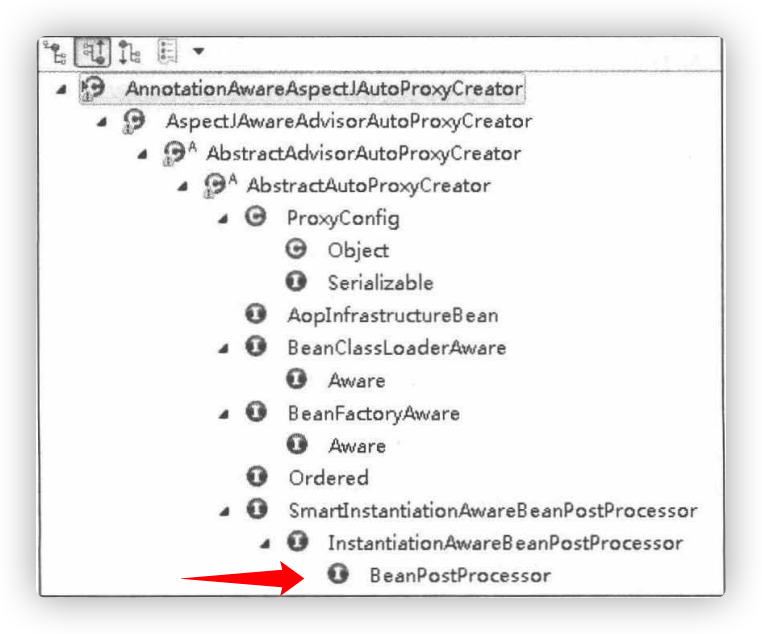<center/>

   ​	从中可以看出`AnnotationAwareAspectJAutoProxyCreator`实现了`BeanPostProcessor`接口，而实现`BeanPostProcessor`后，当`Spring`记载这个`Bean`时会在实例化前调用其`postProcessAfterInitialization`方法。
   
   **`AbstractAutoProxyCreator.postProcessAfterInitialization()`:**
   
   ```java
   public Object postProcessAfterInitialization(@Nullable Object bean, String beanName) throws BeansException {
      if (bean != null) {
        // 根据指定的bean的class和name构建出一个key，格式：beanClassName_beanName
         Object cacheKey = getCacheKey(bean.getClass(), beanName);
         if (this.earlyProxyReferences.remove(cacheKey) != bean) {
           // 如果它适合被代理，则需要封装指定bean
            return wrapIfNecessary(bean, beanName, cacheKey);
         }
      }
      return bean;
   }
   ```
   
   **`AbstractAutoProxyCreator.wrapIfNecessary()`:**
   
   ```java
   protected Object wrapIfNecessary(Object bean, String beanName, Object cacheKey) {
     // 如果已经处理过
      if (StringUtils.hasLength(beanName) && this.targetSourcedBeans.contains(beanName)) {
         return bean;
      }
     // 无须增强
      if (Boolean.FALSE.equals(this.advisedBeans.get(cacheKey))) {
         return bean;
      }
     // 给定的bean类是否代表基础设施类，基础设施类不应代理，或者配置了指定bean不需要自动代理
      if (isInfrastructureClass(bean.getClass()) || shouldSkip(bean.getClass(), beanName)) {
         this.advisedBeans.put(cacheKey, Boolean.FALSE);
         return bean;
      }
   
      // Create proxy if we have advice.
     // 如果存在增强方法则创建代理
      Object[] specificInterceptors = getAdvicesAndAdvisorsForBean(bean.getClass(), beanName, null);
     // 如果获取到了增强则需要针对增强创建代理
      if (specificInterceptors != DO_NOT_PROXY) {
         this.advisedBeans.put(cacheKey, Boolean.TRUE);
        // 创建代理
         Object proxy = createProxy(
               bean.getClass(), beanName, specificInterceptors, new SingletonTargetSource(bean));
         this.proxyTypes.put(cacheKey, proxy.getClass());
         return proxy;
      }
   
      this.advisedBeans.put(cacheKey, Boolean.FALSE);
      return bean;
   }
   ```
   
   ​	真正创建代理的代码是从`getAdvicesAndAdvisionForBean`开始的：
   
   1. 获取增强方法或者增强器。
   2. 根据获取的增强进行代理。