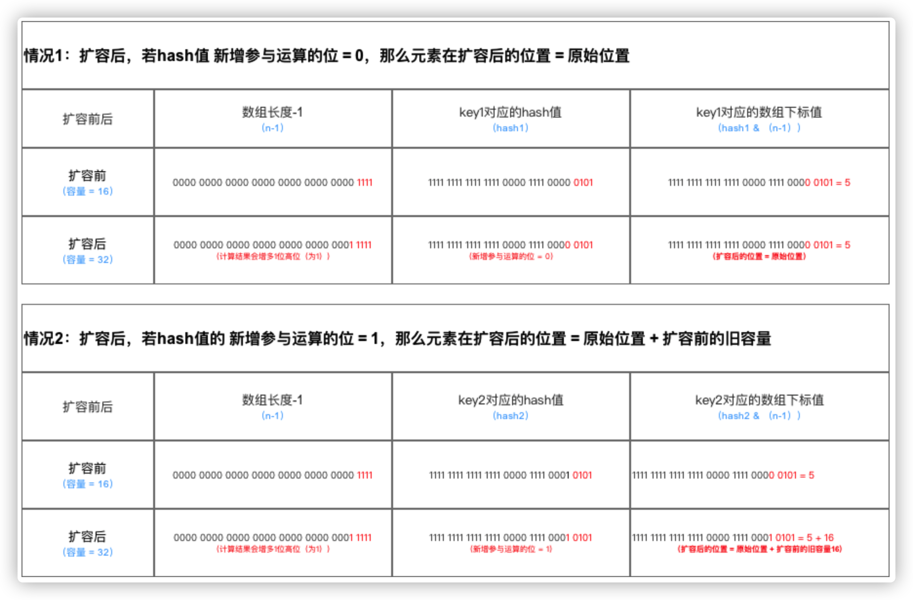
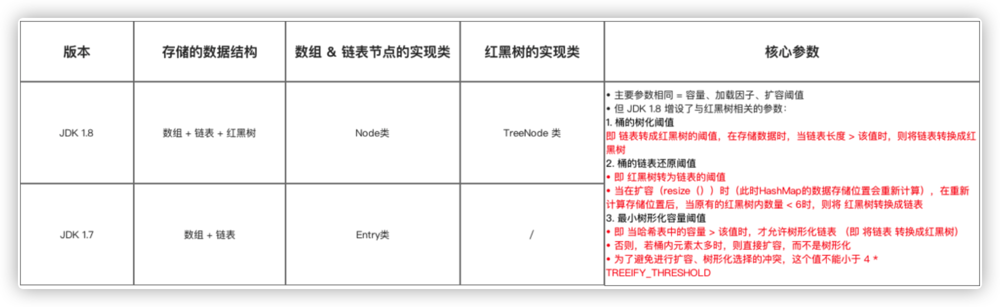
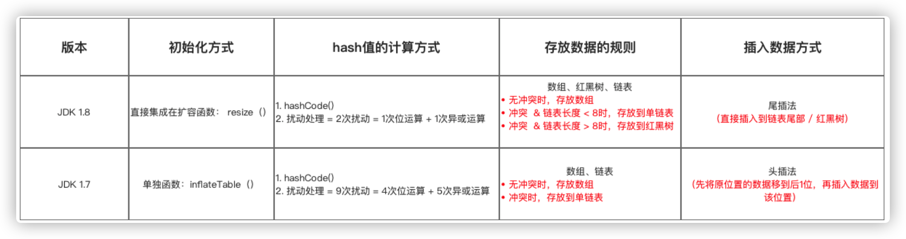
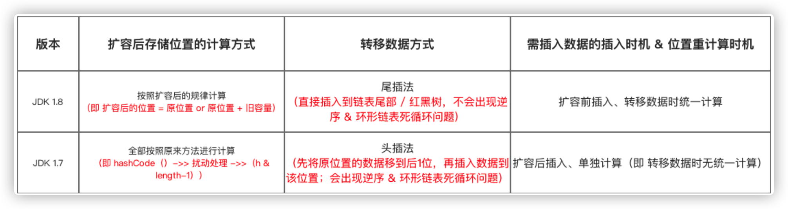
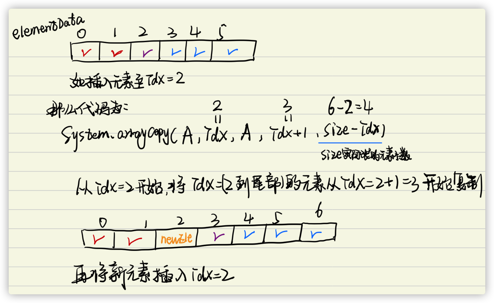
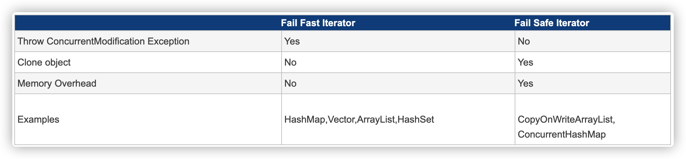

# HashMap_1.7

## 重要参数

1.7中没有关于红黑树的参数。

```java
public class HashMap<K,V> extends AbstractMap<K,V>
    implements Map<K,V>, Cloneable, Serializable {
    //序列号，序列化的时候使用。
    private static final long serialVersionUID = 362498820763181265L;
    /**
    	默认容量，1向左移位4个，00000001变成00010000，也就是2的4次方为16，
    	使用移位是因为移位是计算机基础运算，效率比加减乘除快。
    **/
    static final int DEFAULT_INITIAL_CAPACITY = 1 << 4;
    //最大容量，2的30次方。
    static final int MAXIMUM_CAPACITY = 1 << 30;
    //加载因子，用于扩容使用。
    static final float DEFAULT_LOAD_FACTOR = 0.75f;
    //当某个桶节点数量大于8时，会转换为红黑树。
    static final int TREEIFY_THRESHOLD = 8;
    //当某个桶节点数量小于6时，会转换为链表，前提是它当前是红黑树结构。
    static final int UNTREEIFY_THRESHOLD = 6;
    //当整个hashMap中元素数量大于64时，也会进行转为红黑树结构。
    static final int MIN_TREEIFY_CAPACITY = 64;
    //存储元素的数组，transient关键字表示该属性不能被序列化
    transient Node<K,V>[] table;
    //将数据转换成set的另一种存储形式，这个变量主要用于迭代功能。
    transient Set<Map.Entry<K,V>> entrySet;
    //元素数量
    transient int size;
    //统计该map修改的次数
    transient int modCount;
    //临界值，也就是元素数量达到临界值时，会进行扩容。
    int threshold;
    //也是加载因子，只不过这个是变量。
    final float loadFactor;  
```

## 构造函数

```java
public class HashMap<K,V>
      extends AbstractMap<K,V>
      implements Map<K,V>, Cloneable, Serializable{

    // 省略上节阐述的参数
    
  	/**
     * 构造函数1：默认构造函数（无参）
     * 加载因子 & 容量 = 默认 = 0.75、16
     */
    public HashMap() {
        // 实际上是调用构造函数3：指定“容量大小”和“加载因子”的构造函数
        // 传入的指定容量 & 加载因子 = 默认
        this(DEFAULT_INITIAL_CAPACITY, DEFAULT_LOAD_FACTOR); 
    }

    /**
     * 构造函数2：指定“容量大小”的构造函数
     * 加载因子 = 默认 = 0.75 、容量 = 指定大小
     */
    public HashMap(int initialCapacity) {
        // 实际上是调用指定“容量大小”和“加载因子”的构造函数
        // 只是在传入的加载因子参数 = 默认加载因子
        this(initialCapacity, DEFAULT_LOAD_FACTOR);
        
    }

    /**
     * 构造函数3：指定“容量大小”和“加载因子”的构造函数
     * 加载因子 & 容量 = 自己指定
     */
    public HashMap(int initialCapacity, float loadFactor) {

        // HashMap的最大容量只能是MAXIMUM_CAPACITY，哪怕传入的 > 最大容量
        if (initialCapacity > MAXIMUM_CAPACITY)
            initialCapacity = MAXIMUM_CAPACITY;

        // 设置 加载因子
        this.loadFactor = loadFactor;
        // 设置 扩容阈值 = 初始容量
        // 注：此处不是真正的阈值，是为了扩展table，该阈值后面会重新计算，下面会详细讲解  
        threshold = initialCapacity;   

        init(); // 一个空方法用于未来的子对象扩展
    }

    /**
     * 构造函数4：包含“子Map”的构造函数
     * 即 构造出来的HashMap包含传入Map的映射关系
     * 加载因子 & 容量 = 默认
     */

    public HashMap(Map<? extends K, ? extends V> m) {

        // 设置容量大小 & 加载因子 = 默认
        this(Math.max((int) (m.size() / DEFAULT_LOAD_FACTOR) + 1,
                DEFAULT_INITIAL_CAPACITY), DEFAULT_LOAD_FACTOR);

        // 该方法用于初始化 数组 & 阈值，下面会详细说明
        inflateTable(threshold);

        // 将传入的子Map中的全部元素逐个添加到HashMap中
        putAllForCreate(m);
    }
}

```

* 此处仅用于接收初始容量大小（`capacity`）、加载因子(`Load factor`)，但仍无真正初始化哈希表，即初始化存储数组`table`
* **真正初始化哈希表（初始化存储数组`table`）是在第1次添加键值对时，即第1次调用`put()`时。**

## `put()`

```java
    public V put(K key, V value)
				/** 
					若哈希表未初始化（即 table为空) 
          则使用构造函数时设置的阈值(即初始容量) 初始化 数组table  
         **/
        if (table == EMPTY_TABLE) { 
        	inflateTable(threshold); 
    		}  
        /** 
        	判断key是否为空值null
          若key == null，则将该键-值 存放到数组table中的第1个位置，即table[0]
          （本质：key = Null时，hash值 = 0，故存放到table[0]的那条链表中）
          该位置永远只有1个value，新传进来的value会覆盖旧的value
        **/
        if (key == null)
            return putForNullKey(value);

			 	/**
			 		若 key ≠ null，则计算存放数组 table 中的位置（下标、索引）
         	a. 根据键值key计算hash值
        **/
        int hash = hash(key);
        // b. 根据hash值 最终获得 key对应存放的数组Table中位置
        int i = indexFor(hash, table.length);

        // 判断该key对应的值是否已存在（通过遍历以该数组元素为头结点的链表逐个判断）
        for (Entry<K,V> e = table[i]; e != null; e = e.next) {
            Object k;
          // 若该key已存在（即 key-value已存在 ），则用 新value 替换 旧value
            if (e.hash == hash && ((k = e.key) == key || key.equals(k))) {
                V oldValue = e.value;
                e.value = value;
                e.recordAccess(this);
              // 并返回旧的value
                return oldValue; 
            }
        }

        modCount++;

				// 若该key不存在，则将“key-value”添加到table中
        addEntry(hash, key, value, i);
        return null;
    }

```


### 初始化哈希表`inflateTable()`

```java

     private void inflateTable(int toSize) {  
    
    /** 
    	将传入的容量大小转化为大于传入容量大小的最小的2的次幂
    	
     	即如果传入的是容量大小是19，那么转化后，初始化容量大小为32（即2的5次幂）
     **/
    int capacity = roundUpToPowerOf2(toSize);  

    // 重新计算阈值 threshold = 容量 * 加载因子  
    threshold = (int) Math.min(capacity * loadFactor, MAXIMUM_CAPACITY + 1);  

    /** 
    	使用计算后的初始容量（已经是2的次幂） 初始化数组table（作为数组长度）
     	即 哈希表的容量大小 = 数组大小（长度）
    **/
    table = new Entry[capacity]; //用该容量初始化table  

    initHashSeedAsNeeded(capacity);  
}  

    /**
     * roundUpToPowerOf2(toSize)
     * 作用：将传入的容量大小转化为大于传入容量大小的最小的2的幂
     * 特别注意：容量大小必须为2的幂，该原因在下面的讲解会详细分析
     */

     private static int roundUpToPowerOf2(int number) {  
   
       // 若容量超过了最大值，初始化容量设置为最大值 ；否则，设置为大于传入容量大小的最小的2的次幂
       return number >= MAXIMUM_CAPACITY  ? 
            MAXIMUM_CAPACITY  : (number > 1) ? Integer.highestOneBit((number - 1) << 1) : 1;  
     }
```

### 插入`key==null`

```java
// 源码分析：putForNullKey(value)
private V putForNullKey(V value) {
        /**
        	遍历以table[0]为首的链表，寻找是否存在key==null 对应的键值对
          若有：则用新value 替换 旧value；同时返回旧的value值
        **/
        for (Entry<K, V> e = table[0]; e != null; e = e.next) {
            if (e.key == null) {
                V oldValue = e.value;
                e.value = value;
                e.recordAccess(this);
                return oldValue;
            }
        }
        modCount++;

        /**
        	若无key==null的键，那么调用addEntry()，
        	将空键 & 对应的值封装到Entry中，并放到table[0]中
        **/
        addEntry(0, null, value, 0);
        /** 注：
          a. addEntry（）的第1个参数 = hash值 = 传入0
          b. 即 说明：当key = null时，也有hash值 = 0，所以HashMap的key 可为null
          c. 对比HashTable，由于HashTable对key直接hashCode（），
          若key为null时，会抛出异常，所以HashTable的key不可为null
          d. 此处只需知道是将 key-value 添加到HashMap中即可，
          关于addEntry()的源码分析将等到下面再详细说明，
        **/
        return null;

    }
```

- `HashMap`的键`key` 可为`null`（区别于 `HashTable`的`key` 不可为`null`）。
- `HashMap`的键`key` 可为`null`且只能为1个，但值`value`可为`null`且为多个。

### 计算`tab`下标

```java

        // a. 根据键值key计算hash值
        int hash = hash(key);
        // b. 根据hash值 最终获得 key对应存放的数组Table中位置
        int i = indexFor(hash, table.length);

   /**
      源码分析1：hash(key)
      该函数在JDK 1.7 和 1.8 中的实现不同，
      但原理一样 = 扰动函数 = 使得根据key生成的哈希码（hash值）分布更加均匀、更具备随机性，
      避免出现hash值冲突（即指不同key但生成同1个hash值）
      JDK 1.7 做了9次扰动处理 = 4次位运算 + 5次异或运算
      JDK 1.8 简化了扰动函数 = 只做了2次扰动 = 1次位运算 + 1次异或运算
     **/

     /** 
     	JDK 1.7实现：将 键key 转换成 
     	哈希码（hash值）操作  = 使用hashCode() + 4次位运算 + 5次异或运算（9次扰动）
     **/
     static final int hash(int h) {
        h ^= k.hashCode(); 
        h ^= (h >>> 20) ^ (h >>> 12);
        return h ^ (h >>> 7) ^ (h >>> 4);
     }

      /** 
      	JDK 1.8实现：将 键key 转换成 
      	哈希码（hash值）操作 = 使用hashCode() + 1次位运算 + 1次异或运算（2次扰动）
       1. 取hashCode值： h = key.hashCode() 
       2. 高位参与低位的运算：h ^ (h >>> 16)  
      **/
      static final int hash(Object key) {
           int h;
        /** 
        	a. 当key = null时，hash值 = 0，所以HashMap的key 可为null      
          注：对比HashTable，HashTable对key直接hashCode（），若key为null时，
          会抛出异常，所以HashTable的key不可为null
          b. 当key ≠ null时，则通过先计算出 key的 hashCode()（记为h），
          然后 对哈希码进行 扰动处理： 按位 异或（^） 哈希码自身右移16位后的二进制
        **/
           return (key == null) ? 0 : (h = key.hashCode()) ^ (h >>> 16);
     }

   		/**
      	函数源码分析2：indexFor(hash, table.length)
      	JDK 1.8中实际上无该函数，但原理相同，即具备类似作用的函数
    	**/
      static int indexFor(int h, int length) { 
        /**
        	将对哈希码扰动处理后的结果 与运算(&) （数组长度-1），
        	最终得到存储在数组table的位置（即数组下标、索引）
        **/
          return h & (length-1); 
      }
}

```

**所有处理的根本目的，都是为了提高 存储`key-value`的数组下标位置的随机性 & 分布均匀性，尽量避免出现hash值冲突**。即：对于不同`key`，存储的数组下标位置要尽可能不一样。

1. 为什么不直接采用经过`hashCode（）`处理的哈希码 作为 存储数组`table`的下标位置？

   ​	*容易出现哈希码与数组大小范围不匹配的情况，即 计算出来的哈希码可能 不在数组大小范围内，从而导致无法匹配存储位置*

2. 为什么采用 哈希码 **与运算(&)** （数组长度-1） 计算数组下标？

   ​	*根据`HashMap`的容量大小（数组长度），按需取 哈希码一定数量的低位作为存储的数组下标位置，从而 解决 “哈希码与数组大小范围不匹配”的问题*

   ​	*数组长度总是为2的幂，那么对其做`&`运算，就等价于取模运算。*

3. 为什么在计算数组下标前，需对哈希码进行二次处理：扰动处理？

   ​	*加大哈希码低位的随机性，使得分布更均匀，从而提高对应数组存储下标位置的随机性 `&` 均匀性，最终减少`Hash`冲突*

### 数据插入与扩容

#### 添加元素`addEntry()`

先扩容，再插入。

```java
void addEntry(int hash, K key, V value, int bucketIndex) {
        // 参数3 = 插入数组table的索引位置 = 数组下标

        /**
         插入前，先判断容量是否足够
         若不足够，则进行扩容（2倍）、重新计算Hash值、重新计算存储数组下标
         **/
        if ((size >= threshold) && (null != table[bucketIndex])) {
            // a. 扩容2倍
            resize(2 * table.length);
            // b. 重新计算该Key对应的hash值
            hash = (null != key) ? hash(key) : 0;
            // c. 重新计算该Key对应的hash值的存储数组下标位置
            bucketIndex = indexFor(hash, table.length);
        }
  	// 若容量足够，则创建1个新的数组元素（Entry） 并放入到数组中
  		createEntry(hash, key, value, bucketIndex);  
    }
```


#### 创建元素`createEntry()`

```java
void createEntry(int hash, K key, V value, int bucketIndex) { 

    // 把table中该位置原来的Entry保存  
    Entry<K,V> e = table[bucketIndex];

    /**
    	在table中该位置新建一个Entry：将原头结点位置（数组上）的键值对
    	放入到（链表）后1个节点中、将需插入的键值对 放入到头结点中（数组上）-> 从而形成链表
    	即 在插入元素时，是在链表头插入的，table中的每个位置永远只保存最新插入的Entry，
    	旧的Entry则放入到链表中（即 解决Hash冲突）
    **/
    table[bucketIndex] = new Entry<>(hash, key, value, e);  

    // 哈希表的键值对数量计数增加
    size++;  
}  
```


#### 扩容`resize()`

```java
void resize(int newCapacity) {  
    
    // 保存旧数组（old table） 
    Entry[] oldTable = table;  

    // 保存旧容量（old capacity ），即数组长度
    int oldCapacity = oldTable.length; 

    // 若旧容量已经是系统默认最大容量了，那么将阈值设置成整型的最大值，退出    
    if (oldCapacity == MAXIMUM_CAPACITY) {  
        threshold = Integer.MAX_VALUE;  
        return;  
    }  
  
    // 根据新容量（2倍容量）新建1个数组，即新table  
    Entry[] newTable = new Entry[newCapacity];  

    // 将旧数组上的数据（键值对）转移到新table中，从而完成扩容
    transfer(newTable); 

    // 新数组table引用到HashMap的table属性上
    table = newTable;  

    // 重新设置阈值  
    threshold = (int)(newCapacity * loadFactor); 
} 
```


### 转移`transfer()`

```java
void transfer(Entry[] newTable) {
      // src引用了旧数组
      Entry[] src = table; 

      // 获取新数组的大小 = 获取新容量大小                 
      int newCapacity = newTable.length;

      // 通过遍历 旧数组，将旧数组上的数据（键值对）转移到新数组中
      for (int j = 0; j < src.length; j++) { 
      	  // 取得旧数组的每个元素  
          Entry<K,V> e = src[j];           
          if (e != null) {
              // 释放旧数组的对象引用（for循环后，旧数组不再引用任何对象）
              src[j] = null; 

              do { 
                  /** 
                  	遍历以该数组元素为首 的链表
                  	注：转移链表时，因是单链表，故要保存下1个结点，否则转移后链表会断开
             			**/
                  Entry<K,V> next = e.next; 
                 // 重新计算每个元素的存储位置
                 int i = indexFor(e.hash, newCapacity); 
                 /** 
                 	将元素放在数组上：采用单链表的头插入方式 = 在链表头上存放数据 = 将数组位置的原有
                 	数据放在后1个指针、将需放入的数据放到数组位置中
                 	即 扩容后，可能出现逆序：按旧链表的正序遍历链表、在新链表的头部依次插入
                 **/
                 e.next = newTable[i]; 
                 newTable[i] = e;  
                 // 访问下1个Entry链上的元素，如此不断循环，直到遍历完该链表上的所有节点
                 e = next;             
             } while (e != null);
             // 如此不断循环，直到遍历完数组上的所有数据元素
         }
     }
 }
```


## `get()`

类似于`put()`。

```java

public V get(Object key) {  

    /**
    	当key == null时，则到 以哈希表数组中的第1个元素（即table[0]）为头结点的链表
    	去寻找对应 key == null的键
    **/
    if (key == null)  
        return getForNullKey();

    // 当key ≠ null时，去获得对应值
    Entry<K,V> entry = getEntry(key);
  
    return null == entry ? null : entry.getValue();  
}  


 	/**
    当key == null时，则到 以哈希表数组中的第1个元素（即table[0]）
    为头结点的链表去寻找对应 key == null的键
   **/ 
private V getForNullKey() {  

    if (size == 0) {  
        return null;  
    }  

    // 遍历以table[0]为头结点的链表，寻找 key==null 对应的值
    for (Entry<K,V> e = table[0]; e != null; e = e.next) {  

        // 从table[0]中取key==null的value值 
        if (e.key == null)  
            return e.value; 
    }  
    return null;  
}  
 
// 当key ≠ null时，去获得对应值
final Entry<K,V> getEntry(Object key) {  

    if (size == 0) {  
        return null;  
    }  

    // 根据key值，通过hash（）计算出对应的hash值
    int hash = (key == null) ? 0 : hash(key);  

    /**
    	根据hash值计算出对应的数组下标遍历 以该数组下标的数组元素为头结点的链表所有节点，
    	寻找该key对应的值
    **/
    for (Entry<K,V> e = table[indexFor(hash, table.length)];  e != null;  e = e.next) {  

        Object k;  
        /** 
        	若hash值 & key 相等，则证明该Entry = 我们要的键值对
         通过equals（）判断key是否相等
        **/
        if (e.hash == hash &&  
            ((k = e.key) == key || (key != null && key.equals(k))))  
            return e;  
    }  
    return null;  
}  
```

[参考](https://blog.csdn.net/carson_ho/article/details/79373026)


# `HashMap_1.8`

## 重要参数

[HashMap_1.7_重要参数](#重要参数)


## 构造函数

```java
		/**
     * 构造函数1：默认构造函数（无参）
     * 加载因子 & 容量 = 默认 = 0.75、16
     */	
		public HashMap() {
        this.loadFactor = DEFAULT_LOAD_FACTOR;
    }

    
		/**
     * 构造函数2：指定“容量大小”的构造函数
     * 加载因子 = 默认 = 0.75 、容量 = 指定大小
     */
    public HashMap(int initialCapacity) {
        // 实际上是调用指定“容量大小”和“加载因子”的构造函数
        // 只是在传入的加载因子参数 = 默认加载因子
        this(initialCapacity, DEFAULT_LOAD_FACTOR);

    }

		/**
     * 构造函数3：指定“容量大小”和“加载因子”的构造函数
     * 加载因子 & 容量 = 自己指定
     */
    public HashMap(int initialCapacity, float loadFactor) {

        // 指定初始容量必须非负，否则报错  
        if (initialCapacity < 0)
            throw new IllegalArgumentException("Illegal initial capacity: " +
                    initialCapacity);

        // HashMap的最大容量只能是MAXIMUM_CAPACITY，哪怕传入的 > 最大容量
        if (initialCapacity > MAXIMUM_CAPACITY)
            initialCapacity = MAXIMUM_CAPACITY;

        // 填充比必须为正  
        if (loadFactor <= 0 || Float.isNaN(loadFactor))
            throw new IllegalArgumentException("Illegal load factor: " +
                    loadFactor);
        // 设置 加载因子
        this.loadFactor = loadFactor;

        // 设置 扩容阈值
        // 注：此处不是真正的阈值，仅仅只是将传入的容量大小转化为：>传入容量大小的最小的2的幂，该阈值后面会重新计算
        this.threshold = tableSizeFor(initialCapacity);

    }


		/**
     * 构造函数4：包含“子Map”的构造函数
     * 即 构造出来的HashMap包含传入Map的映射关系
     * 加载因子 & 容量 = 默认
     */
    public HashMap(Map<? extends K, ? extends V> m) {

        // 设置容量大小 & 加载因子 = 默认
        this.loadFactor = DEFAULT_LOAD_FACTOR;

        // 将传入的子Map中的全部元素逐个添加到HashMap中
        putMapEntries(m, false);
    }


		/**
     * 作用：将传入的容量大小转化为：>传入容量大小的最小的2的幂
     * 与JDK 1.7对比：类似于JDK 1.7 中 inflateTable()里的 roundUpToPowerOf2(toSize)
     */
    static final int tableSizeFor(int cap) {
        int n = cap - 1;
        n |= n >>> 1;
        n |= n >>> 2;
        n |= n >>> 4;
        n |= n >>> 8;
        n |= n >>> 16;
        return (n < 0) ? 1 : (n >= MAXIMUM_CAPACITY) ? MAXIMUM_CAPACITY : n + 1;
    }
```

1. 此处仅用于接收初始容量大小（`capacity`）、加载因子(`Load factor`)，但仍无真正初始化哈希表，即初始化存储数组`table`
2. 此处先给出结论：**真正初始化哈希表（初始化存储数组`table`）是在第1次添加键值对时，即第1次调用`put（）`时。**

## `put()`

```java
public V put(K key, V value) {
    	/** 
    		1. 对传入数组的键Key计算Hash值，通过hash()
     		2. 再调用putVal()添加数据进去
  		**/
     return putVal(hash(key), key, value, false, true);
}
```

### `hash()`

```java
			/** 
      	JDK 1.8实现：将 键key 转换成 
      	哈希码（hash值）操作 = 使用hashCode() + 1次位运算 + 1次异或运算（2次扰动）
       1. 取hashCode值： h = key.hashCode() 
       2. 高位参与低位的运算：h ^ (h >>> 16)  
      **/
      static final int hash(Object key) {
           int h;
        /** 
        	a. 当key = null时，hash值 = 0，所以HashMap的key 可为null      
          注：对比HashTable，HashTable对key直接hashCode（），若key为null时，
          会抛出异常，所以HashTable的key不可为null
          b. 当key ≠ null时，则通过先计算出 key的 hashCode()（记为h），
          然后 对哈希码进行 扰动处理： 按位 异或（^） 哈希码自身右移16位后的二进制
        **/
           return (key == null) ? 0 : (h = key.hashCode()) ^ (h >>> 16);
     }
```

[HashMap_1.7的hash](#初始化哈希表`inflateTable()`)

### `putVal()`

```java
final V putVal(int hash, K key, V value, boolean onlyIfAbsent,
                   boolean evict) {

        Node<K, V>[] tab;
        Node<K, V> p;
        int n, i;

        /**
        	若哈希表的数组tab为空，则 通过resize() 创建
         	所以，初始化哈希表的时机 = 第1次调用put函数时，即调用resize() 初始化创建
        **/
        if ((tab = table) == null || (n = tab.length) == 0)
            n = (tab = resize()).length;

        /**
        	计算插入存储的数组索引i：根据键值key计算的hash值 得到
         	此处的数组下标计算方式 = i = (n - 1) & hash，同JDK 1.7中的indexFor()
        **/

        /**
        	插入时，需判断是否存在Hash冲突：
        	若不存在（即当前t·able[i] == null），则直接在该数组位置新建节点，插入完毕
        	否则，代表存在Hash冲突，即当前存储位置已存在节点，
        	则依次往下判断：
        		a. 当前位置的key是否与需插入的key相同;
        		b. 判断需插入的数据结构是否为红黑树 or 链表
        **/
        if ((p = tab[i = (n - 1) & hash]) == null)
          // newNode(hash, key, value, null)的源码 = new Node<>(hash, key, value, next)
            tab[i] = newNode(hash, key, value, null);  
        else {
            Node<K, V> e;
            K k;

            /** 
            	a. 判断 table[i]的元素的key是否与 需插入的key一样，
            	若相同则 直接用新value 覆盖 旧value
            	判断原则：equals（）
            **/
            if (p.hash == hash &&
                    ((k = p.key) == key || (key != null && key.equals(k))))
                e = p;

                /** 
                	b. 继续判断：需插入的数据结构是否为红黑树 or 链表
                 	若是红黑树，则直接在树中插入 or 更新键值对
                **/
            else if (p instanceof TreeNode)
                e = ((TreeNode<K, V>) p).putTreeVal(this, tab, hash, key, value); 

            /** 
            	若是链表,则在链表中插入 or 更新键值对
             i.  遍历table[i]，判断Key是否已存在：
        	采用equals()对比当前遍历节点的key与需插入数据的key：若已存在，则直接用新value覆盖旧value
             ii. 遍历完毕后仍无发现上述情况，则直接在链表尾部插入数据
             注：新增节点后，需判断链表长度是否>8（8 = 桶的树化阈值）：若是，则把链表转换为红黑树
        **/
        else{
                for (int binCount = 0; ; ++binCount) {
                    /**
                    	对于ii：若数组的下1个位置，表示已到表尾也没有找到key值相同节点，
                    	则新建节点 = 插入节点
                      注：此处是从链表尾插入，与JDK 1.7不同
                      （从链表头插入，即永远都是添加到数组的位置，原来数组位置的数据则往后移）
                    **/
                    if ((e = p.next) == null) {
                        p.next = newNode(hash, key, value, null);

                        // 插入节点后，若链表节点数>树化阈值，则将链表转换为红黑树
                        if (binCount >= TREEIFY_THRESHOLD - 1)
                            treeifyBin(tab, hash); // 树化操作
                        break;
                    }

                    // 对于i
                    if (e.hash == hash &&
                            ((k = e.key) == key || (key != null && key.equals(k))))
                        break;

                    // 更新p指向下一个节点，继续遍历
                    p = e;
                }
            }

            /**
            	对i情况的后续操作：发现key已存在，直接用新value 覆盖 旧value & 返回旧value
            	为null则说明成功插入红黑树中
            **/
            if (e != null) {
                V oldValue = e.value;
                if (!onlyIfAbsent || oldValue == null)
                    e.value = value;
                afterNodeAccess(e); // 替换旧值时会调用的方法（默认实现为空）
                return oldValue;
            }
        }

        ++modCount;

        // 插入成功后，判断实际存在的键值对数量size > 最大容量threshold
        if (++size > threshold)
            resize();

        afterNodeInsertion(evict);// 插入成功时会调用的方法（默认实现为空）
        return null;

    }

    /**
     * 作用：向红黑树插入 or 更新数据（键值对）
     * 过程：遍历红黑树判断该节点的key是否与需插入的key 相同：
     * a. 若相同，则新value覆盖旧value
     * b. 若不相同，则插入
     */

    final TreeNode<K, V> putTreeVal(HashMap<K, V> map, Node<K, V>[] tab,
                                    int h, K k, V v) {
        Class<?> kc = null;
        boolean searched = false;
        TreeNode<K, V> root = (parent != null) ? root() : this;
        for (TreeNode<K, V> p = root; ; ) {
            int dir, ph;
            K pk;
            if ((ph = p.hash) > h)
                dir = -1;
            else if (ph < h)
                dir = 1;
            else if ((pk = p.key) == k || (k != null && k.equals(pk)))
                return p;
            else if ((kc == null &&
                    (kc = comparableClassFor(k)) == null) ||
                    (dir = compareComparables(kc, k, pk)) == 0) {
                if (!searched) {
                    TreeNode<K, V> q, ch;
                    searched = true;
                    if (((ch = p.left) != null &&
                            (q = ch.find(h, k, kc)) != null) ||
                            ((ch = p.right) != null &&
                                    (q = ch.find(h, k, kc)) != null))
                        return q;
                }
                dir = tieBreakOrder(k, pk);
            }

            TreeNode<K, V> xp = p;
            if ((p = (dir <= 0) ? p.left : p.right) == null) {
                Node<K, V> xpn = xp.next;
                TreeNode<K, V> x = map.newTreeNode(h, k, v, xpn);
                if (dir <= 0)
                    xp.left = x;
                else
                    xp.right = x;
                xp.next = x;
                x.parent = x.prev = xp;
                if (xpn != null)
                    ((TreeNode<K, V>) xpn).prev = x;
                moveRootToFront(tab, balanceInsertion(root, x));
                return null;
            }
        }
    }
```


### 扩容`resize()`

```java
	
	// 该函数有2种使用情况：1.初始化哈希表 2.当前数组容量过小，需扩容
   final Node<K,V>[] resize() {
    // 扩容前的数组（当前数组）
    Node<K,V>[] oldTab = table; 
    // 扩容前的数组的容量 = 长度
    int oldCap = (oldTab == null) ? 0 : oldTab.length; 
    // 扩容前的数组的阈值
    int oldThr = threshold;
    int newCap, newThr = 0;

    /**
    	针对情况2：若扩容前的数组容量超过最大值，则不再扩充
    	说明table扩容过，不是初始化
    **/
    if (oldCap > 0) {
      // 当前table容量大于最大值的时候返回当前table
        if (oldCap >= MAXIMUM_CAPACITY) {
            threshold = Integer.MAX_VALUE;
            return oldTab;
        }
        // 针对情况2：若无超过最大值，就扩充为原来的2倍
        else if ((newCap = oldCap << 1) < MAXIMUM_CAPACITY &&
                 oldCap >= DEFAULT_INITIAL_CAPACITY)
            newThr = oldThr << 1; // 通过左移扩充2倍
    }

    /**
    	 针对情况1：初始化哈希表（采用指定 or 默认值）
    	 初始化，使用带初始容量的构造器
    **/
    else if (oldThr > 0) // initial capacity was placed in threshold
        newCap = oldThr;
	
    // 默认构造器下进行扩容
    else {               // zero initial threshold signifies using defaults
        newCap = DEFAULT_INITIAL_CAPACITY;
        newThr = (int)(DEFAULT_LOAD_FACTOR * DEFAULT_INITIAL_CAPACITY);
    }

    // 计算新的resize上限，使用带初始容量的构造器
    if (newThr == 0) {
        float ft = (float)newCap * loadFactor;
        newThr = (newCap < MAXIMUM_CAPACITY && ft < (float)MAXIMUM_CAPACITY ?
                  (int)ft : Integer.MAX_VALUE);
    }

    threshold = newThr;
    @SuppressWarnings({"rawtypes","unchecked"})
        Node<K,V>[] newTab = (Node<K,V>[])new Node[newCap];
    table = newTab;

    if (oldTab != null) {
        // 把每个bucket都移动到新的buckets中
        for (int j = 0; j < oldCap; ++j) {
            Node<K,V> e;
            if ((e = oldTab[j]) != null) {
                oldTab[j] = null;

                if (e.next == null)
                    newTab[e.hash & (newCap - 1)] = e;
                else if (e instanceof TreeNode)
                  // 是否要拆分红黑树（链表长度小于6）
                    ((TreeNode<K,V>)e).split(this, newTab, j, oldCap);

                else { 
                  	// 链表优化重hash的代码块
                  	/**
                  		使用两个链表，一个存索引改变的节点，另一个存节点未变的节点。
                  		一个bucket下的节点只有两种索引的可能
                  		1. 等于原索引
                  		2. 等于原索引+oldCap
                  	**/
                    Node<K,V> loHead = null, loTail = null;
                    Node<K,V> hiHead = null, hiTail = null;
                    Node<K,V> next;
                    do {
                        next = e.next;
                      	// 尾插
                        // 原索引（位置不要变）
                        if ((e.hash & oldCap) == 0) {
                            if (loTail == null)
                                loHead = e;
                            else
                                loTail.next = e;
                            loTail = e;
                        }
                        // 原索引 + oldCap（位置改变）
                        else {
                            if (hiTail == null)
                                hiHead = e;
                            else
                                hiTail.next = e;
                            hiTail = e;
                        }
                    } while ((e = next) != null);
                    // 原索引放到bucket里
                    if (loTail != null) {
                        loTail.next = null;
                        newTab[j] = loHead;
                    }
                    // 原索引+oldCap放到bucket里
                  	// 其他oldBucket中的不会与它冲突j+oldCap随着j变化不会重复
                    if (hiTail != null) {
                        hiTail.next = null;
                        newTab[j + oldCap] = hiHead;
                    }
                }
            }
        }
    }
    return newTab;
}
```

索引变化原理：



## `get()`

```java

   public V get(Object key) {
    Node<K,V> e;
    // 1. 计算需获取数据的hash值
    // 2. 通过getNode（）获取所查询的数据 ->>分析1
    // 3. 获取后，判断数据是否为空
    return (e = getNode(hash(key), key)) == null ? null : e.value;
}

/**
   * 分析1：getNode(hash(key), key))
   */ 
final Node<K,V> getNode(int hash, Object key) {
    Node<K,V>[] tab; Node<K,V> first, e; int n; K k;

    // 1. 计算存放在数组table中的位置
    if ((tab = table) != null && (n = tab.length) > 0 &&
        (first = tab[(n - 1) & hash]) != null) {

        // 4. 通过该函数，依次在数组、红黑树、链表中查找（通过equals（）判断）
        // a. 先在数组中找，若存在，则直接返回
        if (first.hash == hash && // always check first node
            ((k = first.key) == key || (key != null && key.equals(k))))
            return first;

        // b. 若数组中没有，则到红黑树中寻找
        if ((e = first.next) != null) {
            // 在树中get
            if (first instanceof TreeNode)
                return ((TreeNode<K,V>)first).getTreeNode(hash, key);

            // c. 若红黑树中也没有，则通过遍历，到链表中寻找
            do {
                if (e.hash == hash &&
                    ((k = e.key) == key || (key != null && key.equals(k))))
                    return e;
            } while ((e = e.next) != null);
        }
    }
    return null;
}

```

# `HashMap_1.7 1.8`对比

## 数据结构




## 数据变化



## 扩容



# `ArrayList`

## 重要参数

```java
public class ArrayList<E> extends AbstractList<E>
        implements List<E>, RandomAccess, Cloneable, java.io.Serializable
{
    // 版本号
    private static final long serialVersionUID = 8683452581122892189L;
    // 缺省容量
    private static final int DEFAULT_CAPACITY = 10;
    // 空对象数组
    private static final Object[] EMPTY_ELEMENTDATA = {};
    // 缺省空对象数组
    private static final Object[] DEFAULTCAPACITY_EMPTY_ELEMENTDATA = {};
    // 元素数组
    transient Object[] elementData;
    // 实际元素大小，默认为0
    private int size;
    // 最大数组容量
    private static final int MAX_ARRAY_SIZE = Integer.MAX_VALUE - 8;
}
```


## 构造方法

```java
		/**
			这里就说明了默认会给10的大小，所以说一开始arrayList的容量是10.
　　	ArrayList中储存数据的其实就是一个数组，这个数组就是elementData，
　　	在123行定义的 private transient Object[] elementData;
　　	**/
　　 public ArrayList() {　
     		//调用父类中的无参构造方法，父类中的是个空的构造方法
        super();      
     	/**
     		EMPTY_ELEMENTDATA：是个空的Object[]， 将elementData初始化，
     		elementData也是个Object[]类型。空的Object[]会给默认大小10，等会会解释什么时候赋值的。
     	**/
        this.elementData = EMPTY_ELEMENTDATA;
    }


		/**
			设置初始容量
			但实际上并不会初始化，size并没有被设置，依然是0，在set时，会rangeCheck
			if (index > size || index < 0)   
            throw new IndexOutOfBoundsException(outOfBoundsMsg(index));
      所以会抛出异常
			可以创建一个collection，使用第三种构造方法初始化
		**/
    public ArrayList(int initialCapacity) {
      	// 父类中空的构造方法
        super(); 
      	// 判断如果自定义大小的容量小于0，则报下面这个非法数据异常
        if (initialCapacity < 0)    
            throw new IllegalArgumentException("Illegal Capacity: "+
                                               initialCapacity);
      	// //将自定义的容量大小当成初始化elementData的大小
        this.elementData = new Object[initialCapacity]; 
    }

    	/**
    		这个构造方法不常用，举个例子就能明白什么意思
        Strudent exends Person
         ArrayList<Person>、 Person这里就是泛型
        我还有一个Collection<Student>、由于这个Student继承了Person，
        那么根据这个构造方法，我就可以把这个Collection<Student>转换为ArrayList<Sudent>
        这就是这个构造方法的作用 
    	**/
     public ArrayList(Collection<? extends E> c) {
       // 转换为数组
        elementData = c.toArray(); 
       // 数组中的数据个数
        size = elementData.length;   
        /**
        	每个集合的toarray()的实现方法不一样，所以需要判断一下，
        	如果不是Object[].class类型，那么久需要使用ArrayList中的方法去改造一下。
        	比如：
        		java.util.Arrays的内部ArrayList的toArray()方法，
        		是构造方法接收什么类型的数组，就返回什么类型的数组。
        **/
        if (elementData.getClass() != Object[].class) 
            elementData = Arrays.copyOf(elementData, size, Object[].class);
    }
```

**`ArrayList`的构造方法就做一件事情，就是初始化一下储存数据的容器，其实本质上就是一个`Object`数组，在其中就叫`elementData`**。

## `add_1()`

```java
		// 添加一个特定的元素到list的末尾
    public boolean add(E e) {
        /**
         	确定内部容量是否够了，size是数组中数据的个数，因为要添加一个元素，所以size+1，
         	先判断size+1的这个个数数组能否放得下，就在这个方法中去判断是否数组.length是否够用了。
         **/
        ensureCapacityInternal(size + 1);
        // 在数据中正确的位置上放上元素e，并且size++
        elementData[size++] = e;
        return true;
    }
```

### `ensureCapacityInternal()`

确定内部容量。

```java
private void ensureCapacityInternal(int minCapacity) {
        // 判断初始化的elementData是不是空的数组，也就是没有长度
        if (elementData == EMPTY_ELEMENTDATA) {
            /**
             *  因为如果是空的话，minCapacity=size+1；其实就是等于1，
             		空的数组没有长度就存放不了，所以就将minCapacity变成10，
             *  也就是默认大小，但是带这里，还没有真正的初始化这个elementData的大小。
             **/
            minCapacity = Math.max(DEFAULT_CAPACITY, minCapacity);
        }
        // 确认实际的容量，上面只是将minCapacity=10，这个方法就是真正的判断elementData是否够用
        ensureExplicitCapacity(minCapacity);
    }
```


### `ensurExplicitCapacity()`

确定实际的容量。

```java
private void ensureExplicitCapacity(int minCapacity) {
        modCount++;
        if (minCapacity - elementData.length > 0)
    				//	arrayList能自动扩展大小的关键方法就在这里了
            grow(minCapacity);
    }
```

`minCapacity`如果大于了实际`elementData`的长度，那么就说明`elementData`数组的长度不够用，不够用那么就要增加`elementData`的`length`。

* 第一种情况：由于`elementData`初始化时是空的数组，那么第一次`add`的时候，`minCapacity=size+1`；也就`minCapacity=1`，在上一个方法(确定内部容量`ensureCapacityInternal`)就会判断出是空的数组，就会将`minCapacity=10`，到这一步为止，还没有改变`elementData`的大小。
* 第二种情况：`elementData`不是空的数组了，那么在`add`的时候，`minCapacity=size+1`；也就是`minCapacity`代表着`elementData`中增加之后的实际数据个数，拿着它判断`elementData`的`length`是否够用，如果`length`不够用，那么肯定要扩大容量，不然增加的这个元素就会溢出。


### `grow()`

`ArrayList`扩容方法。

```java
private void grow(int minCapacity) {
        // 将扩充前的elementData大小给oldCapacity
        int oldCapacity = elementData.length;  
  			// newCapacity就是1.5倍的oldCapacity
        int newCapacity = oldCapacity + (oldCapacity >> 1);
				/**
					这句话就是适应于elementData就空数组的时候，length=0，那么oldCapacity=0，	
					newCapacity=0，所以这个判断成立，在这里就是真正的初始化elementData的大小了，
					就是为10.前面的工作都是准备工作。
				**/
        if (newCapacity - minCapacity < 0)
            newCapacity = minCapacity;
  			/**
  				如果newCapacity超过了最大的容量限制，就调用hugeCapacity，
  				也就是将能给的最大值给newCapacity
  			**/
        if (newCapacity - MAX_ARRAY_SIZE > 0)
            newCapacity = hugeCapacity(minCapacity);
    		// 新的容量大小已经确定好了，就copy数组，改变容量大小。
        elementData = Arrays.copyOf(elementData, newCapacity);
    }
```


### 	`hugeCapacity()`

```java
//这个就是上面用到的方法，很简单，就是用来赋最大值。
    private static int hugeCapacity(int minCapacity) {
        if (minCapacity < 0) // overflow
            throw new OutOfMemoryError();
      /**
      	如果minCapacity都大于MAX_ARRAY_SIZE，那么就Integer.MAX_VALUE返回，
      	反之将MAX_ARRAY_SIZE返回。因为maxCapacity是三倍的minCapacity，
      	可能扩充的太大了，就用minCapacity来判断了。
      	Integer.MAX_VALUE:2147483647   MAX_ARRAY_SIZE：2147483639  
      	也就是说最大也就能给到第一个数值。还是超过了这个限制，就要溢出了。相当于arraylist给了两层防护。
      **/
        return (minCapacity > MAX_ARRAY_SIZE) ?
            Integer.MAX_VALUE :
            MAX_ARRAY_SIZE;
    }
```


## `add_2()`

```java
public void add(int index, E element) {
  			// 检查index也就是插入的位置是否合理。
        rangeCheckForAdd(index);

				// 跟上面的分析一样，具体看上面
        ensureCapacityInternal(size + 1);  // Increments modCount!!
				// 这个方法就是用来在插入元素之后，要将index之后的元素都往后移一位，
        System.arraycopy(elementData, index, elementData, index + 1,
                         size - index);
				// 在目标位置上存放元素
        elementData[index] = element;
  			// size增加1
        size++;
    }
```

`System.arraycopy()`：

```java
public static void arraycopy(Object src, int srcPos, Object dest, int destPos, int length)
 
Object src : 原数组
int srcPos : 从元数据的起始位置开始
Object dest : 目标数组
int destPos : 目标数组的开始起始位置
int length  : 要copy的数组的长度(包括srcPos这个元素)
```

所以：

`System.arraycopy(elementData, index, elementData, index + 1,size - index);`



### `rangeCheckForAdd()`

```java
 private void rangeCheckForAdd(int index) {
   			/**
   				插入的位置肯定不能大于size 和小于0
   				如果是，就报这个越界异常
   			**/
        if (index > size || index < 0)   
            throw new IndexOutOfBoundsException(outOfBoundsMsg(index));
    }
```

## `remove(int)`

删除指定位置上的元素。

```java
public E remove(int index) {
  			// 检查index的合理性
        rangeCheck(index);
				
				// 这个作用很多，比如用来检测快速失败的一种标志。
        modCount++;	
        // 通过索引直接找到该元素
        E oldValue = elementData(index);

  			// 计算要移动的位数。
        int numMoved = size - index - 1;
        if (numMoved > 0)
            System.arraycopy(elementData, index+1, elementData, index,
                             numMoved);
				// 将--size上的位置赋值为null，让gc(垃圾回收机制)更快的回收它。
        elementData[--size] = null; 
				// 返回删除的元素。
        return oldValue;
    }
```


## `remove(Object)`

```java
/**
	通过元素来删除该元素，就依次遍历，如果有这个元素，就将该元素的索引传给fastRemobe(index)，
	使用这个方法来删除该元素，
	fastRemove(index)方法的内部跟remove(index)的实现几乎一样，
	这里最主要是知道arrayList可以存储null值
**/
public boolean remove(Object o) {
    if (o == null) {
        for (int index = 0; index < size; index++)
            if (elementData[index] == null) {
                fastRemove(index);
                return true;
            }
    } else {
        for (int index = 0; index < size; index++)
            if (o.equals(elementData[index])) {
                fastRemove(index);
                return true;
            }
    }
    return false;
}
```


## `clear()`

将`elementData`中每个元素都赋值为`null`，等待垃圾回收将这个给回收掉，所以叫`clear`。

```java
public void clear() {
    modCount++;
    for (int i = 0; i < size; i++)
        elementData[i] = null;
    size = 0;
}
```


## `removeAll()`

```java
public boolean removeAll(Collection<?> c) {
  	// 批量删除
    return batchRemove(c, false);
}
```


### `batchRemove()`

```java
	/**
			这个方法，用于两处地方，如果complement为false，则用于removeAll如果为true，则给retainAll()				用，retainAll（）是用来检测两个集合是否有交集的。
	**/
   private boolean batchRemove(Collection<?> c, boolean complement) {
        final Object[] elementData = this.elementData; //将原集合，记名为A
        int r = 0, w = 0;   //r用来控制循环，w是记录有多少个交集
        boolean modified = false;  
        try {
            for (; r < size; r++)
								// 参数中的集合C一次检测集合A中的元素是否有，
                if (c.contains(elementData[r]) == complement)
										// 有的话，就给集合A
                    elementData[w++] = elementData[r];
        } finally {
						// 如果contains方法使用过程报异常
            if (r != size) {
								// 将剩下的元素都赋值给集合A，
                System.arraycopy(elementData, r,
                                 elementData, w,
                                 size - r);
                w += size - r;
            }
            if (w != size) {
              /**
              	这里有两个用途，在removeAll()时，w一直为0，就直接跟clear一样，全是为null。
              	retainAll()：没有一个交集返回true，有交集但不全交也返回true，
              	而两个集合相等的时候，返回false，所以不能根据返回值来确认两个集合是否有交集，而是通过
              	原集合的大小是否发生改变来判断，如果原集合中还有元素，则代表有交集，而元集合没有元素
              	了，说明两个集合没有交集。
              **/
                for (int i = w; i < size; i++)
                    elementData[i] = null;
                modCount += size - w;
                size = w;
                modified = true;
            }
        }
        return modified;
    }
```

`remove`函数用户移除指定下标的元素，此时会把指定下标到数组末尾的元素向前移动一个单位，并且会把数组最后一个元素设置为`null`，这样是为了方便之后将整个数组不被使用时，会被`GC`，可以作为小的技巧使用。


## `set()`

```java
public E set(int index, E element) {
    // 检验索引是否合法
    rangeCheck(index);
    // 旧值
    E oldValue = elementData(index);
    // 赋新值
    elementData[index] = element;
    // 返回旧值
    return oldValue;
}
```


## `indexOf()`

```java
// 从首开始查找数组里面是否存在指定元素
public int indexOf(Object o) {
    if (o == null) { // 查找的元素为空
        for (int i = 0; i < size; i++) // 遍历数组，找到第一个为空的元素，返回下标
            if (elementData[i] == null)
                return i;
    } else { // 查找的元素不为空
        for (int i = 0; i < size; i++) // 遍历数组，找到第一个和指定元素相等的元素，返回下标
            if (o.equals(elementData[i]))
                return i;
    }
    // 没有找到，返回空
    return -1;
}
```


## `get()`

```java
public E get(int index) {
    // 检验索引是否合法
    rangeCheck(index);
    return elementData(index);
}
```


* `arrayList`可以存放`null`。
* `arrayList`本质上就是一个`elementData`数组。
* `arrayList`区别于数组的地方在于能够自动扩展大小，其中关键的方法就是`gorw()`方法。
* `arrayList`中`removeAll`(`collection c`)和`clear()`的区别就是`removeAll`可以删除批量指定的元素，而`clear`是全是删除集合中的元素。
* `arrayList`由于本质是数组，所以它在数据的查询方面会很快，而在插入删除这些方面，性能下降很多，有移动很多数据才能达到应有的效果
* `arrayList`实现了`RandomAccess`，所以在遍历它的时候推荐使用`for`循环。

# `Fail-Fast`与`Fail-Safe`



## `Fail-Fast`

以`ArrayList`为例。

快速失败机制，是java集合(`Collection`)中的一种错误检测机制。当在迭代集合的过程中该集合在结构上发生改变的时候，就有可能会发生`fail-fast`，即抛出 `ConcurrentModificationException`异常。**`fail-fast`机制并不保证在不同步的修改下一定会抛出异常，它只是尽最大努力去抛出，所以这种机制一般仅用于检测bug。**

### 单线程下的`fail-fast`

```java
public static void main(String[] args) {
        ConcurrentHashMap<String, Integer> map = new ConcurrentHashMap<>();
        map.entrySet();
        List<String> list = new ArrayList<>();
        for (int i = 0; i < 10; i++) {
            list.add(i + "");
        }
        Iterator<String> iterator = list.iterator();
        int i = 0;
        while (iterator.hasNext()) {
          if (i == 3) {
//              list.set(i, "change");
              list.remove(i);
          }
          iterator.next();
          ++i;
        }
        System.out.println(list);
    }

// 抛出异常
Exception in thread "main" java.util.ConcurrentModificationException
	at java.util.ArrayList$Itr.checkForComodification(ArrayList.java:911)
	at java.util.ArrayList$Itr.next(ArrayList.java:861)
	at com.wx.FastFail.main(FastFail.java:21)
```

### 多线程环境下

```java
public class FailFastTest {
     public static List<String> list = new ArrayList<>();
 
     private static class MyThread1 extends Thread {
           @Override
           public void run() {
                Iterator<String> iterator = list.iterator();
                while(iterator.hasNext()) {
                     String s = iterator.next();
                     System.out.println(this.getName() + ":" + s);
                     try {
                    Thread.sleep(1000);
                } catch (InterruptedException e) {
                    e.printStackTrace();
                }
                }
                super.run();
           }
     }
 
     private static class MyThread2 extends Thread {
           int i = 0;
           @Override
           public void run() {
                while (i < 10) {
                     System.out.println("thread2:" + i);
                     if (i == 2) {
                           list.remove(i);
                     }
                     try {
                    Thread.sleep(1000);
                } catch (InterruptedException e) {
                    e.printStackTrace();
                }
                     i ++;
                }
           }
     }
 
     public static void main(String[] args) {
           for(int i = 0 ; i < 10;i++){
            list.add(i+"");
        }
           MyThread1 thread1 = new MyThread1();
           MyThread2 thread2 = new MyThread2();
           thread1.setName("thread1");
           thread2.setName("thread2");
           thread1.start();
           thread2.start();
     }
}
```

这里异常的抛出条件是检测到 `modCount != expectedmodCount` 这个条件。如果集合发生变化时修改`modCount`值刚好又设置为了`expectedmodCount`值，则异常不会抛出。

### 原理

集合如`list`，`map`类，都可以通过迭代器来遍历，而`Iterator`其实只是一个接口，具体的实现还是要看具体的集合类中的内部类去实现`Iterator`并实现相关方法。

**`List.iterator()`:**

```java
public Iterator<E> iterator() {
    return new Itr();
}
```

实现

**`ArrayList.itertor()`:**

```java
    /**
     * An optimized version of AbstractList.Itr
     */
    private class Itr implements Iterator<E> {
        int cursor;       // index of next element to return
        int lastRet = -1; // index of last element returned; -1 if no such
        int expectedModCount = modCount;
 
        public boolean hasNext() {
            return cursor != size;
        }
 
        @SuppressWarnings("unchecked")
        public E next() {
          // 检查modCount是否变化
            checkForComodification();
            int i = cursor;
            if (i >= size)
                throw new NoSuchElementException();
            Object[] elementData = ArrayList.this.elementData;
            if (i >= elementData.length)
                throw new ConcurrentModificationException();
            cursor = i + 1;
            return (E) elementData[lastRet = i];
        }
 
        public void remove() {
            if (lastRet < 0)
                throw new IllegalStateException();
            checkForComodification();
 
            try {
                ArrayList.this.remove(lastRet);
                cursor = lastRet;
                lastRet = -1;
                expectedModCount = modCount;
            } catch (IndexOutOfBoundsException ex) {
                throw new ConcurrentModificationException();
            }
        }
 
        @Override
        @SuppressWarnings("unchecked")
        public void forEachRemaining(Consumer<? super E> consumer) {
            Objects.requireNonNull(consumer);
            final int size = ArrayList.this.size;
            int i = cursor;
            if (i >= size) {
                return;
            }
            final Object[] elementData = ArrayList.this.elementData;
            if (i >= elementData.length) {
                throw new ConcurrentModificationException();
            }
            while (i != size && modCount == expectedModCount) {
                consumer.accept((E) elementData[i++]);
            }
            // update once at end of iteration to reduce heap write traffic
            cursor = i;
            lastRet = i - 1;
            checkForComodification();
        }
 
      // 判断是否并发修改
        final void checkForComodification() {
          // 实际值与期望值不等，则肯定发生了修改；反之则不成立，有可能两次修改后将值改正确了
            if (modCount != expectedModCount)
                throw new ConcurrentModificationException();
        }
    }
```

迭代器在遍历时直接访问集合中的内容，并且在遍历过程中使用一个 `modCount` 变量。

集合在被遍历期间如果内容发生变化，就会改变`modCount`的值。

每当迭代器使用`hashNext()` or `next()`遍历下一个元素之前，都会检测`modCount`变量是否为`expectedmodCount`值，是的话就返回遍历；否则抛出异常，终止遍历。


## `Fail-Safe`

`fail-safe`任何对集合结构的修改都会在一个复制的集合上进行修改，因此不会抛出`ConcurrentModificationException`。

`fail-safe`机制有两个问题

1. 需要复制集合，产生大量的无效对象，开销大。
2. 无法保证读取的数据是目前原始数据结构中的数据。

