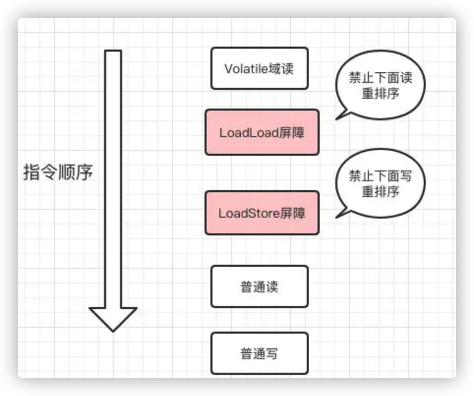
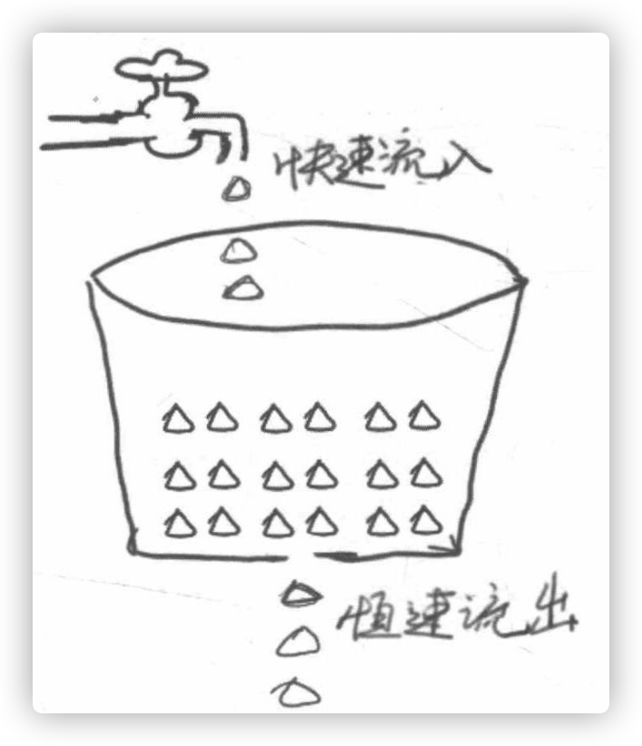
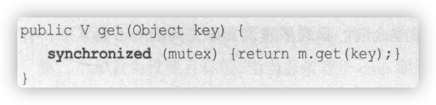
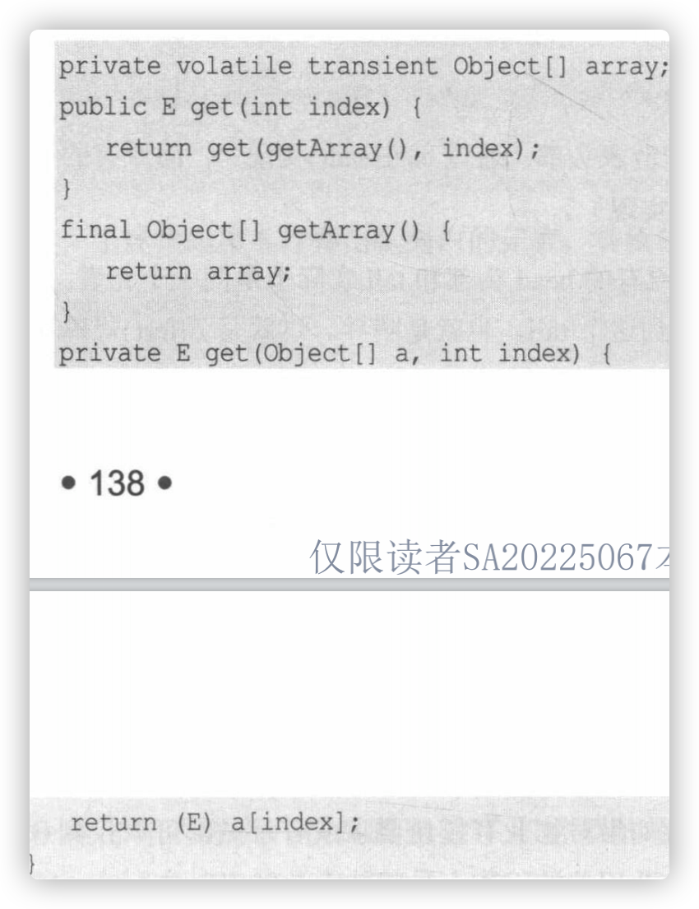
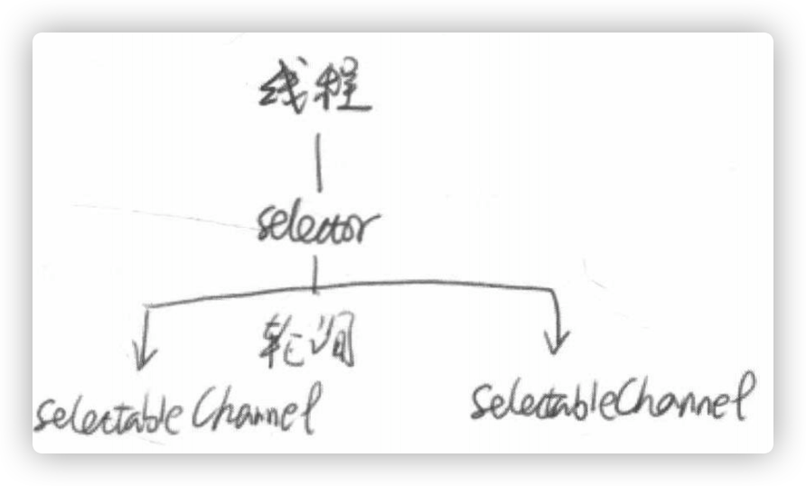

## Chapter 1

### 活锁 

电梯开门是，两人相互谦让，结果都堵着出不来。这种情况发生在两个线程之间就不会如此幸运。如果线程的智力不够，且都是“谦让”的策略，主动释放资源给他人使用，那么就会导致资源不断地在两个线程间跳动，而没有一个线程可以同时拿到所有资源正常执行。

### 并发级别

* 阻塞：一个线程是阻塞的，那么在其他线程释放资源之前，当前线程无法继续执行。

* 无饥饿：非公平锁（锁之间存在优先级）会允许高优先级线程“插队”。如果锁是公平的，那么所有线程都不会饥饿，都会有机会执行。

* 无障碍：是最弱的非阻塞调度。两个线程如果无障碍的执行，那么不会因为临界区问题导致一方被挂起。**如果数据被改坏，无障碍线程一旦检测到这种情况，它就会立即对自己所做的修改进行回滚，确保数据安全。**

  > ​	一种可行的无障碍实现可以依赖一个“一致性标记”来实现。线程在操作前，先读取并保存这个标记，这个操作完成之后，再次读取并检查这个标记是否被更改过，如果没有，那么说明资源的访问是没有冲突的；否则说明资源可能在操作过程中与其他写线程冲突了，需要重试操作

* 无锁：无锁的并行都是无障碍的。在无锁的情况下，所有线程都尝试对临界区进行访问，不同的是，**无锁的并发保证必然有一个线程能够在有限步内完成操作离开临界区。**（CAS）

  > ​		“有限步”：与之相反的是“无限步”，这在CAS当中是有可能的，会存在这么一个线程，它不断的比较原始值并失败，那么他会不断的重试，陷入死循环，导致饥饿。

* 无等待：无锁只要求有一个线程可以在有限步内完成操作，而无等待则在无锁的基础上更进一步扩展。它要求所有的线程必须在有限步内完成，这样就不会引起饥饿。

  > ​	如果限制这个步骤的上限，还可以进一步分解为**有界等待**和**线程数无关的无等待**等。

### Amdahl定律

可以推出**仅仅增加CPU处理器的数量并不一定能起到有效的作用。**需要从根本上修改程序的串行行为，提高系统内可并行化的模块比重。即仅提高CPU数量而不降低程序的串行化比例，也无法提高系统的性能

> $T_n$：处理器个数
>
> $F$：串行比例，那么$(1-F)$就是并行比例
> $$
> T_n=T_1 \times (F + \frac{1}{n}(1-F))\\
> 				那么加速比=\frac{T_1}{T_n}\\=\frac{T_1}{T_1(F+\frac{1}{n}(1-F))}\\
> 					=\frac{1}{F+\frac{1}{1-F}}
> $$

### Gustafason定律

推出**如果可被并行化的代码所占比例做够大，那么加速比就能随着CPU的数量线性增长。**

### JMM（Java Memory Model）

关键技术点都是围绕多线程的原子性、可见性和有序性来建立的

* 原子性（`Atomicity`）：**指一个操作是不可被中断的。**即使是在多个线程一起执行的时候，一个操作一旦开始，就不会被其他线程干扰。

* 可见性（`Visibility`）：**当一个线程修改了某一个共享变量的值时，其他线程是否能够立即知道这个修改。**

  > ​	缓存优化、硬件优化、指令重排（P22）会出现会导致可见性问题

  

* 有序性（`Ordering`）：三个问题中最难解决。**如果在本线程内观察，所有操作都是有序的；如果在另一个线程中观察，所有操作都是无序的。**对于一个线程的执行代码而言，我们总是习惯性地认为代码是从前往后一次执行的。但是在并发时，程序的执行就可能出现乱序（写在前面的代码，会在后面执行）。这是由于指令重排导致的**指令重排可以保证串行语义一致，但是没有义务保证多线程间的语义一致。**

  

### `volatile`与`JMM`


在Java虚拟机规范中，试图定义一种Java内存模型(Java Memory Model, JMM)来屏蔽各个硬件平台和操作系统的内存访问差异，以实现让Java程序在各种平台下都能达到一致的内存访问效果。

JMM规定所有变量都是存在主存当中，每个线程都有自己的工作内存。线程对变量的所有操作都必须在工作内存中进行，而不能直接对主存进行操作，并且每个线程不能访问其他线程的工作内存，线程间变量值的传递需要通过主内存来完成。

Java内存屏障主要有`Load`和`Store`两类。

* 对`Load Barrier`来说，在读指令前插入读屏障，可以让高速缓存中的数据失效，重新从主内存加载数据。
* 对`Store Barrier`来说，在写指令之后插入写屏障，能让写入缓存的最新数据写回到主内存。

组合之后：

* **LoadLoad 屏障** 
  序列：Load1,Loadload,Load2 
  确保Load1所要读入的数据能够在被Load2和后续的load指令访问前读入。通常能执行预加载指令或/和支持乱序处理的处理器中需要显式声明Loadload屏障，因为在这些处理器中正在等待的加载指令能够绕过正在等待存储的指令。 而对于总是能保证处理顺序的处理器上，设置该屏障相当于无操作。
* **StoreStore 屏障** 
  序列：Store1，StoreStore，Store2 
  确保Store1的数据在Store2以及后续Store指令操作相关数据之前对其它处理器可见（例如向主存刷新数据）。通常情况下，如果处理器不能保证从写缓冲或/和缓存向其它处理器和主存中按顺序刷新数据，那么它需要使用StoreStore屏障。
* **LoadStore 屏障** 
  序列： Load1; LoadStore; Store2 
  确保Load1的数据在Store2和后续Store指令被刷新之前读取。在等待Store指令可以越过loads指令的乱序处理器上需要使用LoadStore屏障。
* **StoreLoad 屏障** 
  序列: Store1; StoreLoad; Load2 
  确保Store1的数据在被Load2和后续的Load指令读取之前对其他处理器可见。StoreLoad屏障可以防止一个后续的load指令 不正确的使用了Store1的数据，而不是另一个处理器在相同内存位置写入一个新数据。正因为如此，所以在下面所讨论的处理器为了在屏障前读取同样内存位置存过的数据，必须使用一个StoreLoad屏障将存储指令和后续的加载指令分开。Storeload屏障在几乎所有的现代多处理器中都需要使用，但通常它的开销也是最昂贵的。它们昂贵的部分原因是它们必须关闭通常的略过缓存直接从写缓冲区读取数据的机制。这可能通过让一个缓冲区进行充分刷新（flush）,以及其他延迟的方式来实现。

Java中内存屏障的使用：

* 通过`Synchronized`关键字包住的代码区域，当线程进入到该区域读取变量信息时，保证读到的是最新的值。这是因为在同步区内对变量的写入操作，**在离开同步区时就将当前线程内的数据刷新到内存中,而对数据的读取也不能从缓存读取,只能从内存中读取**，保证了数据的读有效性。这就是插入了`StoreStore`屏障。
*  使用了`volatile`修饰变量,则对变量的写操作，会插入`StoreLoad`屏障。
* 其余的操作，则需要通过`Unsafe`这个类来执行。
      `UNSAFE.putOrderedObject`类似这样的方法，会插入`StoreStore`内存屏障 。
      `Unsafe.putVolatiObject` 则是插入了`StoreLoad`屏障。

**`volatile`的两层语意：**

* 保证了不同线程对共享变量进行操作时的可见性，即一个线程修改了某个变量的值，这个新值对其他线程来说是立即可见的；
* 禁止进行指令重排。

**`volatile`保证可见性：**

加入`volatile`关键字时，会多出一个`lock`前缀指令，`lock`前缀指令相当于一个**内存屏障**。

**写**：

​	<center></center>

**读**：

​		<center></center>

> * 在每个`volatile`写操作的前面插入一个`StoreStore`屏障。
> * 在每个`volatile`写操作的后面插入一个`StoreLoad`屏障。
> * 在每个`volatile`读操作的后面插入一个`LoadLoad`屏障。
> * 在每个`volatile`读操作的后面插入一个`LoadStore`屏障。

* 执行到内存屏障这句指令时，前面的操作已经全部完成；

* 会强制将修改的值（本处理器缓存）写入主存，会导致别的`CPU`或者内核无效化缓存，其他线程再去读时，由于缓存失效，会重新从主存读取；

  * 写回操作时要经过总线传播数据，此时其他处理器会通过`嗅探`在总线上传播的数据来检查自己缓存的值是否过期，过期就会将之设置为无效状态，会强制重新从系统内存中把数据读到自己的缓存中。

    > `嗅探`时`缓存一致性协议`的一种，即不停的查看总线上传输的数据，来进行判断。会造成`总线风暴`。并且缓存一致性机制会阻止同时修改由两个以上CPU缓存的内存区域数据。

**volatile使用场景：**

* 对变量的写操作不依赖当前值。

  > ​	如：i++会先读取i的值，然后对i加1，再写回i，此时利用了i之前的值。

* 该变量没有包含在具有其他变量的不变式中。

  > ​	不包含在复合操作中。

JMM原子性、有序性和可见性展开的。Java使用了一些特殊的操作或者关键字来声明、告诉虚拟机，**不能随意变动优化目标指令。**关键字`volatile`就是其中之一。

​	`volatale`：应用程序范围内的所有线程都能够“看到”这个改动，**但是它并不能代替锁，它也无法保证一些复合操作的原子性**（如`i++`）

* 写：当写一个`volatile`变量时，JMM会把线程对应的本地内存中的共享变量值刷新到主内存。
* 读：当读一个`volatile`变量时，JMM会把该线程对应的本地内存置为无效。重新从主内存读取共享变量

### `Happen-Before`规则（哪些指令不能重排）

* 程序顺序原则：一个线程内保证语义的串行性。
* `volatile`规则：`volatile`变量的写必然先于读发生，这保证了`volatile`变量的可见性。
* 锁规则：解锁（`unlock`）必然发生在**随后的**加锁（`lock`）前。
* 传递性：A先于B，B先于C，那么A必然先于C。
* 线程的`start()`先于它的每一个动作。
* 线程的所有操作先于线程的终结（`Thread.join()`）。
* 线程的中断（`interrupt()`）先于被中断线程的代码。
* 对象的构造函数的执行、结束优先于`finalize()`。

## Chapter 2

### 线程的生命周期


* `NEW`：线程刚刚创建，等到`start()`调用才表示线程才开始执行。
* `RUNNAMBLE`：线程所需要的一切资源都已经准备好了。
* `BLOCKED`：线程在执行过程中遇到`synchronized`同步块，就会进入`BLOCKED`状态。
* `WAITING`、`TIMED_WATING`：都表示等待状态，`WAITING`会进入无时间限制的等待，`TIME_WATING`会进入一个有时限的等待。

### 终止线程

* `stop()`：过于暴力，强行把执行到一半的线程终止，可能会引起数据不一致的问题。

  > ​	使用valotile修饰的标记变量可以有效退出

* 线程中断：一套自有的机制完善的线程退出的功能。

  ​	严格来讲，线程中断并不会使线程立即退出，而是给线程发送一个通知，告知线程，有人希望它退出。至于目标线程接收到通知后如何处理，则完全由目标线程自行决定。（若收到中断后无条件退出，那么这与`stop`无异）

  ```java
  public void Thread.interrupt(); // 中断当前线程
  // 有一个中断标记，通过这个方法可以访问到，来判断是否被中断（即收到Thread.interrupt()）
  public boolean Thread.isInterrupted(); 
  public static boolean Thread.interrupted(); // 判断是否被中断，并清除中断标记
  ```

`Thread.sleep()`会抛出一个`InterruptedException`中断异常，即在线程休眠时，如果对它发生中断信号，那么就会抛出这个异常。

  > `Thread.sleep()`方法由于中断而抛出异常，此时它会清除中断标记，如果不加处理，那么在下一次判断中断时，就无法捕获这个中断。

### 等待（wait）和通知（notify）

`wait()`、`notify()`并不是`Thread`类中的，而是属于`Object`类，这就意味着任何对象都可以调用这两个方法。

> 有个共享对象obj，有多个线程对obj上锁。当有线程A调用obj.wait()（这个方法不能随便调用，必须包含在synchronized语句中）时，A会进入obj的一个等待队列（这个队列里可能有多个线程等着），若有一个线程B调用obj.notify()时，系统会从obj的等待队列中**随机**唤醒一个等待的线程（`notifyAll()`时唤醒全部等待的线程），因为是随机唤醒，就说明它是不公平的。而且这个线程被唤醒后依然要尝试获得obj的锁（即监视器）。
>	
> `synchronized`会获得obj的监视器，`wait()`会释放obj的监视器（那么其他线程就可以获得这个监视器即资源（obj）），这也是`wait()`与`sleep()`的区别，前者会释放资源，后者仍然会占有资源。

### 挂起（suspend）和继续执行（resume）线程

这两个操作是一对相反的操作，被挂起的线程，必须要等到`resume()`方法操作，才能继续指定。（已废弃）

> **`suspend()`方法在导致线程暂停的同时，并不会释放任何锁资源**，此时任何线程想要访问被它占用的锁时，都会被牵连，导致无法继续正常运行。**直到对应的线程上进行了`resume()`操作，被挂起的线程才能继续**，从而其他所有阻塞在相关锁上的线程也可以继续执行。但是，**如果`resume()`操作意外地在`suspend()`之前就执行了，那么被挂起的线程可能很难有机会继续执行**，且被挂起的线程的状态依然是**`Runnable()`**，影响判断。

### 等待线程结束（join）和谦让（yield）

很多时候，一个线程的输入可能非常依赖于另外一个或者多个线程的输出，此时，这个线程就需要等待依赖线程执行完毕，才能继续执行。

```java
// 无限等待，一直阻塞当前线程，直到目标线程执行完毕（如让主线程等待目标线程执行完成）
public final void join() throws InterruptedException;
// 等待mills，如果超过mills目标线程还在执行，当前线程不会再等待而继续运行
public final synchronized void join(long mills) throws InterruptedException;
```

> ​	`join()`的（在`main`中调用`t.join()`）本质是让调用线程(`main thread`)在当前线程对象（`t`）上进行等待，当线程执行完成后，被等待的线程（`t`）会在退出前调用`notifyAll()`方法通知所有的等待线程继续执行。

***

```java
public static native void yield();
```

这是一个静态方法，一旦执行，它会使当前线程让出`CPU`（进入就绪态，所以不会让出锁资源）。但是，让出`CPU`并不表示当前线程就不执行了。当前线程在让出`CPU`后，还会进行`CPU`资源的争夺，但是是否能够再次被分配到就不一定了。因此，对`Thread.yield()`方法的调用就好像是在说“已经完成一些重要的工作了，可以给其他线程一些工作时间了”。

如果觉得一个线程不那么重要，或者优先级非常低，而且又害怕它占用太多`CPU`资源，那么可以在合适的时候调用`Thread.yield()`方法，给予其他重要线程更多的工作机会。

### 线程组

```java
ThreadGroup tg = new ThreadGroup("group_name");
// 指定线程所属的线程组
Thread t1 = new Thread(tg, new ThreadGroupName(), "t1");
Thread t2 = new Thread(tg, new ThreadGroupName(), "t2");
```

### 守护线程（Daemon）

系统的守护者，**在后台默默的完成一些系统性的任务**，如垃圾回收线程、JIT线程。与之对应的是**用户线程**，即系统的工作线程。

### 线程的优先级

```java
Thread t = new XXThread();
t.setPriority(Thread.MAX_PRIORITY)// 1～10
```

### 线程安全与`synchronized`

实现线程间的同步，对同步的代码加锁，是的每一次，只能有一个线程进入同步块，从而保证线程间的安全性。

保证有序性、可见性、原子性。

> 有序性：排他锁、`as-if-serial`;
>
> ​	*不管怎么重排序，单线程程序的执行结果不能被改变。编译器、runtime和处理器都必须遵守as-if-serial语义*
>
> 可见性：内存屏障[可见性保证](#与)；
>
> 原子性：实现原子性需要多个线程之间使用相同的对象锁。这样临界区里所有的代码就可以看做一个原子操作。

用法

* 指定加锁**对象**：对给定对象加锁，进入同步代码前要获得**给定的对象的锁。**

  ```java
  SynObject obj = new SynObject();
  synchronized(obj){
    // do something
  }
  ```

* 直接作用于**实例方法**：相当于对当前实例加锁，进入同步代码前要**获得当前实例的锁。**

  ```java
  public synchronized void methodA(){
    // do something
  }
  ```

  ```java
  // 使用同一对象去访问，结果是同步的
  Demo demo = new Demo();
  new Thread(() -> demo.methodA()).start();
  new Thread(() -> demo.methodA()).start();
  ```

  ```java
  // 使用不同对象去访问，结果可能不同步
  Demo demo = new Demo();
  new Thread(() -> demo.methodA()).start();
  Demo demo2 = new Demo();
  new Thread(() -> demo2.methodA()).start();
  ```

  

* 直接作用于**静态方法**：相当于对当前类加锁，进入同步代码前要**获得当前类的锁。**

  ```java
  public static synchronized void methodA(){
    // do something
  }
  ```

  ```java
  // 使用不同对象去访问，但结果肯定同步，它们都是同一个类
  Demo demo = new Demo();
  new Thread(() -> demo.methodA()).start();
  Demo demo2 = new Demo();
  new Thread(() -> demo2.methodA()).start();
  ```


#### 底层原理

`Synchronized`不论是修饰方法还是代码块，都是通过持有修饰对象的锁来实现同步的，这个锁对象存在于对象头的`MarkWord`中。


在`HotSpot`中，对象的监视器`monitor`锁对象由`OjectMonitor`对象实现(C++)：

```c++
ObjectMonitor() {
    _count        = 0; //用来记录该对象被线程获取锁的次数
    _waiters      = 0;
    _recursions   = 0; //锁的重入次数
    _owner        = NULL; //指向持有ObjectMonitor对象的线程 
    _WaitSet      = NULL; //处于wait状态的线程，会被加入到_WaitSet
    _WaitSetLock  = 0 ;
    _EntryList    = NULL ; //处于等待锁block状态的线程，会被加入到该列表
  }
```

线程获取锁的几种状态：


被`synchronized`修饰的方法：

* 当多个线程并发访问该方法时，这些线程会先进入`_EntryList`队列，此时线程处于`Blocking`状态。
* 当一个线程获取到了实例对象的监视器`monitor`锁，那么就可以进入`Running`状态，执行方法体，此时`ObjectMonitor`对象的`_Owner`指向当前线程，`_Count`加一，表示当前对象锁被一个线程获取。
* 当`Running`状态的线程调用`wait()`，那么当前线程释放对象监视器`monitor`锁，进入`Waiting`状态，`_Owner`变为`null`并且`_Count`减一，同时线程进入`_WaitSet`队列，直到有线程调用`notify()`or`notifyAll()`唤醒该线程，则该线程重新进入`_Owner`区。（即`Runnable`状态）。
* 如果当前对象执行完毕，那么也释放对象监视器`monitor`，进入`Waiting`状态，`ObjectMonitor`对象的`_Owner`变为`null`且`_Count`减一。

***

几种同步方法的反编译文件：

* 同步代码块

  ``` java
  public class SyncCodeBlock {
     public int i;
     public void syncTask(){
         synchronized (this){
             i++;
         }
     }
  }
  ```

  ```java
    public void syncTask();
      descriptor: ()V
      flags: ACC_PUBLIC // 表明是public修饰
      Code:
        stack=3, locals=3, args_size=1
           0: aload_0
           1: dup
           2: astore_1
           3: monitorenter  //注意此处，获得锁，进入同步方法
           4: aload_0
           5: dup
           6: getfield      #2             // Field i:I
           9: iconst_1
          10: iadd
          11: putfield      #2            // Field i:I
          14: aload_1
          15: monitorexit   //注意此处，释放锁，退出同步方法
          16: goto          24 // 正常执行，跳转到line24 return
          19: astore_2
          20: aload_1
          21: monitorexit //注意此处，发生异常，释放锁，退出同步方法
          22: aload_2
          23: athrow
          24: return
        Exception table:
        //省略其他字节码.......
  ```

* 修饰方法：

  ```java
  public class SyncMethod {
     public int i;
     public synchronized void syncTask(){
             i++;
     }
  }
  ```

  ```java
  public synchronized void syncTask();
      descriptor: ()V
      // 方法标识ACC_PUBLIC代表public修饰，ACC_SYNCHRONIZED指明该方法为同步方法
      flags: ACC_PUBLIC, ACC_SYNCHRONIZED
      Code:
        stack=3, locals=1, args_size=1
           0: aload_0
           1: dup
           2: getfield      #2                  // Field i:I
           5: iconst_1
           6: iadd
           7: putfield      #2                  // Field i:I
          10: return
        LineNumberTable:
          line 12: 0
          line 13: 10
  }
  ```

  ​	可以看出方法开始和结束的地方都没有出现`monitorentry`和`monitorexit`指令，但是出现的`ACC_SYNCHRONIZED`标志位。<font face="宋体" color=red>表示方法加锁了，可以在常量池中获取到锁对象。</font>

### 并发下的`ArrayList`

```java
class ArrayListMutilThread{
  static Arraylist<Integer> a = new ArrayList<>(10);
  public static class AddThread implements Runnable {
    @Override
    public void run(){
      for (int i=0; i < 10000; ++i) {
        a.add(i);
      }
    }
  }
  public static void main(String args[]) {
    Thread t1 = new Thread(new AddThread());
    Thread t2 = new Thread(new AddThread());
    t1.start();
    t2.start();
  }
}
```

结果会有三种：

* 程序正常。
* 抛出**java.lang.ArrayIndexOutOfBoundsException：**`ArrayList`在扩容时，内部一致性被破坏，但由于没有锁的保护，另外一个线程访问到不一致的状态，导致数组越界。
* 数组大小< 2 *10000：多线程冲突，导致可能同一个位置被两个线程同时赋值。

### 并发下的HashMap

```java
// JDK7
// ...
@Override
public void run() {
  for (int i=1; i<1000; i+=2) {
    map.put(Integer.toString(i), Integer.toBinanryString(i));
  }
}
// ...
```

结果会有三种：

* 程序正常。
* 数组大小< 2 *10000。
* **程序永远无法结束：**（FLAG）两个线程遍历HashMap的内部数据（链表），由于多线程冲突，这个链表结构遭到破坏，链表形成了环。

***

## Java并发包JUC

### AQS

Java中大部分同步类(`Lock`、`Semaphore`、`ReentrantLock`)都是基于`AbstractQueueSynchrnoizer`即`AQS`实现的。**`AQS`是一种提供了原子式管理同步状态、阻塞和唤醒线程功能以及队列模型的简单框架。** 

**`AQS`的本质上是一个同步器/阻塞锁的基础框架，其作用主要是提供加锁、释放锁，并在内部维护一个FIFO等待队列，用于存储由于锁竞争而阻塞的线程。**


`AQS`中维护了一个代表共享资源的`state`，它是一个`volatile`类型的`int`变量和一个使用双向链表实现的`FIFO`等待队列，在多线程争用资源被阻塞时就会进入此队列。

其中**非公平锁**的主要流程：


### 可重入锁

`synchronized`的扩展，完全可以替代`synchronized`

```java
public static ReentrantLock lock = new ReentrantLock();
lock.lock(); // 对临界资源的保护
lock.lock(); // 重复加锁
try {
  i++;
}finally {
  lock.unlock();
  lock.unlock();
}
```

使用可重入锁，一个线程连续两次获得同一把锁是允许的。如果一个线程多次获得锁，那么在释放锁的时候也必须释放相同次数，如果释放的次数多了，会抛出`java.lang.IllegalMonitorStateException`异常；反之，如果释放次数少了，那么其他线程也无法进入临界区。

> ​	与`synchronized`相比，重入锁有着显示的操作过程。开发人员必须手动指定何时加锁，何时释放锁。所以，重入锁对逻辑的控制要比`synchronized`更加灵活。
>
> “重入”指的是，这种锁可以局限在**一个线程**上反复进入。某个线程已经获得某个锁，可以再次获取锁而不会出现死锁。

java的可重入锁有:`ReentrantLock（显式的可重入锁）`、`synchronized（隐式的可重入锁）`

**`synchronized`实现可重入锁：**

```java
public class MyReentrantLock {
  	// 默认没有上锁
    boolean isLocked = false; 
  	// 记录阻塞线程
    Thread lockedBy = null; 
  	// 上锁次数计数
    int lockedCount = 0;    

    // 上锁逻辑
    public synchronized void lock() throws InterruptedException {
        Thread thread = Thread.currentThread();
        // 上锁了 并且 如果是同一个线程则放行，否则其它线程需要进入where循环进行等待
        while (isLocked && lockedBy != thread) { 
            wait();
        }
      	// 第一次进入就进行上锁
        isLocked = true; 
      	// 上锁次数计数
        lockedCount++; 
      	// 当前阻塞的线程
        lockedBy = thread; 
    }

  	// 释放锁逻辑
    public synchronized void unlock() {
        if (Thread.currentThread() == this.lockedBy) {
          	// 将上锁次数减一
            lockedCount--; 
          	// 当计数为0，说明所有线程都释放了锁
            if (lockedCount == 0) {
              	// 真正的将释放了所有锁
                isLocked = false; 
                notify();
            }
        }
    }
}

```

#### 可重入锁其他功能

* 中断响应：使用`synchronized`的话，如果一个线程在等待锁，那么会**1、它获得这把锁继续执行；** **2、保持等待**，而可重入锁则提供另一种可能，**线程是可以被中断的**

  > ​	如：有两个线程t1、t2。t1占有lock1，请求lock2；t2占有lock2，请求lock1；此时就会陷入死锁。如果调用t1.interruot()中断t1，那么t1是可以响应到这个中断的，然后t1被中断，t1会放弃对lock2的请求，并释放已获得的lock1。

* 锁申请等待限时：避免死锁的另一种方法便是**限时等待。**

  > ​	如果一个线程迟迟拿不到锁，也许是因为死锁或者饥饿。如果给定一个等待时间让线程自动放弃，那么对系统来说是有意义的。

  ```java
  // 尝试获得锁，如果等待时间超过5s那么会返回false
  // tryLock也可以没有参数，这就意味着没得到锁的话直接返回
  if (lock.tryLock(5, TimeUnit.SECONDS)) {
    // do something
  }
  ```

* 公平锁：会按照时间的先后顺序，保证先到者先得，后到者后得。所以**不会产生饥饿**，只要排队，总会得到资源，**`synchronized`产生的锁是非公平的**

  ```java
  // 对锁的公平性的设置 fair=true时，锁是公平的
  public ReentrantLock(boolean fair)
  ```

  > ​	实现公平锁要求系统维护一个有序队列，所以它的**实现成本比较高，而性能却非常低下。**
  
  这就是`ReentrantLock`与`synchronized	`的区别，当需要以上场景的时候，就选择使用`ReentarntLock`。

#### ReentrantLock的几个重要方法

* `Lock()`：获得锁，若已被占有，则等待。
* `lockInterruptibly()`：获得锁但优先响应中断。
* `tryLock()`：尝试获得锁，成功，返回true；失败，返回false。
* `unlock()`：释放锁。

#### ReentrantLock实现的重要因素

* **原子状态：**使用**CAS**来判断锁的持有。
* **等待队列：**没获得到锁的线程会进入等待队列中等待；但有线程释放锁时，会从等待队列中唤醒一个线程。
* **阻塞原语unpack()和park()：**用来挂起和恢复线程。

#### 可重入锁的底层原理

##### 加锁

**`NonfairSync.lock()`：**

1. 通过原子的比较并设置操作，如果成功设置，说明锁是空闲的，当前线程获得锁，并把当前线程设置为锁拥有者。
2. 否则，调用`acquire`方法；

```java
package java.util.concurrent.locks.ReentrantLock;
final void lock() {
  if (compareAndSetState(0, 1))
    setExclusiveOwnerThread(Thread.currentThread());
  else
    acquire(1);
}

 // AbstractOwnableSynchronizer是AQS的父类
 package java.util.concurrent.locks.AbstractOwnableSynchronizer  
 // 将当前线程设为锁的拥有者
 protected final void setExclusiveOwnerThread(Thread t) {
            exclusiveOwnerThread = t;
}
```


**`NonfairSync.acquire()`：**

1. 通过`tryAcquire()`尝试获得锁。
2. 若是获得失败，则将当前线程封装成`Node`加入等待队列。
3. 如果加入等待队列后，通过`acquireQueue()`尝试唤醒等待队列中的有机会运行的线程。
4. 如果没机会运行，那么判断该线程是否应该挂起。

```java
// package java.util.concurrent.locks.AbstractQueuedSynchronizer
public final void acquire(int arg){
   			// acquireQueued等待队列出队的重要因素
        if(!tryAcquire(arg)&&acquireQueued(addWaiter(Node.EXCLUSIVE),arg))
        	selfInterrupt();
}

protected final boolean tryAcquire(int acquires){
       return nonfairTryAcquire(acquires);
}
```


**`AbstractQueuedSynchronizer.nonfairTryAcquire()`：**

1. 如果锁状态空闲(state=0)，且通过原子的比较并设置操作，那么当前线程获得锁，并把当前线程设置为锁拥有者。
2. 如果锁状态空闲，且原子的比较并设置操作失败，那么返回false，说明尝试获得锁失败。
3. 否则，检查当前线程与锁拥有者线程是否相等(表示一个线程已经获得该锁，再次要求该锁，这种情况叫可重入锁)，如果相等，维护锁状态，并返回true。
4. 如果不是以上情况，说明锁已经被其他的线程持有，直接返回false。

```java
final boolean nonfairTryAcquire(int acquires) {
    final Thread current = Thread.currentThread();
    int c = getState();
    if (c == 0) {
        if (compareAndSetState(0, acquires)) {
            setExclusiveOwnerThread(current);
            return true;
        }
    } 
  // 表示一个线程已经获得该锁，再次要求该锁(重入锁的由来)，为状态位加acquires
  else if (current == getExclusiveOwnerThread()) {  
        int nextc = c + acquires;
    		// 释放锁的次数大于加锁次数
        if (nextc < 0) // overflow
            throw new Error("Maximum lock count exceeded");
        setState(nextc);
        return true;
    }
    return false;
}
```


**`AbstractQueuedSynchronizer.addWaiter()`：**

尝试获锁失败，那么线程变为`Node`进等待队列。

1. 如果tail节点不为null，说明队列不为空，则把新节点加入到tail的后面，返回当前节点，否则进入enq进行处理**2**。
2. 如果tail节点为null，说明队列为空，需要建立一个虚拟的头节点，并把封装了当前线程的节点设置为尾节点；另外一种情况的发生，是由于在**1**中的`compareAndSetTail`可能会出现失败，这里采用`for`的无限循环，是要保证当前线程能够正确进入等待队列。

```java
package java.util.concurrent.locks.AbstractQueuedSynchronizer
private Node addWaiter(Node mode) {
	Node node = new Node(Thread.currentThread(), mode);
	// Try the fast path of enq; backup to full enq on failure
	Node pred = tail;
  // 如果当前队列不是空队列，则把新节点加入到tail的后面，返回当前节点，否则进入enq进行处理。
	if (pred != null) {
		node.prev = pred;
		if (compareAndSetTail(pred, node)) {
			pred.next = node;
			return node;
		}
	}
	enq(node);
	return node;
}
private final boolean compareAndSetTail(Node expect, Node update) {
	return unsafe.compareAndSwapObject(this, tailOffset, expect, update);
}

package java.util.concurrent.locks.AbstractQueuedSynchronizer
private Node enq(final Node node) {
	for (;;) {
		Node t = tail;
    // 再次查看是否为空队列
    // 为空则创建头节点，并将node设为尾节点
		if (t == null) { // Must initialize
				Node h = new Node(); // Dummy header
        h.next = node;
        node.prev = h;
        if (compareAndSetHead(h)) {
            tail = node;
            return h;
		} else {
			node.prev = t;
			if (compareAndSetTail(t, node)) {
				t.next = node;
				return t;
			}
		}
	}
}
```


**`AbstractQueuedSynchronizer.acquireQueue()`：**

线程变为`Node`加入等待队列，`acquireQueue`则尝试唤醒等待队列中的线程。

1. 如果当前节点是队列的头结点（如果第一个节点是虚拟节点，那么第二个节点实际上就是头结点了，那么`Node`则有机会被唤醒），就尝试在此获取锁`tryAcquire(arg)`。如果成功就将头结点设置为当前节点（不管第一个结点是否是虚拟节点），返回中断状态。否则进行**2**。
2. 检测当前节点是否应该`park()`"挂起的意思"，如果应该`park()`就挂起当前线程并且返回当前线程中断状态。

```java
final boolean acquireQueued(final Node node, int arg) {
	// 标记是否成功拿到资源
	boolean failed = true;
	try {
		// 标记等待过程中是否中断过
		boolean interrupted = false;
		// 开始自旋，要么获取锁，要么中断
		for (;;) {
			// 获取当前节点的前驱节点
			final Node p = node.predecessor();
			// 如果p是头结点，说明当前节点在真实数据队列的首部，就尝试获取锁（别忘了头结点是虚节点）
			if (p == head && tryAcquire(arg)) {
				// 获取锁成功，头指针移动到当前node
				setHead(node);
				p.next = null; // help GC
				failed = false;
				return interrupted;
			}
			/** 
					说明p为头节点且当前没有获取到锁（可能是非公平锁被抢占了）
					或者是p不为头结点，这个时候就要判断当前node是否要被阻塞
				（被阻塞条件：前驱节点的waitStatus为-1），防止无限循环浪费资源。
			**/
			if (shouldParkAfterFailedAcquire(p, node) && parkAndCheckInterrupt())
				interrupted = true;
		}
	} finally {
		if (failed)
      /**
      	如果处于排队等候机制中的线程一直无法获取锁，
      	线程所在节点的状态会变成取消状态，取消状态的节点会从队列中释放。
      **/
			cancelAcquire(node);
	}
}
```


**`AbstractQueueSynchronizer.cancleAcuqire()`:**

```java
private void cancelAcquire(Node node) {
  // 将无效节点过滤
	if (node == null)
		return;
  // 设置该节点不关联任何线程，也就是虚节点
	node.thread = null;
	Node pred = node.prev;
  // 通过前驱节点，跳过取消状态的node
	while (pred.waitStatus > 0)
		node.prev = pred = pred.prev;
  // 获取过滤后的前驱节点的后继节点
	Node predNext = pred.next;
  // 把当前node的状态设置为CANCELLED
	node.waitStatus = Node.CANCELLED;
  // 如果当前节点是尾节点，将从后往前的第一个非取消状态的节点设置为尾节点
  // 更新失败的话，则进入else，如果更新成功，将tail的后继节点设置为null
	if (node == tail && compareAndSetTail(node, pred)) {
		compareAndSetNext(pred, predNext, null);
	} else {
		int ws;
    // 如果当前节点不是head的后继节点，1:判断当前节点前驱节点的是否为SIGNAL，2:如果不是，则把前驱节点设置为SINGAL看是否成功
    // 如果1和2中有一个为true，再判断当前节点的线程是否为null
    // 如果上述条件都满足，把当前节点的前驱节点的后继指针指向当前节点的后继节点
		if (pred != head && ((ws = pred.waitStatus) == Node.SIGNAL || (ws <= 0 && compareAndSetWaitStatus(pred, ws, Node.SIGNAL))) && pred.thread != null) {
			Node next = node.next;
			if (next != null && next.waitStatus <= 0)
				compareAndSetNext(pred, predNext, next);
		} else {
      // 如果当前节点是head的后继节点，或者上述条件不满足，那就唤醒当前节点的后继节点
			unparkSuccessor(node);
		}
		node.next = node; // help GC
	}
}
```

**从后往前找的原因：**

> ​	从`addWait`可以看到，节点入队并不是原子操作，也就是说，`node.prev = pred`; `compareAndSetTail(pred, node)` 这两个地方可以看作Tail入队的原子操作，但是此时`pred.next = node;`还没执行，如果这个时候执行了`unparkSuccessor`方法，就没办法从前往后找了，所以需要从后往前找。还有一点原因，在产生`CANCELLED`状态节点的时候，先断开的是Next指针，Prev指针并未断开，因此也是必须要从后往前遍历才能够遍历完全部的`Node`。
>
> 综上所述，如果是从前往后找，由于极端情况下入队的非原子操作和CANCELLED节点产生过程中断开Next指针的操作，可能会导致无法遍历所有的节点。所以，唤醒对应的线程后，对应的线程就会继续往下执行。

**`AbstractQueuedSynchronizer.shouldParkAfterFailedAcquire()`：**

`withStatus`表示当前节点在队列中的状态。


1. 如果前一个节点的等待状态`waitStatus<0`，也就是**前面的节点还没有获得到锁**，那么返回`true`，表示当前节点（线程）就应该`park()`了。否则进行**2**。
2. 如果前一个节点的等待状态`waitStatus>0`，也就是前一个节点被`CANCELLED`了，那么**就将前一个节点去掉**，递归此操作直到所有前一个节点的`waitStatus<=0`，进行**4**。否则进行**3**。 
3. 前一个节点等待状态`waitStatus=0`，修改前一个节点状态位为`SINGAL`，表示**后面有节点等待你处理，需要根据它的等待状态来决定是否该`park()`**。进行**4**。
4. 返回`false`，表示线程不应该`park()`。

```java
private static boolean shouldParkAfterFailedAcquire(Node pred, Node node) {
        int s = pred.waitStatus;
        if (s < 0)
            return true;
        if (s > 0) {
            do {
                node.prev = pred = pred.prev;
            } while (pred.waitStatus > 0);
            pred.next = node;
        }
        else
            compareAndSetWaitStatus(pred, 0, Node.SIGNAL);
        return false;
    }

    private final boolean parkAndCheckInterrupt() {
      // 阻塞，即挂起；在没有unpark之前，下面的代码将不会执行；
        LockSupport.park(this);  
      // 个人感觉，如果没有外部的interrupt或者超时等，这里将始终返回false;
        return Thread.interrupted();
    }

    private static void selfInterrupt() {
        Thread.currentThread().interrupt();
    }
```

##### 解锁

1. 首先尝试释放锁，如果要求释放数等于锁状态数，那么将锁状态位清0，清除锁所有者，返回`true`；否则返回`false`;
2. 如果**1**返回的是`true`，说明锁完全释放。接下来将检查等待队列，并选择一个`waitStatus`处于等待状态的节点下的线程`unpark`(恢复)，选择的依据是从尾节点开始，选取最靠近头节点的等待节点,同时清理队列中线程被取消的节点；
3. 如果**1**返回`false`，说明锁只是部分释放，当前线程仍旧持有该锁；

**`ReentrantLock.unlock()`:**

```java
// java.util.concurrent.locks.ReentrantLock
public void unlock() {
    sync.release(1);
}
```

**`ReentrantLock.release()`:**

```java
public final boolean release(int arg) {
    if (tryRelease(arg)) {
        Node h = head;
        if (h != null && h.waitStatus != 0)
            unparkSuccessor(h);
        return true;
    }
    return false;
}
```

**`ReentrantLock.tryRelease()`:**

```java
protected final boolean tryRelease(int releases) {
  	// 重入锁加锁的次数-释放数量
    int c = getState() - releases;   
  	// 判断独占锁是否为当前线程所有
    if (Thread.currentThread() != getExclusiveOwnerThread())   
        throw new IllegalMonitorStateException();
    boolean free = false;
  	// 加锁次数=释放数量
    if (c == 0) {       
        free = true;
        // 清除锁拥有者标识
        setExclusiveOwnerThread(null);     
    }
  	// 设置加锁状态
    setState(c);        
    return free;
}
```

**`ReentrantLock.unparkSuccessor()`:**

```java
private void unparkSuccessor(Node node) {

  	// 清除头节点signal状态
    compareAndSetWaitStatus(node, Node.SIGNAL, 0);    


    Node s = node.next;
  	/**
  		等待队列唤醒的竞争满足FIFO，本段代码主要是寻找最靠近头节点的，
  		且waitStatus为signal、condition的链表节点
  	**/
    if (s == null || s.waitStatus > 0) {
        s = null;
        for (Node t = tail; t != null && t != node; t = t.prev)
            if (t.waitStatus <= 0)
                s = t;
    }
    if (s != null)
        LockSupport.unpark(s.thread);
}
```

### 可重入锁的搭档：`Condition`对象

`Condition`对象中的方法类似于`Object.wait()`与`Object.notify()`。

利用`Condition`对象，可以让线程在合适的时间等待，或者在某一个特定的时刻得到通知。

#### Condition接口的基本方法

* **await()：**使当前线程等待，同时释放当前锁，当其他线程中使用**single()或singleAll()**时，线程会重新获得锁并继续执行。或者**当线程被中断时，也能跳出等待。**（这点与`wait()`相似）
* **awaitUninterruptibly()：**与await()基本相同，但**它并不会在等待过程中响应中断。**

```java
public static Condition condition = lock.newCOndition();
```


#### 底层原理

`AQS`有一个队列，同样`Condition`也有一个等待队列，两者是相对独立的队列，因此一个`Lock`可以有多个`Condition`，`Lock(AQS)`的队列主要是阻塞线程的，而`Condition`的队列也是阻塞线程，但是它是有阻塞和通知解除阻塞的功能。

##### `await()`

1. 将当前线程加入`Condition`锁队列。特别说明的是，这里不同于`AQS`的队列，这里进入的是`Condition`的`FIFO`队列。进行**2**。
2. 释放锁。这里可以看到将锁释放了，否则别的线程就无法拿到锁而发生死锁。进行**3**。
3. 自旋(`while`)挂起，直到被唤醒或者超时或者`CACELLED`等。进行**4**。
4. 获取锁(**`acquireQueued`**)。并将自己从`Condition的FIFO`队列中释放，表明自己不再需要锁（我已经拿到锁了）。

```java
public final void await() throws InterruptedException {
    // 1.如果当前线程被中断，则抛出中断异常
    if (Thread.interrupted())
        throw new InterruptedException();
    /** 
    	2.将节点加入到Condition队列中去，这里如果lastWaiter是cancel状态，
    		那么会把它踢出Condition队列。
    **/
    Node node = addConditionWaiter();
    // 3.调用tryRelease，释放当前线程的锁
    long savedState = fullyRelease(node);
    int interruptMode = 0;
    // 4.为什么会有在AQS的等待队列的判断？
    /** 
    	signal操作会将Node从Condition队列中拿出并且放入到等待队列中去，
    	在不在AQS等待队列就看signal是否执行了
    	如果不在AQS等待队列中，就park当前线程，如果在，就退出循环，这个时候如果被中断，那么就退出循环
    	（在AQS队列的话说明不再被await阻塞）
    **/
    while (!isOnSyncQueue(node)) {
        LockSupport.park(this);
        if ((interruptMode = checkInterruptWhileWaiting(node)) != 0)
            break;
    }
    /** 
    	5.这个时候线程已经被signal()或者signalAll()操作给唤醒了，退出了4中的while循环
     		自旋等待尝试再次获取锁，调用acquireQueued方法
     **/
    if (acquireQueued(node, savedState) && interruptMode != THROW_IE)
        interruptMode = REINTERRUPT;
    if (node.nextWaiter != null)
        unlinkCancelledWaiters();
    if (interruptMode != 0)
        reportInterruptAfterWait(interruptMode);
}
```

可以看到，这个`await`的操作过程和`Object.wait()`方法是一样，只不过`await()`采用了`Condition`队列的方式实现了`Object.wait()`的功能。

##### `signal()`

就是要将`Condition.await()`中`FIFO`队列中第一个`Node`唤醒唤醒。尽管所有`Node`可能都被唤醒，但是仍然只有一个线程能够拿到锁，其它没有拿到锁的线程仍然需要自旋等待，就是上面提到的第4步(**`acquireQueued`**)。 

```java
/**
		这里先判断当前线程是否持有锁，如果没有持有，则抛出异常，
		然后判断整个condition队列是否为空，不为空则调用doSignal方法来唤醒线程
**/
public final void signal() {
    if (!isHeldExclusively())
        throw new IllegalMonitorStateException();
    Node first = firstWaiter;
    if (first != null)
        doSignal(first);
}


/**
	signal就是唤醒Condition队列中的第一个非CANCELLED节点线程，
	遇到CANCELLED线程就需要将其从FIFO队列中剔除。
**/
private void doSignal(Node first) {
    do {
        if ( (firstWaiter = first.nextWaiter) == null)
            lastWaiter = null;
        first.nextWaiter = null;
    } while (!transferForSignal(first) &&
             (first = firstWaiter) != null);
}

final boolean transferForSignal(Node node) {
    /*
     * 设置node的waitStatus：Condition->0
     */
    if (!compareAndSetWaitStatus(node, Node.CONDITION, 0))
        return false;

    /*
     * 加入到AQS的等待队列，让节点继续获取锁
     * 设置前置节点状态为SIGNAL
     */
    Node p = enq(node);
    int c = p.waitStatus;
    if (c > 0 || !compareAndSetWaitStatus(p, c, Node.SIGNAL))
        LockSupport.unpark(node.thread);
    return true;
}
```


### 信号量(Semaphore)

信号量是对锁的扩展。**无论是内部锁synchronized还是可重入锁ReentrantLock，一次都只允许一个线程访问一个资源，而信号量却可以指定多个线程同时访问某一个资源。**类似操作系统中的信号量

```java
public Semaphore(int permits) // 指定资源数量
```

#### 主要逻辑方法

* **acquire：**尝试获得一个准入的许可操作。若无法获得，则线程会等待，直到有线程释放一个许可或者当前线程被中断。**acquireUninterruptubly()**与之类似，但不响应中断。*类似P操作*
* **tryAcquire()：**尝试获得一个许可，成功，返回true；失败，返回false。
* **release()：**用于在线程访问资源结束后释放一个许可，以使其他等待许可的线程可以进行资源访问。*类似V操作*

### ReadWriteLock读写锁

读写锁可以有效地帮助减少锁竞争，提升系统性能（读写锁分离）

**访问约束情况**


```java
ReentantReadWirteLock rw = new ReentantReadWirteLock();
Lock readLock = rw.readLock();
Lock writeLock = rw.writeLock();
// 使用时等同于普通的lock
```

[参考](https://blog.csdn.net/yanyan19880509/article/details/52435135)

### 倒计数器：CountDownLatch

基于`AQS`实现。

让某一个线程等待，直到倒计数结束。

```java
public CountDownLatch(int count)// 设置计数器的计数个数
```

```java
public void run() {
  // do something
  countDownLatch.countDown();// 通知CountDownLock，一个线程已经完成了任务，倒计数器减一
}
// ...
public static void main(String[] args) {
  // ...
  countDownLatch.await();// 要求主线程等待所有检查任务全部完成(即倒计数为0)
}
```

**执行逻辑**


### 循环栅栏：CyclicBarrier

基于`Condition`实现。

类似于`CountDownLatch`，但是比`CountDownLock`更加复杂且强大。

和`CountDownLock`一样等到计数器为0时就会被触发，但是这个计数器可以反复使用，如凑齐10个就会归0，然后又会变为10，等待下一批线程的到来。

`CyclicBarrier.await()`可能会抛出两个异常：

* `InterruptedException`：在等待过程中，线程被中断。大部分迫使线程等待的方法都可能会抛出这个异常，使得线程在等待时依然可以响应外部紧急事件。
* `BrokenBarrierException`：`CyclicBarrier`特有的，一旦遇到这个异常则**表示当前`CyclicBarrier`已经破损，可能系统无法等待所有线程到齐。**这个异常可以避免其他线程进行永久的、无谓的等待（因为其中一个线程已经被中断，所以等待时没有结果的）

**执行逻辑**


### `CountDownLatch`与`CyclicBarrier`区别

* 后者的某个线程运行到某个点后，该线程会停止执行，直到所有线程都到达了这个点，所有线程才会重新运行；前者则不是，某个线程运行到某个点之后，只是给某个数值-1，该线程继续执行。

* 后者只能唤起一个任务；前者可唤醒多个任务。

  > ​	`CyclicBarrier `阻塞所有线程，之后，都到达后 ，会唤醒一个通知线程， 之后所有阻塞的工作线程继续执行。

* 后者可重用；前者不可重用，当计数值为0后就不可用了。

### 线程阻塞工具类：`LockSupport`

`LockSupport`是一个线程阻塞工具，它可以在线程内任意位置让线程阻塞。**不会获得锁对象。**

与**`Thread.suspend()`**相比，它弥补了由于`resume()`方法发生导致线程无法继续执行的情况。

与**`Object.wait()`**相比，它不需要先获得某个对象的锁，也不会抛出`InterruptedException`异常。

* `wait`和`notify`都是`Object`中的方法,在调用这两个方法前必须先获得锁对象，但是`park`不需要获取某个对象的锁就可以锁住线程。
* `notify`只能随机选择一个线程唤醒，无法唤醒指定的线程，`unpark`却可以唤醒一个指定的线程。

> ​	`LockSupport`的`park()`阻塞线程，`unpark()`来释放线程。
>
> ​	`LockSuppport`使用类似信号量机制实现，有一个信号量`permit`(许可)默认为0，若`permit`可用，那么`park()`会立即返回，并将`permit`设为不可用；若`permit`不可用，就会使`park()`阻塞，而`unpark()`则使得一个`permit`变得可用。
>
> ​	所以即便`unpark()`发生在`park()`之前也不会永久阻塞。
>
> ​	因为，刚开始`perimit=0`，先调用`unpark()`的话，会将`permit`置为1，然后等到`park()`执行时，会看到许可是可用的(即`permit=1`)，会立即返回。
>
> 但是，即便多次调用`unpark()` `permit`始终会是1，因为`permit`不会叠加。

`park()`挂起线程，会明确的将线程的状态置为`WAITING`，还会标注是`park()`方法造成（`suspend`会将线程状态置为`Runnable`）

`park()`不会抛出`InterruptedException`异常，它只会默默的返回。

### Guava和RateLimiter限流

*任何应用和模块组件都有一定的访问速率上限，如果请求速率突破了这个上限，不但多余的请求无法处理，甚至会压垮系统使所有的请求均无法有效处理，因此对请求进行限流非常有必要。*

#### 漏桶算法

利用一个缓存区，当有请求进入系统时，无论请求的速率如何，都会先在缓存区内保存，然后利用固定的流速流出缓存区进行处理。

> ​	无论外部的请求压力如何，漏桶算法总是以固定的流速处理数据。



#### 令牌桶算法

一种反向的漏桶算法。在令牌桶中存放的不是请求，而是令牌。处理程序只有拿到令牌后，才能对请求进行处理。如果没有令牌，那么处理程序要么丢弃请求，要么等待可用的令牌。该算法在每个单位时间内产生一定量的令牌存入桶中。


```java
RateLimiter limiter = RateLimiter.create(2); // 设定每秒只能处理两个请求
for (请求) {
  limiter.acquire();// 控制流量
}
```

### 线程复用：线程池

当需要使用线程时，可以从池子中随便拿一个空闲线程；当完成工作时，不会立即关闭线程，而是将这个线程退回到线程池中。

#### JDK对线程池的支持

* **ThreadPoolExecutor：**表示一个线程池
* **Executors：**扮演着线程池工厂的角色，通过`Executor`可以取得一个拥有特定功能的线程池。

##### Executors的工厂方法

```java
public static ExectutorService newFixedThreadPool(int nThread);
public static ExectutorService newSingleThreadExecutor();
public static ExectutorService newCacheThreadPool();
public static ScheduledExecutorService newSingleThreadScheduledExecutor();
public static ScheduledExecutorService newScheduledExecutor(int corePoolSize);
```

* **newFixedThreadPool：**返回一个**固定线程数**的线程池。若池中没有空闲线程，则新的任务则会被暂存到一个任务队列中。

  ```java
  // 固定大小的线程池
  ExecutorService es = Executors.newFixedThreadPool(5);
  ex.submit(myThread);
  ```

* **newSingleThreadExecutor：**返回**只有一个线程**的线程池。*若多于一个任务被提交到该线程池中，任务会放到任务队列中。*

* **newCacheThreadPool：**返回一个**可根据实际情况调整线程数量的线程池。**线程池的线程数量不确定，但若有空闲线程可以复用，则会优先使用可复用的线程。**若所有线程均在工作，又有新的任务提交，则会创建新的线程处理任务。**

* **newSingleThreadScheduledExecutor：**返回一个`ScheduledExecutorService`对象，线程池大小为1。

  > ​	`ScheduledExecutorService`接口在`ExecutoreService`接口之上，**扩展了在给定时间执行某任务的功能。** *类似linux的crontab工具*

* **newScheduledExecutor：**也返回一个`ScheduledExecutorService`，但可以指定线程池的大小。

  > ​	`ScheduledExecutorService`并不一定立即安排执行任务。其实是起到了计划任务的作用

  * `schdule()`：会在给定时间，对任务进行一次调度。

  * `scheduleAtFixedRate()`、`scheduleWithFixedDelay()`：都会对任务进行**周期性**的调度。

    > ​	区别：
    >
    > ​			**FixedRate**任务调度的频率是一定的，以**上一个任务开始执行时间**为起点，在之后的**period**时间调度下一次任务。
    >
    > ​			**FixDelay**则是在**上一个任务结束后**，再经过**delay**时间进行任务调度
  
  > ​    调度程序实际上并不保证任务会无期限地持续调用。如果任务本身抛出了异常，那么后续所有执行都会被中断。

### 核心线程池的内部实现

无论是`newFixedThreadPool()`、`newSingleThreadExecutor()`还是`newCachedThreadPool()`，虽然有着完全不同的功能特点，单其内部实现均使用了**ThreadPoolExecutor类**


**ThreadPoolExecutor**


```java
public ThreadPoolExecutor(
  /**
  	核心线程池的大小
  	线程池初始化时就会创建corePoolSize个线程
  **/
	int corePoolSize, 
  /**
  	线程池中最大线程数量
  	当任务数多余corePoolSize时，多余的线程会进入等待队列，若队列已满，则会继续新建线程，但不得超过				maximumPoolSize，如果超过，则会根据拒绝策略处理
  **/
  int maximumPoolSize, 
  /**
  	当线程池中线程数量超过corePoolSize时，多余空闲线程会在keepAliveTime内会被销毁
  	多余线程数=(maximumPollSize - corePoolSize)
  **/
  long keepAliveTime, 
  TimeUnit unit,
  BlockingQueue<Runnable> workQueue, // 等待队列，被提交单尚未被执行的任务
  ThreadFactory threadFactory,
  RejectedExecutionHandler handler // 拒绝策略（任务数 > maximumPollSize时的处理方法）
)
```

`workQueue`是一个`BlockingQueue`接口的对象，几种`BlockingQueue`接口：

* **直接提交的队列：**由**`SynchronousQueue`**对象提供。**`SynchronousQueue`没有容量，每一个插入操作都要等待一个相应的删除操作；反之，每一个删除操作都要等待对应的插入操作。**如果要使用`SynchronousQueue`，则**提交的任务不会被真实地保存，而总是将新任务提交给线程执行，如果没有空闲的进程则尝试创建新的进程，如果进程数量已经达到最大值，则执行拒绝策略。** *所以，使用`SynchronousQueue`，通常需要一个很大的`maximumPoolSize`值。*

* **有界的任务队列：**使用**`ArrayBlockingQueue`**类实现。**当使用有界的任务队列时，若有新的任务需要执行，若线程池的实际线程小于`corePoolSize`，则会优先创建新的线程，若大于`corePoolSize`，则会将新任务加入等待队列，若等待队列已满，无法加入，则在总线程数不大于`maxmumPoolSize`的前提下，创建新的进程执行任务，若大于`maxmumPoolSize`，则执行拒绝策略。** *除非系统非常繁忙，否则要确保核心线程数维持在`corePoolSize`。*

  ```java
  public ArrayBlockingQueue(int capacity)// 表示队列的最大容量
  ```

* **无界的任务队列：**通过**`LinkedBlockQueue`**类实现。与有界队列相比，**除非系统资源耗尽，否则无界的任务队列不存在任务入队失败的情况。** 当新的任务到来时，**若系统的线程数小于`corePoolSize`时，线程池会生成新的线程执行任务，但当系统的线程数达到`corePoolSize`后就不会继续增加了。若后续仍有新的任务加入，而又没有空闲的线程资源，则任务直接进入队列等待。**

* **优先任务队列：**是带有执行优先级的队列。它通过**PriorityBlockingQueue**类实现，**可以控制任务的执行先后顺序。**它是一个特殊的无界队列。**根据任务自身的优先级顺序先后执行，在确保系统性能的同时，也能有很好的质量保证（总是确保高优先级的任务先执行）。**

再来看看之前的几种线程池：

* **newFixedThreadPool：**使用了**`LinkedBlockingQueue`**任务队列。**因为对于固定大小的线程池而言，不存在线程数量的动态变化，因此`corePoolSize和maximumPoolSize`可以相等。**同时，它使用无界队列存放无法立即执行的任务，**当任务提交非常频繁时，该队列可能迅速膨胀，从而耗尽系统资源。**
* **newSingleThreadExecutor：**是`newFixedThreadPool`方法的一种退化，只是简单的将线程数量设置为1。
* **newCacheThreadPool：**返回`corePoolSize`为0，`maximumPoolSize`无穷大的线程池，**这意味着在没有任务时，该线程池内无线程，而当任务被提交时，该线程池会使用空闲的线程执行任务，若无空闲线程，则将任务加入`SynchronusQueue`队列，而`SynchronusQueue`队列是一种直接提交的队列，它总会迫使线程池增加新的线程执行任务。**由于`corePoolSize`为0，那么**当任务执行完毕后，哪些空闲线程又会在`keepAliveTime(60s)`被回收。**

**任务调度逻辑**


### 拒绝策略

当任务数量超过系统实际承载能力时，就要用到拒绝策略了。

#### JDK内置拒绝策略

* **AbortPolicy策略：**直接抛出异常，阻止系统继续运行。

* **CallerRunsPolicy策略：**只要线程池未关闭，该策略直接在调用者的线程中，运行当前被丢弃的任务。这样不会着的丢弃任务，但是，**任务提交线程的性能极有可能会急剧下降。**

  > ​	如：在主线程中提交一个任务到线程池，那么此时这个任务就会在主线程中运行，主线程就被阻塞了，别的任务就只能在被拒绝的任务执行完成后才会继续提交到线程池。

* **DiscardOldestPolicy策略：**丢弃最老的一个请求，也就是即将被执行的一个任务。

* **DiscardPolicy：**默默丢弃无法处理的任务，不予任何处理。

以上策略均实现了**RejectedExeceptionHandler**接口

### 扩展线程池

`ThreadPoolExecutor`是一个扩展的线程池，当需要对这个线程池做一些扩展时，它提供了`beforeExecute()`、`afterExecute()`、`terminated()`三个接口来对线程池进行控制。


### 线程池的提交

有两种提交方法：`submit()`与`execute()`

* **`submit()`：**可以返回持有计算结果的`Future`对象用于提交有返回值的任务，也就是继承了Callable接口并且重写了call方法的任务，最好指定返回类型。它定义在`ExecutirService`接口中，它扩展了`Executor`接口。
* **`execute()`：**返回`void`，用于提交无返回值的任务，也就是某个class继承了Runnable接口并且重写了run方法的任务。它定义在`Executor`中。

区别：

* execute只能提交Runnable类型的任务，无返回值。submit既可以提交Runnable类型的任务，也可以提交Callable类型的任务，会有一个类型为Future的返回值，但当任务类型为Runnable时，返回值为null。
* execute在执行任务时，如果遇到异常会直接抛出，而submit不会直接抛出，只有在使用Future的get方法获取返回值时，才会抛出异常。


### 线程池的关闭

在提交完成后，调用`shutdown()`方法关闭线程池。这是一个比较安全的方法，他并不会立即暴力地终止所有任务，它会等待所有任务执行完成后，再关闭线程池，但它不会等待所有线程执行完成后再返回，简单的理解为`shutdown()`只是发送一个关闭信号而已。但在`shutdown()`执行完成后，这个线程池就不再接受其他新任务了。

### Fork/Join框架

`fork()`方法会在当前线程创建一个分支线程。

但是，毫无顾忌地使用`fork()`开启线程进行处理，那么很有可能导致系统开启过多的线程而影响性能，所以在JDK中给出了一个**`ForkJoinPool`**线程池。


在线程池中，由于线程池的优化，提交的任务和数量并不是一对一的关系。在大多数情况下一个物理线程实际上是需要处理多个逻辑任务的。所以，**每个线程必然需要拥有一个任务队列。**

> ​	一种可能的情况：线程A已经把自己的任务都执行完了，而线程B还有一堆任务等着处理，此时线程A就会从线程B的任务队列拿一个任务过来处理，尽可能地达到平衡。**当一个线程试图“帮助”其他线程时，总是从任务队列底部开始获取数据，而线程试图执行自己的任务时，则从顶部开始获取数据。因此，这种行为也十分有利于避免数据竞争。**


#### ForkJoinTask的重要子类

* **RecursiveAction：**没有返回值的任务。

* **RecursiveTask：**可以携带返回值的任务。

  

```java
public MyTask extends RecursiveTask<DataType> {
  // do something
}
RecursiveTask task = new MyTask();
ForkJoinPool pool = new ForkJoinPool();
ForkJoinTask<DataType> result = pool.submit(task);
task.fork(); // 任务分支
task.join(); // 当前线程等待子任务完成，返回会携带返回值
DataType res = result.get(); // 主任务返回值
```

**如果任务的划分层次很多，一直得不到返回，那么可能出现两种情况：**

* 系统内的线程数量越积越多，导致性能严重下降。

* 函数调用层次变多，导致栈溢出。

  > ​	`ForkJoin`线程池使用一个无锁的栈来管理空闲线程。如果一个工作线程暂时取不到可用的任务，则可能会被挂起，挂起的线程将会被压人有线程池维护的栈中。待将来有任务可用时，再从栈中唤醒这些线程。

### Guava对线程池的扩展

体现在**MoreExecutors**工具类中。

* **特殊的DirectExecutor线程池：**它并没有真的创建或者使用额外线程，总是将任务在当前线程中直接执行。

  > ​	有的时候，异步并不是必要的，任何一个运行Runnable实例的模块都可以视为线程池，即便它没有创建真正的线程。**这样就可以将异步执行和同步执行进行统一，使用统一的编码风格来处理同步和异步调用。** *（通用性？）*

* **Daemon线程池：**提供了将普通线程池转换为Daemon线程池的方法。

  > ​	它和普通线程的区别在于它并不是应用程序的核心部分，**当一个应用程序的所有非守护线程终止运行时，即使仍然有守护线程在运行，应用程序也将终止，反之，只要有一个非守护线程在运行，应用程序就不会终止。**守护线程一般被用于在后台为其它线程提供服务。如GC。
  >
  > ​	在很多场合，并不希望**后台线程池阻止程序的退出**，当系统执行完成后，即便有线程池存在，依然希望进程结束。*其他线程池的线程，在完成任务后并不会结束，而是重新返回线程池。*

### JDK并发容器

#### 普通容器的线程安全版

*  **ConcurrentHashMap**
* **CopyOnWriteArrayList：**在读多写少的场合，这个List的性能非常好。
* **ConcurrentLinkedQueue：**使用链表实现的高效并发队列。
* **BlockingQueue：**一个接口，JDK中有链表和数组的实现。表示阻塞队列。
* **ConcurrentSkipListMap：**跳表的实现。一个Map，使用跳表的数据结构进行快速查找。

#### 线程安全的HashMap

```java
public Map m = Collections.synchronizedMap(new HashMap());
```

`Collections.synchronizedMap()`会生成一个名为`SynchronizedMap的Map`。**它使用委托，将自己的所有`Map`操作交给传入的`HashMap`，它只负责保证线程安全.**


使用**`Mutex`**实现互斥操作.



> ​	其他所有相关`Map`操作都会使用这个`Mutex`进行同步，从而实现线程安全。
>
> ​	但是这种操作会使得**它在多线程环境中的性能表现并不算太好。**无论读取或者写入都需要获得`Mutex`的锁，这会导致所有对`Map`的操作全部进入等待状态，知道`Mutex`锁可用。

#### ConcurrentHashMap

[减小锁粒度](#减小锁粒度)

#### ConcurrentLinkedQueue

算是高并发环境中性能最好的队列。


##### offer()

**代码**


**流程图**


> ​	这个方法没有任何锁操作。线程安全完全由CAS操作和队列的算法来保证。整个for循环是核心，这个循环没有出口，直到尝试成功，这也符合CAS的操作流程。

**tail的更新并不是及时的，可能会产生拖延的现象。**


第一个元素的插入：


第二个元素的插入：


> ​	单线程中t != (t =tail)显然不会成立，但是在并发情况下，有可能先获得左边的t值，右边的t值被其他线程修改。


##### 哨兵的产生

**poll()**

**代码**


初始条件：链表中已经插入了一个节点，此时head/tail在同一个地方。

* Step1：item = p.item = head.item = null，直接进入第18行。

* Step2：p = q = p.next = 链表中第一个节点（也是唯一的一个节点n1)。

* Step3：item = p.item = n1.item != null，进入第6行。

* Step4：p.casItem(item, null)，将n1节点的值置为null（因为这个节点将要被poll）。

* Step5：第7行，p=n1， h=head显然p != h，那么updateHead()。

  

* Step6：casHead(h, p)将p置为新的head，h.lazySetNext(h)，将h设置为哨兵节点（即它的next指向自己，注意，此时老head和tail还是指向h）。

那么在**offer()**的17行中，p=h， q=p.next=h（老head已经是哨兵节点，next指向自身）。那么，再通过next去寻找下一个节点已经不可能了，所以**期望通过从链表的头部（新head）开始遍历地寻找链表末尾。一旦在执行过程中发生tail被其他线程修改的情况，则进行一次“打赌”，使用新的tail作为链表末尾。**

#### CopyOnWriteArrayList

在很多场景下，**读操作可能会远远大于写操作。**但是**读操作会受到写操作的阻碍，当写发生时，读就必须等待。**同理**当读操作正在进行时，程序也不能进行写入。**

`CopyOnWrite`就是**在写入操作时，进行一次自我复制。**

> ​	换句话说，当这个`List`需要修改时，**并不会修改原有的内容**（保证读线程的数据一致性），**而是对原有的数据进行一次复制，将修改的内容写入副本中。写完之后，再用修改完的副本替换原来的数据，这样就可以保证写操作不会影响读了。**

##### 读



读取代码没有任何同步控制块和锁操作，因为内部数组`array`不会发生修改，只会被另外一个`array`替换，因此可以保证数据安全。

##### 写


写操作是需要添加写-写锁的。并使用`Arrays.copy()`来copy原数组（长度+1），然后再将数据写入。

修改完成后，读线程可以立即“察觉”到这个修改（`array`是`volatile`修饰）。

##### 优缺点

* 缺点：
  * **内存占用大**。
  * **无法保证强一致性。**
  * **有大量写操作时性能极差。**
* 优点：
  * **读多写少**
  * `CopyOnWriteArrayList`由于其**"读写分离"**的思想，遍历和修改操作分别作用在不同的`list`容器，所以在使用迭代器进行遍历时候，也就不会抛出**`ConcurrentModificationException`**异常。

#### BlockingQueue

用来实现多个线程之间的数据共享，类似一个消息中间件。

`BlockingQueue`是一个接口，并且有多种实现。主要是：

* **ArrayBlockingQueue：**基于数组实现，更适合做有界队列，因为队列中的可容纳的最大元素数量需要在创建时给出。
* **LinkedBlockingQueue：**基于链表实现，更适合做无界队列。

`BlockingQueue`适合做为数据共享的通道，关键在于**Blocking**

**Blocking策略：**

* 循环监控：让线程按照一定的时间间隔不停的循环和监控这个队列。（浪费资源）
* `Blocking`：让服务线程在队列为空时进行等待，当有新的消息进入队列后，自动将线程唤醒。(类似消费者-生产者)

`put()`和`take()`才是实现`Blocking`的关键。

`ArrayBlockingQueue`类内部定义的字段：

```java
final ReentrantLock lock;
private final Condition notEmpty;
private final Condition notFull;
```

##### take()


**入队操作：**


第6行，如果队列为空，则让当前线程在`notEmpty`上等待。当队列中有元素入队时就会唤醒其中一个。

##### put()


**出队操作：**


第7行，当队满时，会让当前线程在`notFull`上等待。当有元素被消费时则会唤醒一个等待的`put()`线程。

`ArrayBlockingQueue`在物理上是一个数组，但是在逻辑层面上是一个环形结构。

出队、入队的索引调整：


#### 跳表(SkipList)

Pass


## 锁的优化及注意事项

### 提高锁性能

#### 减少锁持有时间

**尽可能地减少对某个锁的占有时间，以减少线程间互斥的可能。**

```java
public synchronized void syncMethod() {
  otherCode1(); // 不需要同步控制
  mutexMethod(); // 需要同步控制
  otherCode2(); // 不需要同步控制
}
```

如果在并发量较大的时候，使用这种方法做同步的方案，则会导致等待线程大量增加。因为一个线程，在进入该方法获得内部锁，只有在所有任务都执行完后，才会释放锁。

**改进：**只在必要时进行同步。

```java
public void syncMethod() {
  otherCode1();
  synchronized(this) {
    mutexMethod();
  }
  otherCode2();
}
```

**减少锁的持有时间有助于降低锁冲突的可能性，进而提升系统的并发能力。**

> ​	JDK中处理正则表达式的Pattern类的matcher()方法用到了这个技巧。

***

#### 减小锁粒度

example：`Collections.synchronizedMap(new HashMap())`对`HashMap`的每个操作上锁，这样虽然得到了一个线程安全的对象，但是这样做，加锁的力度太大，导致所有对`Map`的操作都要求等待。

**`ConcurrentHashMap`不能`put null` 是因为 无法分辨是`key`没找到的`null`还是有`key`值为`null`，这在多线程里面是模糊不清的，所以压根就不让`put null`。**

##### ConcurrentHashMap_1.7

所以产生了`ConcurrentHashMap`，**它内部进一步细分了若干个小的`HashMap`，称之为段`(SEGMENT)`。** *在默认情况下，一个`ConcurrentHashMap`类可以被细分为16个段。*

它并不是将整个`HashMap`加锁，而是**根据`hashcode`得到该表项应该被存放到那个段，然后对该段加锁**，在多线程的环境下，如果多个线程同时`put()`方法操作，**只要被加入的表项不存放在同一个段中，线程间便可以做到真正的并行。**

> ​	由于默认有16个段，所以，如果足够幸运的话，`ConcurrentHashMap`可以接受16个线程同时插入。

###### 构造


###### put()

```java
//这是Map的put方法
public V put(K key, V value) {
 Segment<K,V> s;
 //不支持value为空
 if (value == null)
  throw new NullPointerException();
 //通过 Wang/Jenkins 算法的一个变种算法，计算出当前key对应的hash值
 int hash = hash(key);
 //上边我们计算出的 segmentShift为28，因此hash值右移28位，说明此时用的是hash的高4位，
 //然后把它和掩码15进行与运算，得到的值一定是一个 0000 ~ 1111 范围内的值，即 0~15 。
 int j = (hash >>> segmentShift) & segmentMask;
 //这里是用Unsafe类的原子操作找到Segment数组中j下标的 Segment 对象
 if ((s = (Segment<K,V>)UNSAFE.getObject          // nonvolatile; recheck
   (segments, (j << SSHIFT) + SBASE)) == null) //  in ensureSegment
  //初始化j下标的Segment，（若Segment为空则创建一个）确保获得的不为空
  s = ensureSegment(j);
 //在此Segment中添加元素
 return s.put(key, hash, value, false);
}
```


###### Segment的put()

```java
//Segment中的 put 方法
final V put(K key, int hash, V value, boolean onlyIfAbsent) {
 //这里通过tryLock尝试加锁，如果加锁成功，返回null，否则执行 scanAndLockForPut方法
 //这里说明一下，tryLock 和 lock 是 ReentrantLock 中的方法，
 //区别是 tryLock 不会阻塞，抢锁成功就返回true，失败就立马返回false，
 //而 lock 方法是，抢锁成功则返回，失败则会进入同步队列，阻塞等待获取锁。
 HashEntry<K,V> node = tryLock() ? null :
  scanAndLockForPut(key, hash, value);
 V oldValue;
 try {
  //当前Segment的table数组
  HashEntry<K,V>[] tab = table;
  //这里就是通过hash值，与tab数组长度取模，找到其所在HashEntry数组的下标
  int index = (tab.length - 1) & hash;
  //当前下标位置的第一个HashEntry节点
  HashEntry<K,V> first = entryAt(tab, index);
  for (HashEntry<K,V> e = first;;) {
   //如果第一个节点不为空
   if (e != null) {
    K k;
    //并且第一个节点，就是要插入的节点，则替换value值，否则继续向后查找
    if ((k = e.key) == key ||
     (e.hash == hash && key.equals(k))) {
     //替换旧值
     oldValue = e.value;
     if (!onlyIfAbsent) {
      e.value = value;
      ++modCount;
     }
     break;
    }
    e = e.next;
   }
   //说明当前index位置不存在任何节点，此时first为null，
   //或者当前index存在一条链表，并且已经遍历完了还没找到相等的key，此时first就是链表第一个元素
   else {
    //如果node不为空，则直接头插
    if (node != null)
     node.setNext(first);
    //否则，创建一个新的node，并头插
    else
     node = new HashEntry<K,V>(hash, key, value, first);
    int c = count + 1;
    //如果当前Segment中的元素大于阈值，并且tab长度没有超过容量最大值，则扩容
    if (c > threshold && tab.length < MAXIMUM_CAPACITY)
     rehash(node);
    //否则，就把当前node设置为index下标位置新的头结点
    else
     setEntryAt(tab, index, node);
    ++modCount;
    //更新count值
    count = c;
    //这种情况说明旧值肯定为空
    oldValue = null;
    break;
   }
  }
 } finally {
  //需要注意ReentrantLock必须手动解锁
  unlock();
 }
 //返回旧值
 return oldValue;
}
```


###### rehash(node)

```java
//新容量为旧容量的2倍
 int newCapacity = oldCapacity << 1;
 //更新新的阈值
 threshold = (int)(newCapacity * loadFactor);
 //用新的容量创建一个新的 HashEntry 数组
 HashEntry<K,V>[] newTable =
  (HashEntry<K,V>[]) new HashEntry[newCapacity];
//遍历旧表
 for (int i = 0; i < oldCapacity ; i++) {
  HashEntry<K,V> e = oldTable[i];
  //如果e不为空，说明当前链表不为空
  if (e != null) {
   HashEntry<K,V> next = e.next;
   //计算hash值再新数组中的下标位置
   int idx = e.hash & sizeMask;
   //如果e不为空，且它的下一个节点为空，则说明这条链表只有一个节点，
   //直接把这个节点放到新数组的对应下标位置即可
   if (next == null)   //  Single node on list
    newTable[idx] = e;
   //否则，处理当前链表的节点迁移操作
   else { // Reuse consecutive sequence at same slot
    //记录上一次遍历到的节点
    HashEntry<K,V> lastRun = e;
    //对应上一次遍历到的节点在新数组中的新下标
    int lastIdx = idx;
    for (HashEntry<K,V> last = next;
      last != null;
      last = last.next) {
     //计算当前遍历到的节点的新下标
     int k = last.hash & sizeMask;
     //若 k 不等于 lastIdx，则说明此次遍历到的节点和上次遍历到的节点不在同一个下标位置
     //需要把 lastRun 和 lastIdx 更新为当前遍历到的节点和下标值。
     //若相同，则不处理，继续下一次 for 循环。
     if (k != lastIdx) {
      lastIdx = k;
      lastRun = last;
     }
    }
    //把和 lastRun 节点的下标位置相同的链表最末尾的几个连续的节点放到新数组的对应下标位置
    newTable[lastIdx] = lastRun;
    //再把剩余的节点，复制到新数组
    //从旧数组的头结点开始遍历，直到 lastRun 节点，因为 lastRun节点后边的节点都已经迁移完成了。
    for (HashEntry<K,V> p = e; p != lastRun; p = p.next) {
     V v = p.value;
     int h = p.hash;
     int k = h & sizeMask;
     HashEntry<K,V> n = newTable[k];
     //用的是复制节点信息的方式，并不是把原来的节点直接迁移，区别于lastRun处理方式
     newTable[k] = new HashEntry<K,V>(h, p.key, v, n);
    }
   }
  }
 }
 //所有节点都迁移完成之后，再处理传进来的新的node节点，把它头插到对应的下标位置
 int nodeIndex = node.hash & sizeMask; // add the new node
 //头插node节点
 node.setNext(newTable[nodeIndex]);
 newTable[nodeIndex] = node;
 //更新当前Segment的table信息
 table = newTable;
}
```

对`Segment的tab`（`HashEntry`构成）数组进行遍历，并且对每个`HashEntry`的链表的元素进行遍历，将他们重写`hash`到正确的`tab`下的链表下。

其中`lastRun`和`lastIdx`，表示从`lastIdx`到链表结尾，这些元素都是`hash`到一起的，可以直接将其引用重指即可。

而`lastIdx`之前的元素则不确定，需要一个一个的改。

###### scanAndLockForPut()

* 尝试自旋获取锁。
* 如果重试次数达到了`MAX_SCAN_RETRIES`则改为阻塞锁获取，保证获取成功。

> ​	这个方法逻辑比较复杂，会一直循环尝试获取锁，若获取成功，则返回。否则的话，每次循环时，都会同时遍历当前链表。若遍历完了一次，还没找到和`key`相等的节点，就会预先创建一个节点。注意，这里只是**预测性的创建一个新节点**，也有可能在这之前，就已经获取锁成功了。
>
> 同时，当重试次每偶数次时，就会检查一次当前最新的头结点是否被改变。因为若有变化的话，还需要从最新的头结点开始遍历链表。
>
> 还有一种情况，就是循环次数达到了最大限制，则停止循环，用阻塞的方式去获取锁。这时，也就停止了遍历链表的动作，当前线程也不会再做其他预热(`warm up`)的事情。

* 预测性的创建新节点（`node`）：

因为遍历速度无所谓，所以，我们可以预先(**`warm up`**)做一些相关联代码的准备工作。这里相关联代码，指的就是循环中，在获取锁成功或者调用` lock`方法之前做的这些事情，当然也包括创建新节点。

###### get()

```java
public V get(Object key) {
 Segment<K,V> s; // manually integrate access methods to reduce overhead
 HashEntry<K,V>[] tab;
 //计算hash值
 int h = hash(key);
 //同样的先定位到 key 所在的Segment ，然后从主内存中取出最新的节点
 long u = (((h >>> segmentShift) & segmentMask) << SSHIFT) + SBASE;
 if ((s = (Segment<K,V>)UNSAFE.getObjectVolatile(segments, u)) != null &&
  (tab = s.table) != null) {
  //若Segment不为空，且链表也不为空，则遍历查找节点
  for (HashEntry<K,V> e = (HashEntry<K,V>) UNSAFE.getObjectVolatile
     (tab, ((long)(((tab.length - 1) & h)) << TSHIFT) + TBASE);
    e != null; e = e.next) {
   K k;
   //找到则返回它的 value 值，否则返回 null
   if ((k = e.key) == key || (e.hash == h && key.equals(k)))
    return e.value;
  }
 }
 return null;
}
```

先定位到`segment`，然后再定位到`HashEntry`。

***

减小锁的粒度会带来一个新问题，当系统需要取得全局锁时，其消耗的资源会比较多，需要**同时取得所有段的锁才能顺利实施。**

如：

###### size()

```java
sum = 0;
for(;;){
  //如果超过重试次数，则不再重试，而是把所有Segment都加锁，再统计 size
	if (retries++ == RETRIES_BEFORE_LOCK){
  	for (int j = 0; j < segments.length; ++j)
     	ensureSegment(j).lock();  // 强制加锁
		for (int j = 0; j < segments.length; ++j)
     	sum += segments[j].count;  // 计数
		for (int j = 0; j < segments.length; ++j)
     	ensureSegment(j).unlock();  // 解锁锁
	} else{
   // 不加锁计数
    
    /*
    	当此次尝试，统计的 sum 值和上次统计的值相同，则说明这段时间内，
  		并没有任何一个 Segment 的结构发生改变，就可以返回最后的统计结果
     */
    if (sum == last)
      // do something
  }
}
```

先采用乐观的方式，认为在统计`size`的过程中，并没有发生会改变`Segment`结构的操作。到那时如果发生了就需要重试。如果重试两次都不成功(执行三次，第一次不能叫做重试)，就只能强制把所有 `Segment` 都加锁之后，再统计了，以此来得到准确的结果。

##### ConcurrentHashMap_1.8

* 底层存储结构与1.8的`HashMap`一样，都是数组+( 链表 or 红黑树 )。
* 不再有`Segment`的概念，所以不再使用分段锁，而是给数组的每一个头节点加锁。
* 用的是`CAS+Synchronized`锁，但这并不影响效率。
  * JDK1.6优化后，已经不再是一个纯重量级锁，引入了锁升级概念。

###### put()

* 根据`key`计算出`hashcode`。
* 判断是否需要进行初始化。
* 即为当前 `key `定位出的` Node`，如果为空，即表示当前位置可以写入数据，利用 `CAS `尝试写入，失败则自旋保证成功。
* 如果当前位置的 `hashcode == MOVED == -1`,则需要进行扩容。
* 如果都不满足，则利用` synchronized `锁写入数据。
* 如果数量大于 `TREEIFY_THRESHOLD`（8） 则要转换为红黑树。

```java
for (Node<K,V>[] tab = table;;) {
  Node<K,V> f; int n, i, fh;
  //如果表为空，则说明还未初始化。
  if (tab == null || (n = tab.length) == 0)
   //初始化表，只有一个线程可以初始化成功。
   tab = initTable();
  //若表已经初始化，则找到当前 key 所在的桶，并且判断是否为空
  else if ((f = tabAt(tab, i = (n - 1) & hash)) == null) {
   //若当前桶为空，则通过 CAS 原子操作，把新节点插入到此位置，
   //这保证了只有一个线程可以 CAS 成功，其它线程都会失败。
   if (casTabAt(tab, i, null,
       new Node<K,V>(hash, key, value, null)))
    break;                   // no lock when adding to empty bin
  }
  //若所在桶不为空，则判断节点的 hash 值是否为 MOVED（值是-1）
  else if ((fh = f.hash) == MOVED)
   //若为-1，说明当前数组正在进行扩容，则需要当前线程帮忙迁移数据
   tab = helpTransfer(tab, f);
  else {
   V oldVal = null;
   //这里用加同步锁的方式，来保证线程安全，给桶中第一个节点对象加锁
   synchronized (f) {
    //recheck 一下，保证当前桶的第一个节点无变化，后边很多这样类似的操作，不再赘述
    if (tabAt(tab, i) == f) {
     //如果hash值大于等于0，说明是正常的链表结构
     if (fh >= 0) {
      binCount = 1;
      //从头结点开始遍历，每遍历一次，binCount计数加1
      for (Node<K,V> e = f;; ++binCount) {
       K ek;
       //如果找到了和当前 key 相同的节点，则用新值替换旧值
       if (e.hash == hash &&
        ((ek = e.key) == key ||
         (ek != null && key.equals(ek)))) {
        oldVal = e.val;
        if (!onlyIfAbsent)
         e.val = value;
        break;
       }
       Node<K,V> pred = e;
       //若遍历到了尾结点，则把新节点尾插进去
       if ((e = e.next) == null) {
        pred.next = new Node<K,V>(hash, key,
                value, null);
        break;
       }
      }
     }
     //否则判断是否是树节点。这里提一下，TreeBin只是头结点对TreeNode的再封装
     else if (f instanceof TreeBin) {
      Node<K,V> p;
      // binCount >= TREEIFY_THRESHOLD就不会成立了
      binCount = 2;
      if ((p = ((TreeBin<K,V>)f).putTreeVal(hash, key,
                value)) != null) {
       oldVal = p.val;
       if (!onlyIfAbsent)
        p.val = value;
      }
     }
    }
   }
   //注意下，这个判断是在同步锁外部，因为 treeifyBin内部也有同步锁，并不影响
   if (binCount != 0) {
    //如果节点个数大于等于 8，则转化为红黑树
    if (binCount >= TREEIFY_THRESHOLD)
     treeifyBin(tab, i);
    //把旧节点值返回
    if (oldVal != null)
     return oldVal;
    break;
   }
  }
 }
 //给元素个数加 1，并有可能会触发扩容，比较复杂。
 addCount(1L, binCount);
 return null;
}
```

***

#### 用读写分离锁来替换独占锁

在读多写少的场合使用读写锁可以有效提升系统的并发能力。

***

#### 锁分离

将读写锁的思想进一步延伸，就是锁分离。

##### LinkedBlockingQueue

`take()`和`put()`分别实现从队列中取数据和往队列中增加数据。**虽然两个函数都对当前队列进行了修改操作，但由于`LinkedBlockingQueue`是基于链表的，所以两个操作分别作用于队列的前端和尾端。**从理论上来说，两者并不冲突。

> 如果使用独占锁，则要求两个操作进行时获取当前队列的独占锁，那么take()和put()就不可能真正的并发，在运行时他们会彼此等待对方释放锁资源。

JDK中使用两把不同的锁分离了`take()`和`put()`

```java
private final ReentrantLock takeLock = new ReentrantLock();
private final Condition notEmpty = takeLock.newCondition();

private final ReentrantLock putLock = new ReentrantLock();
private final Condition notFull = putLock.newCondition();
```


###### take()


###### put()


类似于`ArrayBlckingQueue`

***

#### 锁粗化

即便要求每个线程持有锁的时间尽量的短，但是，**如果对同一个锁不停地进行请求、同步和释放，其本身也会消耗系统宝贵的资源，反而不利于性能的优化。**

锁粗化就是：`JVM`在遇到一连串连续对同一个锁不断进行请求的操作时，并会把所有的锁操作整合成对锁的一次请求，从而减少对锁的请求同步次数。

与`减少锁粒度`相反：

```java
public void methodA(){
  synchronized(lock) {
    // do somthing.
  }
  otherCode(); // 不需要同步，且能很快执行完毕
  synchronized(lock) {
    // do somthing.
  }
}
```

变为：

```java
public void methodA(){
  synchronized(lock) {
    // do somthing.
    otherCode(); // 不需要同步，且能很快执行完毕
    // do somthing.
  }
}
```


### JVM对锁的优化

#### 锁偏向

如果一个线程获得了锁，那么锁就进入偏向模式。当这个线程再次请求锁时，无需再做任何同步操作。

对于几乎没有锁竞争的场合，锁偏向有比较好的优化效果，因为连续多次极有可能是同一个线程请求相同的锁。

#### 轻量级锁

如果偏向锁失败，那么`JVM`也不会立即挂起线程，它还会使用一种称为`轻量级锁`的优化手段。它只是简单地将对象头部作为指针指向持有锁的线程堆栈内部，来判断一个线程是否持有对象锁。若果`轻量级锁`加锁失败，则表示其他线程抢先争夺到了锁，那么当前线程的锁请求就会膨胀为`重量级锁`。

#### 自旋锁

*锁膨胀后，为了避免线程真实地在操作系统层面挂起，`JVM`还有一招--`自旋锁`。*

JVM会让当前线程做几个空循环，再经过若干次循环后，如果可以得到锁，那么就顺利进入临界区，否则，才会将线程在操作系统层面挂起。

> ​		如果在轻量级锁之后，直接简单粗暴的挂起线程可能是一种得不偿失的操作，**系统假设在不久的将来，线程可以得到这把锁。**

#### 锁消除

是一种更彻底的锁优化。`JVM`在`JIT`编译时，通过对运行上下文的扫描，去除不可能存在共享资源竞争的锁。

如：

```java
public void methodA() {
  Vector<String> v = new Vector<>();
  v.add("x");
}
```

其中v是一个`Vector`的局部变量，而`Vector`是一个同步的容器其中有许多`synchronized`关键字，其实是完全没必要加锁的，所以`JVM`会将它上面无用的锁去掉。

> ​	`锁消除`涉及到`逃逸分析`


#### 详解

首先各个锁有各自应用的场景：

- 偏向锁：只有一个线程进入临界区；
- 轻量级锁：多个线程交替进入临界区**；**（只是简单的加了个标志）
- 重量级锁：多个线程同时进入临界区。

> ​	`重量级锁`好理解，即`Synchronized`排他锁。
>
> ​	`偏向锁`主要作用于一个线程访问同步代码块的情况，而且重点是其**“不会主动释放锁”**（这里释放指CAS操作），而`轻量级锁`则**每次会释放锁**（也是指CAS操作）。
>
> 假设我们用`偏向锁`替代`轻量级锁`，因为`轻量级锁`有自旋操作，自旋之后是可能获得锁的，这种可能的前提是线程需要每次执行同步代码块之后释放锁，那也就是说偏向锁每次也要释放锁。
>
> 因为`偏向锁`的目的是**减少单个线程下的不必要的CAS操作**，如果用`偏向锁`代替`轻量级锁`就必须增加CAS操作，这是互相矛盾的。
>
> ***
>
> 过多的CAS操作将会带来`本地延迟`
>
> 其意思是所有的CPU会共享一条系统总线（BUS），靠此总线连接主存。每个核都有自己的一级缓存，各核相对于BUS对称分布，因此这种结构称为“对称多处理器”。
>
> 而CAS的全称为Compare-And-Swap，是一条CPU的原子指令，其作用是让CPU比较后原子地更新某个位置的值，经过调查发现，其实现方式是基于硬件平台的汇编指令，就是说CAS是靠硬件实现的，JVM只是封装了汇编调用，那些AtomicInteger类便是使用了这些封装后的接口。
>
> Core1和Core2可能会同时把主存中某个位置的值Load到自己的L1 Cache中，当Core1在自己的L1 Cache中修改这个位置的值时，会通过总线，使Core2中L1 Cache对应的值“失效”，而Core2一旦发现自己L1 Cache中的值失效（称为Cache命中缺失）则会通过总线从内存中加载该地址最新的值，大家通过总线的来回通信称为**`Cache一致性流量`**，因为总线被设计为固定的“通信能力”，如果Cache一致性流量过大，总线将成为瓶颈。当某个核心 CAS 成功时必然会引起总线风暴，而当Core1和Core2中的值再次一致时，称为**`Cache一致性`**，从这个层面来说，锁设计的终极目标便是减少Cache一致性流量。
>
> **而CAS恰好会导致Cache一致性流量，如果有很多线程都共享同一个对象，当某个Core CAS成功时必然会引起总线风暴，这就是所谓的本地延迟，本质上`偏向锁`就是为了消除CAS，降低`Cache一致性流量`。**

***

**锁与markword**

`markword`是java对象数据结构的一部分，保存了关于锁的信息。

结构如下：


其中，最后2bit是**锁标志位**，表示了当前对象锁的状态：


**偏向锁获取过程**


JDK1.8中默认是不开启`偏向锁`的，所以需要判断是否开启了偏向锁。（第一个判断的Y分支多余了）

***

**偏向锁的释放**

上述流程图中，通过**CAS**竞争锁失败时，就会升级为`轻量级锁`。`偏向锁`只有遇到其他线程尝试竞争`偏向锁`时，持有`偏向锁`的线程才会释放锁，线程不会主动去释放`偏向锁`。`偏向锁`的撤销，需要等待全局安全点（在这个时间点上没有字节码正在执行），它会首先暂停拥有`偏向锁`的线程，判断锁对象是否处于被锁定状态，撤销`偏向锁`后恢复到未锁定（标志位为“01”）或轻量级锁（标志位为“00”）的状态。

***

**轻量级锁加锁**


***

**重量级加锁**

轻量级锁在向重量级锁膨胀的过程中， 一个操作系统的互斥量（`mutex`）和条件变量( `condition variable`)会和这个被锁的对象关联起来。
具体而言， 在锁膨胀时， 被锁对象的`markword` 会被通过 `CAS` 操作尝试更新为一个数据结构的指针， 这个数据结构中进一步包含了指向操作系统互斥量(`mutex`) 和 条件变量（`condition variable`） 的指针。

***

一个对象创建后的加锁过程：


两个对象相互竞争导致锁升级的过程：


***

### ThreadLocal

这是一个线程的局部变量。也就是说，只有当前线程可以访问。

```java
ThreadLocal<ThreadObj> tl = new ThreadLocal<>();
// thread run
public void run() {
  try {
    if (tl.get() == null) {
      tl.set(new ThreadObj());
    }
    ThreadObj tObj = tl.get();
    tObj.doSth();
  }
}
```

可以看到，为每一个线程分配一个对象的工作并不是有`ThreadLocal`来完成的，而是需要在应用层面保证。如果在应用上为每一个线程分配了相同的对象实例，那么`ThreadLocal`也不能保证线程安全。

如：

```java
ThreadLocal<ThreadObj> tl = new ThreadLocal<>();
ThreadObj obj = new ThreadObj()
// thread run
public void run() {
  try {
    if (tl.get() == null) {
      tl.set(obj);// 那么设置的永远都是同一个对象
    }
    ThreadObj tObj = tl.get();
    tObj.doSth();
  }
}
```

#### 实现原理

##### set()


通过当前线程的引用获得当前线程的`ThreadLocalMap`，它是一个`WeakHashMap<ThreadLocal>`即类似一个弱引用的`HashMap`。

在`Thread`中：

```java
ThreadLocal.ThreadLocalMap threadLocal = null;
```

`ThreadLocalMap`的key是`ThreadLocal`，value是存入其中的线程的“局部变量”。

所以，每个线程的`ThreadLocalMap`都保存了很多“局部变量”，通过不同的`ThreadLocal`去取得。

##### get()


***

那么这些变量是维护在线程内部的，所以，只要线程不退出，对象的引用将一直存在。

当线程退出时，会对`ThradLocalMap`进行清理。


所以，如果将一些比较大的对象存入`ThreadLocal`，那么会保存到线程的`ThreadLocalMap`中，会使得系统出现内存泄漏的可能（设置了大对象，却不再使用，由于引用的存在它不会被GC）。最好使用`ThreadLocla.remove()`将这个变量移除。

对于`ThreadLocal`的变量，手动将其设为`null`，比如`tl=null`，那么它所对应的存在所有线程中的局部变量在`GC`时都将被回收。

因为，虽然使用`ThreadLocal`作为`ThreadLocalMap	`的key，但是`ThreadLocalMap`却并不真正的持有`ThreadLocal`的引用（因为`ThreadLocalMap`是弱引用）。所以，当`ThreadLocal`的外部强引用被回收时，`ThreadLocalMap`中的`key`就会变为`null`。当系统进行`ThreadLocalMap`清理时，就会将这些垃圾数据回收。

***

##### 对性能的帮助

如果共享对象对于竞争的处理容易引起性能损失，就应该考虑使用`ThreadLocal`为每个线程分配单独的对象。

***

### 无锁

#### 乐观锁

乐观锁是一种乐观思想，即认为**读多写少**，**遇到并发写的可能性低**，每次去拿数据的时候都认为别人不会修改，**所以不会上锁**，但是在更新的时候会判断一下在此期间别人有没有去更新这个数据，采取在写时先读出当前版本号，然后加锁操作（比较跟上一次的版本号，如果一样则更新），如果失败则要重复 读-比较-写 的操作。

`java`中的乐观锁基本都是通过`CAS`操作实现的，`CAS`是一种更新的原子操作，比较当前值跟传入值是否一样，一样则更新，否则失败。

#### 悲观锁

悲观锁是就是悲观思想，即认为**写多**，**遇到并发写的可能性高**，每次去拿数据的时候都认为别人会修改，**所以每次在读写数据的时候都会上锁**，这样别人想读写这个数据就会block直到拿到锁。java中的悲观锁就是`Synchronized`,`AQS`框架下的锁则是先尝试`CAS`乐观锁去获取锁，获取不到，才会转换为悲观锁，如`ReentrantLock`。

***

#### 比较交换-CAS

`CAS`(待更新的变量-V, 期望值-E, 新值-N)，每次操作之前保存E，计算完成后，它希望值仍然是E（用V的值与E比较），这就意味着这个值没有被其他线程修改过，它就可以将N写入V中；否则V就是被其他线程修改了，它就会重新读取V的值，写入E，再重新计算，得到新的N，再进行比较，直至N成功写入V。


但是，这种操作实在操作系统层面实现的，应用层面无法通过这种自旋的方式保证线程安全性。

而且无法解决`ABA`问题：

如：线程A读变量var=100，然后线程B读取var=100，再对他进行操作后如（+50再-50）那么var仍然是100，这对于A来说是不能察觉的，实际上B的这种操作是符合逻辑的，**但如果B修改这个值后导致var溢出，但是在二进制层面var还是100，而实际意义却显然不是100**。

**解决方法：**

给这个变量加上一个版本号、时间戳之类作为标记的即可。

***

#### AtomicInteger

JDK并发包中有一个`atomic`包，里面实现了一些直接使用`CAS`操作的线程安全的类型。

对其的任何操作都是用CAS指令进行的。

**核心字段：**

```java
private volatile int value; // AtomicInteger的当前实际取值
private static final long valueOffset; // value字段在AtomicInteger对象中的偏移量
```

使用`AtomicInteger.incrementAndGet()`使用CAS操作将自己加一，同时返回当前值。

**JDK1.7实现：**

```java
public final int incrementAndGet() {
  for(;;) {
    int current = get();
    int next = current + 1;
    if(compareAndSet(current, next)) {
      return next;
    }
  }
}

public final int get() {
  return value;
}
```

***

#### Unsafe类

`incrementAndGet()`中的`compareAndSet()`实现如下：

```java
public final boolean compareAndSet(int expect, int update) {
//param_1 给定的对象, param_2 对象内的偏移量(通过它可以快速定位到value), param_3 期望值, param_4 新值
  return unsafe.compareAndSwapInt(this, valueOffset, expect, update);
}
```

其中的`unsafe`，它是`sum.misc.Unsafe`类型。因为它封装了一些类似指针的不安全操作。

但是JDK开发人员并不希望别人使用这个类：

```java
public static Unsafe getUnsafe() {
  Class cc = Reflection.getCallerClass();
  /**
  一个类的类加载器为null，只有当它是由BootStrap加载才会出现。
  用户的类由AppLoader加载，不会为null，所以这里会抛出异常。
  	**/
  if (cc.getClassLoader() != null) { 
    throw new SecurityException("Unsafe");
  }
  return theUnsafe;
}
```

***

#### AtomicReference & AtomicStampedReference

`AtomicReference`是CAS操作的对对象引用封装的类。

```java
AtomicReference<Integer> ar = new AtomicReference<>();
Integer i = ar.get();
boolean bl = ar.compareAndSet(i, i+20);
```

会产生`ABA`问题。

`AtomicStampedReference`是在`AtomicReference`基础上加了个时间戳，解决`ABA`问题。

```java
AtomicStampedReference<Integer> asr = new AtomicStampedReference<>();
Integer i = asr.getReference();
final int timestamp = asr.getStamp();
boolean bl = asr.compareAndSet(i, i+20, timestamp, timpstamp+1);
```

***

#### AtomicIntegerFieldUpdater

让普通变量也能享受原子操作。

```java
public class ClassA() {
  int id;
  volatile int value;
}
AtomicIntegerFiledUpdate<ClassA> updater 
  = AtomicIntegerFiledUpdate.newUpdater(ClassA.class, "value");
ClassA a = new ClassA();
updater.incrementAndGet(a);
```

* Updater只能修改它可见范围内的变量，因为Updater是通过反射得到这个变量。如果变量不可见就会出错。（如：将`value`设为`private`）
* 为了确保变量被正确的读取，它必须是`volatile`类型。
* 由于CAS操作会通过对象实例中的偏移量来直接赋值，所以，它不支持`static`字段。

***

#### SynchronousQueue的实现

`SynchronousQueue`内部大量使用了无锁工具。将`put()`和`get()`抽象为一个共同的方法`Transferer.transfer()`。

```java
Object transfer(Object e, boolean timed, long nanos);
```

当`e`为非空时，表示当前操作传递给一个消费者；如果为空，则表示当前操作需要请求一个数据。

`SynchronousQueue`内部会维护一个线程等待队列，等待队列中会保存等待线程及相关的数据信息。

> 如：当生产者将数据放入`synchronusQueue`时，如果没有消费者接收，那么数据本身和线程对象都会打包在队列中等待。

`Transferer.transfer()`分为三个步骤：


***

## 并行模式与算法

### 单例模式

将`饿汉式`与`懒汉式`结合的单例模式：

```java
public Class StaticSingleton {
  private StaticSingleton() {
    System.out.println("StaticSingletom is create");
  }
  private static class SingletonHolder() {
    private static StaticSingleton instance = new StaticSingleton();
  }
  public static StaticSingleton getInstance() {
    return SingletonHolder.instance();
  }
}
```

即实现了懒加载，又保证了线程安全。

#### 枚举实现

```java
public enum Singleton {
    INSTANCE;
    public void doSomething() {
        System.out.println("doSomething");
    }
}

// 调用
public class Main {
    public static void main(String[] args) {
        Singleton.INSTANCE.doSomething();
    }
}
```


***

### 不变模式

为了尽可能地去除同步操作，提高并行程序性能可以使用一种不可改变的对象，依靠对象的不变性，可以确保其在没有同步操作的多线程环境中依然保持内部状态的一致性和正确性。

**核心思想：**一个对象一旦被创建，它的内部状态将永远不会发生改变。没有一个线程可以修改其内部状态和数据，同时其内部状态绝不会自行发生改变。

**不变模式和只读属性的区别：**不变模式比只读属性具有更强的一致性和不变形。对只读属性而言，对象本身不能被其他线程修改，但是对象自身的状态却可以修改。

> ​	如：一个对象的存活时间，其他对象不能对它进行修改，只能读，但是它却可以时时刻刻都在变化。

**使用场景：**

* 当对象创建后，其内部状态和数据不再发生任何变化。
* 对象需要被共享，被多线程频繁访问。

**Java实现不变模式：**

* 去除`setter`方法及所有修改自身属性的方法。

* 将所有属性设置为`private`，并使用`final`标记，确保其不可修改。

* 确保没有子类可以重载修改它的行为。

* 有一个可以创建完整对象的构造函数。

  > ​	 如果父类是不可变的，那么子类也必须不可变，但实际上无法约束这点，所以可以直接用`final`将子类禁了。

不变模式通过回避问题而不是解决问题的态度来处理多线程并发访问控制。

***

### Disrupter

一款无锁缓存框架。

使用环形队列来代替普通线性队列，这个环形队列内部实现为一个普通的数组。*一般的队列，势必要提供队列头部head和尾部tail两个指针，用于出对入队。* 但队列是环形的，则**只需要对外提供一个当前位置cursor，利用这个指针既可以入队，也可以出队。**

Disrupter要求数组大小设置为2的整数次方，这样可以通过$sequence \& (queueSize-1)$很快找到元素实际位置，比取余要快。

Disrupter中**消费者监控缓冲区的策略：**

* **BlockingWaitStrategy：**默认策略，使用锁和条件(`Condition`)进行数据的监控和线程的唤醒。最节省CPU，但它是高并发下性能表现最糟糕的一种策略。
* **SleepingWaitStrategy：**它会在**循环**中不断等待数据。它会先进行自旋等待，如果不成功，则使用`Thread.yield()`方法让出CPU，并最终使用`LockSupport.parkNanos(1)`进行线程休眠。以确保不占用太多CPU数据。因此，这个策略对于数据处理可能会产生比较高的平均延时。*适用于日志，特别是异步日志。*
* **YieldingWaitStrategy：**用于低延时的场合。**消费者线程会不断循环监控缓冲区的变化**，在循环内部，它使用`Thread.yield()`方法让出CPU给别的线程执行时间。
* **BusySpinWaitStrategy：**它就是一个**死循环**。消费者线程会尽最大努力疯狂监控缓冲区的变化。因此，它会占据所有CPU资源。

***

### CPU Cache优化

#### CPU缓存伪共享


变量X、Y位于同一个缓存行，CPU1、2相互竞争缓存行的使用，其中一个拿到使用权读入内存后，另一个CPU就会认为缓存失效。

> ​	如：CPU1与CPU2竞争，CPU1成功拿到使用权，将它所需要的X的所在的那一行缓存读入内存，此时CPU2就会认为Y已经失效。

`Disruptor`尝试解决CPU缓存的伪共享问题。

一种可行的做法是将变量X的前后空间都先占据一定位置(Padding，用来填充用)。这样，当内存被读入缓存中，只有变量X是实际有效的。

​	<center></center>

**代码实现：**

```java
public final static class VolatileLong {
  public volatile long value = 0L; // 实际的值
  public long p1, p2, p3, p4, p5, p6, p7; // padding
}
```

> ​	JDK版本不同，导致这个方法不会总是有效。
>
> ​	在JDK8中，会自动优化不使用的字段，这将直接导致这种padding的伪共享解决方案失效。（还可以用LongAddr）

***

### Future模式

核心思想是异步调用。

#### 简单实现

Data接口的实现：

* **RealData：**最终需要的，有价值的数据。
* **FutureData：**用来包装`RealData`的一个代理。

**Data：**

```java
public interface Data {
  public String getResult();
}
```

**FutureData：**

```java
public class FutureData implements Data {
  protected RealData realData = null;
  protected boolean isReady = false;
  public synchronized void setRealData(RealData realData) {
    if (isReady) {
      return;
    }
    this.realData = realData;
    isReady = true;
    notifyAll(); // 唤醒有可能被阻塞的get()
  }
  public synchronized String getResult() {
    while (!isReady) {
      try {
        wait();
      } catch (InterruptedException e) {}
    }
    return realData.result;
  }
}
```

**RealData：**


**Client：**

```java
public class Client {
  public Data request(final String str) {
    final FutureData future = new FutrueData();
    new Thread() { // 将耗时的操作放入单独的线程，以确保能够迅速返回
      public void run() {
        RealData realData = new RealData(str);
        futrue.setRealData(realData);
      }
    }.start();
    return future;
  }
}
```

**Main：**

```java
public static void main(String[] args) {
  Client client = new Client();
 	Data data = client.request("String"); // 迅速返回，得到Future
  otherCode(); // 其他业务逻辑，充分利用了Futrue的等待时间
  String res = data.getResult();
}
```

`FutureData`作为`RealData`的代理，会将耗时的操作交给`FutureData`做，而不会让其阻塞主业务逻辑。

***

### 阻塞/非阻塞、同步/异步

同步/异步是对于任务而言的，任务完成后会通知调用者，那么就是异步；反之，则是同步。

阻塞/非阻塞是针对调用者而言的，在调用一个任务时，若调用者会被挂起，那么就是阻塞的；反之就是非阻塞的。

> 老张爱喝茶，废话不说，煮开水。 出场人物：老张，水壶两把（普通水壶，简称水壶；会响的水壶，简称响水壶）。 
>
> 1 老张把水壶放到火上，立等水开。（同步阻塞） 老张觉得自己有点傻
>
>  2 老张把水壶放到火上，去客厅看电视，时不时去厨房看看水开没有。（同步非阻塞） 老张还是觉得自己有点傻，于是变高端了，买了把会响笛的那种水壶。水开之后，能大声发出嘀~~~~的噪音。 
>
> 3 老张把响水壶放到火上，立等水开。（异步阻塞） 老张觉得这样傻等意义不大 
>
> 4 老张把响水壶放到火上，去客厅看电视，水壶响之前不再去看它了，响了再去拿壶。（异步非阻塞） 老张觉得自己聪明了。
>
> 所谓同步异步，只是对于水壶而言。 普通水壶，同步；响水壶，异步。 虽然都能干活，但响水壶可以在自己完工之后，提示老张水开了。这是普通水壶所不能及的。 同步只能让调用者去轮询自己（情况2中），造成老张效率的低下。
>
> 所谓阻塞非阻塞，仅仅对于老张而言。 立等的老张，阻塞；看电视的老张，非阻塞。 情况1和情况3中老张就是阻塞的，媳妇喊他都不知道。虽然3中响水壶是异步的，可对于立等的老张没有太大的意义。所以一般异步是配合非阻塞使用的，这样才能发挥异步的效用。
>
> [参考链接](https://www.zhihu.com/question/26393784/answer/513257548)

***

### BIO(IO)

即传统IO，是一种**阻塞同步**的通信模式。我们常说的Stock IO 一般指的是BIO。是一个比较传统的通信方式，**模式简单**，**使用方便**。但**并发处理能力低**，**通信耗时**，**依赖网速**。

服务器会针对每一个Socket连接。若客户端数量增多，频繁地创建和销毁线程会给服务器带来很大的压力。后改良为用线程池的方式代替新增线程，被称为伪异步IO。

每一个为客户端连接服务的线程，都是阻塞的，需要等待客户端的输入，而客户端缓慢的处理速度（或者拥挤的网络环境）会使得服务器花费大量等待时间。这并不是因为在服务端有多少繁重的任务，而是因为服务线程在等待IO而已。让高速运转的CPU去等待及其低效的网络IO是非常不合算的。

***

### NIO

Java NIO是New IO的简称，是一种可以替代Java IO的一套新的IO机制。



NIO不会为每一个客户端请求创建单独的线程，而是引入了`Channel`、`Buffer`、`Selector`，用少量线程去管理`Selector`，每一个`Selector`监听多个`Channel`，`Selector`不会阻塞（所以在客户端较慢或者网络拥挤的情况下，`Selector`不会被它们阻塞），只会轮询各个`Channel`，每个`Channel`在被轮询到后，会告诉`Selector`自己数据准备的怎么样了，无数据/准备中/完成？，只有当数据准备完成`Selector`才会将`Channel`交给对应的处理器（数据处理的代码）去处理数据。


* **缓冲区Buffer**：**它是NIO与BIO的一个重要区别。BIO是将数据直接写入或读取到Stream对象中。而NIO的数据操作都是在缓冲区中进行的**。缓冲区实际上是一个数组。Buffer最常见的类型是ByteBuffer，另外还有CharBuffer，ShortBuffer，IntBuffer，LongBuffer，FloatBuffer，DoubleBuffer。
* **通道Channel**：和流不同，通道是双向的。NIO可以通过Channel进行数据的读，写和同时读写操作。通道分为两大类：**一类是网络读写（SelectableChannel），** **一类是用于文件操作（FileChannel**），我们使用的SocketChannel和ServerSocketChannel都是SelectableChannel的子类。
* **多路复用器Selector**：NIO编程的基础。多路复用器提供选择已经就绪的任务的能力。就是Selector会不断地轮询注册在其上的通道（Channel），**如果某个通道处于就绪状态，会被Selector轮询出来，然后通过SelectionKey可以取得就绪的Channel集合，从而进行后续的IO操作。**服务器端只要提供一个线程负责Selector的轮询，就可以接入成千上万个客户端，这就是JDK NIO库的巨大进步。

***

**Server：**

```java
import java.io.IOException;
import java.net.InetSocketAddress;
import java.nio.ByteBuffer;
import java.nio.channels.SelectionKey;
import java.nio.channels.Selector;
import java.nio.channels.ServerSocketChannel;
import java.nio.channels.SocketChannel;
import java.util.Iterator;
/**
 * NIO 也称 New IO， Non-Block IO，非阻塞同步通信方式
 * 从BIO的阻塞到NIO的非阻塞，这是一大进步。功归于Buffer，Channel，Selector三个设计实现。
 * Buffer   ：  缓冲区。NIO的数据操作都是在缓冲区中进行。缓冲区实际上是一个数组。而BIO是将数据直接写入或读取到Stream对象。
 * Channel  ：  通道。NIO可以通过Channel进行数据的读，写和同时读写操作。
 * Selector ：  多路复用器。NIO编程的基础。多路复用器提供选择已经就绪状态任务的能力。
 * 客户端和服务器通过Channel连接，而这些Channel都要注册在Selector。Selector通过一个线程不停的轮询这些Channel。找出已经准备就绪的Channel执行IO操作。
 * NIO通过一个线程轮询，实现千万个客户端的请求，这就是非阻塞NIO的特点。
 */
public class ITDragonNIOServer implements Runnable{  
    
  private final int BUFFER_SIZE = 1024; // 缓冲区大小  
  private final int PORT = 8888;         // 监听的端口  
  private Selector selector;              // 多路复用器，NIO编程的基础，负责管理通道Channel 
  private ByteBuffer readBuffer = ByteBuffer.allocate(BUFFER_SIZE);  // 缓冲区Buffer  
  public ITDragonNIOServer() {  
      startServer();  
  }  
  private void startServer() {  
      try {  
          // 1.开启多路复用器  
          selector = Selector.open();  
          // 2.打开服务器通道(网络读写通道)  
          ServerSocketChannel channel = ServerSocketChannel.open();  
          // 3.设置服务器通道为非阻塞模式，true为阻塞，false为非阻塞  
          channel.configureBlocking(false);  
          // 4.绑定端口  
          channel.socket().bind(new InetSocketAddress(PORT));  
          // 5.把通道注册到多路复用器上，并监听阻塞事件  
          /** 
           * SelectionKey.OP_READ     : 表示关注读数据就绪事件  
           * SelectionKey.OP_WRITE     : 表示关注写数据就绪事件  
           * SelectionKey.OP_CONNECT: 表示关注socket channel的连接完成事件  
           * SelectionKey.OP_ACCEPT : 表示关注server-socket channel的accept事件  
           */  
          channel.register(selector, SelectionKey.OP_ACCEPT);  
          System.out.println("Server start >>>>>>>>> port :" + PORT);  
      } catch (IOException e) {  
          e.printStackTrace();  
      }  
  }  
  // 需要一个线程负责Selector的轮询  
  @Override  
  public void run() {  
      while (true) {  
          try {  
              /** 
               * a.select() 阻塞到至少有一个通道在你注册的事件上就绪  
               * b.select(long timeOut) 阻塞到至少有一个通道在你注册的事件上就绪或者超时timeOut 
               * c.selectNow() 立即返回。如果没有就绪的通道则返回0  
               * select方法的返回值表示就绪通道的个数。 
               */  
              // 1.多路复用器监听阻塞  
              selector.select();  
              // 2.多路复用器已经选择的结果集  
              Iterator<SelectionKey> selectionKeys = selector.selectedKeys().iterator();  
              // 3.不停的轮询  
              while (selectionKeys.hasNext()) {  
                  // 4.获取一个选中的key  
                  SelectionKey key = selectionKeys.next();  
                  // 5.获取后便将其从容器中移除  
                  selectionKeys.remove();  
                  // 6.只获取有效的key  
                  if (!key.isValid()){  
                      continue;  
                  }  
                  // 阻塞状态处理  
                  if (key.isAcceptable()){  
                      accept(key);  
                  }  
                  // 可读状态处理  
                  if (key.isReadable()){  
                      read(key);  
                  }  
              }  
          } catch (IOException e) {  
              e.printStackTrace();  
          }  
      }  
  }  
  // 设置阻塞，等待Client请求。在传统IO编程中，用的是ServerSocket和Socket。在NIO中采用的ServerSocketChannel和SocketChannel  
  private void accept(SelectionKey selectionKey) {  
      try {  
          // 1.获取通道服务  
          ServerSocketChannel serverSocketChannel = (ServerSocketChannel) selectionKey.channel();  
          // 2.执行阻塞方法  
          SocketChannel socketChannel = serverSocketChannel.accept();  
          // 3.设置服务器通道为非阻塞模式，true为阻塞，false为非阻塞  
          socketChannel.configureBlocking(false);  
          // 4.把通道注册到多路复用器上，并设置读取标识  
          socketChannel.register(selector, SelectionKey.OP_READ);  
      } catch (IOException e) {  
          e.printStackTrace();  
      }  
  }  
  private void read(SelectionKey selectionKey) {  
      try {  
          // 1.清空缓冲区数据  
          readBuffer.clear();  
          // 2.获取在多路复用器上注册的通道  
          SocketChannel socketChannel = (SocketChannel) selectionKey.channel();  
          // 3.读取数据，返回  
          int count = socketChannel.read(readBuffer);  
          // 4.返回内容为-1 表示没有数据  
          if (-1 == count) {  
              selectionKey.channel().close();  
              selectionKey.cancel();  
              return ;  
          }  
          // 5.有数据则在读取数据前进行复位操作  
          readBuffer.flip();  
          // 6.根据缓冲区大小创建一个相应大小的bytes数组，用来获取值  
          byte[] bytes = new byte[readBuffer.remaining()];  
          // 7.接收缓冲区数据  
          readBuffer.get(bytes);  
          // 8.打印获取到的数据  
          System.out.println("NIO Server : " + new String(bytes)); // 不能用bytes.toString()  
      } catch (IOException e) {  
          e.printStackTrace();  
      }  
  }  
  public static void main(String[] args) {  
      new Thread(new ITDragonNIOServer()).start();  
  } 
}
```

**Client：**

```java
import java.io.IOException;
import java.net.InetSocketAddress;
import java.nio.ByteBuffer;
import java.nio.channels.SocketChannel;

public class ITDragonNIOClient {
    
    private final static int PORT = 8888;  
    private final static int BUFFER_SIZE = 1024;  
    private final static String IP_ADDRESS = "127.0.0.1";  
    public static void main(String[] args) {  
        clientReq();
    }  
    private static void clientReq() {
        // 1.创建连接地址  
        InetSocketAddress inetSocketAddress = new InetSocketAddress(IP_ADDRESS, PORT);  
        // 2.声明一个连接通道  
        SocketChannel socketChannel = null;  
        // 3.创建一个缓冲区  
        ByteBuffer byteBuffer = ByteBuffer.allocate(BUFFER_SIZE);  
        try {  
            // 4.打开通道  
            socketChannel = SocketChannel.open();  
            // 5.连接服务器  
            socketChannel.connect(inetSocketAddress);  
            while(true){  
                // 6.定义一个字节数组，然后使用系统录入功能：  
                byte[] bytes = new byte[BUFFER_SIZE];  
                // 7.键盘输入数据  
                System.in.read(bytes);  
                // 8.把数据放到缓冲区中  
                byteBuffer.put(bytes);  
                // 9.对缓冲区进行复位  
                byteBuffer.flip();  
                // 10.写出数据  
                socketChannel.write(byteBuffer);  
                // 11.清空缓冲区数据  
                byteBuffer.clear();  
            }  
        } catch (IOException e) {  
            e.printStackTrace();  
        } finally {  
            if (null != socketChannel) {  
                try {  
                    socketChannel.close();  
                } catch (IOException e) {  
                    e.printStackTrace();  
                }  
            }  
        } 
    }
}
```

***

### AIO

在NIO的基础上引入了新的异步通道的概念，并提供了异步文件通道和异步套接字通道的实现。
AIO 并没有采用NIO的多路复用器，而是使用异步通道的概念。其**read，write方法的返回类型都是Future对象。**而Future模型是异步的，其核心思想是：**去主函数等待时间。**

它的`accept`和`connect`都会立即返回不会等待。

**Server：**

```java
import java.net.InetSocketAddress;
import java.nio.channels.AsynchronousChannelGroup;
import java.nio.channels.AsynchronousServerSocketChannel;
import java.util.concurrent.ExecutorService;
import java.util.concurrent.Executors;
/**
 * AIO, 也叫 NIO2.0 是一种异步非阻塞的通信方式
 * AIO 引入了异步通道的概念 AsynchronousServerSocketChannel和AsynchronousSocketChannel 其read和write方法返回值类型是Future对象。
 */
public class ITDragonAIOServer {
      
    private ExecutorService executorService;          // 线程池
    private AsynchronousChannelGroup threadGroup;      // 通道组
    public AsynchronousServerSocketChannel asynServerSocketChannel;  // 服务器通道 
    public void start(Integer port){  
        try {  
            // 1.创建一个缓存池  
            executorService = Executors.newCachedThreadPool();  
            // 2.创建通道组  
            threadGroup = AsynchronousChannelGroup.withCachedThreadPool(executorService, 1);  
            // 3.创建服务器通道  
            asynServerSocketChannel = AsynchronousServerSocketChannel.open(threadGroup);  
            // 4.进行绑定  
            asynServerSocketChannel.bind(new InetSocketAddress(port));  
            System.out.println("server start , port : " + port);  
            // 5.等待客户端请求，会立即返回
          	/**
          		做了两件事：
          		1、发起accept请求，告诉系统可以监听端口了。
          		2、注册Handler。
          	**/
            asynServerSocketChannel.accept(this, new ITDragonAIOServerHandler());  
            // 一直阻塞 不让服务器停止，真实环境是在tomcat下运行，所以不需要这行代码  
            Thread.sleep(Integer.MAX_VALUE);  
        } catch (Exception e) {  
            e.printStackTrace();  
        }  
    }  
    public static void main(String[] args) {  
        ITDragonAIOServer server = new ITDragonAIOServer();  
        server.start(8888);  
    }  
}
```

**Handler：**

```java
import java.nio.ByteBuffer;
import java.nio.channels.AsynchronousSocketChannel;
import java.nio.channels.CompletionHandler;
import java.util.concurrent.ExecutionException;
import com.itdragon.util.CalculatorUtil;

public class ITDragonAIOServerHandler implements CompletionHandler<AsynchronousSocketChannel, ITDragonAIOServer> {  
  private final Integer BUFFER_SIZE = 1024;  
  @Override  
  public void completed(AsynchronousSocketChannel asynSocketChannel, ITDragonAIOServer attachment) {  
      // 保证多个客户端都可以阻塞  
      attachment.asynServerSocketChannel.accept(attachment, this);  
      read(asynSocketChannel);  
  }  
  //读取数据  
  private void read(final AsynchronousSocketChannel asynSocketChannel) {  
      ByteBuffer byteBuffer = ByteBuffer.allocate(BUFFER_SIZE);  
      asynSocketChannel.read(byteBuffer, byteBuffer, new CompletionHandler<Integer, ByteBuffer>() {  
          @Override  
          public void completed(Integer resultSize, ByteBuffer attachment) {  
              //进行读取之后,重置标识位  
              attachment.flip();  
              //获取读取的数据  
              String resultData = new String(attachment.array()).trim();  
              System.out.println("Server -> " + "收到客户端的数据信息为:" + resultData);  
              String response = resultData + " = " + CalculatorUtil.cal(resultData);  
              write(asynSocketChannel, response);  
          }  
          @Override  
          public void failed(Throwable exc, ByteBuffer attachment) {  
              exc.printStackTrace();  
          }  
      });  
  }  
  // 写入数据
  private void write(AsynchronousSocketChannel asynSocketChannel, String response) {  
      try {  
          // 把数据写入到缓冲区中  
          ByteBuffer buf = ByteBuffer.allocate(BUFFER_SIZE);  
          buf.put(response.getBytes());  
          buf.flip();  
          // 在从缓冲区写入到通道中  
          asynSocketChannel.write(buf).get();  
      } catch (InterruptedException e) {  
          e.printStackTrace();  
      } catch (ExecutionException e) {  
          e.printStackTrace();  
      }  
  }  
  @Override  
  public void failed(Throwable exc, ITDragonAIOServer attachment) {  
      exc.printStackTrace();  
  }  
}
```

**Client：**

```java
import java.net.InetSocketAddress;
import java.nio.ByteBuffer;
import java.nio.channels.AsynchronousSocketChannel;
import java.util.Random;

public class ITDragonAIOClient implements Runnable{  
    private static Integer PORT = 8888;  
    private static String IP_ADDRESS = "127.0.0.1";
    private AsynchronousSocketChannel asynSocketChannel ;  
    public ITDragonAIOClient() throws Exception {  
        asynSocketChannel = AsynchronousSocketChannel.open();  // 打开通道  
    }  
    public void connect(){  
      	// 创建连接 和NIO一样
        asynSocketChannel.connect(new InetSocketAddress(IP_ADDRESS, PORT));    
    }  
    public void write(String request){  
        try {  
            asynSocketChannel.write(ByteBuffer.wrap(request.getBytes())).get();  
            ByteBuffer byteBuffer = ByteBuffer.allocate(1024);  
            asynSocketChannel.read(byteBuffer).get();  
            byteBuffer.flip();  
            byte[] respByte = new byte[byteBuffer.remaining()];  
            byteBuffer.get(respByte); // 将缓冲区的数据放入到 byte数组中  
            System.out.println(new String(respByte,"utf-8").trim());  
        } catch (Exception e) {  
            e.printStackTrace();  
        }  
    }  
    @Override  
    public void run() {  
        while(true){  
        }  
    }  
    public static void main(String[] args) throws Exception {  
        for (int i = 0; i < 10; i++) {
            ITDragonAIOClient myClient = new ITDragonAIOClient();  
            myClient.connect();  
            new Thread(myClient, "myClient").start(); 
            String []operators = {"+","-","*","/"};
            Random random = new Random(System.currentTimeMillis());  
            String expression = random.nextInt(10)+operators[random.nextInt(4)]+(random.nextInt(10)+1);
            myClient.write(expression);  
        }
    }  
}
```

***

### 各种IO对比


* **BIO模型**中通过**Socket**和**ServerSocket**完成套接字通道实现。阻塞，同步，连接耗时。
*  **NIO模型**中通过**SocketChannel**和**ServerSocketChannel**完成套接字通道实现。非阻塞/阻塞，同步，避免TCP建立连接使用三次握手带来的开销。
* **AIO模型**中通过**AsynchronousSocketChannel**和**AsynchronousServerSocketChannel**完成套接字通道实现。非阻塞，异步。


## `I/O`与`Socket`

### `Socket`

一切皆文件，文件就是一串二进制流，计算机中有许多流，使用**文件描述符**来确定操作的是哪一个流，

创建一个`Socket`时，系统会返回一个文件描述符，那么剩下的对`Socket`的操作就会转化为对这个描述符的操作。

`Socket`即是一种特殊的文件。


### `Select`

在阻塞中，因为一个线程只能处理一个套接字的`I/O`事件，如果想同时处理多个，可以利用非阻塞忙轮询的方式。

```c
while true
{
    for i in stream[]
    {
        if i has data
        read until unavailable
    }
}
```

只要把所有流从头到尾查询一遍，就可以处理多个流了，但这样做很不好，因为如果所有的流都没有I/O事件，白白浪费CPU时间片。

**计算机所有的问题都可以增加一个中间层来解决**。为了避免这里cpu的空转，不让这个线程亲自去检查流中是否有事件，而是引进了一个代理(一开始是`select`,后来是`poll`，它可以同时观察许多流的I/O事件，如果没有事件，代理就阻塞，线程就不会挨个挨个去轮询了。

```c
while true
{
    select(streams[]) // 阻塞，直到有一个流有I/O事件时，才往下执行
    for i in streams[]
    {
        if i has data
        read until unavailable
    }
}
```


### `Epoll`

`Select`依然有个问题：有I/O事件发生了，却并不知道是哪那几个流（可能有一个，多个，甚至全部），我们只能无差别轮询所有流，找出能读出数据，或者写入数据的流，对他们进行操作。所以`select`具有`O(n)`的无差别轮询复杂度，同时处理的流越多，无差别轮询时间就越长。

`epoll`可以理解为`event poll`，不同于忙轮询和无差别轮询，`epoll`会把哪个流发生了怎样的I/O事件通知我们。所以我们说epoll实际上是**事件驱动（每个事件关联上fd）**的，此时我们对这些流的操作都是有意义的。（复杂度降低到了`O(1)	`)。

```c
while true
{
    active_stream[] = epoll_wait(epollfd)// 依然阻塞
    for i in active_stream[]
    {
        read or write till
    }
}
```

`select`和`epoll`最大的区别就是：`select`只是告诉一定数目的流有事件了，至于哪个流有事件，还得一个一个地去轮询，而`epoll`会**记录发生的事件，通过发生的事件，就自然而然定位到哪个流了**。`epoll`跟`select`相比，是质的飞跃，这也是一种**牺牲空间，换取时间的思想**。

### `I/O`多路复用

`I/O`模型：

输入操作需要的操作：

1. 等待数据准备好（waiting for data to be ready）。对于一个套接口上的操作，这一步骤关系到数据从网络到达，并将其复制到内核的某个缓冲区。
2. 将数据从内核缓冲区复制到进程缓冲区（copying the data from the kernel to the process）。

#### 阻塞`I/O`模型

最广泛的模型是阻塞`I/O`模型，默认情况下，所有套接口都是阻塞的。 进程调用`recvfrom`系统调用，整个过程是阻塞的，直到数据复制到进程缓冲区时才返回（当然，系统调用被中断也会返回）。


#### 非阻塞`I/O`模型

把一个套接口设置为非阻塞时，就是在告诉内核，当请求的`I/O`操作无法完成时，不要将进程睡眠，而是返回一个错误。当数据没有准备好时，内核立即返回`EWOULDBLOCK`错误，第四次调用系统调用时，数据已经存在，这时将数据复制到进程缓冲区中。这其中有一个操作时轮询（`polling`）。


#### `I/O`复用模型

此模型用到`select`和`poll`函数，这两个函数也会使进程阻塞，`select`先阻塞，有活动套接字才返回，但是和阻塞`I/O`不同的是，**这两个函数可以同时阻塞多个`I/O`操作**，而且可以同时对多个读操作，多个写操作的`I/O`函数进行检测，直到有数据可读或可写（**就是监听多个`socket`**）。`select`被调用后，进程会被阻塞，内核监视所有`select`负责的`socket`，当有任何一个`socket`的数据准备好了，`select`就会返回套接字可读，我们就可以调用`recvfrom`处理数据。
	**正因为阻塞`I/O`只能阻塞一个`I/O`操作，而`I/O`复用模型能够阻塞多个`I/O`操作，所以才叫做多路复用。**


#### 信号驱动`I/O`模型（`signal driven I/O`， `SIGIO`）

类似异步。

允许套接口进行信号驱动`I/O`,并安装一个信号处理函数，进程继续运行并不阻塞。当数据准备好时，进程会收到一个`SIGIO`信号，可以在信号处理函数中调用`I/O`操作函数处理数据。当数据报准备好读取时，内核就为该进程产生一个`SIGIO`信号。我们随后既可以在信号处理函数中调用`recvfrom`读取数据报，并通知主循环数据已准备好待处理，也可以立即通知主循环，**让它来读取数据报（整个操作耗时所在）**。无论如何处理`SIGIO`信号，这种模型的优势在于等待数据报到达(第一阶段)期间，进程可以继续执行，不被阻塞。免去了`select`的阻塞与轮询，当有活跃套接字时，由注册的`handler`处理。


#### 异步`I/O`模型(`AIO`, `asynchronous I/O`)

进程发起`read`操作之后，立刻就可以开始去做其它的事。而另一方面，从`kernel`的角度，当它受到一个`asynchronous read`之后，首先它会立刻返回，所以不会对用户进程产生任何`block`。然后，`kernel`会等待数据准备完成，然后将数据拷贝到用户内存，当这一切都完成之后，`kernel`会给用户进程发送一个`signal`，告诉它`read`操作完成了。

　　这个模型工作机制是：告诉内核启动某个操作，并让内核在整个操作(包括第二阶段，即将数据从内核拷贝到进程缓冲区中)完成后通知我们。

这种模型和前一种模型区别在于：信号驱动`I/O`是由内核通知我们何时可以启动一个`I/O`操作，而异步`I/O`模型是由内核通知我们`I/O`操作何时完成。


