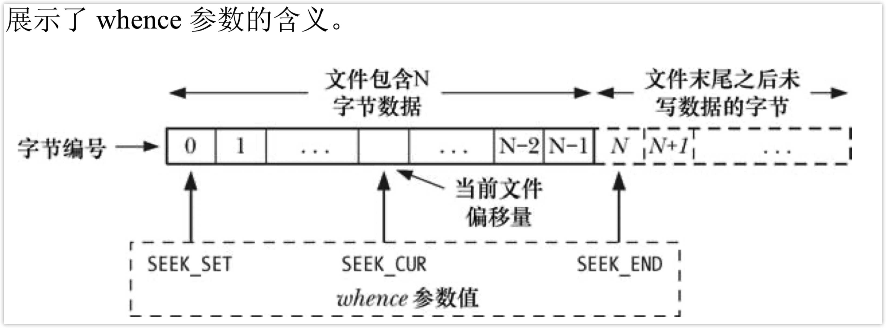
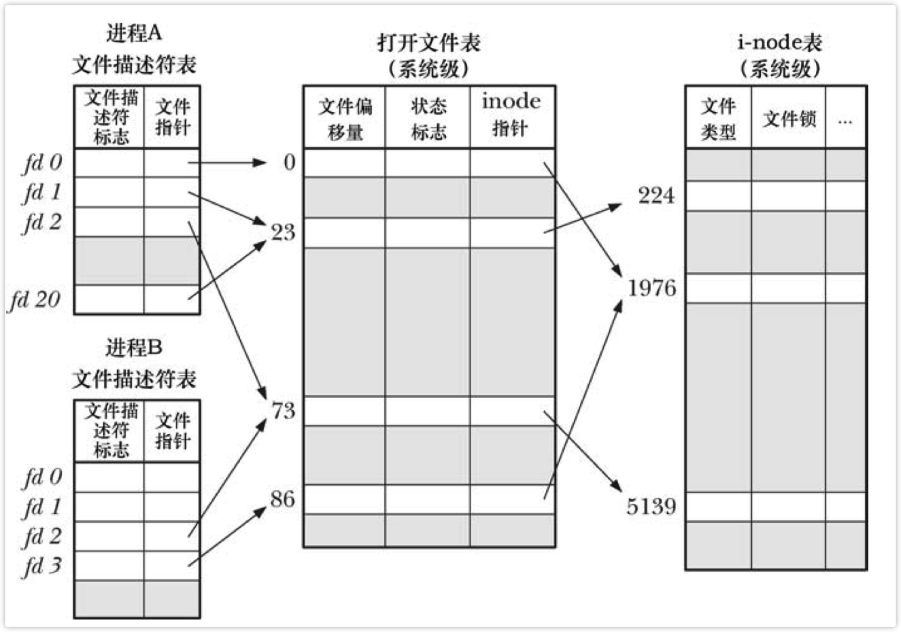

# 历史和标准

第七版UNIX发布后，UNIX分裂成了两大分支：**BSD、System V**。

* BSD：伯克利软件发布（Berkeley Software Distribution）
* System V：AT&T被拆分后，USG推出System V，它吸纳了BSD的诸多特性

**GNU项目**：GNU‘s not UNIX，*以 GPL 许可协议发布的软件不但必须开放源码，而 且应能在 GPL 条款的约束下自由对其进行重新发布。可以不受限制的修改以 GPL 许可协议发 布的软件，但任何经修改后发布的软件仍需遵守 GPL 条款。若经过修改的软件以二进制(可执 行)形式发布，那么软件的修改者必需满足软件使用者的以下要求:以不高于发行成本的价格， 获得修改后的软件源码。*GNU未开发出能够有效运作的UNIX内核，但是开发了大量针对类UNIX系统的程序。

* **gcc**是GCC中的GUN C Compiler（C 编译器）

* **g++**是GCC中的GUN C++ Compiler（C++编译器）

后缀为.c的，GCC把它当作C程序；G++把它当作c++程序；后缀为.cpp的，两者都会把他认为是c++程序。

对于 .c和.cpp文件，gcc分别当做c和cpp文件编译（cpp的语法规则比c的更强一些）;对于 .c和.cpp文件，g++则统一当做cpp文件编译。

*一个有趣的事实就是，就本质而言，gcc和g++并不是编译器，也不是编译器的集合，它们只是一种驱动器，根据参数中要编译的文件的类型，调用对应的GUN编译器而已。*

**POSIX**：可移植操作系统（Portable Operating System Interface），X是因为大多数UNIX的变体总是以“X”结尾。*读音类似于”Positive“*

**SUSv3**：是一套UNIX系统的统一规格书。扩充了POSIX标准。*（类似于OSI七层模型和TCP/IP五层模型？）*

## Linux系统编程

内核职责：

* 进程调度
* 内存管理：引入虚拟内存管理机制
  * 进程与进程之间、进程与内核之间彼此隔离
  * 只需将进程的一部分保持在内存中，可以在RAM同时加载更多的进程
* 提供文件系统
* 创建和终止进程
* 对设备的访问
* 联网
* 提供系统调用

环境变量：每个进程都有一份环境列表。

# 文件I/O

文件描述符用以表示所有类型的已打开文件，包括管道(pipe)、FIFO、socket、终端、 设备和普通文件。针对每个进程，文件描述符都自成一套。

程序继承了 shell 文件描述符的 副本，在 shell 的日常操作中，这 3 个文件描述符始终是打开的。


## 通用I/O

UNIX I/O 模型的显著特点之一是其输入/输出的通用性概念。这意味着使用 4 个同样的系 统调用 open()、read()、write()和 close()可以对所有类型的文件执行 I/O 操作，包括终端之类的设备。

example：


### open()

```c
 fd = open(path, flags, mode) 
```

* path文件路径
* flags 参数还可指定文件的打开方式:只 读、只写亦或是读写方式。
* mode 参数则指定了由 open()调用创建文件的访问权限
* fd返回的文件描述符，指代打开的文件。

```c
fd=open('a.txt', O_WRONLY|O_CREAT|O_TRUNC|O_APPEND, S_IRUSR|S_IWUSR)
```

若调用成功，必须保证其返回值为进程未用文件描述符中数值最小者。

### read()

```c
numread = read(fd, buffer, count) 
```

* 从 fd 所指代的打开文件中读取至多 count 字节的 数据，并存储到 buffer 中。
* numread是read()实际读到的字节数，如果再无字节 可读(例如:读到文件结尾符 EOF 时)，则返回值为 0。

### write()

 ```c
 numwritten = write(fd, buffer, count) 
 ```

* 从 buffer 中读取多达 count 字节的数据写入由 fd 所指代的已打开文件中。
* numwritten是write()调用的返回值为实际写入文件中的字节数，且有可 能小于 count。

### close()

*  status = **close**(fd)在所有输入/输出操作完成后，调用close()，释放文件描述符fd以及 与之相关的内核资源。

### lseek()

```c
curr = lseek(fd,  offset, whence)
```

* offset，一个以字节为单位的数值



文件空洞：如果程序的文件偏移量已经越界（跨越文件结尾），read()返回0表示文件结尾，write()仍然可以在结尾后位置写入数据。**从文件结尾后新写入数据间的这段空间称为文件空洞**，文件空洞不占用磁盘空间（类似于BSS段）。*如果空洞的边界落在块内，而非恰好落在块边界上，则会分配一个完整 的块来存储数据，块中与空洞相关的部分则以空字节填充*

### ioctl()

```c
int ioctl(fd, req, ...);
```

### fcntl()

文件控制操作。

```c
int fcntl(fd, cmd, ...);
```

* 针对一个打开的文件，获取或修改其访问模式和状态标志

```c
int flags, accessMOde;
// 获得文件的访问模式
flags = fcntl(fd, F_GETFL);
// 判断文件是否以同步写方式打开
if(flags & O_SYNC) pass;
// 为文件添加追加修改的标志
flags |= O_APPEND;
fcntl(fd, F_SETFL, flags);
```

运行更改的标志有O_APPEND、O_NONBLOCK、O_NOATIME、O_ASYNC 和 O_DIRECT。

fcntl()适用场景：

*  **文件不是由调用程序打开的**，所以程序也无法使用 open()调用来控制文件的状态标志
* **文件描述符的获取是通过 open()之外的系统调用**。比如 pipe()调用，该调用创建一个 管道，并返回两个文件描述符分别对应管道的两端。再比如 socket()调用，该调用创 建一个套接字并返回指向该套接字的文件描述符。

### pread()&pwrite()

系统调用 pread()和 pwrite()完成与 read()和 write()相类似的工作，只是前两者会在 offset 参数 所指定的位置进行文件 I/O 操作，而非始于文件的当前偏移量处，且它们不会改变文件的当前 偏移量。

```c
ssizet_t pread(fd, buf, count, offset);
ssizet_t pwrite(fd, buf, count, offset);
```

### readv()&writev()

这些系统调用并非只对单个缓冲区进行读写操作，而是一次即可传输多个缓冲区的数据。 数组 iov 定义了一组用来传输数据的缓冲区。整型数 iovcnt 则指定了 iov 的成员个数。iov 中的 每个成员都是如下形式的数据结构。

```c
ssize_t readv(fd, struct iovec*iov, iovcnt);
ssize_t writev(fd, struct iovec*iov, iovcnt);
struct iovec {
  void *iov_base; // start address of buffer
  size_t iov_len; // Number of bytes to transfer to/from buffer
};
```

### truncate()&ftruncate()

若文件当前长度大于参数 length，调用将丢弃超出部分，若小于参数 length，调用将在文 件尾部添加一系列空字节或是一个文件空洞。

```c
int truncate(pathname, length);
int ftruncate(fd, length);
```

### 大文件I/O

open64

pass

## 原子操作和竞争条件

所有系统调用都是以原子操作方式执行 的。内核保证了某系统调用中的所有步骤会作为独立操作而一次性加以执行，其间不会为其他进程或线程所中断。

## 文件描述符和打开文件

文件描述符和打开文件是多对一的关系。



* 两个不同的文件描述符，若指向同一打开文件句柄，将共享同一文件偏移量
* 文件描述符标志(亦即，close-on-exec 标志)为进程和文件描述符所私有。 对这一标志的修改将不会影响同一进程或不同进程中的其他文件描述符。

## 复制文件描述符

\>\&是一个整体，表示将将描述符A重定位到和B一样。

```sh
// example1
./script > res.log 2>&1
// shell从左至右处理I/O重定向语句
// 1. ./script > res.log : 将stdout重定位至res.log
// 2. 2 >& : 2代表stderr，1代表stdout，整体表示将2的输出位置等同于1
// example2
./script 2>&1 > res.log
// 1. ./script 2>&1 : 刚开始2的输出位置本就等同于1，所以2>&1是无效的
```

dup()调用复制一个打开的文件描述符 oldfd，并返回一个新描述符，二者都指向同一打开 的文件句柄。系统会保证新描述符一定是编号值最低的未用文件描述符。

```c
int dup(oldfd);
```

dup2()系统调用会为 oldfd 参数所指定的文件描述符创建副本，其编号由 newfd 参数指定。 如果由 newfd 参数所指定编号的文件描述符之前已经打开，那么 dup2()会首先将其关闭。

```c
int dup2(oldfd, newfd);
```

dup3()只支持一个标志 O_CLOEXEC，这将促使内核为新文件描述符设置close-on-exec标志。

```c
int dup3(oldfd, newfd, flag);
```

## 非阻塞I/O

打开文件时设置O_NONBLOCK标志：

* **若open()调用未能立即打开文件，则返回错误，而非陷入阻塞**。有一种情况属于例外，调用 open()操作 FIFO 可能会陷入阻塞
* **调用open()成功后，后续的I/O操作也是非阻塞的**。若I/O系统调用未能立即完成，则可 能会只传输部分数据，或者系统调用失败，并返回 EAGAIN 或 EWOULDBLOCK 错 误

## /dev/fd

对于每个进程，内核都提供有一个特殊的虚拟目录/dev/fd。该目录中包含“/dev/fd/n”形 式的文件名，其中 n 是与进程中的打开文件描述符相对应的编号。*因此，例如，/dev/fd/0 就对 应于进程的标准输入。*

系统还提供了 3 个符号链接:/dev/stdin、/dev/stdout 和/dev/stderr，分别链接 到/dev/fd/0、/dev/fd/1 和/dev/fd/2。

## 创建临时文件

有些程序需要创建一些临时文件，仅供其在运行期间使用，程序终止后即行删除。

```c
int mkstemp(char *template);
```

模板参数采用路径名形式，其中最后 6 个字符必须为 XXXXXX。这 6 个字符将被替换， 以保证文件名的唯一性，且修改后的字符串将通过 template 参数传回。因为会对传入的 template 参数进行修改，所以必须将其指定为字符数组，而非字符串常量。文件拥有者对 mkstemp()函数建立的文件拥有读写权限(其他用户则没有任何操作权限)， 且打开文件时使用了 O_EXCL 标志，以保证调用者以独占方式访问文件。

通常，打开临时文件不久，程序就会使用 unlink 系统调用将其删除。

## I/O缓冲


# 进程

## 进程号和父进程

每个进程都有一个进程号(PID)，进程号是一个正数，用以唯一标识系统中的某个进程。

```c
pid_t getpid(void);
```

Linux 内核限制进程号需小于等于 32767。新进程创建时，内核会按顺序将下一个可用的进程号分配给其使用。每当进程号达到 32767 的限制时，内核将重置进程号计数器，以便从小整数开始分配。

一旦进程号达到 32767，会将进程号计数器重置为 300，而不是 1。之所以如此，是因 为低数值的进程号为系统进程和守护进程所长期占用，在此范围内搜索尚未使用的进程号 只会是浪费时间。

## 进程内存布局

同csapp

## 虚拟内存管理

* 相互隔离
* 共享
* 内存保护
* 便于链接、加载
* 额外内存

## 环境变量

pass

# 内存分配

C 语言程序分配内存所惯用的 malloc 函数族， malloc 函数族基于brk()和 sbrk()。

## brk()&sbrk()

改变堆的大小(即分配或释放内存)，其实就像命令内核改变进程的program break位置一样 简单。最初，program break 正好位于未初始化数据段末尾之后。

在 program break 的位置抬升后，程序可以访问新分配区域内的任何内存地址，**而此时物理 内存页尚未分配。内核会在进程首次试图访问这些虚拟内存地址时自动分配新的物理内存页。**

```c
// 将program break设置为p所指定的位置
int brk(void *p);
// 等同于
// brk(program break + inc)
void *sbrk(int inc);
```

### malloc()&free()

*类似于csapp malloc lab的实现*

若无法分配内存(或许是因为已经抵达 program break 所能达到的地址上限)，则 malloc() 返回 NULL，并设置 errno 以返回错误信息。

一般情况下，free()并不降低 program break 的位置，而是将这块内存填加到空闲内存列表 中，供后续的 malloc()函数循环使用