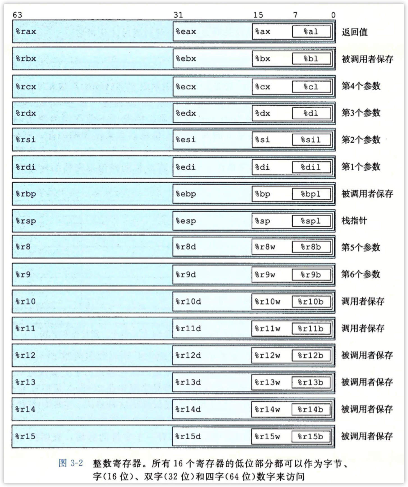
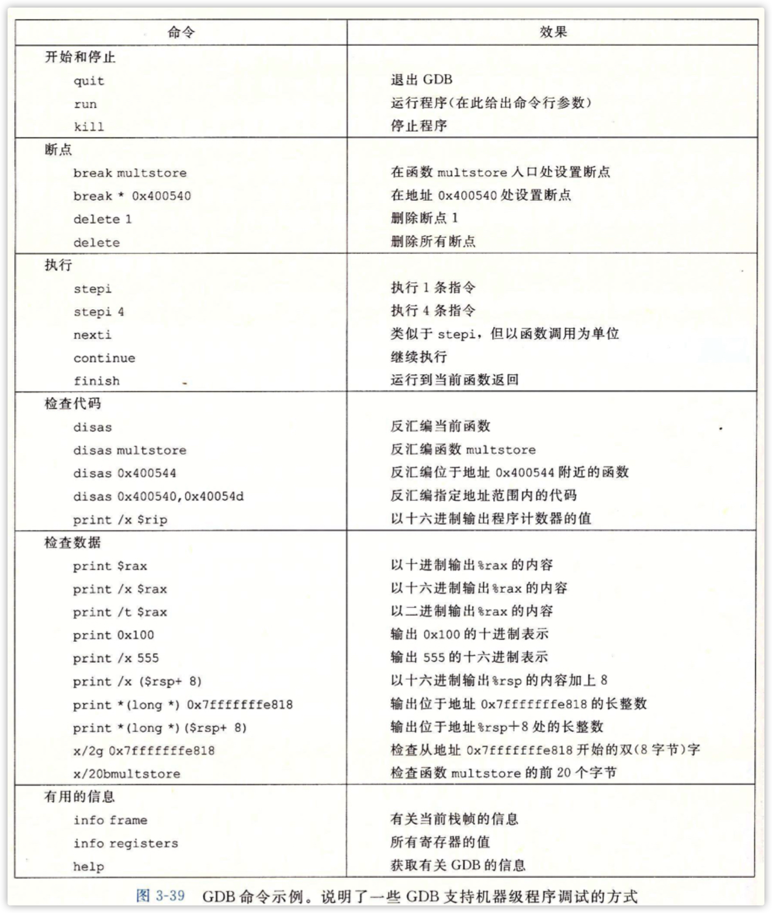

# ch-3 程序的机器级表示

## 程序编码

```shell
gcc -Og -o p p1.c p2.c
```

* -Og 符合C整体结构的机器代码优化等级
* C预处理器扩展源代码，插入#include指定的文件，并扩展#define声明指定的宏
* 编译器产生两个源文件的汇编代码，p1.s p2.s
* 汇编器将汇编代码转换为二进制目标代码文件p1.o p2.o，二进制，没填入全局值的地址，可重定位
* 链接器将两个目标文件与实现库函数（如printf）的代码合并，并产生最终可执行的代码文件p

### 机器级代码

机器级代码使用虚拟内存地址，提供的内存模型看上去是一个非常大的字节数组。

程序内存包含：可执行机器代码、操作系统需要的一些信息、管理函数调用和返回的运行时栈、用户分配的内存快（如：malloc）

Example:


```sh
gcc -Og -S mstore.c
```

* -S = stop 生成汇编文件
* 产生汇编文件mstore.s

汇编代码如下：


每行都代表一条机器指令

```sh
gcc -Og -c mstore.c
```

* -c 只编译不链接,仅生成目标文件
* 产生二进制文件mstore.o，可以查看它的十六进制表示

可以用反汇编器来查看编译后的二进制文件

```sh
objdump -d mstore.o
```


上述的汇编代码都是ATT(AT&T)格式的，还有intel格式的：

```sh
gcc -Og -S -masm=intel mstore.c
```

*即《王爽汇编》书上那种*


在C中插入汇编代码有两种方法：

* 编写完整的函数，放进独立的汇编代码中，让汇编器和链接器把它和C代码合并
* GCC内敛汇编，用asm伪指令可以在C中包含简短的汇编代码

## 数据格式


movb-传送字节、movw-传送字、movl-传送双字、movq-传送四字



一个寄存器根据使用的长度不同有不同的称呼。

## 汇编操作

### 栈操作：


### 算术和逻辑操作：


### leaq指令

```assembly
leaq (%rdi, %rsi, 4), %rax ; 4*%rsi+%rdi -> %rax
```


### 跳转


如 if(x>=6) -> x-6>=0 -> jge 0x1234(目的地)。将比较转换为使用jmp与0的大小对比。

example:


### 循环

#### while


翻译为汇编伪码：


Example:


C编译器又是会重组计算，所以有些C代码中的变量在机器代码中没有对应的只；而又是又会引入源代码中不存在的新值，此外，编译器哈尝尝试图将多个程序值映射到一个寄存器上，来最小化寄存器的使用率。


Example:


第二种翻译方式：


#### for


将for循环转换为while循环，然后就等价于while循环的翻译方式了。


### switch

switch使用**跳转表**来实现的。

使用跳转表的优点是执行开关语句的时间与开关情况的数量无关。GCC根据开关情况的数量和开关情况值的稀疏程度来翻译开关语句。当开关情况数量较多时（如4个以上），并且值的范围跨度较小时，就会使用跳转表。


&&：创建一个指向代码位置的指针


Line5: “*”表明是一个间接跳转，操作数制定一个内存位置，索引由寄存器%rsi给出。


.rodata表明是只读数据。

## 过程(函数)

基本方法：

P call Q为例

* 传递过程：在进入过程Q时，PC必须设置为Q的起始地址，在返回时要把PC设置为P调用Q后的下一条指令
* 传递数据：P必须能够往Q传递1～n个参数，Q要能返回值给P
* 分配和释放内存：在开始时Q可能需要为局部变量分配空间吗，而在返回前释放这些存储空间

C的过程调用机制使用了栈作为内存管理。P call Q时调用栈为：


当x86-64过程需要的存储空间超出寄存器能够存放的大小时，就会在栈上分配空间，这个部分称为**栈帧**。

大多数过程的栈帧都是定长的，在过程的开始就分配好了。但是有些过程需要变长的帧。FLAG

许多过车只有<=6个的参数，那么所有的参数都可以通过寄存器传递。

当所有的局部变量都可以保存在寄存器中且该函数不会调用其他函数，则根本不需要栈帧。

### 转移控制

* 将控制从P转移到Q，只需要将PC设置为Q的起始位置。

  使用call Q指令。会将P的下一条指令的地址A压入栈中

* 从Q返回时，在Q的最后会有一条ret指令，该指令用于弹出栈顶的数据并将其设置为PC的值（Q结束后会将自己占用的栈空间清空，所以此时栈顶就是之前P存好的地址A）


Example:


### 数据传递

X86-64中，可以通过寄存器最多传递6个整形参数，寄存器使用的名字取决于要传递的数据类型大小。


超过6个的部分就要通过栈来传递。把1～6复制到对应的寄存器，把参数7～n放到栈中，其中参数7位于栈顶。所有数据大小都想8的倍数看齐。


此时栈中的实际使用的空间如下：


可以看到a4只占用了低一位的字节，所以line6读入后addb只是用了%dl。

大多数过程调用都不需要超过寄存器大小，不过有些时候局部数据必须放入内存中：

* 寄存器不足够存放所有本地数据

* 对一个局部变量使用地址运算符'&'，所以必须能够为它产生一个地址

  example：

  

  可以看到当swap_add需要指针时，caller就在开头为两个参数在栈上分配了16（sub $16, %rsp）个字节空间而不是使用寄存器。

* 某些局部变量是数组或结构，因此必须能够通过数组或结构引用被访问到

#### 寄存器中的局部的存储空间

寄存器%rbx、%rbp、%r12~%r15被划分为**被调用者保存寄存器**。当p调用q时，q必须保存这些寄存器，保证在q返回时p访问到的值是不变的。Q要么不改变它，要么用栈进行保存。

其他除了%rsp都被分类为**调用者保存寄存器**。

example：

递归程序：


## 数组

```c
T A[N];
```

* 在内存中分配L*N字节的连续空间
* 引入标识符A用来作为指向数组开头的指针，就可以用0~N-1的整数来访问该数组元素

A[i] = \*(A + L\*i)

此时A存放在%rdx，i存放在%rcx，翻译为汇编：

```assembly
movl (%rdx, %rcx, 4), %eax
```

对于嵌套的数组在底层也是一维线型存储的：

```cc
int A[5][3];
```


## 常见的GDB命令



https://blog.csdn.net/weixin_39739234/article/details/110659658

## 内存越界引用和缓冲区溢出

*  局部变量和状态信息存放在栈上
* C不对数据越界进行辩解检查

导致数组越界时会破坏栈上的信息。

example：


gets()使用buf[8]作为缓冲区，大小较小。当输入字符如下时会出现不同程度的缓存区溢出：


0～24是echo的帧，是未被使用的，但它上面是返回地址。


解决办法：

*  栈随机化
* 栈破坏检测（金丝雀）
* 限制可执行代码区域（可读、可执行）

## 变长栈帧

pass

# ch7-链接

链接是将各种代码和数据片段收集并组合成一个单一文件的过程，这个文件可以被加载到内存执行。

* 链接可以执行于编译时（源代码->机器码）
* 加载时
* 运行时

Linux x86-64使用标准的ELF（Executable and Linkable Formate）可执行可链接格式。

## 编译驱动程序


```sh
gcc -Og -o prog main.c sum.c
```


* Cpp: 将头文件、#define扩展（将这些文件复制进来，或在调用点展开）-> .i

* Cc1: 将.i文件编译成ASCII的汇编文件 -> .s

* as：将.s文件编译为二进制机器码的可重定位文件->.o

* ld：将.o文件和一些必要的系统库文件组合成一个可执行文件 -> prog

* shell调用加载器，使用fork()创建复制自shell的子进程，并调用exec()拷贝prog的elf文件到内存。最后执行_start（全局变量的初始化和回收的在这，每个elf文件都有这么一段），再将控制权交给main()，shell通过wait()等待主程序的结束

  ```sh
  > ./prog
  ```

## 静态链接

静态链接器以一组可重定位目标文件(.o)和命令行参数作为输入，生成一个完全链接、可以加载和运行的可执行文件(prog)。

链接器的主要任务是：

* 符号解析： 每个符号对应一个函数、一个全局变量或是一个静态变量，目的就是**将每个符号引用和一个符号定义关联起来**
* 重定位：将符号定义和一个内存位置关联起来，修改所有对这些符号的引用，使得它们只想这个内存。

## 目标文件

* 可重定位目标文件（.o）：二进制代码和数据。可以在编译时和其他可重定位目标文件合并，创建一个可执行目标文件
* 可执行目标文件（prog）：可以直接被复制到内存并运行
* 共享目标文件：可以在加载或者运行时被动态地加载进内存并链接（动态库）

编译器和汇编器生成可重定位目标文件，链接器生成可执行文件。

### 可重定位目标文件


* elf头：16字节序开始，描述了生成该文件的系统的字的大小和字节顺序
* .text：机器代码
* .rodata：只读数据，如虚函数表、跳转表
* .data：已初始化的全局和静态变量
* .bss：未初始化的全局和静态变量，以及初始化为0的～变量，这个节不占据实际空间，只是一个占位符
* .symtab：符号表，存放了程序中定义和引用的函数和全局变量的信息，不需要-g也能生成。每个可重定位目标文件在这里都有一张符号表
* .rel.text：任何调用外部函数或者引用全部变量的指令都需要修改
* .rel.data：被模块引用或定义的所有全局变量的重定位信息，同.rel.text在ld工作完后在可执行文件中就没了
* .debug
* .line
* .strtab

### 符号和符号表

pass

## 符号解析

将每个引用与它输入的可重定位目标文件的符号表中的一个确定的符号定义关联起来，编译器只允许每个模块中每个局部符号有一个定义。

当编译器遇到一个不是在当前模块中定义的符号时，会假设该符号是在其他某个模块中定义的。如果链接器在它的任何输入模块中都找不到这个被引用符号的定义，就输出一条错误信息。

### 解析多重定义的全局符号

函数和已经初始化的全局变量是强符号，未初始化的全局变量时弱引用。

* 不允许有多个同名的强符号
* 如果有一个强符号和多个弱符号同名，那么选择强符号
* 如果有多个弱符号同名，那么从这些弱符号中任意选择一个

## 静态库

将所有相关的目标模块打包成一个单独文件，称为静态库，链接器只复制静态库里被应用程序引用的目标模块。

为每个标准函数创建一个独立的可重定位文件，然后封装成一个单独的静态库文件，在链接时，链接器只复制被程序引用的目标模块，这就减少了可执行文件在磁盘和内存中的大小。

静态库以**存档**的特殊文件格式存放在磁盘中，存档是一组连接起来的可重定位目标文件的集合。

Example:


```sh
gcc -c addvec.c multvec.c
ar rcs libvector.a addvec.o multvec.o
```


为了创建这个可执行文件，需要编译和链接输入文件main.o和libvector.a

```sh
gcc -c main2.c
gcc -static -o prog2c main2.o xxx(path of libvector.a)
```


由于main2.c只使用了vector中的函数，所以不会引用任何由multvec.o定义的符号，所以链接器就不会复制这个模块到可执行文件。