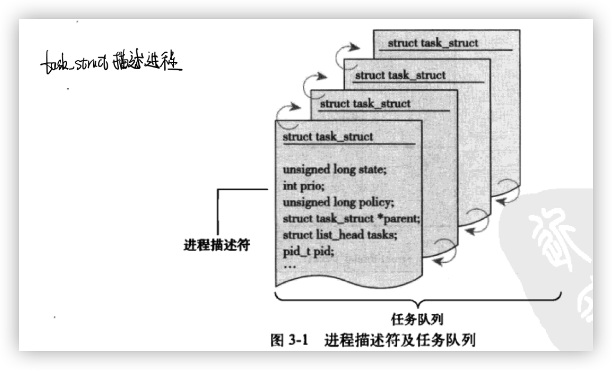

# ch1-源码结构

<center></center>

# ch2-进程管理

## 进程

进程就是处于执行期的程序，不仅包括**代码段(text section)**，还包括**打开文件、挂起信号、内核内部数据、处理器状态**。

每个线程都拥有一个独立的程序计数器、进程栈和一组进程寄存器，内核调度的对象是线程。在传统Unix系统中，**一个进程只包含一个线程**，Linux系统的线程实现比较特殊：**不特别区分线程和进程，线程不过是一种特殊的进程**。

进程提供两种虚拟机制：

* 虚拟处理器

  给进程一种自己在独享处理器的假象

* 虚拟内存

  让进程在分配和管理内存时有种拥有整个系统内存资源的假象

在线程之间可以共享虚拟内存，但是每个都拥有各自的虚拟处理器。

程序本身不是进程，进程是资源与程序的总称，完全可能：**多个不同的进程执行同一个程序，并存的进程还可以共享打开文件、地址空间等资源。**

进程通过`fork()`创建，**创建者为父进程，被创建者为子进程**，它从内核返回两次但是返回值不一样：

* 一次回到父进程
* 一次回到子进程

它们通过pid进行区分：

```cc
if (fork() == 0) {
	// 进入子进程code
} else {
  // 进入父进程code
}
```

之后会通过`exec()`系统调用执行子进程的代码，最终程序通过`exit()`退出执行，**这个函数会终结进程并将其占用的资源释放掉，父进程通过`wait4()`查询子进程是否终结，这使得进程有了等待特定进程执行完毕的能力。进程退出执行后被设为僵死状态，直到它的父进程调用`wait()`or`waitpid()`**。

## 进程描述符及任务结构

进程的列表存放在任务队列（task list）的双向循环链表中。链表中的每一项都是task_struct称为进程描述符的结构，其中包含了一个进程的所有信息。



它能够完整的描述进程：打开的文件、进程的地址空间、挂起的信号、进程的状态。

### 分配进程描述符

Linux通过slab分配器分配task_struct结构，这样能达到对象复用和缓存着色的目的。

早期，各个进程的task_struct存放在**内核栈尾端**（x86寄存器较少，可以通过栈指针计算出位置--栈指针+栈长-task_struct长=task_struct首地址），有些版本则是用单独的寄存器来记录task_struct地址。现在有了新的结构thread_info，它存在一个指向task_struct的字段。


这个新的结构使得在汇编代码中计算其偏移变得非常容易。

### 进程描述符的存放

内核通过一个唯一的PID（process identification value）来标识每个进程，是一个int类型（为了与老版linux兼容最大值设置为32768，short int的最大值，可以通过改.h文件来改变），它就是系统中允许同时存在的进程的最大数目。

### 进程状态

* **TASK_RUNNING**：正在运行或处于就绪状态：**就绪状态是指进程申请到了CPU以外的其它全部资源**。正所谓：万事俱备，仅仅欠东风.提醒：一般的操作系统教科书将正在CPU上运行的进程定义为RUNNING状态、而将可运行可是尚未被调度运行的进程定义为READY状态。这两种状态在Linux下统一为 TASK_RUNNING状态.
* **TASK_INTERRUPTIBLE**：**处于等待队伍中，等待资源有效时唤醒**（比方等待键盘输入、socket连接、信号等等），**但能够被中断唤醒**.普通情况下，进程列表中的绝大多数进程都处于TASK_INTERRUPTIBLE状态.毕竟皇帝仅仅有一个（单个CPU时），后宫佳丽几千；假设不是绝大多数进程都在睡眠，CPU又怎么响应得过来.
* **TASK_UNINTERRUPTIBLE**：处于等待队伍中，等待资源有效时唤醒（比方等待键盘输入、socket连接、信号等等），**但不能够被中断唤醒**.
* **TASK_ZOMBIE**:僵死状态。进程资源用户空间被释放，但内核中的进程PCB并没有释放。等待父进程回收.
* **TASK_STOPPED**:进程被外部程序暂停（如收到SIGSTOP信号，进程会进入到TASK_STOPPED状态），当再次同意时继续运行（进程收到SIGCONT信号，进入TASK_RUNNING状态）。因此处于这一状态的进程能够被唤醒.


### 进程上下文

* **进程上文**：其是指进程由用户态切换到内核态是需要保存用户态时cpu[寄存器](https://so.csdn.net/so/search?q=寄存器&spm=1001.2101.3001.7020)中的值，进程状态以及堆栈上的内容，即保存当前进程的进程上下文，以便再次执行该进程时，能够恢复切换时的状态，继续执行。
* **进程下文**：其是指切换到内核态后执行的程序，即进程运行在内核空间的部分。

### 进程家族树

Unix进程之间存在一个继承关系，所有进程都是PID为1的init进程的后代。内核在系统启动的最后阶段启动init进程（该进程通过初始化脚本执行其他相关程序，最终完成系统启动的整个过程）。

每个task_struct都包含一个指向其父进程task_stuct的parent指针，还包含一个children的子进程链表。

```c
// 获得父进程
struct task_struct *my_parent = current->parent;
// 遍历子进程
struct task_struct *task;
struct list_head *list;
list_foreach(list, &current->children) {
  task = list_entry(list, struct task_struct, silibing);
}
```

## 进程创建

* 其他操作系统：在新的地址空间里创建进程，读入可执行文件，最后开始执行。

* Unix：分解到fork和exec中

  * fork：拷贝当前进程创建一个子进程

    ​	两者区别只在与PID、PPID和某些资源和统计量（如挂起的信号，这没必要继承）

  * exec：读取可执行文件并将其载入地址空间开始运行

### 写时拷贝

一种可以推迟甚至免除拷贝数据的技术，内核此时并不复制整个进程地址空间，而是让父进程和子进程共享同一个拷贝。**只有在需要写入时，数据才会被复制**。也就是说资源的复制只在需要写入时才进行。-》是得地址空间上的页的拷贝只有在需要写入的时候才进行。这种优化可以避免拷贝大量根本就不会使用的数据。

### fork

Linux通过clone()来实现fork()。然后由clone()去调用do_fork()。

* 为子进程创建一个内核栈，此时子进程和父进程的描述符是完全相同的；
* 子进程使自己与父进程区别开来；
  * 将许多成员清0（父进程中被修改的代表状态的信息）
* ....

最后回到do_fork()。内核有意让子进程首先执行。

## 线程在Linux中的实现

Linux中的线程实现机制比较独特，**从内核的角度来说，他并没有线程这个概念，Linux把所有的线程都当作进程来实现**，线程仅仅被视作一个与其他进程共享某些资源的进程（拥有唯一隶属与自己的task_struct），**所以在内核中，它看起来就像一个普通的进程（只是与其他进程共享某些资源）。**

一个包含四个线程的场景：

* 其他操作系统：存在一个持有四个不同线程指针的进程描述符，这四个指针再去描述它（线程）所持有的资源
* Linux：仅仅创建四个进程描述符（task_struct），建立时指明它们共享的资源

### 内核线程

内核进程需要在后台执行一些操作，这些任务可以通过内核线程（kernek thread）完成。内核线程没有独立的地址空间，它们只运行在内核空间，从不切换到用户空间中去。内核进程和普通进程一样，可以被调度，也可以被抢占。内核线程只能由其他内核线程创建。

## 进程终结

当一个进程终结时，内核必须释放它所占有的资源并通知其父进程。

* 设置task_struct中的PE_EXITING
* 排队等候IPC信号，离开队列
* 切换到新的进程
* ...

与进程相关联的所有资源被释放（假设该进程时唯一使用者），进程不可运行（此时只有内核栈、task_struct和thread_info，它的其他资源都被释放，已没有地址空间运行）并处于EXIT_ZOMBIE退出状态。此时进程存在的唯一某地就是向他的父进程提供信息。父进程检索到信息后，或者通知内核那是无关的信息后，由进程所持有的剩余内存被释放，归还给系统使用。

### 删除进程描述符

do_exit()后，线程已经僵死，但系统还是保留它的进程描述符。**进程终结时所需的清理工作和进程描述符的删除被分开执行。**它的标准动作时挂起调用它的进程，直到其中一个子进程退出。

* 从任务列表中删除该进程
* 释放目前僵死进程所使用的所有剩余资源
* 通知僵死的领头进程的父进程
* 释放进程内核栈和thread_info内存，并释放task_struct所占有的slab高速缓存

### 孤儿进程

如果父进程在子进程之前退出，子进程找不到父进程，这些成为孤儿的进程将不能正常退出永远处于僵死状态。解决办法是：给子进程在当前线程组中找一个线程作为父亲，如果不行就让init做它们的父进程。

# ch3-进程调度

调度策略需要在：进程响应循序（响应时间短）和最大系统利用率（高吞吐量）之间权衡。Linux为了保证交互型应用和桌面系统的性能，更倾向于优先调度I/O消耗型程序。

## 进程优先级

优先级高的先运行，低的后运行，相同优先级的进程按轮转方式进行调度（一个接一个，重复进行）。调度程序总是选择时间片未用尽且优先级最高的进程运行。

* nice值：取值范围为-20～+19，默认为0。越大的nice值意味着更低的优先级，低nice值（高优先级）有着更多的处理器时间。
* 实时优先级：取值范围为0～99，与nice值相反，越高的实时优先级数值一位置进程的优先级越高。

## 时间片

表明进程在被抢占前所能持续运行的时间。时间片过长会导致系统对交互的响应表现欠佳；太短会明显增加进程切换带来的处理器耗时。所以I/O消耗型与处理器消耗型的矛盾为：IO消耗型不需要长的时间片（响应键盘输入）而处理器消耗型的进程则希望越长越好。

Linux的CFS调度器并没有直接分配时间片到进程，它是将处理器的使用比划分给了进程。这样进程所获得的处理器时间其实是和系统的负载相关的。具有高nice值（低优先级）的进程赋予低权重，拥有更少的处理器使用比；具有小nice值（高优先级）的进程赋予高权重，拥有更多的处理器使用比，CFS调度器其抢占时机取决于新的可运行程序消耗了多少处理器使用比，如果消耗的使用比比当前进程小，则新进程立刻投入运行，抢占当前进程，否则将推迟运行。

> example：文本编辑器与视频编码
>
> 系统目标：
>
> * 文本编辑器：有更多的处理器时间，并非是它需要更多的处理器时间，是希望它在需要时总能得到处理器；能在被唤醒（用户打字时）能抢占视频解码程序
>
> 在多数操作系统中，上述目标的达成要依靠系统分配给文本编辑器比视频解码程序更高的优先级和更多的时间片。
>
> Linux不再通过给文本编辑器分配给定的优先级和时间片，而是分配一个给定的处理器使用比。假如文本编辑器和视频解码器是仅有的两个运行进程，且拥有同样的nice值，那么它们对处理器的使用比都是50%-它们平分了处理器时间，但实际上文本编辑器肯定用不到50%，所以视频解码器将有机会用到超过50%的处理器时间。
>
> 文本编辑器将消耗这50%很少一部分，所以在文本编辑器需要处理器时可能是这种情况的使用比：文：49%、视：35%，所以此时文本编辑器拥有更高的优先级。CFS会毫不犹豫的让文本编辑器在需要时投入运行。


## nice值与时间片

第一种对应方式：低nice值对应大时间片（nice=0 ～ 100ms），高nice值对应小时间片（nice=+20 ～ 5ms）。

* 两个同等低优先级的进程：

  A:+20 B:+20，此时它们虽然能各自获得一半的处理器时间，但是每5ms就会发生一次切换，而低优先级代表的是后台任务（计算密集型）不需要频繁的切换

* 两个同等高优先级的进程：

  A:0 B:0，此时它们虽然能各自获得一半的处理器时间，但是在200ms内各获得一半，每100ms切换一次，响应速度慢，而高优先级代表的是前台任务（IO密集型任务）

第二种对应方式：相对nice值

* nice=0 ～ 100ms，nice=1 ～ 94ms（O(1)如此实现）
* nice=18 ~ 10ms，nice=19 ～ 5ms，此时前者比后者获得了两倍的处理器时间

也就是说nice减少导致的影响取决于nice的初始值，而不是一个绝对值。

CFS完全摒弃时间片而是分配进程一个处理器使用比重。

### 公平调度

**进程的调度效果应如同系统具备一个理想中的完美多处理器。**即假设存在两个进程，我们能够在10ms内**同时**运行两个进程，它们各自使用处理器一半的能力。

但是实际上无法在一个处理器上同时运行多个进程，而且如果调度周期过小的话将会导致频繁的进程切换。CFS以处理器使用比作为调度依据，CFS的“时间片”的计算来自于进程数量，CFS为完美多任务中的无限小调度周期的近似值设立了一个目标：**越小的调度周期将带来约好的交互性，同时也更接近完美的多任务，但是必须承受更高的切换代价和更差的系统吞吐量。**

> example:让我们假定目标延迟值是20ms，我们有两个同样优先级的可运行任务(无论这些任务的优先级是多少)，每个任务在被其他任务抢占前运行10ms。如果我们有4个这样的任务，则每个只能运行5ms。进一步设想，如果有20个这样的任务，那么每个仅仅只能获得1ms的运行时间。
>
> 但是当进程数量趋于无穷时，每个进程最低调度周期仍是1ms，这就注定在20ms内最多只有20个进程会被调度，那么就会出现“饥饿”。
>
> 此时若目标延迟为20ms，有进程A:nice=0，B:nice=5，B的处理器权重将是A的1/3（有计算公式），即它们获得的处理器时间为：15ms与5ms。若A:nice=10，B:nice=15此时获得的处理器仍是15ms、5ms，可见**绝对的nice值不在影响调度决策，只有相对值才会影响处理器时间的分配比例。**

任何进程所获得的处理器时间是由它自己和其他所有可运行的nice的相对差值决定的，不再是算术加权而是几何加权，所以CFS是近乎完美的调度器。

# ch4-系统调用

系统调用是用户访问内核的唯一手段：除异常和陷入外，它们是内核唯一的合法入口。

系统调用在出现错误时C库会把错误码写入error全局变量，通过perror库函数可以把该变量输出。

POSIX、API、C库之间的调用关系：


Unix的接口“提供机制而不是策略”。

每一个系统调用都被赋予了一个系统调用号，如果一个系统调用被删除后，他所占用的系统调用号也不被允许被回收利用，否则，以前编译过的代码会调用这个系统调用。内核击落了系统调用表中的所有已注册过的系统调用列表，存储在_sys_call_table中。

## 系统调用处理程序

应用陈旭无法直接执行内核代码，应该通过软中断通知系统，告诉内核自己需要执行一个系统调用。如x86通过int $0x80来出发中断，这条指令会触发一个异常导致系统切换到内核台并执行到128号异常处理程序（正是系统调用处理程序）。**用户空间引起异常或陷入内核是一个重要的概念**

### 指定恰当的系统调用

系统调用号是通过eax寄存器传递给内核，在陷入内核之前，内核空间就把相应的系统调用所对应的号放入eax中。

### 参数传递

也是存入寄存器中，保存了前5个参数，如需六个以上则用一个单独的寄存器存放只想所有这些参数在用户空间地址的指针。返回值也放在eax寄存器中。


## 系统调用的实现

设计和实现一个系统调用是一个难题，而把他加入到北和中却无需太多周折。

### 实现系统调用

不能破坏向后兼容，保证能用过去的调用方法也能调用现在的系统调用。

### 参数验证

系统调用必须仔细检查它们所有的参数是否合法有效。最重要的一种检查就是用户提供的指针是否有效：

* 指针指向的内存区域属于用户空间，进程决不能哄骗内核去读**内核空间的数据**
* 指针指向的内存区域在进程的地址空间，进程决不能哄骗内核去读**其他进程的数据**
* 如果是读，内存应标记为可读；如果是写，内存应标记为可写；如果是可执行，内存应标记为可执行；

内核无论何时都不能轻率地接收来自用户空间的指针。

* copy_to_user()
* copy_from_user()

## 系统调用上下文

在进程上下稳重，内核可以休眠并且可以被抢占。

* 能休眠说明系统调用可以使用内核提供的大部分功能 FLAG
* 像用户空间内的进程一样，当前进程同样可以被其他进程抢占，所以必须小心保重该系统嗲用是可重入的

最后当编写完一个系统调用后，把它注册成为一个正式的系统调用。

example：

注册sysinfo：

Step1.

```c
// kernel/sysproc.c
uint64
sys_sysinfo(void) {
  // 从用户态读入一个指针，作为存放 sysinfo 结构的缓冲区
  uint64 addr;
  struct sysinfo info;
  struct proc *p = myproc();
  if(argaddr(0, &addr) < 0){
    return -1;
  }
  info.freemem = freemem();
  info.nproc = nproc();
  // 参数存在于寄存器或者约定好的用户地址空间中，并通过copyout函数读出，x86中为copy_to_user与copy_from_user
  // 使用 copyout，结合当前进程的页表，获得进程传进来的指针（逻辑地址）对应的物理地址
  // 然后将 &sinfo 中的数据复制到该指针所指位置，供用户进程使用。
  if(copyout(p->pagetable, addr, (char*)&info, sizeof(info)) < 0){
    return -1;
  }
  return 0;
}
```

Step2.

```c
// kernel/syscall.h
// ...
#define SYS_unlink 18
#define SYS_link   19
#define SYS_mkdir  20
#define SYS_close  21
#define SYS_trace  22
#define SYS_sysinfo  23 // 在syscall中加入新加的系统调用的系统调用号
```

Step3.

```c
// 
// ...
extern uint64 sys_wait(void);
extern uint64 sys_write(void);
extern uint64 sys_uptime(void);
extern uint64 sys_sysinfo(void); 

static uint64 (*syscalls[])(void) = {
  //...
  [SYS_unlink]  "unlink",
[SYS_link]    "link",
[SYS_mkdir]   "mkdir",
[SYS_close]   "close",
[SYS_trace]   "trace",
[SYS_sysinfo]   "sys_sysinfo"};
 // 系统调用处理函数
// 根据寄存器中的系统调用号来决定调用的内核函数
void
syscall(void) {}
```

Step4.

此时，系统调用的内核部分已经完成，下面就是要为用户空间提供函数调用入口（API），以及完成从用户态到内核态变化。

```c
// user/user.h
// 添加函数原型作为跳板
char* sbrk(int);
int sleep(int);
int uptime(void);
int trace(int);
struct sysinfo; // 这里要声明一下 sysinfo 结构，供用户态使用。
int sysinfo(struct sysinfo *);
```

Step5.

```assembly
; ...
; 调用user.h中的函数其实是调用的该汇编定义的函数
sleep:
 li a7, SYS_sleep
 ecall
 ret
.global uptime
uptime:
 li a7, SYS_uptime
 ecall
 ret
.global trace
trace:
 li a7, SYS_trace
 ecall
 ret
.global sysinfo
sysinfo:
 li a7, SYS_sysinfo ; 将调用号传入a7寄存器
 ecall ; 调用ecall指令 中断->进入syscall
 ret
```

完整的调用链如下：

* user/user.h: 用户态程序调用跳板函数(也就是系统调用在用户态的声明)
* user/usys.S: 跳板函数使用 CPU 提供的 ecall 指令，调用到内核态
* kernel/syscall.c 到达内核态统一系统调用处理函数 syscall()，所有系统调用都会跳到这里来处理。
* kernel/syscall.c syscall() 根据跳板传进来的系统调用编号，查询 syscalls[ ] 表，找到对应的内核函数并调用。
* kernel/sysproc.c 到达内核中的系统调用函数，执行具体内核操作

以x86-32为例

# ch5-中断与中断处理

# ch6-下半部和退后执行的工作

# ch7-内核同步方法

