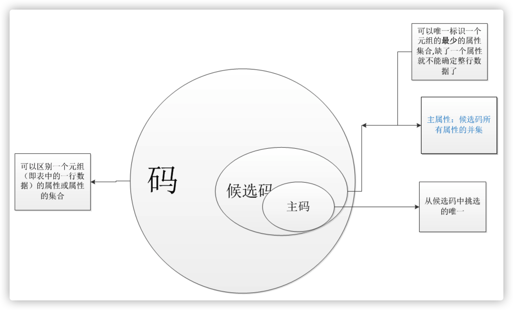

# `Chapter 2`

**模式`Schema`：**对表结构的描述。

**实例`Instance`：**`模式`的一个具体值（表中的一行数据）。


## 三级模式


### 内模式

* 数据物理结构和存储方式的描述。
  * 记录的存储方式：顺序存储、按`B`树组织...
  * 索引的组织方式：排序、散列。
  * 数据加密。
  * 数据压缩。
* 不涉及物理块的大小，也不考虑具体设备的柱面或磁盘大小。

*内模式对应物理级数据库，内模式是所有模式中的最低层的表示，不同于物理层，**假设外存是一个无限性的地址空间**，内模式是存储记录的类型，存储域以及表示以及存储记录的物理顺序，指示元索引，和存储路径的等数据的存储组织从而形成一个完整的系统。*

### 概念模式

*数据库中的表*

* 数据库中全体数据的逻辑结构和特征的描述。
  * 数据记录由那些数据项构成。
  * 数据项的名字、类型、取值范围。
  * 数据之间的联系、数据的完整性等。
* 不涉及数据的物理存储。
* 一个数据库只有一个概念模式。
* 通过`DDL`进行定义。

*用以描述整个数据库中的逻辑结构、用来描叙现实生活中的实体，以及它们之间的关系、从而定义记录数据项的完整性约束条件以及记录之间的联系是数据项的框架。概念模式是**数据库中全体数据的逻辑结构和特征的描叙是所有用户数据的公共数据视图**。*

### 外模式

*视图*

* 单个用户所看到的局部数据的逻辑结构和特征的描述。
* 建立在概念模式之上，同一个概念模式可有多个不同的外模式。
* 用来描述组成用户视图各个记录的组成、相互联系、数据的完整性和安全性、数据项的特征等。

## 二级映像

### 外模式/模式映像

* 定义了外模式与概念模式之间的对应关系。
  * 属性名称（如视图与真正的数据库表的属性名称不同）可能不同。
  * 外模式中的属性可能由模式中的多个属性运算而得。
* 当概念模式发生改变时，**只要修改外模式/模式映像，可保持外模式不变，从而保持用户应用程序不变，保证了数据与用户程序的逻辑独立性**。*数据的逻辑独立性*

### 模式/内模式映像

* 定义了概念模式与内模式之间的对应关系。	
  * 概念模式中逻辑记录和字段在内部存储如何表示。
* 当数据库的内部存储结构发生改变时，**只要修改模式/内模式映像，可保持概念模式不变，从而保持外模式以及用户程序的不变，保证了数据与程序的物理独立性**。*数据的物理独立性*


## “码”



example：（学号，姓名，性别，年龄，系别，专业）

### 码（超码）

能够**唯一标识**一条记录的属性或属性集。

* 标识性：一个数据表的所有记录都具有不同的超键。
* 非空性：不能为空。

> 学号唯一，所以是一个超键
>      姓名唯一，所以是一个超键
>    （姓名，性别）唯一，所以是一个超键
>    （姓名，年龄）唯一，所以是一个超键
>    （姓名，性别，年龄）唯一，所以是一个超键
>
> 甚至可以无限叠加，直至将所有属性加入其中，所以超码讨论的意义不大。

### 候选码

能够**唯一标识**一条记录的**最小属性集**。

*最小的超码（没有多余属性）。*

* 标识性：一个数据表的所有记录都具有不同的候选码。
* 最小性：任一候选码的**任何真子集**都不能唯一标识一个记录。
* 非空性：不能为空。

### 主码

某个能够**唯一标识**一条记录的**最小属性集**（是从候选码里人为挑选的一条）

* 唯一性：一个数据表只能有一个主键。
* 标识性：一个数据表的所有记录都具有不同的主键取值。
* 非空性：不能为空。

### 主属性

主属性是候选码所有属性的并集。

### 非主属性

不包含在候选码中的属性称为非主属性。

### 全码

当所有属性共同构成一个候选码时候，这个候选码称为全码。


## 依赖

### 函数依赖

$x\rightarrow y$那么说明$y$依赖于$x$。

### 部分函数依赖

$(x,y)\rightarrow z$但实际上只需要$y$就能得到$y \rightarrow z$，所以说$z$部分依赖于$(x,y)$。

### 完全函数依赖

$(x,y)\rightarrow z$并且$x,y$任意单独一个都不能推出$z$，所以$z$完全函数依赖于$(x,y)$。

### 传递函数依赖

$x\rightarrow y$且$y\rightarrow z$那么$x\rightarrow z$成立但$y\nrightarrow x$，所以存在传递函数依赖$x\rightarrow z$。

## 完整性规则

### 实体完整性

关系模式R的主码不可取空值。

*所有组成主码的所有属性均不可取空值*。

### 参照完整性

参照关系R的任一个外键必须：

* 等于被参照关系S中所参照的候选码的某个值。
* 或者为空。

### 用户自定义完整性

满足用户对字段的约束。

*如年龄得在0～120，性别得属于（男，女） etc*

## `SQL`

数据定义语言`Data Definition Language DDL`：存取数据库模式

数据操作语言`Data Manipulation Language DML`：存取数据库数据

数据库控制语言`Data Control Language DCL`：存取访问控制信息


# `Chapter 3`

## 数据库设计


* 需求分析：分析用户的需求，包括数据、功能和性能需求。
* 概念结构设计：主要采用`E-R`模型进行设计。
* 逻辑结构设计：通过将`E-R`图转换成表，实现从`E-R`模型到关系模型的转换，进行关系规范化。
* 数据库物理设计：主要是为所设计的数据库选择合适的存储结构和存储路径。
* 数据库的实施：包括编程、测试和试运行。
* 数据库运行和维护：系统的运行和数据库的日常维护。

# 关系代数

## 并`Union`

$R\cup S$：由属于$R$或$S$的元组组成。
$$
R\cup S = \{t|{t\in R}\bigvee{t\in S}\}
$$


## 差`Difference`

$R-S$：由属于$R$而不属于$S$的元组组成。
$$
R-S=\{t|{t\in R}\bigwedge{t\notin S}\}
$$


## 交`Intersection`

$R\bigcap S$：由既属于$R$又属于$S$的元组组成。
$$
R\bigcap S = \{t|{t\in R}\bigwedge{t\in S}\}
R\bigcap S = R-(R-S)
$$


## 笛卡尔积`Cartesian Product`

$R\times S$：

* 列：

  * 前$n$列为$R$的一个元组。
  * 后$m$列是关系$S$的一个元组。

* 行：$k_1\times k_2$个元组
  $$
  R\times S = \{t_rt_s|{t_r\in R}\bigwedge{t_s\in S}\}
  $$
  

## 象集`Images Set`

$Z_x$：表示$R$中属性$X$上值为$x$的元组们在属性$Z$上的集合。
$$
Z_x = \{t[x]|{t\in R},t[X]=x\}
$$
其中$t[X]$表示$R$的属性$X$的所有元组，那么$t[X]=x$表示$R$在属性$X$上为$x$的所有元组。


## 选择`Select`

从关系$R$中选择**满足给的条件$使得F(t)=True$**的元组。
$$
\sigma_{F}(R) = \{t|{t\in R}\bigwedge{F(t)=True}\}
$$
是从行的角度进行运算的：


如从`Student`表中选择特定系(如`CS`)的学生：
$$
\sigma_{Sdept='CS'}=(Student) \quad or \\ \sigma_{5='CS'}=(Student)
$$
等价于：

```sql
select * from Student where Sdept='CS';
```

## 投影`Projection`

从关系$R$中选择出**若干属性列**组成新的关系：
$$
\Pi_A(R) = \{t[A]|t\in R\} \\ A:R中的属性列
$$
是从列的角度进行运算的：


如从`Student`表中选择特定属性(如`Sname`、`Sdept`)：
$$
\Pi_{Sname,Sdept}(Student)
$$
等价于：

```sql
select Sname, Sdept from Student;
```

## 连接`Join`

连接也称**$\theta$**连接。

从两个关系的笛卡尔积中选取属性见满足一定条件的元组。
$$
R\underset{A\theta B}\Join S = \{t_rt_s|{t_r\in R}\wedge{t_s\in S}\wedge{(t_r[A]\quad \theta \quad t_s[B])}\}
$$
其中：

* $A$和$B$分别为$R,S$上读书相等且可比的属性。
* $\theta$为比较运算符。

从行的的角度进行运算的：


特殊的：

自然连接还需要取消重复列，所以是同时从行和列的角度进行运算。

**exmaple：**


### 等值连接`Equal Join`

$\theta$为`=`的连接运算称为等值连接。

从关系$R$与$S$的广义笛卡尔积中选取$A,B$属性值相等的那些元组，即等值连接为：
$$
R\underset{A = B}\Join S = \{t_rt_s|{t_r\in R}\wedge{t_s\in S}\wedge{(t_r[A] = t_s[B])}\}
$$


### 自然连接`Natural Join`

自然连接是一种特殊的等值连接：

* 两个关系中进行比较的分量必须是**相同的属性组**。
* 在结果中把**重复的属性列**去掉。

含义：

$R,S$具有相同的**属性组`set`**（如：两张表有相同的列`r1`、`r2`、`r3`，那么`set`为$\{r1,r2,r3\}$）。
$$
R\Join S = \{t_rt_s|{t_r\in R}\wedge{t_s\in S}\wedge{(t_r[set] = t_s[set])}\}
$$


### 外连接`Outer Join`

如果把舍弃的元组也保存在结果关系中，而在其他属性上填空值(`Null`)，这种连接就叫做外连接。


#### 左外连接`Left Outer Join or Left Join`

如果只把左边关系R中要舍弃的元组保留就叫做左外连接。


#### 右外连接`Right Outer Join or Right Join`

如果只把右边关系S中要舍弃的元组保留就叫做右外连接。


### 除`Division`

pass。
