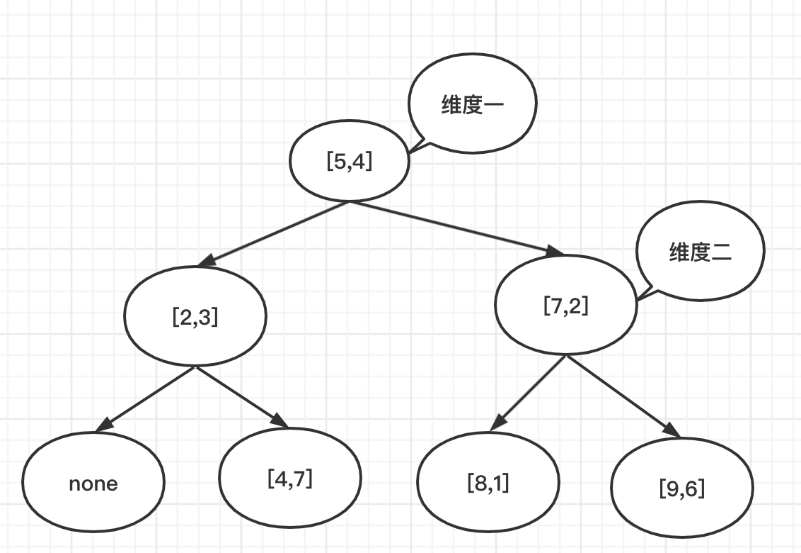

# K近邻算法

## 直观感受

1. *解决的问题： 分类问题，并且每个训练用例都有正确的类别，还解决[这些问题](http://www.skywind.me/blog/archives/2308)*

2. *方法：KNN没有具体的学习过程，思路就是“少数服从多”，即先确定近邻点的数量：K，然后每输入一个待分类数据$x_i$，再计算$x_i$与全体训练集中点的距离，再将与$x_i$距离最近的K个点选出并统计它们的类别，那么类别数量占优势的类别就算做$x_i$的类别*

   example：

   <center></center> 

   ​	上图中绿色点为待分类点：

    当`K=3`时：与它最近的点为两个红色三角形，一个蓝色矩型，那么它就属于这个红色三角形类别；

   当`K=5`时：与它最近的点为两个红色三角形，三个蓝色矩型，那么它就属于这个蓝色矩型类别；

## 距离度量

距离度量有很多种
$$
L_p(x_i, x_j) = {(\sum_{l=1}^{N}{|x_i^{(l)} - x_j^{(l)}|})}^{1\over p}
$$
$p=2$.$L_2$称为欧式距离，就是：
$$
L_2(x_i, x_j) = {(\sum_{l=1}^{N}{|x_i^{(l)} - x_j^{(l)}|})}^{1\over 2}
$$
$p=1.L_1$ 称为曼哈顿距离，就是
$$
L_1(x_i, x_j) = {\sum_{l=1}^{N}{|x_i^{(l)} - x_j^{(l)}|}}
$$

## K的选择

**1.	如果我们选取较小的k值，容易发生过拟合，并且对噪音很敏感；**


> 极端如K=1时，它只会与最近的点进行比较，如果这个点为噪音那么久过拟合了，如上图的黑点,本来红点应该属于矩型；

**2.	如果我们选取较大的k值，就相当于用较大邻域中的训练数据进行预测，这时与输入实例较远的（不相似）训练实例也会对预测起作用，使预测发生错误，k值的增大意味着整体模型变得简单；**


> 极端如K=全体训练集大小，此时也不许用分类了，无论怎么计算，总是会将红点判定为整个训练集中类别最多的类别

## KNN缺点

1. *当训练集较大、待预测集较大时，速度会很慢，因为每预测一个点都要将它与全体训练集进行比较;*
2. *为了解决这个问题提出了KD树*

## KD树

### 直观感受

**KD树就是在多维空间使用二分查找**

对于一个有序的数组，如果要找到某一个值的位置（不在里面也要找到一个范围），使用二分查找是最快的。那么如果这个数据是多维的呢？比如这个二维的。

```python
[
    [2, 3],
    [5, 4],
    [9, 6],
    [4, 7],
    [8, 1],
    [7, 2]
]
```

那么可以先针对某一维进行二分，再对另一维再进行二分，知道这个二叉树的每个节点的左右孩子只有一个值，或为空。

### 具体步骤

**step1.**	先选择维度一，此时数据为$[2,5,9,4,8,7]$，那么排序后，选择其中位数即$5\quad index=1$，将它作为划分元，数据就被分为两半$[2,3],[4,7]\quad [7,2],[8,1],[9,6]$，而$[5,4]$作为根节点

**step2.	**再选择维度二，此时数据被分为四份$none\quad [4,7]\quad [8,1]\quad[9,6]$，此时满足结束条件，KD树建成。



#### 维度选择

**method1：** 选择方差最小的元素

**method2：**依次选择$(j\quad mod\quad len)$​

#### `KD`树最近邻搜索

**算法步骤**：

输入：目标节点`target`；

输出：找到的最近邻节点`res`。

1. 从根节点出发，以维度对应的值作为划分依据。

2. 以找到的叶子结点作为**当前最近邻节点res**，最近邻距离设为**distance**。

3. 向上递归：

   递归至节点node，即step2中节点的父节点。node2作为node的兄弟节点。

   * node与target之间的距离是否小于distance，小于则更新res与distance。

   * 以target为圆心，画半径为distance的圆，若是与node2有交集则以同样的方法遍历node2如(findNN_1(node))。

     

4. 全部遍历完后，返回至根节点。


```c++
/*
 * @Author: weix 
 * @Date: 2021-09-23 16:56:09 
 * @Last Modified by: weix
 * @Last Modified time: 2021-09-23 16:56:29
 */

#include <vector>
#include <iostream>
#include <math.h>
using namespace std;
class Node
{
public:
    vector<double> msg;
};

class KDTree
{
public:
    int dim;
    Node *node;
    KDTree *left;
    KDTree *right;

public:
    KDTree *res;
    int distance;
    // 比较当前节点与目标值在dim维度上的大小
    bool compare(Node *target);
    bool findNN_1(KDTree *root, Node *target, KDTree *bro);
    // 计算目标节点与当前节点的距离
    double calculate_distance(Node *target, Node *node = nullptr);
};

bool KDTree::compare(Node *target)
{
    return target->msg[this->dim] < node->msg[this->dim];
}

double KDTree::calculate_distance(Node *target, Node *node = nullptr)
{
    if (node == nullptr)
    {
        node = this->node;
    }
    double distance = 0;
    for (int i = 0; i < target->msg.size(); ++i)
    {
        distance += pow(target->msg[i] - node->msg[i], 2);
    }
    return sqrt(distance);
}

// target所画的圆与node2有交集则返回true
bool KDTree::findNN_1(KDTree *root, Node *target, KDTree *bro)
{
    if (root == nullptr)
        return false;
  	// 该往左边走，且左边存在交集去兄弟节点
    if (compare(target) && findNN_1(root->left, target, root->right))
      	// 由于是查看交集，所以说明兄弟节点已经遍历过，所以传入nullptr
        findNN_1(root->right, target, nullptr);
    else if (findNN_1(root->right, target, root->left))
        findNN_1(root->left, target, nullptr);
    if (res == nullptr)
    {
        res = root;
    }
    else
    {
        int distance = calculate_distance(target);
        // 1.最近距离小于与当前节点的距离->更新
        if (distance < this->distance)
        {
            this->distance = distance;
            res = root;
        }
        // 2.检查该子节点的父节点对应的另一子节点(bro)对应的区域是否有更近的点
        if (bro != nullptr)
        {
            distance = abs(bro->node->msg[bro->dim] - target->msg[bro->dim]);
            return distance < this->distance;
        }
    }
    return false;
}
```


