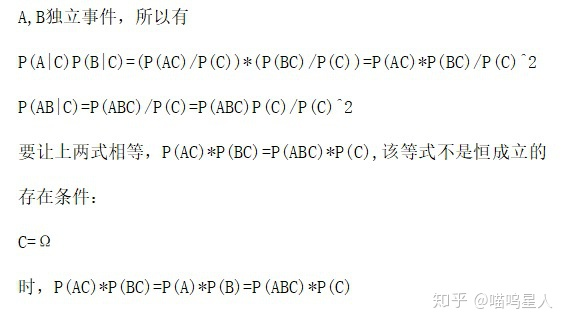

# 朴素贝叶斯

*朴素贝叶斯*算法属于**贝叶斯分类算法**，这类定理以**贝叶斯定理**为基础，故统称为贝叶斯分类

## 贝叶斯定理

### 前置知识

先验概率与后验概率

#### 先验概率

1. **定义**：在贝叶斯统计推断论中，一个未确定数目的先验概率分布（一般简称为先验）是一种表达了某人对于该数目的信仰的一种概率分布，这种信仰是没有考虑到一些（当前的）证据的。
2. **解释**：对于一个有概率发生的事件，每个人都会基于自己的知识做出一定的判断，但这个判断并未考虑到其他的影响因素。

#### 后验概率

1. **定义**：在贝叶斯推断中，一个随机事件的后验概率是指：当与事件相关的一些证据或背景也被考虑进来时的条件概率。“后验”在这个语境下即指的是在考虑了与要被检验的特定事件相关的证据。
2. **解释**：对于一个随机事件，在考虑其发生的概率时，把与它相关并会影响它的时间也考虑进来，即条件概率。

> **example：**例如，问今天会不会下雨，A认为下雨的概率不大，B通过观察，天上有乌云，那么在“乌云”这个条件的影响下“下雨”这件事发生的概率就会受到影响，这就是一个是先验概率，一个是后验概率。
>
> $P(A|B)$ ：在B的条件下A发生的概率（后验概率）
>
> $P(B)$：（不考虑其他因素）B发生的概率（先验概率）

### 全概率公式

设$B_1,B_2,..B_n$为有限个或无限个事件，它们两两互斥，且在一次实验中只会发生一个即：
$$
B_iB_j=\varnothing (i \neq j)(不可能事件)
$$

$$
B_1 + B_2 + ... + B_n = \Omega(必然事件，即总会发生其中一件)
$$

所以对于事件A，有$A = A\Omega = AB_1+AB_2+...+AB_n$

所以：
$$
P(A) = P(AB_1) + P(AB_2) + ... + P(AB_n)
$$
且：$P(AB_i) = P(A|B_i) \cdot {P(B_i)}$

所以：
$$
P(A) = P(A|B_1)\cdot P(B_1) + P(A|B_2)\cdot P(B_2) + ... +P(A|B_n)\cdot P(B_n)
$$

### 独立事件

对于两个事件$A，B$如果$B$的发生对于$A$的发生没有影响，那么则成$A,B$两事件独立即：
$$
P(AB) = P(A)P(B)
$$
或者：
$$
P(A|B) = P(A)
$$
对于两个独立事件$A，B$有：
$$
P(AB|C) = P(A|C)\cdot P(B|C)\quad其中C=\Omega
$$
证明：

### 贝叶斯公式

$$
P(B|A) = \frac {P(A|B)P(B)}{P(A)}
$$

> 其中A为特征，B为类别$P(类别|特征) = \frac {P(特征|类别)P(类别)}{P(特征)}$

#### $P(A|B)$

朴素贝叶斯中朴素就是假设各个特征之间相互独立。

$A$是训练集中的特征，而每一个特征下又有很多种类别，设其长度为N，所以由独立事件特性有：
$$
P(A|B=b_k) = \prod_i^{N}{P(A_i|B=b_k)} \qquad (1)
$$

> 例如，人的描述中有特征身高、性别，其中特征身高下又分为高矮胖瘦，性别下又分为男女
>
> 其中$b_k$指的是B的某一个类别，上式通俗解释就是：
> $$
> P(高、男、性格好｜好人) = P(高|好人)\cdot P(男|好人)\cdot P(性格好|好人)
> $$
> 的概率，其中特征为身高、性别、性格，类别为人的好坏,$N$等于3，具体指的就是好人是高、男、性格好的概率

#### $P(A)$

由全概率公式得：
$$
P(A) = \sum_i^{M}P(A|B_i=b_i)\cdot P(B_i=b_i)
$$
再由独立事件特性得：
$$
P(A) = \sum_i^{M}P(B_i=b_i)\prod_j^{N}P(A=a_j|B=b_i) \qquad (2))
$$

### 朴素贝叶斯分类器

将分类所需要的$P(A_i|b_k)$、$P(b_k)$统计好就可以直接进行分类，不需要训练。

综上所述公式$(1)(2)$：对于一条特征$A=a_i$，对它的分类为：
$$
label = argmax\begin{pmatrix} P(B=b_k) = \frac {{P(B=b_k)}{\prod_i^{N}{P(A_i|B=b_k)}}}{\sum_i^{M}P(B_i=b_i)\prod_j^{N}P(A=a_j|B=b_i)}  \end{pmatrix}
$$
其中分母为$P(A=a_i)$对于一条特征来说在计算任何$P(B=b_k)$时都是一样的所以可以省略，即：
$$
label = argmax\begin{pmatrix} P(B=b_k) = {{P(B=b_k)}{\prod_i^{N}{P(A_i|B=b_k)}}}\end{pmatrix}
$$

