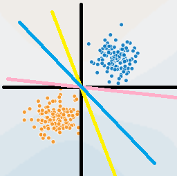

# SVM 

## 直观感受

SVM(Support vector machines)全称是支持向量机，关键就在于这个支持向量。

在感知机中，感知机只需要找到一个能分类的超平面即可，但并不保证这个超平面是最优解。何谓最优解，即在能分类现有数据的情况下，还能对未知的数据有很好的泛化能力，如下图：

其中，感知机可能找到上图三条直线中的任意一条，而SVM一定会找到那条蓝线，如果感知机找到的是粉线，那么可想而知，不是最优的，同理逻辑回归也不能找到最优的（间隔最大化的）超平面。

> 直观来看，间隔最大化能够使得样本都尽量远离分类决策超平面，这会使得模型的结构风险最小，也就意味着模型有着更强的泛化能力。

## 数学解释

那么SVM如何找到最优的超平面呢？

首先，什么是间隔？又怎么来计算间隔呢？

间隔就是点到超平面的距离，又分为**函数间隔**与**几何间隔**

### 间隔

***

#### 函数间隔

一般来说，一个点到超平面的远近可以表示分类预测确信程度（类似逻辑回归）。

那么可用$|w\cdot x + b|$来**相对地**表示点到超平面的的远近，这就是**函数间隔**。

但是还有一点，光表示远近还不行，因为分类点还分为正负类，所以加上其类别来表示该分类的**正确性**和**确信度**即函数间隔为：
$$
\hat{\gamma_{i}} = y_i(w\cdot x_i + b)
$$
函数间隔能作为SVM的分类依据吗？

答案是不能的，因为，当成比例的改变$w,b$时，超平面不会变化，但是函数间隔确会跟着发生改变，例如，一个人高1.8m，这是在尺子刻度以单位1m来量的，但如果此时0.5m作为以前的1m，此时人就会变为3.6m而他的实际身高却不会发生改变。

那怎么解决这个问题呢？就得加一个随着$w,b$变化而变化的量来限制函数间隔的变化，此时可以引入几何间隔。

***

#### 几何间隔

几何间隔在函数间隔加上了超平面的$L_2$范数即：
$$
\gamma_i = \frac{\hat{\gamma_i}}{||w||}\\=\frac{|w\cdot x_i + b|}{||w||}
$$
去掉绝对值：
$$
\gamma_i = \frac{y_i\cdot (w\cdot x_i+b)}{|||w||}
$$

***

### 间隔最大化

#### 最优化问题定义

由上可得，我们的目标就是在保证每个点分类正确的情况下是间隔最大化，记$\gamma = min(\gamma_i), i\epsilon n$，

所以自然而然的得到下面最优化问题：
$$
\max\limits_{w,b}\qquad \gamma \qquad\qquad\qquad\qquad\qquad\qquad\qquad\qquad\\
s.t. \qquad \frac{y_i\cdot(w\cdot x_i + b)}{||w||} \geq \gamma, \quad i=1,2,3,..,N
$$
将函数间隔带入得：
$$
\max\limits_{w,b}\qquad \frac{\hat{\gamma}}{||w||} \qquad\qquad\qquad\qquad\qquad\qquad\qquad\\
s.t. \qquad y_i\cdot(w\cdot x_i + b) \geq \hat{\gamma}, \quad i=1,2,3,..,N
$$
其中$\hat{\gamma}$ 会随着$w,b$的改变而成比例的改变，所以它不会影响最优解的生成（类似$\hat{\gamma}$ 可以用$w,b$表示，所以只与$w,b$ 有关），所以可以给它一个定值如1，同样最大化也可以变为最小化，所以得带约束的最优化问题为：
$$
\min\limits_{w,b}\qquad \frac1 2{||w||^2} \qquad\qquad\qquad\qquad\qquad\qquad\qquad\qquad\\
s.t. \qquad -y_i\cdot(w\cdot x_i + b) + 1 \leq 0, \quad i=1,2,3,..,N
$$

***

#### 求解最优化问题

上述问题，可以使用拉格朗日乘子法进行求解，但是最好是转化为求解其对偶问题。

1. 对偶问题往往更容易求解；
2. 方便引入核函数。

> 原函数中$w$与样本的维度有关，而在引入核函数之后将会造成维度急剧增加，而它的对偶问题则只与样本数量有关（这也是为什么SVM不适用于极大样本）

***

##### 极大极小问题

上述最优化问题可以一般化为：
$$
\min\limits_{x}\qquad f(x)\qquad\qquad\qquad\qquad\qquad\\
s.t. \qquad c_i(x)\leq 0\quad i=1,2,...,k\\
\qquad \qquad h_j(x) = 0\quad j=1,2,...,l
$$

所以其拉格朗日函数为：
$$
L(x,\alpha,\beta) = f(x) + \sum_{i=1}^k{\alpha_ic_i(x)} + \sum_{j=1}^l{\beta_jh_j(x)}
$$
令：
$$
\theta(x) = \max\limits_{\alpha,\beta}L(x,\alpha,\beta)
$$
在满足约束条件的情况下$\theta(x)$必定为$f(x)$，**因为$c_i(x)\leq0,h_j(x)=0$必然会使得后面两个项为$0$**

所以：
$$
\min\limits_{x} f(x) = \min\limits_{x}\max\limits_{\alpha,\beta}L(x,\alpha,\beta)
$$
其对偶问题是：
$$
\max\limits_{\alpha,\beta}\min\limits_{x}L(x,\alpha,\beta)
$$
*~~对偶问题不会证~~*

***

##### 学习的对偶算法

先得出其拉格朗日函数：
$$
L(w,b,\alpha) = \frac1 2||w||^2 - \sum_{i=1}^{N}\alpha_i(y_i(w\cdot x_i+ b) - 1)\\
=\frac1 2||w||^2 - \sum_{i=1}^{N}\alpha_iy_i(w\cdot x_i+ b) + \sum_{i=1}^N\alpha_i
$$
所以其对偶问题为：
$$
\max\limits_{\alpha}\min\limits_{w,b}L(w,b,\alpha)
$$
先求$\min\limits_{w,b}L(w,b,\alpha)$

分别对$w,b$求偏导，并令其为$0$:
$$
w = \sum_{i=1}^N\alpha_iy_ix_i\\
\sum_{i=1}^N\alpha_iy_i = 0
$$
将上式带入$\max\limits_{\alpha}\min\limits_{w,b}L(w,b,\alpha)$，得到$\max\limits_{\alpha}$：
$$
\max\limits_{\alpha} \quad -\frac12\sum_{i=1}^N\sum_{i=1}^N\alpha_i\alpha_jy_iy_jx_ix_j+\sum_{i=1}^N\alpha_i\\
s.t\quad \sum_{i=1}^N\alpha_iy_i = 0\qquad\qquad\qquad\qquad\qquad
$$
对$\max\limits_{\alpha}$取负号，得到等价的$\min\limits_{\alpha}$:
$$
\min\limits_{\alpha} \quad \frac12\sum_{i=1}^N\sum_{i=1}^N\alpha_i\alpha_jy_iy_jx_ix_j-\sum_{i=1}^N\alpha_i\\
s.t\quad \sum_{i=1}^N\alpha_iy_i = 0\qquad\qquad\qquad\qquad\quad
$$
由$KKT$互补条件得解（支持向量的$\alpha$不为$0$）：
$$
w^* = \sum_i\alpha_i^*y_ix_i\\
\alpha_i^*(y_i(w^*\cdot x_i + b^*) - 1) = 0,\quad i=1,2,...,N\\
\therefore \quad b^* = y_i - w^*\cdot x_i
$$

$$

$$

在引入软间隔和核函数之后最优化问题变为：
$$
\min\limits_{\alpha} \quad \frac12\sum_{i=1}^N\sum_{i=1}^N\alpha_i\alpha_jy_iy_jK(x_i,x_j)-\sum_{i=1}^N\alpha_i\\
s.t\quad \sum_{i=1}^N\alpha_iy_i = 0\qquad\qquad\qquad\qquad\quad\\
0\leq\alpha_i\leq C\qquad\qquad\qquad\qquad
$$
现在求解$w,b$只需要得到最优化$\alpha_i$即可，可以构造拉格朗日函数分别对$\alpha_i,\lambda_j$求偏导求解，只不过速度较慢，现在可以使用$SMO$或者拟牛顿法求解。

***

## `SMO`算法

上述问题是求解最优的$\alpha_1,\alpha_2,...,\alpha_n$,$SMO$算法先选择一个$\alpha_i$，将其视为未知变量，将其他$\alpha$视为已知量，然后再最优化$\alpha_i$，循环往复直到全部$\alpha$符合$KKT$条件。

这么做还是有所不足，因为并没有考虑到约束条件$\sum_{i=1}^N\alpha_iy_i = 0$，如果只选择一个$\alpha_i$，那么它也将是一个常量，也就没了优化的空间。

所以，在此种条件下$SMO$算法将会选择两个变量$\alpha_1,\alpha_2$，那么此时最优化条件变为：
$$
\min\limits_{\alpha_1,\alpha_2} = \frac12K_{11}\alpha_1^2+\frac12K_{22}\alpha_2^2+y_1y_2K_{12}\alpha_1\alpha_2\\-(\alpha_1+\alpha_2)+y_1\alpha_1v_1+y_2\alpha_2v_2 +\frac12\sum_{i=3}^N\sum_{j=3}^N\alpha_i\alpha_jy_iy_jK(x_i,x_j)
$$
其中$\frac12\sum_{i=3}^N\sum_{j=3}^N\alpha_i\alpha_jy_iy_jK(x_i,x_j)$可以视为一个常量，因为此时$\alpha_i,i=3,4,...,N$视为常量，$v_i = \sum_{j=3}^N\alpha_jy_jK(x_i,x_j),i=1,2$。

所以可以将它视为优化一个**二元函数**。
$$
\because\alpha_1y_1 + \alpha_2y_2+\sum_{i=3}^N\alpha_iy_i = 0\\
\therefore 令-\sum_{i=3}^N\alpha_iyi=\zeta\\
\therefore \alpha_1 = (\zeta-\alpha_2y_2)y_1
$$
将$\alpha_1$带入$\min\limits_{\alpha_1,\alpha_2}$，得一个**一元函数**：
$$
\min\limits_{\alpha_1} = \frac12K_{11}(\zeta-\alpha_2y_2)^2+\frac12K_{22}\alpha_2^2+y_2K_{12}(\zeta-\alpha_2y_2)\alpha_2-(\zeta-\alpha_2y_2)y_1\\-\alpha_2+v_1(\zeta-\alpha_2y_2)+y2v_2\alpha_2
$$

