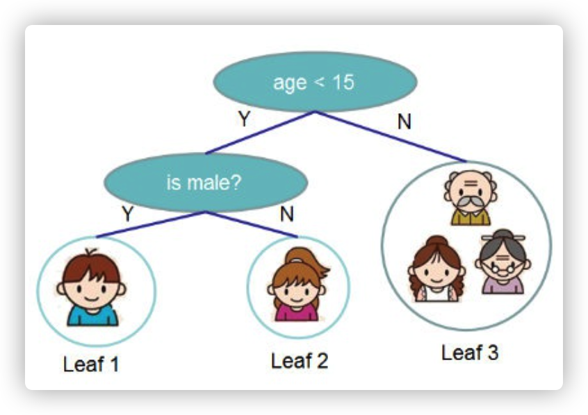

# 决策树

## 直观感受

将特征作为维度，在不同纬度上按照不同的分类标准，将数据以二叉树的形式不断划分。

**可以看出是if-then**规则的集合。

如上图：判断是否是网瘾少年。网瘾少年必然是小于15岁且为男生人的概率最大。

​	

## 算法步骤

递归的建立决策树。

1. 递归结束条件
   1. 若数据中全属于同一个label，则该节点类别则为label。
   2. 若待分类的feature为空，则该节点类别为数据中数量最多的label。
   3. 如划分带来的增益小于设定的阈值，则该节点类别为数据中数量最多的label。（可以不做这一步）
   4. 数据量为0返回None。
2. 递归所做的事情
   1. 遍历每一个为使用的过的特征feature_i，计算按照feature_i进行划分带来的增益gain。
   2. 选择能带来最大gain的feature*作为该节点的划分依据，并按照feature\*的所有可能取值将数据划分，每份数据作为该节点一个子节点。（即调用build处理这些子数据集进行建树）。

## 增益

按照计算增益的方法不同可以分为一下三种算法。

ID3、C4.5、CART。

### 信息熵

信息熵代表了数据中代表的信息多寡（或者不确定性）。
$$
H(P)=-\sum P(y)log(P(y))
$$

#### 直观感受

一件事情若是经常发生($P(x)$比较大)则说明蕴含的信息不多，比如下雨了，则只会知道地会变湿；比如发生地震了，则会知道有人员伤亡，财产损失等。

### 条件熵

条件熵表示，在确定某一种条件必然发生的情况下，此时的信息熵，可以说是条件的信息熵，或者，有约束条件的信息熵。（因为已经确定了一些条件，那么数据的混乱程度必然减少，即此时的信息熵必然会变小）。
$$
H(Y|X)=\sum P(x)H(Y|X=x)\\ -\sum P(x)P(Y|x)log(P(Y|x)))
$$
按照X将数据分成数坨，分别计算每坨数据的信息熵，在按照它们的权重（即$P(x)$）相加。

### `ID3`

ID3以划分前后差值作为增益。
$$
gain(D, A) = H(D)-H(D|A)
$$
很容易理解，遍历所有特征，计算划分前后的差值。

#### 缺点

这种划分比较偏向于数量较多的类别。

考虑一个极端的例子：

若以每条数据的编号作为它们的类别，那么每个类别中都只有一条数据，那么每个类别的 $log(p(y))\equiv0$​

那么gain也是为0，这对于数量少的类别不公平。

### `C4.3`

为了解决ID3的不足，C4.3使用了信息熵增益比作为划分依据。

#### 信息熵增益比

$$
g_r(D,A) = \frac{gain(D, A)}{H(D|A)}\\=\frac{H(D)}{H(D|A)}-1
$$

