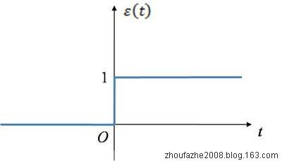
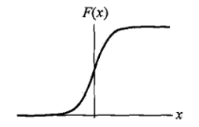

# 逻辑回归

## 直观理解

在感知机模型（或者线性回归）中靠$y=w\cdot x+ b$这个超平面来进行分类，通过减少误分类点来调整这个超平面的参数$w$，但是感知机简单的通过计算$sign(w\cdot x+ b)$即只要在平面之上则为$1$，在平面之下则为$-1$，哪怕只在其上/下一点点，也会输出天差地别的结果，这是因为$sign(w\cdot x+ b)$是一个单位阶跃函数，而逻辑回归则用的是一个输出样本分别属于正负的概率的$sigmoid$函数，那么概率大的分类则更有可能为正确的分类。

sign函数

### $Sigmoid$函数

$$
y = \frac {1} {1 + e^{-x}}
$$

Sigmoid函数

所以$y=w\cdot x + b$再套上$sigmoid$函数后就得到了逻辑回归对于样本为**正**的概率预测：
$$
y = \frac {1}{1 + e^{-({w\cdot x + b})}}
$$
​	其中$w\cdot x + b$可以整合整一个$w\cdot x$，即将$X$由${\{x_1, x_2...x_n\}}$，变为${\{x_1,x_2...x_n,1}\}$

那么在向量相乘时就把$b$算进去了：
$$
y = \frac {1}{1 + e^{-(w\cdot x)}}
$$
此时$y$是可微的。

当$w\cdot x$很大时，$y$就会趋近于1，意思就是，当该点在超平面之上越远，那么它被预测为正的概率就越大，反之亦然。

那么对于负的预测是怎么样的呢？

对于负，就是$1-正$即$1-y$
$$
1 -  y = \frac {e^{-(w\cdot x)}} {1 + e^{-(w\cdot x)}}
$$

## 数学解释

既然$y, 1-y$可以作为对正负概率的预测，那么为什么呢？个人理解如下：
$$
ln(\frac {y}{1-y}) = w\cdot x
$$
写作概率就是：
$$
ln(\frac {P(y=1|x)}{P(y=0|x)}) = w\cdot x
$$
所以：
$$
P(y=1|x) =\frac {e^{w\cdot x}}{1+e^{w\cdot x}}
$$

$$
P(y=0|x) = \frac {1}{1+e^{w\cdot x}}
$$

由贝叶斯公式得：
$$
P(c_1|x) ={ \frac {P(x|c_1)\cdot P(c_1)}{P(x)}}\\={\frac {P(x|c_1)\cdot P(c_1)}{P(x|c1)P(c_1)+P(x|c_2)P(c_2)}}\\={\frac{1}{1 + {\frac{P(x|c_2)P(c_2)}{P(x|c1)P(c_1)}}}}\\={\frac{1}{1 + {e^{ln{{\frac{P(x|c_2)P(c_2)}{P(x|c1)P(c_1)}}}}}}}\\={\frac{1}{1 + {e^-({ln{{\frac{P(x|c_1)P(c_1)}{P(x|c2)P(c_2)}}}})}}} \qquad(1)
$$
其中$c_1,c_2$分别为正负

此时$(1)$式与$y = \frac {1}{1+e^{-(w\cdot x)}}$很接近了
$$
{\frac{P(x|c_1)P(c_1)}{P(x|c2)P(c_2)}} = \frac {P(x,c_1)}{P(x,c_2)} \\=\frac{P(c1,x)}{P(c_2,x)}\\=\frac{P(c1|x)P(x)}{P(c2|x)P(x)}\\=\frac{P(c_1|x)}{P(c_2|x)} = \frac{y}{1-y}
$$
所以说逻辑回归其实是一个概率的表达式，类似极大似然法，我先假设样本符合$y,1-y$的这种概率的分布，然后极大化似然函数去拟合我这个模型。

## 损失函数

其实就是使用极大似然估计法来拟合模型，写出极大似然函数：
$$
L(w) = \prod_i^{N}(py)^{y}(1-py)^{1-y}
$$

> $py$为预测值，$y$为实际值

写出其自然对数形式：
$$
L(w) = log{\prod_i^{N}(py)^{y}(1-y)^{1-py}}\\=\sum_i^{N}(y_ilog(\frac {1}{1 + e^{w\cdot x_i}}) + (1-y_i)log(\frac {e^{w\cdot x_i}}{1 + e^{w\cdot x_i}}))
$$
化简得：
$$
L(w) = \sum_i^{N}((w\cdot x_iyi) - log(1 + e^{w\cdot x_i}))
$$
对$w$求导，就可以使用(随机)梯度上升最大化$L(w)$:
$$
\frac{\partial L(w)}{\partial w} = x_iy_i - {\frac {e^{w\cdot x_i}\cdot x_i}{1 + e^{w\cdot x_i}}}
$$
