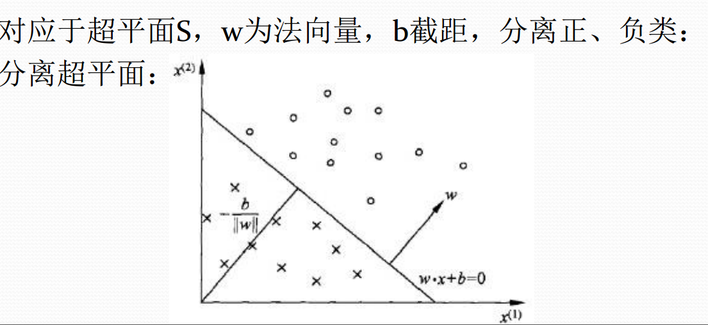

# 感知机

## 原始形式

### 直观感受

1. <b>解决的问题</b>：*二分类问题，是一个线性分类模型*

2. <b>方法</b>：*利用一个超平面（在二维空间就是一条直线），将正负样本分开*

   

   > ​		$w\cdot x + b$在二维空间是$ax+by+c=0$，$w$为$x$的参数向量*，以二维空间为例，在这条线上则刚好为0，在这条线上（直线以上）的点带入方程则为正，以下则为负，这样就将正负样本分开来（前提是样本是线性可分的，否则总有几个点分错）*

### 数学解释

#### 定义

$$
f(x) = sign(w\times x + b)
$$

**其中**
$$
sign = \begin{cases} +1, x \geq 0 \\ -1, x \leq 0 \end{cases}
$$


> ​	感知机在几何上是一个超平面，而实际上是一个函数，给它一个特征向量$x$，那么它还你一个正负判断。

#### 学习策略

感知机是根据误分类点来调整$f(x_i) = w \times x_i + b$ ，每次迭代尽量减少误分类点的数量，那么怎样来判断误分类点和误分类点的数量呢？误分类点有这么一个特性$y_i \times f(x_i) \leq 0$，*等于0的情况即分在了超平面上，自然算分错* 因为既然是误分类点，那么它的实际值$y_i$必然异于其预测值$f(x_i)$。

现在误分类点的判断有了，那么怎么减少误分类点的个数呢？答案是做不到的，那么就得换一个衡量标准，以误分类点到超平面的距离作为标准，不断减少误分类点到超平面的距离直到它不再是误分类点。

首先写出点到平面的距离公式：
$$
\frac {1} {\left\|w\right\|}|w \times x_i + b|
$$

>[推导](https://www.cnblogs.com/graphics/archive/2010/07/10/1774809.html)


那么，误分类点到超平面的距离就为：
$$
\frac {-y_i \times (w \times x_i + b)} {\left\|w\right\|}
$$

> $ y_i$与$(w \times x_i + b)$ 在误分类之下必定异号

所有，损失函数就是所有误分类点到超平面距离之和：
$$
L(w,b) = - \sum_{xi\epsilon M} {\frac {y_i \times (w \times x_i + b)} {\left\|w\right\|}}
$$

>$1\over{\left\|w\right\|}$为一个常数（函数距离），所以$L(w,b) = - \sum_{xi\epsilon M}y_i \times (w \times x_i + b)。$

损失函数的梯度为：

1. 批梯度下降：
   $$
   \nabla_w{L(w,b)} = -\sum_{xi\epsilon M}\eta y_ix_i
   $$
   

$$
\nabla_b{L(w,b)} = -\sum_{xi\epsilon M}\eta y_i
$$

> 选择所有的误分类点，依次对$w、b$进行更新，*类似于在下山时有很多张地图，遍历所有地图，然后选择一张最优的来下山*

2. 随机梯度下降

$$
w \longleftarrow w + \eta y_ix_i
$$

$$
b \longleftarrow b + \eta y_i
$$

> 随机选择一个误分类点来更新$w、b$，较于批梯度下降速度要快，*类似于在下山时有很多张地图，随机选一张下山*。

## 	对偶形式

在感知机的原始形式中，$w、b$可以是以任意初始值来开始迭代，但是在对偶形式中规定其初值为$0、0$，那么$w、b$最终值就是在迭代中的增量。

我们假设样本点$(x_i,y_i)$在更新过程中被使用了*(被用来梯度下降)*$n_i$次。那么从原始形式的学习过程可以得到，最后学习到的$w$和$b$可以分别表示为：
$$
w = \sum_{i=1}^{N}{n_i\eta y_ix_i} \qquad (1)
$$

$$
b = \sum_{i=1}^{N}{n_i\eta y_i} \qquad (2)
$$

> $n_i$的含义：$n_i$越大，怎么说明这个点经常被用来分类，意思是这个点在超平面变化时，极易由正变负、由负变正，算是一种临界点，类似于SVM中的支持向量。

将$(1),(2)$带入原始形式的感知机模型中，得：
$$
f(x) = sign(w\cdot x + b) = sign(\sum_{i=1}^{N}n_i\eta y_ix_ix + \sum_{i=1}^{N}n_i\eta y_i) \qquad (3)
$$

> 此时需要更新的就不再是$w、b$了，变成了$n_i$

所以训练过程变为了更新：$n_i \longleftarrow n_i + 1$

> 可以看出对偶形式与原始形式并没有什么区别，只不过是将迭代更新方式变了，但是对偶形式可以加速计算。$(3)$式中出现了$x_ix$，这中组合是有限的，可以在迭代之前将其提前计算出来存在矩阵中，然后就只需要查表了，叫做$Gram$矩阵

## 代码

```python
# 原始形式感知机
# data 训练数据
# lable 训练标签
# iter 迭代次数
# step 训练步长
def perceptron(data: np.matrix, label: np.matrix, iter=50, step=0.0001):
    m, n = data.shape
    # 初始化w和b
    w = np.zeros((1, n))
    b = 0
    for i in range(iter):
        for pot in range(m):
            yi = label[pot]
            xi = data[pot]
            # 分类错误的点，此处采用的是批梯度下降
            # 当yi和w*xi + b异号时则说明分类错误
            if -1 * yi * (w * xi.T + b) >= 0:
                w = w + step * yi * xi
                b = b + step * yi
        print('round %d : %d' % (i, iter))
    return w, b
```

