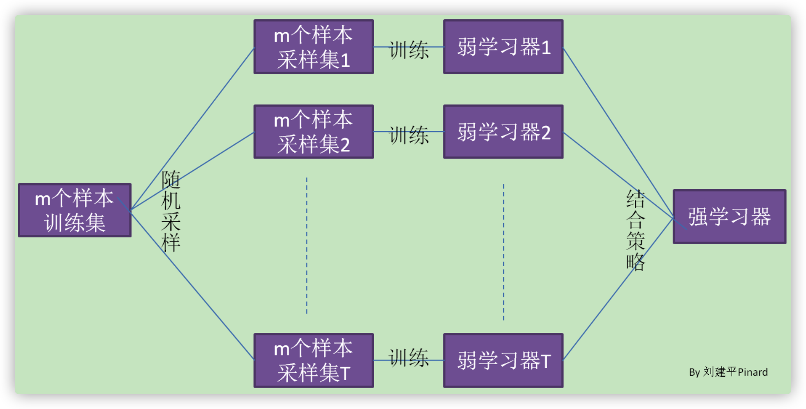

## Bagging原理

$Bagging$的特点在于”随机采样“。这里的”随机采样”是指的有放回采样，这样采样$m$次就形成了$m$个训练集。

所以：
$$
每次被采集到的概率为\frac{1}{m}，不被采集到的概率为1-\frac{1}{m}\\
那么m次都没有采集中的概率是(1-\frac{1}{m})^{m}。\\
m\rightarrow \infty时(1-\frac{1}{m})^{m} \rightarrow \frac{1}{e}\approx0.368，所以每轮采样训练集中大约有36.8\%不会被采集到。\\
这36.8\%的数据被称为袋外数据(OOB)，这些数据没有参加训练集模型的拟合，增加了模型的泛化能力。
$$

### 随机森林

随机森林$(RandomForest)$是$Bagging$算法的进化版。

RF使用了CART决策树作为弱学习器，这让我们想到了梯度提升树GBDT。第二，在使用决策树的基础上，RF对决策树的建立做了改进，对于普通的决策树，我们会在节点上所有的n个样本特征中选择一个最优的特征来做决策树的左右子树划分，但是RF通过随机选择节点上的一部分样本特征，这个数字小于n，假设为$n_{sub}$，然后在这些随机选择的$n_{sub}$个样本特征中，选择一个最优的特征来做决策树的左右子树划分。这样进一步增强了模型的泛化能力。　　

如果$n_{sub}=n$，则此时RF的CART决策树和普通的CART决策树没有区别。$n_{sub}$越小，则模型约健壮，当然此时对于训练集的拟合程度会变差。也就是说$n_{sub}$越小，模型的方差会减小，但是偏倚会增大。在实际案例中，一般会通过交叉验证调参获取一个合适的$n_{sub}$的值。