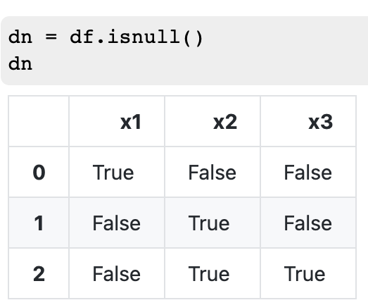
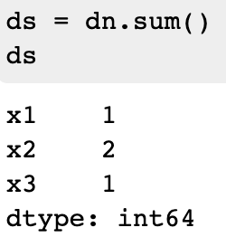
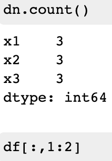

## Santander EDA and Prediction

[原文链接](https://www.kaggle.com/gpreda/santander-eda-and-prediction?scriptVersionId=12442041) **查看每个特征和特征的一些数学属性在train[0,1]和train，test中的分布**

### Data exploration

#### Missing Data

```python
def missing_data(data):
    total = data.isnull().sum()
    percent = (data.isnull().sum()/data.isnull().count()*100)
    tt = pd.concat([total, percent], axis=1, keys=['Total', 'Percent'])
    types = []
    for col in data.columns:
        dtype = str(data[col].dtype)
        types.append(dtype)
    tt['Types'] = types
    return(np.transpose(tt))
```

1. ```python
   data.isnull().sum()
   data.isnull().count()
   ```

   * *isnull：为null则Ture，否则为False*

     

   * *isnull().sum()：对bool矩阵求和（非bool也可以），True为1，False为0*

     

   * *isnull().count()：对矩阵元素（列）数量求和*

     

     

2. ```python
   np.transpose(tt)# 矩阵的转置
   ```

#### 数据在train和test中的分布

##### train与test中分布

```python
features = ['var_0', 'var_1','var_2','var_3', 'var_4', 'var_5', 'var_6', 'var_7', 'var_8', 'var_9', 'var_10','var_11','var_12', 'var_13', 'var_14', 'var_15']
plot_feature_scatter(train_df[::20],test_df[::20], features)
```


​	*切片可以用iloc也可以省略之，直接在df[]中切片*

* [切片操作1](https://blog.csdn.net/OnePiece_97/article/details/86291381)
* [切片操作2](https://zhuanlan.zhihu.com/p/48882741)

##### train中正负样本的分布

```python
sns.countplot(train_df['target'], palette='Set3') #palette设置直方图颜色
```


​	*可以看出正负样本的分布极其不平衡*

***

#### Density plots of features

```python
def plot_feature_distribution(df1, df2, label1, label2, features):
    i = 0
    sns.set_style('whitegrid') #设置图的背景颜色
    plt.figure()
    fig, ax = plt.subplots(10,10,figsize=(18,22))

    for feature in features:
        i += 1
        plt.subplot(10,10,i)
        # 在第i个子图上画出label1，lable2的曲线
        sns.distplot(df1[feature], hist=False,label=label1)
        sns.distplot(df2[feature], hist=False,label=label2)
        plt.xlabel(feature, fontsize=9)
        locs, labels = plt.xticks()
        plt.tick_params(axis='x', which='major', labelsize=6, pad=-6)
        plt.tick_params(axis='y', which='major', labelsize=6)
    plt.show();
```

1.  [distplot](https://zhuanlan.zhihu.com/p/33977558)

   > displot()集合了matplotlib的hist()与核函数估计kdeplot的功能，增加了rugplot分布观测条显示与利用scipy库fit拟合参数分布的新颖用途

   > 直方图又称**质量分布图**，它是表示资料变化情况的一种主要工具。用直方图可以解析出资料的规则性，比较直观地看出产品质量特性的分布状态，对于资料分布状况一目了然，便于判断其总体质量分布情况。直方图表示通过沿数据范围**形成分箱**，然后绘制条以**显示落入每个分箱的观测次数**的数据分布。

2. *fig, ax = plt.subplots(10,10,figsize=(18,22))*

   * *fig：代表整个图像*
   * *ax：代表坐标轴和画的图*

3. *locs, labels = plt.xticks()* [xticks](https://blog.csdn.net/weixin_35834894/article/details/98874947)

   ​	

   * *xticks：把坐标轴变成自己想要的样子*
   * *locs：刻标*
   * *labels：刻度标签*

##### train中每个特征正负样本下的密度

```python
t0 = train_df.loc[train_df['target'] == 0]
t1 = train_df.loc[train_df['target'] == 1]
features = train_df.columns.values[2:102]
plot_feature_distribution(t0, t1, '0', '1', features)
```


##### train、test下每个特征的密度

```python
features = train_df.columns.values[2:102]
plot_feature_distribution(train_df, test_df, 'train', 'test', features)
```


##### 获得其他属性下的密度

​	*如：mean; std; min; max; skew; kurtosis*

* 纵向

  ```python
  sns.distplot(train_df[features].mean(axis=0),color="magenta",kde=True,bins=120, label='train')
  sns.distplot(test_df[features].mean(axis=0),color="darkblue", kde=True,bins=120, label='test')
  ```

  

* 横向

  ```
  sns.distplot(train_df[features].mean(axis=1),color="green", kde=True,bins=120, label='train')
  sns.distplot(test_df[features].mean(axis=1),color="blue", kde=True,bins=120, label='test')
  ```

  

* train 01 条件下

  ```python
  t0 = train_df.loc[train_df['target'] == 0]
  t1 = train_df.loc[train_df['target'] == 1]
  plt.figure(figsize=(16,6))
  plt.title("Distribution of mean values per row in the train set")
  sns.distplot(t0[features].mean(axis=1),color="red", kde=True,bins=120, label='target = 0')
  sns.distplot(t1[features].mean(axis=1),color="blue", kde=True,bins=120, label='target = 1')
  plt.legend(); plt.show()
  ```

  

* train/test下

  ```python
  plt.figure(figsize=(16,6))
  plt.title("Distribution of std values per column in the train and test set")
  sns.distplot(train_df[features].std(axis=0),color="blue",kde=True,bins=120, label='train')
  sns.distplot(test_df[features].std(axis=0),color="green", kde=True,bins=120, label='test')
  plt.legend(); plt.show()
  ```

***

### Feature engineering

根据上面的观察可以构建合适的特征~~没发现~~

如：

```python
idx = features = train_df.columns.values[2:202]
for df in [test_df, train_df]:
    df['sum'] = df[idx].sum(axis=1)  
    df['min'] = df[idx].min(axis=1)
    df['max'] = df[idx].max(axis=1)
    df['mean'] = df[idx].mean(axis=1)
    df['std'] = df[idx].std(axis=1)
    df['skew'] = df[idx].skew(axis=1)
    df['kurt'] = df[idx].kurtosis(axis=1)
    df['med'] = df[idx].median(axis=1)
```

### Some Comments

1. *-Thanks for your kernel but I still don't understand How those plots help?
   Please explain what information you can get from each plots !
   And another thing I can't get is : After those plots the only thing you do about feature engineering is add 8 features into your model, and I don't know how 8 new features help the model either?
   I read some kernels on Titanic competition and I can clearly understand why they choose features but I can't understand this kernel :(
   I'm just a newbie so If you explain detail or give me keyword for me to google it would be a great help !!!-*

   ​	**画这么多有什么用？只添加了8个feat**

   *-In Titanic competition, it is easy to understand feature selection because most of the features are understandable by humans. Here I provided some hints about how to explore the features when they are in large number, anonymized and as well probably subjected to some linear/nonlinear transformations.-*

   ​	**这题特征的含义不是那么明显，画图有助于观察特征**