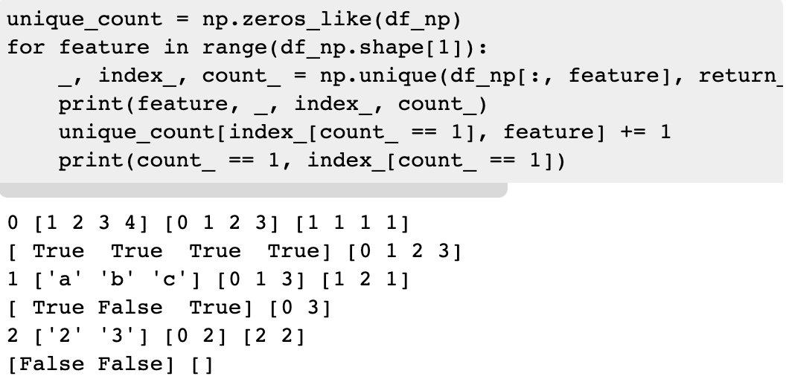

# 200 Magic Models

[原文链接](https://www.kaggle.com/cdeotte/200-magical-models-santander-0-920)  **寻找一个特征中单独的一个值，这个值可以明显的有助于xgb分割**

### Magic Feature

1. 未使用magic feature之前

   

   ​	xgb只使用var_198来构建模型时，xgb只能垂直分割，看不到水平的差异，在这里，var_198<13时xgb认为target=0.18；var_198>13时xgb认为target=0.1

2. 使用magic feature之后

   

   ​	当加上它的计数值后，xgb可以从水平、垂直两个方向来分割直方图，可以很明显的看到上图有一个矩型。并且此时xgb认为当var_198<13时target=0.36；当var_198>13时target=0.1，大大的提高了准确率。

### 特征工程

*此题中有部分数据为假，需要发现[fake](https://www.kaggle.com/yag320/list-of-fake-samples-and-public-private-lb-split)*

#### 数据读取与假数据发现

```python
test_path = '../input/test.csv'

df_test = pd.read_csv(test_path)
df_test.drop(['ID_code'], axis=1, inplace=True)
df_test = df_test.values

unique_samples = []
unique_count = np.zeros_like(df_test) # 将df_test的形状给unique_count
for feature in range(df_test.shape[1]):
    _, index_, count_ = np.unique(df_test[:, feature], return_counts=True, return_index=True)
    unique_count[index_[count_ == 1], feature] += 1

# Samples which have unique values are real the others are fake
real_samples_indexes = np.argwhere(np.sum(unique_count, axis=1) > 0)[:, 0]
synthetic_samples_indexes = np.argwhere(np.sum(unique_count, axis=1) == 0)[:, 0]

print('Found',len(real_samples_indexes),'real test')
print('Found',len(synthetic_samples_indexes),'fake test')
```

1. ```python
   df_test = df_test.values
   ```

   - 将一个DataFrame变为一个numpy的array

   

2. ```python
   for feature in range(df_test.shape[1]):
       _, index_, count_ = np.unique(df_test[:, feature], return_counts=True, return_index=True)
       unique_count[index_[count_ == 1], feature] += 1
   ```

   * _：df_np中所有的种类（无重复）

   * index_：各个种类第一次出现的下标

   * count_：各个种类在这列中出现的次数（dp_np[:, feature]是一列列表示的）

     

#### 根据类别出现次数来编码

```python
def encode_FE(df,col,test):
    cv = df[col].value_counts()
    nm = col+'_FE'
    df[nm] = df[col].map(cv)
    test[nm] = test[col].map(cv)
    test[nm].fillna(0,inplace=True)
    if cv.max()<=255:
        df[nm] = df[nm].astype('uint8')
        test[nm] = test[nm].astype('uint8')
    else:
        df[nm] = df[nm].astype('uint16')
        test[nm] = test[nm].astype('uint16')        
    return
```

1. ```python
   df[nm] = df[col].map(cv) # map 是一种映射的作用类似1->a,2->b
   ```

   * value_counts() 获得类别到其数量的映射
   * map(cv) 将类别映射成其数量

   

#### 将Magic Feature们独立训练成不同的模型

```python
# LGBM PARAMETERS
param = {
    'learning_rate': 0.04,
    'num_leaves': 3,
    'metric':'auc',
    'boost_from_average':'false',
    'feature_fraction': 1.0,
    'max_depth': -1,
    'objective': 'binary',
    'verbosity': -10}
train2 = train.sample(frac=1,random_state=42)
evals_result = {}
num_vars = 200

# SAVE OUT-OF-FOLD PREDICTIONS
all_oof = np.zeros((len(train2),num_vars+1))
all_oof[:,0] = np.ones(len(train2))
all_oofB = np.zeros((len(train2),num_vars+1))
all_oofB[:,0] = np.ones(len(train2))

# SAVE TEST PREDICTIONS
all_preds = np.zeros((len(test),num_vars+1))
all_preds[:,0] = np.ones(len(test))
all_predsB = np.zeros((len(test),num_vars+1))
all_predsB[:,0] = np.ones(len(test))

for j in range(num_vars):
    
    # MODEL WITH MAGIC
    features = ['var_'+str(j),'var_'+str(j)+'_FE']
    oof = np.zeros(len(train2))
    preds = np.zeros(len(test))
    
    # PLOT DENSITIES    
    plt.figure(figsize=(16,5))
    plt.subplot(1,2,2)
    sns.distplot(train2[train2['target']==0]['var_'+str(j)], label = 't=0')
    sns.distplot(train2[train2['target']==1]['var_'+str(j)], label = 't=1')
    plt.legend()
    plt.yticks([])
    plt.xlabel('Var_'+str(j))

    # MAKE A GRID OF POINTS FOR LGBM TO PREDICT    
    mn,mx = plt.xlim()
    mnFE = train2['var_'+str(j)+'_FE'].min()
    mxFE = train2['var_'+str(j)+'_FE'].max()
    step = 50
    stepB = train2['var_'+str(j)+'_FE'].nunique()
    w = (mx-mn)/step
    x = w * (np.arange(0,step)+0.5) + mn
    x2 = np.array([])
    for i in range(stepB):
        x2 = np.concatenate([x,x2])
    df = pd.DataFrame({'var_'+str(j):x2})
    df['var_'+str(j)+'_FE'] = mnFE + (mxFE-mnFE)/(stepB-1) * (df.index//step)
    df['pred'] = 0
    
    # 5-FOLD WITH MAGIC
    for k in range(5):
            valid = train2.iloc[k*40000:(k+1)*40000]
            train = train2[ ~train2.index.isin(valid.index) ]    
            trn_data  = lgb.Dataset(train[features], label=train['target'])
            val_data = lgb.Dataset(valid[features], label=valid['target'])     
            model = lgb.train(param, trn_data, 750, valid_sets = [trn_data, val_data], 
                    verbose_eval=False, evals_result=evals_result)      
            x = evals_result['valid_1']['auc']
            best = x.index(max(x))
            #print('i=',i,'k=',k,'best=',best)
            oof[k*40000:(k+1)*40000] = model.predict(valid[features], num_iteration=best)
            preds += model.predict(test[features], num_iteration=best)/5.0
            df['pred'] += model.predict(df[features], num_iteration=best)/5.0
            
    val_auc = roc_auc_score(train2['target'],oof)
    print('VAR_'+str(j)+' with magic val_auc =',round(val_auc,5))
    all_oof[:,j+1] = oof
    all_preds[:,j+1] = preds
    x = df['pred'].values
    x = np.reshape(x,(stepB,step))
    x = np.flip(x,axis=0)
    
    # PLOT LGBM PREDICTIONS USING MAGIC    
    plt.subplot(1,2,1)
    sns.heatmap(x, cmap='RdBu_r', center=0.0) 
    plt.title('VAR_'+str(j)+' Predictions with Magic',fontsize=16)    
    plt.xticks(np.linspace(0,49,5),np.round(np.linspace(mn,mx,5),1))
    plt.xlabel('Var_'+str(j))
    s = min(mxFE-mnFE+1,20)
    plt.yticks(np.linspace(mnFE,mxFE,s)-0.5,np.linspace(mxFE,mnFE,s).astype('int'))
    plt.ylabel('Count')
    plt.show()
    
    # MODEL WITHOUT MAGIC
    features = ['var_'+str(j)]
    oof = np.zeros(len(train2))
    preds = np.zeros(len(test))
    
    # PLOT DENSITIES
    plt.figure(figsize=(16,5))
    plt.subplot(1,2,2)
    sns.distplot(train2[train2['target']==0]['var_'+str(j)], label = 't=0')
    sns.distplot(train2[train2['target']==1]['var_'+str(j)], label = 't=1')
    plt.legend()
    plt.yticks([])
    plt.xlabel('Var_'+str(j))
    
    # MAKE A GRID OF POINTS FOR LGBM TO PREDICT
    mn,mx = plt.xlim()
    mnFE = train2['var_'+str(j)+'_FE'].min()
    mxFE = train2['var_'+str(j)+'_FE'].max()
    step = 50
    stepB = train2['var_'+str(j)+'_FE'].nunique()
    w = (mx-mn)/step
    x = w * (np.arange(0,step)+0.5) + mn
    x2 = np.array([])
    for i in range(stepB):
        x2 = np.concatenate([x,x2])
    df = pd.DataFrame({'var_'+str(j):x2})
    df['var_'+str(j)+'_FE'] = mnFE + (mxFE-mnFE)/(stepB-1) * (df.index//step)
    df['pred'] = 0
    
    # 5-FOLD WITHOUT MAGIC
    for k in range(5):
            valid = train2.iloc[k*40000:(k+1)*40000]
            train = train2[ ~train2.index.isin(valid.index) ]
            trn_data  = lgb.Dataset(train[features], label=train['target'])
            val_data = lgb.Dataset(valid[features], label=valid['target'])     
            model = lgb.train(param, trn_data, 750, valid_sets = [trn_data, val_data], 
                    verbose_eval=False, evals_result=evals_result)      
            x = evals_result['valid_1']['auc']
            best = x.index(max(x))
            #print('i=',i,'k=',k,'best=',best)
            oof[k*40000:(k+1)*40000] = model.predict(valid[features], num_iteration=best)
            preds += model.predict(test[features], num_iteration=best)/5.0
            df['pred'] += model.predict(df[features], num_iteration=best)/5.0
            
    val_auc = roc_auc_score(train2['target'],oof)
    print('VAR_'+str(j)+' without magic val_auc =',round(val_auc,5))
    all_oofB[:,j+1] = oof
    all_predsB[:,j+1] = preds
    x = df['pred'].values
    x = np.reshape(x,(stepB,step))
    x = np.flip(x,axis=0)
    
    # PLOT LGBM PREDICTIONS WITHOUT USING MAGIC
    plt.subplot(1,2,1)
    sns.heatmap(x, cmap='RdBu_r', center=0.0) 
    plt.title('VAR_'+str(j)+' Predictions without Magic',fontsize=16)
    plt.xticks(np.linspace(0,49,5),np.round(np.linspace(mn,mx,5),1))
    plt.xlabel('Var_'+str(j))
    plt.yticks([])
    plt.ylabel('')
    plt.show()
```

