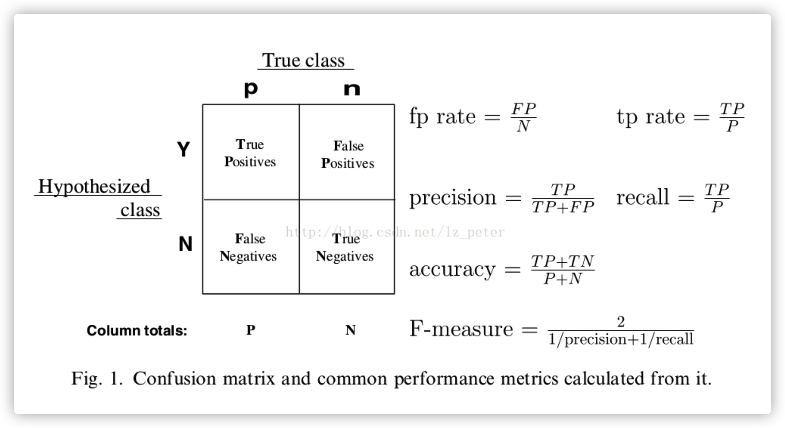
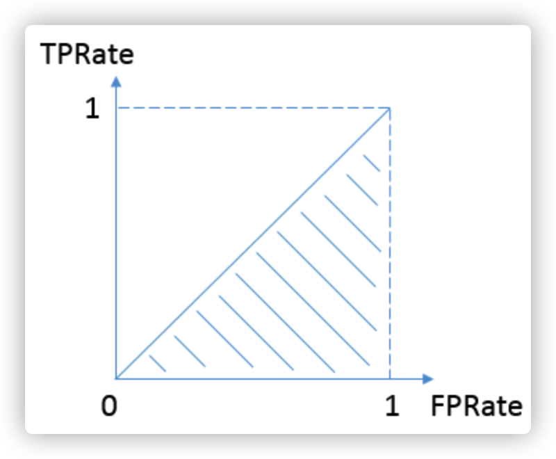

### 混淆矩阵

* **TPRate**的意义是所有真实类别为1的样本中，预测类别为1的比例。
* **FPRate**的意义是所有真实类别为0的样本中，预测类别为1的比例。
* **准确率（Accuracy）** 准确率是常用的一个评价指标，但是不适合样本不均衡的情况。
* **精确率（Precision）** 又称查准率，正确预测为正样本（TP）占预测为正样本(TP+FP)的百分比。
* **召回率（Recall）** 又称为查全率，正确预测为正样本（TP）占正样本(TP+FN)的百分比。

#### AUC & ROC

[$Source$](https://www.zhihu.com/question/39840928)​

AUC即ROC曲线下的面积，而ROC曲线的横轴是FPRate，纵轴是TPRate，当二者相等时，即y=x