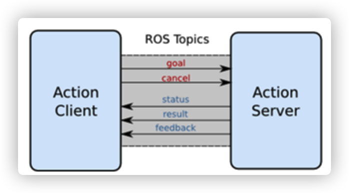
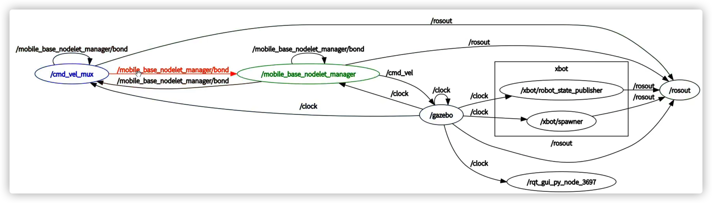

Ros：软件工具集


Ros工程结构图：


```sh
source /opt/ros/noetic/setup.bash # 让ros找到自己编译好的包（pkg）
```

Metapakage：将具有相似功能的软件包组织起来，apt-get时就不要一个一个下载，而是直接下载Metapakage

node：topic，pub/sub通信方式

server：

***

**ROS**

Robot Operator System

是一个适用于机器人编程的**框架**，这个框架把原本松散的零部件耦合在了一起，为他们提供了**通信架构**。ROS虽然叫做**操作系统**，但并非Windows、Mac那样通常意义的操作系统，它只是连接了操作系统和你开发的ROS应用程序，所以它也算是一个**中间件**，基于ROS的应用程序之间建立起了沟通的桥梁，所以也是运行在Linux上的**运行时环境**，在这个环境上，机器人的感知、决策、控制算法可以更好的组织和运行。

**Catkin编译系统**

c/c++程序要经过预处理、编译、汇编、链接才会生成可执行文件，对于大型项目来说不便于管理，所以出现了make，make还可以减少编译的次数，但它还是太基础（类似shell），抽象程度不高，且不能跨平台，所以出现了cmake，对于ROS这样大体量的平台来说，就采用的是CMake，并且ROS对CMake进行了扩展，于是便有了Catkin编译系统。


一个catkin包必须啊包含：

* package.xml

  pacakge.xml 包含了package的名称、版本号、内容描述、维护人员、软件许可、编译构建工具、编译依赖、运行依赖等信息。
  实际上 rospack find 、 rosdep 等命令之所以能快速定位和分析出package的依赖项信息，就是直接读取了每一个pacakge中的 package.xml 文件。它为用户提供了快速了解一个pacakge的渠道

* CMakeLists.txt

Catkin就是将`cmake`与`make`指令做了一个封装从而完成整个编译过程的工具

1. 首先在工作空间`catkin_ws/src/`下递归的查找其中每一个ROS的package。
2. package中会有`package.xml`和`CMakeLists.txt`文件，Catkin(CMake)编译系统依据`CMakeLists.txt`文件,从而生成`makefiles`(放在`catkin_ws/build/`)。
3. 然后`make`刚刚生成的`makefiles`等文件，编译链接生成可执行文件(放在`catkin_ws/devel`)。


**package相关命令**

ros + ls = rosls

ros + cd = roscd

rosdep

...

**ros的通信模式**

Node和Master。

* ROS中的最小单位就是Node，每个node可以说是一个进程，一个pacakge中会有多个可执行文件，运行之后就是一个进程，这就是一个node
* Master负责调配、管理这些Node，Node需要先在Master中注册，然后才能两两进行通信

首先，通过roscore启动ROS master，同时被启动还有rosout（负责日志输出）和parameter server（参数服务器相当于一个key-value字典）这两个Node。


然后，通过rosrun pkg_name node_name来启动node，一个一个启动太过于麻烦，可以将这些操作合并写到launch文件中，一次性把多个节点按照我们预先的配置启动起来，减少我们在终端中一条条输入指令的麻烦。

**Topic**

适用于**实时性、周期性消息**，其中有两个角色：

* publisher：发布topic，并不断往该topic发送msg

* subscriber：订阅某个topic，并通过事先传入的函数指针来处理msg

  

* 一个topic能被多个pub发布，也可以被多个sub订阅。

* pub发送完数据后会立即返回是异步的

其中msg为事先在msg/\*.msg定义。由catkin编译后会在include生成对应的\*.h文件。

**Service**

适用于**请求-查询**模式类似于rpc调用，其中有两个角色：

* server：提供持续的服务
* client：向server发起请求，server反馈接口，结束。

|   名称   |              Topic               |              Service              |
| :------: | :------------------------------: | :-------------------------------: |
| 通信方式 |             异步通信             |             同步通信              |
| 实现原理 |              TCP/IP              |              TCP/IP               |
| 通信模型 |        Publish-Subscribe         |           Request-Reply           |
| 映射关系 |    Publish-Subscribe(多对多)     |      Request-Reply（多对一）      |
|   特点   | 接受者收到数据会回调（Callback） | 远程过程调用（RPC）服务器端的服务 |
| 应用场景 |       连续、高频的数据发布       |     偶尔使用的功能/具体的任务     |
|   举例   |     激光雷达、里程计发布数据     |    开关传感器、拍照、逆解计算     |

同理service也需要srv文件来定义服务，包括**请求参数与响应参数**两部分。

client向server发请求的过程是同步的。

**Action**

Action弥补了service的不足---client长时间得不到server的反馈。



* goal：client向server发起请求时的参数
* feedback：server将实时的状态信息反馈给client
* result：server返回本次调用的结果


* cancel：取消此次调用
* status：当前时刻调用的状态（是否成功actionlib::SimpleClientGoalState::SUCCEEDED）

同理需要定义action文件，但只需要定义上面三个属性。

**一些工具**

* Gazebo：一种最常用的ROS仿真工具（全部信息）

* RViz：是可视化工具，是将接收到的信息呈现出来（可以是部分信息，比如激光雷达显示的与障碍物的距离）

* Rqt：则是数据流可视化工具，可以直观的看到消息的通信架构和流通路径

  * rqt_graph：node与topic

    

  * rqt_plot：将topic的一些参数以曲线的形式绘制出来

    

* Rosbag： 则是对软件包进行操作的一个命令

  记录指定topics的msg（创建一个node订阅topic并加上时间戳保存），然后可以通过回放功能按照时间戳重现这些msg（创建一个node并往之前的topic上按时间戳顺序发布数据）。

