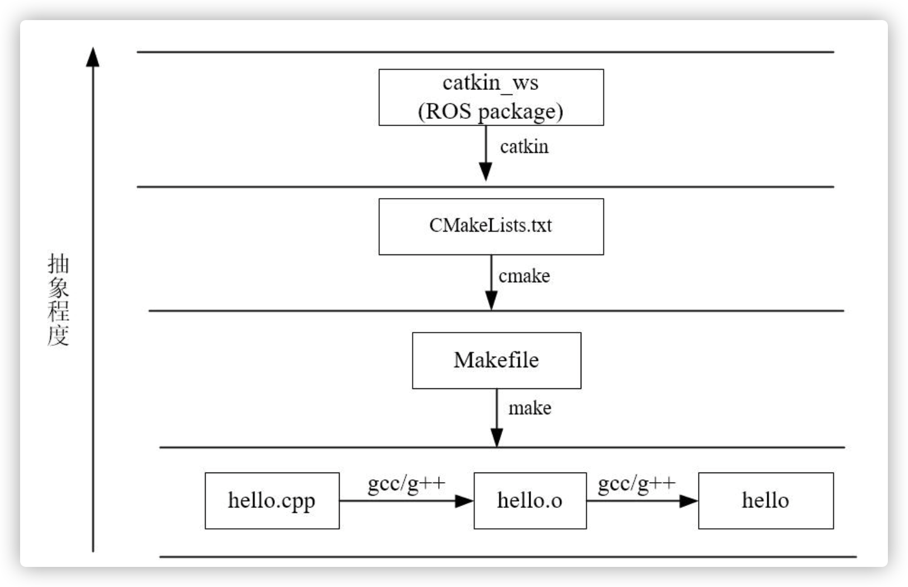
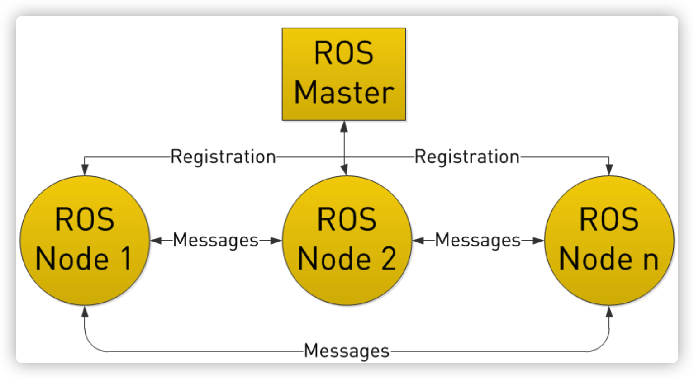
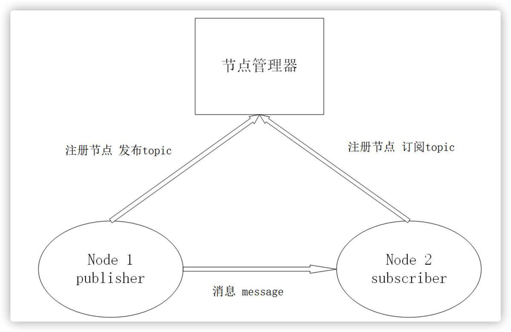
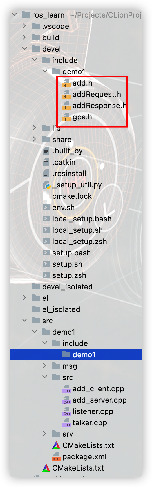
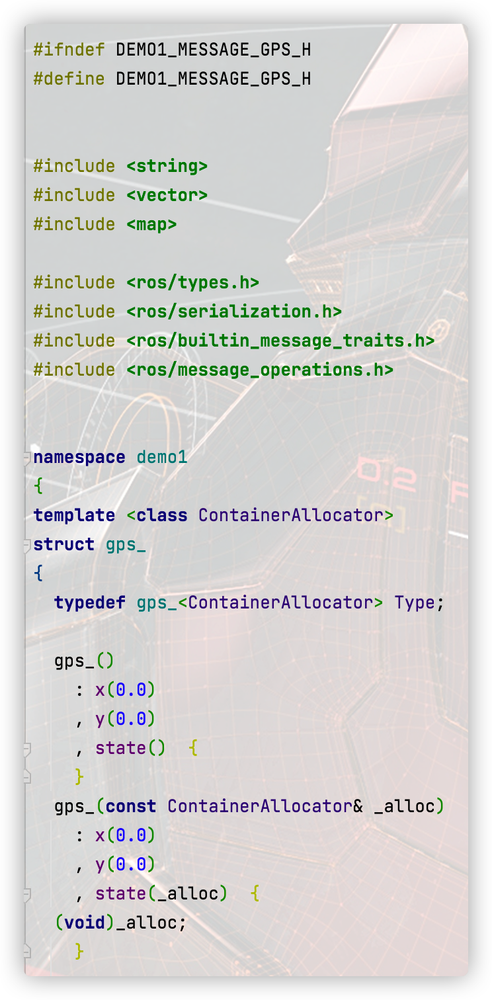
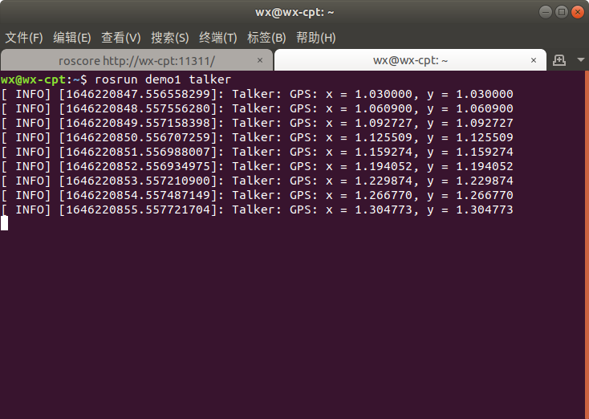
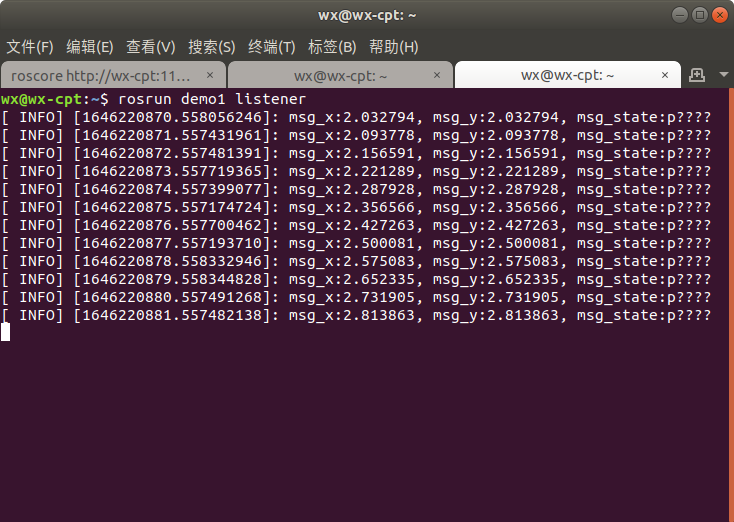
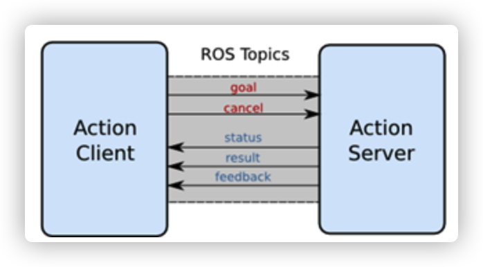
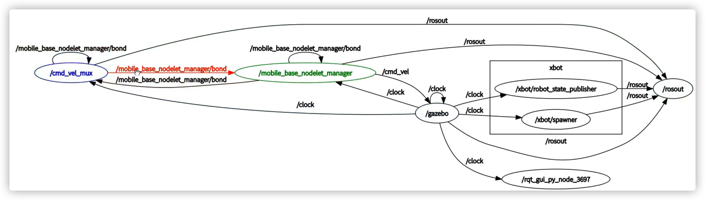
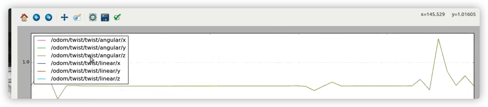

# ROS

Robot Operator System，虽然叫做操作系统，但实际上并非win、linux那样通常意义上的操作系统，算是一个框架，一个**通信框架**将原本松散的零部件耦合在了一起。

# Catkin编译系统

C/C++程序要经过预处理、编译、汇编、链接才会生成可执行文件，对于大型项目来说不便于管理，所以出现了make，make还可以减少编译的次数，但它还是太基础（类似shell），抽象程度不高，且不能跨平台，所以出现了CMake，对于ROS这样大体量的平台来说，就采用的是CMake，并且ROS对CMake进行了扩展，于是便有了Catkin编译系统。



一个catkin包必须包含：

* package.xml

  pacakge.xml 包含了package的名称、版本号、内容描述、维护人员、软件许可、编译构建工具、**编译依赖、运行依赖**等信息。

* CMakeLists.txt

Catkin就是将`cmake`与`make`指令做了一个封装从而完成整个编译过程的工具。

## ROS工程结构


Catkin工作方式：

1. 首先在工作空间`catkin_ws/src/`下递归的查找其中每一个ROS的package。
2. package中会有`package.xml`和`CMakeLists.txt`文件，Catkin(CMake)编译系统依据`CMakeLists.txt`文件,从而生成`makefiles`(放在`catkin_ws/build/`)。
3. 然后`make`生成的`makefiles`等文件，编译链接生成可执行文件(放在`catkin_ws/devel`)。

所以默认情况下需要在工作空间（即src的上级目录）进行编译catkin_make

## Package的相关命令

ros + ls = rosls

ros + cd = roscd

rosdep

...

实际上 rospack find 、 rosdep 等命令之所以能快速定位和分析出package的依赖项信息，就是直接读取了每一个pacakge中的 package.xml 文件。它为用户提供了快速了解一个pacakge的渠道。

# ROS的通信模式

Node和Master。

* ROS中的最小单位就是Node，每个node可以说是一个进程，一个pacakge中会有多个可执行文件，运行之后就是一个进程，这就是一个node
* Master负责调配、管理这些Node，Node需要先在Master中注册，然后才能两两进行通信

首先，通过roscore启动ROS master，同时被启动还有rosout（负责日志输出）和parameter server（参数服务器相当于一个key-value字典）这两个Node。



然后，通过rosrun pkg_name node_name来启动node，一个一个启动太过于麻烦，可以将这些操作合并写到launch文件中，一次性把多个节点按照我们预先的配置启动起来，减少我们在终端中一条条输入指令的麻烦。

## Topic

适用于**实时性、周期性消息**，其中有两个角色：

* publisher：发布topic，并不断往该topic发送msg

* subscriber：订阅某个topic，并通过事先传入的函数指针来处理msg

  

* 一个topic能被多个pub发布，也可以被多个sub订阅。

* pub发送完数据后会立即返回是异步的

其中msg为事先在msg/\*.msg定义。由catkin编译后会在include生成对应的\*.h文件。



基本上各种通信方式都差不多是如下的开发框架，只是业务逻辑不同罢了。

 publisher：

```cc
// 开发ros必备的头文件
#include<ros/ros.h>
// ros根据gps.msg生成的头文件
#include<demo1/gps.h>

int main(int argc, char** argv) {
    // 解析ros参数，并为这个node取一个名字
    ros::init(argc, argv, "talker");
    // 初始化node
    ros::NodeHandle nh;
  	// 业务逻辑
    demo1::gps msg;
    msg.x = 1.0;
    msg.y = 1.0;
    msg.state = "working";
    // 创建publisher
    ros::Publisher pub = nh.advertise<demo1::gps>("gps_info", 1);
    // 设置循环频率，1.0 = 1.0hz
    ros::Rate loop_rate(1.0);
    while(ros::ok()) {
       // 待发数据
        msg.x *= 1.03;
        msg.y *= 1.03;
       ROS_INFO("Talker: GPS: x = %f, y = %f ",  msg.x ,msg.y);
       // 发送数据
       pub.publish(msg);
       // 根据设定的频率sleep 
       loop_rate.sleep();
    }
    return 0;
}
```

subscribe：

```cc
#include<ros/ros.h>
#include<demo1/gps.h>
void subCallback(const demo1::gps::ConstPtr &msg);
int main(int argc, char** argv) {
    ros::init(argc, argv, "listener");
    ros::NodeHandle n;
    ros::Subscriber sub = n.subscribe("gps_info", 1, subCallback);
  	// ros::spin()用于调用所有可触发的回调函数。将进入循环，不会返回
    ros::spin();
    return 0;
}

// 回调函数
void subCallback(const demo1::gps::ConstPtr &msg) {
    ROS_INFO("msg_x:%f, msg_y:%f, msg_state:%s",msg->x, msg->y, msg->state );
}
```

gps.msg:

```msg
float32 x
float32 y
string state
```

gps.msg经编译后会变为gps.h并存在devel/pkg_name/gps.h





demo1下的CMakeLists：

```cmake
cmake_minimum_required(VERSION 3.0.2) # cmake最低版本要求
project(demo1) # 项目名

# 在系统路径中查找catkin库，如mac就在/usr/local/lib有着事先安装好的静/动态库
find_package(catkin REQUIRED COMPONENTS 
  roscpp
  rospy
  std_msgs
  genmsg # 用于编译msg、srv、action文件
  message_generation
)
# catkin自定义的宏，用于编译msg、srv、action文件
add_message_files( FILES gps.msg)
add_service_files(FILES
  add.srv
)
# 用于生成srv msg头文件/module，生成的文件位于devel/include中
generate_messages(DEPENDENCIES std_msgs)

# CATKIN_DEPENDS - 该项目依赖的其他catkin项目
catkin_package(
  CATKIN_DEPENDS
  message_runtime
)

# 导入头文件（预处理时需要找到头文件）
include_directories(
  include ${catkin_INCLUDE_DIRS}
   include
  ${catkin_INCLUDE_DIRS}
)

# 生成target文件（此处为node可执行文件）
add_executable(talker src/talker.cpp)
# 指定target文件所需要的链接库
target_link_libraries(talker ${catkin_LIBRARIES})
# 为编译器指出demo1_generate_messages_cpp要先于target编译
add_dependencies(talker demo1_generate_messages_cpp)

add_executable(listener src/listener.cpp)
target_link_libraries(listener ${catkin_LIBRARIES})
add_dependencies(listener demo1_generate_messages_cpp)

add_executable(server src/add_server.cpp)
target_link_libraries(server ${catkin_LIBRARIES})
add_dependencies(server demo1_gencpp)

add_executable(client src/add_client.cpp)
target_link_libraries(client ${catkin_LIBRARIES})
add_dependencies(client demo1_gencpp)
```

pacakage.xml

```xml
<?xml version="1.0"?>
<package format="2">
  <name>demo1</name>
  <version>0.0.0</version>
  <description>The demo1 package</description>


  <maintainer email="wx@todo.todo">wx</maintainer>
  <license>TODO</license>
  
  <!--编译工具为catkin-->
  <buildtool_depend>catkin</buildtool_depend>
  
  <!--编译时需要依赖以下包-->  
  <build_depend>roscpp</build_depend>
  <build_depend>rospy</build_depend>
  <build_depend>std_msgs</build_depend>
  <build_depend>message_generation</build_depend>
  
  <!--构建导出依赖关系-->  
  <build_export_depend>roscpp</build_export_depend>
  <build_export_depend>rospy</build_export_depend>
  <build_export_depend>std_msgs</build_export_depend>
  <build_export_depend>message_generation</build_export_depend>
  
  <!--运行时需要依赖以下包-->
  <exec_depend>roscpp</exec_depend>
  <exec_depend>rospy</exec_depend>
  <exec_depend>std_msgs</exec_depend>
  <exec_depend>message_runtime</exec_depend>


  <export>

  </export>
<build_export_depend>message_generation</build_export_depend>
</package>
```

完成后即可在工作空间catkin_make编译项目，然后先启动master(roscore)，在启动pub，最后是sub：

```sh
roscore
source ~/demo1/devel/setup.bash # 将编译好的项目加入ros管理的包中
rosrun demo1 takler # rosrun pkg_name node_name
rosrun demo1 listener
```

结果图：





## Service

适用于**请求-查询**模式类似于rpc调用，其中有两个角色：

* server：提供持续的服务
* client：向server发起请求，server反馈接口，结束。

同理service也需要srv文件来定义服务，包括**请求参数与响应参数**两部分。

client向server发请求的过程是同步的。

Server:

```cc
#include "ros/ros.h"
#include"demo1/add.h"
#include<iostream>

bool add(demo1::add::Request &req, demo1::add::Response &res) {
    std::cout<<"input: "<<req.a<<" "<<req.b<< std::endl;
    res.sum = req.a + req.b;
    return true;
}

int main(int argc, char** argv) {
    ros::init(argc, argv, "add_server");
    ros::NodeHandle n;
    ros::ServiceServer service = n.advertiseService("add_two", add);
    ROS_INFO("Ready...");
    ros::spin();
    return 0;
}
```

Client:

```cc
#include "ros/ros.h"
#include"demo1/add.h"
#include<cstdlib>
#include<iostream>

int main(int argc, char** argv) {
    ros::init(argc, argv, "add_client");
    if(argc != 3) {
        ROS_INFO("add_client");
        return 1;
    }
    ros::NodeHandle n;
    ros::ServiceClient client = n.serviceClient<demo1::add>("add_two");
    demo1::add srv;
    srv.request.a = atoll(argv[1]);
    srv.request.b = atoll(argv[2]);
    std::cout<<"input: "<<atoll(argv[1])<<" "<<atoll(argv[2])<< std::endl;
    if(client.call(srv)) {
        ROS_INFO("Sum: %ld", (long int)srv.response.sum);
    }else {
        ROS_ERROR("Failed to call service add_two_ints");
        return 1;
    }
    return 0;
}
```

## Action

Action弥补了service的不足---client长时间得不到server的反馈。



* goal：client向server发起请求时的参数
* feedback：server将实时的状态信息反馈给client
* result：server返回本次调用的结果


* cancel：取消此次调用
* status：当前时刻调用的状态（是否成功actionlib::SimpleClientGoalState::SUCCEEDED）

同理需要定义action文件，但只需要定义上面三个属性。

# 工具

* Gazebo：一种最常用的ROS仿真工具（全部信息）

* RViz：是可视化工具，是将接收到的信息呈现出来（可以是部分信息，比如激光雷达显示的与障碍物的距离）

* Rqt：则是数据流可视化工具，可以直观的看到消息的通信架构和流通路径

  * rqt_graph：node与topic

    

  * rqt_plot：将topic的一些参数以曲线的形式绘制出来

    

* Rosbag： 则是对软件包进行操作的一个命令

  记录指定topics的msg（创建一个node订阅topic并加上时间戳保存），然后可以通过回放功能按照时间戳重现这些msg（创建一个node并往之前的topic上按时间戳顺序发布数据）。