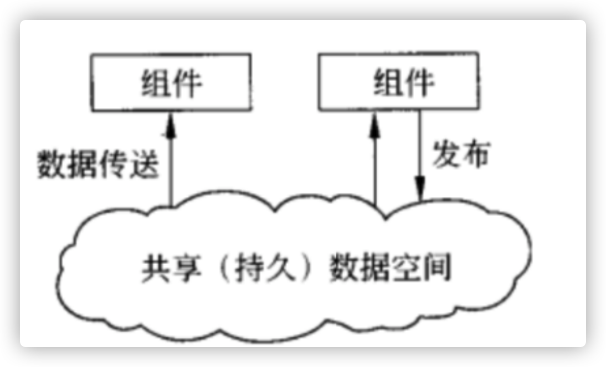
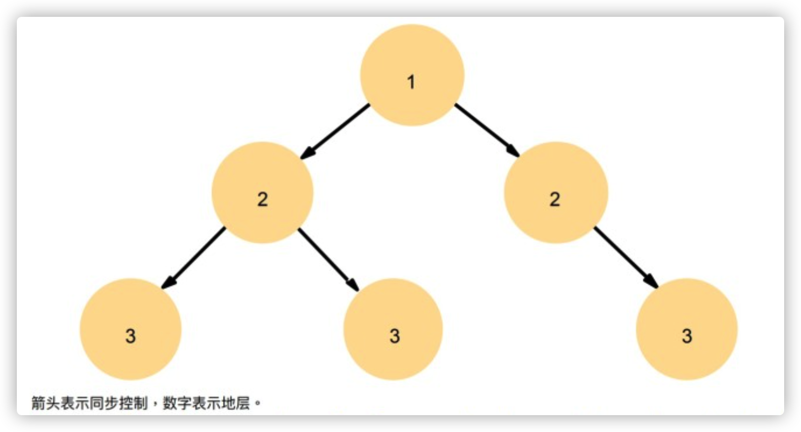
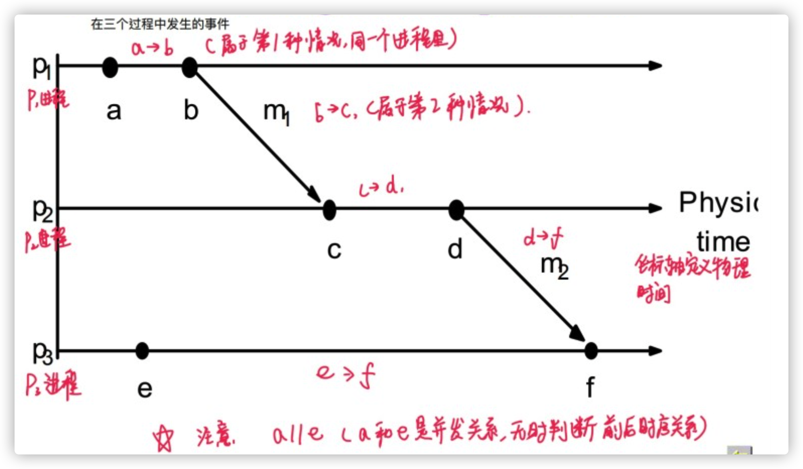
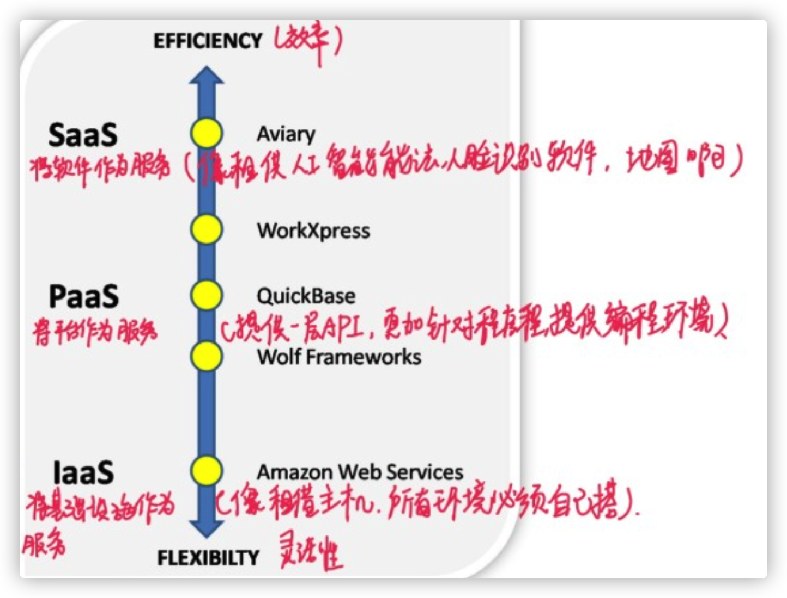

# 梗概

## 定义

* 分布式系统是**软件**。
* 分布式系统是一组独立计算机组织在一起，对用户来说好像一个统一的系统。

## 目标`Goals`

* `Making Resource Accessible`

  分布式系统最主要的目标是使用户能够方便地访问远程资源，并且以一种受控的方式与其他用户共享这些资源。

* `Distribution Transparency`

  * **存取透明性**：对不同数据表示形式以及资源访问方式的隐藏
  * **位置透明性**：终端用户不知道资源存到哪里（比如，个人访问科大主页，但是不知道科大主页放在哪个地方）
  * **迁移透明性**：资源从一个地方迁移到另一个地方，用户不知道（这在分布式文件系统中体现的非常明显）
  * **重定位透明性**：在使用资源时，资源可以从一个地方，移到另一个地方，用户不知道
  * **复制透明性**：资源可能是多复制的，解决可靠性，在分布式系统中大量应用，给用户减少大量工作
  * **并发透明性**：终端用户不知道，自己可能与其他用户一块并发使用某个资源
  * **错误透明性**：即容错系统，能够屏蔽系统可能发生的故障

* `Openness`：开放的分布式系统应该能够与其他开放系统的服务交互，与底层环境无关。

  * 系统应该定义良好的接口
  * 系统应该支持应用程序的可移植性
  * 系统应该易于交互

* `Scalability`

  * **规模可拓展**：主要在用户数、进程数可以拓展

    1. 没有机器拥有完整的系统信息。*没有一个节点能通过通讯知道所有节点的状态*
    2. 节点做决策仅仅依靠本地信息得到最优解。*无法得到全局最优解*
    3. 一台机器出故障，不会影响分布式系统。*体现算法的健壮性*
    4. 不能假设有全局时钟的存在来统一时间。

  * **地理可拓展**：是指节点距离有关

  * **管理域可拓展**：管理域（语言不同，底层系统不同）扩大，这是目前难度最大的扩展

    最难，尽可能避免管理域扩展，目前都是采用单管理域。

  如果分布式里存在集中式，将会影响可扩展性，解决方法：

  |  Concept   |               Example                |
  | :--------: | :----------------------------------: |
  | 集中式设备 |        单个应用服务多个使用者        |
  | 集中式数据 | 全部应用使用同一个数据如：在线电话本 |
  | 集中式算法 |        基于全局信息的路由算法        |

  实现扩展性的技术：

  * 隐藏通信延时
    * 利用异步通信
    * 单独处理每个传入的响应

  * 分片技术

    * 如`DNS`对名称空间进行划分，实现扩展

      

  * 复制/缓存：是数据的副本在不同的机器上可用

    * 备份文件服务器和数据库
    * 镜像的`web`站点
    * 文件缓存（服务器/客户端）

    > 缓存与复制：
    >
    > ​      缓存由资源的客户端而不是服务端来决定产生与否。
    >
    > ​      缓存按需进行，而复制通常是提前计划好的。

  并非每个程序都适用。

* `Pitfalls`陷阱：分布式系统中有许多陷阱

目标“透明性”：是分布式系统最主要的目标，但是是有限的。

> 完全隐藏网络和节点的故障是不可能的（理论&实践上都是如此）
>
> 完全透明性将以牺牲性能为代价，暴露系统的分布。

## 三种分布式系统

* `Distributed Computing System`：用于高性能计算

  * 同构，相同的OS，几乎相同的硬件
  * 单个管理节点
  * **HPC**：高性能计算系统，主要在CPU能耗上。
  * **HTC**：高吞吐量计算系统，主要在IO消耗上。

* `Distributed Information System`：如中间件

* `Distributed Pervasive System`分布式普适系统：区块链、物联网、WIFI等

  * 正在出现的下一代分布式系统，节点较小、可移动并且通常嵌入为较大系统的一部分：

    * 可穿戴系统

      

    * 传感网络：节点是平等的，无C/S节点之分；网络节点多

      

    普适网络与前面网络的区别：

    ​	普适网络一般是P2P的，变化频繁拓扑变化大，无中心管理，无专门的路由器的存在。

## 特点

* 计算机之间的差异以及通信之间的差异大部分对用户而言是隐藏的
* 用户可以随时随地的与应用程序进行**一致且统一**的进行交互

分布式系统作为中间件，隐藏了差异性。

幂等性：是系统的接口对外一种承诺(而不是实现), 承诺只要调用接口成功, 外部多次调用对系统的影响是一致的. 声明为幂等的接口会认为外部调用失败是常态, 并且失败之后必然会有重试

***

# 架构

## 体系结构风格`Architectural Styles`

分布式分为两部分：

* `Component`
* `Connect`

分布式系统做的就是把`Component `给`Connet`。

架构风格是根据`Componet`来制定的：

* `Component`的`Connent`方式
* `Component`之间数据的交换
* 这些元素别联合的置于一个系统中

### 分层架构`Layered Architectures`

使用面向对象语言，面向分层的思想来设计，对`Component`当成一个对象，`Component`之间的连接通过网状结构来连接。

### 基于对象的结构`Object-based Architectures`

每个对象都对应一个组件，这些组件是通过(远程)过程调用机制来连接的。

### 数据为中心架构`Data-centered Architectures`

进程通过公共（被动或主动）存储库进行通信。*软体中有提到*

### 基于事件的架构`Event-based Architectures`

通过事件的传播来通信。

* Publish/Subscibe
* 共享数据空间，在时间和空间上接耦

## 系统架构`System Architecture`

决定软件组织、它们的交互以及它们的位置将导致软件体系结构的实例。

### 集中式架构`Centralized Architecture`

围绕服务器来操作，代码会放在单一服务器上，操作简单，数据一致性好。*请求-回复*

* C/S架构
* 文件系统服务或者数据库服务

典型的同步通信，架构实现简单，只用TCP/IP即可。

**优点**：

* 简单易于实现

**缺点**：

* 造成缺失异常操作不知道错误出在哪
  * 客户端可以通过**超时**判断请求消息的丢失
  * 客户端无法判断是**请求丢失**还是**响应丢失**

**幂等性**：允许多次传输重复的应用。

​	用户对于同一操作发起的一次请求或者多次请求的结果是一致的。*数据重复时的去重操作*

**非幂等性**：不允许多次传输重复的应用。

**`at most once`**：最多传输一次数据，有可能一次都没传输成功。

**`at least once`**：最少成功传输一次，有可能成功了多次。

> 在非幂等性应用中是不允许重复的，或者是没法对其进行幂等性处理的，此时就必须使用`at most once` 如果出错在通过检查数据、回滚等操作做后续的处理（处理比较麻烦、回滚事务费时间）。

### 分散式架构`Decentralized Architecture`

**水平分布**：

* 客户端/服务器在物理上被分为逻辑等价的部分
* 每个部分都有自己完整的数据

Example: 

* P2P *peer-to-peer*
* 复制和集群 *replication&cluster*

#### `peer-to-peer`

**What**：网络中的节点既是请求者，也是响应者

**区别**：与以往网络最大的不同点，是两层网络，**逻辑网络**和**物理网络**。逻辑网络和物理网络并不一致。比如：物理网络是电缆连接，逻辑网络是星型拓扑。`P2P`都是在[覆盖网络](https://baike.baidu.com/item/%E8%A6%86%E7%9B%96%E7%BD%91%E7%BB%9C)上的。

**无结构的`P2P`系统**：结点的邻居是随便选的

**有结构的`P2P`系统**：结点的邻居是有规则选的，按照一定的规则进行选择邻居结点

**混合式`P2P`系统**：二者皆备

##### `Napster`

**注册过程**：

1. 客户机连接服务器
2. 上传key-value对
3. 服务器维护索引

**搜索下载过程**：

1. 客户机在服务器查找曲目
2. 服务器返回有主机列表元组（键值对）
3. 客户机进行ping，找到最快传输速度的主机
4. 进行传输

> Napster不算是真正意义上的p2p，因为在Napster系统中依然有集中式服务器的存在
>
> 所以有集中式架构的那些缺点，传输错误、容易阻塞。。。
>
> 但是又不同于以往的集中式架构，因为客户机不是从服务器上下载音乐

##### `Gnutella`

纯`P2P`系统

* 无服务器
* 搜索也是`P2P`架构
* 客户端也充当服务器，称为服务对象

把消息分成不同的协议类型：

* `Query`：每个节点只会转发一次

* `QueryHit`：接到`Query`后，查询本机是否有需要的文件，有的话返回`QueryHit`

  

做`Search`通过`Flooding`无目的地的向四周发`Query`等待`QueryHit`，收到多个`QueryHit`后会对其进行对比返回最优路径，通过`TTL`来避免无限广播

* `Ping`
* `Pong`

做网络发现，希望知道网络周围大致情况进行试探。*周围都是动态变化的*

* `Push`

用来进行文件传输

**缺点**：

* $50\%$的时间都被用来执行`ping`、`pong`操作，用来探知周围节点的变化，进行更新维护自己的列表，导致效率不高
* 大量白嫖用户。*只下载文件，从不上传文件*
* `Flooding`导致流量过大

##### `Chord`

pass

##### `FastTrack`

`Gnutella`与`Napster`的混合体

`FastTrack`被称为第二代`P2P`协议，它基于`Gnutella`协议，并扩展加入了`supernode`，以改进可扩展性。`supernode`的功能内置于客户端中，如果一个客户端计算机性能足够，而且网络连接速度快，那它就自动成为`supernode`。`supernode`为那些速度较慢的节点提供索引服务。

一开始的时候，客户端中保存了一个`supernode`的`IP`地址的列表，它会试图连接这些IP直至找到一个活动的`supernode`，它会向这个 `supernode`索取当前活动的`supernode`的列表，并更新自己保存的列表。客户端把自己共享的文件列表告诉`supernode`，也从 `supernode`检索自己想要的文件，一旦检索到文件，就会直接与文件的所有者连接，并通过`HTTP`协议进行下载。

### 混合式架构`Hybrid Architecture`

##### `BitTorrent`

*也是`P2P`中的一种*

是一种混合式的架构，服务器用来保存`torrent`文件，但实际的下载还是去其他客户端上。

具体来说：

* 就是上传者在上传的时候，把文件分成n份。
* 甲在服务器上随机下载了X部分，而乙随机下载了Y部分。
* 这样甲的BT在下载的时候就会去乙的服务器上拿乙的Y部分，而乙拿甲的X部分。
* 这样就减轻的中心服务器的负荷，同时下载的人越多，下载的速度越大。

其中：

* 甲、乙客户端先到web上找到`torrent`文件。
* 通过解析`torrent`文件，得到很多的track，选择一个track server 上 里面有很多的Node iP。
* 然后选择一个IP进行下载。*track代表一份文件的一部分*

> 举一个不太恰当的例子，班里一共有4个同学，小明、张三、李四和王五，只有小明是学霸，别的同学都指望抄小明的作业，张三抄完李四抄，然后是王五。
>
> 有一次作业收得急，来不及轮流抄。小明就想了个办法，让他们一人抄一部分，然后彼此互相抄，这样小明作为发布者，只要将作业集中分块传播一次就可以了，且如果隔壁班的同学如果想抄作业，不用直接找小明，找张三李四王五都可以。
>
> 如此一来，大家抄作业的速度就都变快了。
>
> [source](https://www.zhihu.com/question/290920622/answer/1847218775)
>
> 所以为什么经常下载到$99\%$就下载不动了，这是因为剩下的$1\%$所在的节点特别难下。

***

# 进程

## 线程

**处理器**：提供一组指令以及自动执行一系列指令的能力

**线程**：**线程是CPU调度的最小单位**（最小的软件处理器）

**进程：**是某种类型的一个活动，有程序、输入、输出以及状态

* 资源分配的最小单位
* 程序的一次执行过程。*一个正在执行的程序的实例*

进程中的通信：

* 共享存储
* 消息传递
  * 直接通信，将消息发送至对方缓冲区
  * 间接通信，将消息发送至某个中间实体
* 管道通信

***

**处理器上下文**：存储在处理器寄存器中的值的最小集合，用来执行命令

**线程上下文**：存储在处理器寄存器和内存中的值的最小集合，用来执行命令

**进程上下文**：存储在处理器寄存器中的值的最小集合，用来执行线程命令

线程比之进程：

* 线程拥有共享一个地址空间和所有可用数据的能力

  * 进程通信需要IPC
  * 线程可以直接读/写数据段，来进行通信

* 比进程更容易创建，也更容易撤销

  它们的切换需要：

  1. 切换虚拟地址空间（寄存器内容的切换、页表查找、CPU高速缓存）
  2. 切换内核栈和硬件上下文

  进程都需要，线程只需要1。

* 对于IO密集型任务，拥有多个线程允许这些活动重叠进行。

线程：

* 用户级线程

* 内核级线程

* 组合方式

  缺点：当发生系统调用阻塞后，那个被阻塞的LWP一旦完成，需要反向通知上层，效率低

### 多线程服务器

两种线程：

* **`Dispatch Thread`**：分发任务
* **`Worker Thread`**：执行任务

|   Model    |   Characteristics    |
| :--------: | :------------------: |
|   多线程   |  并行、阻塞系统调用  |
| 单线程模型 | 无并行、阻塞系统调用 |
|   `FSM`    | 并行、非阻塞系统调用 |

## 虚拟化

传统计算机与虚拟机之间的差距：

**传统计算机**：硬件，操作系统，应用

**虚拟化后**：用主操作系统跑的硬件，虚拟层，虚拟机（虚拟机里有：虚拟硬件，客户操作系统，应用）

虚拟化软件通过在计算机系统的不同层插入虚拟化层来创建虚拟机抽象。

### `ISA`指令集体系结构级

将一个指令系统拦截翻译成另外一个指令系统

优点：可以兼容大量旧的二进制代码

缺点：性能损失较大。*一条源指令可能需要数十条甚至上百条本地目标指令来完成*

### 硬件抽象级

硬件级虚拟机直接在原始硬件之上进行。如`VMware`

* 为一个虚拟机产生一个虚拟硬件环境
* 虚拟化进程通过虚拟化来管理硬件

在硬件层上做虚拟化，位虚拟机生成虚拟硬件环境，并通过虚拟化来管理硬件，用的最广！

优点：具有较高的性能和良好的应用隔离性

缺点：由于硬件型号的复杂性，实施的成本也很高

### 操作系统级

是传统操作系统和用户位置之间的抽象层，在单个物理服务器和OS实例上创建容器，以利用数据中心的硬件和软件

通常被用来**创建虚拟环境**。

> 初始化一个硬件级虚拟机很慢，因为每一个虚拟机都需要从头创建自己的镜像。在云计算环境中，可能需要同时初始化上千个虚拟机。
>
> 除了操作比较慢之外，虚拟机镜像的存储也是一个问题。虚拟机镜像中存在大量重复内容。
>
> 硬件级的全虚拟化技术性能较低（早期VMware），而半虚拟化则需要修改客户操作系统。
>
> 操作系统级虚拟化在一个操作系统中插入一个虚拟化层来划分机器资源。

优点：

* 具有最小的启动、停止开销，资源需求低，可展性强
* 当需要时，可同步虚拟机和其主机环境状态的变化

缺点：

* 在一个容器中的操作系统级的所有虚拟机必须使用相同的客户操作系统。*一个windows发行版不能允许在一个基于linux的容器中*

###  库支持级

大部分应用程序使用用户级库提供的API而不是操作系统提供的冗长的系统调用。

如wine就相当于windows在linux上的“汉化组”。

###  应用程序级

将一个应用程序虚拟化成一个虚拟机。

优点：最高的应用程序隔离

缺点：性能低，应用灵活性低，实现复杂。*JVM具有JIT所以较快*

###  比较

## 客户端

* **胖客户端**：对于每个应用程序，创建一个客户端部分和一个服务器部分。*客户端在本地机器上运行*
* **瘦客户端**：创建在客户机上运行的可重用GUI工具包。

## 服务器

**定义**：一个进程，在特定的传输地址上来等待传入服务请求

###  迭代服务器

一次只能处理一个

自己处理请求，并且在必要的情况下将响应返回给发出请求的客户。

一次只能处理一个客户端请求，而并发服务器不同。

###  并发服务器

同时处理多个请求

并不自己处理请求，而是将请求传递给某个独立线程或者其他进程来处理，自身立即

返回并等待下一个输入的请求。

###  超级服务器

负责监听所有与这些服务关联的端点，当收到请求的时候，它派生出一个进程对该请求进行进一步处理，这个派生出的进程在处理完毕后将会自动退出运行。

###  无状态服务器

不保存客户的状态信息，而且也不将自身的状态变化告知任何客户。

* 不记录文件是否已经打开(只在访问后再次关闭文件)；
* 不一定会使得客户的缓存变无效；
* 不跟踪客户行为。

后果：

* 客户端与服务器端完全独立；
* 非无状态服务器的情况下，由于客户或者服务器端某一方发生崩溃，从而导致双方状态不一致。而在无状态服务器中，因为是无状态的，这种状态不一致的情况大大减小了；
* 因为某些原因性能可能会有所降低，例如服务器无法预测客户的行为(比如预取

文件块)。

###  有状态服务器

跟踪客户的状态，一直保留客户端的信息直到被显式删除，包括：

* 记录文件已被打开，以便可以进行预取；
* 知道客户端缓存了哪些数据，并允许客户端保留共享数据的本地副本
* 如果允许客户端保留本地副本，则可以提升读写操作的性能。

缺陷：

* 如果服务器崩溃，那么必须将自身的整个状态恢复到崩溃之前。
* 但是如果采用状态无关设计，就不需要采取任何特殊措施来使崩溃的服务器恢复。

###  `Cookies`

Cookies是一小段数据，其中包含有对服务器有用的针对特定客户的信息。浏览器本身永远不会执行cookie，它只对cookie进行存储。

Cookies可用于将当前客户端操作与先前操作相关联，也可用于状态的存储。

###  服务器集群

####  结构

**第一层**：利用负载均衡器分发请求，由它分配客户请求给服务器；

**第二层**：服务器集群，是专用于提供计算能力的服务器

**第三层**：与数据打交道，文件和数据库服务器，是分布式文件系统或分布式数据库系统

交换机形成了集群入口，提供了唯一的网络地址。

其中二、三层可以合并。

####  处理请求

一种标准的存取服务器集群的方式是建立一个TCP连接，在这之上应用级别的请求可作为一个会话的一部分来发送，撤除连接可结束会话。在传输层交换机的情况下，交换机接受到来的TCP连接请求，转发这些请求给一台服务器。

当交换机收到一个TCP连接请求时，他就找到处理这个请求的最佳服务器，并转发这个请求包给这个服务器。服务器反过来会发送一个应答给请求的客户，**但把交换机的IP地址插入到承载TCP数据段的IP包头的原地址域。(看上去是服务器欺骗客户自己是交换机**，但是客户等待的是交换机的应答，而不是某个不知名的服务器，所以这种欺骗是必须的。从而可以看出，实现TCP转发需要操作系统级别的修改) 

###  分布式服务器

分布式服务器指可动态变化的一个机器群，它的访问点也可以变化，但对外却表现为一强有力的单台机器。

如何在这样的系统中实现一个稳定访问点？

主要思想是利用可用的网络服务，比如IP版本6的移动支持(MIPv6)。在MIPv6中，一个移动结点假设有一个宿主网络，通常待在这个网络中，并有稳定的地址，称为宿主地址。

宿主网络有一个特别的路由器，称为宿主代理。当移动节点附着到一个外部网络时，它会收到一临时需要的地址，其他结点可以发送网络包给这个地址。这个临时地址通告给宿主代理，它随后就可以转发送给移动节点的网络包到这个临时地址。

在分布式服务器的情况下，给集群分配一个唯一的联系地址（服务器生命周期内和外界通信的地址），任何时候分布式服务器都有一节点作为联系地址的访问点，这个角色可以容易被另一结点取代。访问点在分布式服务器所在网络的宿主代理注册自己的地址为临时地址。这是所有的网络包都会导向访问点，他然后分配请求给当前参与分布式服务器的结点。若访问点失效，一个简单容错机制启动，另一个访问点会选出并注册一个新的临时地址。

这个配置会使得宿主代理和访问点称为瓶颈，因为这样所有的流量都要流经这两台机器，

可以使用MIPv6的路径优化（见下图）：

1. 客户知道服务器的地址是HA，把请求传给HA； 

2. 服务器的宿主代理把请求转发给当前临时地址CA； 

3. 宿主代理转发CA给客户；

4. 客户把(HA,CA)存储在本地，之后通信直接送给CA。 

## 代码迁移

为什么需要代码迁移：

* 将代码从负载重的节点转移到负载轻的代码，分担压力
* 降低通信成本（距离近，延迟就会低）
* 将代码移向数据（数据一般比代码大很多）

###  动态客户端配置

动态配置客户端以与服务器通信的原则。客户端首先获取必要的文件，然后调用服务器。

###  代码迁移模型

进程由以下三段构成：

* 代码段，包含构成正在运行的程序的所有指令；
* 资源段，包含指向进程需要的外部资源（文件、打印机、设备等）的指针；
* 执行段，用来存储进程的当前执行状态量（包括私有数据、栈、程序计数器等）。

代码移动性概念：

* 按性质划分：

  * 弱可移动性：只传输代码段以及某些初始化数据。传输过来的程序总是从预先定义的几个位置之一开始执行。*只迁移代码，可能还会加一些初始化数据*
  * 强可移动性：可以先停止运行中的进程，然后将它移到另一台机器上去，再从刚才中断的位置继续执行。*代码和执行阶段都得到迁移*

* 按发起方分类：

  * `Sender-Initiated Migration`：发起方启动，Push，适用于负载重的情况下。
  * `Receiver-Initiated Migration`：接受方启动，Pull，适用于负载轻的情况下。

  

***

# 通信`Communication`

按通信类型分类：

* 瞬时通信（手机短信）
* 持久通信（看直播）

按阻塞与否分类：

* 同步通信
* 异步通信

## 分层协议`Layered Protocols`

如七层网络协议：

### 面向连接

消息发送与接收双方需要先建立连接，再传输数据。如：虚电路

### 面向无连接

直接传数据：如邮件

### 中间件协议`Middleware Protocols`

中间件是一种应用程序，逻辑上位于应用层中。

* 中间件通信协议支持高层通信服务；
* 对实时数据传输进行设定并使其保持同步的协议；
* 还提供可靠的多播服务。

## 远端过程调用`RPC`

本地进程的两种常规的通信方式：

* 两个进程通过管道进行通信
* 一个进程调用另外一个进程

分布式进程希望能实现本地进程间通信一样，就模拟了这一操作。

如果采用第一种，那么这个管道必须是分布式的，具有全局性，将会有较大的代价。

一般采用第二种方法。

#### 基本`RPC`操作

这种基本的RPC操作有点像 C/S架构:

1. 客户端请求远端过程
2. 服务端调用本地过程并且返回结构，客户端一直在等待结果
3. 客户端接受服务端发来的结果

加上一层中间层`Stubs`：

作用：

1. 将参数打包
2. 向远端进程发
3. 远端解
4. 远端调用进程，返回值
5. 本地得到值

stub是用在远端调用中的：

* 客户端stub负责将参数消息打包，将远端调用代理为本地调用
* 服务端stub负责将参数消息解包，并调用一部分服务器端应用程序实现代码

##### 带`Stubs`的`RPC`

步骤：

1. 客户过程以正常的方式调用客户存根；

2. 客户存根生成一个消息，然后调用本地操作系统；

3. 客户端操作系统将消息发送给远程操作系统；

4. 远程操作系统将消息交给服务器存根；

5. 服务器存根将参数提取出来，然后调用服务器；

6. 服务器执行要求的操作，操作完成后将结果返回给服务器存根；

7. 服务器存根将结果打包成一个消息，然后调用本地操作系统；

8. 服务器操作系统将含有结果的消息发送回客户端操作系统；

9. 客户端操作系统将消息交给客户存根；

10. 客户存根将结果从消息中提取出来，返回给调用他的客户过程。

***

#### 参数传递`Passing Value Parameters`

完整定义了RPC协议后，需要实现客户存根和服务器存根，不同点仅仅在于面向应用程序的接口。

接口通常使用**IDL**(接口定义语言)，用IDL说明的接口可以与适当的编译时接口或者运行时接口一起编译到客户存根过程和服务器存根中。

`IDL`:

* 头文件`Header File`
* 客户端存根`The clinet stub`
* 服务器存根`The server stub`

定位服务器：

1. 定位服务器的机器。
2. 在该机器上找到进程端点（服务器）。

#### `RPC`分类

##### 同步`RPC`

客户端发送请求后，就一直等待

##### 异步`RPC`

* 客户发出RPC请求，接受到服务器的确认信息后，不会阻塞，继续向下执行；
* 服务器在接受到RPC请求后立即向客户送回应答，之后再调用客户请求的过程。

异步RPC效率高，但是难编程。

##### 延迟的同步`RPC`

就是两个异步RPC结合起来。

远程服务器在处理请求时，客户同时做一些其他的事情。当服务器处理好请求时，返回结果去中断客户，服务器一端变成发送端，实现第二个异步RPC。 

## 面向消息通信`Message-Oriented Communication`

### `Socket`

一种通信端点。如果应用程序要通过底层网络发送某些数据，可以把这些数据写入套接字，然后从套接字读出数据。

原语：

服务器一般执行前4个原语，一般按照图中顺序执行。调用套接字原语的时候，调用者创建一个新的通信端点，用于某种特定的传输协议的。

### 消息传递`MPI`

程序的硬件独立性需要导致MPI的出台。MPI是为并行应用程序设计的，是为瞬时通信量身定做的。它直接使用的是底层网络。

MPI是并行计算，一般运行于集群中。

### 消息队列模型`Message-Queue Model`

面向消息的中间件服务。为持久异步通信提供多种支持。本质是，提供消息的中介存储能力，这样就不需要消息发送方和接收方在消息传输中都保持激活状态。与套接字和MPI的重要区别在于，它的设计目标一般是支持那些时间要求较为宽松的消息传输，不适合几秒甚至几微秒内要完成的传输。

## 面向流通信`Stream-Oriented Communication`

*A (continuous) data stream is a connection oriented communication facility that supports isochronous data transmission*

### 传输模型

#### 异步传输模式

流中的数据项是逐个传输的，但是**对某一项在何时进行传输并没有进一步的限制**。这是采用离散数据流时常见的情况。比如文件的传输。

#### 同步传输模式

数据流中每一个单元都**定义了一个端到端的最大延迟时间**，容许延迟。数据单元的传输时间是否远远小于最大允许延迟并不重要。

#### 等时传输模式

数据单元必须按时传输，**端到端的延迟时间同时有上限和下限**。这个上、下限也称为边界延迟抖动。在视频和音频方面很常用，比如音视频的同步(对口型)。

流媒体就属于这个类，**既有最大端到端延迟限制，又有最小的端到端延迟限制**。

### `QoS-Quality of Service`

`QoS`保证：

* 使用 buffer 来减少 jitter

  当数据包有不同的延时，接收方先把它们存储在缓冲区，当总是有足够的数据包进入缓冲区时，接收方就可以以固定的速率把数据包传递给应用程序。

  

* 针对丢包情况，interleaving

  若没有交错机制，丢包时会把连续的几帧一起丢掉，视觉影响较大；而使用交错机制，会交叉丢包。

  > 如在传送音视频时，采用交错传输，丢失的帧分布较广，这样丢失的就不是一大段而是零散的帧，对于音视频的播放影响就较小。但是这样需要更大的缓冲区，因此程序的开始延时更高。

  

### 流同步

## 组播通信`Multicast Communication`

#### 应用层多播`Application-Level Multicasting`

将分布式系统的节点组织成覆盖网络，并使用该网络传播数据。

如：`Chord`

### `Gossip`协议

流行病节点种类：

* **`Infected`**：感染，保存它愿意传播的数据
* **`Susceptible`**：易感染的，还未看到数据，潜在的感染者
* **`Removed`**：移除，不能或者不愿意传播数据

`Gossip`类型：

* `Anti-Entropy`：以固定的概率传播所有的数据。*SI Model，只有两种节点`Infected`、`Susceptible`*

  它可以保证数据最终、完全一致。

* `Rumor-Mongering`：仅传播新到达的数据。*SIR Model*

  有一定概率不会收敛
  $$
  S=e^{-(k+1)(1-s)}
  $$

设定：

* Gossip 是周期性的散播消息，把周期限定为 1 秒
* 被感染节点随机选择 k 个邻接节点（fan-out）散播消息，这里把 fan-out 设置为 3，每次最多往 3 个节点散播。
* 每次散播消息都选择**尚未发送过的节点**进行散播
* 收到消息的节点不再往发送节点散播，比如 A -> B，那么 B 进行散播的时候，不再发给 A。

特点：

* **扩展性**：网络可以允许节点的任意增加和减少，新增加的节点的状态最终会与其他节点一致。
* **容错**：网络中任何节点的宕机和重启都不会影响 Gossip 消息的传播，Gossip 协议具有天然的分布式系统容错特性。
* **去中心化**：Gossip 协议不要求任何中心节点，所有节点都可以是对等的，任何一个节点无需知道整个网络状况，只要网络是连通的，任意一个节点就可以把消息散播到全网。
* **一致性收敛**：Gossip 协议中的消息会以一传十、十传百一样的指数级速度在网络中快速传播，因此系统状态的不一致可以在很快的时间内收敛到一致。消息传播速度达到了 logN。
* **简单**：Gossip 协议的过程极其简单，实现起来几乎没有太多复杂性。

缺点：

* **消息的延迟**：由于 Gossip 协议中，节点只会随机向少数几个节点发送消息，消息最终是通过多个轮次的散播而到达全网的，因此使用 Gossip 协议会造成不可避免的消息延迟。**不适合用在对实时性要求较高的场景下。**

* **消息冗余**：Gossip 协议规定，节点会定期随机选择周围节点发送消息，而收到消息的节点也会重复该步骤，因此就不可避免的存在消息重复发送给同一节点的情况，造成了**消息的冗余**，同时也增加了收到消息的节点的处理压力。而且，由于是定期发送而且不反馈，因此，即使节点收到了消息，还是会反复收到重复消息，加重了消息的冗余。

  > 既然他会选择未发送过的节点，为什么还会冗余呢？
  >
  > 执行过程是为了便于理解而简化的，是一种理想化的条件。但是，在真实网络中，由于发送是单向过程，无法得知接受者是否真正收到了消息（比如各种网络故障导致的），所以发送方需要定期重复发送，增加接受者收到消息的概率。

### `IP`层多播

***

# 命名`Naming`

命名是在分布式中表示这个实体，且要访问到这个实体。

* **访问点**：用来实体的一种特殊实体。
* **地址**：访问点的名称。

## 命名实体`Names Entities`

* **纯名称**：一个没有任何意义的名称，只是一个随机字符串。只能用于比较。*查看是否是它*
* **标识符**：与引用的实体只能一一对应。是具有属性的名称。

## 平面命名`Flat Naming`

**无结构命名**：其中标识符是没意义的，比如：001、002、003

**有结构命名**：标识符代表本身的某些信息，比如：SA代表硕士，20代表20级，225代表软院

给定一个本质上非结构化的，该如何定位其接入点：

### 简单解决方案（广播）

只需广播ID，请求实体返回当前地址。

### 转发指针

每次实体移动都会留下一个指针，告诉他去哪里。

就会形成一个指针链，通过指针链寻找位置。

### `Home-Based Approaches`

用在比较大，带用户漫游的大系统中，无结构命名查找。

> 这种方式就有点像以前的手机漫游
>
> 1. A,B都是合肥用户，突然有点B去了苏州
> 2. A想要拨号打给B
> 3. A就与合肥的主服务地址建立联系，查找B，但是合肥的人说，B不在我这，B现在在苏州
> 4. A就与苏州那边的RR建立联系，找到B

双层方案：

* 先检查本地访问寄存器。
* 如果本地查找失败，则落回本地位置。

### 分布式哈希表`DHT`

#### 判定哈希算法的标准

1. **平衡性（Balance）**：平衡性是指哈希的结果能够尽可能分布在所有的缓冲(Cache)中去，这样可以使得所有的缓冲空间得到利用。很多哈希算法都能够满足这一条件。
2. **单调性（Monotonicity**）：单调性是指如果已经有一些内容通过哈希分派到了相应的缓冲中，又有新的缓冲加入到系统中。哈希的结果应该能够保证原有已分配的内容可以被映射到原有的或者新的缓冲中去，而不会映射到旧的缓冲集合中的其他缓冲区。
3. **分散性（Spread）**：在分布式环境中，终端有可能看不到所有的缓冲，而只能看到其中的一部分。当终端希望通过哈希过程将内容映射到缓冲上去，由于不同终端所见的缓冲范围有可能不同，从而导致哈希的结果不一致，最终的结果是相同的内容被不同的终端映射到不同的缓冲区中。这种情况显然是应该避免的，因为它导致相同内容被存储到不同缓冲中去，降低了系统存储的效率。分散性的定义就是上述情况发生的严重程度。好的哈希算法应该能够尽量避免不一致的情况发生，也就是尽量降低分散性。*相同的内容被hash到不同的缓冲中*
4. **负载（Load）**：负载问题实际上是从**另一个角度看待分散性问题**。**既然不同的终端可能将相同的内容映射到不同的缓冲区中，那么对于一个特定的缓冲区而言，也可能被不同的用户映射到不同的内容**。与分散性一样，这种情况也是应当避免的，因此好的哈希算法应能够尽量降低缓冲的负荷。

普通哈希表很容易实现，但是在分布式环境中，由于N（节点数量）的变化，将导致相同的key落到不同的地方。

在分布式集群中，对机器的添加删除，或者机器故障后自动脱落集群这些操作是分布式集群管理最基本的功能。如果采用常用的hash(object)%N算法，那么在有机器添加或者删除后，很多原有的数据就无法找到了，这样严重的违反了单调性原则。

> 如果N个cache服务器中编号为a的服务器故障了，需要把a从服务器群中移除，这个时候cache服务器的数量就变成了N-1台，那么所有对象(object)映射到cache服务器的计算公式就变成了hash(object)%N-1，对，影响到了所有的对象与cache服务器的映射关系，类似，由于访问加重，需要添加cache服务器，这时候cache服务器是N+1台，映射公式就变成了hash(object)%N+1,这就意味着几乎所有的cache都失效了，对于服务器而言，这是一场灾难，所有访问都会直接冲向后台服务器。

#### 拓扑结构

拓扑结构是环形，并且节点ID和数据Key是同构Hash值，这么做的好处是：

* 当哈希值空间足够大的时候，随机碰撞忽略不计，因此也就确保了节点ID 的唯一性。
* 可以简化系统设计——比如简化路由算法。

因为节点 ID 和数据 Key 是同构的，那么这两者都可以映射到这个环上（对应于环上的某点）。

#### 运行过程

黄色为数据，红色为节点。

1. 首先插入4个数据，通过它们的Hash值分布在环上。

   

2. 然后插入3个节点

   

   每个节点保存他前面的一个节点与他之间的数据

   * n1保存o1
   * n2保存o3
   * n3保存o4、o2

   通过上图可以看出对象与机器处于同一个哈希空间中，这样按顺时针转动object1（对象）存储到NODE1（机器）中,object3（对象）存储到了NODE2（机器）中,object2、object4（对象）存储到了NODE（机器）中。在这样的部署环境中，hash环是不会变更的，因此，通过算出对象的hash值就能快速的定位对应的机器中，这样就能找到对象真正的存储位置了。

3. 删除node2

   普通hash求余算法最为不妥的地方就是在有机器的添加与删除以后会造成大量的对象存储位置的失效这样就大大的不满足单调性了。

   

   node2出现故障（此处删除），那么按照顺时针迁移的方法，object3将会被迁移到NODE3中，这样仅是object3的映射位置发生了变化，其他的对象没有任何的变动。

4. 添加一个新的node

   往集群中添加一个新的节点NODE4,通过对应的Hash算法得到KEY4，并映射到环中

   

   通过按照顺时针迁移的规则，那么object2被迁移到NODE4中，其他对象还保持这原有的存储位置。通对节点的添加和删除的分析，一致性哈希算法在保持了单调性的同时，还是数据的迁移达到了最小，这样算法对分布式集群来说非常合适的，避免了大量收数据迁移，减少了服务器的压力。

#### 平衡性

根据上面的图解分析，一致性哈希算法满足了单调性和负载均衡的特性以及一般hash算法的分散性，但这还并不能当做其被广泛应用的原由，因为缺少了平衡性。下面将分析一致性哈希算法是如何满足平衡性的。hash算法是不保证平衡性的，如上面只部署了NODE1和NODE3的情况(NODE2被删除的图)，object1存储在NODE1中，而object2、object3、object4都存储在NODE3中，这样就造成了非常不平衡的状态。在一致性哈希算法中，为了尽可能的满足平衡性，其引入了虚拟节点。

何为虚拟节点？**虚拟节点（Virtual node）是实际节点（机器）在hash空间的复制品（replica），一个实际节点对应了若干个“虚拟节点”，这个对应个数也称为“复制个数”，“虚拟节点”在hash空间中以hash值排列。**

在上面只部署了NODE1和NODE3的情况（NODE2被删除的图）为例，之前的对象在机器上的分布很不均衡，现在我们以2个副本（每个节点复制2个）为例，这样整个hash环就存在4个虚拟节点，最后对象映射的关系图如下：

根据上图可知对象的映射关系：

object1->NODE1-1,object2->NODE1-2 ,object3->NODE3->2,object4>NODE3-1，通过虚拟节点的引入，对象的分布就比较均衡了。那么在实际操作中，真正的对象查询是如何工作的呢？对象从hash到虚拟节点到实际节点的转换如下图：

#### 节点加入

！！！

#### 路由机制

##### 基本路由

当收到请求（key），先看 key 是否在自己这里。如果在自己这里，就直接返回信息；否则就把 key 转发给自己的继任者。以此类推。

这种方法的时间复杂度是：O(N)。对于一个节点数很多的 DHT 网络，这种做法显然非常低效。

##### 高级路由`Finger Table`

Finger Table 是一个列表，最多包含 m 项（m 就是哈希值的比特数），每一项都是节点 ID。

假设当前节点的 ID 是 n，那么表中第 i 项的值是 $(n + 2^i) \% 2^m$ 的继任者。当收到请求（key），就到 Finger Table 中找到**最大的且不超过 key** 的那一项，然后把 key 转发给这一项对应的节点。

有了 Finger Table 之后，时间复杂度可以优化为：O(log N)。

Example：

说明$80<key<=96$的key存储在key=96的节点里面

说明$96<key<=112$的key存储在key=112的节点里面

说明$112<key<=128+20$的key存储在key=20的节点里面

Example：

[source](https://zhuanlan.zhihu.com/p/64993463)

[source2](https://blog.csdn.net/cb_lcl/article/details/81448570)

### 分层位置服务`Hierarchical Local Service`

网络被划分为一组域。每个域D都有关联的目录节点dir(D)，dir(D)会跟踪域中的实体，形成一颗目录结点树。

## 结构化命名`Structured Naming`

### 名称空间

`names`组织成`name space`

名称空间由**特定服务**识别的**有效名称集合**。

名称空间是特定系统中名称的组织方式，还定义了所有可能名称的集合。

example：

* 电话号码
* DNS
* URLs
* ......

名称空间表示为具有两种类型节点的带标签的有向图：

* 叶节点代表一个（已命名）的实体
* 目录节点是指的其他节点，存储<边标签，节点标识符>对(pair)的（目录）表

可以很容易地在一个节点中存储各种属性，描述该节点表示的实体的各个方面。

* 实体类型
* 实体标识符
* 实体位置
* ......

### 名称解析

根据名称进行解析，采用**就近机制`Closure Mechanisms`**，就是一层一层往上迭代

如：0551-63492010

其中：

* 0551匹配合肥
* 63492010匹配科大

### 名称空间实现

名称空间始终将名称映射到某个对象。

可以分为三层：

* **`Global layer`**：全局层，不经常改变。

  根目录和最靠近根目录的一些节点组成

* **`Administrational layer`**：单一组织

  一般隶属于某一个组织或者团体之下，每个子节点代表某一特定组织

  如：www.ustc.sse.cn，那么ustc下面代表了科大这个组织，sse代表了在科大之下的软院。

* **`Managerial layer`**：定期更换

  可以是目录节点，也可以是终结点

Example：DNS

各层的特点：

#### 递归解析

因为服务器需要等待下级服务器返回结果。

#### 迭代解析

#### 伸缩性问题

* 因为名称解析都需要先解析高级域名，所以高层服务器的需要每秒处理大量处理请求。

  因为在`global`层和`administrational`层的结点内容几乎不会变，所有我们可以把这些服务器的内容广泛地复制到多个服务器中，这样名称解析可以就近处理，加快速度，如果找不到再发请求到高层服务器。

* **`Geographical scalability`** - 地域可扩展性，即名称解析服务要可以在很大的地理距离

  内进行扩展。

  ​	如果客户和服务器端离的比较远，那么最好采用递归名称解析，因为客户端只和服务器通信一次即可取得结果，而迭代名称解析需要通信多次。

  

## 基于属性的命名`Attribute-Based Naming`

`X.500 Directory Entry`

一个名字可表示为一个缩写，其中每个简称代表一个属性，属性有其对应的值，解析后可获得完整的值。

Example：

***

# 同步

## 时钟同步

分布式系统的正确性往往取决于全局系统不变量的满足程度。

在分布式系统中，时钟的同步更加复杂，每台机器都有自己的时钟。

### 物理时钟

通过UTC接收器来获得准确的时间。

原理：

* 每台机器都有一个计时器，每秒产生H次中断
* 机器中有一个时钟，在计时器中断时tick一次，这个时间称为C(t)，其中t为UTC时间
* 理想状态下（即时间准的情况下），$C(t)/t=1$

### 时钟同步算法

#### 克里斯蒂安算法`Cristian's Algorithm`

这个就是典型一个集中式服务器，把时间当成一个信息，想知道时间，就去time server上去请求一下，

优点：简单，好部署，集中式服务器的特点都有

但是有缺点：信息传输过程中是有延迟的！！！发过来的时间不是当前时间啊！！

其中往返时间可以统计多次请求中往返时间的均值，误差较小（在一个变化不大的网络内）。

##### 校正

Time Server上的时间若是慢于Clinet上的时间，Client时间不能倒退（可能与日志中的记录的事件的时间矛盾），**可以通过在每个中断时增加更多的毫秒数来减缓时钟。**

Time Server上的时间若是快于Clinet上的时间，则可以直接改为正确的时间。

#### `NTP`

用来使计算机时间同步化的一种协议。

NTP可以从原子钟、卫星也可以从Internrt上获取时间。

Stratum-1在顶层，从UTC获取时间；Stratum-2则从Stratum-1获取时间，以此类推。

目的：

* 使Internet上的客户端能准确地同步到UTC
* 可靠
* 安全

NTP服务器除了与父服务器交换外，还和多个对等节点进行交换。

#### 伯克利算法`Berkeley Algorithm`

在没有Time Server的情况下，对所有机器进行时间同步。

其中，-10、+25、+15、+-20是相对时间，发送相对时间可以屏蔽传输延迟。

步骤：

* Time Daemon向所有其他机器询问其时钟
* 机器回复
* Time Daemon告诉每个机器该如何调整其时钟

### 逻辑时钟

在分布式系统中进行物理时钟同步的代价很高，

因为每一个节点，都有自己的物理时钟，分布式系统里的节点数太大了，去同步成一个时钟，不太可能

所以那既然这样

对每次的操作前，对操作的参与节点，标上逻辑前后顺序关系，这样做，是不是就是很简单了呢！！！

#### `Happen-Before Relation`

HB准则：

* 如果a和b是同一进程中的两个事件，且a在b之前发生，则a→b为真
* 如果a是一个进程中发送消息的事件，b是另一个进程中接受这个消息的事件，那么a→b为真
* 如果a→b，b→c，那么a→c 

也正如前面所说的操作参与了，才能标记逻辑顺序

如果两个节点没有信息交互，此时就没有顺序而言，标记顺序也没有用，所有这也是物理时钟同步代价高的原因，没必要进行大量无意义的时钟同步。

所以若两个事件并发，则没有先后之分。

记为：$a||e$

Example：

#### 逻辑时钟

根据HB准则来维护时间的一致性：

对于每个事件a，我们都能为它分配一个所有进程都认可的时间值C(a)

* 如果a比b先，那么应该是C(a)<C(b 
* 若a是发送的，b是接收的，那么应该是C(a)<C(b)

若上述两条最后出现了C(a)≥C(b)，那么执行操作C(b)=C(a)+1，使得C(a)<C(b)

逻辑时钟的维护：

* 同一进程下，每发生一个事件$C_i+1$
* 进程每次发生消息m时，消息m中都会附带$ts(m)=C_i$
* 每当进程收到一个消息m时，进程都会将本地的计数器更改$C_j=mas\{C_j, ts(m)\}$

Note：
$$
a\rightarrow b \Rightarrow C(a)<C(b) \\
C(a)<C(b) \nRightarrow a\rightarrow b
$$
从上图可以看出。

#### `Lamport`全序组播

保证分布式系统中的各个子系统都按相同的顺序执行一组操作，利用Lamport提出的逻辑时钟实现。
但是规则的逻辑时钟是一个偏序，而非全序。

解决：

使用Lamport的算法，但使用进程ID打破关系
$$
L(e) = M * Li(e) + i\\
M = maximum\_number\_of\_processes\\
i = process\\
$$
`Lamport`全序组播是在如下的假设下进行的：

1. 发送者发送的顺序和接受者接收的顺序一致
2. 消息不会丢失

实现：

每一个进程都维护一个本地请求队列(Request Queue)，此队列里的消息按时间戳排序。

1. 进程Pi给消息m加上时间戳Ti(m)，并广播给所有进程(包括Pi);
2. 进程Pj接收到消息m后，首先更新本地逻辑时钟，并把消息m加入请求队列，然后向所有进程（包括Pj）广播接收到消息m的确认信息ACK。
3. 当进程的请求队列中的某个消息位于队列顶部，且已经收到所有进程关于此消息的确认信息ACK时，可以把此消息从队列顶部取走，并传给应用程序。

Example：

+100与$+1\%$执行的顺序对结果有影响。

1. B收到A之后，B才发送

   

   M为2，因为只有两个进程。

   例如：A->B(request)，此时规则的逻辑时间为1，M（最大进程数）为2，i为pid 1，所以此时时间戳应该为1*2+1 = 3

   此时队列中为：queue：[{1,request,timestamps:3},{2,request,timestamps :10}]

2. AB同时发送

   1. 在双方都未接收对方ACK前发送

      

      queue：[{1,request,timestamps:3},{2,request,timestamps :4}]

   2. A收到B，B还未收到A

      

      queue：[{1,request,timestamps:3},{2,request,timestamps :4}]

   3. A收到B，B还未收到A

      

      queue：[{1,request,timestamps:3},{2,request,timestamps :4}]

是这样永远是时间快的进程先执行，时间慢的后执行，所以B发送给A的时候，除非使用Lamport逻辑时钟准则调整A的时钟。

### 矢量时间戳

全序在分布式系统非常耗时间，所以引入因果序系统。

每个进程维护一个向量数组$VC_i[1..n]$，其中：

* $VC_i[j]$表示进程$i$知道的进程$j$发生的事件数量。

在因果序系统中，当消息具有因果关系，才进行排序。

#### 因果序多播

只有满足以下条件进程$j$才会接受来自进程$i$的消息：

* $ts(m)[i] = VC_j[i]+1$
* $ts(m)[k]\leqslant VC_j[k],\forall k\not= i$

关于你刚刚发的消息，可以比我多知道一条消息。毕竟是你发的，肯定比我多了解一条；

但是关于其他消息，你知道的不可以比我多，不然我就是还有其他消息没收到，等我收到其他消息后再处理这个消息。*满足上两式则说明满足因果关系*

收到消息的更新策略：

* Pi进程执行一个事件之前，先把自身的向量里第i个分量(也就是$VC_i[i]$)自增1； 

* Pi进程发送一个消息m给Pj时，把m的时间戳$ts(m)$设置为等于$VC_i$;

* 接受消息m时，进程Pj通过为每个k设置$VC_j[k]=max(VC_j[k],ts(m)[k])$来调整自己的向量。然

  后，Pj要执行这个事件，如步骤1所示，把$VC_j[i]$自增1.

Example：

Example2：

怎么根据消息的矢量戳和本身的矢量戳来决定是否延迟

（1）先看第一行，第一行应该是小于1，表示，前面你发的我都收到了

（2）再看剩下的，表示0号进程收到的其他消息，我这个进程也都接收到

## 互斥`Mutual Exclusion`

分布式系统情况下，进程将需要同时访问相同的资源，互斥算法就是保证进程之间能够互斥访问资源。

称为`ME`。

评价分布式系统的时候增加两个指标

MC：每个CS条目进程交换的信息数

SD：经过多少个消息才进入临界区

### 集中式算法

集中式互斥访问，把集中式的服务器当成老城管了；

选举一个进程作为协调者。其他进程想访问资源都要问他。

实现：

1. 进程3是协调者，进程1想访问资源，问一下进程3，进程3 说ok。

   

2. 进程2也想访问资源，进程3不理进程2，但是把进程2放到等待队列里。

   

3. 进程1用完资源后，向进程3说一声他用完了。进程3便向等待队列的队首进程说一声，可以用资源了。

   

### 分散式算法

增加协调器，进行多数表决。

> 这个Decentralized一点意义都没有！开销大！神经病！书上举这个例子就是说不要
>
> 什么事都尝试Decentralized。Google云计算的也只是一个协调者，协调者挂了就选
>
> 举。多协调者没好处，只会扯皮！---Ding

#### 分布式互斥算法

当一个进程想要某个资源，就向所有其他进程发送消息询问。比如进程A想要一个资源，就向其他进程发消息询问，进程B就收到了A的消息。

* 若B不想用这个资源，就给A回一个OK。
* 若B已经在用这个资源了，就不理A，但是把A的请求消息放进等待队列中。
* 若B也想用这个资源，但是还没开始用，那么就把A发送来的消息时间戳和自己将要广播消息的时间戳进行比较，谁发的早谁获得资源。这里的一致性是由**Lamport**逻辑时钟保证的。
  * 竞争失败的进程会给获得资源的进程发个OK，然后把自己放进等待队列里。

Example：

1. 0号，2号都想要访问资源，所以0号，2号都要把访问资源时间发出去，1号不想访问资源，就不用发送时间戳
2. 1号接收别人请求资源的消息且自己不需要访问资源，就都回了个OK，
3. 2号因为访问资源的时间戳比0号小，所以就给0号发送OK，说0号节点，你先访问
4. 0号节点在都收到其他节点的OK后，就去访问资源，并且也记下了2号也是访问资源的，所以在访问完资源后，就对2号发送OK，叫2号节点去访问资源

### 令牌环算法

* 在网络中，环的顺序是无序的，但是可以用软件的方法构造成一个有序的逻辑环。环的顺序和进程在总线上的位置是无关的。
* 令牌(token)在进程间相互传递，拥有令牌的进程可以访问共享资源，用完就向下传。
* 如果某个进程收到了令牌但不用访问资源就传下去。
* 不允许某一个进程用完资源后，使用同一令牌继续访问该资源。 

整个分布式系统中只有一个令牌，如果令牌毁了，比如拥有令牌的进程挂掉了，那么就需要重启一个复杂的分布式进程创建新令牌。

适用于高负载的网络。

### 比较

四种互斥算法每次进/出需要的消息数以及进入前的延迟(按消息数) 

## 选举算法

很多分布式的机子，要选举出一个协调者。

或者协调者崩了，要重选一个协调者。

选举算法就是选一个协调者的算法。

### 霸凌算法

霸道选举算法是一种分布式选举算法，每次都会选出存活的进程中ID最大的候选者。

这个算法就是哪个进程的编号大且没崩盘哪个就是协调者，因为编号小的都要问编号大的，编号大的只要没崩都说接管选举任务。而且崩盘的进程一旦恢复了，就会广播一个COORDINATOR消息，表示大哥回来了，又接管协调者的任务。

**前提假设**：

1. 通信通道是可靠的，更进一步的假设是系统中任何两个进程之间都可以通信
2. 进程之间相互知道各自的进程编号，也就是说算法依赖一个全局的数据
3. 假设进程能够明确地判断出一个正常运行的进程和一个已经崩溃的进程

**消息类型**：

1. Election消息：表示发起一次选举
2. Answer（Alive）消息：对发起选举消息的应答
3. Coordinator（Victory）消息：选举胜利者向参与者发送选举成功消息

**实现**：

1. 如果P是最大的ID，直接向所有人发送Victory消息，成为新的Leader；否则向所有比它大的ID的进程发送Election消息
2. 如果P在发送Election消息后没有收到Alive消息，则P向所有人发送Victory消息，成为新的Leader
3. 如果P收到了从比自己ID还要大的进程发来的Alive消息，P停止发送任何消息，等待Victory消息（如果过了一段时间没有等到Victory消息，重新开始选举流程）
4. 如果P收到了比自己ID小的进程发来的Election消息，回复一个Alive消息，然后重新开始选举流程
   如果P收到Victory消息，把发送者当做Leader

### 环选举算法

每个进程Pi有一个到下一进程P(i+1) mod N 的通信通道， 所有消息顺时针沿着环发送。算法目标是选举一叫做协调者的进程，它具有最大标识符的进程。

**实现**：

1. 最初，每个进程被标记为选择中的一个非参与者。任何进程可以开始一个选举，它把自己标记为一个参与者，然后把自己的标志符放到一个选举消息里，并把消息顺时针发送给它的邻居。
2. 当一个进程收到一个选举消息时，它比较消息里的标识符和它自己的标识符。到达的标识符大于自己的标识符，它把消息转发给它的邻居。如果到达的标识符小于自己的：
   1. 且接收进程不是一个参与者，它就把消息里的标识符替换为自己的，并转发消息；
   2. 如果已是一个参与者，它就不转发消息。
3. 如果收到的标识符是接收者自己的，这个进程的标识符一定最大，该进程就成为协调者。协调者再次把自己标记为非参加者并向它的邻居发送一个当选消息，宣布它当选并将它的身份放入消息中。
4. 当进程Pi收到一个当选消息时，它把自己标记为非参与者，置变量electedi 为消息里的标志符， 并且把消息转发给它的邻居，除非它是新的协调者。

**缺点**：虽然基于环选举算法有助于理解一般的选举算法，但它不容错的事实限制了它的实用价值。然而，可以通过可靠的故障检测器，在一个进程崩溃时重构环原则上是可能的。

## 分布式死锁检测

一旦需要检测死锁，则所有节点发送所占用的资源是那些。然后组装成图，利用图算法来检测。

！！！

***

# 一致性&复制

严格一致在分布式中是不存在的，如果满足一定模型标准设定，就认为是一致性的。

## 复制

**分类**：

* 数据复制：将相同的数据存储在多个存储设备
* 计算复制：多次执行的相同的计算任务

进行复制是为了增强系统的可靠性和性能。

* 可靠性：更好的防止数据被破坏。
* 性能：当分布式系统需要在服务器数量和地理区域上进行扩展时，就需要复制来提高性能。

**产生的问题**：

* 副本更新：需要维护一致性
* 副本管理
* 副本重定向/路由

## 一致性

**两个术语**：

* **$W_i(x)a$**: 进程$P_i$把数值a写入到数据项x。 
* **$R_i(x)b$**: 进程$P_i$把数值b写入到数据项x。

### 严格一致性

就是写操作必须在读操作的前面执行，读出是最近写入的数据。

*图(b)中第一次读出来的并不是最新的值，所以不符合严格一致性。*

在一个副本上执行更新操作时，无论这一操作是在哪个副本上启动或执行的，这一更新操作都应该在后序操作发生前传播到所有副本。

从这个定义里可以发现：

* 隐含的假设存在绝对的全局时间。
* 在单处理器中(或者在有单一控制总线环境下->单一时钟)可以实现，在分布式系统中不可能实现。

### 以数据为中心的一致性

不区分客户，所以叫**以数据为中心的一致性**模型。

1. 针对所有的用户，是没有区别的。所有用户看到的都是同样的东西。对所有的 用户一视同仁。 

2. 以数据为中心的一致性模型，从大的范围来看，都是比较严格的一致性模型。 

3. 成本比较高。 

4. 常常用在大型的数据中心中，系统一般来讲不是很大，以局域网为主。

### 以用户为中心的一致性

1. 用户不同，看到的结果可能不一样。 

2. 以客户为中心的一致性模型，都是比较弱的一致性。 

3. 因为是针对某一个客户的需求来保持一致。相对来说成本比较低。 

4. 范围广，甚至可以在Internet上使用，相对来说是在一个广域网上，一般用在企业应用上。

后面的一系列模型，就是在对严格一致性的条件进行放松，在一个双方都可以接受的 约束，认为它是一致的 **(**类似于睁一只眼闭一只眼**)**

### 一致性判断的标准

* 副本的数量
* 副本的陈旧程度
* 执行的更新操作的（数量和顺序）可能存在差异

### 顺序一致性

所有进程看到一个相同的总体读写操作顺序，且每个进程上的操作也依序出现在这个总体操作顺序中，属于强一致性。

* 进程必须按照程序指定的顺序执行程序,不能重排操作
* 所有进程上的操作就好像以某种总体顺序执行且所有进程看到的总体顺序均相同，每个进程的操作在总体顺序中出现的顺序和它自身的相同

P4读到x为a，那么此时全局的x应该都是a，那么之后的所有读到的x都得是a，所以图(b)错误。

### 因果一致性

假设进程P1写变量x，然后P2读出x，写入y。这里读出x和写入y之间可能有潜在的因果联系，因为y的计算很可能决定于P2读到的x值（即P1写入的值）。 另一方面，若两进程自然而同时地写两个变量，就没有因果联系。先有读操作之后执行写操作，两个事件就可能有因果联系。

W(x)b可能决定于W(x)a，因为 b可能是R(x)a所读的值计算的结果，两个写操作是因果联系的，所有进程必须视它们为同一顺序。因此图（a）不正确（*P3读出了b那么说明在P3上P2的W(x)b已经完成，不可能再读出a）。图（b）中，读被取掉，W(x)a和W(x)b变为并发事件。因果一致性存储器不要求并发写有全局一致的次序，因此图（b）是正确的。

P2 W（x）b可能因果关系地表示为W（x）a - 例如，它可能是P2中读取值的结果：R（x）a，因此这两个写入是因果关系的。
 如果是这样，那么P3和P4必须以相同的顺序看到它们，而并发输出是不正确的并且违反因果一致的顺序。

### 分组操作

分组操作是一个弱一致性模型。实质是依靠加锁（这个锁就是同步化变量），**将一些非原子操作组合为原子操作**，从而实现弱一致性。

1. 一个进程获得一个数据的控制权后，其他进程不能再获得这个数据的控制权；

2. 一个进程在修改一个数据时，必须以互斥模式进入临界区；

3. 进程以非互斥模式进入临界区，要先获得共享数据的最新副本。

#### 弱一致性

$S-S$之间相当于一个屏障，之前的代码必先于后面的代码。

#### 条目一致性

类似于数据库里的X、S锁，要写的话，先获得锁

### 以客户端为中心的一致性

#### 最终一致性

也称为事件一致性。

没有更新操作时，所有副本逐渐成为相互完全相同的副本。

最终一致性实际上只要求更新操作被保证传播到所有副本。

常用在广域网，分布式数据库上。

#### 移动用户一致性

在位置A访问和操作数据库后，在位置B再次访问，不会看到旧的数据，只会看到最新的。

> 如：在A修改了x=1，但是由于在A访问的是服务器1，当用户移动到B后，再次访问数据库访问x，发现得到的还是之前的数据，因为在位置B访问的服务器2，还未同步。
>
> 所以，移动用户一致性保证，之后看到的数据不会比之前看到的数据还旧。

#### 单调读

接下来的读操作要么和之前的读操作值一样，要么值比他还新。

进程先在L1上对x执行了一批写操作，又在L2上再执行一批写操作。

图(a)满足单调读一致性。在执行对L2写x2的时候，会先把在L1上的写操作更新到L2的副本上，即先写入x1，再写入x2。这样，在L2读到x2时，这里面的x2是包含x1写操作的内容的。

而图(b)中就不满足了，直接对L2写x2，那么在后续读到x2的时候，只有WS(x2)的内容，不包含x1带来的内容。

#### 单调写

两个写操作，前面那个写操作写完，后面那个写操作才写。

每个写操作完全覆盖*x*的当前值，但是没有必要更新副本。如果现在副本也要写，必须先完成之前的写操作。

图(a)中，在W(x2)之前，先把W(x1)的操作更新到L2(就是WS(x1))，满足单调写一致性。

图(b)中，b中没有WS(x1)，所以不满足单调写一致性。

#### 读写一致性

一个进程对数据项x执行一次写操作的结果总是会被该进程对x执行的后续读操作看见。

任何读操作发生之前，应该完成全部的写操作。

进程在L1中写了一次x1，在L2中进行读操作，根据读写一致性，此时应该能把在L1中写入的x1读出来。

图(a)中，在R(x2)发生之前，有WS(x1;x2)操作，所以W(x1)在R(x2)之前被传播过来了。

图(b)中，没有把W(x1)的操作更新到L2中，所以R(x2)中没有体现x1的更新，不满足读写一致性。

#### 写读一致性

同一个进程，对数据项x执行的读操作之后的写操作，保证发生在于x读值相同或比值更新的值上。

在x上所有接下来的写操作，应该是从上次读到的地方开始写，或者是比上次读到的结果还要新的地方开始写。

在WS(x2)的时候，要在上次发生读操作R(x1)的地方，或者更新的地方进行写操作，这样需要把WS(x1)传播到L2上。

图(a)中，有WS(x1,x2)，先传播了WS(x1)，再写入了x2，接下来的W(x2)就在正确的地方写入。

在图(b)中没有传播WS(x1)，只有WS(x2)，不满足写读一致性。因为后续写操作没有发生在于先前x读取值相同或比之更新的值上。

#### 总结

无论是单调读单调写，还是读写一致写读一致，都是先在一个地方发生写操作，如果以后其他副本发生了其他操作，而先前的写操作没有传播过来，就是不一致的，传播过来就一致。

## 副本管理

### 副本服务器放置

找出N个可能位置中最好的k个。

##### 群集`Clustering`

确定K的最大的集合，然后每个集合中放置一台服务器。

可以根据两个节点之前的平均距离计算出合适的单元大小。

### 内容复制和放置

内容复制应该考虑管理问题、客户端发起or服务端发起。

**类型**：

* 永久副本：计算机始终具有副本

* 服务器发起的副本：可以根据数据存储中的另一台服务器的请求动态托管副本

  对于客户端，能实现更好的透明性，客户端不知道复制了多少副本。

* 客户端发起的副本：客户端注重保存副本

  如浏览器的缓存、DNS的本地保存

**保存**：

### 内容分发

一个重要的设计问题是将要实际传播哪些信息，分三种: 

1. 只传播更新的通知。*通常用于缓存*

2. 把数据从一个副本传送到另一个副本

3. 把更新操作传播到其他副本

**复制原则**：

* 访问次数降于阈值D以下$\rightarrow$取消这个复制
* 访问次数超过阈值R$\rightarrow$增加这个复制
* 访问次数介于阈值D、R之间$\rightarrow$移动文件

**类型**：

* 缓存中，传播更新的通知/无效
* Push，将数据从一个副本传输到另一个副本，数据复制，传播数据。
* Pull，传播更新操作，让其他机器拉取他的数据

**比较**：

#### 一致性协议

##### 基于主备份的协议

所有的更新操作全都由primary来完成。当主服务器收到W2的时候，向所有从服务器发送W3，要 对大家一起对，要错大家一起错。

* 这个广播的写操作具有原子性，所以又叫原子多播。
* 这个不是以数据为中心的一致性模型。比较符合强一致性模型的理念的。

潜在问题：

1. 发送W1更新请求之后，需要经过W2，原子多播W3，等所有的W4都受到，才返回

W5，这 一个过程中，启动更新的进程会被阻塞，要等待很长时间。

2. 另外一种一个非阻塞的方法，就是当前已经更新了x个副本，就返回一个确认消息，

然后再通知备份服务器执行这个更新。

3. 牺牲了客户的时间来保证性能。

##### 本地写协议

也是基于主备份的协议，当某个进程要更新数据项x是，先定位x的主副本，然后把它移动到当前访问的副本上，客户标记访问的服务器为new primary，之前的是old primary。先给客户做应答， 然后由new告诉各个备份服务器来更新、接受他们发来的更新确认。

潜在的问题：

如果客户发起写请求之后，收到确认更新消息了，立即从别的备份服务器再去读，有可能读到一个错误的结果，牺牲了严格的准确性来提升性能。

##### `Replicated-Write Protocols`

***

# 容错

出错是一个大概率事件。因此几乎所有的分布式系统都要考虑容错的问题。

## 基本概念

*  **Failure:** 不满足功能说明，就是failure。

* **Error:** 一种可能会导致failure的状态。

* **Fault:** 导致error的原因。

  * **Transient:** occur once and then disappear. 

    短暂故障：只发生一次，然后就消失了，即使重复操作也不会发生。

  * **Intermittent:** occur, then vanish, then reappear. 

    间歇故障：发生，消失不见，然后再次发生，如此反复进行。

  *  **Permanent:** continues to exist. 

    持久故障：是那些知道故障组件被修复之前持续存在的故障

**Failure Models：**

* **Crash failures:** A component simply halts, but behaves correctly before halting. 

  崩溃性故障：服务器过早的停机，但是在停机之前工作正常。

* **Omission failures:** A component fails to respond to incoming requests. 

  **Receive omission:** Fails to receive incoming messages. 

  **Send omission:** Fails to send messages. 

  遗漏性故障：服务器不能对请求进行响应，分为接受遗漏性故障和发送遗漏性故障。

* **Timing failures:** The output of a component is correct, but lies outside a 

  specified real-time interval. 

  E.g., performance failures: too slow. 

  定时故障：响应是正确的，但是在指定的时间范围之外，结果是正确的，但是时间不满足要求。

*  **Response failures:** A component’s respond is incorrect. 

  **Value failure:** The wrong value is produced. 

  **State transition failure:** Execution of the component’s service brings it into a wrong state. 

  响应故障：服务器响应不正确，分两种，数值故障，状态转换故障。

* **Arbitrary (byzantine) failures:** A component may produce arbitrary 

  output and be subject to arbitrary timing failures. 

  随意性故障**(**也称为拜占庭故障**)**：服务器可能产生任意输出并受到任意定时故障的影响，最严重的问题(也是Lamport提出来的) 

## 进程弹性`Process Resilience`

防止错误进程。*protect against faulty processes*

### 进程组

* 复制和分发组中的计算（计算冗余）
* 为进程集合提供抽象
* 所有成员都会接受发送到群组的所有消息

类型：

* 扁平组：`P2P`形式，无服务，完全分布式，开销大。

  

* 分层组：通过单个协调器进行所有的通信，不具有真正的容错和可伸缩性，容易实现。

  

#### 组的故障屏蔽

一个组可以屏蔽k个成员的故障，那么这个k称为容错度。

k-容错组大小的确定：

保证整个组正常运行即可

* C/S架构：只需要有一个存活就行，那么k+1大小的组，容错度就是k
* 投票表决：保证奇数个存活能投票即可（半数以上存活即可），那么2k+1的组，容错度就是k+1

## 拜占庭将军问题

[source](https://blog.csdn.net/Blockchain_lemon/article/details/104386124)

## 可靠的客户端-服务器通信

* 错误检测
* 纠错

*点到点的通信*

### 可靠的`RPC`

可能存在的问题：

* 客户不能定位服务器
  * 让错误抛出一个异常 Just report back to client
* 客户到服务器的请求消息丢失
  * 使操作系统或客户存根在发送请求时开启一个定时器，如果定时器超时了还没有收到应答，就**重发消息**。(个人感觉类似于ARQ自动请求重发) Just resend message (and use messageID to uniquely identify messages) 只需重新发送消息(并使用messageID唯一标识消息) 
*  服务器在收到请求之后崩溃
* 从服务器到客户的响应消息丢失
*  客户在发送请求之后崩溃

#### 服务器在收到请求之后崩溃

有三种情况：

`At least once semantics`

`At most once semantics`

客户端有四种解决方法：

1. 不重发

2. 总是重发

3. 没有接收到第一次请求已经传送到服务器的确认时才重发

4. 只有接受到服务器发送的请求确认时才重发

#### 从服务器到客户的响应消息丢失

1. 按幂等的方式组织所有的请求

2. 改进版：客户为每一个请求分配一个序列号，通过在服务器上跟踪从每个客户收到的最近序列号，服务器可以分辨原始的请求 与重发的请求，并拒绝执行第二次发出的请求，但是服务器还是要向客户发送响应。

#### 客户在发送请求之后崩溃

又称**孤儿问题**

**孤儿**：如果客户向服务器发送请求，请求做一些事情，但是在服务器回复之前就崩溃了，这时虽然计算是活动的，但是没有双亲等待结果，这种不需要的计算称为孤儿计算。

解决办法：

1. 孤儿消灭**`extermination`**

在客户存根发送RPC消息之前进行进行日志记录来说明要做什么。在客户端重启之后，对日志进行检查然后明确的杀死孤儿。

2. 再生**`reincarnation`**

当客户端重启时，就向所有的机器广播一个消息说明一个新时期的开始，当这样的广播到达后，所有与那个客户有关的远程计算都被杀死。

3. 优雅再生**`gentle reincarnation`**

当时期广播到达时，每台机器都进行检查来查看是否存在远程计算，如果有，就尝试定位他的拥有者，只有当不能找到拥有者的时候才杀死该孤儿。

4. 到期**`expiration`**

每个RPC都被给定一个标准的时间量T来进行工作，如果到时不能结束，就必须显示的请求另外的时间量。(类似于租约) 

### 可靠多播

术语：

* **`SND(c)`**：向信道提交消息的进程发送器组
* **`RCV(c)`**：从信道接收消息的进程接收组

**原子多播**：这个多播要么成功，要么失败，不存在一部分节点收到消息，一部分未接收到消息的情况。

在局域网实现可靠多播是容易的。

原理：通过缓存保存消息。

### 虚拟同步

1. 保证多播到组视图G的消息被传送给G中的每个正常进程。

2. 如果消息的发送方在多播期间崩溃，那么消息要么被投递给所有的进程，要么被每个

进程忽略（原子多播）。

所有没有坏的节点应该看到相同的信息 

保证**1**、**2**两个属性的可靠多播被称为虚拟同步。 

example：

P3在发送消息的时候崩溃了，在崩溃之前，它成功地将消息多播到了进程P2和P4，但是没有多播到P1。虚拟同步保证这个消息根本不会被传送。

原理：

虚拟同步的原理是所有的多播都在视图改变之间进行，即，视图改变作为一个屏障，不能跨越它进行多播。

#### 消息同步

一共四种消息排序

`FIFO多播`：

通信层被强制按照消息发送的顺序传送来自同一进程的消息，对不同进程之间的顺序不作要求。

Example：

图一中红色圈的读取顺序与P2中的顺序一样，蓝色圈的读取顺序与P1中的顺序一样。满足

图二中蓝色圈的读取顺序与P2中不一致，不满足。

#### 实现

1. 如图所示，进程4探测到进程7崩溃，于是它向所有进程发送view change消息。

2. 进程6发送自身的所有不稳定消息，然后发送一个flush message。(看看别的进程有没有收到，进程6说:我认为这些消息是不稳定的，你们来看看，你再把不稳定的发给我，然后再 来分布式决策) 

3. 其余进程给进程6反馈一个flush消息，当进程6从其他每个进程那里都接受到一个flush消息时就建立了一个新的视图。

4. 如何知道是不稳定的消息？

   根据view change消息来判断。4发送了进程7的view change消息，所以别人就知道关于7的有可能是不稳定的消息了。

## 分布式提交

### 两阶段提交`2PC`

两阶段事务提交：

两阶段事务中断：

1. 协作者向所有的参与者发送一个VOTE_REQUEST消息
2. 当参与者接收到VOTE_REQUEST消息时
   1. 就向协作者返回一个VOTE_COMMIT消息通知协作者它已经准备好本地提交事务中属于它的部分;
   2. 否则就返回一个VOTE_ABORT消息。
3. 协作者收集来自参与者的所有选票，如果所有的参与者都表决要提交事务，那么协作者就进行提交。
4. 它向所有的参与者发送一个GLOBAL_COMMIT消息。
   1. 但是，如果有一 个参与者表决要取消事物，那么协作者就决定取消事务并多播GLOBAL_ABORT消息。
5. 每个提交表决的参与者都等待协作者的最后反应。
   1. 如果参与者接收到一个GLOBAL_COMMIT消息，那么他就在本地提交事务；
   2. 否则当接收到一个GLOBAL_ABORT消息时，就取消本地事务。

可能阻塞的地方：

1. 参与者可能在INIT状态等待来自协作者的VOTE_REQUEST消息；

2. 协作者可能在WAIT状态阻塞，等待来自每个参与者的表决；

3. 参与者可能在READY状态阻塞，等待协作者发送的全局表决消息。

不可靠问题：

1. COMMIT的时候有可能失败

2. 每一台机器也有可能失败

3. 超时Time Out问题

### 三阶段提交`3PC`

pass

## 恢复

1. **回退回复`backward recovery`**

   将系统从当前的错误状态回到先前的正确状态。必须定时记录系统的状态(称 为设置一个还原点) 

2. **前向恢复`forward recovery`**

   尝试从可以继续执行的某点开始把系统带入一个正确的新状态。

3. **检查点**

   1.  Consistent Checkpoints检查点一致性问题

      

      划recovery line时，当且仅当系统提供可靠通信时，同一个状态下，发送的消息必须得被接收。(在可靠通信下，P1发送了一个消息，但是P2没接收，这就会出问题，如第二条recovery line的划分) 

   2. 稳定存储问题

      Pass !!!

4. Message Logging消息日志

   1. 是检查点的另一个思路，通过日志记录来进行查错。
   2. 尝试在日志中记录发送的消息，然后对消息进程重放，来替代检查点check point 。

# 云计算`Cloud Computing`

**网格计算**：

* 在动态变化、由多个机构组成的虚拟组织中协调资源共享和求解问题
* 实现跨组织跨平台异构资源的共享

**云计算**：

* 一种商业计算模型。
* 将计算任务分布在大量计算机构成的资源池上，使各种应用系统(用户)能够根据需要
* 获取计算力、存储空间和信息服务。

**比较**：

**分类**：

DC：Data Center

goole的云计算把多个计算机虚拟成一个DC；

amazon的云计算把一个DC虚拟成多个虚拟机算计供用户使用。

* SaaS：**Software as a Service**
* PaaS：**Platform as a Service**
* IaaS：**Infrastructure as a Service**

云计算的本质是分布式计算，但有集中管理某些特征优点:

* 更好的性能价格比；
* 多数应用是分布式的；
* 高可靠性
* 现代分布式系统具有高度容错机制；
* 可扩展性
* 买一台性能更高的大型机，或者再买一台性能相同的大型机的费用都比添加几台PC的费用高得多；
* 高度灵活性：能够兼容不同硬件厂商的产品，兼容低配置机器和外设而获得高性能计算。

# `Google`的云计算

Google云计算平台技术架构：

* 文件存储：`GFS` Google Distributed File System
* 并行数据处理：`MapReduce`
* 分布式锁：`Chubby`
* 结构化表数据：`BigTable`

## `GFS`

**假设和目标**：

* 硬件出错是正常而非异常。
* 主要负载时流数据读写
  * 主要用于批处理，而非用户交互操作
  * 主要是“追加写”，“插入写”非常少
* 需要存储大尺寸的文件

**设计思路**：

* 将文件划分为若干块(`Chunk`)存储
  * 每块固定大小如64M、128M...
* 通过冗余来提高可靠性
  * 每个数据块至少有3个冗余
* 通过单个master来协调数据访问、元数据存储
  * 结构简单，容易保持元数据一致性
  * 标准集中式架构
* 无缓存
  * 在客户端产生缓存，对于`GFS`无局部性原则，实现缓存无意义

### 单一`Master`，若干`ChunkServer`

ChunkMaster保存了元数据（Chunk存储的节点信息）

1. Client首先访问Master节点获得ChunkHandle
2. Master返回ChunkHandle
3. Client根据ChunkHandle连接ChunkServer
4. ChunkServer返回ChunkData

**问题及解决**：

* 单点故障

  采用多个(如3个)影子Master节点进行热备，一旦主节点损坏，立刻选举一个新的主节点服务

  真实数据放在 chunk server 上，metadata放在Master节点上。用户访问时访问的是metadata（类似于索引）。

* 性能瓶颈

  少就是好

  尽可能减少数据存取中Master的参与程度

  1. 不使用Master读取数据，仅用于保存元数据。

  2. 客户端缓存元数据

  3. 采用大尺寸的数据块(64M) 

  4. 数据修改顺序交由Primary Chunk Server完成

### `Master`节点的任务

* 存储元数据
* 文件系统目录管理与加锁
* 与ChunkServer进行周期性通信发送指令，搜集状态，跟踪数据块的完好性
* 数据块创建、复制及负载均衡
  * 对ChunkServer的空间使用和访问速度进行负载均衡，平滑数据存储和访问请求的负载
  * 对数据块进行复制、分散到ChunkServer上
  * 一旦数据块冗余数小于最低数，就发起复制操作
* 垃圾回收
  * 在日志中记录删除操作，并将文件改名隐藏
  * 缓慢地回收隐藏文件
  * 与传统文件删除相比更简单、更安全
* 陈旧数据块删除
  * 探测陈旧的数据块，并删除

### `GFS`架构特点

采用中心服务器模式

* 可以方便地增加Chunk Server 
* Master掌握系统内所有Chunk Server的情况，方便进行负载均衡
* 不存在元数据的一致性问题
* 不缓存数据
  * GFS的文件操作大部分是流式读写，不存在大量的重复读写，使用Cache对性能提高不大
  * Chunk Server上的数据存取使用本地文件系统，如果某个Chunk读取频繁，文件系统具有Cache
  * 从可行性看，Cache与实际数据的一致性维护也极其复杂
* 在用户态下实现
  * 直接利用Chunk Server的文件系统存取Chunk，实现简单
  * 用户态应用调试较为简单，利于开发
  * 用户态的GFS不会影响Chunk Server的稳定性
* 提供专用的访问接口
  * 未提供标准的POSIX访问接口
  * 降低GFS的实现复杂度

### `GFS`容错

#### `ChunkServer`容错

* 每个Chunk有多个存储副本（通常是3个），分别存储于不通的服务器上
* 每个Chunk又划分为若干Block（64KB），每个Block对应一个32bit的校验码，保证数据正确（若某个Block错误，则转移至其他Chunk副本）

#### `Master`容错

* 三类元数据：命名空间（目录结构）、Chunk与文件名的映射（写日志提供容错）以及Chunk副本的位置信息
* 前两类通过日志提供容错，Chunk副本信息存储于Chunk Server，Master出现故障时可恢复

***

##  云计算`MapReduce`

`MapReduce` 是一个分布式运算程序的编程框架，是用户开发“基于`hadoop`的数据分析应用”的核心框架。`MapReduce` 核心功能是将用户编写的业务逻辑代码和自带默认组件整合成一个完整的分布式运算程序，并发运行在一个 `hadoop` 集群上。

* 一个软件架构，是一种处理海量数据的并行编程模式
* 用于大规模数据集（通常大于1TB）的并行运算
* `MapReduce`实现了`Map`和`Reduce`两个功能
  * `Map`把一个函数应用于集合中的所有成员，然后返回一个基于这个处理的结果集
  * `Reduce`对结果集进行分类和归纳
  * `Map()`和 `Reduce()` 两个函数可能会并行运行，即使不是在同一的系统的同一时刻 

需要`MapReduce`的理由：

1. 海量数据在单机上处理因为硬件资源限制，无法胜任

2. 而一旦将单机版程序扩展到集群来分布式运行，将极大增加程序的复杂度和开发难度

3. 引入 MapReduce 框架后，开发人员可以将绝大部分工作集中在业务逻辑的开发上，而将分布式计算中的复杂性交由框架来处理。

### 执行流程

1. 一个MapReduce程序启动的时候，最先启动的是 MRAppMaster， MRAppMaster启动后根据本次 job 的描述信息，计算出需要的 maptask 实例数量，然后向集群申请机器启动相应数量的 maptask 进程

2. maptask 进程启动之后，根据给定的数据切片(哪个文件的哪个偏移量范围)范围进行数据处理，主体流程为：

   1. 利用客户指定的 inputformat 来获取 RecordReader 读取数据，形成输入 KV 对 

   2. 将输入 KV 对传递给客户定义的 map()方法，做逻辑运算，并将 map()方法输出的 KV 对收集到缓存

   3. 将缓存中的 KV 对按照 K 分区排序后不断溢写到磁盘文件 （超过缓存内存写到磁盘临时文件，最后都写到该文件，ruduce 获取该文件后，删除 ） 

3. MRAppMaster 监控到所有 maptask 进程任务完成之后（真实情况是，某些maptask 进 程处理完成后，就会开始启动 reducetask 去已完成的 maptask 处 fetch数据），会根据客户指 定的参数启动相应数量的 reducetask 进程，并告知reducetask 进程要处理的数据范围（数据分区）

4. Reducetask 进程启动之后，根据 MRAppMaster 告知的待处理数据所在位置，从若干台 maptask 运行所在机器上获取到若干个 maptask 输出结果文件，并在本地进行重新归并排序， 然后按照相同 key 的 KV 为一个组，调用客户定义的 reduce()方法进行逻辑运算，并收集运算输出的结果 KV，然后调用客户指定的 outputformat 将结果数据输出到外部存储

### 文件存储位置

* 源文件：`GFS`
* `Map`处理结果：本地存储
* `Reduce`结果：`GFS`
* 日志：`GFS`

### `MapReduce`的容错

#### `Worker`故障

* Master 周期性的ping每个worker。如果master在一个确定的时间段内没有收到worker返回的信息，那么它将把这个worker标记成失效
* 重新执行该节点上已经执行或尚未执行的Map任务
* 重新执行该节点上未完成的Reduce任务，已完成的不再执行

#### `Master`故障

* 定期写入检查点数据 
* 从检查点恢复

### `MapReduce`的优化

#### 任务备份机制

* 慢的workers 会严重地拖延整个执行完成的时间
  * 由于其他的任务占用了资源
  * 磁盘损坏

解决方案: 在临近结束的时候，启动多个进程来执行尚未完成的任务。*谁先完成，就算谁*

可以十分显著地提高执行效率

#### 本地处理

**Master** 调度策略: 

* 向GFS询问获得输入文件blocks副本的位置信息
* Map tasks 的输入数据通常按 64MB来划分 (GFS block 大小)
* 按照blocks所在的机器或机器所在机架的范围，进行调度

**绝大部分机器从本地读取文件作为输入，节省大量带宽**

#### 跳过有问题的记录

* 一些特定的输入数据常导致Map/Reduce无法运行
* 最好的解决方法是调试或者修改
  * 不一定可行~ 可能需要第三方库或源码
* 在每个worker里运行一个信号处理程序，捕获map或reduce任务崩溃时发出的信号，一旦捕获，就会向master报告，同时报告输入记录的编号信息。如果master看到一条记录有两次崩溃信息，那么就会对该记录进行标记，下次运行的时候，跳过该记录。

## `Chubby`

**Chubby**是**Google**设计的提供粗粒度锁服务的一个**文件系统**，主要用于解决分布式一 致性问题。

粗粒度是一个什么概念？

* 粗粒度是指颗粒度很大，相对而言有细粒度这一概念。
* 两者的差异在于持有锁的时间。细粒度的锁持有时间很短，常常只有几秒甚至更少，而粗粒度的锁持有的时间可长达几天，选择粗粒度的锁可以减少频繁换锁带来的系统开销。
* 锁的颗粒度越大，锁住的资源越大，性能影响越大。 

分布式一致性问题是个啥？

* 在一个分布式系统中，有一组的Process，它们需要确定一个Value。于是每个Process都提出了一个Value，一致性就是指只有其中的一个Value能够被选中作为最后确定的值，并且当这个值被选出来以后，所有的Process都需要被通知到。

### 设计目标

**需要实现的特性**：

* 高可用性
* 高可靠性
* 支持粗粒度的建议性锁服务。*支持长时间加锁*
* 支持小规模文件直接存储

**不需要考虑**：

* 高性能 使用GFS中并发读实现
* 存储能力

### 系统架构

**客户端**

​	客户这一端每个客户应用程序都有一个Chubby程序库（Chubby Library），客户端

的所有应用都是通过调用这个库中的相关函数来完成的。

**服务器端**

​	服务器一端称为Chubby单元，一般是由五个称为副本（Replica）的服务器组成的，

这五个副本在配置上完全一致，并且在系统刚开始时处于对等地位。

**客户端和服务器端之间通过远程过程调用（RPC）来连接。**

### `Chubby`文件系统

Chubby系统本质上就是一个分布式的、存储大量小文件的文件系统

* Chubby中的锁就是文件
* 创建文件就是进行“加锁”操作，创建文件成功的那个**server**其实就是抢占到 了**“**锁**”**
* 用户通过打开、关闭和存取文件，获取共享锁或者独占锁；并且通过通信机制，向用户发送更新信息
