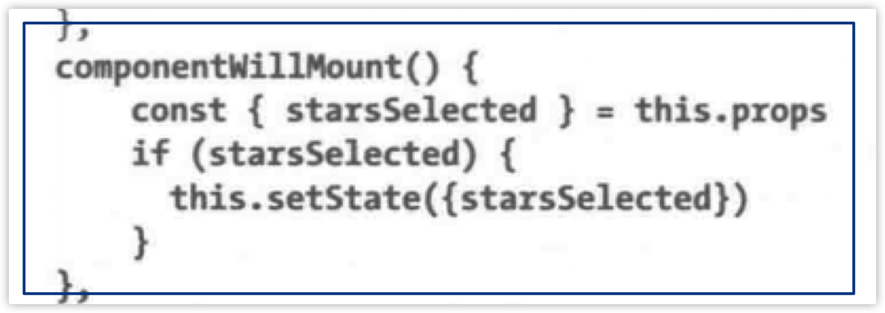

# `JSX`

```jsx
const element = <h1>Hello World</h1>
```

这种语法既不是字符串也不是HTML。

是JSX，是javasrcipt的语法扩展。

```tsx
const name = 'John'
const element = <h1>Hello, World!</h1>;
ReactDOM.render(
  element,
  document.getElementById('root');
);
```

在JSX语法中，可以在任何**大括号**中放置任何有效的JS表达式。

* React用来创建视图
* ReactDOM用来渲染UI

DOM中，将特定元素的子节点清空，然后重新构造它们，比保留这些子元素并尝试高效地更新它们容易。

## `React`元素

浏览器DOM是由DOM元素构成。

React的DOM是由React元素构成。React元素表示应该如何创建浏览器DOM的一组指令。

**使用`React.creatElement()`创建元素**

```tsx
React.creatElement("h1", null, "string");
```

* "h1"：表示希望创建的元素类型
* null：表示元素的特效（比如id，class）
* "string"：表示元素的子元素

那么上述会创建如下的DOM元素：

```html
<h1>string</h1>
```

特别的，在**根元素**处会被特殊标记为`data-reactroot`


`creatElement`实际创建的是：


* type：告知React创建的元素类型（Html or SVG）
* pros：表示构建一个DOM元素所需的数据和子元素
* children：用来将其他元素当作文本显示

## `ReactDOM`

包含在浏览器中渲染React元素必须的工具。

使用`ReactDOM.render()`渲染一个React元素时，还能讲其子节点一同渲染到DOM上。

* 第一个参数是渲染元素
* 第二个参数是目标节点

```tsx
ReactDOM.render(dish, document.getElementById('react-container'))
```

将标题元素渲染到DOM时，将会把h1标签元素添加到id为**`react-container`**的div标签中。

```html
<body>
  <div id="react-contianer">
    <h1>
      Hello, World!
    </h1>
  </div>
</body>
```

每个额外传递给creatElement方法的参数都代表另外一个子元素。


### 使用数据构建元素

数据可以作为参数传递给组件。


当然，在使用for循环来构建子元素的情况下需要为每个组件添加一个key来作为它们的标识。

key主要用来辅助React高效地更新DOM。


### `React.creatClass`

类似于使用ES6创建的class。

也是有Props与State属性。


组件即对象。

### `React.Component`

它是一个抽象类，用户可以通过它来构建React组件。


### 无状态函数式组件

无状态函数式组件是函数而非对象，所以它没有`this`作用域。

无状态函数式组件是有函数组成，它们可以接受熟悉然后返回一个DOM元素。


这个props即是class中那个props（用来接受外部来的参数）。然后返回一个组件（可被渲染成html）。

同时也可以在方法参数处直接将props结构：


const会将函数当做一个常量，同时阻止用户重新定义该变量。

### `DOM`渲染

ReactDOM会比较改变前后的代码or数据，只会更新改变的那部分。


### 工厂类

工厂类实例化对象的细节封装。

有点类似“使用方法的creatElement”。


li可以换成h1或者其他的。

* 第一个参数表示元素属性
* 第二个参数表示子节点

# `React`与`JSX`

JSX与组件一起使用，形成类似html标签似得效果。


将数组传给这个组件时，需要用花括号将它括起来。组件可以接受两种形式：1、字符串；2、JS表达式，其中JS表达式需要使用花括号括起来。

```jsx
<h1>{this.props.title}</h1>
<input type="checkbox" defaultChecked={false}/>
<h1>{this.props.title.toLowerCase().replace}</h1>
<ul>
  {
    this.props.list.map((x, i) => 
                       <li key={i}>{x}</li>)
  }
</ul>
// (x, i)，先元素，后下标。
```


其中使用className来代替class来定义组件的类属性。

```jsx
<h1 className="xx">Hello, World!</h1>
```

## `Babel`

浏览器不能识别JSX语法，需要一个中间者来将JSX翻译成JS，Babel就是其中的一款转译器。

Babel会在客户端浏览器执行执行源代码之前对它们进行转译。


## 	`webpack`

webpack可以实现：

* 代码转译
* 代码压缩
* 特性标记
* 代码拆分
* 热替换

代码不再需要使用\<script\>来导入外部文件，而是使用import语句将它们导入，这样做的目的是方便webpack将它们添加到bundle打包文件中。

webpack.config.js


它描述了webpack将要进行的动作。

* entry：告知webpack客户端实体文件是/src/index.js。

  *它会根据该文件中import语句声明依次自动构建相关依赖项*

* outptut：声明了希望打包的JS文件的目标是./dist/assets/bundle.js

  ​	*这也是webpack存放最终打包JS文件的位置*

* runles：包括了执行特定模块的加载列表。

  *此处指使用了babel*

* test：是一个正则表达式，用于匹配加载器将要访问的每个模块的路径


webpack是静态执行的。通常在应用程序被部署到服务器之前就已经对所有资源进行打包处理了。最终会得倒一个Bundle.js文件。

为了得到Bundle.js中代码与其代表的源文件，webpack存在代码映射的功能。

## `create-react-app`

它使得开发人员不需要手工配置webpack，可以快速的启动React项目。

在生成的项目文件夹中，还会找到一个包含App.js文件的src文件夹。在这里用户可以编辑root组件，以及导入其他组件文件。

```sh
npx create-react-app my-app
```


# 	`Props`、`State`和组件树

**带类型验证的props：**


还加了`isRequired`表示这个属性是必须要传入的。

**默认的props：**


在用户没有提供属性值的情况下返回默认的属性值。

**自定义属性验证：**


类的静态属性允许用户在内部声明中封装propTypes和defaultProps属性。属性构造器也提供了封装功能和更简洁的语法：


## 引用

引用(ref)这个特效允许React组件能够和其子元素交互。

如将表单的数据绑定。


需要使用this关键字将组建的作用域和任何希望访问组件作用域的方法绑定。

*当使用createClass创建组件时，不需要将this作用域和用户的组件方法绑定。React.createClass会自动为用户完成这些工作。*

### 无状态函数式组件中的引用

无状态函数式组件中没有this，所以不能通过this.refs这样的方式使用引用。可以使用引用调用函数，该函数将会输入实例通过参数传递。


## `React`的`State`管理

React的State是一种内置的数据管理机制。他可以修改组件内部的状态，当应用程序状态变化时，UI会被重新渲染来反映这些变化。

但是，无法在一个无状态函数式组件中使用state。

只能用setState来修改state，每次调用setState后，render函数也会被调用，渲染新的UI反映State的变化。

在使用createClass时，基于输入的属性初始化State变量的方式是`componentWillMount()`。当加载组件时，该方法会被调用一次，并且可以在该方法中调用this.setState()。



这个方式是组件生命周期的一部分。

另一个初始化的方法是使用构造方法`constructor(props){}`

## 组件树的内部`State`

将所有State存储在根节点组件是一个好方法。

通过子组件的参数将根组件的State传入，自组件通过根组件传入的回调函数改变State。


State向下传：


回传数据至根组件：


将State限制在根组件是一种推荐的做法。一旦用户的应用程序增长到一定规模，双向数据绑定和显式传递书香将会变得麻烦。

# 组件扩展

## 组件生命周期

两种主要的生命周期：

* 挂载生命周期
* 更新生命周期

### 挂载生命周期

（初始化）

这个生命周期根据组件的创建方式不同，而略有不同：

* `React.createClass`：
  * 首先`getDefaultProps`方法会被触发，首先获得组件属性；
  * 然后`getInitialState`方法将会被触发。
* ES6类
  * 默认的props将会被获取，然后将它作为参数传递给构造函数。*构造函数也是State初始化的地方*。
  * ES6类构造函数和`getInitialState`都拥有访问属性的能


*构造方法并不是一个生命周期的方法。但是，当挂载某个组件时，构造方法永远都是第一个被触发。*

一旦属性被获取并且也初始化了State，`componentWillMount`方法将会被触发。该方法早于DOM渲染。

`componentWillMount`方法中调用setState，那么它将会在组件被渲染完毕后被触发，并且会启动更新生命周期。

* `component`**`DidMount`**：只会在组件渲染完毕之后触发。
  * 该方法中任意setState调用都将启动更新生命周期，并且重新渲染组件。
  * 也是一个初始化任何需要用到DOM的第三方的好地方。
* `component`**`WillUnmount`**：只会在组件被卸载之前触发。

### 更新生命周期

当State变化时，重新渲染组件将会触发新的周期，那这个周期就叫做**更新生命周期**。

更新生命周期将会在每次调用setState方法后启动。（所以在挂载生命周期里面调用setState不会触发递归更新）。除了在`componentWillReceivrProps()`中调用setState。

在组件更新时，若不想更新可使用`shouldComponentUpdate(arg)`组织这次更新。


### `React.Children`

提供了一种可以访问特点组件的子元素的方法。

* 允许用户统计、映射、循环或者将props.children转换成一个数组
* 允许用户使用`React.Children.only`对正在显示的单个子节点进行验证。*P162*

### 集成JS库

使用fetch发送请求

**umi-request**

### 高阶组件

高阶组件（HOC）是一个简单函数，**它会接受一个React组件作为参数然后返回另外一个React。**

Example:


首先得到一个HOC，(component, url) => component。由一个组件得导另一个组件。（类似装饰器模式？）

使用HOC:


RandomMeUsers就是加强版的Component，count也是传入了其中，只是未被使用。

### 在`React`之外管理`State`

在React外部管理State的优点之一就是它将减少大量累组件的使用。*如果没有使用state，那么就很容易可以确保用户大部分组件将是无状态的。*

当需要使用生命周期函数时，用户只需要创建一个类即可，甚至可以将类的功能和HOC隔离（？）。

**简单理解就是不在应用程序中使用React的State或者setState()**


输入一个组件，返回一个组件（这个组件需要一个参数）。


### `Flux`

一种管理State的设计模式。

有4种组件：

* View：一个React无状态组件。（展示效果，其中的交互动作会产生Action）
* Action：一组动作，每一个Action相当于一个指令（由view产生，比如点击购物，那么就会产生一条购物的指令用于扣款）。
* Store：存储了数据（即State），是渲染view的依据，Store一旦改变就会重新渲染View，Store受到Action的影响。
* Dispatch：负责分发Action到其生效的Store上。


其中Action与Store都是不可变数据，Action不可变很好理解，Action就相当于一条指令，一旦发出就不会改变，不同动作对应不同的指令。而Store的话，是经常需要更新的，那么不可变的话怎么更新？----**直接使用更新后的对象直接覆盖。**

example：

* View：

  

* Action和Action生成器

  * Action生成器就是函数，主要用来封装某个Action的具体细节。
  * 向Dispatch注册了两个动作“tick” “reset”

  

* Dispatch

  * 由库封装好

  

* Store:

  * 根据收到的不同的Action产生相应的操作
  * Store会向所有订阅了该Store的View发送通知，只要View收到通知之后进行渲染即可

  

* 综上：

  


# `Redux`

Redux类似于Flux，但是去处了Dispatch，并使用单个不可变对象表示整个应用程序的State。Redux还引入了Reducer，是一个纯函数，作用是：`(stateA, Action) => stateB`。*就是表示当前状态下，施加不同的动作会变成不同的状态；状态在动作下改变。*

## `State`

在纯React或者Flux应用中，比较推荐的是将State尽量放在少数几个对象中。


每个Message包含自己的State，显然不符合上述规则。

可以通过Redux将所有State数据移动到单个位置来构造应用程序。


通过Redux将State管理和React完全剥离，Redux将会管理这些State。

可以变成一颗State树（父组件将State传给子组件，形成树状结构）：


## `Action`有效载荷

除了表示不同的Action的数据外，Action内用于实际改变State的部分叫做有效负荷。


告诉state需要更新的地方。

## `Reducer`

State每个部分都是能被更新的，用来更新的函数就被称为Reducer。

可以为State树中某个特定目标的椰子节点和分支节点创建若干Reducer。


各个

介电质
