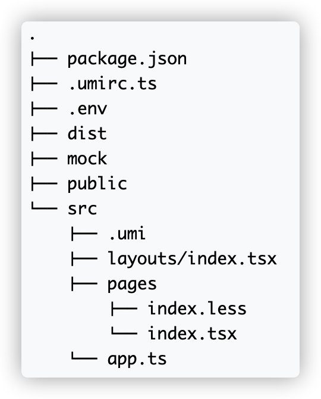

# 目录结构

* 根目录：`pakage.json`：包含插件。
* .umirc.ts：配置文件，包含umi内置功能和插件的配置。
* .env：环境变量。
* dist目录：build的默认产物。
* public：
* src：
  * .umi：临时文件目录，比如入口文件、路由等，都会被临时生成到这里
  * layouts/index.tsx：约定式路由时的全局布局文件。
  * pages：路由组件存放处
  * app.ts 运行时配置文件，可以扩展运行时能力。

 如果项目的配置比较复杂，可以将配置写在 `config/config.ts` 中，并把配置的一部分拆分出去，比如路由配置可以拆分成单独的 `routes.ts`。

***

`src/app.tsx`为运行时配置。

运行时配置和配置的区别是他跑在浏览器端，基于此，我们可以在这里写函数、jsx、import 浏览器端依赖等等，注意不要引入 node 依赖。

***

新建 `src/pages/document.ejs`，umi 约定如果这个文件存在，会作为默认模板。

***

Umi 约定 `/mock` 文件夹下所有文件为 mock 文件。

[Mock.js](http://mockjs.com/) 是常用的辅助生成模拟数据的三方库，借助他可以提升我们的 mock 数据能力。

***

Umi 中约定 `src/global.css` 为全局样式，如果存在此文件，会被自动引入到入口文件最前面。

Umi 内置支持 less，不支持 sass 和 stylus，但如果有需求，可以通过 chainWebpack 配置或者 umi 插件的形式支持。

***

