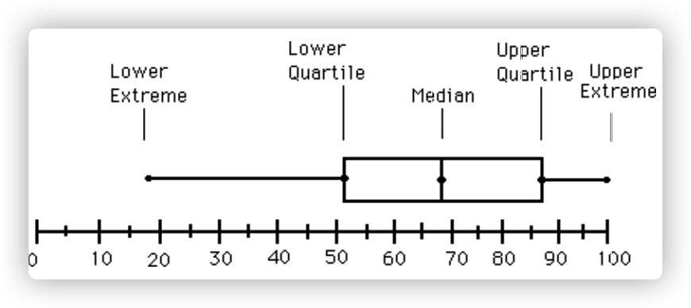

#### 盒图



* $LowerExtream$：最小值
* $LowerQuartile$：第一个四分位数（第$1\over4$个数）
* $Median$：中位数（第二个四分位数）
* $UpperQuartile$：第三个四分位数（第$3\over4$个数）
* $UpperExtrme$：最大值

> 求四分位数：
>
> $Method1$：$A[\frac{(n+1)}{4}]$、$A[\frac{(n+1)\cdot 3}{4}]$
>
> $Method2$：先求中位数，然后在中位数之前/后的数中求中位数

***

#### 规范化

* 零-均值规范化（z-score标准化）
  $$
  x^*=\frac{x-\overline x}{\sigma}
  $$
  
* 最小-最大规范化

  * 映射到$[0,1]$

  $$
  x^*=\frac{x-min}{max-min}
  $$

  

  * 映射到$[-1,1]$

  $$
  x^*=2\frac{x-min}{max-min}-1
  $$

  

***

#### 线性回归-最小二乘法

[$Source$](https://zhuanlan.zhihu.com/p/22474562)
$$
\theta=(X^TX)^{-1}X^TY
$$

```
我，喜欢你，喜欢了挺长时间了。
我告诉你这些，并不是因为我想怎么样，或者让你怎么样，我就是告诉你了，我觉得该告诉你，让你知道有这么一个人真心真意的喜欢你，在懵懵懂懂的时期，不明不白的就喜欢上了，就喜欢了这么久，久到成了习惯，改都要费点时间。
你是非常可爱的人，真应该遇到最好的人，我也真希望我就是。
不管我本人多么平庸，我总觉得对你的爱很美。
如果你愿意，我就永远爱你，如果你不愿意，我就永远相思。
```

