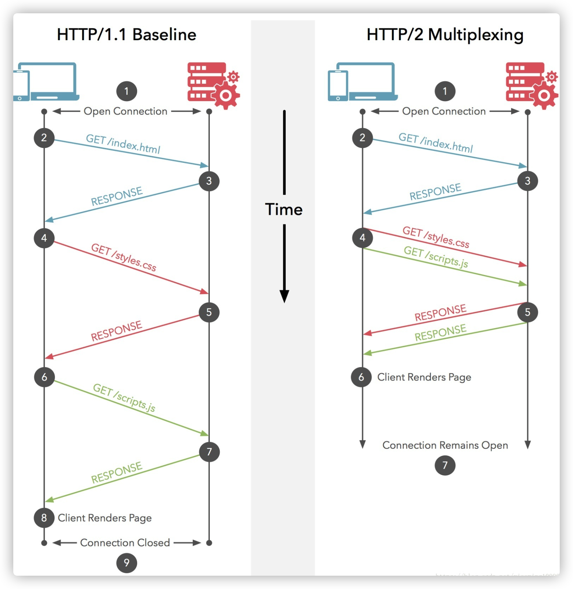
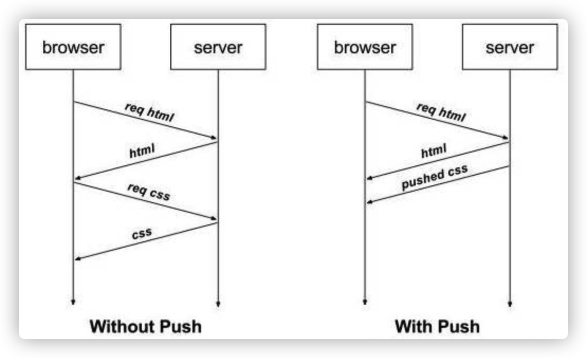

# `Redis`

## 缓存类型

### 本地缓存

**本地缓存**就是在进程的内存中进行缓存，比如我们的 **`JVM`** 堆中，可以用 **`LRUMap`** 来实现，也可以使用 **`Ehcache`** 这样的工具来实现。

本地缓存是内存访问，没有远程交互开销，性能最好，但是受限于单机容量，一般缓存较小且无法扩展。


### 分布式缓存

分布式缓存一般都具有良好的水平扩展能力，对较大数据量的场景也能应付自如。缺点就是需要进行远程请求，性能不如本地缓存。

### 多级缓存

为了平衡这种情况，实际业务中一般采用**多级缓存**，本地缓存只保存访问频率最高的部分热点数据，其他的热点数据放在分布式缓存中。


## 基础数据类型

### `String`

内部的实现是通过 **`SDS`**（`Simple Dynamic String` ）来存储的。`SDS` 类似于 **Java** 中的 **`ArrayList`**，可以通过预分配冗余空间的方式来减少内存的频繁分配。

`String`类型的`Key`，与`String` 类型的`Value`。

- **缓存功能**
- **计数器：**许多系统都会使用**Redis**作为系统的实时计数器，可以快速实现计数和查询的功能。
- **共享用户Session**

```shell
SET "key1" "value1"
GET "key1"
"value1"
```

### `Hash`

类似 **Map** 的一种结构，这个一般就是可以将结构化的数据，比如一个对象（前提是**这个对象没嵌套其他的对象**）给缓存在 **Redis** 里，然后每次读写缓存的时候，可以就操作 **Hash** 里的**某个字段**。

```shell
HMSET "map" "k1" "Hello" "k2" "World"
HGET "map" "k2"
"World"
```

### `List`

简单的字符串列表，按照插入顺序排序。类似一个队列。

* **消息队列：Redis**的链表结构，可以轻松实现阻塞队列，可以使用左进右出的命令组成来完成队列的设计。比如：数据的生产者可以通过**Lpush**命令从左边插入数据，**多个数据消费者，可以使用BRpop命令阻塞的“抢”列表尾部的数据。**
* 文章列表或者数据分页展示的应用。

```shell
lpush "list1" "v1"
lpush "list1" "v2"
lpush "list1" "v3"
lpush "list1" "v4"
lrange "list1" 0 10
"v4"
"v3"
"v2"
"v1"
rpush "list1" "v5"
lrange "list1" 0 10
"v4"
"v3"
"v2"
"v1"
"v5"
```

### `Set`

无序集合，自动去重。

```shell
sadd "set" "v1"
sadd "set" "v2"
sadd "set" "v1"
sadd "set" "v3"
smembers "set"
"v1"
"v2"
"v3"
```

### `ZSet`

**`ZSet`** 是排序的 **`Set`**，去重但可以排序，写进去的时候给一个分数，自动根据分数排序。

```shell
zadd key score member 
zadd "s1" 0 "v1"
zadd "s1" 3 "v2"
zadd "s1" 1 "v3"
zadd "s1" 5 "v4"
ZRANGEBYSCORE "s1" 0 10
"v1"
"v3"
"v2"
"v4"
```


### `BitMap`

位图是支持按 bit 位来存储信息，可以用来实现 **布隆过滤器（BloomFilter）**。


## 持久化

持久化是有两种方式的：

- RDB：**RDB** 持久化机制，是对 **Redis** 中的数据执行**周期性**的持久化。
- AOF：**AOF** 机制对每条写入命令作为日志，以 **append-only** 的模式写入一个日志文件中，因为这个模式是只追加的方式，所以没有任何磁盘寻址的开销，所以很快。

**RDB**更适合做**冷备**，**AOF**更适合做**热备**

> **两种机制全部开启的时候，Redis在重启的时候会默认使用AOF去重新构建数据，因为AOF的数据是比RDB更完整的。**

### `RDB Redis DataBase`

#### 优点

他会生成多个数据文件，每个数据文件分别都代表了某一时刻**Redis**里面的数据，这种方式，有没有觉得很适合做**冷备**，完整的数据运维设置定时任务，定时同步到远端的服务器，比如阿里的云服务，这样一旦线上挂了，你想恢复多少分钟之前的数据，就去远端拷贝一份之前的数据就好了。

**RDB**对**Redis**的性能影响非常小，是因为在同步数据的时候他只是**fork**了一个子进程去做持久化的，而且他在数据恢复的时候速度比**AOF**来的快。

#### 缺点

**RDB**都是快照文件，都是默认五分钟甚至更久的时间才会生成一次，这意味着你这次同步到下次同步这中间五分钟的数据都很可能全部丢失掉。**AOF**则最多丢一秒的数据，**数据完整性**上高下立判。

还有就是**RDB**在生成数据快照的时候，如果文件很大，客户端可能会暂停几毫秒甚至几秒。


### `AOF Append Only File`

#### 优点

**RDB**五分钟一次生成快照，但是**AOF**是一秒一次去通过一个后台的线程`fsync`操作，那最多丢这一秒的数据。

**AOF**在对日志文件进行操作的时候是以`append-only`的方式去写的，他只是追加的方式写数据，自然就少了很多磁盘寻址的开销了，写入性能惊人，文件也不容易破损。

> **AOF**的日志是通过一个叫**非常可读**的方式记录的，这样的特性就适合做**灾难性数据误删除**的紧急恢复了，比如公司的实习生通过**flushall**清空了所有的数据，只要这个时候后台重写还没发生，你马上拷贝一份**AOF**日志文件，把最后一条**flushall**命令删了就完事了。

#### 缺点：

一样的数据，**AOF**文件比**RDB**还要大。

**AOF**开启后，**Redis**支持写的**QPS**会比**RDB**支持写的要低，他不是每秒都要去异步刷新一次日志嘛**fsync**，当然即使这样性能还是很高。


### 总结

将两者结合，单独用**RDB**你会丢失很多数据；单独用**AOF**，数据恢复没**RDB**来的快；所以，出问题的时候第一时间用**RDB**恢复，然后**AOF**做数据补全，冷备热备一起上。


## 常见问题

### 缓存雪崩

当有大量请求时，如此时缓存失效或者没有这些请求的缓存，这时所有的请求都会穿透到 DB。

**解决方案：**

1. 使用快速失败的熔断策略，减少` DB `瞬间压力；
2. 使用主从模式和集群模式来尽量保证缓存服务的高可用。
3. 每个`Key`的失效时间都加个随机值就好了，这样可以保证数据不会在同一时间大面积失效。

### 缓存穿透

产生这个问题的原因可能是**外部的恶意攻击**，例如，对用户信息进行了缓存，但恶意攻击者**使用不存在的用户id频繁请求接口，导致查询缓存不命中，然后穿透 DB 查询依然不命中**。这时会有大量请求穿透缓存访问到 DB。

**解决方案：**

1. 对不存在的用户，在缓存中保存一个空对象进行标记，防止相同 ID 再次访问 DB。不过有时这个方法并不能很好解决问题，可能导致缓存中存储大量无用数据。对ID进行校验。
2. 使用 **`BloomFilter`** 过滤器，`BloomFilter` 的特点是存在性检测，如果 `BloomFilter` 中不存在，那么数据一定不存在；如果 `BloomFilter `中存在，实际数据也有可能会不存在。非常适合解决这类的问题。

### 缓存击穿

缓存雪崩是因为大面积的缓存失效，打崩了`DB`，而缓存击穿不同的是**缓存击穿**是指一个`Key`非常热点，在不停的扛着大并发，大并发集中对这一个点进行访问，当这个Key在失效的瞬间，持续的大并发就穿破缓存，直接请求数据库，就像在一个完好无损的桶上凿开了一个洞。

某个热点数据失效时，大量针对这个数据的请求会穿透到数据源。

**解决方案：**

1. 可以使用互斥锁更新，保证同一个进程中针对同一个数据不会并发请求到 DB，减小 DB 压力。
2. 使用随机退避方式，失效时随机 sleep 一个很短的时间，再次查询，如果失败再执行更新。
3. 针对多个热点 key 同时失效的问题，可以在缓存时使用固定时间加上一个小的随机数，避免大量热点 key 同一时刻失效。

### 异步缓存更新

异步更新，就是当失效时先不清除数据，继续使用旧的数据，然后由异步线程去执行更新任务。这样就避免了失效瞬间的空窗期。另外还有一种纯异步更新方式，定时对数据进行分批更新。实际使用时可以根据业务场景选择更新方式。

### 数据不一致

可以说只要使用缓存，就要考虑如何面对这个问题。缓存不一致产生的原因一般是主动更新失败，例如更新 DB 后，更新 **Redis** 因为网络原因请求超时；或者是异步更新失败导致。

解决的办法是，**如果服务对耗时不是特别敏感可以增加重试**；**如果服务对耗时敏感可以通过异步补偿任务来处理失败的更新**，或者**短期的数据不一致不会影响业务，那么只要下次更新时可以成功，能保证最终一致性就可以**。

# `Http`协议

## `Http`状态码

| 1**  | 信息，服务器收到请求，需要请求者继续执行操作   |
| ---- | :--------------------------------------------- |
| 2**  | 成功，操作被成功接收并处理                     |
| 3**  | 重定向，需要进一步的操作以完成请求             |
| 4**  | 客户端错误，请求包含语法错误或无法完成请求     |
| 5**  | 服务器错误，服务器在处理请求的过程中发生了错误 |

### 常见状态码

### 	`1**`

* `100` `Continue`：继续。客户端应当继续其情求。

* `101` `Switching Protocols`：切换协议。服务器根据客户端的请求切换协议。智能切换到更高级的协议。

  > 如：切换到`Http`的新版本协议。

### `2**`

* `200` `OK`：请求成功。*一般用于`Get` `Post`请求。*
* `202 `  `Accepted`：已接受。*已接受请求，但未处理。*
* `203` `Non-Authoritative Information`：非授权信息。
* `204` `No Content`：无内容。*服务器处理成功，但未返回内容。*

### `3**`

* `300` `Multiple Choices`：多种选择。*请求的资源可包括多个位置。*
* `301` `Moved`：永久移动。*请求的资源已经被永久移动，会返回新的`URI`，浏览器会自动定向到新的`URI`，今后任何新的请求都应使用新的`URI`代替*。
* `302` `Found`：临时移动。*与`301`勒烯，但资源只是临时被移动。*

### `4**`

* `400` `Bad Request`：客户端请求的语法错误，服务端无法理解。
* `401` `Unauthorized`：请求要求用户的身份认证。
* `402` `Payment Required`：用于移动支付。现在还没用上，保留。
* `403` `Forbidden`：服务器理解客户端的请求，但是拒绝执行此请求。
* `404` `Not Found`：服务器无法根据客户端的请求找到资源。
* `405`  `Method Not Allowed`：客户端请求中的方法被禁止。

### `5**`

* `500` `Internal Server Error`：服务器内部错误，无法完成请求。
* `501` `Not Implement`：服务器不支持请求的功能，无法完成请求。
* `502` `Bad GateWay`：作为网关或者代理工作的服务器尝试执行请求是，从远程服务器接收到了一个无效的响应。
* `505` `Http Version not suuport`：服务器不支持请求的`Http`协议，无法处理。

## `Http1.0`和`Http1.1`和`Http2.0`

### `Http1.0和Http1.1`区别

* 长连接。

  > ​	`HTTP1.1`支持长连接和请求的流水线处理，在一个`TCP`连接上可以传送多个`HTTP`请求和响应，减少了建立和关闭连接的消耗和延迟，在`HTTP1.1`中默认开启长连接`keep-alive`，一定程度上弥补了`HTTP1.0`每次请求都要创建连接的缺点。`HTTP1.0`需要使用`keep-alive`参数来告知服务器端要建立一个长连接。

* 节约带宽。

  > ​	`HTTP1.0`中存在一些浪费带宽的现象，例如客户端只是需要某个对象的一部分，而服务器却将整个对象送过来了，并且不支持断点续传功能。`HTTP1.1`支持只发送`header`信息（不带任何`body`信息），如果服务器认为客户端有权限请求服务器，则返回`100`，客户端接收到`100`才开始把请求body发送到服务器；如果返回`401`，客户端就可以不用发送请求`body`了节约了带宽。

* `Host`域

  > ​	在`HTTP1.0`中认为每台服务器都绑定一个唯一的IP地址，因此，请求消息中的`URL`并没有传递主机名（hostname），`HTTP1.0`没有host域。随着虚拟主机技术的发展，在一台物理服务器上可以存在多个虚拟主机（Multi-homed Web Servers），并且它们共享一个IP地址。`HTTP1.1`的请求消息和响应消息都支持host域，且请求消息中如果没有host域会报告一个错误（`400` Bad Request）。

* 缓存处理。

  > ​	在`HTTP1.0`中主要使用header里的If-Modified-Since,Expires来做为缓存判断的标准，HTTP1.1则引入了更多的缓存控制策略。

* 错误通知。

  > ​	在`HTTP1.1`中新增了24个错误状态响应码。

### `Http1.1`和`Http2.0`区别

* 多路复用。

  多路复用与长连接的区别：

  

  * `HTTP/1.*` 一次请求-响应，建立一个连接，用完关闭；每一个请求都要建立一个连接；
  * `HTTP/1.1` 解决方式为，**若干个请求排队串行化单线程处理，后面的请求等待前面请求的返回才能获得执行机会，一旦有某请求超时等，后续请求只能被阻塞**，毫无办法，也就是人们常说的线头阻塞；
  * `HTTP/2`**多个请求可同时在一个连接上并行执行**。某个请求任务耗时严重，不会影响到其它连接的正常执行。

* 头部数据压缩。

  ​	`HTTP1.1`不支持header数据的压缩，`HTTP2.0`使用`HPACK`算法对`header`的数据进行压缩，这样数据体积小了，在网络上传输就会更快。

  > ​	随着`Web`功能越来越复杂，每个页面产生的请求数也越来越多，导致消耗在头部的流量越来越多，尤其是每次都要传输`UserAgent`、`Cookie`这类不会频繁变动的内容，完全是一种浪费。

* 服务器推送。

  ​	为了改善延迟，`HTTP2.0`引入了`server push`，它允许服务端推送资源给浏览器，在浏览器明确地请求之前，免得客户端再次创建连接发送请求到服务器端获取。这样客户端可以直接从本地加载这些资源，不用再通过网络。

  

  数据的爬取，预处理，存储，以及缓存，文件的上传下载，结果文件的获取，数据处理的jar，定时任务，与模型的整合，前端展示数据的返回。1、Eureka实现服务治理；2、Ribbon主要提供客户侧的软件负载均衡算法；3、Hystrix断路器，保护系统，控制故障范围；4、Zuul，api网关，路由，负载均衡等多种作用；

  