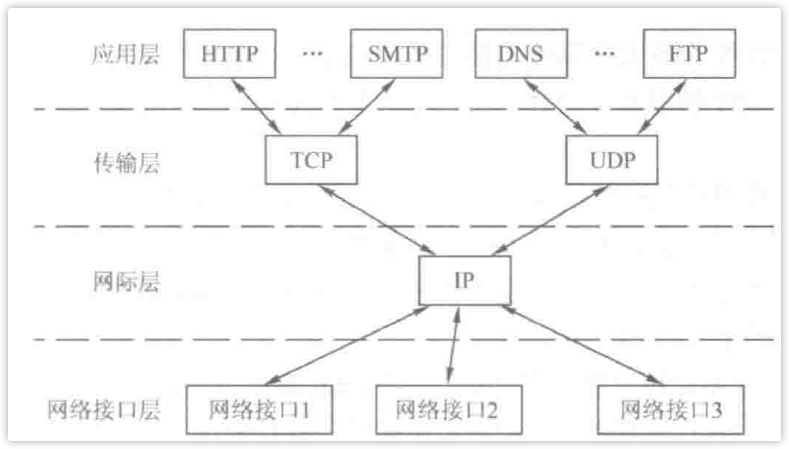

# `OSI`参考模型

| OSI七层模型 | 功能                                                         | 对应的网络协议                     | TCP/IP四层概念模型 | 设备 |
| ----------- | ------------------------------------------------------------ | ---------------------------------- | ------------------ | ---- |
| 应用层      | 文件传输，文件管理，电子邮件的信息处理——apdu                 | HTTP、 SMTP、DNS、                 | 应用层             |      |
| 表示层      | 确保一个系统的应用层发送的消息可以被另一个系统的应用层读取，编码转换，数据解析，管理数据的解密和加密，最小单位——ppdu | Telnet, Rlogin, SNMP, Gopher       |                    |      |
| 会话层      | 负责在网络中的两节点建立，维持和终止通信，在一层协议中，可以解决节点连接的协调和管理问题。包括通信连接的建立，保持会话过程通信连接的畅通，两节点之间的对话，决定通信是否被终端一斤通信终端是决定从何处重新发送，最小单位——spdu | SMTP, DNS                          |                    |      |
| 传输层      | 负责端到端的通信。（TCP报文段、UDP数据报）                   | TCP, UDP                           | 传输层             |      |
| 网络层      | 1.流量控制。2.拥塞控制。3.差错控制。4.网际互联，对分组进行路由选择，提供一个ip到另一个ip的通信。（ip数据报） | IP, ICMP, ARP, RARP                | 网络层             |      |
| 数据链路层  | 1.成帧。2.差错控制。3.流量控制。4.传输管理。（帧）点到点的通信。 | PPP、HDLC                          | 数据链路层         |      |
| 物理层      | 1.规定传输信号的意义和电气特征。2.电气特性、机械特性、功能特性（比特流） | IEEE 802.1A, IEEE 802.2到IEEE 802. | 物理层             |      |

***

# 物理层

* 传输介质：双绞线、同轴电缆、光纤
* 物理接口特性：
  * 机械特性：定义物理连接的边界点。引线的数目、引脚的数量。
  * 电气特性：电压高低。
  * 功能特性：某一电平的电压表示的意义。
  * 规程特性：物理线路的时序关系。
* 设备：
  * 中继器：将信号整形并放大再转发出去，不能隔离冲突域。5-4-3原则（中继器串联数量不能超过4个，用4个中继器串联5段介质中只有3段可以挂计算机）
  * 集线器（多端口的中继器）。
* 定理：
  * 奈氏准则：不考虑噪音的情况下信道的极限传播速率。
  * 香农定理：考虑噪音情况下的极限传播速率。
* 传输方式：
  * 电路交换：两节点之间建立一条专门的物理通信路径，传输期间独占。
  * 报文交换：无需建立专门连接，报文携带有目的地址，存储转发。
  * 分组交换：把报文分割成小的数据块，再加上必要的控制信息进行传输。
    * 数据报：分组存在不同路径，各个分组分别转发。
    * 虚电路：发送方、接收方之间建立一条逻辑上相连的虚电路，分组沿着虚电路进行传输。

***

# 数据链路层

## 为网络层提供服务

* 无确认的无连接服务
* 有确认的无连接服务
* 有确认的有连接服务

*有连接就一定有确认，不存在无确认的面向连接的服务。*

## 流量控制

限制发送方的数据流量，使其发送速率不超过接收方的接受能力。

* 停等协议：发1收1，发送发未收到接收方的确认便会等待。
* GBN（后退N帧协议）：发N收1，接收方未接到需要的那帧便会将其他帧丢弃（此帧之后的帧）
* SR（选择重传协议）：发N收N，比起GBN，不会丢弃帧，而是将之放入正确的位置，一旦接收方前M帧收到了，便会向前滑动M帧。

## 差错控制

* 检错编码：CRC、奇偶校验码
* 纠错编码：海明码

