# 基本原则

## 单一职责原则`Single Responsibility`

一个类只负责一项职责。有且仅有一个原因引起类的变更。

## 开放-关闭原则`Open-Closed`

软件实体（类、模块、函数e.g）**应该是可以被扩展，但是不可以被修改（`Open for extension,  close for modification`）**。

对扩展开放，对修改关闭。

## 依赖倒置原则`Dependence Inversion`

高层模块不应该依赖低层模块，应该依赖于抽象，二者都应该抽象。进一步说，抽象不应该依赖于细节，细节应该依赖于抽象。

细节应该尽量往抽象上靠。

`DI`的核心就是：**我们要面向接口编程**，理解了面向接口编程，也就理解了依赖倒置。

Example:

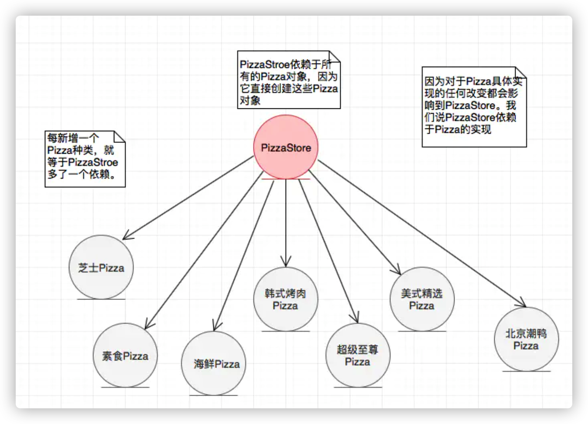

一个`PizzaStore`里面有许多“具体的”`Pizza`，由类图可知，上层(`PizzaStore`)依赖于下层(“具体的”`Pizza`)，依赖于具体。

那么，`PizzaStore`就得针对每一个具体的`Pizza`单独处理，每次具体的`Pizza`改变都会要修改`PizzaStore`。

此时，从细节中（具体）抽象出它们的通性，可以得到抽象的`Pizza`，因为它们都是`某某Pizza`，归根结底都是`Pizza`。

那么：

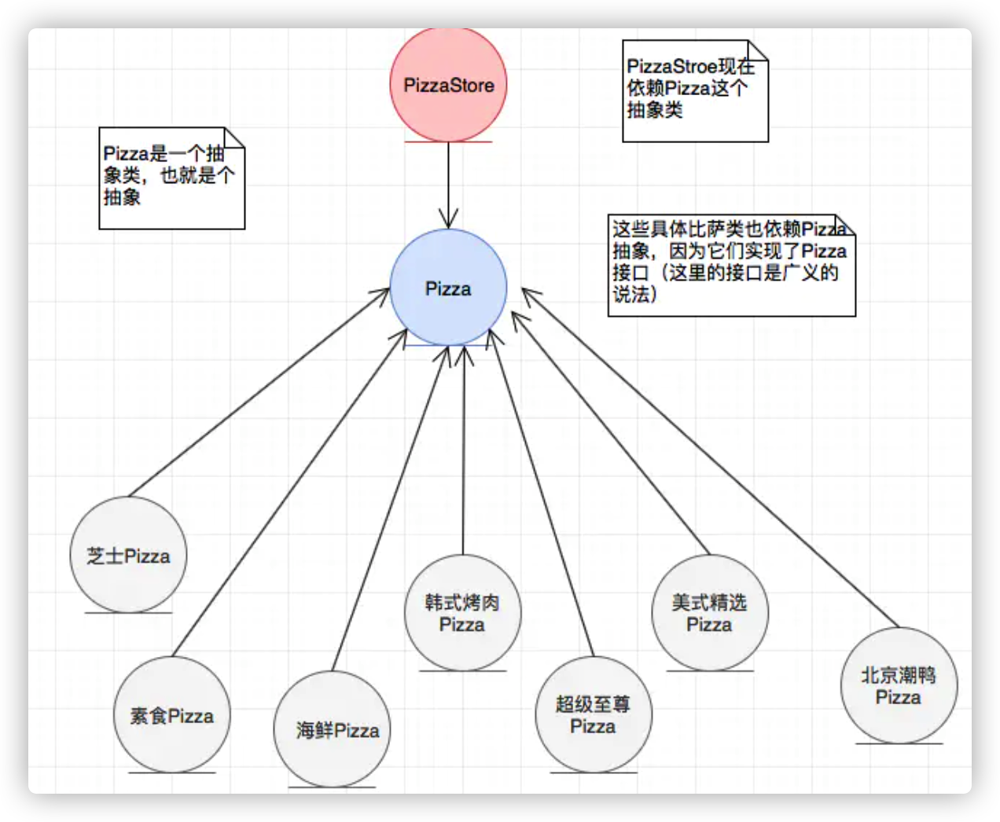

现在，**上层依赖于抽象，细节也依赖于抽象**，箭头也是从图1的自顶向下，变为了自底向上（倒置）。那么无论`某某Pizza`怎么变化，只要它属于`Pizza`通性的那一部分不变，那么`PizzaStore`就不需要变化，大大的提高了其扩展性。

[link](https://www.jianshu.com/p/c3ce6762257c)

## 里氏替换原则`Liskov Substitution(LSP)`

子类可以扩展父类的功能，但不能改变父类原有的功能。

即子类能够使用的地方，换上父类后也可以使用。


## 接口隔离原则`Interface Segregation`

- 客户端不应该依赖它不需要的接口
- 类间的依赖关系应该建立在最小的接口上

建立单一接口，不要建立庞大臃肿的接口，尽量细化接口，接口中的方法尽量少。也就是说，**要为各个类建立专用的接口，而不要试图去建立一个很庞大的接口供所有依赖它的类去调用**。 在程序设计中，**依赖几个专用的接口要比依赖一个综合的接口更灵活。**接口是设计时对外部设定的“契约”，通过分散定义多个接口，可以预防外来变更的扩散，提高系统的灵活性和可维护性。

如：

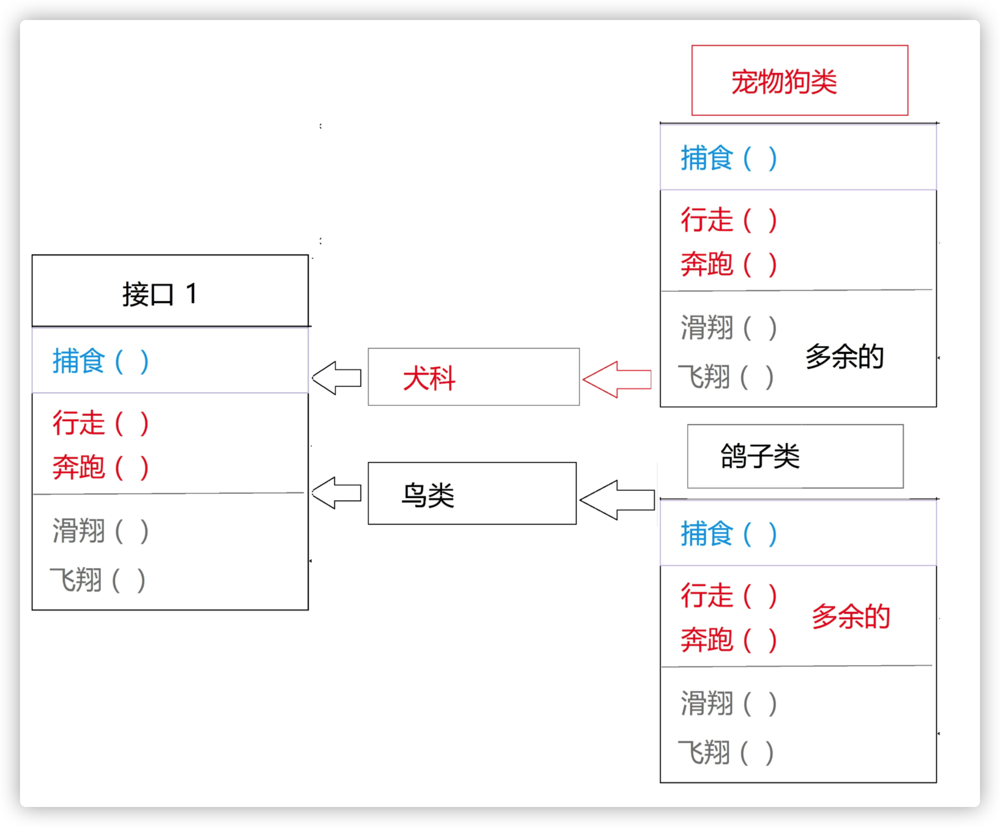

接口1过于臃肿，**只要接口中出现的方法，不管对依赖于它们的类有没有用处，实现类中都必须去实现这些方法**，这显然是不好的设计。

如果将这个设计修改为符合接口隔离原则，就必须对接口1进拆分。

所以将原有的接口I拆分为三个接口，拆分后的设计如下所示：

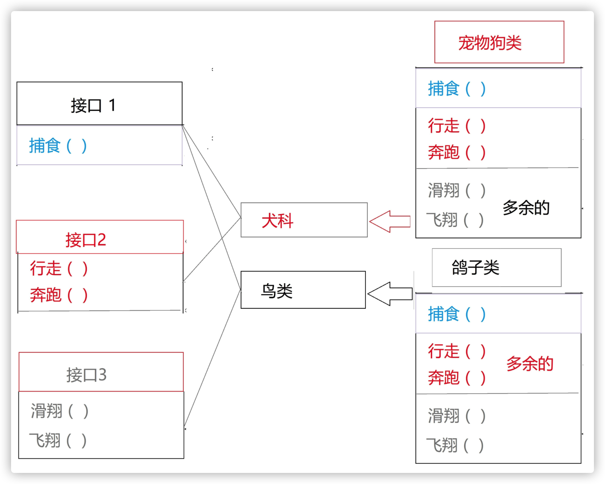

与`单一职责原则`区别：

接口隔离原则与单一职责的审视角度是不相同的。

单一职责要求的是类和接口职责单一，注重的是职责，这是业务逻辑上的划分。

接口隔离原则要求接口的方法尽量少，这些方法关联性要强，不能只是一个方法的集合体。

> 例如一个接口的职责可能包含10个方法，这10个方法都放在一个接口中，并且提供给多个模块访问，各个模块按照规定的权限来访问，在系统外通过文档约束“不使用的方法不要访问”，按照单一职责原则是允许的，按照接口隔离原则是不允许的，因为它要求“尽量使用多个专门的接口”。专门的接口就是指提供给每个模块的都应该是单一接口，而不是建立一个庞大的臃肿的接口，容纳所有的客户端访问。


## 迪米特法则`Law Of Demeter`

类与类之间的关系越密切，耦合度越大，当一个类发生改变时，对另一个类的影响也越大。所以，一个对象应该对其他对象保持最少的了解，尽量降低类与类之间的耦合。

**迪米特法则的定义**是：只与你的直接朋友交谈，不跟“陌生人”说话（`Talk only to your immediate friends and not to strangers`）。其含义是：**如果两个软件实体无须直接通信，那么就不应当发生直接的相互调用，可以通过第三方转发该调用。**其目的是降低类之间的耦合度，提高模块的相对独立性。

> 就是一个类对自己依赖的类知道的越少越好。也就是说，对于被依赖的类来说，无论逻辑多么复杂，都尽量地的将逻辑封装在类的内部，对外除了提供的`public`方法，不对外泄漏任何信息。迪米特法则还有一个更简单的定义：只与直接的朋友通信。首先来解释一下什么是直接的朋友：迪米特法则中的“朋友”是指：当前对象本身、当前对象的成员对象、当前对象所创建的对象、当前对象的方法参数等，这些对象同当前对象存在关联、聚合或组合关系，可以直接访问这些对象的方法。只要两个对象之间有耦合关系，我们就说这两个对象之间是朋友关系。耦合的方式很多，依赖、关联、组合、聚合等。其中，我们称出现成员变量、方法参数、方法返回值中的类为直接的朋友，而出现在局部变量中的类则不是直接的朋友。也就是说，**陌生的类最好不要作为局部变量的形式出现在类的内部。**

就是增加一层中间层，*计算机世界里，没有什么是增加中间层解决不了的方法。*

example：

窗口类设计中，某些界面控件之间存在复杂的交互关系，一个控件事件的触发将导致多个其他界面控件产生响应，例如，当一个按钮(`Button`)被单击时，对应的列表框(`List`)、组合框(`ComboBox`)、文本框(`TextBox`)、文本标签(`Label)`等都将发生改变。

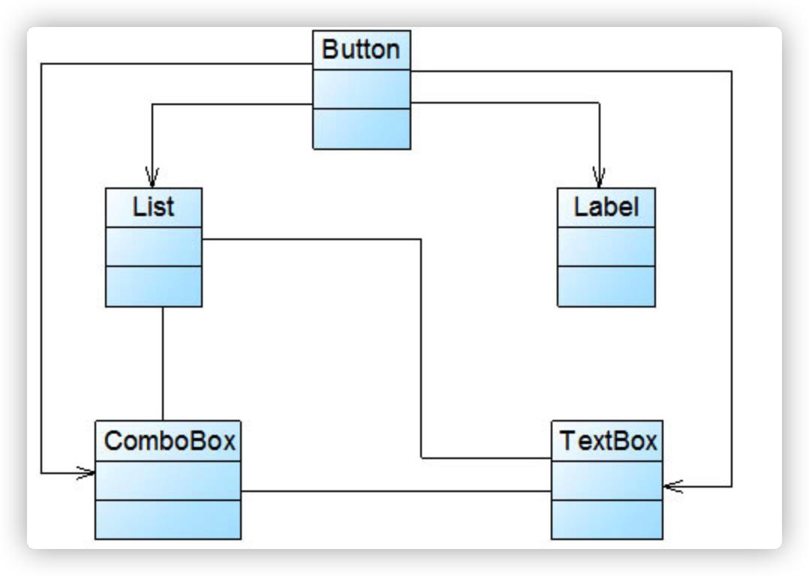

由于界面控件之间的交互关系复杂，导致在该窗口中增加新的界面控件时需要修改与之交互的其他控件的源代码，系统扩展性较差，也不便于增加和删除新控件。

使用迪米特对其进行重构。

引入一个专门用于控制界面控件交互的中间类(`Mediator`)来降低界面控件之间的耦合度。**引入中间类之后，界面控件之间不再发生直接引用，而是将请求先转发给中间类，再由中间类来完成对其他控件的调用。当需要增加或删除新的控件时，只需修改中间类即可，无须修改新增控件或已有控件的源代码。**

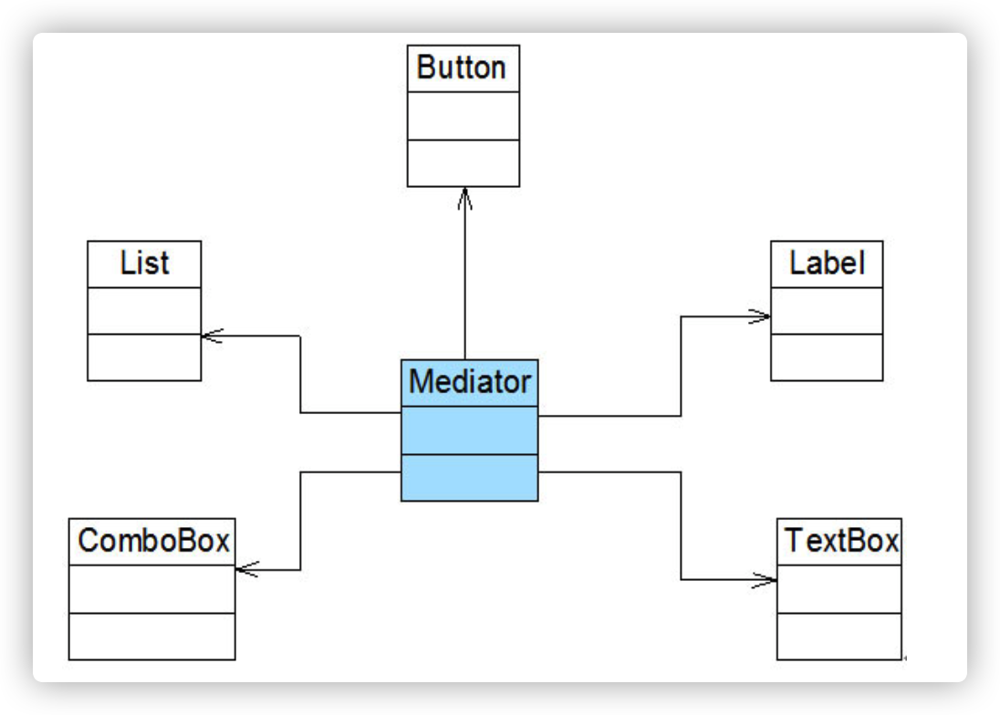

## 组合/聚合复用原则 `Composite/Aggregate Reuse`

**复用时要尽量使用组合/聚合关系（关联关系），少用继承**。

在面向对象设计中，可以通过两种方法在不同的环境中复用已有的设计和实现，即通过**组合/聚合关系**或通过**继承**，但**首先应该考虑使用组合/聚合，组合/聚合可以使系统更加灵活，降低类与类之间的耦合度**，一个类的变化对其他类造成的影响相对较少；其次才考虑继承，**在使用继承时，需要严格遵循里氏代换原则，有效使用继承会有助于对问题的理解，降低复杂度**，而滥用继承反而会增加系统构建和维护的难度以及系统的复杂度，因此需要慎重使用继承复用。

通过**继承来进行复用的主要问题在于继承复用会破坏系统的封装性**，因为**继承会将基类的实现细节暴露给子类，由于基类的内部细节通常对子类来说是可见的**，所以这种复用又称“白箱”复用，**如果基类发生改变，那么子类的实现也不得不发生改变**；**从基类继承而来的实现是静态的，不可能在运行时发生改变，没有足够的灵活性；**而且继承只能在有限的环境中使用（如类没有声明为不能被继承)。

由于**组合或聚合关系可以将已有的对象（也可称为成员对象）纳入到新对象中，使之成为新对象的一部分**，因此新对象可以调用已有对象的功能，这样做可以**使得成员对象的内部实现细节对于新对象不可见**，所以这种复用又称为“黑箱”复用，相对继承关系而言，**其耦合度相对较低，成员对象的变化对新对象的影响不大，可以在新对象中根据实际需要有选择性地调用成员对象的操作**；**合成复用可以在运行时动态进行(依赖注入)，新对象可以动态地引用与成员对象类型相同的其他对象。**

  一般而言，如果两个类之间是“`Has-A`”的关系应使用组合或聚合，如果是“`Is-A`”关系可使用继承。"`Is-A`"是严格的分类学意义上的定义，意思是一个类是另一个类的"一种"；而"`Has-A`"则不同，它表示某一个角色具有某一项责任。

example：

系统采用`MySQL`作为数据库，与数据库操作有关的类如`CustomerDAO`类等都需要连接数据库，连接数据库的方法`getConnection()`封装在`DBUtil`类中，由于需要重用`DBUtil`类的`getConnection()`方法，设计人员将`CustomerDAO`作为`DBUtil`类的子类。

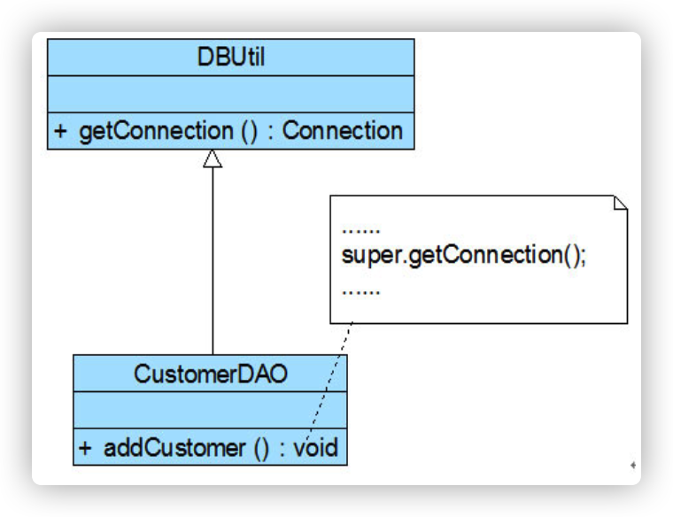

随着客户数量的增加，系统决定升级为Oracle数据库，因此需要增加一个新的`OracleDBUtil`类来连接`Oracle`数据库，由于在初始设计方案中`CustomerDAO`和`DBUtil`之间是继承关系，因此在更换数据库连接方式时需要修改`CustomerDAO`类的源代码，将`CustomerDAO`作为`OracleDBUtil`的子类，这将违反开闭原则。【当然也可以修改`DBUtil`类的源代码，同样会违反开闭原则。】

  现使用合成复用原则对其进行重构。

在实现复用时应该多用关联，少用继承。

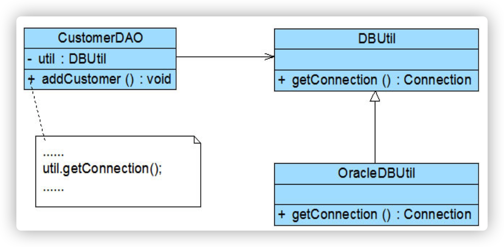

`CustomerDAO`和`DBUtil`之间的关系由继承关系变为关联关系，采用依赖注入的方式将`DBUtil`对象注入到`CustomerDAO`中，可以使用构造注入，也可以使用`Setter`注入。如果需要对`DBUtil`的功能进行扩展，可以通过其子类来实现，如通过子类`OracleDBUtil`来连接`Oracle`数据库。由于`CustomerDAO`针对`DBUtil`编程，根据里氏代换原则，`DBUtil`子类的对象可以覆盖`DBUtil`对象，只需在`CustomerDAO`中注入子类对象即可使用子类所扩展的方法。例如在`CustomerDAO`中注入`OracleDBUtil`对象，即可实现`Oracle`数据库连接，原有代码无须进行修改，而且还可以很灵活地增加新的数据库连接方式。


## 总结

**开闭**设计模式核心；

**依赖倒置**是达到**开闭**的手段；

**里氏替换**使**开闭**成了可能；

**单一职责**和**迪米特**需要时刻注意。


# 工厂模式

## 简单工厂模式

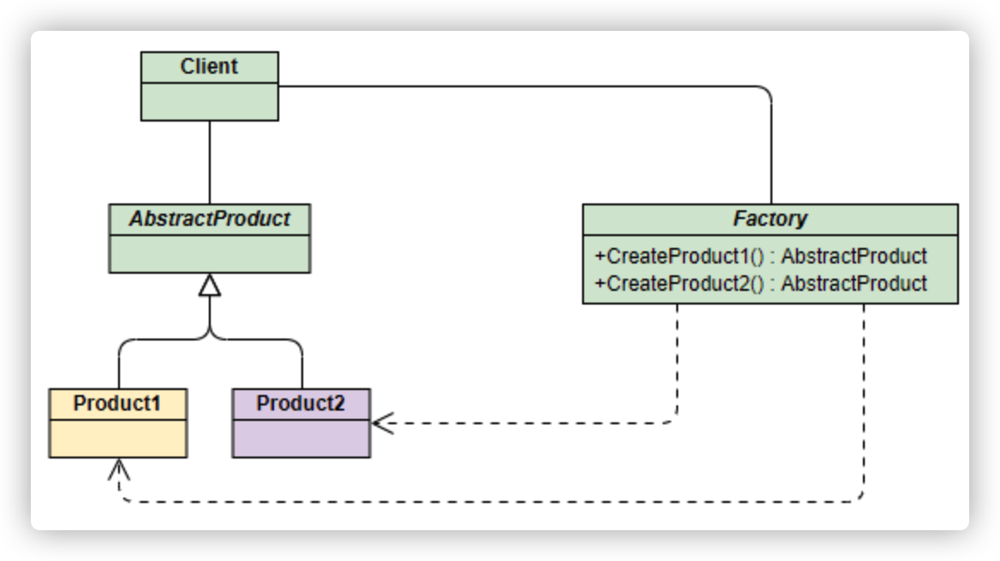

工程根据传入的参数不同产生不同的产品，具体产品都继承自抽象产品。

### `AbstractProduct`

```java
public interface Phone {
    void make();
}
```

#### `Product1`

```java
public class ApplePhone implements Phone {
    public ApplePhone() {
        this.make();
    }

    public void make() {
        System.out.println("Apple Phone");
    }
}
```

#### `Product2`

```java
public class XiaoMiPhone implements Phone{
    public XiaoMiPhone() {
        this.make();
    }

    public void make() {
        System.out.println("Mi Phone");
    }
}
```

### `Factory`

```java
public class NormalFactory {
    public void makePhone(String name) {
        Phone phone = null;
        if ("Mi".equals(name)) {
            phone = new XiaoMiPhone();
        } else {
            phone = new ApplePhone();
        }
        phone.make();
    }
}
```

### `Client`

```java
@Test
// normal factory
public void normalFactoryTest() {
    NormalFactory factory = new NormalFactory();
    factory.makePhone("Mi");
    factory.makePhone("Apple");
}
```

## 工厂模式

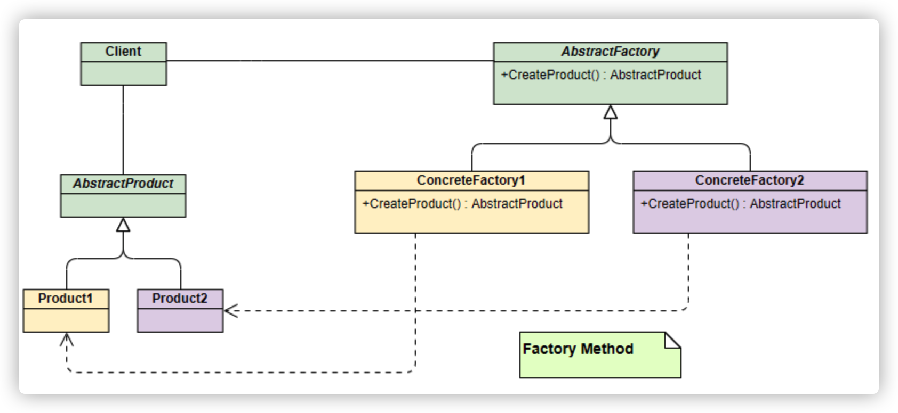

相比于简单工厂模式，工厂模式进一步将工厂进行了抽象，将生产任务的交给实际的工厂实现。

### `AbstractFactory`

```java
public interface AbstractFactory {
    Phone make();
}
```

#### `XiaoMiFactory`

```java
public class XiaoMiFactory implements AbstractFactory {

    public Phone make() {
        return new XiaoMiPhone();
    }
}
```

#### `AppleFactory`

```java
public class AppleFactory implements AbstractFactory{
    public Phone make() {
        return new ApplePhone();
    }
}
```

### `Client`

```java
@Test
// factory
public void factoryTest() {
    AbstractFactory factory1 = new XiaoMiFactory();
    AbstractFactory factory2 = new AppleFactory();
    factory1.make();
    factory2.make();
}
```


## 抽象工厂模式

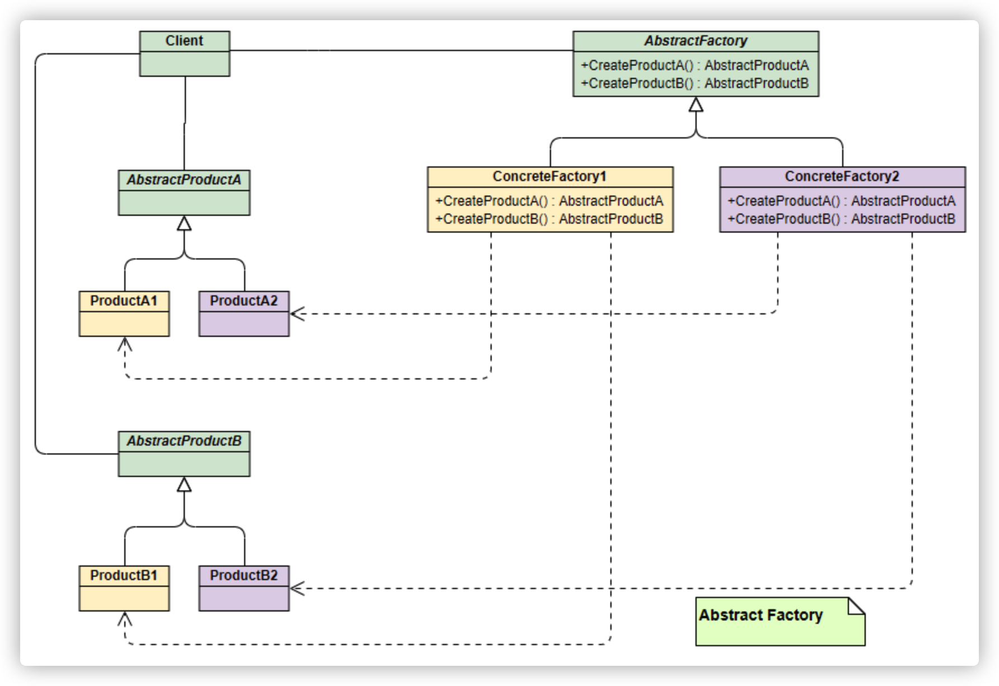

如果要生成另一种产品PC，最简单的方式是把2中介绍的工厂方法模式完全复制一份，不过这次生产的是PC。但同时也就意味着要完全复制和修改Phone生产管理的所有代码，显然这是一个笨办法，并不利于扩展和维护。

抽象工厂模式通过在AbstarctFactory中增加创建产品的接口，并在具体子工厂中实现新加产品的创建，当然前提是子工厂支持生产该产品。否则继承的这个接口可以什么也不干。

example：

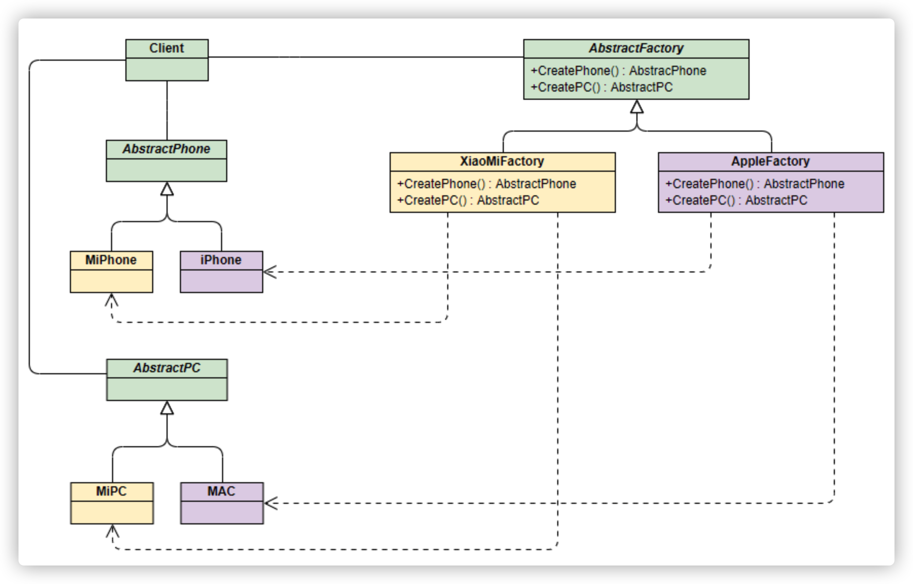

$$
\cancel P
$$
$a_{t} = \mu(s_{t}) $
