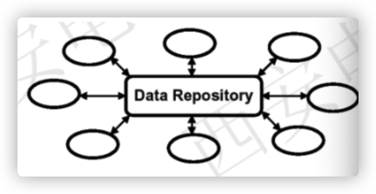

#### 4+1视图

让设计人员将一个系统进行自定向下的设计分解

* 逻辑视图$(logical-view)$：对系统职责逐级划分	类图
* 开发视图$(implementation-view)$
* 部署视图$(deployment-view)$：软件环境与物理环境的部署关系
* 过程视图$(process-view)$：逻辑架构元素之间的交互环境，考虑了非功能性要求

***

#### 并发子系统

* 许多相似的过程应该被视作同一单位，有很多进程，但在逻辑上他们属于同一单元
* 具有高度内部并发性的（线程）、进程应该被视作并发子系统
* 并发子系统始终是长期存在的

***

#### 执行模式（Execution Stereotype）

关注系统运行时结构

* 用户初始化$User-initaited$：组件因用户输入而执行操作，用户界面

* 活动$Active$：组件在内部生成活动（被激活、被唤醒）

* 服务$Service$：等待其他组件的请求并生成对此类请求的响应（如数据库、web、文件系统）

  $Example$：

  

***

#### 实现架构（Implementation Architecture）

重点在于系统的构建方式

实施系统需要哪些技术要素：如软件包、库。。。

* 应用程序组件：

  * 负责执行域级职责
  * 在详细的概念体系结构中找到的责任
  * 可以使纤维二进制包、源包和文件

* 基础结构组件：

  * 需要使系统运行，但与应用程序无关

    $example$：如web服务器中，http连接处理程序就是一个基础结构组件

***

#### 概念架构（Concept Architecture）

重点是域级职责

初步架构设计，对利益相关者的第一反应需要通过分析需求来设计

最初职责来自功能功能要求，但是设计是一个迭代过程，进一步的迭代考虑到非功能性需求

***

#### 以数据为中心的体系结构风格（Data-centere Style）

仓库是存储和维护数据的中心场所

* 中心数据结构

  * 表示当前数据的状态
  * 一组对中心数据进行操作的独立构件

  

* 连接件：仓库与独立构件之案件的交互

  * 数据库方式：输入流中的事务类型触发需要执行的过程
  * 黑板结构：中心数据结构的当前状态出发并选择需要执行的过程

##### 黑板模式

>
>
>黑板模式是一种常用的架构模式，应用中的多种不同数据处理逻辑相互影响和协同来完成数据分析处理。黑板模式允许多个消息读写者同时存在，消息的生产者和消费者完全分开。这就像一个黑板，任何一个教授（消息的生产者）都可以在其上书写消息，任何一个学生（消息的消费者）都可以从黑板上读取消息，两者在空间和时间上可以解耦，并且互不干扰。这种模式对于没有确定解决方案策略的问题是有用的。

* 知识源：包含独立的、与应用程序相关的知识，知识源之间不直接进行通讯，它们之间的交互只通过黑板来完成
* 黑板数据结构：按照与应用程序相关的层次来组织并解决问题的数据，知识源通过不断地改变黑板数据来解决问题
* 控制组件；完全由黑板的状态驱动，黑板状态的改变决定了需要使用的特定知识

> 黑板模式一般不会对架构产生什么影响，但它通常会要求有一个清晰的消息结构。黑板模式一般都会提供一系列的过滤器，以便消息的消费者不再接触到与自己无关的消息。在实际开发中，黑板模式常见的实现方式：
>
> 数据库作为黑板
>
> 利用数据库充当黑板，生产者更新数据信息，不同的消费者共享数据库中信息，这是最常见的实现方式。该方式在技术上容易实现，开发量较少，熟悉度较高。缺点是在大量消息和高频率访问的情况下，性能会受到一定影响。在该模式下，消息的读取是通过消费者主动“拉取”，因此该模式也叫做“拉模式”。
>
> 发布—订阅模式
>
> 这种实现方式通常采用消息队列作为黑板，队列工作在主题模式（Topic），专家作为队列的订阅者，同时可以向队列发送消息，消息会被发送至所有订阅者。以上过程实现了专家间的信息交流。

* **优点：**
  * 以数据为中心的体系结构，可以自然的表示大量的数据和事务处理的逻辑，适合表达以数据为中心的应用程序
  * 允许松散耦合的组件。
  * 确保数据完整性
  * 可靠、安全、可测试洗保证
  * 独立于系统的客户端：客户端性能和可靠性好
* **缺点：**
  * 只有很少一部分简单的数据库存储应用可以完全采用这种体系结构表示。
  * 可伸缩性、可靠性问题（单点故障）

##### 面向资源的架构

* 将Web视作一个庞大的数据库
* 数据模型：通过URL和相关联的节点寻址
* 操作方法：HTTP
* 可伸缩、性能好、可用性高

***

#### 数据流体系风格（Data Flow Style）

##### 批处理

数据整体运输

每个处理步骤是一个独立的程序，每一步必须在前一步结束后才能开始，数据必须是完整的，以整体的方式传递

##### 管道-过滤器

数据源源不断产生，系统需要对这些数据进行若干处理

每个处理步骤（过滤器）都有一组输入输出，过滤器从管道中读取输入的数据流，经过内部处理，然后产生输出数据流并写入管道

从源接收器逐步转换（递增的读取和消费数据流），数据到来时便被处理，不是收集后处理，而是输入被完全消费之前，输出便产生了

Batch vs Stream

***

#### 分层架构

分层：系统的结构被组织成一组图层，每层位于另一层的顶部

层间定义良好的接口

降低了复杂性，提高了模块化、可重用性、可维护性不同的分层标准：最显著的抽象

* 层间沟通，通常很少出现下层跳向上层进行沟通
* 较高层将下层视作一组服务
* 通常一层通信只与它的下层，并不总是，但通常

类似的如TCP/IP协议、OS、虚拟机

**优点：**

* 每个层只耦合到相邻的层
* 帮助进化，因为你可以交换一个单一的层，并限制对临近层的修改
* 帮助可重用性，因为层可以由多个系统使用，特别是如果通信标准化

**缺点：**

* 并不是所有的系统都能让自己在层次上组织起来
* 抽象可能会对性能产生负面影响
* 特定的优化不可能或很难找到正确地抽象级别
* 实践中大量的努力来实现影响多层的功能

多层体系结构符合十一条设计原则：

***

#### 通知架构（发布&订阅）

* 信息和活动由通知机制传播的体系结构
* 适合在设计时不知道的复杂的通信模式
* 对事件感兴趣的组件在事件发生时注册他们感兴趣的组件，然后被通知如GUI中的事件处理

**优点：**

* 松散连接
* 可以轻松的修改通知的接收
* 帮助修改

**缺点：**

* 不能控制流程
* 由于是异步的，可测试性差
* 不清楚应通过通知传递哪些数据
* 如果传递的数据太少，接收方可能要pull它（增加耦合）
* 由于更新风暴而导致性能为问题更糟的是，可能会变成无尽的循环

***

#### C/S

**优点：**

* 概念简单
* 明确职责分离，简化进化，可测试性好
* 良好的可伸缩性（特别是无状态）
* 良好的安全性，因为数据可以在服务器上持有限制访问

**缺点：**

* 如果客户端和服务器之间的通信速度较慢，或具有很高的滞后时间，则可能造成可用性/性能不佳的风险
* 需要开发/同意客户端和服务器之间的协议
* 对于有状态的，集中服务器的可伸缩性有限

***

#### P2P

* 删除客户端和服务器之间的分离
* 每个客户端都是同一时间的服务器，称为peer
* 目标是分发处理或数据在许多peer
* 没有中央管理或协调
* 每个peer提供服务或使用服务
* 所有peer之间可能发生通信
* P2P中的节点是动态的
* 每个peer都必须知道如何访问其他对等节点

**优点：**

* 极其优秀的可伸缩性，因为计算可以分布式
* 良好的可靠性，因为数据可以复制多个对等方
* 没有单点故障

**缺点：**

* 服务的质量是不确定的、不能保证的
* 延迟高
* 难以自保持和自测试

***

#### 远程调用架构

* 远程调用体系结构涉及分布式处理组件
* 客户端组件在远程组件上调用方法

**优点：**

* 通过分布式计算提高了性能
* 只有当网络是可靠快速的时候，通信开销才是可管理的

**缺点：**

* 组件紧密耦合
* 管理寻址（回忆对象的唯一标识）增加通信开销

***

#### 面向资源的体系结构（Resource- Oriented Architecture ROA）

* 寻址：作用域保存在URI
* 统一接口：方法信息保存在HTTP方法中（Get、Put、Delete、Post）
* 无状态：每个HTTP请求都与其他请求隔离
* 连通：将资源链接到资源网络

**任何两个资源都不可能是同一个，一个资源可以有一个或多个URL**

##### 无状态（Statelessness）

* 每个请求都包涵所有必要的信息
* 服务器端未管理任何状态
* 区分应用程序状态和资源状态
* 应用程序状态存活在客户端，资源状态存活在服务器端

##### 可寻址性

每一个资源可以根据URL找到

***

#### 面向服务的架构（Service- Oriented Architecture SOA）

一种设计、部署和管理应用程序饿软件基础结构的方法，其中：

1. 所有软件都被组织成网络可访问和执行的业务服务
2. 服务接口基于公共标准的互操作性

>SOA是一种设计方法，其中包含多个服务，而服务之间通过配合最终会提供一系列功能。一个服务通常以独立的形式存在于操作系统进程中。服务之间通过网络调用，而非采用进程内调用的方式进行通信。

为什么是SOA？

- 响应业务的更改
- 使用现有应用程序解决新需求
- 接触现有应用程序投资的锁定
- 支持新的通道和复杂的交互
- 支持有机业务

**SOA服务不一定是Web服务，在许多情况下它们差不多**

SOA特点：

* 服务具有平台独立、自描述的接口
* 消息被正式定义
* 可以发现服务
* 可以在任何平台上提供服务

服务：

* 可以被发现
* 可以组成
* 遵守协议
* 松散耦合
* 无状态
* 可重用

**SOA架构中有三种角色：**

* 服务提供者：发布自己的服务，并且对服务请求进行响应。
* 服务注册中心：注册已经发布的web service，对其进行分类，并提供搜索服务。
* 服务请求者：利用服务中心查找所需要的服务，然后使用该服务。

**SOA的三种操作：**

* 发布操作：为了使服务可访问，需要发布服务描述以使服务使用者可以发现它。
* 查找操作：服务请求者定位服务，方法是查询服务注册中心来找到满足其标准的服务。
* 绑定操作：在检索到服务描述之后，服务使用者继续根据服务描述中的信息来调用服务。

**SOA的相关标准——WSDL、UUDI、SOAP**

* SOAP: 简单对象访问协议 (Simple Object Access Protocol)
* WSDL: Web服务描述语言 WSDL (Web Services Description Language)
* UDDI: 统一描述、发现和集成 (Universal Description, Discovery and Integration) 

> WSDL用来描述服务；
>
> UDDI用来注册和查找服务；
>
> SOAP，作为传输层，用来在消费者和服务提供者之间传送消息。
>
> 一个消费者可以在UDDI注册表（registry）查找服务，取得服务的WSDL描述，然后通过SOAP来调用服务。

##### 设计原则

* **明确定义的接口：**服务请求者依赖于服务规约来调用服务，因此，服务定义必须长时间稳定，一旦公布，不能随意更改；服务的定义应尽可能明确，减少请求者的不适当使用；不要让请求者看到服务内部的私有数据。
* **自包含和模块化：**服务封装了那些在业务上稳定、重复出现的活动和构件，实现服务的功能实体是完全独立自主的，独立进行部署、版本控制、自我管理和恢复。
* **粗粒度：**服务数量不应该太多，依靠消息交互而不是远程过程调用，通常消息量比较大，但是服务之间的交互频度较低。
* **松耦合：**服务请求者可见的是服务的接口，其位置、实现技术、当前状态和私有数据等，对服务请求者而言是不可见的。
* **互操作性、兼容和策略声明：**为了确保服务规约的全面和明确，策略成为一个越来越重要的方面。这可以是技术相关的内容，例如，一个服务对安全性方面的要求；也可以是与业务有关的语义方面的内容，例如，需要满足的费用或者服务级别方面的要求，这些策略对于服务在交互时是非常重要的。

***

#### 质量属性

[$Source$](https://www.cnblogs.com/yeshenfeng/p/12354901.html)

##### 质量属性的组成：

* **Source of Stimulus：**This is some entity (a human, a computer system, or any  other actuator) that generated the  stimulus.

  > ​	一些产生刺激的外部实体如：人类、计算机系统

* **Stimulus：**The stimulus is a condition that needs to be considered when it arrives  at a system.

  > ​	当刺激在系统中发生时，刺激是一种需要被考虑的条件

* **Environment：**The stimulus occurs within certain conditions. The system may be  in an overload condition or may be running when the stimulus occurs, or some  other condition may be true.

  > ​	刺激发生一定的条件下。当刺激形成时，系统可能处于过载或者运行的情况下或者一些其他的情况

* **Artifact：**Some artifact is stimulated. This may be the whole system or some  pieces of it.

  > ​	一些制品（？组件）会被刺激。这可能是整个系统或者系统的一部分

* **Response：**The response is the activity undertaken after the arrival of the  stimulus.

  > ​	在刺激发生后会有一些响应活动

* **Response Measure：** When the response occurs, it should be measurable in some  fashion so that the requirement can be tested.

  > ​	当响应发生时，它应该在某些方面是可以被测量的以便需求的测量

##### 常见质量属性

* $Availability$：可用性是指系统正常工作的时间所占的比例。可用性会遇到系统错误，恶意攻击，高负载等问题的影响

  * 可用性与系统故障及其后果有关，当系统不在提供与其规范一致的服务时，系统出现故障。这种故障是可以被系统的用户或者其他系统观察到的
  * 关注的领域是：
    * 如何检测系统故障
    * 系统故障发生的频率
    * 出现故障后的后果
    * 系统还可以运行多久
    * 如何防止失败
    * 发生故障时需要哪些类型的通知

  >  区分故障和错误：
  >
  > 如果存在未被纠正或屏蔽的错误，则可能会导致故障。用户可以观察到错误，但是看不到错误；错误发生时会变得可观察，它就变为了一个失败

  * 故障检测：Ping/Echo、心跳、异常
  * 故障恢复：
    * 主动冗余：全部组件同时备份
    * 被动冗余：主组件备份完成后通知从组件进行备份
    * 备用：一个服务同时部署在多台机器上

* $Modifiability$：可修改性主要包含两方面，第一是修改什么（什么可以修改），第二个是何时以及由谁进行修改。

* $Performance$：性能与时间有关。事件发生时，系统必须对其作出响应。时间到达响应有很多特性，但性能基本上于事件发生时，将要消耗系统多长时间做出响应有关系。

* $Security$：安全性是衡量系统在向合法用户提供服务的同时，阻止非法授权使用的能力。

* $Testability$：通过测试揭示软件缺陷的容易程度。

* $Usability$：易用性关注的是对用户来说完成某个期望任务的容易程度和系统所提供的用户支持的种类。

* $Scalable$：可伸缩性是一种对软件系统计算处理能力的设计指标，高可伸缩性代表一种弹性，在系统扩展成长过程中，软件能够保证旺盛的生命力，通过很少的改动甚至只是硬件设备的添置，就能实现整个系统处理能力的线性增长，实现高吞吐量和低延迟高性能。**指系统通过增加或减少硬件水平从而提升或降低系统性能的难易程度**

* $Extensibility$：**是软件系统应对需求增加或需求变化的能力**

* $Availability\$Reliability$

  > ​	这两个概念很接近，后来在《分布式系统原理与范型》一书中提到，特此记录一下。
  > 可用性被定义为系统的一个属性，它说明系统已准备好，马上就可以使用。换句话说，高度可用的系统在任何给定的时刻都能及时地工作。
  > 可靠性是指系统可以无故障地持续运行。与可用性相反，可靠性是根据时间间隔而不是任何时刻来进行定义的。
  >
  > 作者举了一个例子来说明二者的区别。如果系统在每小时崩溃1ms，那么它的可用性就超过99.9999%，但是它还是高度不可靠。与之类似，如果一个系统从来不崩溃，但是每年要停机两星期，那么它是高度可靠的，但是可用性只有96%。[Source](https://blog.csdn.net/Jerry_liu20080504/article/details/92829793)
  >
  > 
  >
  > 提高可靠性需要强调减少系统中断（故障）的次数，提高可用性需要强调减少从灾难中恢复的时间。
  > A系统每年因故障中断十次，每次恢复平均要20分钟，B系统每年因故障中断2次，每次需5小时恢复。则A系统可用性比B系统高，但可靠性比B系统差。
  > 可靠性的量化指标是周期内系统平均无故障运行时间，可用性的量化指标是周期内系统无故障运行的总时间。一般提高可靠性的同时，也同时提高了可用性。[Source](https://blog.csdn.net/yuanchuanghhhh/article/details/6844023)

***

#### 胖客户端与瘦客户端

* **瘦客户端（Thin Client）**指的是在客户端-服务器网络体系中的一个基本无需应用程序的计算机终端。
* **胖客户端(Rich or Thick Client)** 是相对于“瘦客户端”(Thin Client)（基于Web的应用程序）而言的，它是在客户机器上安装配置的一个功能丰富的交互式的用户界面，例如Oracle、DB2数据库的客户端管理工具。

胖客户端和瘦客户端是相对的，之间的区别在于是否有大量的业务逻辑需要放在客户端。

***

#### 抽象用例(Essential Use Cases) 和 基础用例(Real Use Cases)

实体用于数据建模，而类用于面向对象建模。实体只有属性，而类有属性和操作。

Essential Use Cases(抽象用例)，Real Use Cases(基础用例)，这两者的区别为：基础用例是实实在在与用户需求有对应关系的用例，是从用户需求获取的渠道得到的，而抽象用例是从基础用例中抽取的用例的公共部分，是为了避免重复工作，优化结构而提出的用例