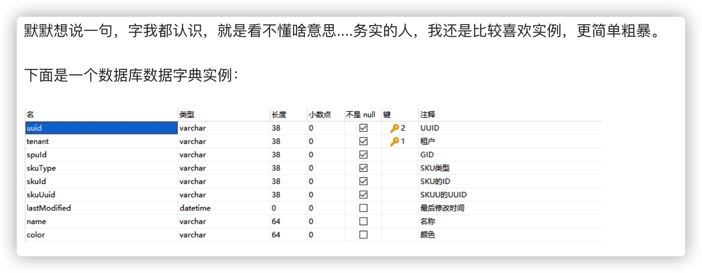

#### 快速原型模型

快速建立一个能反映用户主要需求的原型系统，让用户在计算机上试用它。

快速原型的关键在于尽可能快速地建造出软件原型，一旦确定了客户的真正需求，所建造的原型将被丢弃。因此，原型系统的内部结构并不重要，重要的是必须迅速建立原型，随之迅速修改原型，以反映客户的需求。

**优点**：克服[瀑布模型](https://baike.baidu.com/item/瀑布模型)的缺点，减少由于[软件需求](https://baike.baidu.com/item/软件需求)不明确带来的开发风险。

​	这种模型适合预先不能确切定义需求的软件系统的开发。

**缺点**：所选用的开发技术和工具不一定符合主流的发展；快速建立起来的系统结构加上连续的修改可能会导致产品质量低下。

***

####	RAD（快速应用开发）模型

业务建模$\rightarrow$数据建模$\rightarrow$过程建模$\rightarrow$应用生成$\rightarrow$测试修正

***

#### 螺旋模型

适用于庞大且复杂的项目

* 制定计划：确定软件目标，选定实施方案，弄清项目开发的限制条件；
* 风险分析：分析评估所选方案，考虑如何识别和消除风险；
* 实施工程：实施软件开发和验证；
* 客户评估：评价开发工作，提出修正建议，制定下一步计划。

**优点**

  1）设计上的灵活性,可以在项目的各个阶段进行变更。

  2）以小的分段来构建大型系统,使成本计算变得简单容易。

  3）客户参与每个阶段的开发,保证了项目不偏离正确方向及项目的可控性。

  4）客户始终掌握项目的最新信息, 能够和管理层有效地交互。

  5）客户认可这种公司内部的开发方式带来的良好的沟通和高质量的产品。

  **缺点**

  1）很难让用户确信这种演化方法的结果是可以控制的。

  2）建设周期长，而软件技术发展比较快，所以经常出现软件开发完毕后，和当前的技术水平有了较大的差距，无法满足当前用户需求。

***

#### 增量模型

**无需等到所有需求都出来，可以快速构造核心产品（小而可用的软件）**，把软件产品作为一系列的增量构件来设计、编码、集成和测试。每个构件由多个相互作用的模块构成，并且能够完成特定的功能

> 瀑布模型或快速原型模型目标是一次就把一个满足所有需求的产品提交给用户
>
> 增量模型把整个软件产品分解成许多个增量构件，分批地逐步向用户提交产品

**优点**

1. 能在较短的时间内向用户提交可完成部分工作的产品
2. 将待开发的软件系统模块化，可以分批次地提交软件产品，使用户可以及时了解软件项目的进展
3. 以组件为单位进行开发降低了软件开发的风险。一个开发周期内的错误不会影响到整个软件系统
4. 开发顺序灵活。开发人员可以对组件的实现顺序进行优先级排序，先完成需求稳定的核心组件。当组件的优先级发生变化时，还能及时地对实现顺序进行调整

**缺点**

1. 由于各个构件是逐渐并入已有的软件体系结构中的，所以加入构件必须不破坏已构造好的系统部分，这需要软件具备开放式的体系结构
2. 在开发过程中，需求的变化是不可避免的。
3. 如果增量包之间存在相交的情况且未很好处理，则必须做全盘系统分析。

***

#### RUP统一过程

先启、精化、构建、产品化。

软件生命周期贯穿整个过程

**与瀑布模型区别**：

RUP 是一个弹性模型，如果先启阶段所有用例都被详细描述那就是瀑布模型。RUP 模型是一个二维模型，在每个阶段都会涉及到软件生命周期的各个阶段。瀑布模型是一维的线性的。

***

#### Wasserman的软件工程规范

抽象、分析设计方法和符号、用户界面原型、软件体系结构、软件过程、复用、度量

***

#### 敏捷开发

* 宣言
  * 个体和交互 **胜过** 过程和工具
  * 可以工作的软件 **胜过** 面面俱到的文档
  * 客户合作 **胜过** 合同谈判
  * 响应变化 **胜过** 遵循计划

***

#### 极限编程

完整团队、计划游戏、客户测试、简单设计、结对编程、测试驱使开发、改进设计、持续集成、集体代码所有权、系统隐喻、可持续的速度、编码标准

***

#### Scrum

开发软件就像开发新产品，无法一开始就能定义软件产品最终的规程，过程中需要研发、创意、尝试错误，所以没有一种固定的流程可以保证专案成功。

#### 软件项目管理

为了使软件项目嫩狗按照预定的进度、质量顺利完成、而对成本人员进度质量风险等进行分析和管理活动

* 范围：人员、产品、过程、项目

***

#### WBS（任务分解结构图）

确定工作范围、配备人员、编制资源计划、监视进程、明确里程碑、内容的验证

* 拿到项目先进行任务分解
* WBS 主要是将一个项目分解成易于管理的几个部分或几个细目，以便确保找出完成项目工作范围所需

的所有工作要素，是一种在项目全范围内分解和定义各层次工作包的方法。

* WBS叶子结点为**可执行、指落地的工作任务并且有责任人、工作时长和产品**
* 基于可交付成果的划分
  * 上层一般为可交付结果为导向
  * 下层一般为可交付成果的工作内容
* 基于工作过程的划分
  * 上层按照工作的流程图
  * 下层按照工作的内容划分

***

#### 组织行为学

* 为工作选择最合适的人员
* 让这些人员采取最佳方法
* 给最好的工人易更高的工资来刺激

#### X,Y理论

1. **X理论**

   * 一般的人对工作有一种内在的不喜欢
   * 因此需要强迫，指导和控制
   * 人们有逃避责任的倾向

2. **Y理论**

   * 工作就想休息和玩耍一样自然
   * 外部的控制和强迫并非使大家一起为公司目标努力工作的唯一途径
   * 对目标的承诺是与成绩和报酬有关
   * 一般人能够学会拥有并扩大责任性
   * 想像和其他创造性能力广泛分布

3. 判断方法：

   观察管理者离开后员工的表现，如果表现没有变化，则处于Y理论中，如果每个人明显松弛下来，则为X理论

***

#### 程序设计小组组织形式

* 核心程序员制小组（高结构化）
* 民主制小组（松散结构）
* 层次式小组（高结构化和松散结构两者之间）

***

####  LOC、FP的优缺点

**LOC 优点**：

• 用软件代码行数估算软件规模简单易行。

**LOC 缺点**： 

• 代码行数的估算依赖于程序设计语言的功能和表达能力；

• 采用代码行估算方法会对设计精巧的软件项目产生不利的影响；

• 在软件项目开发前或开发初期估算它的代码行数十分困难；

• 代码行估算只适用于过程式程序设计语言（C,Pascal），对非过程式的程序设计语言不太适用等等。

**FP 优点**：

• 与程序设计语言无关，它不仅适用于过程式语言，也适用于非过程式的语言；

• 软件项目开发初期就能基本上确定系统的输入、输出等参数，功能点度量能用于软件项目的开发初期。

**FP 缺点**：

• 它涉及到的主观因素比较多， 如各种权函数的取值；

• 信息领域中的某些数据有时不容易采集；

• FP 的值没有直观的物理意义。

***

#### FP功能点估算分类

1. ILF：内部逻辑文件

   一组以用户角度识别的，在应用程序边界内且被维护的逻辑相关数据或者控制信息。ILF主要目的是通过应用程序的一个或多个基本处理过程来维护数据

2. EIF ：外部接口文件

   一组在应用程序边界内被查询，但它是在其他应用程序中被维护的，以用户角度来识别的，逻辑上相关的数据

3. EI：外部输入

   它处理的是来自本应用边界之外的一组数据或者控制信息。外部输入的基本目的是为了维护一个内部逻辑文件（ILF）或者改变系统的行为

4. EO：外部输出

   是指一个向应用边界之外发送数据或者控制信息的基本处理。外部输出的基本目的是为了向用户展示一组经过了除了提取之外的其他逻辑处理的数据或者控制信息（至少一个数学演算或者对衍生数据的生成。）外部输出也**可能**包括对内部逻辑文件（ILF）的维护或者对系统行为的改变

5. EQ：外部查询

   是指一个向应用边界之外发送数据或者控制信息的基本处理。外部查询的基本目的是为了向用户展示提取的数据或者控制信息。EQ的逻辑处理里面不包含数学公式或者计算以及对衍生数据的生成。外部查询不维护内部逻辑文件（ILF），也不会引起系统行为的改变

> 其中ILF和EIL属于数据类型的功能点，EI、EO、EQ属于人机交互类型的功能点

***

#### FP计算

$FP=未调整功能点\times[0.65+0.01\times\sum Fi复杂度调节值]$

$Fi$取值为0～5，当$Fi=0$时，表示$Fi$不起作用；当$Fi=5$时，表示$Fi$作用最大

* 生产率：$每人月完成的功能点数=\frac{FP}{软件项目工作量}$
* 平均成本：$每功能点的平均成本=\frac {项目的总开销} {FP}$
* 文档与功能点比：$每个功能点平均文档数=\frac {总文档数}{FP}$
* 代码出错率：$每个功能点的平均错误个数=\frac{总的错误数}{FP}$

***

#### 成本估计

* 专家估计：
  $$
  规模估算值e=\frac{乐观值+4\times最有可能值+悲观值}{6}\\
  工作量估算值=\frac{e}{平均生产率}\\
  成本估算值=e\times平均成本
  $$

* 算法方法：$E=(a+bS^c)m(X)$

  其中a,b,c是由经验导出的常数；E是人月单位的工作量；S是估算变量；X是1～N的成本向量；M是调整因子

$$
方差估算=\sigma^2=\frac{(最差估算-最佳估算)^2}{6}\\
标准差=\sigma
$$

***

#### 可靠性估算

* 错误植入法：向程序中植入$N_s$个错误，后来发现$n$个其中属于$N_s$的有$n_s$个，那么

  源程序错误估算M$M = \frac{n\cdot N_s}{n_s}$

* 分别测试法：$E_r = \frac{第一组测试员发现的错误数\cdot 第二组测试员发现的错误数}{两组测试员同时发现的错误数}$

***

#### 风险管理

识别评估风险，建立、选择、管理和解决风险的可选方案和组织方法

**风险标识**：潜在地风险列表

**风险预防**：优先级高的风险列表

**风险评估**：风险规划与应急计划

**风险管理与监控**：风险评估

影响软件风险的因素：性能、成本、支持和进度

***

#### 高质量的软件具备的条件

* 满足软件需求定义的功能和性能
* 文档符合事先确定的软件开发标准
* 软件的特点和属性遵循软件工程的目标和原则
* **质量控制**：保证每一件工作产品都满足需求而应用UI整个开发周期中的一系列审查、评审和测试
* **质量保证**：建立一套有计划、有系统的方法来向管理层保证拟定出的标准、步骤、实践和方法能够正确地被所有项目所采用

***

#### 软件质量评价特性

正确性、可靠性、易用性、效率、可维护性、可移植性

***

#### 软件质量控制

* 采用技术手段保证软件质量
* 组织技术评审
* 加强软件测试
* 推行软件工程标准
* 对软件的修改、变更进行严格控制
* 对软件质量今昔度量

***

#### 软件质量保证的目标

* 软件质量保证工作是有计划进行的
* 客观地验证软件项目产品和工作是否遵循恰当的标准、步骤和需求
* 将软件质量保证工作机结果通知给相关组别和个人
* 高级管理层接触到在项目内部不能解决的问题

由软件工程师、SQA小组承担

***

#### 软件评审

项目管理评审、技术评审

* 正式评审：评审会议、评审记录、评审报告

***

#### 软件配置管理

* 软件配置定义：软件配置是由软件工程过程中产生的所有信息项构成的，可以看作是该软件的具体形态在某一时刻的瞬间影像
* 软件配置管理定义：协调软件开发使得混乱减少到最小的技术叫做软件配置管理，它是一种标识、组织和控制修改的技术，目的是使错误达到最小并最有效的提高生产效率**贯穿整个软件生命周期与软件工程的过程**
* 目标：标识变更、控制变更、确保变更、报告变更

##### 基本概念

* 软件配置项：为配置管理设计的软件集合（1.	属于产品组成部分的工作成果；2.	在管理过程中产生的文档）
* 软件配置：软件产品在不同时期的组合
* 配置管理：应用技术的和管理的指导和监控方法以标识和说明配置想的功能和物理特征

##### 关键活动

配置项识别、配置空间管理、版本控制、变更控制、配置审计、状态报告

***

#### 需求工程

理解客户需要什么，分析要求，评估可行性，协商合理的方案，无歧义地详细说明方案，确认规格说明，管理需求以至于将这些需求转化为可运行的系统

* 主要工作产品：需求定义文档（客户角度）、需求规格说明（技术员）、配置管理文档（支持两个文档间直接对应）
* 导出需求：
  * 需求启动：确定利益共同者、识别多种观点、协同合作
  * 需求协同收集：准备列表（对象列表、服务列表、约束列表、性能列表）、召开评审会议、初步需求说明文档
* 分析建模：
  * 原因：建立分析模型从不同角度、抽象级别来说明对问题的理解；模型可帮助用户和分析人员发现、排除用户需求不一致，不合理的部分，挖掘潜在的用户需求；模型是分析人员根据初步导出的需求而创建的软件系统结构，包括相关的信息流、处理功能、用户界面、行为及设计约束；模型是形成需求规格说明、进行软件设计的基础
* 需求说明文档：
  * 软件需求规格说明文档是需求分析人员的最终工作产品
  * 使用者：后续的设计、开发、测试人员
  * 内容和格式：适合的就是最好的
* 需求定义文档
  * 需求定义文档包括顾客的属于描述的需求的记录。这个文档描述了用户和顾客想要看到的东西
  * 使用者：用户和顾客
* 需求确认和校验
  * 需求确认：用来检查获得的需求定义是否准确的反应了用户的实际需求
  * 需求校验：用来检查需求规格说明文档和需求定义文档是否一致

***

#### 需求类型

物理环境、界面（接口）、用户与人的因素、功能性、文档、数据、资源、安全性、质量保证

***

#### 结构化方法

* 定义：
  * 结构化方法是一种建模技术
  * 基于计算机的系统是数据流和一系列的转换构成的
  * 在模型的核心是数据词典，它描述了所有的在目标系统中使用的和生成的数据对象。（ERD、DFD、STD图）
* 组成：
  * 数据建模和对象描述
  * 功能建模和数据流图
  * 基本加工逻辑说明
  * 行为建模
  * 数据词典
* 基本思想：抽象与自顶向下的逐层分解（抽象、分解）
* 结构化分析模型：
  * 数据字典是模型的核心，包括软件使用和产下所有数据的描述
  * DFD数据流图：**用于功能建模**，描述系统的输入数据流如何编程输出数据流
  * ER实体关系图：**用于数据建模**，描述数据字典中数据的关系
  * STD状态迁移图：**用于行为建模**，描述系统接收那些外部事件
  * 数据对象描述：实体-关系图中每个数据对象的属性
  * 加工规格说明PSPEC：描述数据流图的每个功能
  * 控制规格说明CSPEC：描述软件控制的附加信息

***

#### 数据对象、属性与关系

* 数据对象：只封装数据，包括：数据流、数据源、外部实体的数据部分，不封装操作
* 数据属性：用“标识符、符号串和值”标识，描述数据对象的性质
* 数据关系：
  * 数据对象按照某种关系相互连接
  * 用对象-关系描述数据对象
  * 关系的命名及内涵应该反映描述的问题
  * 删除与问题无关的关系

***

#### 功能建模

***

#### 数据字典

数据流图描述了系统的分解，但没有对图中各个成分进行说明。数据字典就是为数据流图中的每个数据流、文件、加工，以及组成数据流或文件的数据项做说明。	

***

#### 耦合

* 泛化耦合：由于泛化关系的存在，有两个祖孙、父子关系的类间形成的一种逻辑关系
* 聚合：一种弱的拥有关系，A包含B，但B不是A的一部分
* 组合：一种强的拥有关系，体现了严格的部分和整体的关系，部分和整体有一样的生命周期
* 依赖：由于逻辑上相互协作，而形成的一种关系

***

#### 需求分析工作过程

需求描述、静态模型、动态模型、功能模型

***

#### 结构化与OO对比

* 概念方面：
  * 结构化是**功能**的集合，通过模块以及模块和模块之间的分层调用关系实现
  * OO是**事物**的集合，通过对象以及对象和对象之间的通讯联系实现
* 构成方面：
  * 数据+过程
  * （数据+操纵）的封装，以对象为中心
* 运行控制方面：
  * 顺序处理，过程驱动
  * 交互式、并行处理方式，由消息驱动控制
* 开发方面：设计；分析
* 应用方面：
  * 比较简单的数值计算和数据统计管理软件的开发
  * 大型复杂的人际交互式软件和数据统计管理软件的开发

***

#### 概念设计&技术设计

* 概念设计的任务与步骤：软件系统的结构、各模块功能及模块间联系
* 技术设计主要任务：编写技术设计说明书、技术设计是编码的先导

***

#### 创建设计的方法

模块分解、面向数据的分解、面向事件的分解、基于系统的用户输入、OO设计

***

#### 模块化

模块分解结果形成的组成部分称模块或组件

* 当系统的每一个功能正好由一个模块执行
* 当模块的输入输出被明确定义

****

#### 设计层次

体系结构、代码设计、执行设计

****

#### 防错和容错

N版本编程法、恢复块技术、防卫式程序设计

***

#### 设计的评估和确认

数学确认、测量设计质量、比较设计、设计评审

***

#### OO的设计的主要工作

用例实现精华、体系结构设计、构件设计、用户界面设计、数据持久设计、迭代精华

***

#### 用例实现方案设计：

* 提取边界类、实体类和控制类

  * 边界类：描述系统与外部环境的交互（界面控制、外部接口、环境隔离）

  * 控制类：作为完成用例责任的责任承担者，协调、控制其他类共同完成用例规定的功能或行为

    对于比较复杂的用例，控制类通常并不处理具体的任务细节，但是它应当知道如何分解任务，如何将子任务分派给适当的辅助类，如何在辅助类之间进行消息传递和协调

  * 实体类：标识目标软件系统中具有持久意义的信息项及其操作

* 构造交互图：将分析模型中的用例描述转换成UML交互图，以交互图作为用力的精确实现方案

  * 用例描述中包含事件流说明
  * 事件流中的事件应对于于交互图中的消息

* 精华类图：利用交互图精华分析模型中的类图。是一个反复迭代的过程

***

#### 构件设计

将软件体系结构的结构元素变换为对软件构件的过程性描述

* 在相对较低的抽象层次上详细地说明所有算法
* 精化每个构建的接口
* 定义构件级的接口
* 评审每个构件并修正所有已发现的错误

***

#### 数据持久存储服务

* 定义数据格式：考虑持久存储介质的特性，设计数据的存储格式
* 定义数据存取操作

***

#### OO设计的原则

单一职责、开放封闭、里氏替换、依赖倒置

***

